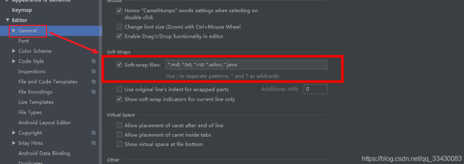

# K章 IDEA快捷键

## Alt + 系列

Alt + / 快速补全代码 (必须记住，也是最常用的)

Alt + Enter 快速提示完成，在代码可能存在语法问题时，IDEA 会提示使用该快捷键可以快速自动修正（功能非常强大，最常使用）

Alt + insert 快速生成含有任意形参的构造器，和私有属性的 Getter / Setter 方法等（最常使用）

Alt + Q 显示当前方法的声明

Alt + 7 快速显示类结构，可以显示类中包含的所有属性和方法

Alt + F7 查看引用

Alt + left / right 快速切换代码视图

Alt + Up / Down 在方法间快速移动定位（即光标以方法为单位移动）


## Ctrl +  系列

Ctrl + W 选中文本，连续按可以扩大选中范围（以单词为单位）

Ctrl + Y 删除当前行

Ctrl + D 复制当前行，直接在下一行复制出当前行 （Duplicate复制）

Ctrl + / 添加注释和取消注释，【第一次是添加注释，第二次是取消注释】

Ctrl + F 在当前文件中查找文本 （Find 查找）

Ctrl + R 查找并替换文本（基本可以完成Ctrl + F的功能），支持多行查找，或者只在代码中查找，或者只在注释中查找，或者使用正则表达式查找（Replace 替换）

Ctrl + O 快速重写基类或者接口中的方法 （Override 重写）

Ctrl + H 显示类结构图（类的继承层次） （Hierarhcy层级）

Ctrl + G 快速定位到指定行指定列

Ctrl + [ 快速定位到代码块开始位置

Ctrl + ] 快速定位到代码块结束位置

Ctrl + N 快速搜索和打开类 ==可以被double shift代替==

Ctrl + B 快速定位源码，将光标放在方法上输入 , 可以去到该方法的源码   ==可以被（Ctrl + 单击/Ctrl + Alt + 单击）代替==

Ctrl + U 快速转到当前类的父类


## Ctrl + Alt + 系列

Ctrl + Alt + T 将选中的代码使用 if、while、try/catch 等代码块包装起来（功能强大）

Ctrl + Alt + L 快速格式化代码

Ctrl + Alt + I 自动缩进行

Ctrl + Alt + O 优化导入的类和包

**Ctrl + Alt + ←** 上一次操作所在的位置（溯源时非常常用）


## Alt + Shift + 系列

Alt + Shift + 上/下 平移代码


## Ctrl + Shift + 系列

Ctrl + Shift + F 全局查代码（Find in Files）注意 把win系统的简繁体切换的快捷键关掉


## 其他系列

==双击shift==   SearchEverywhere


其他，诸如快递定位错误位置、折叠代码块、合并行等功能，要不是编辑器UI界面有直接的显示，要不就是用得比较少，可以自己手动处理。

以上就是个人在开发或调试中常用的快捷键了。平常使用基本够用了，再多些我也快记不住了


# S章 设置

## idea每次配环境都要看的设置

### 文件编码设置

File->Settings->Editor->File Encodings

```
Global Encoding:UTF-8
Projectt Encoding:UTF-8
Default encoding for properties files:UTF-8
勾选上Transparent native-to-ascii conversion
with NO BOM
```

### 自动导入所有包

在Intellij IDEA一次只能导入单个包，没有像Eclipse快速导入包的快捷键Ctrl+Shift+O，但是Intellij IDEA下有个自动导入包的功能。在File->Settings->Editor->General->Auto Import下进行配置

```
有个选的选ALL 全勾上
```

### 配Maven

File->Settings->Build,Execution,Deployment->Build Tools->Maven

大部分都学过

说点没注意到的

```
VM options for importer:可以设置导入的VM参数，一般这个都不需要主动改，除非项目真的导入太慢了我们再增大此参数
Import Maven projects automatically:表示IntelliJ IDEA会实时监控项目的pom.xml文件进行项目变动设置，建议进行勾选
Sources和Documentation:表示在Maven导入依赖包的时候是否自动下载源码和文档，默认是没有勾选的也不建议勾选，原因是这样可以加快项目从外网导入依赖包的速度，如果我们需要源码和文档的时候我们到时候再针对某个依赖包进行联网下载即可，IntelliJ IDEA 支持直接从公网下载源码和文档的
```


## idea设置代码根据屏幕的大小自适应换行

`Soft-wrap fils`,勾选后可以根据框内输入匹配的文件,让这些文件自动换行


