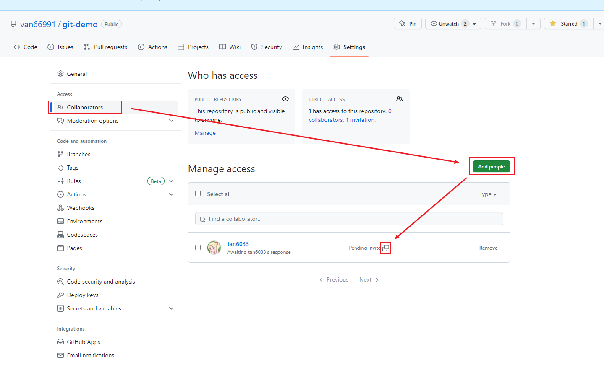
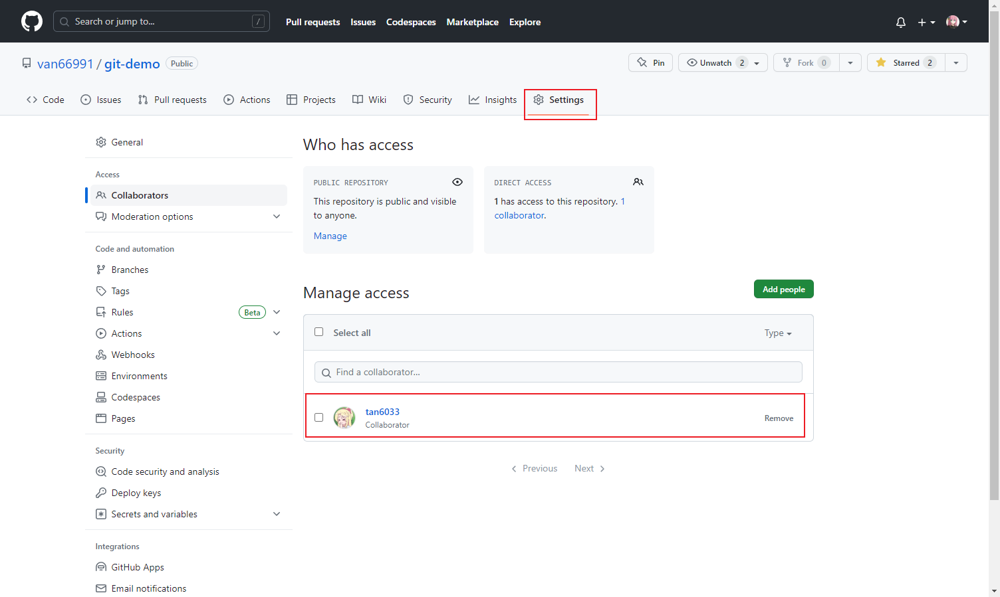

参考教程：尚硅谷Git、GitHub、Gitee码云、GitLab（IDEA版本）

* Git：十分简单！
  * Git安装 基于官网发布的最新版本2.31.1 安装讲解
  * Git命令 基于开发案例 详细讲解了git的常用命令
  * Git分支 分支特性 分支创建 分支转换 分支合并 代码合并冲突解决
  * Idea集成Git


* GitHub
  * 创建远程库
  * 代码推送 Push
  * 代码拉取 Pull
  * 代码克隆 Clone  （项目经理：把代码提前down下来看一下） 
  * SSH免密登陆
  * IDEA集成GitHub


* Gitee码云

  * 码云创建远程库
  * IDEA集成Gitee

  * 码云连接GitHub进行代码的复制和迁移


* GitLab
  * GitLab服务器的搭建和部署
  * IDEA集成GitLab


111111111111

# 1 Git安装与配置

官网地址： https://git-scm.com/ 

## 1.1 安装步骤

1)查看 GNU 协议，可以直接点击下一步。


2)选择 Git 安装位置，要求是非中文并且没有空格的目录，然后下一步


3)Git 选项配置，推荐默认设置，然后下一步。


4)Git 安装目录名，不用修改，直接点击下一步。


5)Git 的默认编辑器，建议使用默认的 Vim 编辑器，然后点击下一步。


6)默认分支名设置，选择让 Git 决定，分支名默认为 master，下一步。


7)修改 Git 的环境变量，选第一个，不修改环境变量，只在 Git Bash 里使用 Git。


8)选择后台客户端连接协议，选默认值 OpenSSL，然后下一步。


9)配置 Git 文件的行末换行符，Windows 使用 CRLF，Linux 使用 LF，选择第一个自动 转换，然后继续下一步。


10)选择 Git 终端类型，选择默认的 Git Bash 终端，然后继续下一步。


11)选择 Git pull 合并的模式，选择默认，然后下一步。


12)选择 Git 的凭据管理器，选择默认的跨平台的凭据管理器，然后下一步。


13)其他配置，选择默认设置，然后下一步。


14)实验室功能，技术还不成熟，有已知的 bug，不要勾选，然后点击右下角的 Install 按钮，开始安装 Git。 


15)点击 Finsh 按钮，Git 安装成功！


16）将git安装目录下的./cmd添加到系统环境变量。这样就能在cmd环境下使用git了（.bat批处理，idea的终端都能使用了）

## 1.2 check安装是否成功

1）右键任意位置，在右键菜单里选择 Git Bash Here 即可打开 Git Bash 命令行终端。


2）在 Git Bash 终端里输入 git --version 查看 git 版本，如图所示，说明 Git 安装成功。


# 2 Git常用命令

| 命令名称                             | 作用           |
| ------------------------------------ | -------------- |
| git config --global user.name 用户名 | 设置用户签名   |
| git config --global user.email 邮箱  | 设置用户签名   |
| git init                             | 初始化本地库   |
| git status                           | 查看本地库状态 |
| git add 文件名                       | 添加到暂存区   |
| git commit -m "日志信息" 文件名      | 提交到本地库   |
| git reflog                           | 查看历史记录   |
| git reset --hard 版本号              | 版本穿梭       |

## 2.1 设置用户签名

### 2.1.1 基本语法 

```bash
git config --global user.name 用户名 
git config --global user.email 邮箱
```

### 2.1.2 实操

```bash
Administrator@tansihao MINGW32 ~
$ git config --global user.name tan

Administrator@tansihao MINGW32 ~
$ git config --global user.email tan60332021@163.com
```

验证：去windows的家目录：C:\Users\Administrator找到.gitconfig文件

```
[user]
	name = tan
	email = tan60332021@163.com
```

说明： 签名的作用是区分不同操作者身份。用户的签名信息在每一个版本的提交信息中能够看 到，以此确认本次提交是谁做的。==Git 首次安装必须设置一下用户签名，否则无法提交代码。== 

**※注意**：这里设置用户签名和将来登录 GitHub（或其他代码托管中心）的账号没有任何关系。


## 2.2 初始化本地库

* 得让git获取本地目录的管理权


### 2.2.1 基本语法

```bash
git init
```

### 2.2.2 实操

```bash
Administrator@tansihao MINGW32 /e/git-space/git-demo
$ git init
Initialized empty Git repository in E:/git-space/git-demo/.git

Administrator@tansihao MINGW32 /e/git-space/git-demo (master)
$ ll -a
total 4
drwxr-xr-x 1 Administrator 197121 0 May 11 20:45 ./
drwxr-xr-x 1 Administrator 197121 0 May 11 20:44 ../
drwxr-xr-x 1 Administrator 197121 0 May 11 20:45 .git/
```


## 2.3 查看本地库状态

### 2.3.1 基本语法

```bash
git status
```

### 2.3.2 实操

1）刚创建文件夹的状态 git status

```bash
Administrator@tansihao MINGW32 /e/git-space/git-demo (master)
$ git status
On branch master

No commits yet

nothing to commit (create/copy files and use "git add" to track)
```

2）随便添加一个文件hello.txt，再使用git status

```bash
Administrator@tansihao MINGW32 /e/git-space/git-demo (master)
$ vim hello.txt

Administrator@tansihao MINGW32 /e/git-space/git-demo (master)
$ ll
total 1
-rw-r--r-- 1 Administrator 197121 256 May 11 20:53 hello.txt

Administrator@tansihao MINGW32 /e/git-space/git-demo (master)
$ cat hello.txt
hello git!hello
hello git!hello
hello git!hello
hello git!hello
hello git!hello
```

```bash
Administrator@tansihao MINGW32 /e/git-space/git-demo (master)
$ git status
On branch master

No commits yet

Untracked files:
  (use "git add <file>..." to include in what will be committed)
        hello.txt

nothing added to commit but untracked files present (use "git add" to track)
```

Untracked files: 未被追踪的文件

引出 git add 添加暂存区

## 2.4 添加暂存区

### 2.4.1 基本语法

```bash
git add 文件名
```

### 2.4.2 实操

1）使用 git add 刚刚未追踪的文件

```bash
Administrator@tansihao MINGW32 /e/git-space/git-demo (master)
$ git add hello.txt
warning: LF will be replaced by CRLF in hello.txt.
The file will have its original line endings in your working directory
```

2）再 git status

```bash
Administrator@tansihao MINGW32 /e/git-space/git-demo (master)
$ git status
On branch master

No commits yet

Changes to be committed:
  (use "git rm --cached <file>..." to unstage)
        new file:   hello.txt
```


## 2.5 提交本地库

### 2.5.1 基本语法

```bash
git commit -m "日志信息" 文件名
```

### 2.5.2 实操

1）提交本地库中hello.txt文件，并记录日志"my first commmit"

```bash
Administrator@tansihao MINGW32 /e/git-space/git-demo (master)
$ git commit -m "my first commmit" hello.txt
warning: LF will be replaced by CRLF in hello.txt.
The file will have its original line endings in your working directory
[master (root-commit) c240f13] my first commmit
 1 file changed, 16 insertions(+)
 create mode 100644 hello.txt
```

2）查看日志

```bash
Administrator@tansihao MINGW32 /e/git-space/git-demo (master)
$ git reflog
c240f13 (HEAD -> master) HEAD@{0}: commit (initial): my first commmit
```


## 2.6 修改文件（模拟企业中的版本迭代）

### 2.6.1 实操

1）用vim命令对hello.txt随便添加一点内容并保存。

2）git status 查看

```bash
Administrator@tansihao MINGW32 /e/git-space/git-demo (master)
$ git status
On branch master
Changes not staged for commit:
  (use "git add <file>..." to update what will be committed)
  (use "git restore <file>..." to discard changes in working directory)
        modified:   hello.txt

no changes added to commit (use "git add" and/or "git commit -a")
```

3）git add 添加暂存区

```bash
Administrator@tansihao MINGW32 /e/git-space/git-demo (master)
$ git add hello.txt
warning: LF will be replaced by CRLF in hello.txt.
The file will have its original line endings in your working directory
```

4）git commit 提交本地库

```bash
Administrator@tansihao MINGW32 /e/git-space/git-demo (master)
$ git commit -m "my second commit" hello.txt
warning: LF will be replaced by CRLF in hello.txt.
The file will have its original line endings in your working directory
[master 187bd2b] my second commit
 1 file changed, 1 insertion(+), 1 deletion(-)
```

5）git status + git reflog 查看状态和版本信息

```bash
Administrator@tansihao MINGW32 /e/git-space/git-demo (master)
$ git status
On branch master
nothing to commit, working tree clean
```

```bash
Administrator@tansihao MINGW32 /e/git-space/git-demo (master)
$ git reflog
187bd2b (HEAD -> master) HEAD@{0}: commit: my second commit
c240f13 HEAD@{1}: commit (initial): my first commmit
```

## 2.7 历史版本

### 2.7.1 基本语法 

```bash
git reflog 			查看版本信息 

git log 			查看版本详细信息
```

### 2.7.2 实操

```bash
Administrator@tansihao MINGW32 /e/git-space/git-demo (master)
$ git reflog
e8dd43b (HEAD -> master) HEAD@{0}: commit: my 3rd commit
187bd2b HEAD@{1}: commit: my second commit
c240f13 HEAD@{2}: commit (initial): my first commmit
```


## 2.8 版本穿梭

### 2.8.1 基本语法

```bash
git reset --hard 版本号
```


### 2.8.2 实操

1）回到第二个版本187bd2b

```bash
Administrator@tansihao MINGW32 /e/git-space/git-demo (master)
$ git reset --hard 187bd2b
HEAD is now at 187bd2b my second commit
```

2）git reflog 验证

```bash
Administrator@tansihao MINGW32 /e/git-space/git-demo (master)
$ git reflog
187bd2b (HEAD -> master) HEAD@{0}: reset: moving to 187bd2b
e8dd43b HEAD@{1}: commit: my 3rd commit
187bd2b (HEAD -> master) HEAD@{2}: commit: my second commit
c240f13 HEAD@{3}: commit (initial): my first commmit
```

187bd2b (HEAD -> master) HEAD@{2}: commit: my second commit 已经指向了第二个版本

3）查看 .\\.git\refs\heads 文件验证


```
Git 切换版本，底层其实是移动的 HEAD 指针
```


# 3 Git分支


## 3.1 什么是分支？分支的好处？ 

* 在版本控制过程中，同时推进多个任务，为每个任务，我们就可以创建每个任务的单独 分支。使用分支意味着程序员可以把自己的工作从开发主线上分离开来，开发自己分支的时 候，不会影响主线分支的运行。
* 对于初学者而言，分支可以简单理解为副本，一个分支就是一个单独的副本。（分支底层其实也是指针的引用）


* 同时==并行==推进多个功能开发，提高开发效率。 各个分支在开发过程中，如果某一个分支开发失败，不会对其他分支有任何影响。失败的分支删除重新开始即可。

## 3.2 分支的查看/创建/切换

### 3.2.1 查看分支 git branch -v

```bash
Administrator@tansihao MINGW32 /e/git-space/git-demo (master)
$ git branch -v
* master 187bd2b my second commit
```


### 3.2.2 创建分支 git branch 分支名

```bash
Administrator@tansihao MINGW32 /e/git-space/git-demo (master)
$ git branch hot-fix

Administrator@tansihao MINGW32 /e/git-space/git-demo (master)
$ git branch -v
  hot-fix 187bd2b my second commit
* master  187bd2b my second commit

```


### 3.2.3 切换分支 git checkout 分支名

```bash
Administrator@tansihao MINGW32 /e/git-space/git-demo (master)
$ git checkout hot-fix
Switched to branch 'hot-fix'

Administrator@tansihao MINGW32 /e/git-space/git-demo (hot-fix)
$ git branch -v
* hot-fix 187bd2b my second commit
  master  187bd2b my second commit

```


### 3.2.4 修改分支（模拟企业中的热修复）

1）在hot-fix分支上修改 hello.txt

```bash
Administrator@tansihao MINGW32 /e/git-space/git-demo (hot-fix)
$ vim hello.txt

Administrator@tansihao MINGW32 /e/git-space/git-demo (hot-fix)
$ git status
On branch hot-fix
Changes not staged for commit:
  (use "git add <file>..." to update what will be committed)
  (use "git restore <file>..." to discard changes in working directory)
        modified:   hello.txt

no changes added to commit (use "git add" and/or "git commit -a")

```


2） 对这次修改 添加暂存区add 提交本地库commit

git add hello.txt

git commit -m "hot-fix 1st commit" hello.txt

```bash
Administrator@tansihao MINGW32 /e/git-space/git-demo (hot-fix)
$ git add hello.txt

Administrator@tansihao MINGW32 /e/git-space/git-demo (hot-fix)
$ git status
On branch hot-fix
Changes to be committed:
  (use "git restore --staged <file>..." to unstage)
        modified:   hello.txt


Administrator@tansihao MINGW32 /e/git-space/git-demo (hot-fix)
$ git commit -m "hot-fix 1st commit" hello.txt
[hot-fix ea6546b] hot-fix 1st commit
 1 file changed, 1 insertion(+), 1 deletion(-)

Administrator@tansihao MINGW32 /e/git-space/git-demo (hot-fix)
$ git status
On branch hot-fix
nothing to commit, working tree clean

```

3）查看历史版本

```bash
Administrator@tansihao MINGW32 /e/git-space/git-demo (hot-fix)
$ git reflog
ea6546b (HEAD -> hot-fix) HEAD@{0}: commit: hot-fix 1st commit
187bd2b (master) HEAD@{1}: checkout: moving from master to hot-fix
187bd2b (master) HEAD@{2}: reset: moving to 187bd2b
e8dd43b HEAD@{3}: reset: moving to e8dd43b
187bd2b (master) HEAD@{4}: reset: moving to 187bd2b
e8dd43b HEAD@{5}: commit: my 3rd commit
187bd2b (master) HEAD@{6}: commit: my second commit
c240f13 HEAD@{7}: commit (initial): my first commmit
```


## 3.3 分支的合并 git merge 分支名

### 3.3.1 实操：在 master 分支上合并 hot-fix 分支

```
注意：一定是站在master分支上去合并需要被合并的分支
```

```bash
Administrator@tansihao MINGW32 /e/git-space/git-demo (master)
$ git merge hot-fix
Updating 187bd2b..ea6546b
Fast-forward
 hello.txt | 2 +-
 1 file changed, 1 insertion(+), 1 deletion(-)

```


### 3.3.2 合并产生冲突

1）在master分支把文件改成这样 add commit


2）在hot-fix分支把文件改成这样 add commit


3）在master分支合并hot-fix分支

```bash
Administrator@tansihao MINGW32 /e/git-space/git-demo (master)
$ git merge hot-fix
Auto-merging hello.txt
CONFLICT (content): Merge conflict in hello.txt
Automatic merge failed; fix conflicts and then commit the result.

Administrator@tansihao MINGW32 /e/git-space/git-demo (master|MERGING)
```

一个是：CONFLICT (content): Merge conflict in hello.txt

还有一个是： (master|MERGING)


**冲突产生的原因**： 

* 合并分支时，两个分支在同一个文件的同一个位置有两套完全不同的修改。Git 无法替我们决定使用哪一个。必须人为决定新代码内容。

4）查看状态（检测到有文件有两处修改）

```bash
Administrator@tansihao MINGW32 /e/git-space/git-demo (master|MERGING)
$ git status
On branch master
You have unmerged paths.
  (fix conflicts and run "git commit")
  (use "git merge --abort" to abort the merge)

Unmerged paths:
  (use "git add <file>..." to mark resolution)
        both modified:   hello.txt

no changes added to commit (use "git add" and/or "git commit -a")

```

### 3.3.3 手动解决冲突

1）编辑有冲突的文件，删除特殊符号，决定要使用的内容

```
特殊符号：
<<<<<<< HEAD 当前分支的代码 ======= 合并过来的代码 >>>>>>> hot-fix
```


2）添加到暂存区

3）提交本地库（注意：此时使用 git commit 命令时==不能带文件名==）


(master|MERGING) 恢复正常 冲突解决


# 4 Git团队协作机制

## 4.1 团队内协作


## 4.2 跨团队协作


# 5 IDEA集成Git

## 5.1 环境准备

### 5.1.1 配置 Git 忽略文件

以下文件需要被忽略：

1）Eclipse 特定文件


2）IDEA 特定文件


3）Maven 工程的 target 目录


```
为什么要忽略他们？
与项目的实际功能无关，不参与服务器上部署运行。把它们忽略掉能够屏蔽 IDE 工具之间的差异。
```

#### 忽略步骤

1）创建忽略规则文件 git.ignore

* 这个文件的存放位置原则上在哪里都可以，为了便于让~/.gitconfig 文件引用，建议也放在用户家目录下 

* git.ignore 文件模版内容如下：

```
# Compiled class file
*.class
# Log file
*.log
# BlueJ files
*.ctxt
# Mobile Tools for Java (J2ME)
.mtj.tmp/
# Package Files #
*.jar
*.war
*.nar
*.ear
*.zip
*.tar.gz
*.rar
# virtual machine crash logs, see
http://www.java.com/en/download/help/error_hotspot.xml
hs_err_pid*
.classpath
.project
.settings
target
.idea
*.iml
```

2）在.gitconfig 文件中引用忽略配置文件（此文件也在 Windows 的家目录中）

```
[user]
	name = tan
	email = tan60332021@163.com
[core]
	excludesfile = C:/Users/Administrator/git.ignore
注意：这里要使用“正斜线（/）”，不要使用“反斜线（\）”
```

### 5.1.2 定位Git程序


### 5.1.3 初始化本地库


高版本的是直接 Create Git Repository


## 5.2 添加暂存区 - git add

右键点击项目选择 Git -> Add 将项目添加到暂存区。


## 5.3 提交本地库 - git commit

右键点击项目选择 Git -> Commit Directory 将项目提交本地库。


新版本：


## 5.4 查看日志历史 - git reflog


# 6 GitHub操作

GitHub 网址：https://github.com/

## 6.1 创建远程仓库


## 6.2 远程仓库常用操作

| 命令语法                          | 作用                                                     |
| --------------------------------- | -------------------------------------------------------- |
| git remote -v                     | 查看当前所有远程地址别名                                 |
| git remote add 别名 远程地址      | 起别名                                                   |
| git push 远程库地址/别名 本地分支 | 推送本地分支上的内容到远程仓库                           |
| git clone 远程地址                | 将远程仓库的内容克隆到本地                               |
| git pull 远程库地址/别名 远程分支 | 将远程仓库对应分支最新内容拉下来后与当前本地分支直接合并 |

### 6.2.1 查看别名/创建远程仓库别名

#### 1）基本语法

```
git remote -v ：查看当前所有远程地址别名
git remote add 别名 远程地址 ：起别名
```

#### 2）实操

```bash
Administrator@tansihao MINGW32 /e/git-space/git-demo (master)
$ git remote add git-demo https://github.com/van66991/git-demo.git

Administrator@tansihao MINGW32 /e/git-space/git-demo (master)
$ git remote -v
git-demo        https://github.com/van66991/git-demo.git (fetch)
git-demo        https://github.com/van66991/git-demo.git (push)
```

https://github.com/van66991/git-demo.git 

这个地址在创建完远程仓库后生成的连接，如图所示红框中


### 6.2.2 推送本地库到远程库

#### 1）语法

```
git push 远程库地址/别名 本地分支
```

#### 2）实操


成功的情况：


### 6.2.3 拉取远程库到本地库

#### 1）语法

```
git pull 远程库地址/别名 远程分支
```

#### 2）实操


```bash
Administrator@tansihao MINGW32 /e/git-space/git-demo (master)
$ cat hello.txt
hello git!hello 22222
hello git!hello
hello git!hello
hello git!hello
hello git!hello
hello git!hello
hello git!hello
hello git!hello
hello git!hello
hello git!hello
hello git!hello
hello git!hello
hello git!hello
hello git!hello
hello git!hello master changed it
hello git!hello
hello git!hello hot-fix changed it again
远程库的修改...
```


### 6.2.4 克隆远程仓库到本地

#### 1）语法

```bash
git clone 远程地址
```

#### 2）实操

* 目的：拉一个v2rayN的项目下来

1. 退到/e/git-space目录下

2. 找到v2rayN的github网页：


3. 复制红框内的地址，使用语法

```bash
Administrator@tansihao MINGW32 /e/git-space
$ git clone https://github.com/2dust/v2rayN.git
Cloning into 'v2rayN'...
remote: Enumerating objects: 9696, done.
remote: Counting objects: 100% (88/88), done.
remote: Compressing objects: 100% (42/42), done.
```

4. 查看本地情况：如图


## 6.3 Github上的团队内协作

### 6.3.1 van66991邀请tan6033加入团队



1. * 复制下来这样一个网址：https://github.com/van66991/git-demo/invitations
   * 将这个发送给你的合作人，这里是我的小号tan6033

2. * 小号tan6033在另一个环境下同意后：大号van66991的git-demo页面如图



### 6.3.2 tan6033就可以clone、修改并push到远程仓库

## 6.4 Github跨团队协作

先不写


## 6.5 SSH免密登录

### 6.5.1 获得id_rsa.pub公钥

1.  进入用户的家目录 ~

```
windows的家目录是 C:/用户/${你的用户名}/
```

2.  如果有.ssh文件夹就删除
3. （重点）运行命令生成.ssh 秘钥目录

```bash
ssh-keygen -t rsa -C 1134312725@qq.com
```

输入命令后连续点三次回车

4. 复制生成的.ssh文件夹下的id_rsa.pub的全部内容，登录 GitHub，点击用户头像→Settings→SSH and GPG keys


接下来再往远程仓库 push 东西的时候使用 SSH 连接就不需要登录了。


## 6.6 配合bat批处理标本实现一键push

### 6.6.1 添加gitcmd环境变量

添加git安装目录下./cmd/添加到环境变量path

### 6.6.2 在.git目录下创建push_to_github.bat

```bash
@echo off
chcp 65001 > nul
echo push_to_github.bat 启动...
setlocal

:: 获取当前系统时间
set "time=%TIME:~0,8%"
echo 当前时间：%time%

:: 获取当前系统日期
set "date=%DATE:~3%"
echo 当前日期：%date%

set "COMMIT_MSG=push_to_github.bat脚本自动提交 %date% %time%"

:: 这是远程仓库的别名/全地址
set "REPO_ADDR=note"

echo.
echo 开始添加暂存区...
git add .
IF ERRORLEVEL 1 (
    echo 添加失败！请检查是否有文件需要添加。
    pause
) ELSE (
    echo 添加成功！
)

echo.
echo 开始提交本地库...
git commit -m "%COMMIT_MSG%"
IF ERRORLEVEL 1 (
    echo 提交失败！请检查是否有更改需要提交。
    pause
) ELSE (
    echo 提交本地库成功！
)

:push
echo.
echo 正在将本地仓库master分支推送到GitHub...
git push %REPO_ADDR% master
IF ERRORLEVEL 1 (
    echo 推送失败！请检查远程库是否存在，以及是否有推送权限。
    echo 是否重新推送？[Y/N]
    set /p choice=
    if /i "%choice%"=="Y" (
        goto push
    ) else (
        echo 推送已取消！
        pause
        exit /b
    )
)
echo 推送完成！
pause
```

