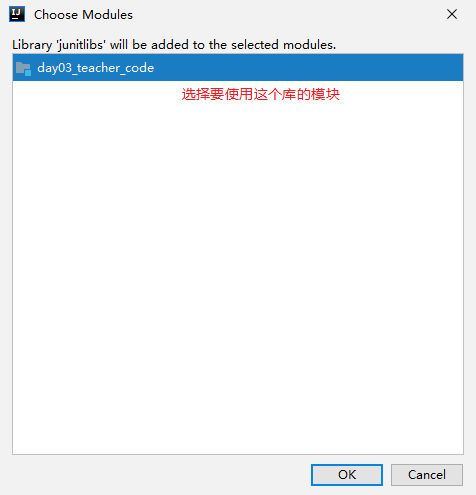
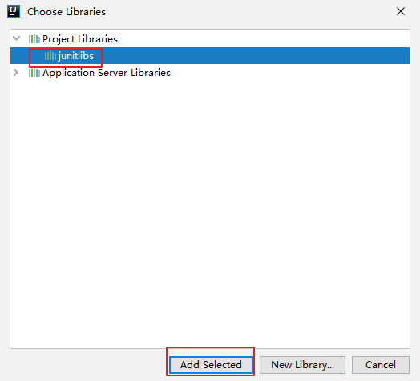

#  序章 编程入门

```
个人理解都写在这灰色块里
```

## 0-1 入门概述

计算机包括**硬件**和**软件**两部分。硬件包括计算机中可以看得见的物理部分。而软件提供看不见的指令。这些指令控制硬件并且使得硬件完成特定的任务。

### 0-1-1 程序设计

●**定义**：创建（或开发）软件。软件包含了指令，告诉计算机做什么。 

●**应用场景**：软件遍布我们周围。除了个人计算机，飞机、汽车、手机甚至烤面包机中，同样运行着软件。

### 0-1-2 程序设计语言 

软件开发人员在称为程序设计语言的强大工具的帮助下创建软件。

## 0-2 计算机硬件介绍


**冯·诺依曼体系结构** 是现代计算机的基础，现在大多计算机仍是冯·诺依曼计算机的组织结构，只是作了一些改进而已，并没有从根本上突破冯体系结构的束缚。冯·诺依曼 也因此被人们称为“计算机之父”。

### 0-2-1 中央处理器

**中央处理器（Central Processing Unit，CPU）**-> 计算机的大脑，从内存中获取指令然后执行他们

包括 ***控制单元*** 和 ***算术/逻辑单元***

​	***控制单元***：用于**控制**和**协调**其他组件的动作。 

​	***算术/逻辑单元***：用于完成数值运算(+、-、*、/)和逻辑运算(比较)。

每台计算机都有一个*内部时钟*，该时钟*以固定速度发射电子脉冲*。时钟速度越快，在给 定的时间段内执行的指令就越多。速度的计量单位是赫兹(Hz)，1Hz相当于每秒1个脉 冲。随着CPU速度不断提高，目前以千兆赫(GHz)来表述。  

1Khz=1024hz

1Mhz=1024Khz

1Ghz=1024Mhz

最初一个CPU只有一个核(core)。核是处理器中实现指令读取和执行的部分。一个多核 CPU是一个具有两个或者更多独立核的组件。可提高CPU的处理能力。

### 0-2-2 存储设备

●*内存中的信息在断电时会丢失*。那我们可以考虑将程序和数据永久的保存在存储设备上。当计算机 确实需要这些数据时，再移入内存，因为从内存中读取比从存储设备读取要快得多。

● 存储设备主要有以下三种：

1.磁盘驱动器 每台计算机至少有一个硬盘驱动器。硬盘(hard disk) 用于永久的保存数据和程序。

2.光盘驱动器(CD和DVD) CD的容量可达700MB。 DVD的容量可达4.7GB。

3.USB闪存驱动器 USB: Universal Serial Bus，通用串行总线。 可以使用USB将打印机、数码相机、鼠标、外部硬盘驱动器连接到计算机上。 USB闪存驱动器很小，可用于存储和传输数据的设备。

### 0-2-3 内存

● **比特bit与字节byte**

```
1byte=1B=8bit 字节就是B 1KB1MB的那个B
```

● 在讨论内存前，先清楚数据是如何存储在计算机中的：计算机就是一系列的电路开关。每个开关存在两种状态：关(off)和开(on)。如果电路 是开的，它的值是1。如果电路是关的，它的值是0。

● 一个0或者一个1存储为一个比特(bit)，是计算机中最小的存储单位。 

● ==计算机中是最基本的存储单元是字节(byte) 。==每个字节由8个比特构成。

● 计算机的存储能力是以字节和多字节来衡量的。如下：

​		千字节(kilobyte,KB) = 1024B 

​		兆字节(megabyte,MB) = 1024KB 

​		千兆字节(gigabyte,GB) = 1024MB 

​		万亿字节(terabyte,TB) = 1024GB


● 内存（Random-Access Memory,RAM）的定义：由一个有序的字节序列组成，用于存储程序及程序需要的数据。

● 每个字节都有一个唯一的地址。见下图。使用这个地址确定 字节的位置，以便于存储和获取数据。


```
硬件方面使电脑变快的三个方法：换CPU（换电脑）、加内存条、系统和关键软件装在固态硬盘里
```

● ==一个程序和它的数据在被CPU执行前必须移到计算机的内存 中。==

● 实测发现：==内存存取数据的速度比硬盘的存取速度快10倍==，在某些环境里，硬盘和内存之 间的速度差距可能会更大。而==CPU的速度比内存不知还要快多少倍==。当我们把程序从硬盘 放到内存以后，CPU就直接在内存运行程序，这样比CPU直接在硬盘运行程序就要快很多。内存解决了一部分CPU运行过快，而硬盘数据存取太慢的问题。 提高了我们的电脑的运行 速度。内存就如同一条“高速车道”一般，数据由传输速度较慢的硬盘通过这条高速车道 传送至CPU进行处理！

● ==但内存是带电存储的(一旦断电数据就会消失)，而且容量有限，所以要长时间储存程序或数 据就需要使用硬盘。==

内存在这里起了两个作用：

1. 保存从硬盘读取的数据，提供给CPU使用 
2. 保存CPU的一些临时执行结果，以便CPU下次使用或保存到硬盘

### 0-2-4 输入输出设备

● 常见的输入设备：键盘（keyboard）和鼠标（mouse）

● 常见的输出设备：显示器（monitor）和打印机（printer）

●显示器屏幕分辨率：是指显示设备水平和垂直方向上显示的像素(px)数。 

​	□ 分辨率可以手工设置。

​	□ 分辨率越高，图像越锐化、越清晰。

## 0-4 操作系统


操作系统(Operating System)是运行在计算机上的最重要的 程序，它可以管理和控制计算机的活动。

```
操作系统OS也是程序 但是是程序的老大
```

## 0-5 万维网 

万维网（World Wide Web,www,环球信息网）常简称为Web。分为Web客户端和Web服务器程序。 WWW可以让**Web客户端（常用浏览器）访问浏览Web服务器上的页面**。 是一个由许多互相链接的超文本组 成的系统，通过互联网访问。在这个系统中，每个有用的事物，称为一样“资 源”；并且由一个**全局“统一资源标识符”（URI）**标识；这些资源通过**超文本传输协议（Hypertext Transfer Protocol）**传送给用户，而后者通过点击链接来获得资源。

```
URI就是www.bilibili.com
B/S browse/server bilibili youtube
C/S client/server qq 微信
```

## 0-6 职业发展与提升


## 0-7 学习经验探讨

* 锻炼“双核”处理，边听讲思考，边做“笔记”

* 纸上得来终觉浅，绝知此事要躬行！

- 第一层次：看得懂（依赖于视频、书、帖子）

- 第二层次：练的熟（每天代码实现两到三遍）

```
第一遍先看一行写一行 然后第二遍默写忘了看
```

- ==三分看，七分练==

* 建立行之有效的学习方法

- 学习编程的捷径：**敲，狂敲**

- “**模仿**”好的编码习惯

- 整理、回顾：**每天整理**知识框架

# 第一章 Java语言概述

- Java基础是学习JavaEE、大数据、Android开发 的基石！

## 1-0 java课程体系

### 1-0-1 知识体系图解

-

```
基础程序设计下面那一行所有的编程语言都有
```

## 1-1 软件开发介绍

### 1-1-1 软件开发定义

软件，即一系列按照特定顺序组织的计算机数据和指令的集合。有**系统软件**和**应用软件**之分。

```
系统软件就是操作系统
```

```
软件 就是一堆代码
```

### 1-1-2 两种人机交互方式

* 图形化界面(Graphical User Interface GUI)：这种方式简单直观，使用 者易于接受，容易上手操作。 

* 命令行方式(Command Line Interface CLI)：需要有一个控制台，输入特定的指令，让计算机完成一些操作。较为麻烦，需要记录住一些命令。

```
GUI和命令行 命令行->winR CMD
```

### 1-1-3 常用的DOS命令

* dir : 列出当前目录下的文件以及文件夹 

* md : 创建目录 

* rd : 删除目录 
* cd : 进入指定目录 

* cd.. : 退回到上一级目录 

* cd\: 退回到根目录 

* del : 删除文件 

* exit : 退出 dos 命令行 

* 补充：echo javase>1.doc

* 常用快捷键

  * ← →：移动光标

  * ↑ ↓：调阅历史操作命令

## 1-2 计算机编程语言介绍

### 1-2-1 什么是计算机语言?

* 计算机语言：人与计算机交流的方式。

* 分成了三代：
  * 第一代语言：机器语言。指令以二进制代码形式存在。
  * 第二代语言：汇编语言。使用助记符表示一条机器指令。
  * 第三代语言：高级语言。
    * C、Pascal、Fortran面向过程的语言
    * C++面向过程/面向对象 
    * Java跨平台的纯面向对象的语言 
    * .NET跨语言的平台 
    * Python、Scala…

## 1-3 Java语言概述

###  1-3-1 Java的历史

* 是SUN(Stanford University Network，斯坦福大学网络公司 ) 1995年推出的一 门高级编程语言。

* 是一种面向Internet的编程语言。Java一开始富有吸引力是因为Java程序可以 在Web浏览器中运行。这些Java程序被称为Java小程序（applet）。applet使 用现代的图形用户界面与Web用户进行交互。 applet内嵌在HTML代码中。

* 随着Java技术在web方面的不断成熟，已经成为Web应用程序的首选开发语言。

后台开发：Java、PHP、Python、Go、Node.js

### 1-3-2 Java技术体系平台

| Java SE(Java Standard Edition)标准版                         |
| ------------------------------------------------------------ |
| 支持面向桌面级应用（如Windows下的应用程序）的Java平台，提供了完整的Java核 心API，此版本以前称为J2SE |
| **Java EE(Java Enterprise Edition)企业版**                   |
| 是为开发企业环境下的应用程序提供的一套解决方案。该技术体系中包含的技术如 :Servlet 、Jsp等，主要针对于Web应用程序开发。版本以前称为J2EE |
| **Java ME(Java Micro Edition)小型版**                        |
| 支持Java程序运行在移动终端（手机、PDA）上的平台，对Java API有所精简，并加 入了针对移动终端的支持，此版本以前称为J2ME |
| **Java Card**                                                |
| 支持一些Java小程序（Applets）运行在小内存设备（如智能卡）上的平台 |

### 1-3-3 Java在各领域的应用

* **企业级应用**：主要指复杂的大企业的软件系统、各种类型的网站。Java的安全机制以及 它的跨平台的优势，使它在分布式系统领域开发中有广泛应用。应用领域包括金融、电信、交通、电子商务等。 

* **Android平台应用**：Android应用程序使用Java语言编写。Android开发水平的高低很大程度上取决于Java语言核心能力是否扎实。 

* **大数据平台开发**：各类框架有Hadoop，spark，storm，flink等，就这类技术生态圈来讲，还有各种中间件如flume，kafka，sqoop等等 ，这些框架以及工具大多数 是用Java编写而成，但提供诸如Java，scala，Python，R等各种语言API供编程。

* **移动领域应用**：主要表现在消费和嵌入式领域，是指在各种小型设备上的应用，包括手 机、PDA、机顶盒、汽车通信设备等。

### 1-3-4 Java语言的诞生

* java之父James Gosling团队在开发”Green”项目时，发现C缺少垃圾回收系统，还有可移植的安 全性、分布程序设计和多线程功能。最后，他们想要一种易于移植到各种设备上的平台。

* Java确实是从C语言和C++语言继承了许多成份，甚至可以将Java看成是***类C语言***发展和衍生的产物。比如Java语言的变量声明，操作符 形式，参数传递，流程控制等方面和C语言、C++语言完全相同。

* 但同时，Java是一个***纯粹的面向对象的***程序设计语言，它继承了C++语言面向对象技术的核心。

* Java*舍弃了C语言中容易引起错误的指针*（以引用取代）、运算符重载（operator overloading）、多重继承 （以接口取代）等特性，*增加了垃圾回收器功能*用于回收不再被引用 的对象所占据的内存空间。

## 1-4 Java语言运行机制及运行过程

### 1-4-1 Java语言的特点

* 特点一：面向对象
  * 两个基本概念：类、对象 
  * 三大特性：封装、继承、多态

* 特点二：健壮性
  * 吸收了C/C++语言的优点，但去掉了其影响程序健壮性的部分（如指针、内存的申请与释放等），提供了一个相对安全的内存管理和访问机制

* 特点三：跨平台性
  * 跨平台性：通过Java语言编写的应用程序在不同的系统平台上都可以运行。“Write once , Run Anywhere”

原理：只要在需要运行 java 应用程序的操作系统上，先安装一个Java虚拟机 **(JVM Java Virtual Machine)** 即可。由JVM来负责Java程序在该系统中的运行。


因为有了JVM，同一个Java 程序在三个不同的操作系统中都可以执行。这 样就实现了Java 程序的跨平台性。

### 1-4-2 Java两种核心机制

* Java虚拟机JVM
  * **JVM是一个虚拟的计算机，具有指令集并使用不同的存储区域。负责执行指令，管理数据、内存、寄存器。** 
  * 对于不同的平台，有不同的虚拟机。 
  * 只有某平台提供了对应的java虚拟机，java程序才可在此平台运行 
  * Java虚拟机机制屏蔽了底层运行平台的差别，实现了“一次编译，到处运行”

* 垃圾回收
  * 不再使用的内存空间应回收—— 垃圾回收。 
  * 在C/C++等语言中，由程序员负责回收无用内存。 
  * Java 语言消除了程序员回收无用内存空间的责任：它提供一种系统级线程跟踪存储空间的分配情况。并在JVM空闲时，检查并释放那些可被释放的存储空间。 
  * 垃圾回收在Java程序运行过程中自动进行，程序员无法精确控制和干预。 
  * Java程序还会出现内存泄漏和内存溢出问题吗？Yes!

## 1-5 Java语言的环境搭建

### 1-5-1 明确什么是JDK, JRE

| JDK(Java Development Kit Java开发工具包)                     |
| ------------------------------------------------------------ |
| JDK是提供给Java开发人员使用的，其中包含了java的开发工具，也包括了 JRE。所以安装了JDK，就不用在单独安装JRE了。  其中的开发工具：编译工具(javac.exe) 打包工具(jar.exe)等 |
| **JRE(Java Runtime Environment Java运行环境)**               |
| 包括Java虚拟机(JVM Java Virtual Machine)和Java程序所需的核心类库等， 如果想要运行一个开发好的Java程序，计算机中只需要安装JRE即可。 |


### 1-5-2 下载并安装JDK

* 傻瓜式安装，下一步即可

* 注意：安装过程中出现下图


```
这是一个独立的jre，后面Eclipse可能需要识别它，所以也需要装一下。
我的jdk路径：\devtools\Java\jdk1.8.0_131
我的jre路径：\devtools\Java\jre1.8.0_131
```

### 1-5-3 配置环境变量 path

* 每次执行 java 的工具都要进入到bin目录下，是非常麻烦的。可不可以在任何目录下都可以执行java的工具呢？

* 根据windows系统在查找可执行程序的原理，可以将java工具所在路径定义到 path 环境变量中，让系统帮我们去找运行执行的程序。

```
path环境变量：windows系统执行命令时搜寻的路径
```

* 配置方法：
  * 我的电脑--属性--高级系统设置--环境变量 
  * 编辑 path 环境变量，在变量值开始处加上java工具所在目录，后面用 “ ; ”和其他值分隔 开即可。 
  * 打开DOS命令行，任意目录下敲入javac。*如果出现 javac 的参数信息，配置成功。*

```
更加专业的配置方法：在环境变量中，添加一个JAVA_HOME,在path变量中动态引用JAVA_HOME：
%JAVA_HOME%\bin
必须是JAVA_HOME 不然后面配置tomcat它找不到
```

```
一台电脑可以装多个版本的JDK，具体用哪个全看环境变量
```

## 1-6 开发体验HelloWorld

* **步骤：**
  * ①将 Java 代码编写到扩展名为 .java 的文件中。
  * ②通过 javac 命令对该 java 文件进行编译。
  * ③通过 java 命令对生成的 class 文件进行运行。


```java
class HelloChina{
	
	public static void main(String[] args){
		System.out.println("Hello World!");
	}
	
}
```


```
Windows不区分大小写 Java区分大小写
```

## 1-7 第一个Java程序小结

* Java源文件以“java”为扩展名。源文件的**基本组成部分**是类（class），如本例中的HelloWorld类。

* Java应用程序的执行入口是main()方法。

它有固定的书写格式： 

```java
public static void main(String[] args) {}
```

* Java语言严格区分大小写。

* Java方法由一条条语句构成，每个语句以“;”结束。

* 大括号都是成对出现的，缺一不可。
* 一个源文件中最多只能有一个public类。其它类的个数不限，如果源文件包含一个public类，则文件名必须按该类名命名。

```
一个.java文件只能有一个 public class 并且起名就是这个public class的名
```


* 输出语句

```java
System.out.println();//先输出数据，然后换行
System.out.print();//只输出数据
```

* 编译的过程：编译以后，会生成一个或多个字节码文件（class文件），字节码文件的名字和源文件（java文件）中的所有类名相同。但解释运行的时候只能运行那个包含main方法的类。

## 1-8 注释(Comment)

```
就是解释说明自己的代码，挺重要的 
```

### 1-8-1 Java中的注释类型 

* **单行注释** 


*  **多行注释** 


```
多行注释不可以套娃
```

* **文档注释 (java特有)**

格式：

```java
/**
	@author tsh
	@version v1.0
*/
```

* **单行注释和多行注释的作用**：
  * 对所写的程序进行解释说明，增强可读性，方便自己，方便他人。
  * 调试所写的代码。

```
利用注释不参与编译的特点，可以使用排除法调试代码
```

* **文档注释的特点**
  * 注释内容可以被JDK提供的工具 javadoc 所解析，生成一套以网页文件形 式体现的该程序的说明文档。

操作方式


## 1-9 Java API文档

* API （Application Programming Interface,应用程序编程接口）是 Java 提供 的基本编程接口。

* Java语言提供了大量的基础类，因此 Oracle 也为这些基础类提供了相应的 API文档，用于告诉开发者如何使用这些类，以及这些类里包含的方法。

* **如何下载？**

□去Oracle官网下载。

```
理解为《英汉大字典》，不会的就查，官方文档大于一切
```

```
包->类->内容
```

## 1-10 良好的编程风格

* 正确的注释和注释风格
  * 使用文档注释来注释整个类或整个方法。
  * 如果注释方法中的某一个步骤，使用单行或多行注释。

* 正确的缩进和空白
  * 使用一次tab操作，实现缩进
  * 运算符两边习惯性各加一个空格。比如：2 + 4 * 5。

* 块的风格
  * Java API 源代码选择了行尾风格

```
行尾风格就是{
}
次行风格就是
{
}
```

## 1-11 常用的Java开发工具

* 文本编辑器/十六进制编辑器
  * 记事本
  * UltraEdit
  * EditPlus
  * Sublime Text
  * Notepad++

* IDE 集成开发环境
  * Eclipse
  * IntelliJ IDEA

# 第二章 基本语法

## 2-1 关键字和保留字

### 2-1-1 关键字(keyword)的定义和特点

* 定义：被Java语言赋予了特殊含义，用做专门用途的字符串（单词）

* 特点：关键字中所有字母都为**小写**

* 官方地址： https://docs.oracle.com/javase/tutorial/java/nutsandbolts/_keywords.html

| 用途                                          | 例子                                                         |
| --------------------------------------------- | ------------------------------------------------------------ |
| 定义数据类型                                  | class interface enum byte short int long  float double char boolean void |
| 定义流程控制                                  | if else switch case default while  do for break continue return |
| 定义访问权限修饰符                            | private protected public                                     |
| 定义类，函数，变量修饰符                      | abstract final static synchronized                           |
| 定义类与类之间的关系                          | extends implements                                           |
| 定义建立实例和引用实例判断实例                | new this super instanceof                                    |
| 异常处理                                      | try catch finally throw throws                               |
| 包                                            | package import                                               |
| 其它                                          | native strictfp transient volatile assert                    |
| 定义数据类型值的字面值*（算也不算是，认为是） | true false null                                              |

### 2-1-2 保留字(reserved word)

* 现有Java版本尚未使用，但以后版本可能会作为关键字使用。自己命名标识符时要避免使用这些保留字。
* goto 、const

## 2-2 标识符(Identifier)

### 2-2-1 标识符

* Java 对各种变量、方法和类等要素命名时使用的字符序列称为标识符

```
就是可以自己起名字的地方 都叫标识符
```

### 2-2-2 合法标识符的==规则==

* 由26个英文字母大小写，0-9 ，_或 $ 组成
* **数字不可以**开头。
* **不可以使用关键字和保留字**，但能包含关键字和保留字。
* Java中严格区分大小写，长度无限制。
* 标识符**不能包含空格**。

```
怎么记： 英文数字下划线钱（三个能）
数字不开头/不能有空格/不能关键字（三个不能）
```

### 2-2-3 标识符的命名==规范==

* **包名**：多单词组成时所有字母都小写：xxxyyyzzz

* **类名、接口名**：多单词组成时，所有单词的首字母大写：XxxYyyZzz

* **变量名、方法名**：多单词组成时，第一个单词首字母小写，第二个单词开始每个单词首字母大写：xxxYyyZzz

* **常量名**：所有字母都大写。多单词时每个单词用下划线连接：XXX_YYY_ZZZ
  * 注意1：在起名字时，为了提高阅读性，要尽量有意义，“==见名知意==”。
  * 注意2：java采用unicode字符集，因此标识符也可以使用汉字声明，但是**不建议使用**。

```
包名 全小写
类名接口名 大驼峰命名法 比如BinaryTest
变量名方法名 小驼峰命名法 
常量名 联想JAVA_HOME
```

```
有规范，还是要遵守
```

## 2-3 变量

### 2-3-1 基础知识

* **变量的概念**
  * 内存中的一个存储区域
  * 该区域的数据可以在同一类型范围内不断变化
  * **变量是程序中最基本的存储单元**。包含变量类型、变量名和存储的值

```
弱类型
强类型 Java是强类型语言
```

* **变量的作用**
  * 用于在内存中保存数据
* **变量的定义**
  * 数据类型 变量名 = 变量值;
* **使用变量的注意事项**
  * ==Java中每个变量必须先声明，后使用==

```java
class VariableTest{
	public static void main(String[] args){
		//int myAge = 12;
		//System.out.println(myAge);
		System.out.println(myNumber);
		int myNumber = 1101;
        //反例：没有先声明 声明在后面
	}
}
```

```
结果cmd报错：VariableTest.java:5: 错误: 找不到符号
                System.out.println(myNumber);
  符号:   变量 myNumber
  位置: 类 VariableTest
1 个错误
```

* **使用变量的注意事项**
  * 使用变量名来访问这块区域的数据
  * 变量的作用域：其定义所在的一对{ }内
  * 变量只有在其作用域内才有效
  * 同一个作用域内，不能定义重名的变量

```
出了作用域就失效了
```

### 2-3-2 变量的分类-按数据类型

* 对于每一种数据都定义了明确的具体数据类型（强类型语言），在内存中分配了不同大小的内存空间。


```
String字符串变量在class中
```

#### 1- 基本数据类型-整型：byte、short、int、long

● Java各整数类型有固定的表数范围和字段长度，不受具体OS操作系统的影响，以保证java程序的可移植性。

● java的整型常量默认为 int 型，声明long型常量须后加 ‘l’ 或 ‘L’

```java
long l1 = 7812346871L;
```

● java程序中变量通常声明为int型，除非不足以表示较大的数，才使用long

| 类型  | 占用存储空间 | 表数范围                 |
| ----- | ------------ | ------------------------ |
| byte  | 1字节=8bit位 | -128 ~ 127               |
| short | 2字节        | -2^15^ ~ 2^15^-1         |
| int   | 4字节        | -2^31^ ~ 2^31^-1(约21亿) |
| long  | 8字节        | -2^63^ ~ 2^63^-1         |

#### 2- 基本数据类型-浮点类型：float、double

```
表示带小数点的数
```

● 与整数类型类似，Java 浮点类型也有固定的表数范围和字段长度，不受具体操作系统的影响。

● 浮点型常量有两种表示形式：

​	□ 十进制数形式：如：5.12 512.0f .512 (必须有小数点）

​	□ 科学计数法形式:  如：5.12e2 512E2 100E-2

● float:单精度，尾数可以精确到7位有效数字。很多情况下，精度很难满足需求。

double:双精度，精度是float的两倍。**通常采用此类型**。

● ==Java 的浮点型常量默认为double型，声明float型常量，须后加 ‘f’ 或 ‘F’ 。==

| 类型         | 占用存储空间 | 表数范围               |
| ------------ | ------------ | ---------------------- |
| 单精度float  | 4字节        | -3.403E38 ~ 3.403E38   |
| 双精度double | 8字节        | -1.798E308 ~ 1.798E308 |

```
float精度有限 通常是double
```

#### 3- 基本数据类型-字符类型：char

● char 型数据用来表示通常意义上“字符”(2字节）

● Java中的所有字符都使用Unicode编码，故一个字符可以存储一个字母，一个汉字，或其他书面语的一个字符。

● 字符型变量的三种表现形式：

​	□ 字符常量是用单引号(‘ ’)括起来的单个字符。例如：char c1 = 'a';  char c2 = '中';  char c3 = '9';

​	□ Java中还允许使用转义字符‘\’来将其后的字符转变为特殊字符型常量。 

​		例如：

```java
char c3 = ‘\n’; // '\n'表示换行符
```

​	□ 直接使用 Unicode 值来表示字符型常量：‘\uXXXX’。其中，XXXX代表 一个十六进制整数。

​		例如：\u000a 表示 \n。

● char类型是可以进行运算的。因为它都对应有Unicode码。（用的很少）

| 转义字符 | 说明   |
| -------- | ------ |
| \b       | 退格符 |
| \n       | 换行符 |
| \r       | 回车符 |
| \t       | 制表符 |
| \\"      | 双引号 |
| \\'      | 单引号 |
| \\\      | 反斜线 |

● **编码的相关知识**

在IO流中会讲到

#### 4- 基本数据类型-布尔类型：boolean

● boolean 类型用来判断逻辑条件，一般用于程序流程控制

​	□ if条件控制语句；

​	□ while循环控制语句；

​	□ do-while循环控制语句；

​	□ for循环控制语句；

● ==boolean类型数据只允许取值true和false，无null。==

```
和c语言不一样 c语言 0表示false 1表示true
```

● Java虚拟机中没有任何供boolean值专用的字节码指令，Java语言表达所操作的 boolean值，在编译之后都使用java虚拟机中的int数据类型来代替：true用1表示，false用0表示。———《java虚拟机规范 8版》

#### 5- 引用数据类型-String类

● String属于引用数据类型，翻译为：字符串

● 声明String类型变量时，使用一对 " "

● String可以和8种基本数据类型做运算，且运算只能为连接运算：+，运算的结果仍然是String类型。

● 当把任何基本数据类型的值和字符串(String)进行连接运算时(+)，基本数据类型的值将自动转化为字符串(String)类型。

● **String 的两个例子**：

```java
class StringTest{
	public static void main(String[] args){
		int no = 10;
		String str = "abcdef";
		String str1 = str + "xyz" + no;

		str1 = str1 + "123";
		char c  = '国';

		double pi = 3.1416;
		str1 = str1 + pi;
		boolean b = false;
		str1 = str1 + b;
		str1 = str1 + c;
		
		System.out.println("str1 = " + str1);
        //输出：str1 = abcdefxyz101233.1416false国
	}
}

```

```java
class StringTest1{
	public static void main(String[] args){
		//String str1 = 4; //错误
		String str2 = 3.5f + ""; //正确
		System.out.println(str2); //输出：3.5
		System.out.println(3 + 4 + "Hello!");//输出：7Hello!
		System.out.println("Hello!" + 3 + 4);//输出：Hello!34
		System.out.println('a' + 1 + "Hello!");//输出：98Hello!            
		System.out.println("Hello!" + 'a' + 1);//输出：Hello!a1
	}
}
```

```
● java的运算是从前到后的
● String不能加入7种基本类型的自动提升和强转运算，要特殊对待他
```

### 2-3-3 基本数据类型转换/运算规则

#### 1 - 自动类型转换/自动类型提升

● **定义**：容量小的类型自动转换为容量大的数据类型。

```
这里的“容量大小”指的是 表示数的范围的大小
```

```
不同的变量类型 加在一起 就有听谁的最后变成谁的问题
```

```
boolean类型不能与其它数据类型运算。布尔是孤儿！
```

● **转换规则**：==byte 、char 、short -> int -> long -> float -> double==

● byte,short,char之间不会相互转换，**他们三者在计算时首先转换为int类型**。

```
容易误解的点：这里的“他们三者”也包括了他们自己和自己做运算的情况，比如：byte和byte做运算同样会转换为int，而不能被byte所接收。
```

● ==**常量的默认类型：**==

| 常量类型   | 举例 | 默认类型 |
| ---------- | ---- | -------- |
| 整型常量   | 1    | int      |
| 浮点型常量 | 12.3 | double   |

● 一个奇怪情况的思考：为什么long不加l可以，而float不加f不行

```java
class VariableTest4{
	public static void main(String[] args){	
		
		long l = 123212;
		//为什么不加l可以：发生了一次自动类型提升
		System.out.println(l);

		//long l1 = 1231231231313131313
		//编译失败：过大的整数

		long l1 = 1231231231313131313l;
		//数字过大，超出int范围，必须加l了
		System.out.println(l1);

		//float f1 = 12.3;
		//编译失败：12.3默认是double，大容量转小容量要用()

		float f1 = 12.3f;
		System.out.println(f1);//result:12.3
	}
}
```

```
(byte short char) 转int long float double 背熟
```

#### 2 - 强制类型转换

● **定义**：自动类型转换的逆过程，将容量大的数据类型转换为容量小的数据类型。

```java
double d1 = 12.3;
int i1 = (int)d1;
//结果为12
```

● 使用时要加上强制转换符：()，但可能造成精度降低或溢出,格外要注意。

● 截断操作，损失精度

```java
int i2 = 128;
byte b = (byte)i2;
System.out.println(b);
//结果为-128
```

● 通常，字符串不能直接转换为基本类型，但通过基本类型对应的包装类则可以实现把字符串转换成基本类型。如：

```java
String a = “43”; 
int i = Integer.parseInt(a);
```

● boolean类型不可以转换为其它的数据类型。

### 2-3-4 变量之进制（不是很重要）

● 所有数字在计算机底层都以**二进制**形式存在。

● 对于整数，有四种表示方式：

□ 二进制(binary)：0,1 ，满2进1.以0b或0B开头。

□ 十进制(decimal)：0-9 ，满10进1。

□ 八进制(octal)：0-7 ，满8进1. 以数字0开头表示。

□ 十六进制(hex)：0-9及A-F，满16进1. 以0x或0X开头表示。此处的A-F不区分大小写。 如：0x21AF +1= 0X21B0

| 十进制 | 十六进制 | 八进制 | 二进制 |
| ------ | -------- | ------ | ------ |
| 0      | 0        | 0      | 0      |
| 1      | 1        | 1      | 1      |
| 2      | 2        | 2      | 10     |
| 3      | 3        | 3      | 11     |
| 4      | 4        | 4      | 100    |
| 5      | 5        | 5      | 101    |
| 6      | 6        | 6      | 110    |
| 7      | 7        | 7      | 111    |
| 8      | 8        | 10     | 1000   |
| 9      | 9        | 11     | 1001   |
| 10     | A        | 12     | 1010   |
| 11     | B        | 13     | 1011   |
| 12     | C        | 14     | 1100   |
| 13     | D        | 15     | 1101   |
| 14     | E        | 16     | 1110   |
| 15     | F        | 17     | 1111   |
| 16     | 10       | 20     | 10000  |
| 17     | 11       | 21     | 10001  |

```java
class BinaryTest{
	public static void main(String[] args){
		int num1 = 0b110;
		int num2 = 110;
		//int num3 = 0128;	//编译不通过
		int num3 = 0123;
		int num4 = 0x110A;

		System.out.println("num1 = " + num1);
		System.out.println("num2 = " + num2);
		System.out.println("num3 = " + num3);
		System.out.println("num4 = " + num4);
	
	}
}
```

#### 1 - 进制间的转化（原码反码补码）

● Java整数常量默认是int类型，当用二进制定义整数时，其第32位是符号位； 当是long类型时，二进制默认占64位，第64位是符号位

● 二进制的整数有如下三种形式：

原码：直接将一个数值换成二进制数。最高位是符号位 

负数的反码：是对原码按位取反，只是最高位（符号位）确定为1。 

负数的补码：其反码加1。

● 计算机以==二进制补码==的形式保存所有的整数。

正数的原码、反码、补码都相同 

负数的补码是其反码+1

● 为什么要使用原码、反码、补码表示形式呢？

​	计算机辨别“符号位”显然会让计算机的基础电路设计变得十分复杂! 于是 人们想出了将符号位也参与运算的方法. 我们知道, 根据运算法则减去一个正 数等于加上一个负数, 即: 1-1 = 1 + (-1) = 0 , 所以机器可以只有加法而没有 减法, 这样计算机运算的设计就更简单了。

● 以byte数据类型为例


```
byte的-128是10000000 当特殊情况记住就好
```

● 十进制转二进制呢？

十进制 -> 二进制：除2取余的逆

● 如何任意互相转化？ ->以二进制为桥梁


● 二八互转 二十六互转方法


## 2-4 运算符

* 运算符是一种特殊的符号，用以表示数据的运算、赋值和比较等。 
  * 算术运算符 
  * 赋值运算符 
  * 比较运算符（关系运算符） 
  * 逻辑运算符 
  * 位运算符 （很少用）
  * 三元运算符

### 2-4-1 算数运算符

| 运算符 |           运算           |    范例    |  结果   |
| :----: | :----------------------: | :--------: | :-----: |
|   +    |           正号           |     +3     |    3    |
|   -    |           负号           |   b=4;-b   |   -4    |
|   +    |            加            |    5+5     |   10    |
|   -    |            减            |    6-4     |    2    |
|   *    |            乘            |    3*4     |   12    |
|   /    |            除            |    12/5    |    2    |
|   %    |       取模（取余）       |    7%5     |    2    |
|  前++  | 自增（前）：先运算后取值 | a=2;b=++a; | a=3;b=3 |
|  后++  | 自增（后）：先取值后运算 | a=2;b=a++; | a=3;b=2 |
|  前--  | 自减（前）：先运算后取值 | a=2;b=--a; | a=1;b=1 |
|  后--  | 自减（后）：先取值后运算 | a=2;b=a--; | a=1;b=2 |
|   +    |        字符串连接        | "He"+"llo" | "Hello" |

#### 1- 取模注意点

 结果的符号与被模数（前者）的符号相同

 开发中，经常使用%来判断能否被除尽的情况

#### 2- 自增自减注意点

 注意点：自增不会改变本身变量的数据类型

```java
short s1 = 10;
//s1 = s1 + 1;//编译失败
//s1 = (short)(s1 + 1);//正确的
s1++;
System.out.println(s1);
```

### 2-4-2 赋值运算符

● 符号 =

 当“=”两侧数据类型不一致时，可以使用自动类型转换或使用强制 类型转换原则进行处理。 

 支持连续赋值。

```
已经很熟悉的运算符
```

● 扩展赋值运算符： +=, -=, *=, /=, %=

● +=这类赋值运算符不会改变变量本身的数据类型

□ 开发中，如果希望变量实现+2的操作，有几种方法？

方式一：num = num + 2;
方式二：num += 2;(推荐)

□ 开发中，如果希望变量实现+1的操作，有几种方法？

方式一：num = num + 1;
方式二：num += 1;
方式三：num++;(推荐)

● 一些思考：

```
考题喜欢搞这种，实际开发没这些玩意
```

 思考1： 

```java
short s = 3;
s = s + 2; //① 
s += 2; //② 
```

①和②有什么区别？

①编译无法通过

②==+=不会改变数据类型==

 思考2：

```java
int i = 1; 
i *= 0.1; 
System.out.println(i);//0
i++; 
System.out.println(i);//1
```

 思考3：

```java
int m = 2; 
int n = 3; 
n *= m++; 
System.out.println("m=" + m);//3 
System.out.println("n=" + n);//6
```

 思考4：

```java
int n = 10; 
n += (n++) + (++n); //10 + 10 + 12
System.out.println(n);//32
```

### 2-4-3 比较运算符

|   运算符   |        运算        |           范例            | 结果  |
| :--------: | :----------------: | :-----------------------: | :---: |
|     ==     |       相等于       |          4 == 3           | false |
|     !=     |       不等于       |          4 != 3           | true  |
|     <      |        小于        |           4 < 3           | false |
|     >      |        大于        |           4 > 3           | true  |
|     <=     |      小于等于      |          4 <= 3           | false |
|     >=     |      大于等于      |          4 >= 3           | true  |
| instanceof | 检查是否是类的对象 | "Hello" instanceof String | true  |

● 比较运算符的结果都是boolean型，也就是要么是true，要么是false。

● 比较运算符“==”不能误写成“=”,注意辨析

● \> < >= <= ：只能使用在数值类型的数据之间

● == 和 != ： 不仅可以使用在数值类型数据之间，还可以使用在其它引用类型变量之间

### 2-4-4 逻辑运算符

| 运算符 |   运算   |
| :----: | :------: |
|   &    |  逻辑与  |
|   &&   |  短路与  |
|   \|   |  逻辑或  |
|  \|\|  |  短路或  |
|   !    |  逻辑非  |
|   ^    | 逻辑异或 |

|   a   |   b   | a&b和a&&b | a\|b和a\|\|b |  !a   |  a^b  |
| :---: | :---: | :-------: | :----------: | :---: | :---: |
| true  | true  |   true    |     true     | false | false |
| true  | false |   false   |     true     | false | true  |
| false | true  |   false   |     true     | true  | true  |
| false | false |   false   |    false     | true  | false |

```
与全真才真 或有真则真
异或，追求的是“异”!
```

● ==逻辑运算符操作的都是boolean类型的变量==

● 在Java中不可以写成3 < x < 6,应该写成x > 3 & x < 6

● “&”和“&&”的区别：

 单&时，左边无论真假，右边都进行运算； 

 双&时，如果左边为真，右边参与运算，如果左边为假，那么右边不参与运算。

● “|”和“||”的区别同理，||表示：当左边为真，右边不参与运算。

● ==开发中，推荐使用 短路与&& 短路或||==

```
单与单或无脑全算
双与双或智能判断
```

### 2-4-5 位运算符（少用）

| 运算符 |    运算    |          范例           |
| :----: | :--------: | :---------------------: |
|   <<   |    左移    | 3 << 2 = 12 → 3*2^2^=12 |
|   >>   |    右移    |   3 >> 1 = 1 → 3/2=1    |
|  >>>   | 无符号右移 |   3 >>> 1 = 1 → 3/2=1   |
|   &    |   与运算   |        6 & 3 = 2        |
|   \|   |   或运算   |       6 \| 3 = 5        |
|   ^    |  异或运算  |        6 ^ 3 = 5        |
|   ~    |  取反运算  |         ~6 = -7         |

● 位运算是直接对==整型==的==二进制==进行的运算


### 2-4-6 三元运算符

● **格式：**（条件表达式）？表达式1：表达式 2

条件表达式是boolean类型

true为表达式1；false为表达式2

● 注意： 表达式1和表达式2为==同种类型==（能用一个变量去接收）

● 三元运算符可以嵌套使用

● 三元运算符与if-else的联系与区别：

□ 三元运算符可简化if-else语句（==if 更具有泛用性 但是能用三元要用三元== 原因：简介、执行效率高）

□ 三元运算符要求必须返回一个结果。

□ 而if后的代码块可有多个语句

### 2-4-7 运算符的优先级

```
考试面试的时候喜欢考
平时只需要注意 想先算的用括号就行
```

● 运算符有不同的优先级，所谓优先级就是表达式运算中的运算顺序。如表，上一行运算符总优先于下一行。

● 只有单目运算符、三元运算符、 赋值运算符是从右向左运算的。


## 2-5 程序流程控制

* 流程控制语句是用来控制程序中各语句执行顺序的语句，可以把语句组合成能完成一定功能的小逻辑模块。

* 其流程控制方式采用结构化程序设计中规定的三种基本流程结构，即：

 顺序结构 

​		程序从上到下逐行地执行，中间没有任何判断和跳转。

 分支结构 

1. 根据条件，选择性地执行某段代码。

2. 有if…else和switch-case两种分支语句。

 循环结构

1. 根据循环条件，重复性的执行某段代码。

2. 有while、do…while、for三种循环语句。

3. 注：JDK1.5提供了foreach循环，方便的遍历集合、数组元素。

### 2-5-1 分支结构（if-else结构）

#### 三种格式

● 第一种：直接来


```java
		int heartBeats = 79;
		if(heartBeats < 60 || heartBeats > 100){
			System.out.println("需要做进一步检查");
		}
		System.out.println("检查结束");
```

● 第二种：二选一


```java
		int age = 23;
		if(age < 18){
			System.out.println("你还可以看动画片");
		}else{
			System.out.println("你可以看成人电影了");
		}
```

● 多选一


```java
		if(age < 0){
			System.out.println("您输入的数据非法");
		}else if(age < 18){
			System.out.println("青少年时期");
		}else if(age < 35){
			System.out.println("青壮年时期");
		}else if(age < 60){
			System.out.println("中年时期");
		}else if(age < 120){
			System.out.println("老年时期");
		}else{
			System.out.println("你是神仙");
		}
```

● 说明

\> else结构是可选的，可以没有

\> 语句块只有一行时 if 后面的{}可以省略，但是不建议省略

● 针对于条件表达式：

\> 如果多个条件表达式之间是“互斥”关系（没有交集），哪个判断和执行语句在上面还是下面，无所谓。

\> 如果多个条件表达式之间是有交集的关系，需要考虑哪个在上面。

\> 如果多个条件表达式之间是包含的关系，通常要把范围小的写在范围大的上面。


#### 例题

● **例题1** 岳小鹏参加Java考试，他和父亲岳不群达成承诺： 如果： 成绩为100分时，奖励一辆BMW； 成绩为(80，99]时，奖励一台iphone xs max； 当成绩为[60,80]时，奖励一个 iPad；其它时，什么奖励也没有。 

请从**键盘**输入岳小鹏的期末成绩，并加以判断

```java
import java.util.Scanner;
class IfTest {
	public static void main(String[] args) {
		Scanner scanner = new Scanner(System.in);
		System.out.println("请输入你的期末成绩：");
		int score = scanner.nextInt();
		if(score == 100){
			System.out.println("奖励一辆奔驰");
		}else if(score <= 99 && score > 80){
			System.out.println("奖励iphone");
		}else if(score <= 80 && score >=60){
			System.out.println("奖励ipad");
		}else{
			System.out.println("什么都没有");
		}
	}
}
```

● **例题2** 编写程序：由键盘输入三个整数分别存入变量num1、num2、num3， 对它们进行排序(使用 if-else if-else),并且从小到大输出。

```java
import java.util.Scanner;
class IfTest2 {
	public static void main(String[] args) {
		Scanner scanner = new Scanner(System.in);
		System.out.println("输入第一个整数：");
		int num1 = scanner.nextInt();
		System.out.println("输入第二个整数：");
		int num2 = scanner.nextInt();		
		System.out.println("输入第三个整数：");
		int num3 = scanner.nextInt();

		if(num1 >= num2){
			if(num3 >= num1){
				System.out.println(num2 + "," + num1 + "," + num3);
			}else if(num3 >= num2 && num3 < num1){
				System.out.println(num2 + "," + num3 + "," + num1);
			}else{
				System.out.println(num3 + "," + num2 + "," + num1);
			}			
		}else{
			if(num3 >= num2){
				System.out.println(num1 + "," + num2 + "," + num3);
			}else if(num3 >= num1 && num3 < num2){
				System.out.println(num1 + "," + num3 + "," + num2);
			}else{
				System.out.println(num3 + "," + num1 + "," + num2);
			}
		}

	}
}
```

● **例题3** 我家的狗5岁了，5岁的狗相当于人类多大呢？其实，狗的前两年每 一年相当于人类的10.5岁，之后每增加一年就增加四岁。那么5岁的狗 相当于人类多少年龄呢？应该是：10.5 + 10.5 + 4 + 4 + 4 = 33岁。 编写一个程序，获取用户输入的狗的年龄，通过程序显示其相当于人 类的年龄。如果用户输入负数，请显示一个提示信息。

● **例题4** 假设你想开发一个玩彩票的游戏，程序随机地产生一个两位数的彩票，提示用户输入一个**两位数**，然后按照下面的规则判定用户是否能赢。 

1)如果用户输入的数匹配彩票的实际顺序，奖金10 000美元。 

2)如果用户输入的所有数字匹配彩票的所有数字，但顺序不一致，奖金 3 000美元。 

3)如果用户输入的一个数字仅满足顺序情况下匹配彩票的一个数字，奖金1 000美元。 

4)如果用户输入的一个数字仅满足非顺序情况下匹配彩票的一个数字，奖金500美元。 

5)如果用户输入的数字没有匹配任何一个数字，则彩票作废。

```java
import java.util.Scanner;

class IfTest4 {
	public static void main(String[] args) {
		Scanner scanner = new Scanner(System.in);
		int randomNum = (int)(Math.random() * 90 + 10);
		System.out.print("请输入一个两位数：");
		int num = scanner.nextInt();
		int numTens = num / 10;
		int numUnits = num % 10;
		int randomNumTens = randomNum / 10;
		int randomNumUnits = randomNum % 10;

		System.out.println("彩票号码为：" + randomNum);
		if(num == randomNum){
			System.out.println("奖金10000刀!");
		}else if(numTens == randomNumUnits && numUnits == randomNumTens){
			System.out.println("奖金3000刀!");
		}else if(numTens == randomNumTens || numUnits == randomNumUnits){
			System.out.println("奖金1000刀!");
		}else if(numTens == randomNumUnits || numUnits == randomNumTens){
			System.out.println("奖金500刀!");
		}else{
			System.out.println("你寄了!");
		}

	}
}
```

● **例题5** 大家都知道，男大当婚，女大当嫁。那么女方家长要嫁女儿，当然要提出一定的条件：高：180cm以上；富：财富1千万以上；帅：是。 

1）如果这三个条件同时满足，则：“我一定要嫁给他!!!” 

2）如果三个条件有为真的情况，则：“嫁吧，比上不足，比下有余。”

3）如果三个条件都不满足，则：“不嫁！”


### 2-5-2 分支结构（switch-case结构）

```java
switch(表达式) {
case 常量1: 
	语句1;
	break; //break表示直接跳出switch的语句块
case 常量2:
	语句2; 
	break; 
… … 
case 常量N: 
	语句N; 
	break; 
default: 
	语句; 
	break; 
} 
```


#### 应用举例

```java
		int num = 2;
		switch(num){
			
		case 0:
			System.out.println("zero");
			break;
		case 1:
			System.out.println("one");
			break;
		case 2:
			System.out.println("two");
			break;
		case 3:
			System.out.println("three");
			break;
		default:
			System.out.println("other");
		}
```

#### 使用说明

● 根据switch表达式中的值，依次匹配各个case中的常量。一旦匹配成功，则进入相应case结构中，调用其执行语句

==调用完执行语句后，仍然继续向下执行，直到遇到break关键字，或整个结束。==

```
这是switch-case的特色 利用这个解决例题4
也可以解决一些语句的重复
```

要想实现多选一，每个case块最后面要加break

● switch结构中的表达式只能是如下的六种数据类型之一：

| byte | short | char | int  | 枚举类型（5.0新增） | String类型（7.0新增） |
| :--: | :---: | :--: | :--: | :-----------------: | :-------------------: |

● case后面只能是常量，不能是范围

#### 例题

● **例题1** 使用 switch 把小写类型的 char型转为大写。只转换 a, b, c, d, e. 其它的输出 “other”。

● **例题2** 对学生成绩大于60分的，输出“合格”。低于60分的，输出“不合格”。

● **例题3** 根据用于指定月份，打印该月份所属的季节。 3,4,5 春季 6,7,8 夏季 9,10,11 秋季 12, 1, 2 冬季

● **例题4** 编写程序：从键盘上输入2019年的“month”和“day”，要求通过程序输出输入的日期为2019年的第几天。

```java
/*
编写程序：从键盘上输入2019年的“month”和“day”，要求通过程序输出输入的日期为2019年的第几天。
*/
import java.util.Scanner;
class SwitchCaseTest4 {
	public static void main(String[] args) {
		Scanner scanner = new Scanner(System.in);
		System.out.println("请输入2019年的month：");
		int month = scanner.nextInt();
		System.out.println("请输入2019年的day：");
		int day = scanner.nextInt();
		int sumDay = 0;
		/*if(month == 1){
			sumDay = day;
		}else if(month == 2){
			sumDay = 31 + day;
		}
		*/
		switch(month){
		case 12:
			sumDay += 30;
		case 11:
			sumDay += 31;
		case 10:
			sumDay += 30;
		case 9:
			sumDay += 31;
		case 8:
			sumDay += 31;
		case 7:
			sumDay += 30;
		case 6:
			sumDay += 31;
		case 5:
			sumDay += 30;
		case 4:
			sumDay += 31;
		case 3:
			sumDay += 28;
		case 2:
			sumDay += 31;
		case 1:
			sumDay += day;
		}

		System.out.println("2019年" + month + "月" + day + "日是2019年的第" + sumDay + "天");
	}
}
```


```
穷举找思路 用if试写发现冗余问题 巧用switch-case的特性解决冗余
```

#### 练习

● **练习1** 从键盘分别输入年、月、日，判断这一天是当年的第几天 

注：判断一年是否是闰年的标准： 

1）可以被4整除，但不可被100整除

或 

2）可以被400整除

● **练习2** 使用switch语句改写下列if语句：

```java
int a = 3;
int x = 100;
if(a==1)
	x+=5;
else if(a==2)
	x+=10;
else if(a==3)
	x+=16;
else
	x+=34;
```

● **练习3** 编写程序：从键盘上读入一个学生成绩，存放在变量score中，根据score的 值输出其对应的成绩等级： 

score>=90 等级: A 

70<=score<90 等级: B 

60<=score<70 等级: C 

score<60 等级: D 

方式一：使用if-else 方式二：使用switch-case: score / 10: 0 - 10

● **练习4** 编写一个程序，为一个给定的年份找出其对应的中国生肖。中国的生肖基于12年一个周期， 每年用一个动物代表：rat、ox、tiger、rabbit、dragon、snake、horse、sheep、monkey、 rooster、dog、pig。

提示：2019年：猪 2019 % 12 == 3


#### 两种分支结构的区别与选择

说明：

● 凡是可以使用switch-case的结构，都可以转换为if-else 。反之不成立。

● 我们写分支结构时，当发现都能用时（当然switch中case情况不太多）优先选择使用switch-case,因为**效率稍高**


### 2-5-3 循环结构（for循环）

#### 循环的四个组成部分

● 初始化部分 ①

● 循环条件部分 ②

● 循环体部分 ③

● 迭代部分 ④


#### 语法格式

for (①初始化部分; ②循环条件部分; ④迭代部分)｛ 

​	③循环体部分; 

｝

#### 执行过程

①-②-③-④-②-③-④-②-③-④-.....-②

● **说明** 

\> ②循环条件部分为boolean类型表达式，当值为false时，退出循环 

\> ①初始化部分可以声明多个变量，但必须是同一个类型，用逗号分隔 

\> ④可以有多个变量更新，用逗号分隔

#### 应用举例

```java
		for(int i = 1;i <= 5;i++){
			System.out.println("HelloFor!");
		}
```

#### 例题

● **例题1 ** 编写程序从1循环到150，并在每行打印一个值，另外在每个3的倍数行 上打印出“foo”,在每个5的倍数行上打印“biz”,在每个7的倍数行上打印 输出“baz” 。

```java
class ForTest1 {
	public static void main(String[] args) {
		for(int i = 1;i <= 150;i++){
			System.out.print(i + " ");
			if (i % 3 == 0){
				System.out.print("foo ");
			}
			if(i % 5 == 0){
				System.out.print("biz ");	
			}
			if(i % 7 == 0){
				System.out.print("baz ");
			}
			System.out.print("\n");
			
		}
	}
}
```

```
这题不能用else 因为比如105又是3的倍数又是5的倍数又是7的倍数
```

● **例题2** 输入两个正整数m和n，求其最大公约数和最小公倍数。 

比如：12和20的最大公约数是4，最小公倍数是60。

```java
/*
输入两个正整数m和n，求其最大公约数和最小公倍数。 
比如：12和20的最大公约数是4，最小公倍数是60。
*/

import java.util.Scanner;

class ForTest2 {
	public static void main(String[] args) {
		Scanner scan = new Scanner(System.in);
		System.out.println("请输入第一个正整数：");
		int m = scan.nextInt();
		System.out.println("请输入第二个正整数：");
		int n = scan.nextInt();

		//1.获取两个数中的较小值
		int min = (m <= n)? m : n;
		//2.遍历
		for(int i = min;i >= 1;i--){
			if(m % i == 0 && n % i == 0){
				System.out.println("最大公约数为" + i);
				break;//一旦在循环中执行到break，则跳出循环
			}
		}

		//1.获取两个数中的较大值
		int max = (m >= n)? m : n;
		//2.遍历
		for(int i = max;i <= m * n;i++){
			if(i % m == 0 && i % n == 0){
				System.out.println("最小公倍数为" + i);
				break;
			}
		}
	}
}

```

```
掌握break关键字的使用
```

#### 练习

● **练习1** 打印1~100之间所有奇数的和

● **练习2** 打印1~100之间所有是7的倍数的整数的个数及总和（体会设置计数器的思想）

● **练习3** 输出所有的水仙花数，所谓水仙花数是指一个3位数，其各个位上数 字立方和等于其本身。 例如： 153 = 1\*1\*1 + 3\*3\*3 + 5\*5\*5

### 2-5-4 循环结构（while循环）

#### 循环的四个组成部分

● 初始化部分 ①

● 循环条件部分 ②

● 循环体部分 ③

● 迭代部分 ④


#### 语法格式

①

while(②){

​	③;

​	④;

}

● **说明**：

\> 写while循环==千万小心不要丢了④迭代内容==。一旦丢了，就可能导致死循环。

\> 我们写程序要避免死循环

\> for循环和while循环可以相互转换

#### 执行过程

①-②-③-④-②-③-④-②-③-④-.....-②

#### 应用举例

```java
class WhileTest {
	public static void main(String[] args) {
		int i = 1;
		while(i <= 100){
			if(i % 2 == 0){
				System.out.println(i);
			}
			i++;//别忘了
		}
	}
}
```


### 2-5-5 循环结构（do-while循环）

#### 循环的四个组成部分

● 初始化部分 ①

● 循环条件部分 ②

● 循环体部分 ③

● 迭代部分 ④


#### 语法格式

①初始化部分;

do { 

③循环体部分 

④迭代部分 

} while(②循环条件部分);

#### 执行过程

①-==③-④==-②-③-④-②-③-④-...②

**说明**：do-while循环至少执行一次循环体。


#### 应用举例

```java
class DoWhileTest {
	public static void main(String[] args) {
		//遍历100以内的偶数,并计算所有偶数的和以及个数
		int sum = 0;
		int count = 0;
		int i = 0;
		do{
			if (i % 2 == 0){
				sum += i;
				count++;
				System.out.println(i);
			}
			i++;
		}while(i <= 100);
		System.out.println("总和为" + sum);
		System.out.println("个数为" + count);
	}
}
```


```
开发中，一般使用for和while 较少使用do-while
for和while 初始化条件比较复杂用while
比较简单用for
```


### 2-5-6 循环语句综合例题

**例题1**：从键盘读入个数不确定的整数，并判断读入的正数和负数的个数，输入为0时结束程序。

```java
import java.util.Scanner;

class LoopTest {
	public static void main(String[] args) {
		Scanner scan = new Scanner(System.in);
		int positiveCount = 0;
		int negativeCount = 0;
		for(;;){
			int key = scan.nextInt();
			if(key > 0){
				positiveCount++;
			}else if(key < 0){
				negativeCount++;
			}else{
				break;
			}
		}
		System.out.println("正数的个数是：" + positiveCount + ",负数的个数是：" + negativeCount);
	}
}

```

```
需要使用“死循环”的一种情况：并不知道要循环几次，需要根据具体情况来控制循环的结束
for(;;){}
和
while(true){}
```

● 问：结束循环有几种方式？

\> 方式一：循环条件部分值为false

\> 方式二：循环体中遇到break；

### 2-5-7 嵌套循环

● 将一个循环放在另一个循环体内，就形成了嵌套循环。其中，

for ,while ,do…while均可以作为外层循环或内层循环。

● 设外层循环次数为m次，内层为n次，则内层循环体实际上需要执行m*n次。

● 内层循环循环了一次，只相当于外层循环循环体执行了一次

#### 应用举例

```java
class ForForTest {
	public static void main(String[] args) {

		//从控制台输出4行6个*
		for(int i = 1;i <= 4;i++){
			for(int j = 1;j <= 6;j++){
				System.out.print('*');
			}
			System.out.print('\n');
		}
	}
}
```

#### 例题

● **例题1**：九九乘法表

```
1*1=1
2*1=2 2*2=4
...
9*1=9 9*2=18 ... 9*9=81
```

```java
class ForForTest1{
	public static void main(String[] args) {
		for(int i = 1;i <= 9;i++){
			for(int j = 1;j <= i;j++){
				System.out.print(i + "*" + j + "=" + i*j +" ");
			}
			System.out.println();
		}
	}
}
```

● **例题2**：100以内的所有质数

```java
class PrimeNumberTest {
	public static void main(String[] args) {
		boolean isPrime = true;//flag
		for(int i = 2;i < 100;i++){
			for(int j = 2;j < i;j++){
				if(i % j == 0){
					isPrime = false;
				}
			}
			if(isPrime){
				System.out.println(i);
			}else{
				isPrime = true;
			}
		}

	}
}
```

```
声明flag的思想 很有用
```

**注意**：此问题还可以优化！！！

```java
//优化两处
class PrimeNumberTest1 {
	public static void main(String[] args) {
		long start = System.currentTimeMillis();
		int count = 0;
		boolean isPrime = true;
		for(int i = 2;i < 100000;i++){
			for(int j = 2;j <= Math.sqrt(i);j++){//优化二：都有效，对本身是质数的自然数有效
				if(i % j == 0){
					isPrime = false;
					break;//优化一：只对本身非质数的自然数有效
				}
			}
			if(isPrime){
				//System.out.println(i);
				count++;
			}else{
				isPrime = true;
			}
		}

		long end = System.currentTimeMillis();
		System.out.println("count:" + count);
		System.out.println("spend time:" + (end - start));//原本：12894 优化一：985 优化二：10

	}
}
```

```
体会时间复杂度 算法的优劣的影响
```

### 2-5-8 特殊关键字的使用：break、continue

|  关键字  |        使用范围        | 循环中使用的作用 | 相同点               |
| :------: | :--------------------: | :--------------: | -------------------- |
|  break   | switch-case / 循环结构 |   结束当前循环   | 紧跟后面不能执行语句 |
| continue |        循环结构        | 结束==当次==循环 | 紧跟后面不能执行语句 |

#### 带标签的情况

● **break/continue label**; 结束指定标识的一层循环结构（当次循环）

● **应用举例**：

```java
		label:for(int i = 1;i <= 4;i++){

			for(int j = 1;j <= 10;j++){

				if(j % 4 == 0){
					//break;//默认跳出包裹此关键字的最近的一层循环
					//continue;

					//break label;//结束指定标识的一层循环结构
					continue label;//结束指定标识的一层循环结构当次循环
				}
				System.out.print(j);
			}

			System.out.println();
			
		}
```

● 学过break/continue的带标签情况后，质数算法仍然可以优化如下：

```java
class PrimeNumberTest2 {
	public static void main(String[] args) {
		long start = System.currentTimeMillis();
		int count = 0;

		label:for(int i = 2;i < 100000;i++){

			for(int j = 2;j <= Math.sqrt(i);j++){
				if(i % j == 0){
					continue label;//直接开启label层（即i层）的下次循环，即直接抹杀这个数是质数的可能
				}
			}
			//能走到这儿的就是质数
			count++;
			
		}

		long end = System.currentTimeMillis();
		System.out.println("count:" + count);
		System.out.println("spend time:" + (end - start));
	}
}
```

```
怎么衡量一个功能代码的优劣：
1.正确性
2.可读性
3.健壮性（经得起测试）
4.高效率与低存储：时间复杂度、空间复杂度（衡量算法好坏的标准）更关心前者 
```

# 第三章 数组

## 3-1 数组的概述

### 3-1-1 定义

● **数组(Array)**，是多个==相同类型数据==按一定顺序排列的集合，并使用一个名字命名，并==通过编号的方式==对这些数据进行统一管理。

### 3-1-2 数组的常见概念

● 数组名 

● 下标(或索引) 

● 元素 

● 数组的长度

### 3-1-3 数组的特点

● 数组本身是==引用数据类型==，而数组中的元素可以是任何数据类型，包括 基本数据类型和引用数据类型。

```
引用数据类型：类 接口 数组
```

● 创建数组对象会在内存中开辟一整块==连续的空间==，而数组名中引用的是 这块连续空间的首地址。

● 数组的==长度一旦确定，就不能修改。==

● 我们可以直接通过下标(或索引)的方式调用指定位置的元素，速度很快。

## 3-2 一维数组的使用

### 3-2-1 一维数组的声明与初始化

```java
		//1)一维数组的声明与初始化
		int[] ids;//声明
		//1.1静态初始化：数组的初始化 和 数组元素的赋值 同时进行
		ids = new int[]{1001,1002,1003,1004};
		//1.2动态初始化：数组的初始化 和 数组元素的赋值 分开进行
		String[] names = new String[5];
		
		//也是正确的写法
		int[] ids1 = {1,2};//类型推断
		
		//总结：数组一旦初始化完成，其长度就确定了
```

### 3-2-2 调用数组指定位置的元素

```java
		//2)调用数组指定位置的元素：通过index
		//数组的角标index从0开始，到数组的长度-1结束。
		names[0] = "夜兰";
		names[1] = "心海";
		names[2] = "神里凌华";
		names[3] = "宵宫";
		names[4] = "雷神";
//		names[5] = "11";
```

### 3-2-3 获取数组的长度

```java
		System.out.println(names.length);//5
		System.out.println(ids.length);//4
```

### 3-2-4 遍历数组

```java
		for(int i = 0;i < names.length;i++){
			System.out.println(names[i]);	
		}
```

### 3-2-5 数组元素的默认初始化值

| 数组元素的数据类型             | 初始化值 |
| ------------------------------ | -------- |
| 整型                           | 0        |
| 浮点型                         | 0.0      |
| char                           | 0        |
| boolean                        | false    |
| 引用数据类型（类、接口、数组） | null     |

### 3-2-6 一维数组的内存解析

● 内存的简化结构


● 一维数组的内存解析


### 3-2-7 练习

● **练习1**

升景坊单间短期出租4个月，550元/月（水电煤公摊，网费35元/月），空调、卫生间、厨房齐全。 屋内均是IT行业人士，喜欢安静。所以要求来租者最好是同行或者刚毕业的年轻人，爱干净、安静。

```java
		int[] arr = new int[] { 8, 2, 1, 0, 3 };
		int[] index = new int[] { 2, 0, 3, 2, 4, 0, 1, 3, 2, 3, 3 };
		String tel = "";
		for (int i = 0; i < index.length; i++) {
			tel += arr[index[i]];
		}
		System.out.println("联系方式：" + tel);
```

● **练习2**

从键盘读入学生成绩，找出最高分，并输出学生成绩等级。 

成绩>=最高分-10 等级为’A’

成绩>=最高分-20 等级为’B’ 

成绩>=最高分-30 等级为’C’ 

其余 等级为’D’ 

提示：先读入学生人数，根据人数创建int数组， 存放学生成绩。

```java
public class ArrayExer2 {
	public static void main(String[] args) {
		// 1.使用Scanner，读取学生个数
		Scanner scanner = new Scanner(System.in);
		System.out.print("请输入学生人数：");
		int stuNum = scanner.nextInt();

		// 2.创建数组，存储学生成绩：动态初始化
		int[] score = new int[stuNum];

		// 3.给数组中的元素赋值
		System.out.println("请输入" + stuNum + "个成绩");
		for (int i = 0; i < score.length; i++) {
			score[i] = scanner.nextInt();
		}

		// 4.获取最高分
		int max = score[0];
		for (int i = 0; i < score.length; i++) {
			if (score[i] > max) {
				max = score[i];
			}
		}

		// 5.获取每个人的等级
		char[] grade = new char[stuNum];
		for (int i = 0; i < grade.length; i++) {
			if (score[i] >= max - 10) {
				grade[i] = 'A';
			} else if (score[i] >= max - 20) {
				grade[i] = 'B';
			} else if (score[i] >= max - 30) {
				grade[i] = 'C';
			} else {
				grade[i] = 'D';
			}
		}

		System.out.println("最高分是：" + max);
		for (int i = 0; i < stuNum; i++) {
			System.out.println("student " + i + " score is " + score[i] + " grade is " + grade[i]);
		}

	}
}
```

## 3-3 多维数组的使用

### 3-3-1 二维数组的理解

● 对于二维数组的理解，我们可以看成是一维数组 array1又作为另一个一维数组array2的元素而存在。**其实，从数组底层的运行机制来看，==其实没有多维数组==。**

### 3-3-2 二维数组的声明与初始化

```java
		//1)二维数组的声明与初始化	
		//静态初始化
		int[][] arr1 = new int[][]{{1,2,3},{4,5},{6,7,8}};
		//动态初始化1
		String[][] arr2 = new String[3][2];
		//动态初始化2
		String[][] arr3 = new String[3][];
```

### 3-3-3 调用数组指定位置的元素

```java
		//2)调用数组指定位置的元素
		System.out.println(arr1[0][1]);//2
		System.out.println(arr2[1][1]);//null
//		System.out.println(arr3[1][0]);//报错java.lang.NullPointerException
		arr3[1] = new String[4];
		System.out.println(arr3[1][0]);
```

### 3-3-4 获取数组的长度

```java
		//3)获取数组的长度
		int[][] arr4 = new int[][]{{1,2,3},{4,5},{6,7,8}};
		System.out.println(arr4.length);//3
		System.out.println(arr4[1].length);//2
```

### 3-3-5 遍历数组

```java
		for(int i = 0;i < arr4.length;i++){
			for(int j = 0;j < arr4[i].length;j++){
				System.out.print(arr4[i][j] + " ");	
			}
			System.out.println();
		}
```

### 3-3-6 数组元素的默认初始化值

● 针对于初始化方式一：比如int[][] arr = new int\[4][3];

​		外层元素的初始化值为：地址值

​		内层元素的初始化值为：与一维数组初始化情况相同 

● 针对于初始化方式二：比如int[][] arr = new int\[4][];

​		外层元素的初始化值为：null

​		内层元素的初始化值为：不能调用，否则报错空指针异常

### 3-3-7 二维数组的内存解析


### 3-3-8 练习

● **练习1** 

获取arr数组中所有元素的和。 提示：使用for的嵌套循环即可。


```java
public class ArrayExer2 {
	public static void main(String[] args) {
		int[][] arr = new int[][]{{3,5,8},{12,9},{7,0,6,4}};
		int sum = 0;//记录总和
		for(int i = 0;i < arr.length;i++){
			for(int j = 0;j < arr[i].length;j++){
				sum += arr[i][j];
			}
		}
		System.out.println(sum);
	}
}
```

● **练习2**

声明：int[] x,y[]; 在给x,y变量赋值以后，以下选项允许通过编译的是： 

a) x[0] = y; no 

b) y[0] = x; yes 

c) y[0][0] = x; no 

d) x[0][0] = y; no 

e) y[0][0] = x[0]; yes 

f) x = y; no

● **练习3**

使用二维数组打印一个 10 行杨辉三角。

【提示】

1. 第一行有 1 个元素, 第 n 行有 n 个元素 
2. 每一行的第一个元素和最后一个元素都是 1 
3. 从第三行开始, 对于非第一个元素和最后一个元素的元素。
4. 即： yanghui\[i][j] = yanghui\[i-1][j-1] + yanghui\[i-1][j];


```java
public class YangHuiTest {
	public static void main(String[] args) {
		//1.声明并初始化二维数组
		int[][] arr = new int[10][];
		
		//2.给数组的元素赋值
/*		arr[0] = new int[]{1};
		arr[1] = new int[]{1,1};
		for(int i = 2;i < arr.length;i++){
			arr[i] = new int[i+1];
			arr[i][0] = 1;
			arr[i][arr[i].length-1] = 1;

		}
		
		for(int i = 2;i < arr.length;i++){
			for(int j = 1;j < arr[i].length - 1;j++){
				arr[i][j] = arr[i-1][j-1] + arr[i-1][j];
			}
		}*///进一步优化如下
		for(int i = 0;i < arr.length;i++){
			arr[i] = new int[i+1];
			arr[i][0] = arr[i][i] = 1;
			for(int j = 1;j < arr[i].length - 1;j++){
				arr[i][j] = arr[i-1][j-1] + arr[i-1][j];
			}

		}
		
		for(int i = 2;i < arr.length;i++){
			for(int j = 1;j < arr[i].length - 1;j++){
				arr[i][j] = arr[i-1][j-1] + arr[i-1][j];
			}
		}
		
		
		//3.遍历
		for(int i = 0;i < arr.length;i++){
			for(int j = 0;j < arr[i].length;j++){
				System.out.print(arr[i][j] + " ");
			}
			System.out.println();
		}
	}
}
```


## 3-X 补充：数据结构

数据结构

数据与数据之间的逻辑关系

集合、一对一、一对多、多对多

数据的存储结构

● 线性表： 顺序表（比如：数组）、链表、栈（先进后出）、队列（先进先出）

● 树形结构：二叉树

● 图形结构

## 3-4 数组中涉及的常见算法

### 3-4-1 数组元素的赋值

杨辉三角

回型数

### 3-4-2 求数值型数组中元素的最大值、最小值、平均数、总和等

●**例题1** 定义一个int型的一维数组，包含10个元素，分别赋一些随机整数， 然后求出所有元素的最大值，最小值，和值，平均值，并输出出来。

要求：所有随机数都是两位数。 

提示； [0,1) * 90  → [0,90) + 10  → [10,100) →  [10,99]       (int)(Math.random() * 90 + 10)

```java
public class ArrayTest1 {
	public static void main(String[] args) {
		int[] arr = new int[10];//一维数组动态初始化
		int max = 0;//记录最大值
		int min = 101;//记录最小值
		int sum = 0;//记录总和

		for (int i = 0; i < arr.length; i++) {
			arr[i] = (int) (Math.random() * 90 + 10);//随机赋值两位数
			System.out.print(arr[i] + " ");
			sum += arr[i];
			if (arr[i] > max) {
				max = arr[i];
			}
			if (arr[i] < min) {
				min = arr[i];
			}
		}
		double avg = (sum + 0.0) / arr.length;
		System.out.println();
		System.out.println("最大值是" + max + "；最小值是" + min + "；和值是" + sum + "；平均值是" + avg);

	}
}

```

### 3-4-3 数组的复制、反转、查找

#### 复制

● **例题1 **使用简单数组 

(1)创建一个名为ArrayTest的类，在main()方法中声明array1和array2两个变量， 他们是int[]类型的数组。 

(2)使用大括号{}，把array1初始化为8个素数：2,3,5,7,11,13,17,19。

(3)显示array1的内容。

(4)赋值array2变量等于array1，修改array2中的偶索引元素，使其等于索引值 (array[0]=0,array[2]=2)。打印出array1。 

```java
public class ArrayExer6 {
	public static void main(String[] args) {
		int[] array1 = new int[]{2,3,5,7,11,13,17,19};
		int[] array2;
		for(int i = 0;i < array1.length;i++){
			System.out.print(array1[i] + " ");
			
		}
		System.out.println();
		array2 = array1;//赋值array2变量等于array1
		
		
		//修改array2中的偶索引元素，使其等于索引值 (array[0]=0,array[2]=2)
		for(int i = 0;i < array2.length;i++){
			if(i % 2 == 0){
				array2[i] = i;
			}
		}
		
		//打印array1
		for(int i = 0;i < array1.length;i++){
			System.out.print(array1[i] + " ");
			
		}
	}
}
```

思考：array1和array2是什么关系？ 


array1和array2地址值相同，都指向了堆空间中唯一的数组实体

所以 这种方法无法完成对array1的复制

```
可以想成创建快捷方式
```

拓展：修改题目，实现array2对array1数组的复制

```java
		//array2 = array1;//赋值array2变量等于array1
		array2 = new int[array1.length];
		for(int i = 0;i < array2.length;i++){
			array2[i] = array1[i];
		}//复制array1
```


#### 反转

```java
/*
 * 数组的反转：依次交换首尾即可
 */

public class ArrayReverse {
	public static void main(String[] args) {
		// 数组的反转
		String[] strArr = new String[] { "JJ", "MM", "GG",
				"DD", "AA", "BB" };
		for (int i = 0; i < strArr.length / 2; i++) {
			String temp = strArr[i];
			strArr[i] = strArr[strArr.length - i - 1];
			strArr[strArr.length - i - 1] = temp;
		}

		for (int i = 0; i < strArr.length; i++) {
			System.out.print(strArr[i] + " ");
		}
	}

}
```

#### 查找

##### 线性查找

```java
/*
 * 数组的查找：线性查找
 */
public class ArraySearch {
	public static void main(String[] args) {
		String[] arr = new String[] { "JJ", "MM", "GG", "DD", "AA", "BB" };
		String dest = "RR";
		boolean isFound = false;
		// 线性查找
		for (int i = 0; i < arr.length; i++) {
			if(dest.equals(arr[i])){
				System.out.println("找到了指定元素，位置为：" + i);
				isFound = true;
				break;
			}
		}
		if(!isFound){
			System.out.println("很遗憾，没有找到！");
		}
	}
}
```

##### 二分法查找

● **特点**：快！

● **前提**：所要查找的数组必须是有序的

● **算法**：


```java
/*
 * 数组的查找：二分法查找
 */
public class ArrayDichotomizingSearch {

	public static void main(String[] args) {
		int[] arr = new int[]{-98,-34,2,34,54,66,79,105,210,333};
		boolean isFound = false;
		int dest = 0;
		int head = 0;
		int end = arr.length - 1;
		while(head <= end){
			int mid = (head + end) / 2;
			if(arr[mid] == dest){
				System.out.println("找到了指定元素，索引为：" + mid);
				isFound = true;
				break;
			}else if(arr[mid] > dest){
				end = mid - 1;
			}else{//arr[mid] < dest
				head = mid + 1;
			}
		}
		if(!isFound){
			System.out.println("没有找到");
		}
	}
}
```

### 3-4-4 数组元素的排序算法

#### 排序的定义

假设含有n个记录的序列为{R1，R2，...,Rn} , 其相应的关键字序列为 {K1，K2，...,Kn}。

将这些记录重新排序为{Ri1,Ri2,...,Rin} , 使得相应的关键字值满足条Ki1<=Ki2<=...<=Kin,这样的一种操作称为排序。

 通常来说，排序的目的是快速查找。

#### 衡量排序算法的优劣

● 时间复杂度：分析关键字的比较次数和记录的移动次数 

● 空间复杂度：分析排序算法中需要多少辅助内存 

● 稳定性：若两个记录A和B的关键字值相等，但排序后A、B的先后次序保 持不变，则称这种排序算法是稳定的。

```
稳定性可以用商品先按销量排再按价格牌来理解
```

#### 排序算法分类

● 内部排序：整个排序过程不需要借助于外部存储器（如磁盘等），所有排 序操作都在内存中完成。

● 外部排序：参与排序的数据非常多，数据量非常大，计算机无法把整个排 序过程放在内存中完成，必须借助于外部存储器（如磁盘）。外部排序最 常见的是多路归并排序。可以认为外部排序是由多次内部排序组成。

#### 十大内部排序算法

● 选择排序  直接选择排序、堆排序 

● 交换排序  冒泡排序、快速排序 

● 插入排序  直接插入排序、折半插入排序、Shell排序 

● 归并排序 

● 桶式排序 

● 基数排序

##### 冒泡排序

● 介绍：

冒泡排序的原理非常简单，它重复地走访过要排序的数列，一次比较两个元素，如果他们的顺序错误就把他们交换过来。

● 算法思想：

1. 比较相邻的元素。如果第一个比第二个大（升序），就交换他们两个。 
2. 对每一对相邻元素作同样的工作，从开始第一对到结尾的最后一对。这步 做完后，最后的元素会是最大的数。 
3. 针对所有的元素重复以上的步骤，除了最后一个。 
4. 持续每次对越来越少的元素重复上面的步骤，直到没有任何一对数字需要比较为止。

● 代码实现：

```java
public class BubbleSort {
	public static void main(String[] args) {
		int[] arr = new int[] { 12, 2, 34, -100, 66, 13, 4455, 76, -34 };

		// 冒泡排序
		for (int i = 0; i < arr.length - 1; i++) {
			for (int j = 0; j < arr.length - 1 - i; j++) {
				if (arr[j] > arr[j + 1]) {
					int temp = arr[j];
					arr[j] = arr[j + 1];
					arr[j + 1] = temp;
				}
			}
		}
		
		for(int i = 0;i<arr.length;i++){
			System.out.print(arr[i] + "\t");
		}
	}
}
```

##### 快速排序

● **介绍：**

快速排序通常明显比同为O(nlogn)的其他算法更快，因此常被采用，而且快排采用了**分治法**的思想，所以在很多笔试面试中能经常看到快排的影子。可见掌握快排的重要性。

快速排序（Quick Sort）由图灵奖获得者Tony Hoare发明，被列为20世纪十 大算法之一，是迄今为止所有内排序算法中速度最快的一种。冒泡排序的升 级版，交换排序的一种。快速排序的时间复杂度为O(nlog(n))。

● **算法思想：**

1. 从数列中挑出一个元素，称为"基准"（pivot）， 
2. 重新排序数列，所有元素比基准值小的摆放在基准前面，所有元素比基准值大的摆在基准的后面（相同的数可以到任一边）。在这个分区结束之后， 该基准就处于数列的中间位置。这个称为分区（partition）操作。 
3. 递归地（recursive）把小于基准值元素的子数列和大于基准值元素的子数列排序。 
4. 递归的最底部情形，是数列的大小是零或一，也就是永远都已经被排序好 了。虽然一直递归下去，但是这个算法总会结束，因为在每次的迭代 （iteration）中，它至少会把一个元素摆到它最后的位置去。

先搁置，需要用到递归方法

```
排序很多，正式开发的时候直接调用就行，但是笔试面试要准备这些算法
```


##### 内部排序算法的横向对比

1.从**平均时间**而言：快速排序最佳。但在最坏情况下时间性能不如堆排序和归 并排序。 

2.从**算法简单性**看：由于直接选择排序、直接插入排序和冒泡排序的算法比较 简单，将其认为是简单算法。对于Shell排序、堆排序、快速排序和归并排序 算法，其算法比较复杂，认为是复杂排序。 

3.从**稳定性**看：直接插入排序、冒泡排序和归并排序时稳定的；而直接选择排 序、快速排序、 Shell排序和堆排序是不稳定排序 

4.从**待排序的记录数n的大小**看，n较小时，宜采用简单排序；而n较大时宜采 用改进排序。

(1)若n较小(如n≤50)，可采用直接插入或直接选择排序。 当记录规模较小时，直接插入排序较好；否则因为直接选择移动的记录数少于直 接插入，应选直接选择排序为宜。 

(2)若文件初始状态基本有序(指正序)，则应选用直接插入、冒泡或随机的快速排 序为宜；

(3)若n较大，则应采用时间复杂度为O(nlgn)的排序方法：快速排序、堆排序或 归并排序。

### 3-4-5 算法的五大特征

| 特征                            | 解释                                                         |
| ------------------------------- | ------------------------------------------------------------ |
| 输入（Input）                   | 有0个或多个输入数据，这些输入必须有清楚的描述和定义          |
| 输出（Output）                  | 至少有1个或多个输出结果，不可以没有输出结果                  |
| 有穷性（有限性，Finiteness）    | 算法在有限的步骤之后会自动结束而不会无限循环，并且每一个步骤 可以在可接受的时间内完成 |
| 确定性（明确性，Definiteness）  | 算法中的每一步都有确定的含义，不会出现二义性                 |
| 可行性（有效性，Effectiveness） | 算法的每一步都是清楚且可行的，能让用户用纸笔计算而求出答案   |

## 3-5 Arrays工具类的使用

java.util.Arrays类即为操作数组的工具类，包含了用来操作数组（比如排序和搜索）的各种方法。

| 成员方法签名                      | 说明                                 |
| --------------------------------- | ------------------------------------ |
| boolean equals(int[] a,int[] b)   | 判断两个数组是否相等                 |
| String toString(int[] a)          | 输出数组信息                         |
| void fill(int[] a,int val)        | 将指定值填充到数组之中               |
| void sort(int[] a)                | 对数组进行排序                       |
| int binarySearch(int[] a,int key) | 对排序后的数组进行二分法检索指定的值 |

```java
/*
 * java.util.Arrays类即为操作数组的工具类
 * 
 */
public class ArraysTest {
	public static void main(String[] args) {
		//1.boolean equals(int[] a,int[] b)判断两个数组是否相等
		int[] arr1 = new int[]{1,2,3,4};
		int[] arr2 = new int[]{1,3,2,4};
		boolean isEquals = Arrays.equals(arr1, arr2);
		System.out.println(isEquals);
		
		//2.String toString(int[] a) 输出数组信息
		System.out.println(Arrays.toString(arr1));
		
		//3.void fill(int[] a,int val) 将指定值填充到数组之中
		Arrays.fill(arr1,10);
		System.out.println(Arrays.toString(arr1));
		
		//4.void sort(int[] a)  对数组进行排序
		Arrays.sort(arr2);
		System.out.println(Arrays.toString(arr2));
		
		//5.int binarySearch(int[] a,int key) 对排序后的数组进行二分法检索指定的值
		int[] arr3 = new int[]{-98,-34,2,34,54,66,79,105,210,333};
		int index = Arrays.binarySearch(arr3,3);
		System.out.println(index);
	}
}
```

## 3-6 数组使用中的常见异常

### 3-6-1 ArrayIndexOutOfBoundsException

int[] arr = new int[2];

System.out.println(arr[2]); 

System.out.println(arr[-1]); 

访问到了数组中的不存在的脚标时发生。

### 3-6-2 NullPointerException

int[] arr = null;

System.out.println(arr[0]);

arr引用没有指向实体，却在操作实体中的元素时

# 第四章 方法

## 4-1 方法概述

### 4-1-1 方法的概念

● 方法（method）是将具有独立功能的代码块组织成为一个整体，使其具有特殊功能的==代码集==。

● 注意：

》方法==必须先创建才可以使用==，该过程称为**方法定义**。

》方法创建后并不是直接可以运行的，需要手动使用后，才执行，该过程称为**方法调用**。

## 4-2 方法的定义和调用

### 4-2-1 无参数的情况

● 定义格式：

```java
public static void 方法名(){
    //方法体
}
```

● 范例：

```java
public static void method(){
    //方法体
}
```

● 调用格式：

```
方法名();
```

● 范例：

```
method();
```

● 注意： 

方法必须先定义，后调用，否则程序将报错。

### 4-2-2 带参数的情况

● 定义格式：

```java
public static void 方法名(参数1){
    //方法体
}
public static void 方法名(参数1,参数2,参数3...){
    //方法体
}
```

● 范例：

```java
public static void isEvenNumber(int number){
...
}
public static void getMax(int num1, int num2){
...
}
```

● 注意：方法定义时，参数中的数据类型与变量名都不能缺少，缺少任意一个程序将报错

==方法定义时，多个参数之间使用逗号( ，)分隔==

### 4-2-3 带返回值的情况（掌握）

定义格式

```java
public static 数据类型 方法名 ( 参数 ) {
	return 数据 ;
}
```

范例

```java
public static boolean isEvenNumber( int number ) {
	return true ;
}
public static int getMax( int a, int b ) {
	return 100 ;
}
```

注意

方法定义时return后面的返回值与方法定义上的数据类型要匹配，否则程序将报错


### 4-2-4 练习

● **练习1**：奇数偶数判断

需求：判断一个数是奇数还是偶数

```java
import java.util.Scanner;

public class MethodExer1 {
    public static void main(String[] args) {
        Scanner sc = new Scanner(System.in);
        System.out.println("请输入需要判断的数");
        int i = sc.nextInt();
        isOddOrEven(i);
    }

    private static void isOddOrEven(int i) {//这边不能去掉static 因为main用static修饰，先这么记着，后面会讲
        if (i % 2 == 0) {
            System.out.println(i + "是偶数");
        } else {
            System.out.println(i + "是奇数");
        }
    }
}
```

● **练习2**：需求：设计一个方法（print） 用于打印 n 到 m 之间所有的奇数 

思路： 

1：定义方法，名称为print 

2：为方法添加两个int类型的形参，准备接受调用者传递过来的实参 

3：方法中设计for循环，循环从n开始，到m结束 

4：循环中加入if判断，是奇数，则打印 

5：main方法中调用print方法，传入两个实际参数

```java
public class MethodExer2 {
    public static void main(String[] args) {
        Scanner sc = new Scanner(System.in);
        System.out.println("请输入n的值：");
        int n = sc.nextInt();
        System.out.println("请输入m的值：");
        int m = sc.nextInt();
        printTest(n, m);
    }

    private static void printTest(int n, int m) {
        for (int i = n; i < m; i++) {
            if (i % 2 == 1) {
                System.out.println(i);
            }
        }
    }
}
```

● **练习3**：需求：设计一个方法可以获取两个数的较大值，数据来自于参数 

思路： 

1\. 定义一个方法，声明两个形参接收计算的数值，求出结果并返回 

2\. 使用 if 语句 得出 a 和 b 之间的最大值，根据情况return具体结果 
3\. 在main()方法中调用定义好的方法并使用 【 变量保存 】

```java
public class MethodExer3 {
    public static void main(String[] args) {
        int m = 30, n = 20;
        int max = getMax(m, n);
        System.out.println(max);
    }

    private static int getMax(int m, int n) {
        return m > n ? m : n;
    }
}
```

## 4-3 方法的重载

### 4-3-1 方法重载概念

方法重载指同一个类中定义的多个方法之间的关系，满足下列条件的多个方法相互构成重载

● 多个方法在==同一个类中== 

● 多个方法具有==相同的方法名== 

● 多个方法的==参数不相同，类型不同或者数量不同==

注意：**不能通过返回值来判断**两个方法是否构成重载


● 正确范例：

```java
public class MethodDemo {
    public static void fn(int a) {
   		//方法体
    }
    public static int fn(double a) {
    	//方法体
    }
}

public class MethodDemo {
    public static float fn(int a) {
    	//方法体
    }
    public static int fn(int a , int b) {
    	//方法体
    }
}

```

● 错误范例：

```java
public class MethodDemo01 {
    public static void fn(int a) {
    //方法体
    }
}
public class MethodDemo02 {
    public static int fn(double a) { /*错误原因：这是两个类的两个fn方法*/
    //方法体
    }
}
```

```java
public class MethodDemo {
    public static void fn(int a) {
    //方法体
    }
    public static int fn(int a) { /*错误原因：重载与返回值无关*/
    //方法体
    }
}
```

## 4-4 方法之实参、形参、参数传递

### 4-4-1 形参和实参

1\. 形参：方法**定义**中的参数 等同于变量定义格式，例如：int number 

2\. 实参：方法**调用**中的参数 等同于使用变量或常量，例如： 10

### 4-4-2 方法的调用过程

● 每个方法在被调用执行的时候，都会进入栈内存，并且拥有自己独立的内存空间，方法内部 代码调用完毕之后，会从栈内存中弹栈消失。

### 4-4-3 方法的参数传递基本类型

● 参数是基本类型：形参的改变不影响实参

```
是将值拷贝。
实参传给形参时候将值拷贝一份
```

● 示例代码：

```java
public class ParamTest1 {
    public static void main(String[] args) {
        int number = 100;
        System.out.println("调用change方法前:" + number);//100
        change(number);
        System.out.println("调用change方法后:" + number);//100
    }
    
    public static void change(int number) {
        number = 200;
    }
}

```

### 4-4-4 方法的参数传递引用类型

● 参数是引用类型：形参的改变会影响实参

```
是传地址给形参，改变的是堆空间中对应地址的对象中的值
```

● 示例代码：

```java
public class ParamTest2 {
    public static void main(String[] args) {
        int[] arr = new int[]{10,20,30};
        System.out.println("调用change方法前：" + arr[1]);//20
        change(arr);
        System.out.println("调用change方法后：" + arr[1]);//100
    }

    private static void change(int[] arr){
        arr[1] = 100;
    }
}
```

## 4-5 递归技术

### 4-5-1 定义

● 方法或函数调用自己本身的这种行为,称为 **递归** 调用。

注意：

● 递归调用 必须要求递归中有可以让方法调用结束的条件。否则方法一直被调用，就会导致内存溢出。

● 递归的次数过多，也会这样

### 4-5-2 递归例子

需求：求5的阶乘

```java
public class RecursionTest01 {
    public static void main(String[] args) {
        //先写思路，养成习惯
        //需求：求5的阶乘 5!=5*4*3*2*1=5*4!
        //4! = 4 * 3! ...
        System.out.println(getFactorial(5));
    }
    private static int getFactorial(int i) {
        return i == 1 ? 1 : i * getFactorial(i - 1);
    }
}
```

需求：有 5 个人坐在一起,问第 5 个人多少岁 ? 他说比第4 个人大两岁.问第4个人多少岁?他说比第三个人大两岁, 问第三个人,又说比第二个人大两岁,问第二个人, 说比第一个人大两岁,最后问第一个人,他说是 10 岁,请问第 5 个人多大 ?

```java
public class RecursionTest02 {
    public static void main(String[] args) {
//        如果 (n == 1)
//            age(1) = 10;
//        如果 (n > 1)
//            age(n) = age(n - 1) + 2;
        System.out.println(getAge(5));
    }

    private static int getAge(int i) {
        return i == 1 ? 10 : getAge(i - 1) + 2;
    }
}
```

### 4-5-3 总结

最关键的两点：

1、结束条件 即 a(1) = 1 

2、递归公式 即 f(n) = n * f(n-1)


# 补充章X

## X-1 Debug断点调试

## X-2 正则表达式

### X-2-1 概述

**正则表达式**（英语：Regular Expression，在代码中常简写为 regex）。

正则表达式是一个字符串，使用单个字符串来描述、用来定义匹配规则，匹配一系列符合某个句法规则的字符串。在开发中，正则表达式通常被用来检索、替换那些符合某个规则的文本。

### X-2-2 String类中涉及正则表达式的常用方法

public boolean matches(String regex) //判断字符串是否匹配给定的规则

```java
//举例：校验 qq 号码.
//1:要求必须是 5-15 位数字
//2:0 不能开头
//代码演示：
String qq = "604154942";
String regex = "[1-9][0-9]{4,14}";
booleanflag2 = qq.matches(regex);
```

public String[] split(String regex) //根据给定正则表达式的匹配规则，拆分此字符串

```java
//举例：分割出字符串中的的数字
//代码演示：
String s = "18-22-40-65";
String regex = "-";
String[] result = s.split(regex);
```

### X-2-3 正则表达式的匹配规则

字符：x 

含义：代表的是字符 x 

例如：匹配规则为 "a"，那么需要匹配的字符串内容就是 ”a” 

------

字符：\\ 

含义：代表的是斜线字符'\' 

例如：匹配规则为"\\" ，那么需要匹配的字符串内容就是”\” 

------

字符：\t 

含义：制表符 

例如：匹配规则为"\\t" ，那么对应的效果就是产生一个制表符的空间

------

字符：\n 

含义：换行符 

例如：匹配规则为"\\n"，那么对应的效果就是换行,光标在原有位置的下一行

------

字符：\r 

含义：回车符 

例如：匹配规则为"\\r"，那么对应的效果就是回车后的效果,光标来到下一行行首

------

字符类：[abc] 

含义：代表的是字符 a、b 或 c 

例如：匹配规则为"[abc]"，那么需要匹配的内容就是字符 a，或者字符b，或字符c 的一个 

------

字符类：[\^abc] 

含义：代表的是除了 a、b 或 c 以外的任何字符 

例如：匹配规则为"[\^abc]"，那么需要匹配的内容就是不是字符a，或者不是字符b，或不是字符 c 的任意一个字符 

------

字符类：[a-zA-Z]

含义：代表的是 a 到 z 或 A 到 Z，两头的字母包括在内 

例如：匹配规则为"[a-zA-Z]"，那么需要匹配的是一个大写或者小写字母

------

字符类：[0-9] 

含义：代表的是 0 到 9 数字，两头的数字包括在内 

例如：匹配规则为"[0-9]"，那么需要匹配的是一个数字 

------

字符类：[a-zA-Z_0-9] 

含义：代表的字母或者数字或者下划线(即单词字符) 

例如：匹配规则为" [a-zA-Z_0-9] "，那么需要匹配的是一个字母或者是一个数字或一个下滑线 

------

预定义字符类：. 

含义：代表的是任何字符 

例如：匹配规则为" . "，那么需要匹配的是一个任意字符。如果，就想使用. 的话，使用匹配规则"\\."来实现 

------

预定义字符类：\d 

含义：代表的是 0 到 9 数字，两头的数字包括在内，相当于[0-9] 

例如：匹配规则为"\\d "，那么需要匹配的是一个数字 

------

预定义字符类：\w 

含义：代表的字母或者数字或者下划线(即单词字符)，相当于[a-zA-Z_0-9] 

例如：匹配规则为"\\w "，，那么需要匹配的是一个字母或者是一个数字或一个下滑线 

------

边界匹配器：^ 

含义：代表的是行的开头 

例如：匹配规则为^[abc\][0-9]\$ ，那么需要匹配的内容从[abc]这个位置开始, 相当于左双引号 

------

边界匹配器：\$ 

含义：代表的是行的结尾 

例如：匹配规则为^[abc]\[0-9]$ ，那么需要匹配的内容以[0-9]这个结束, 相当于右双引号 

------

边界匹配器：\b 

含义：代表的是单词边界 

例如：匹配规则为"\\\b[abc]\\\b"，那么代表的是字母 a 或 b 或c 的左右两边需要的是非单词字符([a-zA-Z_0-9])

------

数量词：X? 

含义：代表的是 X 出现一次或一次也没有 

例如：匹配规则为"a?"，那么需要匹配的内容是一个字符 a，或者一个a 都没有

------

数量词：X* 

含义：代表的是 X 出现零次或多次 

例如：匹配规则为"a*"，那么需要匹配的内容是多个字符 a，或者一个a 都没有

------

数量词：X+ 

含义：代表的是 X 出现一次或多次 

例如：匹配规则为"a+"，那么需要匹配的内容是多个字符 a，或者一个a 

------

数量词：X{n} 

含义：代表的是 X 出现恰好 n 次 

例如：匹配规则为"a{5}"，那么需要匹配的内容是 5 个字符a 

------

数量词：X{n,} 

含义：代表的是 X 出现至少 n 次 

例如：匹配规则为"a{5, }"，那么需要匹配的内容是最少有 5 个字符a 

------

数量词：X{n,m} 

含义：代表的是 X 出现至少 n 次，但是不超过 m 次 

例如：匹配规则为"a{5,8}"，那么需要匹配的内容是有 5 个字符a 到8 个字符a 之间 

------

逻辑运算符：XY 

含义：代表的是 X 后跟 Y 

例如：匹配规则为"ab"，那么需要匹配的字符串内容就是 ”ab” 

------

逻辑运算符：X|Y 

含义：代表的是 X 或 Y 

例如：匹配规则为"a|b"，那么需要匹配的字符串内容就是”a”或”b” 

------

逻辑运算符：(X) 

含义：代表的是（）括号内的数据作为一组数据出现，(X)的方式称为正则表达式中的组

例如：匹配规则为"(hello)+"，那么需要匹配的内容是组内数据要出现多次，如”hellohellohello”；或者组内数据出现一次，如”hello”。

## X-3 IDEA工具使用技巧

### X-3-1 如何使用idea查看反编译文件？

file—>Project Structure->project->Project compiler output 

找到编译后的.class文件 

将这个文件直接拖到idea中即可查看

### X-3-2 IDEA导出jar包

<span id = "X-3-2">从反射来的 </span>  <a href = "#12-3-5">回去</a>

### X-3-3 JUnit（过时/使用maven导包即可）

JUnit是由 Erich Gamma 和 Kent Beck 编写的一个回归测试框架（regression testing framework）,供Java开发人员编写单元测试之用。多数Java的开发环境都已经集成了JUnit作为单元测试的工具。JUnit测试是程序员测试，即所谓白盒测试，因为程序员知道被测试的软件如何（How）完成功能和完成什么样（What）的功能。

要使用JUnit，必须在项目的编译路径中必须引入JUnit的库，即相关的.class文件组成的jar包。如何把JUnit的jar添加到编译路径如图所示：

后面会学习maven，在maven仓库中统一管理所有第三方框架和工具组件的jar，但是现在没有学习maven之前，可以使用本地jar包。

#### 1-引入本地JUnitjar

第一步：在当前IDEA项目目录下建立junitlibs，把下载的JUnit的相关jar包放进去：


第二步：在项目中添加Libraries库


第三步：选择要在哪些module中应用JUnit库



第四步：检查是否应用成功


**注意Scope：选择Complie，否则编译时，无法使用JUnit。**

第5步：下次如果有新的模块要使用该libs库，这样操作即可





#### 2-编写和运行@Test单元测试方法

JUnit4版本，要求@Test标记的方法必须满足如下要求：

- 所在的类必须是public的，非抽象的，包含唯一的无参构造的。
- @Test标记的方法本身必须是public，非抽象，非静态的，void无返回值，()无参数的。

```java
package com.atguigu.junit;

import org.junit.Test;

public class TestJUnit {
    @Test
    public void test01(){
        System.out.println("TestJUnit.test01");
    }

    @Test
    public void test02(){
        System.out.println("TestJUnit.test02");
    }

    @Test
    public void test03(){
        System.out.println("TestJUnit.test03");
    }
}
```


#### 3-设置执行JUnit用例时支持控制台输入

在idea64.exe.vmoptions配置文件中加入下面一行设置，重启idea后生效。

需要注意的是，要看你当前IDEA读取的是哪个idea64.exe.vmoptions配置文件文件。如果在C盘的用户目录的config下（例如：C:\Users\Irene\\.IntelliJIdea2019.2\config）也有一个idea64.exe.vmoptions文件，那么将优先使用C盘用户目录下的。否则用的是IDEA安装目录的bin目录（例如：D:\ProgramFiles\JetBrains\IntelliJ_IDEA_2019.2.3\bin）下的idea64.exe.vmoptions文件。

```java
-Deditable.java.test.console=true
```


## X-4 xml

### X-4-1 xml概述

#### 1-概述

* XML的全称为(EXtensible Markup Language)，是一种可扩展的标记语言 

* **标记语言**: 通过标签来描述数据的一门语言(标签有时我们也将其称之为元素) 

* **可扩展**：标签的名字是==可以自定义的==,XML文件是由很多标签组成的,而标签名是可以自定义的

#### 2-作用

* （1）作为配置文件
* （2）用于进行存储数据和传输数据

```
相较于.properties作配置文件，xml有可读性好，可维护性高的优势
```

#### 3-xml与html的区别

| xml/html | 标签       | 语法 | 处理数据的方式 |
| -------- | ---------- | ---- | -------------- |
| xml      | 自定义的   | 严格 | 存储数据       |
| html     | 预定义好的 | 松散 | 展示数据       |

### X-4-2 xml标签的规则

* 标签由一对尖括号和合法标识符组成。
  * 合法标识符：1、名称可以包含字母数字和其他字符
  * 2、名称不能以数字或者标点符号开头
  * 3、名称不能以xml开始
  * 4、不能有空格

```xml
<student>
```

* 标签成对出现
* 特殊的标签可以不成对,但是必须有结束标记

```xml
<student> </student>
前边的是开始标签，后边的是结束标签
<address/>
```

* 标签中可以定义属性，属性和标签名空格隔开，属性值必须用引号引起来（和html一样）

```xml
<student id="1">
    <name> IT枫斗者 </name>
    <age> 20 </age>
</student>
```

### X-4-3 xml语法规则

#### 1-文档声明

文档声明必须是第一行第一列

```xml
<?xml version="1.0" encoding="UTF-8" ?>
<?xml 属性列表 ?>
```

属性：

* （1）version：版本号，该属性是必须存在的
* （2）encoding：编码方式，该属性不是必须的，默认的是ISO-SS59-1(一般都设置成 UTF-8)
* （3）standalone: 该属性不是必须的，描述XML文件是否依赖其他的xml文件，取值为yes/no

#### 2-CDATA区

在这个区域数据会被原样展示

格式：

```xml
<![CDATA[要写的数据]]>
```

#### 3-注意事项

* （1）必须存在一个根标签，有且只能有一个
* （2）xml文件中可以定义注释信息 格式：<!-- -->
* （3）XML文件中可以存在以下特殊字符

```
&lt; < 小于
&gt; > 大于
&amp; & 和号
&apos; ' 单引号
&quot; " 引号
```

### X-4-4 xml解析 

* xml解析就是从xml中获取到数据

#### 1-常见的解析思想

* **DOM(Document Object Model)文档对象模型**：就是把文档的各个组成部分看做成对应的对象。 会把xml文件全部加载到内存,在内存中形成一个树形结构,再获取对应的数据。


#### 2-解析xml的方法

* （1）**DOM**：将标记语言文档一次性加载进内存，在内存中行成一颗dom树。 
  * 优点：操作方便，可以对文档进行增删改查的所有操作。 
  * 缺点：很占用内存。 

* （2）**SAX**：逐行读取，基于事件驱动的。 
  * 优点：不占内存
  * 缺点：只能读取，不能增删改

#### 3-xml常见的解析器

* JAXP：SUN公司提供的一个解析器，支持dom和SAX两种方法。 

* DOM4J：一个非常好用的解析器，是开源组织提供的。 

* JDOM：开源组织提供的一套xml解析的API-jdom 

* jsoup：jsoup是一个基于java的html解析器。 

* pull：主要应用于手机端的解析xml。

#### 4-xml解析实际案例应用

* 需求：将如下xml文件中的信息解析到内存中并用Student对象封装

```xml
<?xml version="1.0" encoding="UTF-8" ?>
<students>
    <student id="001">
        <name>IT枫斗者</name>
        <age>20</age>
    </student>
    <student id="002">
        <name>青木老师</name>
        <age>31</age>
    </student>
    <message><![CDATA[我们这里要些什么数据吗<dsa>]]></message>
</students>
```

==注意：如下Element都是标签的意思==

```java
/**
 * @Author: Administrator
 * @Date: 2023-02-19 15:43
 * @FileName: XMLParse
 * @Description: TODO 使用开源解析器DOM4J解析XML配置文件
 */
public class XMLParse {
    @Test
    public void test01() throws DocumentException {
        //获取解析器对象
        SAXReader reader = new SAXReader();
        //利用解析器把xml文件加载到内存中，并且返回一个Document对象
        Document document = reader.read(new File("xml/Demo02.xml"));
        //获取到根标签
        Element rootElement = document.getRootElement();
        //通过根标签来获取student标签
        List<Element> studentElements = rootElement.elements("student");
        //遍历集合获取到每一个标签
        for (Element studentElement : studentElements) {
            //studentElement表示每一个student标签
            //根据id获取对应属性
            Attribute attribute = studentElement.attribute("id");
            //再去获取属性值
            String id = attribute.getValue();

            //获取name,age标签
            Element nameElement = studentElement.element("name");
            Element ageElement = studentElement.element("age");

            //获取name，age的对应文本值
            String name = nameElement.getText();
            int age = Integer.parseInt(ageElement.getText());

            //封装到Student对象中
            Student stu = new Student(id, name, age);
            System.out.println(stu.toString());
        }
    }
}
```

### X-4-5 xml的约束-DTD约束

#### 1-什么是约束

* 用来限定xml文件中可使用的标签以及属性
* 约束的分类：DTD / schema

#### 2-编写DTD约束

* 步骤
  * 创建一个文件，这个文件的后缀名为.dtd
  * 看xml文件中使用了哪些元素，<!ELEMENT>可以定义元素
  * 判断元素是简单元素还是复杂元素
    * 简单元素：没有子元素
    * 复杂元素：有子元素的元素

* 代码实现

```dtd
<!ELEMENT students (student)>
<!ELEMENT student (name,age)>
<!ELEMENT name (#PCDATA)>
<!ELEMENT age (#PCDATA)>
<!--这边前两行就是复杂元素-->
<!--这边后两行就是简单元素-->
```

#### 3-引入DTD的三种方式

* 引入本地dtd

```xml
<!DOCTYPE 根元素名称 SYSTEM ‘DTD文件的路径'>
```

* 在xml文件内部引入

```xml
<!DOCTYPE 根元素名称 [ dtd文件内容 ]>
```

* 引入网络dtd

```
<!DOCTYPE 根元素的名称 PUBLIC "DTD文件名称" "DTD文档的URL">
```

#### 4-DTD语法

* 定义元素 定义一个元素的格式为：
  * 简单元素： 
    * EMPTY: 表示标签体为空 
    * ANY: 表示标签体可以为空也可以不为空 
    * PCDATA: 表示该元素的内容部分为字符串
  * 复杂元素： 
    * 直接写子元素名称. 
    * 多个子元素可以使用","或者"|"隔开；","表示定义子元素的顺序 ; "|": 表示子元素只能出现任意一个
    *  "?"零次或一次, 
    * "+"一次或多次, 
    * "*"零次或多次;
    * 如果不写则表示出现一次
* 定义属性 定义一个属性的格式为：
  * 属性的类型：
    * CDATA类型：普通的字符串
  * 属性的约束:
    * \#REQUIRED： 必须的
    * \#IMPLIED： 属性不是必需的
    *  \#FIXED value：属性值是固定的

```dtd
<!ELEMENT persons (person+)>
<!ELEMENT person (name,age)>
<!ELEMENT name (#PCDATA)>
<!ELEMENT age (#PCDATA)>
<!ATTLIST person id CDATA #REQUIRED>
```

```xml
<?xml version="1.0" encoding="UTF-8" ?>
<!DOCTYPE persons SYSTEM 'persondtd.dtd'>
<persons>
    <person id="001">
        <name>IT枫斗者</name>
        <age>23</age>
    </person>
    <person id = "002">
        <name>Java跳槽网</name>
        <age>23</age>
    </person>
</persons>
```

### X-4-6 schema约束

简单了解即可

* （1）schema约束文件也是一个xml文件，符合xml的语法，这个文件的**后缀名.xsd** 
* （2）一个xml中可以引用多个schema约束文件，多个schema使用名称空间区分（名称空间类似 于java包名） 
* （3）dtd里面元素类型的取值比较单一。常见的是PCDATA类型，但是在schema里面可以支持很多个数据类型 
* （4）schema 语法更加的复杂
* （5）Schema文件用来约束一个xml文件，同时也被别的文件约束着

## X-5 枚举

### X-5-1 枚举概述

为了间接的表示一些固定的值，Java就给我们提供了**枚举** 

是指将变量的值一一列出来,变量的值只限于列举出来的值的范围内

```
应用：状态码
```

### X-5-2 定义格式

```java
public enum s {
枚举项1,枚举项2,枚举项3;
}
注意: 定义枚举类要用关键字enum
```

#### 示例代码

```java
// 定义一个枚举类，用来表示星期一、星期二、星期三等七个固定值
public enum Week {
	MONDAY,TUESDAY,WEDNESDAY,THURSDAY,FRIDAY,SATURDAY,SUNDAY;
}
```

### X-5-3 枚举的特点

* (1) 所有枚举类都是Enum的子类
* (2) 我们可以通过"枚举类名.枚举项名称"去访问指定的枚举项
* (3) ==每一个枚举项其实就是该枚举的一个对象==
* (4) 枚举也是一个类，也可以去定义成员变量
* (5) 枚举类的第一行上必须是枚举项，最后一个枚举项后的分号是可以省略的，但是如果枚举类有其他的东西，这个分号就不能省略。建议都不要省略
* (6) 枚举类可以有有参无参构造器，但必须是private的，它默认的也是private的。
* (7) ==枚举项的用法比较特殊：枚举(""){}==,  多个枚举项直接用,隔开，最后用;结尾
* (8) 枚举类也可以有抽象方法，但是枚举项必须重写该方法

#### 示例代码

```java
public enum Week {
    //定义一个星期的枚举
    MONDAY("星期一") {},
    TUESDAY("星期二") {},
    WEDNESDAY("星期三") {},
    THURSDAY,
    FRIDAY,
    SATURDAY,
    SUNDAY;

    //枚举也是一个类，也可以去定义成员变量
    private String name;

    //枚举类可以有构造器，但必须是private的，它默认的也是private的。
    private Week() {
    }

    private Week(String name) {
        this.name = name;
    }

    //枚举类也可以有抽象方法，但是枚举项必须重写该方法
    //public abstract void run();
}
```

```java
public class EnumTest {
    @Test
    public void test01(){
        //我们可以通过"枚举类名.枚举项名称"去访问指定的枚举项
        //每一个枚举项其实就是该枚举的一个对象
        Week monday = Week.MONDAY;
    }
}
```

### X-5-4 枚举的常用方法

| 成员方法签名                             | 返回值 | 说明                                 |
| ---------------------------------------- | ------ | ------------------------------------ |
| String `name()`                          | String | 获取枚举项的名称                     |
| int `ordinal()`                          | int    | 返回枚举项在枚举类中的索引值         |
| int compareTo(E o)                       | int    | 比较两个枚举项，返回的是索引值的差值 |
| String toString()                        | String | 返回枚举常量的名称                   |
| static T valueOf(Class type,String name) | T      | 获取指定枚举类中的指定名称的枚举值   |
| Enum[] values()                          | Enum[] | 获得所有的枚举项                     |

```java
    @Test
    public void enumMethodTest(){
        //String `name()`获取枚举项的名称
        System.out.println(Week.MONDAY);//MONDAY

        //int `ordinal()`返回枚举项在枚举类中的索引值
        int ordinal = Week.THURSDAY.ordinal();
        System.out.println(ordinal);//3
        System.out.println(Week.MONDAY.ordinal());//0
        System.out.println(Week.TUESDAY.ordinal());//1

        //int compareTo(E o)比较两个枚举项，返回的是索引值的差值
        int sub = Week.MONDAY.compareTo(Week.WEDNESDAY);
        System.out.println(sub);//-2 = 0 - 2

        //String toString() 返回枚举常量的名称
        System.out.println(Week.MONDAY.toString());//MONDAY

        //static T valueOf(Class<T> type,String name)获取指定枚举类中的指定名称的枚举值
        Week monday = Enum.valueOf(Week.class, "MONDAY");
        System.out.println(monday);

        //T[] values()获得所有的枚举项
        Week[] values = Week.values();
        for (Week value : values) {
            System.out.println(value);
        }
    }
```

## X-6 日志框架

### X-6-1 日志的概述

* 程序中的日志可以用来记录程序在运行的时候点点滴滴。并可以进行永久存储。

* 日志与输出语句的区别

| log技术  | 需要取消log的情况            | 输出位置                             | 多线程                                    |
| -------- | ---------------------------- | ------------------------------------ | ----------------------------------------- |
| 输出语句 | 需要修改代码，灵活性比较差   | 只能是控制台                         | 和业务代码处于一个线程中                  |
| 日志技术 | 不需要修改代码，灵活性比较好 | 可以将日志信息写入到文件或者数据库中 | 多线程方式记录日志，不影响业务代码的性 能 |

```
slf4j+log4j坑的一批！！！！
这里把之前的笔记删除了
用slf4j+logback+lombok才是王道
https://www.wolai.com/uftGuigG1pEKXSuDdKEiVr
web项目记得要在tomcat/lib/下也加上jar包
```


### X-6-3 log4j.properties配置文件详解

```properties
# Global logging configuration
log4j.rootLogger=DEBUG, stdout
# Console output...
log4j.appender.stdout=org.apache.log4j.ConsoleAppender
log4j.appender.stdout.layout=org.apache.log4j.PatternLayout
log4j.appender.stdout.layout.ConversionPattern=%5p [%t] - %m%n
```

### X-6-4 logback.xml配置文件详解

```xml
<?xml version="1.0" encoding="UTF-8"?>
<configuration debug="true">
    <!-- 指定日志输出的位置，ConsoleAppender表示输出到控制台 -->
    <appender name="STDOUT"
              class="ch.qos.logback.core.ConsoleAppender">
        <encoder>
            <!-- 日志输出的格式 -->
            <!-- 按照顺序分别是：时间、日志级别、线程名称、打印日志的类、日志主体内容、换行 -->
            <pattern>[%d{HH:mm:ss.SSS}] [%-5level] [%thread] [%logger] [%msg]%n</pattern>
            <charset>UTF-8</charset>
        </encoder>
    </appender>

    <!-- 设置全局日志级别。日志级别按顺序分别是：TRACE、DEBUG、INFO、WARN、ERROR -->
    <!-- 指定任何一个日志级别都只打印当前级别和后面级别的日志。 -->
    <root level="DEBUG">
        <!-- 指定打印日志的appender，这里通过“STDOUT”引用了前面配置的appender -->
        <appender-ref ref="STDOUT" />
    </root>

    <!-- 根据特殊需求指定局部日志级别，可也是包名或全类名。 -->
    <logger name="com.tan.axios" level="DEBUG" />

</configuration>
```

# 第五章 面向对象

## 5-1 面向对象概述

● **概述**：

​	Java语言是一种面向对象的程序设计语言，而面向对象思想是一种程序设计思想，我们在面向对象思想 的指引下，使用Java语言去设计、开发计算机程序。 这里的对象泛指现实中一切事物，每种事物都具备 自己的属性和行为。面向对象思想就是在计算机程序设计过程中，参照现实中事物，将事物的属性特征、行为特征抽象出来，描述成计算机事件的设计思想。 它区别于面向过程思想，强调的是通过调用对象的行为来实现功能，而不是自己一步一步的去操作实现。

● **举例**：

小明买电脑： 

面向过程：网上查找电脑品牌-->对比电脑配置-->打开淘宝找型号-->讨价还价-->下单 

面向对象：找一个懂电脑的人-->说一下自己的预算-->拿到电脑

● **面向对象和面向过程的思想对比** : 

面向过程 ：是一种以过程为中心的编程思想，实现功能的每一步，都是自己实现的 

面向对象 ：是一种以对象为中心的编程思想，通过指挥对象实现具体的功能

## 5-2 类和对象的关系

==客观存在的事物皆为对象 ，所以我们也常常说万物皆对象。==

### 5-2-1 类

● 类是对现实生活中一类具有共同属性和行为的事物的==抽象==

● 类是对象的数据类型，类是具有相同属性和行为的一组对象的集合

```
类就是对现实事物的一种抽象的描述，是对象的集合
```

● **类的组成**

》属性：指事物的特征，例如：手机事物（品牌，价格，尺寸）

》行为：指事物能执行的操作，例如：手机事物（打电话，发短信）

### 5-2-2 类和对象的关系

● 类：类是对现实生活中一类具有共同属性和行为的事物的抽象

● 对象：是能够看得到摸的着的真实存在的实体

简单理解：类是对事物的一种描述，对象则为具体存在的事物

## 5-3 类的定义（后面会优化）

### 5-3-1 类的定义步骤（后面会优化）

① 定义类

② 编写类的成员变量

③ 编写类的成员方法

● **示例**：

```java
public class Student {
    // 属性 : 姓名, 年龄
    // 成员变量: 跟之前定义变量的格式一样, 只不过位置发生了改变, 类中方法外

    String name; //名称
    int age;//年龄

    //行为
    // 成员方法: 跟之前定义方法的格式一样, 只不过去掉了static关键字.
    private void study(){
        System.out.println("小谈同学正在学习...");
    }
}
```

## 5-4 对象内存图

反复看对象内存图详解视频


## 5-5 成员变量和局部变量辨析

|                | 成员变量                                   | 局部变量                                        |
| -------------- | ------------------------------------------ | ----------------------------------------------- |
| 类中位置不同   | 类中方法外                                 | 方法内                                          |
| 内存中位置不同 | 堆内                                       | 栈内                                            |
| 生命周期不同   | 随着对象的存在而存在，随着对象的消失而消失 | 随着方法 的调用而存在，随着方法的调用完毕而消失 |
| 初始化值不同   | 有默认初始化值                             | 没有默认初始化值，必须先定义，赋值才 能使用     |

## 5-6 三大特征之一：封装

### 5-6-1 private关键字

● **概述** : private是一个修饰符，可以用来修饰成员（成员变量，成员方法）

● **特点** : 被private修饰的成员，==只能在本类进行访问==，针对private修饰的成员变量，如果需要被其他 类使用，提供相应的操作 

提供“get变量名()”方法，用于获取成员变量的值，方法用public修饰 

提供“set变量名(参数)”方法，用于设置成员变量的值，方法用public修饰

```
类中的成员变量加上private后，其他类就不能直接通过.来访问了
可以通过getXxx和setXxx方法进行访问
```

```java
/*
	学生类
*/
public class Student {
    // 属性 : 姓名, 年龄
    // 成员变量: 跟之前定义变量的格式一样, 只不过位置发生了改变, 类中方法外

    private String name; //名称
    private int age;//年龄

    public String getName() {
        return name;
    }

    public void setName(String name) {
        this.name = name;
    }

    //提供getXXX方法
    public int getAge(){
        return age;
    }
    //提供setXXX方法
    public void setAge(int age){
        if(age<0||age>120){
            System.out.println("您输入的年龄有wu");
        }else{
            this.age = age;
        }

    }

    //行为
    // 成员方法: 跟之前定义方法的格式一样, 只不过去掉了static关键字.
    public void study(){
        System.out.println("小谈同学正在学习...");
    }
}

```

```java
/*
	学生测试类
*/
public class StudentTest {
    public static void main(String[] args) {
        Student stu = new Student();
        System.out.println(stu);
        System.out.println(stu.getName() + "====" + stu.getAge());
        stu.setName("小谈同学");
        stu.setAge(22);
        stu.study();
        System.out.println(stu.getName() + "====" + stu.getAge());
    }
}
```

### 5-6-2 this关键字

概述 : this修饰的变量用于==指代成员变量==，其主要作用是（==区分局部变量和成员变量的重名问题==）

### 5-6-3 封装思想

● 概述

》是面向对象三大特征之一（封装，继承，多态） 

》是面向对象编程语言对客观世界的模拟，客观世界里成员变量都是隐藏在对象内部的，外界是无法直接操作的

● 原则

》将类的某些信息隐藏在类内部，不允许外部程序直接访问，而是通过该类提供的方法来实现对隐藏 信息的操作和访问 

》成员变量private，提供对应的getXxx()/setXxx()方法

● 好处

》通过方法来控制成员变量的操作，提高了代码的安全性

》把代码用方法进行封装，提高了代码的复用性

## 5-7 三大特征之二：继承

### 5-7-1 概念与extends关键字

● 代码示例：

```java
class 儿子类名 extends 父亲类名{
    属性列表;
	方法列表;
}
class A extends B{
    属性列表;
	方法列表;
}
//A 类是 B 类的子类, 也称为派生类。 Derived class
//B 类是 A 类的父类, 也称为基类、超类。 Super class
```

● 继承的效果：

子类从父类继承,就代表子类 **无条件** 拥有了父类 **可继承** 的全部成员属性和方法.

子类 "无条件" 拥有父类全部可继承的属性和方法. 继承==是类在继承,而不是对象在继承==.

● 父类与子类之间的关系


● 注意事项：

》Java中的继承是单继承，也就是说一个类只能继承一个父类，不能继承多个父类.

》继承是类在继承 , 而不是对象在继承 , 每个对象之间是毫无关系的.  对象的属性值相互之间不会影响

继承的意思:子类从父类继承.相当于子类拥有了父类的所有成员. 这个时候创建一个子类对象,子类中不仅有自己的特有成员也有父类中的共有成员。

》什么时候需要使用继承 ?

当发现多个类具有相同成员的时候,那么就可以使用继承.将共同的成员定义在父类中,让子类去继承

》不要为了仅仅只是得到某个类的成员而去继承.不要为了继承而继承

》只要有一个成员变量或方法不是所有子类都拥有的,那么这个成员变量属性和方法就不应该定义在父类之中.

```
鸟类中的"fly"方法. 因为并不是所有的鸟类都会飞.只要有一个成员不是所有的子类都拥有的,那么这个成员就不应该定义在父类之中.
```

》子类不能直接访问父类中私有的成员变量(不能继承，但是子类对象的内存中有该属性)

》子类一定不要拥有和父类同名的成员变量. 因为子类可以继承父类的成员变量.


### 5-7-2 super关键字和构造方法

● this&super关键字：

》this：代表==本类对象的引用==

》super：代表父类存储空间的标识(可以理解为==父类对象引用==)

● this和super的使用分别


● ==super调用父类的的构造方法让父类为自己的成员属性赋值。==

#### 1- 构造方法

● 作用：

初始化成员变量

创建对象

● 有参构造

```java
public Person(String name, int age, char gender){
    this.name = name;
    this.age = age;
    this.gender = gender;
}
```

● 无参构造

```java
public Person(){
}
```

#### 2- 创建一个标准的类

```
学完构造方法，你就能创造一个标准的类
```

● **一个标准的类的组成**：

成员变量（类内方法外的变量）、构造方法（给对象的数据初始化）、成员方法（没有static修饰的方法）

● **创建步骤**：

① private修饰成员变量

② 有参和无参构造方法

③ GetterSetter方法、toString、equals、哈希方法

● **注意事项**：

》你不提供构造方法：系统默认给一个无参构造方法

》你提供构造方法：不再提供默认无参构造方法

这个时候怎么办？：a：使用自己给的带参构造 b：自己在提供一个无参构造

==建议永远自己给出无参构造==

》构造方法也是可以==重载==的

● **示例代码**：

```java
/*
	Chinese类
*/
public class Chinese {
    //①private修饰成员变量
    private String name;

    //②有参无参构造方法
    public Chinese(String name) {
        this.name = name;
    }
    public Chinese(){}

    //③show方法
    public void show(){
        System.out.println("Chinese类创建成功！");
    }

}

/*
	ChineseTest类
*/
public class ChineseTest {
    public static void main(String[] args) {
        Chinese c = new Chinese();
        c.show();//Chinese类创建成功！
    }
}
```

#### 3- 加入父子关系与super关键字示例

```java
/*
	Person类
*/
public class Person {
    //成员变量
    String name;
    int age;
    char gender;
    //有参无参构造方法
    public Person(String name, int age, char gender) {
        this.name = name;
        this.age = age;
        this.gender = gender;
    }
    public Person(){}
    //行为
    public void sayHi(){
        System.out.println("你好");
    }
}

/*
	YoungStudent类
*/
public class YoungStudent extends Person {
    //增加成员变量
    String stuNumber;

    //有参无参构造方法
    public YoungStudent(String name, int age, char gender, String stuNumber) {
        super(name, age, gender);
        this.stuNumber = stuNumber;
    }

    public YoungStudent() {
    }

    public void show() {
        System.out.println("大家好我叫" + name + "我今年" + age
                + "岁了，性别" + gender + "学号" + stuNumber);
    }

}
/*
	YoungStudentTest类
*/
public class YoungStudentTest {
    public static void main(String[] args) {
        YoungStudent ys = new YoungStudent("张三",18,'男',"1882333");
        ys.show();
    }
}
```

## 5-8 三大特征之三：多态

### 5-8-1 抽象类

● 抽象方法：==没有方法体的方法==

类中如果有抽象方法，该类必须定义为==抽象类==

```
什么时候需要抽象类：
猫吃鱼 狗吃肉  父类Animal无法将eat方法描述清楚，此时需要抽象方法
```

● 格式：

```java
//抽象类的定义
public abstract class 类名 {}
//抽象方法的定义
public abstract void eat();
```

● 特点：

》抽象类中不一定有抽象方法，==有抽象方法的类一定是抽象类==


》抽象类==不能实例化==（==同理接口也不能实例化==，所以要用到父类引用指向子类对象 也是多态的体现之一）

》抽象类可以有构造方法

》抽象类的子类 要么重写抽象类中的所有抽象方法 要么是抽象类

● **例子**：

案例需求 

定义猫类(Cat)和狗类(Dog) 

猫类成员方法：eat（猫吃鱼）drink（喝水…） 

狗类成员方法：eat（狗吃肉）drink（喝水…）

实现步骤 

1\. 猫类和狗类中存在共性内容，应向上抽取出一个动物类（Animal） 

2\. 父类Animal中，无法将 eat 方法具体实现描述清楚，所以定义为抽象方法 

3\. 抽象方法需要存活在抽象类中，将Animal定义为抽象类

4\. 让 Cat 和 Dog 分别继承 Animal，重写（实现）eat方法 

5\. 测试类中创建 Cat 和 Dog 对象，调用方法测试

```java
/*Animal抽象类*/
public abstract class Animal {
    //1、private修饰成员变量
    private String name;

    //2、 有参无参构造方法
    public Animal(String name) {
        this.name = name;
    }

    public Animal() {
    }
    //③ getset方法
    public String getName() {
        return name;
    }

    public void setName(String name) {
        this.name = name;
    }
    //④ show方法
    public void show(){
        System.out.println("Animal类创建成功");
    }

    //喝水
    public void drink(){
        System.out.println("喝水");
    }
    //吃
    public abstract void eat();
}

/*Cat类*/
public class Cat extends Animal{

    @Override
    public void eat() {
        System.out.println("猫吃鱼");
    }
}
/*Dog类*/
public class Dog extends Animal{

    @Override
    public void eat() {
        System.out.println("狗吃肉");
    }
}
/*测试类*/
public class AnimalTest {
    public static void main(String[] args) {
        Cat c = new Cat();
        Dog d = new Dog();
        c.drink();
        c.eat();
        d.drink();
        d.eat()
    }
}
```

### 5-8-2 final关键字

● **final关键字的作用**

》final代表最终的意思，可以修饰方法，变量，类

● **final修饰类、方法、变量的效果** 

》final修饰类：该类不能被继承（不能有子类，但是可以有父类）

》final修饰方法：该方法不能被重写

》final修饰变量：表明该变量是一个常量，不能再次赋值

​	> 变量是基本类型,不能改变的是值

​	> 变量是引用类型,不能改变的是地址值,但地址里面的内容是可以改变的

​	> 举例

```java
public static void main(String[] args){
    final Student s = new Student(23);
    s = new Student(24); // 错误
    s.setAge(24); // 正确
}
```

### 5-8-3 接口（只有抽象方法的抽象类）

● 说明：抽象类中可以有抽象方法, 但同时也可以有非抽象方法

● **==接口的定义==**：如果一个抽象类中所有的方法都是抽象的,则可以将这个类用另外一种方式来定义, 即接口

● 注意：

》public interface + 接口名 定义一个接口（级别和class相同） 但接口不是类，不属于java的类继承体系中

》接口中定义的方法默认使用 “public abstract” 来修饰 且接口中只有抽象方法.

》接口中变量默认使用 “public static final” 来修饰 .使用接口名直接访问. 接口中的变量，都是常量。因此 接口中的变量名一般都会全部大写。

● ==**接口的特点**==

》接口用关键字interface修饰

```java
public interface 接口名{}
```

》接口实现类用implements表示

```java
public class 类名 implements 接口名{}//类名：接口名Impl
```

```
一个接口一般会带着一个接口实现类
```

》接口不能实例化：我们可以创建接口的实现类对象使用

```
和抽象类相同
```

》接口的子类 要么重写接口中的所有抽象方法 要么子类也是抽象类

```
这点也和抽象类相同
```

● **类、接口之间产生关系**

》1.类和类之间的关系是继承，使用extends关键字完成

》2.类和接口之间的关系是实现，使用的 implements 关键字完成

同时存在时 class A extends B implements C ==extends在implements前==

● **接口与多态** 

​		==接口类型可以接收任何实现了该接口的实现类对象.（多态）==

● **接口的成员特点**

》成员变量：

​		只能是常量

​		默认修饰符：public static final

》构造方法

​		==接口没有构造方法==，因为接口主要是扩展功能的，而没有具体存在

》成员方法

​		只能是抽象方法

​		默认修饰符：public abstract

● **==代码示例==**

```java
/*InterDemo接口*/
public interface InterDemo {
    //成员变量
    int a = 10;
    //成员方法
    void show();
}
/*InterDemo的实现类InterDemoImpl*/
public class InterDemoImpl implements InterDemo {
    @Override
    public void show() {
        System.out.println(a);
        int b = 10;
        b = a + b;
        System.out.println(b);
    }
}
/*测试类*/
public class InterDemoTest {
    public static void main(String[] args) {
        System.out.println(InterDemo.a);
        InterDemo i = new InterDemoImpl();
        i.show();

    }
}
```

### 5-8-4 多态

● 定义：同一个对象，在不同时刻表现出来的不同形态

● **==多态的前提==**：

》要有继承或实现关系 

》要有方法的重写 

》要有父类引用指向子类对象

```
多态前提继方父
```

● 代码示例：

```java
public class PolymorphicTest {
    /*
    多态的前提:
    1. 要有(继承 \ 实现)关系
    2. 要有方法重写
    3. 要有父类引用, 指向子类对象
    */
    public static void main(String[] args) {
        // 当前事物, 是一只猫
        Cat1 c = new Cat1();
        // 当前事物, 是一只动物
        Animal1 a = new Cat1();
        a.eat();
    }

}

class Animal1 {
    public void eat() {
        System.out.println("动物吃饭");
    }
}

class Cat1 extends Animal1 {
    @Override
    public void eat() {
        System.out.println("猫吃鱼");
    }
}
```

● **==多态中的成员访问特点==**

》成员变量：编译看父类，运行看父类

》成员方法：编译看父类，运行看子类

》代码示例：

```java
public class PolymorphicTest2 {
    public static void main(String[] args) {
        FuLei f = new ZiLei();
        System.out.println(f.a);//10
        f.method();//子类的方法被调用
    }
}

class FuLei{
    int a = 10;

    public void method(){
        System.out.println("父类的方法被调用");
    }
}

class ZiLei extends  FuLei{
    int a = 20;

    public void method() {
        System.out.println("子类的方法被调用");
    }
}
```

● **==多态的好处和弊端==**

》好处：提高程序的扩展性。定义方法时候，使用父类型作为参数，在使用的时候，使用具体的子类型 参与操作

》弊端：不能使用子类的特有成员

》代码示例：

```java
public class ClassCastDemo {
    public static void main(String[] args) {
        //父类引用指向子类对象
        useAnimal(new Dog2());//Dogs eat dogfood
        useAnimal(new Cat2());//Cats eat fish
    }

    private static void useAnimal(Animal2 a) {//多态好处的体现
        a.eat();
    }
}

abstract class Animal2{
    public abstract void eat();
}

class Dog2 extends Animal2{

    @Override
    public void eat() {
        System.out.println("Dogs eat dogfood");
    }

    public void watchHome(){
        System.out.println("Dogs watch Home");
    }
}

class Cat2 extends Animal2{

    @Override
    public void eat() {
        System.out.println("Cats eat fish");
    }

    public void work(){
        System.out.println("猫抓老鼠");
    }
}
```

● ==多态中的转型（应用）==

》向上转型

​		父类引用指向子类对象就是向上转型

》向下转型

​		格式：子类型 对象名 = (子类型)父类引用;

```
可以类比 基本数据类型中的自动类型提升和强制类型转换
```

》代码示例

```java
public class PolymorphicTest2 {
    public static void main(String[] args) {
        //向上转型：父类引用指向子类对象
        FuLei f = new ZiLei();
        System.out.println(f.a);
        f.method();
        //向下转型：子类型 对象名 = (子类型)父类引用;
        //FuLei fuLei = new FuLei();
        ZiLei z = (ZiLei) f;
        z.method();
    }
}

class FuLei {
    int a = 10;

    public void method() {
        System.out.println("父类的方法被调用");
    }
}

class ZiLei extends FuLei {
    int a = 20;

    public void method() {
        System.out.println("子类的方法被调用");
    }
}
```

● ==多态中转型存在的风险和解决方案 (应用)==

》风险

​	如果被转的引用类型变量，对应的实际类型和目标类型不是同一种类型，那么在转换的时候就会出现 ClassCastException

》解决方案

\> ==关键字 instanceof==

\> 使用格式

```java
变量名 instanceof 类型
str = "111";
str instanceof String;
```

通俗的理解：判断关键字左边的变量，是否是右边的类型，返回boolean类型结果

》代码示例：

```java
public class ClassCastDemo {
    public static void main(String[] args) {
        //父类引用指向子类对象
        useAnimal(new Dog2());
        useAnimal(new Cat2());
    }

    private static void useAnimal(Animal2 a) {//多态好处的体现
        a.eat();
//        a.watchHome();
//        Dog2 d = (Dog2)a;//如果被转的引用类型变量，对应的实际类型和目标类型不是同一种类型，那么在转换的时候就会出现 ClassCastException
//        d.watchHome();
        //解决方案：判断a类型（父类引用）记录的变量是否是Dog2
        if(a instanceof Dog2){
            Dog2 d = (Dog2)a;
            d.watchHome();
        }
    }
}

abstract class Animal2{
    public abstract void eat();
}

class Dog2 extends Animal2{

    @Override
    public void eat() {
        System.out.println("Dogs eat dogfood");
    }

    public void watchHome(){
        System.out.println("Dogs watch Home");
    }
}

class Cat2 extends Animal2{

    @Override
    public void eat() {
        System.out.println("Cats eat fish");
    }

    public void work(){
        System.out.println("猫抓老鼠");
    }
}
```

# 第六章 常用API

## 6-1 API概述

### 6-1-1 定义

API (Application Programming Interface) ：应用程序编程接口

指的就是 JDK 中提供的各种功能的 Java 类，这些类将底层的实现封装了起来，我们不需要关心这些类是如何实现的，只需要学习这些类如何使用即可，我们可以通过帮助文档来学习这些API 如何使用。

### 6-1-2 如何使用API帮助文档

①打开帮助文档 

②找到索引选项卡中的输入框 

③在输入框中输入Random 

④看类在哪个包下

⑤看类的描述 

⑥看构造方法 

⑦看成员方法

## 6-2 String类

### 6-2-1 String概述

● String 类在 java.lang 包下，所以使用的时候不需要导包

● String 类代表字符串，Java 程序中的所有字符串文字（例如“abc”）都被实现为此类的实例也就是说，Java程序中所有的双引号字符串，都是 String 类的对象

● 字符串不可变，它们的值在创建后不能被更改

### 6-2-2 String类的构造方法

#### String 类常见构造方法

① public String() : 创建一个空白字符串对象，不含有任何内容 

② public String(char[] chs) : 根据字符数组的内容，来创建字符串对象

③ public String(String original) : 根据传入的字符串内容，来创建字符串对象

④ String s = “abc”; ：直接赋值的方式创建字符串对象，内容就是 abc 

注意: String 这个类比较特殊, 打印其对象名的时候, 不会出现内存地址 而是该对象所记录的真实内容.

```
一般就用4
```

#### 创建字符串对象的区别对比

| 创建方式         | 细节区别                                                     |
| ---------------- | ------------------------------------------------------------ |
| 通过构造方法创建 | 通过 new 创建的字符串对象，每一次 new 都会申请一个内存空间，虽然内容相同，但是地址值不同 |
| 直接赋值方式创建 | 以“”方式给出的字符串，只要字符序列相同(顺序和大小写)，无论在程序代码中出现几次，JVM都只会建立一个String对象，并在字符串池中维护 |

一道面试题：new String("abc"); 创建了几个对象？

答：分为两种情况：①如果常量池中已经有了"abc"，那么在堆区创建了一个对象。②如果常量池中没有"abc",那么就在堆区和常量池中各创建了一个对象，那就是两个对象了


### 6-2-3 字符串的比较

 == 比较基本数据类型：比较的是具体的值 

 == 比较引用数据类型：比较的是对象地址值

正解：String 类equals方法 : public boolean equals(String s) 比较两个字符串内容是否相同、**区分大小写**

String 类equalsIgnoreCase方法 :忽略大小写

● 示例代码：

```java
public class StringEqualsTest2 {
    public static void main(String[] args) {
        String s1 = "abc";
        String s2 = "ABC";
        String s3 = "abc";
        System.out.println(s1.equals(s2));//false:区分大小写
        System.out.println(s1.equals(s3));//true
        System.out.println("=================");
        System.out.println(s1.equalsIgnoreCase(s2));//true
        System.out.println(s1.equalsIgnoreCase(s3));//true
        System.out.println("=================");
        System.out.println(s1 == s3);//true
        System.out.println(s1 == s2);//false
    }
}
```

### 6-2-4 String类方法总结

public boolean equals(Object anObject) 比较字符串的内容，严格区分大小写 

public boolean equalsIgnoreCase(String anotherString) 比较字符串的内容，忽略大小写

public int length() 返回此字符串的长度

public char charAt(int index) 返回指定索引处的 char 值 

public char[] toCharArray() 将字符串拆分为字符数组后返回

public String substring(int beginIndex, int endIndex) 根据开始和结束索引进行截取，得到新的字符串（包含头，不包含尾） 

public String substring(int beginIndex) 从传入的索引处截取，截取到末尾，得到新的字符串

public String replace(CharSequence target, CharSequence replacement) 使用新值，将字符串中的旧值替换，得到新的字符串 

public String[] split(String regex) 根据传入的规则切割字符串，得到字符串数组

### 6-2-5 用户登录案例

案例需求 : 

已知用户名和密码，请用程序实现模拟用户登录。总共给三次机会，登录之后，给出相应的提示。

```java
import java.util.Scanner;

public class LoginTest {
    public static void main(String[] args) {
        //思路分析：
        //1、已知用户名和密码
        String username = "tansihao";
        String pwd = "123456";
        //2、实例化Scanner准备接收键盘录入内容
        Scanner sc = new Scanner(System.in);
        //3、三次机会
        for (int i = 1; i <= 3; i++) {
            //4\接受键盘录入的用户名密码
            System.out.println("请输入用户名： ");
            String inputUsername = sc.nextLine();
            System.out.println("请输入密码： ");
            String inputPwd = sc.nextLine();
            //5、判断正确与否
            if (inputUsername.equals(username) && inputPwd.equals(pwd)) {
                System.out.println("登陆成功");
                break;
            } else {
                if (i == 3) {
                    System.out.println("你没有机会了，请联系管理员");
                } else {
                    System.out.println("你还有" + (3 - i) + "次机会");
                }
            }
        }

    }
}
```

### 6-2-6 手机号屏蔽-字符串截取案例

案例需求 : 以字符串的形式从键盘接受一个手机号，将中间四位号码屏蔽 最终效果为：133\****0851

```java
public class PhoneNumShieldTest {
    public static void main(String[] args) {
        //分析
        //1、键盘接受一个手机号
        Scanner sc = new Scanner(System.in);
        System.out.println("请输入你的手机号： ");
        String phoneNum = sc.nextLine();
        //2、分隔字符串
        String start = phoneNum.substring(0, 3);
        String end = phoneNum.substring(7);
        //3、拼接字符chuan
        System.out.println(start + "****" + end);
    }
}
```

### 6-2-7 切割字符串

案例需求 : 以字符串的形式从键盘录入学生信息，例如：“张三 , 23” 从该字符串中切割出有效数据,封装为 Student 学生对象

```java
import java.util.Scanner;

public class StringSplitTest {
    public static void main(String[] args) {
        //思路
        //1、以字符串的形式从键盘录入学生信息，例如：“张三 , 23”
        Scanner sc = new Scanner(System.in);
        System.out.println("请输入学生信息： ");
        String stuInfoInput = sc.nextLine();
        String[] stuInfo = stuInfoInput.split(",");
        Student stu = new Student(stuInfo[0], Integer.parseInt(stuInfo[1]));
        stu.show();
    }
}

class Student{
    //思路
    //1、private封装成员变量
    private String name;
    private int age;
    //2、有参无参构造方法
    public Student(String name, int age) {
        this.name = name;
        this.age = age;
    }
    public Student(){}
    //3、成员方法之GetterSetterShow
    public String getName() {
        return name;
    }

    public void setName(String name) {
        this.name = name;
    }

    public int getAge() {
        return age;
    }

    public void setAge(int age) {
        this.age = age;
    }

    public void show(){
        System.out.println(name + "年龄：" + age + "岁");
    }
}
```

## 6-3 StringBuilder类

### 6-3-1 StringBuilder 类

#### 概述

StringBuilder 是一个==可变的==字符串类，我们可以把它看成是一个容器，这里的可变指的是StringBuilder 对象中的内容是可变的

#### StringBuilder 类和 String 类的区别

 String 类：内容是不可变的 

 StringBuilder 类：内容是可变的

### 6-3-2 StringBuilder 类的构造方法

| 构造方法名                       | 说明                                       |
| -------------------------------- | ------------------------------------------ |
| public StringBuilder()           | 创建一个空白可变字符串对象，不含有任何内容 |
| public StringBuilder(String str) | 根据字符串的内容，来创建可变字符串对象     |

● 示例代码

```java
public class StringBuilderTest {
    public static void main(String[] args) {
        //StringBuilder的构造方法
        //无参构造 创建一个空白可变字符串对象，不含有任何内容
        StringBuilder s1 = new StringBuilder();
        System.out.println(s1);//
        System.out.println(s1.length());//0
        //有参构造1 根据字符串的内容，来创建可变字符串对象
        StringBuilder s2 = new StringBuilder("111");
        System.out.println(s2);//111
        System.out.println(s2.length());//3
    }
}
```

### 6-3-3 StringBuilder 常用的成员方法

| 成员方法名                            | 说明                         |
| ------------------------------------- | ---------------------------- |
| public StringBuilder append(任意类型) | 添加数据，==并返回对象本身== |
| public StringBuilder reverse()        | 返回相反的字符序列           |

```
append可以链式编程
```

● 代码示例：

```java
public class StringBuilderTest2 {
    public static void main(String[] args) {
        //StringBuilder常用的成员方法
        //1、append + 链式编程
        StringBuilder sb = new StringBuilder();
        sb.append("ab");
        System.out.println(sb);//ab
        sb.append(1).append("aaa").append("bbcc");//链式编程
        System.out.println(sb);//ab1aaabbcc
        //2、reverse
        sb.reverse();
        System.out.println(sb);//ccbbaaa1ba
    }
}
```

### 6-3-4 StringBuilder和String的相互转化


### 6-3-5 StringBuilder拼接字符串案例

案例需求 : 

定义一个方法，把 int 数组中的数据按照指定的格式拼接成一个字符串返回，调用该方法，并在控制台输出结果。例如，数组为 int[] arr = {1,2,3}; ，执行方法后的输出结果为：[1, 2, 3]

```java
public class StringBuilderDemo {
    public static void main(String[] args) {
        int[] arr = new int[]{1,2,34,45,2333};
        String str = outputArray(arr);
        System.out.println(str);
    }

    public static String outputArray(int[] arr) {
        StringBuilder sb = new StringBuilder("[");
        for (int i = 0; i < arr.length - 1; i++) {
            sb.append(arr[i]).append(", ");
        }
        sb.append(arr[arr.length - 1]).append("]");
        return sb.toString();
    }
}
```

### 6-3-6 StringBuilder和StringBuffer对比

| 名字          | API版本 | 继承自                | 安全吗     | 效率高吗 |
| ------------- | ------- | --------------------- | ---------- | -------- |
| StringBuilder | 1.5     | AbstractStringBuilder | 线程不安全 | 效率高   |
| StringBuffer  | 1.0     | AbstractStringBuilder | 线程安全   | 效率不高 |


### 6-3-7 扩容机制

==2*n+2==

● 代码示例：

```java
public class StringBuilderDilitationTest {
    public static void main(String[] args) {
        StringBuilder sb = new StringBuilder();
        sb.append("aaaaa");
        //扩容前
        System.out.println(sb + "===" + sb.capacity() + "===" + sb.length());//16===5
        //扩容后
        sb.append("aaaaaaaaaaaaaaa");
        System.out.println(sb + "===" + sb.capacity() + "===" + sb.length());//34===20
    }
}
```

## 6-4 Date类

### 6-4-1 Date类概述

●计算机中时间原点： 1970 年 1 月 1 日 00:00:00

●时间换算单位： 1秒 = 1000毫秒

Date 代表了一个特定的时间，精确到毫秒

### 6-4-2 Date类构造方法

`Class Date`

| 构造方法名             | 说明                                                         |
| ---------------------- | ------------------------------------------------------------ |
| public Date()          | 分配一个 Date 对象，并初始化，以便它代表它被分配的时间，精确到毫秒 |
| public Date(long date) | 分配一个 Date 对象，并将其初始化为表示从标准基准时间起指定的毫秒数 |

● 示例代码：

```java
public class DateConstructorTest {
    public static void main(String[] args) {
        //1、无参构造 以便它代表它被分配的时间
        Date d = new Date();
        System.out.println(d);//Mon Jan 30 19:18:18 CST 2023 (now)
        //2、有参构造 表示从标准基准时间起指定的毫秒数
        long date = 1000 * 60 * 60;
        Date d1 = new Date(date);
        System.out.println(d1);//Thu Jan 01 09:00:00 CST 1970
    }
}
```

### 6-4-3 Date类常用成员方法（应用）

| 成员方法名                     | 说明                                                         |
| ------------------------------ | ------------------------------------------------------------ |
| public long getTime()          | 获取的是日期对象从 1970 年 1 月 1 日00:00:00 到该对象的毫秒值 |
| public void setTime(long time) | 设置时间，给的是毫秒值                                       |

● 示例代码：

```java
import java.util.Date;

public class DateMethod {
    public static void main(String[] args) {
        //Date类常用方法
        //1、public long getTime() 获取的是日期对象从 1970 年 1 月 1 日00:00:00 到现在的毫秒值
        Date d = new Date();
        System.out.println(d.getTime());
        //2、public void setTime(long time)设置时间，给的是毫秒值
        long l = System.currentTimeMillis();
        System.out.println(l);
        d.setTime(l);
        System.out.println(d);

    }
}

```

### 6-4-4 自定义日期格式SimpleDateFormat类（应用）

#### 构造方法

`Class SimpleDateFormat`

| 构造方法名                              | 说明                                                     |
| --------------------------------------- | -------------------------------------------------------- |
| public SimpleDateFormat()               | 构造一个 SimpleDateFormat，使用默认模式和日期格式        |
| public SimpleDateFormat(String pattern) | 构造一个 SimpleDateFormat 使用给定的模式和默认的日期格式 |

注意：这里日期格式可以参考这个

==yyyy年MM月dd日 HH:mm:ss==

```
大妹妹小弟弟打哈哈
```

#### 常用成员方法

| 成员方法签名                     | 返回值 | 说明                                 | 理解                      |
| -------------------------------- | ------ | ------------------------------------ | ------------------------- |
| final String `format(Date date)` | String | 将日期格式化成日期/时间字符串        | 格式化(从 Date 到 String) |
| Date `parse(String source)`      | Date   | 从给定字符串的开始解析文本以生成日期 | 解析(从 String 到 Date)   |

● 示例代码：

```java
import java.text.ParseException;
import java.text.SimpleDateFormat;
import java.util.Date;

public class SimpleDateFormatTest {
    public static void main(String[] args) throws ParseException {
        //无参new一个Date对象
        Date d = new Date();
        //有参（指定格式yyyy年MM月dd日 HH:mm:ss）new一个SDF对象
        SimpleDateFormat sdf = new SimpleDateFormat("yyyy年MM月dd日 HH:mm:ss");
        //1\调用SDF类的format方法实现Date格式化为String
        //public final String format(Date date)
        String str = sdf.format(d);
        System.out.println(str);
        //2\调用SDF类的parse方法实现String转换为Date
        //public Date parse(String source)
        String str1 = "2099-12-01 00:00:00";
        SimpleDateFormat sdf1 = new SimpleDateFormat("yyyy-MM-dd HH:mm:ss");
        d = sdf1.parse(str1);
        System.out.println(d);

    }
}
```

### 6-4-5 Date类练习（应用）

<span id="6-4-5">从异常过来的</span>       <a href="#a77">回去</a>

需求 1. 你来世界多少天？结合异常

```java
import java.text.ParseException;
import java.text.SimpleDateFormat;
import java.util.Date;
import java.util.Scanner;

/*
    需求 1. 你来世界多少天？结合异常
*/
public class DateExer1 {
    public static void main(String[] args) {
        //从键盘录入你的出生日期（yyyy-MM-dd）
        Scanner sc = new Scanner(System.in);
        System.out.println("请输入你的生日：（yyyy-MM-dd）");
        String birthdayStr = sc.nextLine();
        //SDF类接收这个日期 并解析为Date类 同时通过异常判断日期输入是否正确
        SimpleDateFormat sdf = new SimpleDateFormat("yyyy-MM-dd");
        Date birthdayDate = null;
        try {
            birthdayDate = sdf.parse(birthdayStr);
        } catch (ParseException e) {
            System.out.println("您输入的格式不正确，请输入yyyy-MM-dd");
            e.printStackTrace();
        }
        //获取系统当前时间（long类型），与出生日期getTime()后相减
        long nowDateL = System.currentTimeMillis();
        long birthdayDateL = birthdayDate.getTime();
        long lifeDays = (nowDateL - birthdayDateL) / 1000 / 60 / 60 / 24;
        System.out.println("你来世界" + lifeDays + "天了！");

    }
}
```

## 6-5 JDK8新增日期类LocalDateTime类（不用new的类）

### 6-5-1  JDK8新增日期类（理解）

● LocalDate 表示日期（年月日）

● LocalTime 表示时间（时分秒）

● ==LocalDateTime 表示时间+ 日期 （年月日时分秒）==

### 6-5-2 常用成员方法

|                          成员方法名                          | 返回值        | 作用                                               |
| :----------------------------------------------------------: | ------------- | -------------------------------------------------- |
|                            now()                             | LocalDateTime | 获取当前系统时间初始化一个LocalDateTime 对象       |
| `of(int year,  int month, int dayOfMonth, int hour, int minute, int second)` | LocalDateTime | 使用指定年月日和时分秒初始化一个LocalDateTime 对象 |

```java
public class LocalDateTimeTest {
    public static void main(String[] args) {
        //now()
        LocalDateTime ldt1 = LocalDateTime.now();
        System.out.println(ldt1);//2023-01-31T12:10:11.523
        //of(int year,  int month, int dayOfMonth, int hour, int minute, int second)
        LocalDateTime ldt2 = LocalDateTime.of(2000,4,16,0,0,0);
        System.out.println(ldt2);//2000-04-16T00:00
    }
}
```

| 成员方法名      | 返回值 | 作用                        |
| --------------- | ------ | --------------------------- |
| getYear()       | int    | 获取年                      |
| getMonthValue() | int    | 获取月份（1-12）            |
| getDayOfMonth() | int    | 获取月份中的第几天（1-31）  |
| getDayOfYear()  | int    | 获取一年中的第几天（1-366） |
| getDayOfWeek()  | int    | 获取星期                    |
| getMinute()     | int    | 获取分钟                    |
| getHour()       | int    | 获取小时                    |

```java
public class LocalDateTimeTest1 {
    public static void main(String[] args) {
        LocalDateTime now = LocalDateTime.now();
        System.out.println(now.getYear());//2023
        System.out.println(now.getMonthValue());//1
        System.out.println(now.getDayOfMonth());//31
        System.out.println(now.getDayOfWeek());//TUESDAY
        System.out.println(now.getDayOfYear());//31
        System.out.println(now.getMinute());//17
        System.out.println(now.getHour());//12
    }
}
```

#### 格式化与解析

| 成员方法名                                              | 返回          | 说明                                          |
| ------------------------------------------------------- | ------------- | --------------------------------------------- |
| `parse(CharSequence text, DateTimeFormatter formatter)` | LocalDateTime | 把一个日期字符串解析成为一个LocalDateTime对象 |
| `format(DateTimeFormatter formatter)`                   | String        | 把一个 LocalDateTime 格式化成为一个字符串     |

```
DateTimeFormatter类相当于Date类需要的SimpleDateFormat类
注意它的一个方法即可：DateTimeFormatter.ofPattern(String pattern)
```

```java
public class DateTimeFormatterTest {
    public static void main(String[] args) {
        //1\把一个日期字符串解析成为一个LocalDateTime对象
        String str = "2021年11月12日 13:14:15";
        DateTimeFormatter dtf = DateTimeFormatter.ofPattern("yyyy年MM月dd日 HH:mm:ss");
        LocalDateTime ldt = LocalDateTime.parse(str, dtf);
        System.out.println(ldt);
        //2\把一个 LocalDateTime 格式化成为一个字符串
        LocalDateTime ldt2 = LocalDateTime.now();
        String str2 = ldt2.format(dtf);
        System.out.println(str2);
    }
}
```

还有增加减少修改 略

## 6-6 System类

### 6-6-1 概述

在 API 中 System 类介绍的比较简单，我们给出定义，System 中代表程序所在系统，提供了对应的一些系统属性信息，和系统操作。

==System 类不能手动创建对象，因为构造方法被 private 修饰，阻止外界创建对象。==System类中的都是 static 方法，类名访问即可。在 JDK 中，有许多这样的类。

### 6-6-2 常用成员方法

| 成员方法名                                                   | 返回值 | 作用                                                         |
| ------------------------------------------------------------ | ------ | ------------------------------------------------------------ |
| currentTimeMillis()                                          | long   | 获取当前系统时间与 1970 年 01 月 01 日00:00 点之间的毫秒差值 |
| exit(int status)                                             | void   | 用来结束正在运行的 Java 程序。参数传入一个数字即可。通常传入 0 记为正常状态，其他为异常状态 |
| gc()                                                         | void   | 用来运行 JVM 中的垃圾回收器，完成内存中垃圾的清除。          |
| getProperty(String key)                                      | String | 用来获取指定键(字符串名称)中所记录的系统属性信息             |
| arraycopy(Object src, int srcPos,                              Object dest, int destPos,                            int length) | void   | 将指定源数组中的数组从指定位置复制到目标数组的指定位置。     |

## 6-7 Math类

### 6-7-1 概述

● Math 类是包含用于执行基本数学运算的方法的数学工具类，如初等指数、对数、平方根和三角函数。

● 类似这样的工具类，其所有方法均为静态方法，并且一般不会创建对象。如System类

### 6-7-2 常用成员方法

| 成员方法名       | 返回值 | 作用                      |
| :--------------: | :----: | :-----------------------: |
| abs(double a)    | double | 返回值为 `double`绝对值。 |
| ceil(double a) | double | 返回大于或等于参数的最小 `double`值，等于一个数学整数。 |
| floor(double a) | double | 结果为比参数值小的最大整数的 double 值 |
| `max(int a,  int b)` | int | 返回两个 `int`值中的较大值。 |
| `pow(double a,  double b)` | double | a的b次方 |
| round(double a) | long | 返回参数值四舍五入的结果 |

## 6-8 基本数据类型包装类

引入：Java 中有8 种基本的数据类型，可是这些数据是基本数据，想对其进行复杂操作，变的很难。怎么办呢？

### 6-8-1 概述

​		在实际程序使用中，程序界面上==用户输入的数据都是以字符串类型进行存储的==。而程序开发中，我们需要把字符串数据，根据需求转换成指定的基本数据类型，如年龄需要转换成int 类型，考试成绩需要转换成 double 类型等。那么，想实现==字符串与基本数据之间转换==怎么办呢？ 		Java 中提供了相应的对象来解决该问题，基本数据类型对象包装类：java 将基本数据类型值封装成了对象。封装成对象有什么好处？可以提供更多的操作基本数值的功能。

### 6-8-2 八种基本数据类型对应包装类

| 基本数据类型（中文） | 基本数据类型 | 对应包装类    |
| -------------------- | ------------ | ------------- |
| 字节型               | byte         | Byte          |
| 短整型               | short        | Short         |
| 整型                 | int          | **Integer**   |
| 长整型               | long         | Long          |
| 字符型               | char         | **Character** |
| 浮点型（单精度）     | float        | Float         |
| 浮点型（双精度）     | double       | Double        |
| 布尔型               | boolean      | Boolean       |

==基本数据类型对象包装类最大特点==：用于在基本数据和字符串之间进行转换。

### 6-8-3 将字符串转换为基本数据类型

==使用对应包装类的parseXxx(String s)方法==

其中 Xxx 表示基本类型，参数为可以转成基本类型的字符串，如果字符串无法转成基本类型，将会发生数字转换的问题 NumberFormatException

==另外的==：基本类型变成String 基本类型+”” 就可以

### 6-8-4 自动装箱拆箱

​	● 在需要的情况下，基本类型与包装类型可以通用。有些时候我们必须使用引用数据类型时，可以传入基本数据类型。

​	 ● 比如： 基本类型可以使用运算符直接进行计算，但是引用类型不可以。而基本类型包装类作为引用类型的一种却可以计算，原因在于，Java”偷偷地”自动地进行了对象向基本数据类型的转换。 

​	● 相对应的，引用数据类型变量的值必须是 new 出来的内存空间地址值，而我们可以将一个基本类型的值赋值给一个基本类型包装类的引用。原因同样在于Java 又”偷偷地”自动地进行了基本数据类型向对象的转换。

```java
Integer i = 4;//自动装箱。相当于 Integer i = Integer.valueOf(4);
```

```java
i = i + 5;//等号右边：将 i 对象转成基本数值(自动拆箱) i.intValue() + 5; 加法运算完成后，再次装箱，把基本数值转成对象。
```


## 6-9 BigDecimal类

可以用来精确的计算（金融银行项目）

```java
import java.math.BigDecimal;

public class BigDecimalDemo {
    public static void main(String[] args) {
        //构造方法1参数为double  不能用于计算
        BigDecimal bd = new BigDecimal(0.1);
        System.out.println(bd);//0.1000000000000000055511151231257827021181583404541015625
        //构造方法2 参数为String 可以用于计算 常用
        BigDecimal bd1 = new BigDecimal("0.2");
        System.out.println(bd1);//0.2
        BigDecimal bd2 = new BigDecimal("0.5");

        //BigDecimal add(另一个BigDecimal对象) 加法
        System.out.println(bd1.add(bd2));//0.7
        //BigDecimal substract(另一个BigDecimal对象) 减法
        System.out.println(bd1.subtract(bd2));//-0.3
        //BigDecimal multiply(另一个BigDecimal对象) 乘法
        System.out.println(bd1.multiply(bd2));//0.10
        //BigDecimal divide(另一个BigDecimal对象) 除法
        System.out.println(bd1.divide(bd2));//0.4

    }
}
```

## 6-10 Object类

### 6-10-1 概述

Object 类是 Java 语言中的根类，==即所有类的父类==。它中描述的所有方法子类都可以使用。

所有类在创建对象的时候，最终找的父类就是 Object。

在 Object 类众多方法中，我们先学习 ==equals 方法==与 ==toString 方法==，其他方法后面课程中会陆续学到。

### 6-10-2 equals 方法

| 方法名             | 返回值  | 说明                     |
| ------------------ | ------- | ------------------------ |
| equals(Object obj) | boolean | 比较两个对象地址是否相同 |

在开发中要比较两个对象是否相同，经常会根据对象中的属性值进行比较，也就是在开发经常需要子类==重写 equals 方法根据对象的属性值进行比较==。

```java
public class EqualsOverrideTest {
    public static void main(String[] args) {
        Person p1 = new Person("tsh", 23);
        Person p2 = new Person("tsh",23);
        String str = "";
        p1.show();
        System.out.println(p1.equals(p2));//重写前false，重写后true

    }
}

class Person extends Object{//extends Object不写也默认继承Object
    //标准类思路速写
    //1、private私有化成员变量
    private String name;
    private int age;
    //2、有参无参构造方法
    public Person(String name, int age) {
        this.name = name;
        this.age = age;
    }
    public Person(){}
    //3、必备成员方法GetterSetterShower
    public String getName() {
        return name;
    }

    public void setName(String name) {
        this.name = name;
    }

    public int getAge() {
        return age;
    }

    public void setAge(int age) {
        this.age = age;
    }

    public void show(){
        System.out.println("创建Person对象成功：" + name + "," + age);
    }

//    @Override
//    public boolean equals(Object obj){
//        if(this == obj){
//            return true;
//        }
//        if(!(obj instanceof Person)){
//            return false;
//        }else{
//            Person p = (Person)obj;
//            return (p.age == this.age)&&(p.name == this.name);
//        }
//
//    }


    @Override
    public boolean equals(Object o) {
        if (this == o) return true;
        if (o == null || getClass() != o.getClass()) return false;

        Person person = (Person) o;

        if (age != person.age) return false;
        return name.equals(person.name);
    }

    @Override
    public int hashCode() {
        int result = name.hashCode();
        result = 31 * result + age;
        return result;
    }
}
```


### 6-10-3 toString方法

| 方法名     | 返回值 | 说明               |
| ---------- | ------ | ------------------ |
| toString() | String | 该对象的字符串表示 |

==其实该字符串内容就是对象的类型+@+内存地址值。==

● 源码分析


由于 toString 方法返回的结果是内存地址，而在开发中，和equals一样，经常需要按照对象的属性得到相应的字符串表现形式，因此==也需要重写它。==

```java
    @Override
    public String toString() {
        return "Person{" +
                "name='" + name + '\'' +
                ", age=" + age +
                '}';
    }
```


# 第七章 异常

## 7-1 异常概述

● 在 Java 等面向对象的编程语言中，

异常本身是一个类，产生异常就是创建异常对象并抛出了一个异常对象。

Java 处理异常的方式是==中断处理。==

## 7-2 异常分类

● 异常的根类是 Throwable，其下有两个子类：Error 与 Exception，==平常所说的异常指Exception。==

| 异常分类                    | 说明                                                         |
| --------------------------- | ------------------------------------------------------------ |
| 严重错误 Error              | 虚拟机相关的问题：系统崩溃，虚拟机错误，内存空间不足，方法调用栈溢等。对于这类错误的导致的应用程序中断，仅靠程序本身无法恢复和和预防，遇到这样的错误，建议让程序终止。 |
| 编译时异常 Exception        | 编译时无法编译通过。如日期格式化异常                         |
| 运行时异常 RuntimeException | 是 Exception 的子类，运行时可能会报错，可以不处理。如数学异常 |

## 7-3 异常基本操作

● 创建异常对象（JDK 已定义的异常会自动创建对象，自定义异常需要手动创建）

● 抛出异常（JDK 已有定义的异常会自动抛出异常，自定义异常需要手动抛出）

● 处理异常

》捕获处理，将异常获取，使用 try/catch 做分支处理

```java
try{
    需要检测的异常；
} catch(异常对象) {
    1、异常处理代码
    2、可以调用异常的方法：通常我们只使用一个方法：printStackTrace 打印异常信息
}
```

》声明抛出处理，出现异常后不处理，声明抛出给调用者处理。

​	方法声明上加    `throws 异常类名`

● 注意：

异常处理，指处理的一种可能性，即有了异常处理的代码，不一定会产生异常。如果没有产生异常，则代码正常执行，如果产生了异常，则中断当前执行代码，执行异常处理代码。

## 7-4 异常产生过程解析


## 7-5 抛出异常throw

在编写程序时，我们必须要考虑程序出现问题的情况。 

比如，在定义方法时，方法需要接受参数。那么，当调用方法使用接受到的参数时，首先需要先==对参数数据进行合法的判断==，数据若不合法，就应该告诉调用者，传递合法的数据进来。 

这时需要使用抛出异常的方式来告诉调用者。

● 抛出异常格式：`throw new 异常类名(参数);`

```java
throw new NullPointerException("要访问的 arr 数组不存在");
throw new ArrayIndexOutOfBoundsException("该索引在数组中不存在，已超出范围");
```

● 示例代码：

```java
/*
* 若程序出了异常，JVM 它会打包异常对象并抛出。但是它所提供的信息不够给力。想要更清晰，需要自己抛出异常信息。
下面判断条件如果满足，当执行完 throw 抛出异常对象后，方法已经无法继续运算。
* 这时就会结束当前方法的执行，并将异常告知给调用者。这时就需要通过异常来解决。
* */

public class ExceptionTest {
    public static void main(String[] args) {
        int[] arr = new int[]{1,2,3,4};
        //System.out.println(ArrayUtil.getArrayNumByIndex(arr,4));//错误的角标：4 角标越界
        System.out.println(ArrayUtil.getArrayNumByIndex(null,2));//arr指向的数组不存在
    }
}

class ArrayUtil{
    public static int getArrayNumByIndex(int[] arr,int index){
        if(arr==null){
            throw new NullPointerException("arr指向的数组不存在");
        }
        if(index<0||index>=arr.length){
            throw new ArrayIndexOutOfBoundsException("错误的角标：" + index + " 角标越界");
        }
        return arr[index];
    }
}
```

1

## 7-6 处理异常

### 7-6-1 声明异常throws

● **声明**：将问题标识出来，报告给调用者。

如果方法内通过 throw 抛出了编译时异常，==而没有捕获处理（稍后讲解该方式）==，那么必须通过 throws 进行声明，让调用者去处理。

● **声明异常格式**：`修饰符 返回值类型 方法名(参数) throws 异常类名 1,异常类名 2… { }`

```java
import java.text.ParseException;
import java.text.SimpleDateFormat;
import java.util.Date;

public class ExceptionTest1 {
    public static void main(String[] args) throws ParseException,Exception {
        SimpleDateFormat sdf = new SimpleDateFormat("yyyy-MM-dd");
        Date parse = sdf.parse("2023-01-31");
        System.out.println(parse);
    }
}
```

● **注意事项补充**：

继承RunTimeException的异常比如NullPointerException即使没有声明异常编译时也不会报错

继承Exception的异常比如ParseException没有声明异常在编译时就会报错

### 7-6-2 捕获异常try catch finally（常用）

● **捕获**：Java 中对异常有针对性的语句进行捕获，可以对出现的异常进行指定方式的处理

● **抛出异常格式**：

```java
try{
    //需要被检测的语句。可能产生异常的代码
}catch(异常类 变量){
    //异常的处理语句。
}finally{
    //一定会被执行的语句。
}
```

● **示例代码1**：

```java
import java.io.FileReader;
import java.io.IOException;

public class TryCatchTest {
    public static void main(String[] args) {
        FileReader fr = null;
        try {
            //当产生异常时，必须有处理方式。要么捕获，要么声明。
            fr = new FileReader("a.txt");
            int c = fr.read();
            System.out.println(c);
        } catch (IOException e) {//括号中需要定义什么呢？try 中抛出的是什么异常，在括号中就定义什么异常类型。
            System.out.println("读取文件时候出现了异常");
            e.printStackTrace();//打印系统报错信息
        } finally {
            if (fr != null) {//如果流存在 需要在最后释放掉 不管前面有没有异常 都应该
                try {//关闭流的时候 又有了异常 那么也可以在进行一次 try..catch
                    fr.close();//释放流资源
                } catch (IOException e) {
                    System.out.println("关闭流出现了异常");
                    e.printStackTrace();//打印系统报错信息
                }

            }
        }
    }
}
```

● <span id="a77"><a  href="#6-4-5">示例代码2：你来世界多少天？</a></span>       

## 7-7 异常总结-五个问题

● 如果try中没有遇到问题，怎么执行？

》答：会把try中的所有代码全部执行完毕，==不会执行catch中的代码==，然后继续执行try-catch以外的正常的代码。

```
可以打断点去Debug 看程序行的走位
```

```java
public class TryCatchTest22 {
    public static void main(String[] args) {
        SimpleDateFormat sdf = new SimpleDateFormat("yyyy-MM-dd");
        String dateStr = "2021-11-11";
        try {
            System.out.println("000");//000
            Date d = sdf.parse(dateStr);
            System.out.println(d);//Thu Nov 11 00:00:00 CST 2021
            System.out.println("111");//111
        } catch (ParseException e) {
            e.printStackTrace();
            System.out.println("222");
        }
        System.out.println("333");//333
    }
}
```

● 如果try中遇到了问题，那么try中的代码还会执行吗？

》答：会依次检索catch 直接跳到对应的catch语句，==try中错误行后的代码就不会执行了==。

当catch中的代码全部执行完毕，表示整个try-catch语句结束，继续执行下面的正常代码。

```java
public class TryCatchTest22 {
    public static void main(String[] args) {
        SimpleDateFormat sdf = new SimpleDateFormat("yyyy-MM-dd");
        String dateStr = "202111-11";
        try {
            System.out.println("000");//000
            Date d = sdf.parse(dateStr);
            System.out.println(d);
            System.out.println("111");
        } catch (ParseException e) {
            e.printStackTrace();
            System.out.println("222");//222
        }
        System.out.println("333");//333
    }
}
```

● 如果出现的问题没有被捕获，那么程序如何运行？

》答：相当于没有写try-catch语句，程序没有处理异常，踢皮球交给了jvm处理。

```java
public class TryCatchTest22 {
    public static void main(String[] args) throws ParseException {
        SimpleDateFormat sdf = new SimpleDateFormat("yyyy-MM-dd");
        String dateStr = "202111-11";
        try {
            System.out.println("000");//000
            Date d = sdf.parse(dateStr);
            System.out.println(d);
            System.out.println("111");
        } catch (NullPointerException e) {
            e.printStackTrace();
            System.out.println("222");
        }
        System.out.println("333");
    }
}
```

● 同时有可能出现多个异常怎么处理？

》答：多个异常，就写多个catch语句就行，每个catch语句后面写上对应异常类。

==注意==：多个异常类存在继承关系，父类要放在下面。

● 既然Exception写到最下面就可以catch了，那我所有的都用Exception行不行？

》答：可以，但不建议。没办法做到精准提示异常，所以建议区分开。

## 7-8 自定义异常类

​		在上述代码中，发现这些异常都是 JDK 内部定义好的，但是实际开发中也会出现很多异常,这些异常很可能在 JDK 中没有定义过,例如年龄负数问题,考试成绩负数问题.那么能不能自己定义异常呢？ 

​		之前的几个异常都是 java 通过类进行的描述。并将问题封装成对象，异常就是将问题封装成了对象。这些异常不好认，书写也很不方便，能不能定义一个符合我的程序要求的异常名称。既然 JDK 中是使用类在描述异常信息，那么我们也可以==模拟Java的这种机制，我们自己定义异常的信息，异常的名字，让异常更符合自己程序的阅读==。准确对自己所需要的异常进行类的描述。

● 示例：自定义异常类NoAgeException

```java
/*
	自定义异常类NoAgeException
*/
public class NoAgeException extends Exception{
    //无参构造
    public NoAgeException(){
        super();
    }
    //有参构造
    public NoAgeException(String message){
        super(message);
    }
}
```

```java

/*
	Person类 构造方法添加年龄判断
*/
public class Person {
    //思路
    //1、private私有化成员变量
    private String name;
    private int age;

    //2、有参无参构造方法
    public Person(String name, int age) throws NoAgeException {
        //抛NoAgeException异常
        if(age<0||age>200){
            throw new NoAgeException();
        }
        this.name = name;
        this.age = age;
    }
    public Person() {}

    //3、必备成员方法
    public String getName() {
        return name;
    }
    public void setName(String name) {
        this.name = name;
    }
    public int getAge() {
        return age;
    }
    public void setAge(int age) {
        this.age = age;
    }

    @Override
    public String toString() {
        return "Person{" +
                "name='" + name + '\'' +
                ", age=" + age +
                '}';
    }
}
```

```java
/*
	测试类
*/
public class NoAgeExceptionTest {
    public static void main(String[] args) {
        try {
            System.out.println("start testing...");
            Person p = new Person("tsh", -9);
            System.out.println(p.toString());
        } catch (NoAgeException e) {
            //e.printStackTrace();
            System.out.println("年龄不正常！");
        }
        System.out.println("end testing...");
    }
}
```

# 第八章 集合框架体系

学习内容：Collection集合 Iterator迭代器 增强for循环 泛型 list集合 初识数据结构

## 8-1 集合

### 8-1-1 集合引入

​		前面的学习，我们知道数据多了，使用数组存放。而且数组中存放的都是基本类型的数据，并且 数组是定长的。当在程序中创建的对象比较多的时候，需要对这些对象进行统一的管理和操作，那么首 先我们就需要把这些对象存储起来。使用数组是可以存放对象的，我们可以定义对象数组来存放，但是 数组这个容器存放对象，要对其中的对象进行更复杂操作时，数据就显的很麻烦。那怎么办呢？

​		Java中给我们提供了另外一类容器，==专门用来存放对象==，这个容器就是我们要学习的集合。

#### 集合和数组既然都是容器，它们有啥区别呢？*

| name | 长度 | 存储的内容                             |
| ---- | ---- | -------------------------------------- |
| 数组 | 固定 | 同一类型的元素，可以存储基本数据类型值 |
| 集合 | 可变 | 都是对象。而且对象的类型可以不一致。   |

#### 集合貌似看起来比较强大，它啥时用呢？

当对象多的时候，先进行存储。

### 8-1-2  集合框架的由来

​		集合本身是一个工具，它存放在java.util包中。

​		 JDK最早的1.0版本中。提供的集合容器很少。升级到1.2版，为了更多的需求，出现了集合框架。 有了更多的容器。可以完成不同的需求。

​		 这些容器怎么区分？**区分的方式**：每一个容器的数据结构(数据存储到的一种方式)不一样。 不同的容器进行==不断的向上抽取==，最后形成了一个集合框架，这个框架就是==Collection接口==。在 Collection接口定义着集合框架中最最共性的内容。 

```
也是对象的继承、多态特性的体现
```

​		在学习时：我们需要看最顶层怎么用， 创建底层对象即可。因为底层继承了父类中的所有功能。

### 8-1-3 Collection接口的描述

​		既然Collection接口是集合中的顶层接口，那么它中定义的所有功能子类都可以使用。查阅API中 描述的Collection接口。Collection 层次结构 中的根接口。Collection 表示一组对象，这些对象也称为 collection 的元素。一些 collection 允许有重复的元素，而另一些则不允许。一些 collection 是有序 的，而另一些则是无序的。

​		其实我们在使用ArrayList类时，该类已经把所有抽象方法进行了重写。那么，实现Collection接口 的所有子类都会进行方法重写。

● Collecton接口常用的子接口有：List接口、Set接口 

● List接口常用的子类有：==ArrayList类==、LinkedList类 

● Set接口常用的子类有：HashSet类、LinkedHashSet类

### 8-1-4 集合类体系结构（理解）


## 8-2 Collection集合应用

### 8-2-1 创建Collection集合的对象

​	● 多态的方式

​	● 具体的实现类ArrayList

```java
//创建集合，多态的方式，ArrayList
Collection<String> list = new ArratList();
```

### 8-2-2 Collection集合常用方法

| 方法名             | 返回值  | 说明                               |
| ------------------ | ------- | ---------------------------------- |
| add(E e)           | boolean | 添加元素                           |
| remove(Object o)   | boolean | 从集合中移除指定的元素             |
| removeIf(Object o) | boolean | 根据条件进行移除                   |
| clear()            | void    | 清空集合中的元素                   |
| contains(Object o) | boolean | 判断集合中是否存在指定的元素       |
| isEmpty()          | boolean | 判断集合是否为空                   |
| size()             | int     | 集合的长度，也就是集合中元素的个数 |

## 8-3 迭代器Iterator

### 8-3-1 迭代器介绍

● Collection集合元素的通用获取方式：在取元素之前先要判断集合中有没有元素，如果有，就 把这个元素取出来，继续在判断，如果还有就再取出出来。一直把集合中的所有元素全部取 出。这种取出方式专业术语称为**迭代**。

● Iterator\<E\> iterator(): 返回此集合中元素的迭代器,通过集合对象的iterator()方法得到

### 8-3-2 Iterator中的常用方法

● boolean hasNext(): 判断当前位置是否有元素可以被取出 

● E next(): 获取当前位置的元素,将迭代器对象移向下一个索引位置

● void remove(): 删除迭代器对象当前指向的元素

### 8-3-3 Collection集合的遍历

```java
public class CollectionTest1 {
    public static void main(String[] args) {
        //创建集合，多态的方式，ArrayList
        Collection<String> list = new ArrayList();
        //添加元素add()
        list.add("hello");
        list.add("world");
        list.add("集合");
        //用增强for遍历
        for (String s: list) {
            System.out.println(s);
        }
        System.out.println("==========");

        //用迭代器的方式遍历集合
        Iterator<String> it = list.iterator();
        //用while循环判断元素是否存在并且取出
        while (it.hasNext()){
            String s = it.next();
            System.out.println(s);
        }
    }
}
```

● 运行结果

hello
world
集合
hello
world
集合

### 8-3-4 Iterator迭代集合元素代码图解


## 8-4 增强for循环

### 8-4-1 介绍

● 它是JDK5之后出现的,其**内部原理**是一个Iterator迭代器 

● 实现Iterable接口的类才可以使用迭代器和增强for 

● ==简化数组和Collection集合的遍历==

### 8-4-2 格式

```java
for(集合/数组中元素的数据类型 变量名 : 集合/数组名) {
	//已经将当前遍历到的元素封装到变量中了,直接使用变量即可
}
```

```java
public class ForPlusTest1 {
    public static void main(String[] args) {
        //创建一个集合对象
        Collection<String> list = new ArrayList<>();
        //添加元素
        list.add("I");
        list.add("T");
        list.add("枫");
        list.add("斗");
        list.add("者");
        //增强for遍历
//        for(集合/数组中元素的数据类型 变量名 : 集合/数组名) {
//            //已经将当前遍历到的元素封装到变量中了,直接使用变量即可
//        }
        for(String s : list){
            System.out.print(s);//IT枫斗者
        }

    }
}
```

### 8-4-3 增强for循环和老式的for循环有什么区别？

● 注意：新for循环必须有被遍历的目标。目标==只能是Collection或者是数组==。 

● 建议：遍历数组时，如果仅为遍历，可以使用增强for如果要对数组的元素进行 操作，使用老式for循环 可以通过角标操作。

## 8-5 泛型（遇到问题引入）

```
泛型其实就是<T> 可变类型！ 但是！new时就得约定类型 后面不按约定直接报错
```

### 8-5-1 泛型的引入

需求：打印集合中所有字符串的长度。

```java
public class GenericsTest {
    public static void main(String[] args) {
        //泛型问题引入：打印集合中所有字符串的长度。
        //创建一个集合对象
        List l = new ArrayList();
        //添加元素
        l.add("aaa");
        l.add("bbb");
        l.add("ccc");
        l.add(123);//自动装箱：添加的一个int类型自动装箱为Integer对象
        //计算集合中元素的长度
        showLength(l);
    }

    private static void showLength(List list) {
        //遍历集合，得到所有集合中的元素
        //数组中可以存储同一种类型的数据，而集合可以存储不同类型的数据
        for (Object o:list) {
            //计算长度，字符串中有一个length方法
            //将所有的元素都转化成一个字符串
            String s = (String)o;//java.lang.Integer cannot be cast to java.lang.String
            System.out.println(s.length());//打印出字符串的长度
        }
    }
}
```

● **问题**：

在操作集合容器时，因为==集合中可以保存不同类型的数据==，所以很容易因为数据类型而发生问题；

● **解决思路**：

1、在使用集合中的数据之前都先判断，然后再进行强制类型转换；但是这种做法不符合面向对象的一个原理：谁的事情该谁去做； 

2、要求使用集合容器时一个容器对象只保存一种类型的数据；

● **结论**：

》虽然集合可以保存不同类型的数据，但是真正使用时，为了安全，==还是应该在一个集合对象中只保存一种类型的数据==； 

》问题是，要保证集合中只保存相同类型的数据，靠人工是不现实的，因为人工不可靠； 

》应该==让程序自己限制==保存的数据类型；编译的时候就能发现错误；要实现这种要求，可以使用泛型技术实现；

### 8-5-2 泛型概述

#### 介绍

泛型是JDK5中引入的特性，它提供了==编译==时==类型安全检测机制==。

#### 好处

1\. 把运行时期的问题==提前到了编译期间==。 

2\. 避免了强制类型转换。

#### 泛型的定义格式

<类型>：指定一种类型的格式.尖括号里面可以任意书写,一般只写一个字母.例如:\<E>

<类型1,类型2…>: 指定多种类型的格式,多种类型之间用逗号隔开.例如:  <E,T><K,V>

### 8-5-3 泛型类（应用）

```java
/*
	泛型类Generic<T>
*/
public class Generic<T> {//T可以是很多类型
    private T t;

    public T getT() {
        return t;
    }

    public void setT(T t) {
        this.t = t;
    }
}
```

==比如ArrayList\<T>就是一个泛型类==

```java
public class GenericTest2 {
    public static void main(String[] args) {
        //写思路：
        //指定泛型为String类型的
        Generic<String> g1 = new Generic<>();
        g1.setT("斗罗大陆");
        System.out.println(g1.getT());//斗罗大陆

        //指定泛型为Integer
        Generic<Integer> g2 = new Generic<>();
        g2.setT(12);
        System.out.println(g2.getT());//12

        //指定泛型为Boolean
        Generic<Boolean> g3 = new Generic<>();
        g3.setT(false);
        System.out.println(g3.getT());//false

    }
}
```

### 8-5-4 泛型方法（应用）

● 需求：定义一个工具类，可以保存和获取一个任意类型的对象；

● 没学泛型怎么做？不建议！

```java
public class GenericMethodTest1 {
    public static void main(String[] args) {
        //需求：定义一个工具类，可以保存和获取一个任意类型的对象；
        //写思路：
        //测试工具类
        Tool tool = new Tool();
        //添加元素
        tool.setO("aaaa");//多态 向上转型 会失去原本的类型信息
        // 如果使用，需要强制向下转型
        Object data = tool.getO();
        String s = (String)data;
        System.out.println(s);

    }
}

class Tool {
    //可以保存和获取一个任意类型的对象
    private Object o;//可以接收任意类型对象数据

    public Object getO() {
        return o;
    }

    public void setO(Object o) {
        this.o = o;
    }
}
```

● 学了泛型过后咋写？==建议这么写不要上面的！==

```java
public class GenericMethodTest2 {
    public static void main(String[] args) {
        //写思路先！
        //new对象
        GenericTool<String> gt = new GenericTool<>();//<String> 在创建对象定义的时候，就约定了字符串类型
        //gt.setData(111);//因为泛型约定了是字符串类型所以会报错
        gt.setData("111");
        System.out.println(gt.getData());
    }
}

class GenericTool<T>{//定义一个类型的变量，数据类型不确定，可以任意接受
    private T data;//需要一个成员变量保存数据，数据类型不确定，可以任意接受

    public T getData() {
        return data;
    }

    public void setData(T data) {
        this.data = data;
    }
```

### 8-5-5 泛型接口（应用）

● **泛型接口**

```java
public interface GenericI<T> {
	void show(T t);
}
```

● **泛型接口实现类1**

​	定义实现类时,定义和接口相同泛型，==实现类也是泛型类==

```java
public class GenericIImpl<T> implements GenericI<T> {
    //写思路先！
    //泛型接口实现类1
    //实现类也是泛型类
    @Override
    public void show(T t) {
        System.out.println(t);
    }
}
```

● **泛型接口实现类2**

​	定义实现类时,直接明确泛型的具体类型

```java
public class GenericIImpl02 implements GenericI<Integer> {
    //写思路先！
//    泛型接口实现类2
//    定义实现类时,直接明确泛型的具体类型

    @Override
    public void show(Integer integer) {
        System.out.println(integer);
    }
}
```

● **泛型接口测试类**

```java
public class GenericIImplTest {
    public static void main(String[] args) {
        //写思路先！
        //1\实现类与泛型接口一致，实现类也是泛型类
        GenericIImpl<String> g1 = new GenericIImpl<>();
        g1.show("11");//11
        GenericIImpl<Integer> g2 = new GenericIImpl<>();
        g2.show(10);//10

        //2\实现类直接明确了泛型接口泛型的具体类型
        GenericIImpl02 g3 = new GenericIImpl02();
        g3.show(12);//12
    }
}
```

### 8-5-6 泛型类型通配符

​		当使用泛型类或者接口时，传递的数据中，泛型类型不确定，可以通过通配符表示。但是一旦使用 泛型的通配符后，只能使用Object类中的共性方法，集合中元素自身方法无法使用。

#### 类型通配符：<?>

ArrayList<?>: 表示元素类型未知的ArrayList,它的元素可以匹配任何的类型

但是并不能把元素添加到ArrayList中了,获取出来的也是父类类型

#### 类型通配符上限：<? extends 类型>

ArrayList<? extends Number>: 它表示的类型是Number或者其子类型

#### 类型通配符下限：<? super 类型>

ArrayList<? super Number>: 它表示的类型是Number或者其父类型

```java
import java.util.ArrayList;

public class AllGenericTest {
    public static void main(String[] args) {
        //创建集合对象
        ArrayList<String> a1 = new ArrayList<>();
        ArrayList<Integer> a2 = new ArrayList<>();
        ArrayList<Number> a3 = new ArrayList<>();
        ArrayList<Object> a4 = new ArrayList<>();
        //调用方法
        testArr(a1);
        testArr(a2);//没有通配符传入a2会报错 
        //2\类型通配符上限
        //testArr2(a4);//类型通配符上限 传递父类就会报错
        //3、类型通配符下限
        //testArr3(a2);//类型通配符下限 传递子类就会报错
    }

    private static void testArr3(ArrayList<? super Number> arr) { }

    private static void testArr2(ArrayList<? extends Number> arr) { }

    private static void testArr(ArrayList<?> arr) { }
}

```

## 8-6 List集合（索引，有序，可重复）


### 8-6-1 List集合的概述和特点（理解）

● 有序集合,这里的有序指的是存取顺序 （==存取有序==）

● 用户可以精确控制列表中每个元素的插入位置,用户可以通过整数索引访问元素,并搜索列表中 的元素 （==可以重复==）

● 与Set集合不同,列表通常允许重复的元素 （==有索引==）

### 8-6-2 List集合的特有方法

| 方法名                                              | 返回值  | 说明                                   |
| --------------------------------------------------- | ------- | -------------------------------------- |
| void add(int index,E element)                       | void    | 在此集合中的指定位置插入指定的元素     |
| E remove(int index)                                 | E       | 删除指定索引处的元素，返回被删除的元素 |
| E set(int index,E element)                          | E       | 修改指定索引处的元素，返回被修改的元素 |
| E get(int index)                                    | E       | 返回指定索引处的元素                   |
| boolean addAll(int index,Collection<? extends E> c) | boolean | 将集合中所有元素都插入到列表中指定位置 |

### 8-6-3 添加方法示例

```java
import java.util.ArrayList;
import java.util.List;

public class ListTest {
    public static void main(String[] args) {
        //写思路先！
        //一、添加方法
        //创建集合
        List<String> list= new ArrayList();
        List list1= new ArrayList<String>();
        //添加元素
        list.add("aaa");
        list.add("bbb");
        list.add("ccc");
        list1.add("111");
        list1.add("222");
        //特有方法 指定位置添加元素void add(int index,E element)
        list.add(1,"ddd");//1表示要添加集合元素的下标位置，原来的位置会自动加1
        //遍历打印
        for (String s:list) {
            System.out.print(s + " ");
        }//aaa ddd bbb ccc
        System.out.println();

        //二、addAll方法
        list.addAll(2,list1);//向集合指定下标2把整个list1搬过去
        //指定不存在的索引，会有什么问题
        //list.add(7,"fff");//IndexOutOfBoundsException
        //遍历打印
        for (String s:list) {
            System.out.print(s + " ");
        }//aaa ddd 111 222 bbb ccc 

    }
}
```

● 注意点

1）指定的下标前面一定要有数据；

2）添加不是覆盖，指定的位置添加了元素后，之前存在元素就会向后移动；

### 8-6-4 获取方法示例

E get(int index)

```java
//接上一个代码块
//三、获取方法 E get(int index)
        String str1 = list.get(1);
        System.out.println(str1);
        //遍历获取
        for(int i = 0;i < list.size();i++){
            System.out.print(list.get(i) + " ");
        }//aaa ddd 111 222 bbb ccc
```

### 8-6-5 删除方法示例

E remove(int index) 删除指定索引处的元素，返回被删除的元素

```java
//接上一个代码块  
//四、删除方法 E remove(int index) 删除指定索引处的元素，返回被删除的元素
        list.remove("aaa");//Collection接口中的删除方法，List接口只是直接继承了
        showList(list);//ddd 111 222 bbb ccc
        String remove = list.remove(1);//List接口特有的方法 相当于相较于父接口多了一种方式
        System.out.println(remove);//111
        showList(list);//ddd 222 bbb ccc
```

### 8-6-6 修改方法示例

E set(int index,E element) 修改指定索引处的元素，返回被修改的元素

```java
//接上一个代码块         
//五、修改方法
        String set = list.set(0, "111");//将索引0位置的元素改为"111"
        System.out.println(set);//ddd
        showList(list);//111 222 bbb ccc 
```

### 8-6-7 总结

List接口中的特有的增删改查： 

增：add( int index , Object element ) 

删：remove( int index ) 

改：set( int index , Object newElement ) 

查：get(int index)

## 8-7 List集合的实现类

### 8-7-1 List三个实现类概述

| List的实现类   | 底层         | 查询效率 | 增删效率 | 线程安全？ |
| -------------- | ------------ | -------- | -------- | ---------- |
| ArrayList      | 可变数组结构 | 高       | 低       | 不安全     |
| LinkedList     | 链表         | 低       | 高       | 不安全     |
| Vector（弃用） | 可变数组结构 | 低       | 低       | 安全       |

### 8-7-2 ArrayList类

● 它是List接口的一个直接实现类，因此ArrayList集合拥有List接口的所有特性。

#### 特点

1、它的底层使用的**可变数组**，如果初始容量不够会立刻重新创建数组，将原来的数据复制存放到新的 数组前面空间中，多余的数据继续向数组其他空间进行存储。（==扩容机制==） 

2、它有下标，可以按照数组的方式操作ArrayList集合； 

3、可以保证数据的存取顺序（第一个元素添加到集合中，那么取出也是第一个取出），同时还可以保存重复元素，也可以存储null元素；

4、ArrayList集合它增加和删除效率比较低，而查询（遍历）速度较快；

#### ArrayList和StringBuilder扩容原理与扩容源码介绍

ArrayList 初始化容量为10 ==扩容机制1.5*n = 15==

StringBuilder 初始化容量为16 ==扩容机制 2*n+2 = 34==


### 8-7-3 LinkedList类

● 它也是List接口的实现类，它的底层使用的链接列表（链表）数据结构。链表结构的特点：有头有尾。

● 链表结构使用节点来存储数据，每个节点(存储数据的空间)可以分成若干部分，其中有==一部分 存储数据==，==另外一部分存储的是其他节点的地址==。

#### 特点

● 它的底层使用的==链表==结构。 

● ==有头有尾==，其中的方法都是围绕头和尾设计的。 

● LinkedList集合可以根据头尾进行各种操作，但它的增删效率高，查询效率低。

》LinkedList集合增删效率高是因为底层是链表结构，如果增加或者删除只需要在增加或者删除节点的位置上记住新的节点的地址即可，而其他节点不需要移动，所以速度会快。 

》 而查询遍历由于链表结构的特点，查询只能从头一直遍历到链表的结尾，所以速度会慢。

● LinkedList集合底层也是线程不安全。效率高。 也可以存储null元素。

#### 构造方法

|                构造方法                 |                             说明                             |
| :-------------------------------------: | :----------------------------------------------------------: |
|             `LinkedList()`              |                       构造一个空列表。                       |
| `LinkedList(Collection<? extends E> c)` | 构造一个包含指定集合的元素的列表，按照它们由集合的迭代器返回的顺序 |

● 说明

​		这里只有两个构造函数，不像ArrayList集合有三个构造函数，而这里不需要给容器初始化容量大小，因为LinkedList集合的特点就是链表结构，在底层如果新增加一个元素那么前一个节点记住新增加的节点地址，而新增加的节点记住后一个节点地址就可以，什么时候增加什么记住地址即可，不需要初始化容量大小。

#### 特有方法

| 方法名             | 返回值 | 说明                               |
| ------------------ | ------ | ---------------------------------- |
| void addFirst(E e) | void   | 在该列表开头插入指定的元素。       |
| void addLast(E e)  | void   | 将指定的元素追加到此列表的末尾。   |
| E getFirst()       | E      | 返回此列表中的第一个元素           |
| E getLast()        | E      | 返回此列表中的最后一个元素         |
| E removeFirst()    | E      | 从此列表中删除并返回第一个元素。   |
| E removeLast()     | E      | 从此列表中删除并返回最后一个元素。 |

练习：LinkedList集合中的特有函数

```java
import java.util.Iterator;
import java.util.LinkedList;
import java.util.List;

public class LinkedListTest {
    public static void main(String[] args) {
        //良好习惯，先写思路！
        //创建一个LinkedList集合对象
        LinkedList<String> list = new LinkedList<>();
        list.add("IT枫斗者");
        list.add("罗老师");
        list.add("青木老师");
        list.add("韩老师");
        list.addFirst("我来了");
        //遍历取出数据
        //1\经常用到的遍历方式：增强for
        for (String s:list) {
            System.out.print(s + " ");
        }
        System.out.println("\n----------------------------");
        //2\根据下标取值遍历
        for (int i = 0; i < list.size(); i++) {
            System.out.print(list.get(i) + " ");
        }
        System.out.println("\n----------------------------");
        //3\迭代器遍历
        Iterator<String> it = list.iterator();
        while(it.hasNext()){
            String next = it.next();
            System.out.print(next + " ");
        }
        System.out.println("\n*****************************");

        //回归正题，LinkedList集合的特有方法
        // E getFirst() 返回此列表中的第一个元素
        System.out.println(list.getFirst());
        // E removeFirst() 从此列表中删除并返回第一个元素。
        String remove = list.remove();
        showLinkedList(list);


    }

    public static void showLinkedList(List<String> list){
        Iterator<String> it = list.iterator();
        while(it.hasNext()){
            String next = it.next();
            System.out.print(next + " ");
        }
        System.out.println("\n*****************************");
    }
}
```

#### 底层源码（真的不会！）

### 8-7-4 疑问解答与总结

● **遇到对线程有需求的情况，应该使用哪个集合类？**

还使用LinkedList、ArrayList（在后面学习过程中，可以解决LinkedList\ ArrayList线程不安全的问题）

● **为什么ArrayList集合增删效率低，而查询速度快？**

因为我们向集合中添加元素的时候，有时会将元素添加到集合中的最前面，或者有可能删除最前面的数据，这样就导致其他数据向后移动或者删除时向前移动，所以效率会低。 

对于查询ArrayList集合，由于ArrayList集合是数组结构，而数组结构是排列有序的，并且下标是有序增加的，当查询ArrayList集合的时候可以按照排列顺序去查询，或者直接可以通过某个下标去查询，这样就会导致查询速度相对来说会快很多。

● **为什么LinkedList集合增删效率快，而查询速度慢？**

LinkedList集合增删效率高是因为底层是链表结构，如果增加或者删除只需要在增加或者删除节点的位置上记住新的节点的地址即可，而其他节点不需要移动，所以速度会快。

而查询遍历由于链表结构的特点，查询只能从头一直遍历到链表的结尾，所以速度会慢。

● **学习了这么多集合类，在开发中如果不知道使用哪个集合，到底什么时候使用ArrayList集合和 LinkedList集合？**

1）如果对集合进行查询操作建议使用ArrayList集合； 

2）如果对集合进行增删操作建议使用LinkedList集合； 

总结：如果实在把握不好使用的时机，建议大家以后在开发中==都使用ArrayList集合即可==，因为在实际开 发中我们对于集合的操作几乎都是查询操作，很少执行增删操作的。

## 8-8 Set集合（无索引、无序、唯一）


### 8-8-1 Set集合概述与特点（应用）

● 不可以存储重复元素

● 没有索引,==不能使用普通for循环遍历==

● Set接口中没有自己的特有函数，所有的函数全部来自于Collection接口。

● Set集合没有索引，==只能通过Iterator迭代器遍历获取集合中的元素==，Set集合不能使用ListIterator 迭代器，因为ListIterator只是针对List集合特有的迭代器。

● 不包含重复元素,不保证集合中的元素顺序。


### 8-8-2 Set集合的使用（应用）

存储字符串并遍历

```java
import java.util.Iterator;
import java.util.Set;
import java.util.TreeSet;

public class SetTest1 {
    public static void main(String[] args) {
        //先写思路！
        //创建集合对象
        Set<String> set = new TreeSet<>();
        //添加元素
        set.add("ccc");
        set.add("aaa");
        set.add("bbb");
        set.add("bbb");
        //调用遍历打印方法
        showSet(set);//aaa bbb ccc
    }

    public static void showSet(Set<String> set){
        //遍历打印
        //不能用普通的for循环遍历,因为没有索引
//        for(int i = 0;i<set.size();i++){
//            System.out.println(set.get(i));
//        }
        Iterator<String> it = set.iterator();
        while(it.hasNext()){
            String next = it.next();
            System.out.print(next + " ");
        }

    }
}
```


## 8-9 Set集合的实现类

### 8-9-1 HashSet类

● 底层数据结构是==哈希表== 

● 存取无序 

● 不可以存储重复元素 

● 没有索引,不能使用普通for循环遍历


#### 应用

存储字符串并遍历

```java
import java.util.HashSet;

public class HashSetTest1 {
    public static void main(String[] args) {
        //先写思路！
        //创建集合对象
        HashSet<String> set = new HashSet<>();
        //添加元素
        set.add("111");
        set.add("333");
        set.add("555");
        set.add("222");
        set.add("111");
        set.add("555");
        //遍历打印
        for (String s:set) {
            System.out.print(s + " ");
        }
    }
}
```

通过以上程序输出结果得出结论： 

1）HashSet集合不能存储重复的元素； 

2）HashSet集合存储元素的顺序不固定； 

接下我们要分析为什么HashSet集合存储的数据顺序不固定和为什么不支持存储重复的元素？ 

答案肯定和HashSet集合的==底层哈希表数据结构==有关系，所以接下来我们要学习什么是哈希表。

#### HashSet扩容原理

ArrayList 初始化容量为10 ==扩容机制1.5*n = 15==

StringBuilder 初始化容量为16 ==扩容机制 2*n+2 = 34==

HashSet 初始化容量为16 扩容机制 ==2*n = 32== 加载因子0.75 //n*0.75 =12==（临界值）扩容后为24==

#### 哈希值（理解）

● 哈希值简介

​	是JDK根据对象的地址或者字符串或者数字算出来的==int类型的数值==

● 如何获取哈希值

​	Object类中的public int hashCode()：返回对象的哈希码值

● 哈希值的特点

​	同一个对象多次调用hashCode()方法返回的哈希值是相同的

​	默认情况下，不同对象的哈希值是不同的。而重写hashCode()方法，可以实现让不同对象的哈希值相同

#### 哈希表结构（理解）

● **哈希表**

它是一个数据结构，底层依赖的是数组，只是不按照数组的下标操作数组中的元素。需要根据数组中存储的元素的哈希值进行元素操作。

● **哈希表的存储过程**

1）哈希表底层是一个数组，我们必须知道集合中的一个对象元素到底要存储到哈希表中的数组的哪个 位置，也就是需要一个下标。 

2）哈希表会根据集合中的每个对象元素的内容计算得出一个整数值。由于集合中的对象元素类型是任意的，而现在这里使用的算法必须是任意类型的元素都可以使用的算法。能够让任意类型的对象元素都 可以使用的算法肯定在任意类型的对象所属类的父类中，即上帝类Object中，这个算法就是Object类中 的==hashCode()函数。==

通过查阅API得知，使用Object的任意子类对象都可以调用Object类中的hashCode()函数并生成任意对 象的哈希码值。

3）hashCode算法，得到一个整数，但是这个整数太大了，这个值不能直接作为数组下标的。所以底层 还会对这个值结合数组的长度继续计算运行，得到一个在0~数组长度之间的整数，这样就可以作为数组 的下标了。

4）如果上述做法已经计算出底层数组的下标位置，那么就要判断计算出的下标位置是否已经有元素了：

A.如果下标对应的位置没有元素：直接存储数据；

B.如果下标对应的位置有元素：这时就必须调用对象的equals()函数比较两个对象是否相同：

​		如果结果是true：相同，直接将要添加的数据丢弃；

​		如果结果是false：不相同，那直接将数据存储到数组当前空间位置；

**但是当前位置已经存在元素了，怎么将后来的数据存储到数组中呢？** 

这里需要使用类似链表的结构了，在当前位置上在画出来一个空间，然后将当前的对象数据保存到新划 出来的空间中，在原来的空间中设置一个引用变量记录着新划分空间的地址，如果后面还有数据要存储 当前空间，做法和上述相同。

● **哈希表存储过程图解**


#### HashSet存放自定义类元素如何保持唯一性

**结论**：HashSet存储自定义类元素，要想实现Set的唯一性，必须在自定义类中==重写hashCode方法和equals方法==，String类没有出现这种情况是因为String类已经重写了

**为什么要重写？**

因为自定义类如果不重写，默认继承Object类的hashCode和equals方法，Object类中的这俩方法都是根据==地址值==来给出是否相等的。

需求：创建一个存储学生对象的集合，存储多个学生对象，使用程序实现在控制台遍历该集合 

要求：学生对象的成员变量值相同，我们就认为是同一个对象

```java
/*
	重写前的情况
*/
public class HashSetTest2 {
    public static void main(String[] args) {
        //创建一个HashSet集合对象
        HashSet<Student> hs = new HashSet<>();
        //添加元素
        Student s1 = new Student("刘亦菲", 30);
        Student s2 = new Student("柳岩", 31);
        Student s3 = new Student("王祖贤", 32);
        Student s4 = new Student("刘亦菲", 30);
        hs.add(s1);
        hs.add(s2);
        hs.add(s3);
        hs.add(s4);

        //遍历集合
        for (Student s:hs) {
            System.out.print(s.getName() +","+ s.getAge() + "|");
        }//重写前：柳岩,31|刘亦菲,30|刘亦菲,30|王祖贤,32| 不符合要求
    }

```

```java
/*
	重写后的情况
*/
import java.util.HashSet;
/*需求：创建一个存储学生对象的集合，存储多个学生对象，使用程序实现在控制台遍历该集合
        要求：学生对象的成员变量值相同，我们就认为是同一个对象*/
public class HashSetTest2 {
    public static void main(String[] args) {
        //创建一个HashSet集合对象
        HashSet<Student> hs = new HashSet<>();
        //添加元素
        Student s1 = new Student("刘亦菲", 30);
        Student s2 = new Student("柳岩", 31);
        Student s3 = new Student("王祖贤", 32);
        Student s4 = new Student("刘亦菲", 30);
        hs.add(s1);
        hs.add(s2);
        hs.add(s3);
        hs.add(s4);

        //遍历集合
        for (Student s:hs) {
            System.out.print(s.getName() +","+ s.getAge() + "|");
        }//重写后：刘亦菲,30|柳岩,31|王祖贤,32|
    }
}

class Student{
    //先写思路！
    //private私有化成员变量
    private String name;
    private int age;

    //有参无参构造方法
    public Student(String name, int age) {
        this.name = name;
        this.age = age;
    }
    public Student(){}

    //成员方法 getter、setter、equal、tostring、hashcode
    public String getName() {
        return name;
    }

    public void setName(String name) {
        this.name = name;
    }

    public int getAge() {
        return age;
    }

    public void setAge(int age) {
        this.age = age;
    }

    @Override
    public boolean equals(Object o) {
        if (this == o) return true;
        if (o == null || getClass() != o.getClass()) return false;

        Student student = (Student) o;

        if (age != student.age) return false;
        return name != null ? name.equals(student.name) : student.name == null;
    }

    @Override
    public int hashCode() {
        int result = name != null ? name.hashCode() : 0;
        result = 31 * result + age;
        return result;
    }
}
```

### 8-9-2 TreeSet类

● 不可以存储重复元素

● 没有索引

● 可以将元素按照规则进行**排序**

​		TreeSet()：根据其元素的自然排序进行排序 

​		TreeSet(Comparator comparator) ：根据指定的比较器进行排序

#### 自然排序应用

需求：TreeSet集合存储Integer类型的整数并遍历

```java
import java.util.TreeSet;

public class TreeSetTest1 {
    public static void main(String[] args) {
        //先写思路
        //创建TreeSet集合对象
        TreeSet<Integer> ts = new TreeSet<>();
        //添加元素
        ts.add(10);
        ts.add(30);
        ts.add(20);
        ts.add(50);
        //遍历打印
        for (Integer i:ts) {
            System.out.print(i + " ");
        }//10 20 30 50 排序性的体现
    }
}
```

#### 自然排序Comparable的使用

● 案例需求 

》存储学生对象并遍历，创建TreeSet集合使用无参构造方法 

》要求：按照年龄从小到大排序，年龄相同时，按照姓名的字母顺序排序

● 实现步骤

（1、使用空参构造创建TreeSet集合 用TreeSet集合存储自定义对象，无参构造方法使用的是自然排序对元素进行排序的 

（2、自定义的Student类实现Comparable接口 自然排序，就是让元素所属的类实现Comparable接口，==重写compareTo(T o)方法== 

（3、 重写接口中的compareTo方法 重写方法时，一定要注意排序规则必须按照要求的主要条件和次要条件来写

```java
/*
	Student类 实现Comparable接口
*/
public class Student implements Comparable<Student>{
    //先写思路！
    //private私有化成员变量
    private String name;
    private int age;

    //有参无参构造方法
    public Student(String name, int age) {
        this.name = name;
        this.age = age;
    }
    public Student(){}

    //成员方法 getter、setter、equal、tostring、hashcode
    public String getName() {
        return name;
    }

    public void setName(String name) {
        this.name = name;
    }

    public int getAge() {
        return age;
    }

    public void setAge(int age) {
        this.age = age;
    }

    @Override
    public boolean equals(Object o) {
        if (this == o) return true;
        if (o == null || getClass() != o.getClass()) return false;

        Student student = (Student) o;

        if (age != student.age) return false;
        return name != null ? name.equals(student.name) : student.name == null;
    }

    @Override
    public int hashCode() {
        int result = name != null ? name.hashCode() : 0;
        result = 31 * result + age;
        return result;
    }

    @Override
    public String toString() {
        return "Student{" +
                "name='" + name + '\'' +
                ", age=" + age +
                '}';
    }

    @Override
    public int compareTo(Student o) {
        //按照对象的年龄进行排序
        //主要判断条件: 按照年龄从小到大排序
        int result = this.age - o.age;
        //次要判断条件: 年龄相同时，按照姓名的字母顺序排序
        result = result == 0 ? this.name.compareTo(o.getName()) : result;
        return result;
    }
}
```

```java
/*
	测试类
*/
import java.util.TreeSet;

public class TreeSetTest2 {
    public static void main(String[] args) {
        //创建集合对象
        TreeSet<Student> ts = new TreeSet<>();
        //创建学生对象
        Student s1 = new Student("zhangsan",28);
        Student s2 = new Student("lisi",27);
        Student s3 = new Student("wangwu",29);
        Student s4 = new Student("zhaoliu",28);
        Student s5 = new Student("qianqi",30);
        //把学生添加到集合
        ts.add(s1);
        ts.add(s2);
        ts.add(s3);
        ts.add(s4);
        ts.add(s5);
        //遍历集合
        for (Student student : ts) {
            System.out.println(student);
        }
    }

}
```

#### 比较器Comparator使用

● 案例需求 

》存储老师对象并遍历，创建TreeSet集合使用带参构造方法 

》要求：按照年龄从小到大排序，年龄相同时，按照姓名的字母顺序排序

● 实现步骤

》用`TreeSet`集合存储自定义对象，带参构造方法使用的是比较器排序对元素进行排序的 

》比较器排序，就是让集合构造方法接收`Comparator`的实现类对象，重写`compare(T o1,T o2)` 方法 

》重写方法时，一定要注意排序规则必须按照要求的主要条件和次要条件来写

<span id ="8-9-2">从匿名内部类来的</span>   回去

● 代码实现

```java
/*
	Teacher类
*/
public class Teacher {
    //1\private私有化成员变量
    //姓名
    private String name;
    //年龄
    private int age;
    //2\有参无参构造方法
    public Teacher(String name, int age) {
        this.name = name;
        this.age = age;
    }
    public Teacher(){}

    //3\必备成员方法
    public String getName() {
        return name;
    }

    public void setName(String name) {
        this.name = name;
    }

    public int getAge() {
        return age;
    }

    public void setAge(int age) {
        this.age = age;
    }

    @Override
    public boolean equals(Object o) {
        if (this == o) return true;
        if (o == null || getClass() != o.getClass()) return false;

        Teacher teacher = (Teacher) o;

        if (age != teacher.age) return false;
        return name != null ? name.equals(teacher.name) : teacher.name == null;
    }

    @Override
    public int hashCode() {
        int result = name != null ? name.hashCode() : 0;
        result = 31 * result + age;
        return result;
    }

    @Override
    public String toString() {
        return "Teacher{" +
                "name='" + name + '\'' +
                ", age=" + age +
                '}';
    }

}

```

```java
/*
	测试类
*/
import java.util.Comparator;
import java.util.TreeSet;

public class ComparatorTest {
    public static void main(String[] args) {
        //创建一个集合对象
        TreeSet<Teacher> ts = new TreeSet<>(new Comparator<Teacher>() {
            @Override
            public int compare(Teacher o1, Teacher o2) {
                //o1 代表要传入的元素
                //o2 代表已经存入集合中的元素
                //判断
                int result = o1.getAge() - o2.getAge();
                //三目判断
                result = result == 0 ? o1.getName().compareTo(o2.getName()) : result;
                return result;
            }
        });
        //创建老师类的对象
        Teacher t1 = new Teacher("fengge", 23);
        Teacher t2 = new Teacher("zhangnsan", 26);
        Teacher t3 = new Teacher("alisi", 23);
        Teacher t4 = new Teacher("wangwu", 40);
        //存入集合中
        ts.add(t1);
        ts.add(t2);
        ts.add(t3);
        ts.add(t4);
        //遍历输出
        for (Teacher t:ts) {
            System.out.println(t);
        }
    }
}
/*结果
Teacher{name='alisi', age=23}
Teacher{name='fengge', age=23}
Teacher{name='zhangnsan', age=26}
Teacher{name='wangwu', age=40}
*/
```

```
直接硬记排序方法就行
```

#### 两种比较方式总结（理解）

1、自然排序: 自定义类实现Comparable接口,重写compareTo方法,根据返回值进行排序 

2、比较器排序: 创建TreeSet对象的时候传递Comparator的实现类对象,重写compare方法,根据 返回值进行排序 

在使用的时候,默认使用自然排序,当自然排序不满足现在的需求时,必须使用比较器排序

● 两种方式中关于返回值的规则 

如果返回值为负数，表示当前存入的元素是较小值，存左边 

如果返回值为0，表示当前存入的元素跟集合中元素重复了，不存 

如果返回值为正数，表示当前存入的元素是较大值，存右边

#### 练习

● 案例需求 

用TreeSet集合存储多个学生信息(姓名,语文成绩,数学成绩,英语成绩),并遍历该集合 

要求: 按照总分从高到低出现 

如果总分一样,就按照语文成绩排序 

如果语文成绩也一样,就按照数学成绩排序 

如果总分一样,各科成绩也都一样,就按照姓名排序

● 代码实现

## 8-10 Map集合


### 8-10-1 Map集合概述与特点


#### Map集合概述

```java
interface Map<K,V> //K：键的类型；V：值的类型
```

#### Map集合特点

● 双列集合,一个键对应一个值 

● 键不可以重复,值可以重复


#### Map集合基本使用

```java
import java.util.HashMap;
import java.util.Map;

public class MapTest1 {
    public static void main(String[] args) {
        //创建Map集合对象
        Map<Integer, String> map = new HashMap<>();
        //添加元素
        map.put(1,"峰哥");
        map.put(2,"罗老师");
        map.put(3,"请缪老师");
        map.put(4,"韩老师");
        //直接打印map
        System.out.println(map);
    }
}
```


### 8-10-2 Map集合的方法（应用）

| 成员方法名                          | 返回值  | 说明                                 |
| ----------------------------------- | ------- | ------------------------------------ |
| V put(K key,V value)                | V       | 添加元素                             |
| V remove(Object key)                | V       | 根据键删除键值对元素                 |
| void clear()                        | void    | 移除所有的键值对元素                 |
| boolean containsKey(Object key)     | boolean | 判断集合是否包含指定的键             |
| boolean containsValue(Object value) | boolean | 判断集合是否包含指定的值             |
| boolean isEmpty()                   | boolean | 判断集合是否为空                     |
| int size()                          | int     | 集合的长度，也就是集合中键值对的个数 |

● 示例代码

```java
import java.util.HashMap;
import java.util.Map;

public class MapTest2 {
    public static void main(String[] args) {
        //先写思路养成习惯！！
        //创建Map集合对象
        Map<String, String> map = new HashMap<>();
        //| V put(K key,V value)  添加元素
        map.put("001","张三");
        map.put("002","李四");
        map.put("003","王五");
        //注意！！！ Map集合可以直接打印了！！
        System.out.println(map);//{001=张三, 002=李四, 003=王五}
        //| V remove(Object key)  根据键删除键值对元素
        map.remove("001");
        System.out.println(map);//{002=李四, 003=王五}
        //| void clear()          移除所有的键值对元素
        //map.clear();
        //System.out.println(map);//{}
        //| boolean containsKey(Object key)  判断集合是否包含指定的键
        System.out.println(map.containsKey("002"));//true
        //| boolean containsValue(Object value) 判断集合是否包含指定的值
        System.out.println(map.containsValue("王五"));//true
        //| boolean isEmpty()     判断集合是否为空
        System.out.println(map.isEmpty());//false
        //| int size()            集合的长度，也就是集合中键值对的个数
        System.out.println(map.size());//2
    }
}
```

### 8-10-3 Map集合的获取方法

| 成员方法名                      | 返回值              | 说明                     |
| ------------------------------- | ------------------- | ------------------------ |
| V get(Object key)               | V                   | 根据键获取值             |
| Set keySet()                    | Set                 | 获取所有键的集合         |
| Collection values()             | Collection          | 获取所有值的集合         |
| Set<Map.Entry<K,V>>  entrySet() | Set<Map.Entry<K,V>> | 获取所有键值对对象的集合 |

● 示例代码

```java
public class MapTest3 {
    public static void main(String[] args) {
        //先写思路养成习惯
        Map<String, String> map = new HashMap<>();
        //添加元素
        map.put("001", "张三");
        map.put("002", "李四");
        map.put("003", "王五");
        System.out.println(map);//{001=张三, 002=李四, 003=王五}
        //| V get(Object key)               根据键获取值
        System.out.println(map.get("001"));//张三
        //| Set keySet()                    获取所有键的集合
        Set<String> keySet = map.keySet();
        System.out.println(keySet);//[001, 002, 003]
        //| Collection values()             获取所有值的集合
        Collection<String> values = map.values();
        System.out.println(values);//[张三, 李四, 王五]
        //| Set<Map.Entry<K,V>>  entrySet() 获取所有键值对对象的集合
        Set<Map.Entry<String, String>> entrySet = map.entrySet();
        System.out.println(entrySet);//[001=张三, 002=李四, 003=王五]
    }
}
```

### 8-10-4 Map集合的遍历

#### 1-按键遍历

● 遍历思路

​		我们刚才存储的元素都是成对出现的，所以我们把Map看成是一个夫妻对的集合

》把所有的丈夫给集中起来 

》遍历丈夫的集合，获取到每一个丈夫 

》根据丈夫去找对应的妻子

● 步骤分析

》获取所有键的集合。用keySet()方法实现

》遍历键的集合，获取到每一个键。用增强for实现 

》根据键去找值。用get(Object key)方法实现

```java
import java.util.HashMap;
import java.util.Map;
import java.util.Set;

public class MapTest4 {
    public static void main(String[] args) {
        //先写思路养成习惯
        Map<String, String> map = new HashMap<>();
        //添加元素
        map.put("001", "张三");
        map.put("002", "李四");
        map.put("003", "王五");
        //按键遍历
        //获取所有键的集合。用keySet()方法实现
        Set<String> keySet = map.keySet();
        //遍历键的集合，获取到每一个键。用增强for实现
        //根据键去找值。用get(Object key)方法实现
        for(String s:keySet){
            System.out.println(s + ", " + map.get(s));
        }
    }
}
```

#### 2-按Entry键值对遍历

● 遍历思路

​		我们刚才存储的元素都是成对出现的，所以我们把Map看成是一个夫妻对的集合

》获取所有结婚证的集合 

》遍历结婚证的集合，得到每一个结婚证

》根据结婚证获取丈夫和妻子

● 步骤分析

》获取所有键值对对象的集合。用Set<Map.Entry<K,V>>  entrySet()方法实现

》遍历键值对对象的集合，得到每一个键值对对象。用增强for实现 

》根据键值对对象获取键和值。用getKey()和getValue()方法实现

```java
import java.util.HashMap;
import java.util.Map;
import java.util.Set;

public class MapTest4 {
    public static void main(String[] args) {
        //先写思路养成习惯
        Map<String, String> map = new HashMap<>();
        //添加元素
        map.put("001", "张三");
        map.put("002", "李四");
        map.put("003", "王五");
        //按键遍历
        //获取所有键的集合。用keySet()方法实现
        Set<String> keySet = map.keySet();
        //遍历键的集合，获取到每一个键。用增强for实现
        //根据键去找值。用get(Object key)方法实现
        for(String s:keySet){
            System.out.println(s + ", " + map.get(s));
        }

        //按Entry键值对遍历
        //获取所有键值对对象的集合。用Set<Map.Entry<K,V>> entrySet()方法实现
        Set<Map.Entry<String, String>> entries = map.entrySet();
        //遍历键值对对象的集合，得到每一个键值对对象。用增强for实现
        //根据键值对对象获取键和值。用getKey()和getValue()方法实现
        for(Map.Entry<String,String> entry:entries){
            String key = entry.getKey();
            String value = entry.getValue();
            System.out.println(key + ", " + value);
        }
    }
}
```

## 8-11 Map集合的实现类


### 8-11-1 HashMap集合

#### HashMap集合概述和特点（理解）

● HashMap底层是哈希表结构的

● 依赖hashCode方法和equals方法保证键的唯一 

● 如果键要存储的是==自定义对象，需要重写hashCode和equals方法==

#### HashMap集合应用案例（应用）

● 案例需求 

创建一个HashMap集合，键是学生对象(Student)（姓名，年龄），值是居住地 (String)。

存储多个元素，并遍历。 

要求保证键的唯一性：如果学生对象的成员变量值相同，我们就认为是同一个对象

● 代码实现

```java
import java.util.HashMap;
import java.util.Set;

public class HashMapTest1 {
    public static void main(String[] args) {
        //先写思路，养成习惯！
        //1、创建一个HashMap集合
        HashMap<Student, String> hm = new HashMap<>();
        //2、创建三个学生对象
        Student s1 = new Student("tony", 12);
        Student s2 = new Student("tom", 13);
        Student s3 = new Student("tony", 12);
        Student s4 = new Student("tim", 14);
        //3、向HashMap中添加元素
        hm.put(s1,"上海");
        hm.put(s2,"苏州");
        hm.put(s3,"南京");
        hm.put(s4,"杭州");
        //4、遍历HashMap集合
        //获取键集
        Set<Student> keySet = hm.keySet();
        for (Student student:keySet) {
            System.out.println(student + "," + hm.get(student));
        }

    }
}

class Student{
    //先写思路，养成习惯！
    //1、私有化成员变量
    private String name;//学生姓名
    private int age;//学生年龄
    //2、有参无参构造方法
    public Student(String name, int age) {
        this.name = name;
        this.age = age;
    }
    public Student(){}
    //3、必备成员方法
    public String getName() {
        return name;
    }
    public void setName(String name) {
        this.name = name;
    }
    public int getAge() {
        return age;
    }
    public void setAge(int age) {
        this.age = age;
    }

    @Override
    public boolean equals(Object o) {
        if (this == o) return true;
        if (o == null || getClass() != o.getClass()) return false;

        Student student = (Student) o;

        if (age != student.age) return false;
        return name != null ? name.equals(student.name) : student.name == null;
    }

    @Override
    public int hashCode() {
        int result = name != null ? name.hashCode() : 0;
        result = 31 * result + age;
        return result;
    }

    @Override
    public String toString() {
        return "Student{" +
                "name='" + name + '\'' +
                ", age=" + age +
                '}';
    }
}
```

#### HashMap底层原理机制


ArrayList 初始化容量为10 ==扩容机制1.5*n = 15==

StringBuilder 初始化容量为16 ==扩容机制 2*n+2 = 34==

HashSet 初始化容量为16 扩容机制 ==2*n = 32== 加载因子0.75 //n*0.75 =12（临界值）扩容后为24

#### HashMap和Hashtable的区别

| 名字      | 线程安全?  | 效率   | 允许null？           | Synchronize       |
| --------- | ---------- | ------ | -------------------- | ----------------- |
| HashMap   | 线程不安全 | 效率高 | 允许null键和null值   | 不是Synchronize的 |
| Hashtable | 线程安全   | 效率低 | 不允许null键和null值 | 是Synchronize的   |

### 8-11-2 TreeMap集合（很少用）

● TreeMap底层是红黑树结构 

● 依赖自然排序或者比较器排序,对键进行排序 

● 如果键存储的是自定义对象,需要实现Comparable接口或者在创建TreeMap对象时候给出比较器 排序规则

```
可以类比TreeSet
```

## 8-12 集合总结


实际开发中，使用最多的是： 

==ArrayList；HashSet；HashMap；==


# 第九章 IO流


## 9-1 IO流文件流引入

### 9-1-1 基本概念

● **流** : 数据在数据源 (文件) 和程序 (内存) 之间经历的路径. 

● **输入流** : 数据从数据源 (文件) 到程序 (内存) 的路径. 

● **输出流** : 数据从程序 (内存) 到数据目的地 (文件) 的路径.

● IO流就是用来处理设备间数据传输问题的。

常见的应用: 文件复制; 文件上传; 文件下载

```
输入到程序 输出到文件
读到程序 写到文件
```

### 9-1-2 文件流的分类

● **字节流** : 可以用于读写二进制文件及任何类型文件. (byte)

● **字符流** : 可以用于读写文本文件.不能操作 `二进制` 文件. 字节流 + 编码表 ASSCII, GBK, UTF-8…


## 9-2 File类

​		我们学习 IO 技术主要是想给文件中写数据，或者读取文件中的数据。在学习IO之前，先搞清楚Java语言是怎么来操作文件和文件夹的。

​		真实的数据是保存在文件中的，而文件夹只是用来管理不同的文件或文件夹。数据在硬盘上以文件体现出来的，而文件需要使用文件夹来管理。File 类是用来描述==文件或文件夹==这类事物。

### 9-2-1 File类介绍

● 它是文件和目录路径名的抽象表示 

● 文件和目录是可以通过 File 封装成对象的 

● 对于 File 而言,其封装的并不是一个真正存在的文件,仅仅是一个路径名而已。它可以是存在的,也==可以是不存在的==。将来是要通过具体的操作把这个路径的内容转换为具体存在的 

● File 类的实例是==不可变的==；也就是说，一旦创建，File 对象表示的抽象路径名将永不改变。

● File 它主要是对持久设备上的文件和文件夹进行操作。==它不能去操作文件中的数据==。将来我们只需要操作持久设备上的文件或文件夹直接找 File 类完成，如果要操作文件中的数据只能找后面学习的IO技术搞定。


### 9-2-2 File类的构造方法

| 构造方法                            | 说明                                                       |
| ----------------------------------- | ---------------------------------------------------------- |
| `File(String pathname)`             | 通过将给定的路径名字符串转换为抽象路径名来创建新的File实例 |
| `File(String parent, String child)` | 从父路径名字符串和子路径名字符串创建新的File实例           |
| `File(File parent, String child)`   | 从父抽象路径名和子路径名字符串创建新的File实例             |

```java
public class FileTest01 {
    public static void main(String[] args) {
        //`File(String pathname)` 通过将给定的路径名字符串转换为抽象路径名来创建新的File实例
        File file = new File("G:\\tsh\\workspace\\workspace02\\IOTest\\tsh.txt");
        System.out.println(file);//两个\是因为转义字符
        //`File(String parent, String child)`从父路径名字符串和子路径名字符串创建新的File实例
        File file1 = new File("G:\\tsh\\workspace\\workspace02\\IOTest", "tsh.txt");
        System.out.println(file1);
        //`File(File parent, String child)`从父抽象路径名和子路径名字符串创建新的File实例
        File parent = new File("G:\\tsh\\workspace\\workspace02\\IOTest");
        File file2 = new File(parent, "tsh.txt");
        System.out.println(file2);
    }
}
```

### 9-2-3 File类创建文件和文件夹

| 成员方法                   | 返回值  | 说明                                                         |
| -------------------------- | ------- | ------------------------------------------------------------ |
| ` boolean createNewFile()` | boolean | 当具有该名称的文件不存在时，创建一个由该抽象路径名命名的新空文件 |
| `boolean mkdir()`          | boolean | 创建由此抽象路径名命名的目录                                 |
| `boolean mkdirs()`         | boolean | 创建由此抽象路径名命名的目录，包括任何必需但不存在的父目录   |

```java
import java.io.File;
import java.io.IOException;

public class FileTest02 {
    public static void main(String[] args) {
        try {
            //boolean createNewFile()`当具有该名称的文件不存在时，创建一个由该抽象路径名命名的新空文件
            File file = new File("G:\\tsh\\workspace\\workspace02\\IOTest\\java.txt");
            boolean newFile = file.createNewFile();
            System.out.println(newFile);
            //boolean mkdir()` 创建由此抽象路径名命名的目录
            //需求：创建一个文件夹呢？
            File file1 = new File("G:\\tsh\\workspace\\workspace02\\IOTest\\javaFile");
            boolean mkdir = file1.mkdir();
            System.out.println(mkdir);
            //boolean mkdirs()` 创建由此抽象路径名命名的目录，包括任何必需但不存在的父目录
            //需求：创建多级目录呢？
            File file2 = new File("G:\\tsh\\workspace\\workspace02\\IOTest\\1\\2");
            boolean mkdirs = file2.mkdirs();
            System.out.println(mkdirs);
        } catch (IOException e) {
            e.printStackTrace();
        }
    }
}
```

#### 相对路径的情况

● IDEA中的相对路径


相对路径 = 绝对路径 - A

#### 总结

1、创建文件时,如果父目录不存在,会抛出异常! IOException. 

2、创建文件夹时,如果父目录不存在,不会抛出异常,但是会返回false. 

3、创建 文件 或 文件夹 时,一定要调用正确的方法(createNewFile() or mkdirs()).

### 9-2-4 File类删除文件和文件夹

|      成员方法      | 返回值  |                 说明                 |
| :----------------: | :-----: | :----------------------------------: |
| `boolean delete()` | boolean | 删除由此抽象路径名表示的文件或目录。 |

```java
import java.io.File;
import java.io.IOException;

public class FileTest03 {
    public static void main(String[] args) {
        //File类 创建文件或文件夹（相对路径）
        File file = new File("IOTest\\test.txt");
        try {
            boolean newFile = file.createNewFile();
            //需求1：删除文件
            boolean delete = file.delete();
            System.out.println(delete);
            //需求2：删除文件夹(目录)
            File file1 = new File("IOTest\\1\\2");
            boolean delete1 = file1.delete();
            System.out.println(delete1);
        } catch (IOException e) {
            e.printStackTrace();
        }
    }
}
```

### 9-2-5 File类判断与获取

|          成员方法          | 返回值  |                          说明                          |
| :------------------------: | :-----: | :----------------------------------------------------: |
|  `boolean isDirectory()`   | boolean |         测试此抽象路径名表示的 File 是否为目录         |
|     `boolean isFile()`     | boolean |         测试此抽象路径名表示的 File 是否为文件         |
|     `boolean exists()`     | boolean |          测试此抽象路径名表示的 File 是否存在          |
| `String getAbsolutePath()` | String  |           返回此抽象路径名的绝对路径名字符串           |
|     `String getPath()`     | String  |            将此抽象路径名转换为路径名字符串            |
|     `String getName()`     | String  |        返回由此抽象路径名表示的文件或目录的名称        |
|    `File[] listFiles()`    | File[]  | 返回此抽象路径名表示的目录中的文件和目录的File对象数组 |

```java
import java.io.File;

public class FileTest04 {
    public static void main(String[] args) {
        File f = new File("IOTest\\tsh.txt");
        //boolean isDirectory()` 测试此抽象路径名表示的 File 是否为目录
        System.out.println("is directory? " + f.isDirectory());//false
        //boolean isFile()`  测试此抽象路径名表示的 File 是否为文件
        System.out.println("is file? " + f.isFile());//true
        //boolean exists()`  测试此抽象路径名表示的 File 是否存在
        System.out.println("exists? " + f.exists());//true
        //String getAbsolutePath()` 返回此抽象路径名的绝对路径名字符串
        System.out.println(f.getAbsolutePath());//G:\tsh\workspace\workspace02\IOTest\tsh.txt
        //String getPath()`  将此抽象路径名转换为路径名字符串
        System.out.println(f.getPath());//IOTest\tsh.txt
        //String getName()`  返回由此抽象路径名表示的文件或目录的名称
        System.out.println(f.getName());//tsh.txt
        //File[] listFiles()`  返回此抽象路径名表示的目录中的文件和目录的File对象数组
        File parentF = new File("IOTest");
        File[] filesList = parentF.listFiles();
        for(File file:filesList){
            System.out.println(file.getAbsolutePath());
        }//学会迭代后可以遍历多级子目录
    }
}
```

### 9-2-6 文件与<a>递归</a>的综合练习

需求：过滤器指定目录下，以及==子目录，子子目录==等下==扩展名是.java== 的文件。

```java
import java.io.File;

public class FileExer01 {
    //    需求：过滤器指定目录下，以及子目录，子子目录等下扩展名是.java的文件。
    public static void main(String[] args) {
        //先写思路，养成习惯！
        //创建File对象：指定的目录
        File f = new File("G:\\tsh\\workspace\\workspace02\\src");
        scanFolder(f, ".java");
    }

    private static void scanFolder(File file, String suffix) {
        //1、listFiles()方法获取当前目录下的File数组
        File[] fileList = file.listFiles();
        //2、增强for遍历File数组
        for (File f : fileList) {
            //3、两种情况：文件夹-》递归 文件-》后缀是不是.java
            if(f.isDirectory()){
                scanFolder(f,suffix);
            }else{
                if(f.getName().endsWith(suffix)){
                    System.out.println(f.getAbsolutePath());
                }
            }
        }
    }
}
```

## 9-3 字节流写数据（应用）


### 9-3-1 字节流的使用场景

● 如果操作的是纯文本文件,优先使用字符流 

● 如果操作的是图片、视频、音频等二进制文件,优先使用字节流 

● 如果不确定文件类型,优先使用字节流.==字节流是万能的流==

```
字节流字节流直接用字节流
```

### 9-3-2 字节流抽象基类 

● InputStream：这个抽象类是表示字节输入流的所有类的超类 

● OutputStream：这个抽象类是表示字节输出流的所有类的超类 

● 子类名特点：子类名称都是以其父类名作为子类名的后缀

```
和异常类似
```

### 9-3-3 字节输出流FileOutputStream

```
始终牢记！输入到程序（内存）输出到文件
```

#### 字节输出流写数据的步骤

1、创建字节输出流对象(调用系统功能创建了文件,创建字节输出流对象,让字节输出流对象指向文件) 

2、调用字节输出流对象的写数据方法 

3、释放资源(关闭此文件输出流并释放与此流相关联的任何系统资源)

```java
import java.io.FileOutputStream;
import java.io.IOException;

public class FileOutputStreamTest01 {
    public static void main(String[] args) throws IOException {
        //1、FileOutputStream(File file) 创建文件输出流以写入由指定的File对象表示的文件。
        FileOutputStream fos = new FileOutputStream("myStream\\test.txt");
        //2、void write(int b) 将指定的字节写入此文件输出流。
        fos.write(49);
        //3、关闭释放资源
        fos.close();
    }
}
```

#### 注意点

● 字节输出流 FileOutputStream 在创建对象的时候，会在指定的目录下创建指定的文件。如果这个文件已经存在，这时==会用新的数据覆盖掉原来文件中的数据==。

### 9-3-4 字节流写数据的三种方式（应用）

|                 成员方法                  | 返回值 |                             说明                             |
| :---------------------------------------: | :----: | :----------------------------------------------------------: |
|          `void write(byte[] b)`           |  void  |    将 `b.length`个字节从指定的字节数组写入此文件输出流。     |
| `void write(byte[] b,  int off, int len)` |  void  | 将 `len`个字节从位于偏移量 `off`的指定字节数组写入此文件输出流。 |
|            `void write(int b)`            |  void  |                将指定的字节写入此文件输出流。                |

```java
import java.io.FileOutputStream;
import java.io.IOException;

public class FileOutputStreamTest01 {
    public static void main(String[] args) throws IOException {
        //1、FileOutputStream(File file) 创建文件输出流以写入由指定的File对象表示的文件。
        FileOutputStream fos = new FileOutputStream("myStream\\test.txt");
        //2.1、void write(int b) 将指定的字节写入此文件输出流。
        fos.write(49);//1
        //2.2、void write(byte[] b) 将b.length个字节从指定的字节数组写入此文件输出流。
        byte[] b = "abcde".getBytes();
        fos.write(b);//abcde
        //2.3、void write(byte[] b, int off, int len) 将len字节从位于偏移量 off的指定字节数组写入此文件输出流。
        fos.write(b,1,3);//bcd
        //3、关闭释放资源
        fos.close();
    }
}
```

### 9-3-5 字节流写数据的追加与换行

需求：数据追加与换行

涉及两个知识点：

1、FileOutputStream的另一种构造方法：

`FileOutputStream(File file, boolean append)`

2、System类的获取自适应系统换行符的成员方法

`String lineSeparator()`

```java
import java.io.FileOutputStream;
import java.io.IOException;

public class FileOutputStreamTest02 {
    public static void main(String[] args) throws IOException {
        //需求：数据追加与换行
        //1\创建文件字节输出流对象
        //FileOutputStream的另一种构造方法： FileOutputStream(File file, boolean append)`
        FileOutputStream fos = new FileOutputStream("myStream\\test.txt", true);
        //2\获取系统换行符：`String lineSeparator()`
        String lineSeparator = System.lineSeparator();
        String add = lineSeparator + "我是" + lineSeparator;
        //3\调用fos的write方法 追加写入文件
        fos.write(add.getBytes());
        //4\关闭释放资源
        fos.close();
    }
}
```

### 9-3-6 字节流写数据和异常综合练习

```
简单来说就是 
finally语句块无论如何都会执行，
这正好和流必须关闭释放的特点一拍即合
```

```java
import java.io.FileOutputStream;
import java.io.IOException;

public class FileOutputStreamTest03 {
    public static void main(String[] args) {
        //先写思路养成习惯
        //需求：使用finally来关闭资源
        //搞出try-catch-finally结构
        FileOutputStream fos = null;
        try {
            fos = new FileOutputStream("myStream\\test02.txt");
            fos.write("111".getBytes());
        } catch (IOException e) {
            e.printStackTrace();
        } finally {
            //关闭资源
            if (fos != null) {//null的话会NullPointerException
                try {
                    fos.close();
                } catch (IOException e) {
                    e.printStackTrace();
                }
            }
        }
    }
}
```

## 9-4 字节流读数据（应用）

```
读到程序，写到文件
输入到程序，输出到文件
```

### 9-4-1 字节输入流FileInputStream

`FileInputStream(String name)`

通过打开与实际文件的连接来创建一个FileInputStream

该文件由文件系统中的路径名name命名

#### 字节输入流读取数据的步骤

1、创建字节输入流对象 

2、调用字节输入流对象的读数据方法 

3、释放资源

### 9-4-2 字节流读数据（一个一个读）

`int read()`方法：从该输入流读取一个字节的数据。

```java
import java.io.FileInputStream;
import java.io.IOException;

public class FileInputStreamTest01 {
    public static void main(String[] args) throws IOException {
        //先写思路，养成习惯！！
        //1、创建字节输入流对象
        FileInputStream fis = new FileInputStream("myStream\\test.txt");

        //2、调用字节输入流对象的读数据方法 int read()
        //从该输入流读取一个字节的数据。
        int by;
        //遍历文件 当read()方法返回的是-1时，代表已经读不出了
        while((by=fis.read())!=-1){
            System.out.print((char) by);
        }
        //3、释放资源
        fis.close();
    }
}

```

### 9-4-3 字节流复制文件（一个一个读）（应用）

也是字节流读数据（一个一个读）的应用

● **案例需求** 把“xxxxx.jpg”复制到项目模块目录下 (文件可以是任意文件)

● **实现步骤**

​		复制文本文件，其实就把文本文件的内容从一个文件中读取出来(数据源)，然后写入到另一个文件中(目的地)

数据源： E:\tiaozaoclass\范冰冰.jpg--- 读数据 --- InputStream --- FileInputStream 

目的地： myStream\范冰冰.jpg --- 写数据 --- OutputStream --- FileOutputStream

```java
import java.io.FileInputStream;
import java.io.FileOutputStream;
import java.io.IOException;

public class FileInputStreamTest02 {
    public static void main(String[] args) throws IOException {
        //**案例需求** 把“xxxxx.jpg”复制到项目模块目录下 (文件可以是任意文件)
        //复制文本文件，其实就把文本文件的内容从一个文件中读取出来(数据源)，然后写入到另一个文件中(目的地)
        //数据源： E:\tiaozaoclass\范冰冰.jpg--- 读数据 --- InputStream --- FileInputStream
        //目的地： myStream\范冰冰.jpg --- 写数据 --- OutputStream --- FileOutputStream
        
        //根据数据源创建字节输入流对象
        FileInputStream fis = new FileInputStream("G:\\编程教程\\" +
                "IT枫斗者无脑通关java\\第三章 IO流技术\\资料\\范冰冰.jpg");
        //根据数据目的地创建字节输出流对象
        FileOutputStream fos = new FileOutputStream("myStream\\范冰冰.jpg");
        //读取数据，复制文件（一次读取一个字节）
        int by;
        while ((by = fis.read()) != -1) {
            fos.write(by);
        }
        //释放资源
        fis.close();
        fos.close();
    }
}
```

### 9-4-4 字节流读数据（一次读一个字节数组）

● `int read(byte[] b)`方法：从该输入流读取最多 `b.length`个字节的数据为字节数组。

调用完方法后 byte[]存储文件中的内容 返回这次读取到的字节长度

● 1TB = 1024GB ... 1KB = 1024Byte = 8bit 所以byte[]创建的长度为1024及其整数倍

```java
import java.io.FileInputStream;
import java.io.IOException;

public class FileInputStreamTest02 {
    //    字节流读数据（一次读一个字节数组）
    public static void main(String[] args) throws IOException {
        //先写思路，养成习惯!
        //1\创建一个字节输入流对象
        FileInputStream fis = new FileInputStream("myStream\\test.txt");
        //2、一次读一个字节数组\创建一个字节数组对象
        // int read(byte[] b) 从该输入流读取最多b.length个字节的数据为字节数组。
        // 调用完方法后 byte[]存储文件中的内容 返回这次读取到的字节长度
        byte[] bys = new byte[1024];
        //System.out.println(fis.read(bys));//11
        int len;
        while ((len = fis.read(bys)) != -1) {
            //String(byte[] bytes, int offset, int length)
            //通过使用平台的默认字符集解码指定的字节子阵列来构造新的 String
            System.out.println(new String(bys, 0, len));
        }
        //释放资源
        fis.close();
    }
}
```

### 9-4-5 字节流复制文件（一次一个字节数组）

● `int read(byte[] b)`方法：从该输入流读取最多 `b.length`个字节的数据为字节数组。

调用完方法后 byte[]存储文件中的内容 返回这次读取到的字节长度

●`write(byte[] b,  int off, int len)` 方法：从指定的字节数组写入 `len`个字节，从偏移 `off`开始输出到此输出流。

```java
import java.io.FileInputStream;
import java.io.FileOutputStream;
import java.io.IOException;

public class FileCopyTest02 {
    public static void main(String[] args) throws IOException {
        //先写思路养成习惯
        //需求：把“E:\\tiaozaoclass\杨幂.jpg”复制到模块目录下(文件可以是任意文件)
        //创建字节输入流和字节输出流找到数据源与数据目的地
        FileInputStream fis = new FileInputStream("G:\\编程教程\\IT枫斗者无脑通关java\\" +
                "第三章 IO流技术\\资料\\杨幂.jpg");
        FileOutputStream fos = new FileOutputStream("myStream\\杨幂.jpg");
        //创建字节数组存放字节流
        byte[] bys = new byte[1024];
        //遍历读取源文件
        int len;
        while((len=fis.read(bys))!=-1){
            fos.write(bys,0,len);
        }
        //释放资源
        fis.close();
        fos.close();
    }
}
```

## 9-5 字节缓冲流


### 9-5-1 字节缓冲流构造方法（应用）

#### 字节缓冲流介绍

》lBufferOutputStream：该类实现缓冲输出流.通过设置这样的输出流,应用程序可以向底层输 出流写入字节,而不必为写入的每个字节导致底层系统的调用

》lBufferedInputStream：创建BufferedInputStream将创建一个内部缓冲区数组.当从流中读 取或跳过字节时,内部缓冲区将根据需要从所包含的输入流中重新填充,一次很多字节

|                构造方法名                | 说明                   |
| :--------------------------------------: | ---------------------- |
| `BufferedOutputStream(OutputStream out)` | 创建字节缓冲输出流对象 |
|  `BufferedInputStream(InputStream in)`   | 创建字节缓冲输入流对象 |

```
这里也有面向对象 多态的体现
```

● 字节缓冲流的特点： 高效

### 9-5-2 字节缓冲流读写数据（应用）

```
其实和字节流一毛一样
```

```java
import java.io.*;

public class BufferedTest {
    public static void main(String[] args) throws IOException {
        //先写思路养成习惯！
        //1、创建字节缓冲输出流对象
        BufferedOutputStream bos = new BufferedOutputStream(new FileOutputStream("myStream\\test02.txt"));
        //2、调用write方法输出到文件
        bos.write("Hello\r\n".getBytes());
        bos.write("World\r\n".getBytes());
        //3、关闭、释放资源
        bos.close();
        //1\创建字节缓冲输入流对象
        BufferedInputStream bis = new BufferedInputStream(new FileInputStream("myStream\\test02.txt"));
        //2\输入到程序
        //2.1、一个一个字符
//        int by;
//        while((by = bis.read())!=-1){
//            System.out.print((char)by);
//        }

        //2.2\一次一个字节数组
        byte[] bys = new byte[1024];
        int len;
        while ((len = bis.read(bys))!=-1){
            System.out.println(new String(bys, 0, len));
        }

        //3\关闭 释放资源
        bis.close();


    }
}
```

### 9-5-3 字节缓冲流高效的原理


### 9-5-4 练习：复制目录及子目录(多层复制)

实现步骤 : 

1、获取源文件对象的名称, 在目标文件中创建该目录. 

2、获取源文件下的所有子文件对象, 使用 foreach 循环遍历. 

​	a. 如果是文件, 使用缓冲输入 / 输出流 完成文件的复制. 

​	b 如果是文件夹, 实现递归调用

```java
public class FileCopyTest03 {
    public static void main(String[] args) throws IOException {
        //先写思路养成习惯
        //1、创建File对象获取源文件夹目录
        File srcFile = new File("G:\\编程教程\\IT枫斗者无脑通关java\\第三章 IO流技术\\资料");
        //2、创建File对象指向到需要复制到的目录
        File destDir = new File("G:\\tsh\\workspace\\workspace02\\myStream");
        copyDirsAndAllFiles(srcFile, destDir);

    }

    private static void copyDirsAndAllFiles(File srcFile, File destDir) throws IOException{
        //1、获取源文件对象的名称, 在目标文件中创建该目录.
        String srcFileName = srcFile.getName();
        File destFile = new File(destDir, srcFileName);
        destFile.mkdir();
        //2\获取源文件下的所有子文件对象, 使用 foreach 循环遍历.
        //a. 如果是文件, 使用缓冲输入 / 输出流 完成文件的复制.
        //b 如果是文件夹, 实现递归调用
        File[] srcListFiles = srcFile.listFiles();
        for(File f:srcListFiles){
            if(f.isDirectory()){
                copyDirsAndAllFiles(f,destFile);
            }else {
                //先用缓冲输入流获取源文件
                BufferedInputStream bis = new BufferedInputStream(new FileInputStream(f));
                //再用缓冲输出流指向复制到的位置
                BufferedOutputStream bos = new BufferedOutputStream(new FileOutputStream(new File(destFile, f.getName())));
                //标准复制文件代码写一套
                byte[] bys = new byte[1024];
                int len;
                while((len=bis.read(bys))!=-1){
                    bos.write(bys);
                }
                //关闭 释放资源
                bis.close();
                bos.close();

            }
        }
    }
}
```

## 9-6 字符流

### 9-6-1 为什么会出现字符流（理解）

● 文本文件中有中文时，java控制台使用(char)强转字节输出会出现**乱码**

● 原理：==一个中文：GBK编码：两个字节；UTF-8编码：三个字节==

```java
public class ReaderTest01 {
    public static void main(String[] args) throws IOException {
        //测试控制台字节流读取中文乱码
        FileInputStream fis = new FileInputStream("myStream\\test02.txt");
        //一个一个读
        int by;
        while((by=fis.read())!=-1){
            //System.out.print(by+" ");//73 84 (230 158 171) (230 150 151) (232 128 133) IT枫斗者
            System.out.print((char)by);//ITæž«æ–—è€ 乱码
        }
        //关闭 释放资源
        fis.close();
    }
}
```

#### 字符流概述

》由于字节流操作中文不是特别的方便，所以Java就提供字符流 

》**字符流 = 字节流 + 编码表**

》另外地：用字节流复制文本文件时，文本文件也会有中文，但是没有问题，原因是最终底层操作会自动进行字节拼接成中文，那么，如何识别是中文的呢？

​		答：汉字在存储的时候，无论选择哪种编码存储，第一个字节都是负数。

#### 编码表（字符集）概述

》 **编码表：字符和数字对应的表**

------

》ASCII：美国标准信息交流码 字母、数字等，一个字节，共256字符 

》GBK2312：简体中文编码表，表示汉字，两个字节对应一个汉字，第一个字节是负数，大约收录 4000多个 汉字

》GBK：简体中文编码表，表示汉字，两个字节对应一个汉字，第一个字节是负数，大约收录20000多个汉字

》ISO8859-1：拉丁文 WEB服务器 EE Tomcat 默认的就是这个编码

》Unicode：全球语言融合到一个编码表中

》UTF-8：全球语言融合到一个编码表中。汉字：3个字节表示

#### 字符串中的编码解码问题(应用)

》String类相关方法

|                  方法名                  | 返回值     | 说明                                                |
| :--------------------------------------: | ---------- | --------------------------------------------------- |
|            byte[] getBytes()             | byte[]     | 使用平台的默认字符集将该 String编码为一系列字节     |
|   byte[] getBytes(String charsetName)    | byte[]     | 使用指定的字符集将该 String编码为一系列字节         |
|           String(byte[] bytes)           | 是构造方法 | 使用平台的默认字符集解码指定的字节数组来创建 字符串 |
| String(byte[] bytes, String charsetName) | 是构造方法 | 通过指定的字符集解码指定的字节数组来创建字符 串     |

》代码演示

```java
import java.io.UnsupportedEncodingException;
import java.util.Arrays;

public class StringEncodeDecodeTest {
    public static void main(String[] args) throws UnsupportedEncodingException {
        //先写思路养成习惯
        //创建一个字符串
        String str = "IT枫斗者";
        //byte[] getBytes() 使用平台的默认字符集将该 String编码为一系列字节
        byte[] bys = str.getBytes();
        System.out.println(Arrays.toString(bys));//[73, 84, -26, -98, -85, -26, -106, -105, -24, -128, -123]
        //byte[] getBytes(String charsetName)使用指定的字符集将该 String编码为一系列字节
        byte[] bys1 = str.getBytes("GBK");
        System.out.println(Arrays.toString(bys1));//[73, 84, -73, -29, -74, -73, -43, -33]
        //String(byte[] bytes)    使用平台的默认字符集解码指定的字节数组来创建字符串
        System.out.println(new String(bys));//IT枫斗者
        //String(byte[] bytes, String charsetName)通过指定的字符集解码指定的字节数组来创建字符串
        System.out.println(new String(bys1, "GBK"));//IT枫斗者
    }
}
```

### 9-6-2 字符流写数据（应用）

Writer: 用于写入字符流的抽象父类 

FileWriter: 用于写入字符流的常用子类

#### FileWriter的构造方法

| 构造方法名                                  | 说明                                                         |
| ------------------------------------------- | ------------------------------------------------------------ |
| FileWriter(File file)                       | 根据给定的 File 对象构造一个 FileWriter 对象                 |
| FileWriter(File file, boolean append)       | 根据给定的 File 对象构造一个 FileWriter 对象                 |
| FileWriter(String fileName)                 | 根据给定的文件名构造一个 FileWriter 对象                     |
| FileWriter(String fileName, boolean append) | 根据给定的文件名以及指示是否附加写入数据的 boolean 值来构造 FileWriter 对象 |

#### FileWriter的成员方法

| 成员方法名                                | 返回值 | 说明                                                         |
| ----------------------------------------- | ------ | ------------------------------------------------------------ |
| void write(int c)                         | void   | 写一个字符                                                   |
| void write(char[] cbuf)                   | void   | 写入一个字符数组                                             |
| void write(char[] cbuf, int off, int len) | void   | 写入字符数组的一部分                                         |
| void write(String str)                    | void   | 写一个字符串                                                 |
| void write(String str, int off, int len)  | void   | 写一个字符串的一部分                                         |
| void flush()                              | void   | 刷新流，之后还可以继续写数据                                 |
| void close()                              | void   | 关闭流，释放资源，但是在关闭之前会先刷新流。一旦关闭，就不能再写数据 |

》代码演示

```java
import java.io.FileWriter;
import java.io.IOException;

public class FileWriterTest01 {
    public static void main(String[] args) throws IOException {
        //先写思路养成习惯
        //创建一个FileWriter对象
        FileWriter fw = new FileWriter("myStream/test02.txt");
        //| void write(int c) 写一个字符
        fw.write(97);//a
        //| void write(char[] cbuf) 写入一个字符数组
        char[] chs = "IT枫斗者".toCharArray();
        fw.write(chs);
        //| void write(char[] cbuf, int off, int len)写入字符数组的一部分
        fw.write(chs, 2, 3);
        //| void write(String str) 写一个字符串
        fw.write("abc");
        //| void write(String str, int off, int len) 写一个字符串的一部分
        fw.write("abc",1,1);
        //刷新 关闭释放资源
        fw.flush();
        fw.close();
    }
}
```

### 9-6-3 字符流读数据（应用）

Reader: 用于读取字符流的抽象父类 

FileReader: 用于读取字符流的常用子类

#### FileReader的构造方法

| 构造方法名                  | 说明                                                    |
| --------------------------- | ------------------------------------------------------- |
| FileReader(File file)       | 在给定从中读取数据的 File 的情况下创建一个新 FileReader |
| FileReader(String fileName) | 在给定从中读取数据的文件名的情况下创建一个新 FileReader |

#### FileReader的成员方法

| 成员方法名            | 返回值 | 说明                                       |
| --------------------- | ------ | ------------------------------------------ |
| int read()            | int    | 一次读一个字符数据                         |
| int read(char[] cbuf) | int    | 一次读一个字符数组数据，返回值是读到的长度 |

》示例代码

```java
import java.io.FileReader;
import java.io.IOException;

public class FileReaderTest01 {
    public static void main(String[] args) throws IOException {
        //先写思路养成习惯
        //创建一个FileReader对象
        FileReader fr = new FileReader("myStream/test02.txt");
        //一次读一个字符
//        int by;
//        while((by = fr.read()) != -1){
//            System.out.print((char)by);
//        }
        //一次读一个字符数组
        int len;
        char[] chs = new char[1024];
        while((len = fr.read(chs)) != -1){
            System.out.println(new String(chs,0,len));
        }


        //关闭释放资源
        fr.close();
    }
}
```

### 9-6-4 字符缓冲流（应用）

#### 字符缓冲流介绍 

BufferedWriter：将文本写入字符输出流，缓冲字符，以提供单个字符，数组和字符串的高 效写入，可以指定缓冲区大小，或者可以接受默认大小。默认值足够大，可用于大多数用途 

BufferedReader：从字符输入流读取文本，缓冲字符，以提供字符，数组和行的高效读取， 可以指定缓冲区大小，或者可以使用默认大小。 默认值足够大，可用于大多数用途

#### 构造方法

| 构造方法名                 | 说明                   |
| -------------------------- | ---------------------- |
| BufferedWriter(Writer out) | 创建字符缓冲输出流对象 |
| BufferedReader(Reader in)  | 创建字符缓冲输入流对象 |

#### 字符缓冲流特色方法

`class BufferedWriter`

| 成员方法       | 返回值 | 说明                                         |
| -------------- | ------ | -------------------------------------------- |
| void newLine() | void   | 写一行行分隔符，行分隔符字符串由系统属性定义 |

`class BufferedReader`

| 成员方法          | 返回值 | 说明                                                         |
| ----------------- | ------ | ------------------------------------------------------------ |
| String readLine() | String | 读一行文字。 结果包含行的内容的字符串，不包括任何行终止字符如果流的 结尾已经到达，则为null |

```
和字节缓冲流一样一样的
```

```java
import java.io.*;

public class BufferedTest01 {
    public static void main(String[] args) throws IOException {
        //先写思路，养成习惯
        //创建字符缓冲输出流对象 BufferedWriter(Writer out)
        BufferedWriter bfw = new BufferedWriter(new FileWriter("myStream/test03.txt"));
        //写几行内容进去 void newLine() 写一行行分隔符，行分隔符字符串由系统属性定义
        for (int i = 0; i < 10; i++) {
            bfw.write("IT枫斗者");
            bfw.newLine();
            //刷新流
            bfw.flush();
        }

        //刷新并关闭流
        bfw.flush();
        bfw.close();

        //现在要读 写好的文件
        //创建字符缓冲输入流对象 BufferedReader(Reader in)
        BufferedReader bfr = new BufferedReader(new FileReader("myStream/test03.txt"));
        //将文件中的内容读到控制台 String readLine() 读一行文字。
        //结果包含行的内容的字符串，不包括任何行终止字符如果流的 结尾已经到达，则为null
        //经典while读
        String line;
        while ((line = bfr.readLine()) != null) {
            System.out.println(line);
        }
        //关闭释放资源
        bfr.close();
    }
}
```

## 9-7 IO流小结

**字节流**

InputStream:字节输入流

​		BufferedInputStream(FileInputStream)

OutputStream:字节输入流

​		BufferedOutputStream(FileOutputStream)

**字符流**

Reader:字符输入流

​		BufferedReader(FileReader)

Writer：字符输出流

​		BufferedWriter(FileWriter)

**IO流五问**

如何选择使用哪种流？

**问题1：读取字节数据还是字符数据?**

字节：BufferedInputStream / BufferedOutputStream

字符：BufferedReader / BufferedWriter

**问题2：复制文件用什么流？**

字节流。因为字符流需要编解码，效率低，而且可能出错

**问题3：我是读还是写？**

读：BufferedReader/BufferedInputStream

写：BufferedWriter/BufferedOutputStream

**问题4：是否需要高效缓冲呢？**

当然要。用对应体系的缓冲流包起来，缓冲流就是用来装饰其他流的。

**问题5：是否需要指定编码表？**

需要：转换流 OutputStreamWriter / InputStreamReader

不需要：便捷流 FileWriter / FileReader

## 9-8 转换流

### 9-8-1 图解


- `InputStreamReader`：将一个字节的输入流转换为一个字符的输入流。
- `OutputStreamWriter`：将一个字符的输出流转换为一个字节的输出流。

```java
import java.io.*;

public class ConvertStreamTest01 {
    public static void main(String[] args) throws IOException {
        //先写思路养成习惯
        //创建OutputStreamWriter转换流对象 编码集为GBK
        File f = new File("myStream/test04.txt");
        OutputStreamWriter osw = new OutputStreamWriter(new FileOutputStream(f), "GBK");
        //写到文件 字符转为字节
        osw.write("IT枫斗者！");
        //关闭 释放流
        osw.close();
        //创建InputStreamReader转换流对象 解码用编码集GBK
        InputStreamReader isr = new InputStreamReader(new FileInputStream(f), "GBK");
        //标准的一次读一个字符数组流程
        int len;
        char[] chs = new char[1024];
        while ((len = isr.read(chs)) != -1) {
            System.out.print(new String(chs,0,len));
        }
    }
}
```

## 9-9 对象操作流

### 9-9-1 对象序列化流ObjectOutputStream

#### 对象序列化概述

**对象序列化** 就是将对象保存到磁盘中，或者在网络中传输对象 

这种机制就是使用一个字节序列表示一个对象，该字节序列包含：对象的类型、对象的数据 和对象中存储的属性等信息 

字节序列写到文件之后，相当于文件中==持久==保存了一个对象的信息 

反之，该字节序列还可以从文件中读取回来，重构对象，对它进行反序列化

#### 构造方法

`class ObjectOutputStream`

| 构造方法名                           | 说明                                                |
| ------------------------------------ | --------------------------------------------------- |
| ObjectOutputStream(OutputStream out) | 创建一个写入指定的OutputStream的 ObjectOutputStream |

#### 序列化对象的方法

`class ObjectOutputStream`

| 成员方法名                   | 返回值 | 说明                               |
| ---------------------------- | ------ | ---------------------------------- |
| void writeObject(Object obj) | void   | 将指定的对象写入ObjectOutputStream |

### 9-9-2 对象反序列化流ObjectInputStream

#### 对象反序列化概述

ObjectInputStream反序列化先前使用ObjectOutputStream编写的原始数据和对象

#### 构造方法

`class ObjectInputStream`

| 构造方法名                        | 说明                                            |
| --------------------------------- | ----------------------------------------------- |
| ObjectInputStream(InputStream in) | 创建从指定的InputStream读取的 ObjectInputStream |

#### 反序列化对象的方法

`class ObjectInputStream`

| 成员方法名          | 返回值 | 说明                            |
| ------------------- | ------ | ------------------------------- |
| Object readObject() | Object | 从ObjectInputStream读取一个对象 |

#### 注意！

》一个对象要想被序列化，该对象所属的类==必须实现Serializable接口==

》Serializable是一个标记接口，实现该接口，==不需要重写任何方法==

#### 示例代码

```java
import java.io.*;

public class ObjectIOTest {
    public static void main(String[] args) throws IOException, ClassNotFoundException {
        //创建对象序列化流对象
        ObjectOutputStream oos = new ObjectOutputStream(new FileOutputStream("myStream/test04.txt"));
        //new一个SStudent对象
        Student s = new Student("tsh", 23);
        //void writeObject(Object obj) 将指定的对象写入ObjectOutputStream
        oos.writeObject(s);
        //刷新关闭释放
        oos.flush();
        oos.close();

        //创建对象反序列化对象
        ObjectInputStream ois = new ObjectInputStream(new FileInputStream("myStream/test04.txt"));
        //Object readObject() 从ObjectInputStream读取一个对象
        Student s1 = (Student) ois.readObject();
        System.out.println(s1.toString());
        //关闭释放
        ois.close();
    }
}

class Student implements Serializable {
    //1、私有化从成员变量
    private String name;
    private int age;
    //2\有参无参构造方法

    public Student(String name, int age) {
        this.name = name;
        this.age = age;
    }
    public Student(){}

    //3\必备成员方法

    public String getName() {
        return name;
    }

    public void setName(String name) {
        this.name = name;
    }

    public int getAge() {
        return age;
    }

    public void setAge(int age) {
        this.age = age;
    }

    @Override
    public boolean equals(Object o) {
        if (this == o) return true;
        if (o == null || getClass() != o.getClass()) return false;

        Student student = (Student) o;

        if (age != student.age) return false;
        return name != null ? name.equals(student.name) : student.name == null;
    }

    @Override
    public int hashCode() {
        int result = name != null ? name.hashCode() : 0;
        result = 31 * result + age;
        return result;
    }

    @Override
    public String toString() {
        return "Student{" +
                "name='" + name + '\'' +
                ", age=" + age +
                '}';
    }
}
```

# 第十章 多线程

## 10-1 概念引入

### 10-1-1 进程

#### 概念

​		是指一个==内存中运行的应用程序==，每个进程都有一个独立的内存空间，一个应用程序可以同时运行多个进程；

​		进程也是程序的一次执行过程，是系统运行程序的基本单位；系统运行一个程序即是一个进程从创建、运行到消亡的过程。

#### 特点

1、独立性：进程是一个能独立运行的基本单位，同时也是系统分配资源和调度的独立单位 

2、动态性：进程的实质是程序的一次执行过程，进程是动态产生，动态消亡的 

3、并发性：任何进程都可以同其他进程一起并发执行

补充：鼠标右键点击任务栏, 选择 “任务管理器” 选项, 可以打开任务管理器面板. 在窗口的 “进程” 选项卡中 可以看到当前正在执行的程序.

### 10-1-2 简单了解多线程

#### 线程的概念

​		==线程是进程中的一个执行单元==，负责当前进程中程序的执行，一个进程中至少有一个线程。一个进程中是可以有多个线程的，这个应用程序也可以称之为多线程程序。

● 单线程：一个进程如果只有一条执行路径，则称为单线程程序 

● 多线程：一个进程如果有多条执行路径，则称为多线程程序

```java
一个程序运行后至少有一个进程，一个进程中可以包含多个线程
    
例如电脑管家: 双击运行，进入到内存中，就是一个进程
    
点击功能:(病毒查杀、垃圾清理、硬件检测)执行就会开启一条应用程序到cpu的执行路径。
    cpu可以通过这个路径去执行功能。这个路径的名称，就叫做线程。
```


### 10-1-3 并发与并行

**并行**：在同一时刻，有多个指令在**多**个CPU上同时执行。


**并发**：在同一时刻，有多个指令在**单**个CPU上交替执行。

如图：CPU在多个线程之间高速切换


```
英特尔CPU
单核心单线程：CPU在多个线程之间高速切换，轮询地执行多个线程，效率低
4核8线程：8个线程同时执行，8个线程在更多个任务之间来回切换，速度效率是单线程的8倍
```

### 10-1-4 线程调度

● 分时调度

​		所有线程轮流使用 CPU 的使用权，平均分配每个线程占用 CPU 的时间。

● 抢占式调度

​		优先让优先级高的线程使用 CPU，如果线程的优先级相同，那么会随机选择一个(线程随机性)， Java使用的为抢占式调度。


​		大部分操作系统都支持多进程并发运行，现在的操作系统几乎都支持同时运行多个程序。比如：现在 我们上课一边使用编辑器，一边使用录屏软件，同时还开着画图板，dos窗口等软件。此时，这些程序 是在同时运行，”感觉这些软件好像在同一时刻运行着“。

​		实际上，CPU(中央处理器)使用抢占式调度模式在多个线程间进行着高速的切换。==对于CPU的一个核而言，某个时刻，只能执行一个线程==，而 CPU的在多个线程间切换速度相对我们的感觉要快，看上去就是 在同一时刻运行。

### 10-1-5 单线程/主线程举例

```java
public class MainThreadTest {
    public static void main(String[] args) {
        Student s1 = new Student("张三", 20);
        s1.eat();
        System.out.println(1 / 0);
        Student s2 = new Student("李四", 21);
        s2.eat();
    }
}
```

JVM执行main方法的时候，main方法进栈 -> JVM会找当前的操作系统开一条main方法到CPU的执行路径->在这里main就是主线程

单线程的弊端：遇到异常，异常后的代码不能正常执行

## 10-2 实现多线程方式一：继承Thread类

### Thread类常用方法

`class Thread`

| 成员方法名   | 返回值 | 说明                                      |
| ------------ | ------ | ----------------------------------------- |
| void run()   | void   | 在线程开启后，此方法将被调用执行          |
| void start() | void   | 使此线程开始执行，Java虚拟机会调用run方法 |

### 实现步骤

1、定义一个类MyThread继承Thread类 

2、在MyThread类中重写run()方法

3、创建MyThread类的对象

4、启动线程

注意：不能多次执行一个线程，当线程已经执行结束后不能再重新启动

### 代码演示

```java
public class MyThreadTest01 {
    public static void main(String[] args) {
        //3、创建MyThread类的对象
        MyThread mt = new MyThread();
        //4、启动线程
        //void run() 在线程开启后，此方法将被调用执行
        //mt.run();
        //void start() 使此线程开始执行，Java虚拟机会调用run方法
        mt.start();
        //主线程
        for (int i = 0; i < 100; i++) {
            System.out.println("main: " + i);
        }//当前主线程和MyThread线程并发执行


    }
}

class MyThread extends Thread{
    //1、定义一个类MyThread继承Thread类
    //2、重写run方法
    @Override
    public void run(){
        for (int i = 0; i < 100; i++) {
            System.out.println("run: " + i);
        }
    }
}
```

### 两个小问题

1、重写run()方法是为了？

​		run()是用来封装被线程执行的代码的

2、==run()方法和start()方法的区别==？

​		》run()：封装线程执行的代码，直接调用，==相当于普通方法的调用== ，==不会并发。====按常规进栈出栈，顺序执行==

​		》start()：==启动线程==；然后由JVM调用此线程的run()方法。==并发。相当于开了一个新栈==  CPU轮询处理栈

## 10-3 实现多线程方式二：实现Runnable接口

### Thread类构造方法

`class Thread`

| 构造方法名                           | 说明                                         |
| ------------------------------------ | -------------------------------------------- |
| Thread(Runnable target)              | 分配一个新的Thread对象                       |
| Thread(Runnable target, String name) | 分配一个新的Thread对象，并给这个线程起一个名 |

### 实现步骤

1、定义一个类MyRunnable实现Runnable接口

2、在MyRunnable类中重写run()方法

3、创建MyRunnable类的对象

4、创建Thread类的对象，把MyRunnable对象作为构造方法的参数

5、启动线程

### 代码演示

```java
public class MyRunnableTest {
    public static void main(String[] args) {
        //先写思路养成习惯
        //3、创建MyRunnable类的对象
        MyRunnable mr = new MyRunnable();
        //4、创建Thread类的对象，把MyRunnable对象作为构造方法的参数
        //Thread(Runnable target, String name)分配一个新的Thread对象，并给这个线程起一个名
        Thread t1 = new Thread(mr, "一号线程");
        Thread t2 = new Thread(mr, "二号线程");
        
        //5、启动线程
        t1.start();
        t2.start();
    }
}

class MyRunnable implements Runnable{
    //1、定义一个类MyRunnable实现Runnable接口
    //2、在MyRunnable类中重写run()方法
    @Override
    public void run() {
        for (int i = 0; i < 100; i++) {
            System.out.println(Thread.currentThread().getName() + "=" + i);
        }
    }
}
```

## 10-4 两种实现方式的优缺点

### 继承Thread类的优缺点

好处： 编程比较简单，可以直接使用Thread类中的方法。

缺点：扩展性较差，不能再继承其他的类。

### 实现Runnable接口的优缺点

好处：

1、实现该接口的同时还可以继承其他的类， 从而避免了单继承的局限性。 

2、 增强了程序的扩展性，达到了解耦的效果。 实现Runnable接口的方式，把设置线程的任务和开启新线程进行的分离==(解耦)== 

3、线程池只能放入实现Runable或Callable类线程，不能直接放入继承Thread的类。

缺点：编程相对复杂，不能直接使用Thread类中的方法。

## 10-5 设置和获取线程名称

### 10-5-1 Thread类的相关方法

`class Thread`

| 成员方法                  | 返回值 | 说明                               |
| ------------------------- | ------ | ---------------------------------- |
| void setName(String name) | void   | 将此线程的名称更改为等于参数name   |
| String getName()          | String | 返回此线程的名称                   |
| Thread currentThread()    | Thread | 返回对当前正在执行的线程对象的引用 |

### 10-5-2 代码演示

```java
public class MyThreadTest01 {
    public static void main(String[] args) {
        //3、创建MyThread类的对象
        MyThread mt = new MyThread();
        //void setName(String name) 将此线程的名称更改为等于参数name
        mt.setName("bb");
        //4、启动线程
        //void run() 在线程开启后，此方法将被调用执行
        //mt.run();
        //void start() 使此线程开始执行，Java虚拟机会调用run方法
        mt.start();
        //主线程
        for (int i = 0; i < 100; i++) {
            System.out.println("main: " + i);
        }//当前主线程和MyThread线程并发执行

        //Thread currentThread() Thread返回对当前正在执行的线程对象的引用
        System.out.println("当前线程：" + Thread.currentThread().getName());

    }
}

class MyThread extends Thread {
    public MyThread(){}
    public MyThread(String name) {
        super(name);
    }

    //1、定义一个类MyThread继承Thread类
    //2、重写run方法
    @Override
    public void run() {
        for (int i = 0; i < 100; i++) {
            System.out.println(getName() + ": " + i);
        }
    }
}
```

## 10-6 线程休眠与守护线程

### 10-6-1 Thread类的相关方法

`class Thread`

| 成员方法                       | 返回值 | 说明                                             |
| ------------------------------ | ------ | ------------------------------------------------ |
| static void sleep(long millis) | void   | 使当前正在执行的线程停留（暂停执行）指定的毫秒数 |

### 10-6-2 代码演示

● 需求：利用线程模拟下载电影的过程。3部电影，每一部都下载1%-100%，不能瞬间完成

1、继承Thread类法

```java
public class ThreadSleepTest {
    public static void main(String[] args) {
        //创建DownloadVideoThread新线程对象
        DownloadVideoThread dvt1 = new DownloadVideoThread("长津湖");
        DownloadVideoThread dvt2 = new DownloadVideoThread("水门桥");
        DownloadVideoThread dvt3 = new DownloadVideoThread("这个杀手不太冷");
        //启动线程
        dvt1.start();
        dvt2.start();
        dvt3.start();
    }
}


class DownloadVideoThread extends Thread{
    //私有化成员变量
    private String videoName;
    //有参无参构造方法
    public DownloadVideoThread() {
    }
    public DownloadVideoThread(String videoName) {
        this.videoName = videoName;
    }

    //继承Thread类的实现方法
    //重写run()
    @Override
    public void run(){
        for (int i = 0; i < 101; i++) {
            try {
                sleep(200);
            } catch (InterruptedException e) {
                e.printStackTrace();
            }
            System.out.println(videoName + " 下载进度 " + i + "%");
        }
        System.out.println(videoName + " 下载完成！");
    }
}
```

2、实现Runnable接口法

```java
public class ThreadSleepTest2 {
    public static void main(String[] args) {
        Thread t1 = new Thread(new DownloadVideoRunnable("长津湖"));
        Thread t2 = new Thread(new DownloadVideoRunnable("水门桥"));
        Thread t3 = new Thread(new DownloadVideoRunnable("这个杀手不太冷"));
        t1.start();
        t2.start();
        t3.start();
    }
}

class DownloadVideoRunnable implements Runnable{
    //私有化成员变量
    private String videoName;
    //有参无参构造方法
    public DownloadVideoRunnable() {
    }
    public DownloadVideoRunnable(String videoName) {
        this.videoName = videoName;
    }

    @Override
    public void run() {
        for (int i = 0; i < 101; i++) {
            try {
                Thread.sleep(100);
            } catch (InterruptedException e) {
                e.printStackTrace();
            }
            System.out.println(videoName + " 下载进度 " + i + " %");
        }
        System.out.println(videoName + " 下载完成 ");
    }
}
```

### 10-6-3 守护线程

前提：如果一个主线程中创建了若干个子线程，主线程中的代码必须等待所有子线程运行结束后， 才结束程序。

1：优先级别低的线程，可以通过设置setDaemon(true)。 

2：主线程可不需要等守护线程执行结束后，主线程再结束，因为守护线程的优先级别比较低，可忽略。 

也就是说，==主线程先执行结束了，守护线程还没有执行完。== 相当于下载已经结束了，其他电影线程还没有下载结束。

**典型的守护线程应用**：GC（垃圾回收机制）

#### Thread类相关方法

`class Thread`

| 成员方法名                 | 返回值 | 说明                                                         |
| -------------------------- | ------ | ------------------------------------------------------------ |
| void setDaemon(boolean on) | void   | 将此线程标记为守护线程，当运行的线程只剩下守护线程时，Java 虚拟机将退出 |

## 10-7 线程安全

### 10-7-1 卖电影票案例引入

● 需求

某电影院目前正在上映国产大片《长津湖之水门桥》，共有100张票，而它有3个窗口卖票，请设计一个程序模拟该电影院卖票

● 实现步骤

1、定义一个类SellTicket实现Runnable接口，里面定义一个成员变量：private int tickets = 100;

2、在SellTicket类中重写run()方法实现卖票，代码步骤如下 

​		a、判断票数大于0，就卖票，并告知是哪个窗口卖的 

​		b、卖了票之后，总票数要减1 

​		c、票卖没了，线程停止 

3、定义一个测试类SellTicketDemo，里面有main方法，代码步骤如下 

​		a、创建SellTicket类的对象 

​		b、创建三个Thread类的对象，把SellTicket对象作为构造方法的参数，并给出对应的窗口名称 

​		c、启动线程

```java
public class SellTicketsDemo {
    public static void main(String[] args) {
        //创建TicketSeller对象
        TicketsSeller ts = new TicketsSeller();
        //Runnable实现类对象ts传入Thread构造方法并命名
        Thread t1 = new Thread(ts, "一号售票窗口");
        Thread t2 = new Thread(ts, "二号售票窗口");
        Thread t3 = new Thread(ts, "三号售票窗口");
        //启动线程
        t1.start();
        t2.start();
        t3.start();
    }
}

class TicketsSeller implements Runnable{
    //定义一个类SellTicket实现Runnable接口，里面定义一个成员变量：private int tickets = 100;
    //私有化成员变量
    private int tickets = 100;
    //有参无参构造方法
    public TicketsSeller() {
    }
    public TicketsSeller(int tickets) {
        this.tickets = tickets;
    }
    //必备成员方法
    @Override
    public void run() {
        //在SellTicket类中重写run()方法实现卖票，代码步骤如下
        //a、判断票数大于0，就卖票，并告知是哪个窗口卖的
        //b、卖了票之后，总票数要减1
        //c、票卖没了，线程停止
        while (true){
            if(tickets<=0){
                break;
            }else{
                try {
                    Thread.sleep(50);
                } catch (InterruptedException e) {
                    e.printStackTrace();
                }
                System.out.println(Thread.currentThread().getName() +
                        "在卖第 " + (tickets) + "张票...");
                tickets--;
            }
        }
    }
}
```

#### 卖票案例出现的问题

1、==三个买票窗口有时会卖出重复的票==

2、出现了负数的票


#### 问题产生的原因

● 线程执行的随机性导致的,可能在卖票过程中==丢失cpu的执行权==,导致出现问题


● 安全问题出现的条件 

》是多线程环境 

》有共享数据 

》有多条语句操作共享数据

### 10-7-2 同步代码块解决线程安全

》把多条语句操作共享数据的代码给锁起来，让任意时刻只能有一个线程执行即可

 》Java提供了==同步代码块==的方式来解决

```
一个公共厕所，有一个人进去拉屎的时候就把门锁起来，不让别人进来拉，拉完了下一个人才能拉
```

#### 同步代码块格式

```java
synchronized(任意对象) {
	多条语句操作共享数据的代码
}
```

synchronized(任意对象)：就相当于给代码加锁了，任意对象就可以看成是一把锁

#### 同步的优缺点

好处：解决了多线程的数据安全问题

缺点：当线程很多时，因为每个线程都会去判断同步上的锁，这是很耗费资源的，无形中会 降低程序的运行效率

#### 对卖票案例的解决

```java
public class SellTicketsDemo {
    public static void main(String[] args) {
        //创建TicketSeller对象
        TicketsSeller ts = new TicketsSeller();
        //Runnable实现类对象ts传入Thread构造方法并命名
        Thread t1 = new Thread(ts, "一号售票窗口");
        Thread t2 = new Thread(ts, "二号售票窗口");
        Thread t3 = new Thread(ts, "三号售票窗口");
        //启动线程
        t2.start();
        t1.start();

        t3.start();
    }
}

class TicketsSeller implements Runnable {
    //定义一个类SellTicket实现Runnable接口，里面定义一个成员变量：private int tickets = 100;
    //私有化成员变量
    private int tickets = 10;
    //用于synchronized关键字传参
    private Object o = new Object();

    //有参无参构造方法
    public TicketsSeller() {
    }

    public TicketsSeller(int tickets) {
        this.tickets = tickets;
    }

    //必备成员方法
    @Override
    public void run() {
        //在SellTicket类中重写run()方法实现卖票，代码步骤如下
        //a、判断票数大于0，就卖票，并告知是哪个窗口卖的
        //b、卖了票之后，总票数要减1
        //c、票卖没了，线程停止
        while (true) {
            synchronized(o){
                if (tickets < 1) {
                    break;
                } else {
                    try {
                        Thread.sleep(500);
                    } catch (InterruptedException e) {
                        e.printStackTrace();
                    }
                    System.out.println(Thread.currentThread().getName() +
                            "在卖第 " + (tickets) + " 张票...");
                    tickets--;
                }
            }

        }
    }
}
```

### 10-7-3 同步技术原理

》使用了一个==锁对象==，可以称为同步锁，也叫对象锁，是对象的监视器。

》三个线程一起抢夺cpu的执行权，谁抢到了就有执行run方法的权力

比如，线程一 `t1` 抢到了cpu的执行权，执行run方法，在run方法中遇到了

`synchronized(obj)` 代码块，这个时候 `t1` 会检查 `synchronized(obj)` 代码块是否有锁对象，如果有，就会获取到锁对象，进入执行同步代码。

这时后面再来一个 线程二 `t2` 也会检查 `synchronized(obj)` 代码块是否有锁对象，发现没有（因为锁对象在 `t1` 那里）`t2`会进入**阻塞状态**，会一直等待`t1`执行完任务后归还锁对象， `t2`才能获取到锁对象从而进入到同步代码块中。

总结：同步中的线程，没有执行完毕不会释放锁（锁对象），同步外的线程没有锁（锁对象）进不去，进入到阻塞状态

### 10-7-4 同步方法解决线程安全

同步方法：就是把synchronized关键字加到方法上

同步方法的锁对象： this

同步静态方法：就是把synchronized关键字加到静态方法上

同步静态方法的锁对象：类名.class

```
锁对象：
同步代码块：任意对象
同步方法：this
同步静态方法：静态方法所在类名.class
```

同样以卖票案例为例

```java
public class SellTicketsDemo {
    public static void main(String[] args) {
        //创建TicketSeller对象
        TicketsSeller ts = new TicketsSeller();
        //Runnable实现类对象ts传入Thread构造方法并命名
        Thread t1 = new Thread(ts, "一号售票窗口");
        Thread t2 = new Thread(ts, "二号售票窗口");
        Thread t3 = new Thread(ts, "三号售票窗口");
        //启动线程
        t2.start();
        t1.start();
        t3.start();
    }
}

class TicketsSeller implements Runnable {
    //定义一个类SellTicket实现Runnable接口，里面定义一个成员变量：private int tickets = 100;
    //私有化成员变量
    private static int tickets = 10;
    //用于synchronized关键字传参
    private Object o = new Object();

    //有参无参构造方法
    public TicketsSeller() {
    }

    public TicketsSeller(int tickets) {
        this.tickets = tickets;
    }

    //必备成员方法
    @Override
    public void run() {
        //在SellTicket类中重写run()方法实现卖票，代码步骤如下
        //a、判断票数大于0，就卖票，并告知是哪个窗口卖的
        //b、卖了票之后，总票数要减1
        //c、票卖没了，线程停止
        synchronizedMethod();
    }

    public static  synchronized  void synchronizedMethod(){
        while (true){
            if (tickets < 1) {
                break;
            } else {
                try {
                    Thread.sleep(500);
                } catch (InterruptedException e) {
                    e.printStackTrace();
                }
                Thread.yield();
                System.out.println(Thread.currentThread().getName() +
                        "在卖第 " + (tickets) + " 张票...");
                tickets--;
            }
        }
    }
}
```

## 10-8 匿名内部类与Lambda表达式

<a id="10-8" href="#13-1">从13-1来的，Ctrl点击返回</a>

### 10-8-1 案例引入

**案例需求** ：使用实现Runnable接口的方式实现多线程

**代码演示**：

```java
public class LambdaTest {
    public static void main(String[] args) {
        //创建Runnale实现类对象
        RunnableImpl task = new RunnableImpl();
        //启动线程
        new Thread(task).start();
    }
}


class RunnableImpl implements Runnable{
    @Override
    public void run(){
        System.out.println("多线程启动成功！");
    }
}
```

很标准的实现方式。**但是！**
我们注意到，RunnableImpl==仅为了实现Runnale接口 创建后且只被使用了一次==

能否把 创建实现类 这个步骤直接放到使用过程中去，达到创建即使用的目的？

这就是匿名内部类。

```java
public class LambdaTest {
    public static void main(String[] args) {
        //启动线程
        new Thread(
                new Runnable(){
                    @Override
                    public void run(){
                        System.out.println("多线程启动成功");
                    }
                }
                ).start();
    }
}
```

```
平时，接口是不能直接去new的，但是在匿名内部类里，就是要直接new接口！
```

前面的学习中也有用到过，当时不知道是什么意思。<a href="#8-9-2"> 点击跳转 </a>

匿名内部类省去了接口实现类的定义，**但是！**还是不够简洁！

这就要用到Lambda表达式了，借助JDK1.8新特性，上述 Runnable 接口的匿名内部类写法可以通过更简单的Lambda表达式达到等效：

```java
public class LambdaTest {
    public static void main(String[] args) {
        //启动线程
        new Thread(() -> System.out.println("多线程启动成功")).start();
    }
}
```

```
不再有“不得不创建接口对象”的束缚，不再有“抽象方法覆盖重写”的负担，就是这么简单！
```

### 10-8-2 Lambda表达式的使用前提

Lambda的语法非常简洁，完全没有面向对象复杂的束缚。但是使用时有几个问题需要特别注意： 

1、使用Lambda必须具有接口，且要求==接口中有且仅有一个抽象方法==。 无论是JDK内置的 Runnable 、 Comparator 接口还是自定义的接口，==只有当接口中的抽象方法存在且唯一时，才可以使用Lambda==。 

```
SAM接口 Single Abtract Method 单一抽象方法接口
也叫函数式接口
之前学过的有：
```


2、使用Lambda必须具有上下文推断。 也就是方法的参数或局部变量类型必须为Lambda对应的接口类型，才能使用Lambda作为该接口的实例。 

备注：有且仅有一个抽象方法的接口，称为“函数式接口”。

### 10-8-3 java.util.function包四大类函数式接口

Java8在java.util.function新增了很多函数式接口：主要分为四大类，消费型、供给型、判断型、功能型。基本可以满足我们的开发需求。当然你也可以定义自己的函数式接口。

#### **1-消费型接口**

消费型接口的抽象方法特点：有形参，但是返回值类型是void

| 接口名       | 抽象方法         | 描述                     |
| ------------ | ---------------- | ------------------------ |
| Consumer<T\> | void accept(T t) | 接收一个对象用于完成功能 |

已知在JDK1.8中java.lang.Iterable接口中增加了一个默认方法：

- `public default void forEach(Consumer<? super T> action) `该方法功能是遍历Collection集合，并将传递给action参数的操作代码应用在每一个元素上。

因为Collection接口继承了Iterable接口，这就意味着所有Collection系列的接口都包含该方法。

需求：创建一个ArrayList，并添加26个小写字母到list中，并使用forEach方法遍历输出

```java
public class ConsumerTest {
    public static void main(String[] args) {
        //创建一个ArrayList
        ArrayList<Character> charList = new ArrayList<>();
        //添加26个小写字母到list中
        for (char c = 'a'; c < 'z'; c++) {
            charList.add(c);
        }
        //使用forEach方法遍历输出
        //void forEach(Consumer<? super E> action) 对 Iterable的每个元素执行给定的操作，直到所有元素都被处理或动作引发异常。
        //Interface Consumer<T>  void accept(T t) 对给定的参数执行此操作。   --> 有参无返回
        //函数式接口SAM接口 --> Lambda表达式

        charList.forEach(c -> System.out.println(c));
    }
}
```

#### **2-供给型接口**

这类接口的抽象方法特点：无参，但是有返回值

| 接口名       | 抽象方法 | 描述         |
| ------------ | -------- | ------------ |
| Supplier<T\> | T get()  | 返回一个对象 |

```java
public class SupplierTest {
    public static void main(String[] args) {
        Supplier<String> supplier = () -> "tsh";
        System.out.println(supplier.get());
    }
}
```

#### **3-判断型接口**

这类接口的抽象方法特点：有参，但是返回值类型是boolean结果。

| 接口名        | 抽象方法          | 描述         |
| ------------- | ----------------- | ------------ |
| Predicate<T\> | boolean test(T t) | 接收一个对象 |

已知：JDK1.8时，Collecton<E\>接口增加了一下方法，其中一个如下：

- `public default boolean removeIf(Predicate<? super E> filter)` 用于删除集合中满足filter指定的条件判断的。

**需求**：创建一个String类型的ArrayList， 传入"hello"、"java"、"atguigu"、"ok"、"yes" 五个词语，使用removeIf方法删除包含o字母的元素，并遍历输出。

```java
public class PredicateTest {
    public static void main(String[] args) {
        //创建一个String类型的ArrayList
        ArrayList<String> list = new ArrayList<>();
        //传入"hello"、"java"、"atguigu"、"ok"、"yes" 五个词语
        list.add("hello");
        list.add("java");
        list.add("atguigu");
        list.add("ok");
        list.add("yes");
        //使用removeIf方法删除包含o字母的元素
        //boolean removeIf(Predicate<? super E> filter) 删除满足给定谓词的此集合的所有元素。
        //Interface Predicate<T> 中  boolean test(T t) 在给定的参数上评估这个谓词。
        //Class String 中 boolean contains(CharSequence s)
        //当且仅当此字符串包含指定的char值序列时才返回true。
        list.removeIf(s->s.contains("o"));

        for (String s:list) {
            System.out.println(s);
        }
    }
}
```

#### **4-功能型接口**

这类接口的抽象方法特点：既有参数又有返回值

| 接口名        | 抽象方法     | 描述                                     |
| ------------- | ------------ | ---------------------------------------- |
| Function<T,R> | R apply(T t) | 接收一个T类型对象，返回一个R类型对象结果 |

**需求**：使用Lambda表达式实现Function<T,R>接口，可以实现将一个字符串首字母转为大写的功能。

```java
public class FunctionTest {
    public static void main(String[] args) {
        Function<String,String> function = s -> s.substring(0,1).toUpperCase() + s.substring(1);
        String s = function.apply("java");
        System.out.println(s);
    }
}

```


### 10-8-3 Lambda表达式的标准格式

```
一个括号，一个箭头，一个代码块 ()->{}
(参数类型 参数名称) -> { 代码语句 }
小括号内的语法与传统方法参数列表一致：无参数则留空；多个参数则用逗号分隔。
```

### 10-8-4 无参无返回的情况

给定一个worker接口叫"枫哥"，内含唯一的抽象方法forJob，且无参数、无返回值。如下：

```java
public interface Worker {
	void forJob();
}
```

```java
public class LambdaTest01 {
    public static void main(String[] args) {
        forJob(()->{
                    System.out.println("找到工作了！");
                });
    }

    private static void forJob(Worker worker) {
        worker.forJob();
    }

}
```

### 10-8-5 有参有返回的情况

初学，为了避免混乱，**先用匿名内部类写一遍**

> 定义了一个标准Person类，（String name，int age），必备成员方法、构造方法齐全，且为习惯命名

`class Arrays`

|                        成员方法                        | 返回值 |                         说明                         |
| :----------------------------------------------------: | :----: | :--------------------------------------------------: |
| static <T\> void sort(T[] a,  Comparator<? super T> c) |  void  | 根据指定的比较器引发的顺序对指定的对象数组进行排序。 |

```java
public class LambdaTest02 {
    public static void main(String[] args) {
        //给四个人的姓名和年龄 顺序是打乱的
        Person[] personArray = new Person[]{
                new Person("IT枫斗者",18),
                new Person("罗老师",28),
                new Person("韩老师",23),
                new Person("青木",26),
        };

        //使用匿名内部类Comparator
        Arrays.sort(personArray,new Comparator<Person>(){
            @Override
            public int compare(Person p1, Person p2) {
                return p1.getAge()-p2.getAge();
            }
        });
        
        //遍历输出
        for (Person p:personArray) {
            System.out.println(p.toString());
        }
    }
}
```

**那么，Lambda表达式该怎么写呢？**

只有 ==参数== 和 ==方法体== 才是关键

```java
        //转换为Lambda表达式
        Arrays.sort(personArray, (p1, p2) -> {
            return p1.getAge()-p2.getAge();
        });
```

继续简化

```java
        //转换为Lambda表达式，简化后
        Arrays.sort(personArray, (p1, p2) -> p1.getAge() - p2.getAge());
```

```
个人认为，Lambda表达式不如匿名内部类思路清晰，但是写法简洁很多很多。
在IDEA工具写完匿名内部类后，可以一键自动转成Lambda表达式
```

### 10-8-6 Lambda表达式的省略规则

在Lambda标准格式的基础上，使用省略写法的规则为： 

1、小括号内参数的类型可以省略； 

2、如果小括号内有且仅有一个参，则小括号可以省略； 

3、如果大括号内有且仅有一个语句，则无论是否有返回值，都可以省略大括号、return关键字及语句分号。

### 10-8-7 练习

给定一个计算器 `Calculator` 接口，内含抽象方法 `add` 可以将两个int数字相加得到和值：

```java
public interface Calculator {
	int add(int a, int b);
}
```

在main方法中，请使用Lambda的标准格式调用 `invokeCalc` 方法，完成120和130的相加计算：

```java
private static void invokeCalc(int a, int b, Calculator calculator) {
    int result = calculator.add(a, b);
    System.out.println("结果是：" + result);
}
```

```java
    public static void main(String[] args) {
        invokeCalc(100, 120, (a, b) -> a + b);
    }
```

### 10-8-8 Lambda方法引用与构造器引用(了解)

Lambda表达式是可以简化函数式接口的变量与形参赋值的语法。而方法引用和构造器引用是为了简化Lambda表达式的。

```
完全可以想简化（能简化）时用 IDEA 自动提示
不用纠结这里的语法
其实Lambda都能不用纠结，因为也有 IDEA 自动替换成Lambda的

所以 匿名内部类（面向对象）反而是最重要的
面向对象的思想贯穿始终
封装继承 尤其是多态（接口） 可以帮助理解很多事情
多态中的继方父、方法编译看父运行看子
```

#### 1-方法引用

当Lambda表达式满足一些特殊的情况时，还可以再简化：

（1）Lambda体只有一句语句，并且是通过调用一个对象的/类现有的方法来完成的

例如：System.out对象，调用println()方法来完成Lambda体

​          Math类，调用random()静态方法来完成Lambda体

（2）并且Lambda表达式的形参正好是给该方法的实参

例如：t->System.out.println(t)

​        () -> Math.random() 都是无参

方法引用的语法格式：

（1）实例对象名::实例方法		

（2）类名::静态方法

（3）类名::实例方法

说明：

* ::称为方法引用操作符（两个:中间不能有空格，而且必须英文状态下半角输入）
* Lambda表达式的形参列表，全部在Lambda体中使用上了，
  * 类名.静态方法：Lambda表达式的形参列表正好全部作为所调用的静态方法的实参
  * 对象.实例方法：Lambda表达式的形参列表正好全部作为所调用的实例方法的实参
  * 对象.实例方法：Lambda表达式的形参列表的第1个形参就是调用方法的对象，Lambda表达式的形参列表剩下的形参正好作为所调用实例方法的实参。
* 在整个Lambda体中没有额外的数据。

```java
package com.atguigu.reference;

import org.junit.Test;

import java.util.Arrays;
import java.util.List;
import java.util.Random;
import java.util.function.Supplier;

public class MethodReference {

    @Test
    public void test44(){
        String[] arr = {"Hello","java","chai"};
		Arrays.sort(arr, (s1,s2) -> s1.compareToIgnoreCase(s2));

        //用方法引用简化
        /*
         * Lambda表达式的形参，第一个（例如：s1），正好是调用方法的对象，剩下的形参(例如:s2)正好是给这个方法的实参
         */
        Arrays.sort(arr, String::compareToIgnoreCase);
    }

    @Test
    public void test3(){
        Random random = new Random();
        Supplier<Integer> s1 = () -> random.nextInt();
        Supplier<Integer> s2 = random :: nextInt;//用方法引用简化
        System.out.println(s1.get());
        System.out.println(s2.get());
        //上面两个写法是等价的

        Supplier<Integer> s3 = () -> random.nextInt(100);
        Supplier<Integer> s4 = random :: nextInt;//用方法引用简化  缺100
        System.out.println(s3.get());
        System.out.println(s4.get());
        //上面两个写法是不等价的
    }

    @Test
    public void test2(){
        Supplier<Double> s1 = () -> Math.random();
        Supplier<Double> s2 = Math :: random;//用方法引用简化
        System.out.println(s1.get());
        System.out.println(s2.get());
        //上面两个写法是等价的
    }

    @Test
    public void test1(){
        List<Integer> list = Arrays.asList(1,3,4,8,9);
        //list.forEach(t -> System.out.println(t));

        //用方法引用再简化
        list.forEach(System.out::println);
    }
}

```

#### 2-构造器引用（基本没用）

当Lambda表达式是创建一个对象，并且满足Lambda表达式形参，正好是给创建这个对象的构造器的实参列表，就可以使用构造器引用：

* 类名::new

//示例中，Person(String name)

```java
package com.atguigu.reference;

import java.util.function.Function;

public class ConstructorReference {
    public static void main(String[] args) {
//        Function<String,Person> function = s -> new Person(s);
        Function<String,Person> function = Person::new;

        String[] names = {"张三","李四","王五"};
        Person[] people = new Person[names.length];
        for (int i = 0; i < people.length; i++) {
            people[i] = function.apply(names[i]);
        }

        for (Person person : people) {
            System.out.println(person);
        }
    }
}
```

#### 3-数组构造引用（基本没用）

当Lambda表达式是创建一个数组对象，并且满足Lambda表达式形参，正好是给创建这个数组对象的长度，就可以数组构造引用：

* 数组类型名::new

示例代码：

```java
package com.atguigu.reference;

import java.util.Arrays;
import java.util.function.Function;

public class ArrayCreateReference {
    public static void main(String[] args) {
        //Function<Integer,String[]> function = len -> new String[len];
        Function<Integer,String[]> function = String[]::new;

        String[] arr = function.apply(5);
        System.out.println(Arrays.toString(arr));
    }
}
```

## 10-9 Lock锁和死锁

​		虽然我们可以理解同步代码块和同步方法的锁对象问题，但是我们并没有直接看到在哪里加上了锁，在哪里释放了锁，为了更清晰的表达如何加锁和释放锁，JDK5以后提供了一个新的锁对象`Lock`

​		`Lock`是接口不能直接实例化，这里采用它的实现类`ReentrantLock`来实例化

### 10-9-1 构造方法和常用方法

`class ReentrantLock`

| 构造方法名      | 说明                        |
| --------------- | --------------------------- |
| ReentrantLock() | 创建一个ReentrantLock的实例 |

| 成员方法名    | 返回值 | 说明   |
| ------------- | ------ | ------ |
| void lock()   | void   | 获得锁 |
| void unlock() | void   | 释放锁 |

### 10-9-2 Lock锁应用代码演示

Runnable接口实现类  `TicketsSellerRunnableImpl`

```java
public class TicketsSellerRunnableImpl implements Runnable {

    //私有化成员变量
    private static int tickets = 100;
    //Lock是接口，不能new，要new ReentrantLock
    private ReentrantLock lock = new ReentrantLock();

    //有参无参构造方法
    public TicketsSellerRunnableImpl() {
    }

    public TicketsSellerRunnableImpl(int tickets) {
        this.tickets = tickets;
    }


    @Override
    public void run() {
        while (true) {
            try {
                //获得锁
                lock.lock();

                if (tickets < 1) {
                    break;
                } else {
                    Thread.sleep(10);                						System.out.println(Thread.currentThread().getName() + "正在售票...还剩" + tickets + "张票");
                    
                    tickets--;
                }
            } catch (InterruptedException e) {
                e.printStackTrace();
            } finally {
                //释放锁
                lock.unlock();
            }
        }
    }
}
```

测试类 `SellTicketsTest01`

```java
public class SellTicketsTest01 {
    public static void main(String[] args) {
        TicketsSellerRunnableImpl runnable = new TicketsSellerRunnableImpl();
        new Thread(runnable, "一号售票窗口").start();
        new Thread(runnable, "二号售票窗口").start();
        new Thread(runnable, "三号售票窗口").start();
    }
}
```

### 10-9-3 死锁

● 概述

​		线程死锁是指由于两个或者多个线程互相持有对方所需要的资源，导致这些线程处于等待状态（阻塞状态），无法前往执行

● 什么情况下会产生死锁

1、 资源有限   2、 同步嵌套


● 代码演示

```java
public class DeadLockTest {
    public static void main(String[] args) {
        Object o1 = new Object();
        Object o2 = new Object();

        new Thread(() -> {
            while(true){
                synchronized (o1){
                    //线程一
                    synchronized(o2){
                        System.out.println("枫老师正在敲代码");
                    }
                }
            }
        }).start();

        new Thread(() -> {
            while(true){
                synchronized (o2){
                    //线程二
                    synchronized(o1){
                        System.out.println("罗老师正在敲代码");
                    }
                }
            }
        }).start();

    }
}
```

## 10-10 线程状态

当线程被创建并启动以后，它既不是一启动就进入了执行状态，也不是一直处于执行状态。线程对象在 不同的时期有不同的状态。

| 线程状态      | 线程状态（汉化） | 具体含义                                                     |
| ------------- | ---------------- | ------------------------------------------------------------ |
| NEW           | 新生             | 一个尚未启动的线程的状态。也称之为初始状态、开始状态。线程刚被创建，但是并未启动。还没调用start方法。MyThread t = new MyThread()只 有线程象，没有线程特征。 |
| RUNNABLE      | 就绪             | 当我们调用线程对象的start方法，那么此时线程对象进入了RUNNABLE状态。那么此时才是真正的在JVM进程中创建了一个线程，线程一经启动并不是立即得到执行，线程的运行与否要听令与CPU的调度，那么我们把这个中间状态称之为可执行状态(RUNNABLE)也就是说它具备执行的资格，但是并没有真正的执行起来而是在等待CPU的调度。 |
| BLOCKED       | 同步阻塞         | 当一个线程试图获取一个对象锁，而该对象锁被其他的线程持有，则该线程 进入Blocked状态；当该线程持有锁时，该线程将变成Runnable状态。 |
| WAITING       | 等待阻塞         | 一个正在等待的线程的状态。也称之为等待状态。造成线程等待的原因有两种，分别是调用Object.wait()、join()方法。处于等待状态的线程，正在等待 其他线程去执行一个特定的操作。例如：因为wait()而等待的线程正在等待另一个线程去调用notify()或notifyAll()；一个因为join()而等待的线程正在等 待另一个线程结束。 |
| TIMED_WAITING | 其它阻塞         | 一个在限定时间内等待的线程的状态。也称之为限时等待状态。造成线程限 时等待状态的原因有三种，分别是：Thread.sleep(long)， Object.wait(long)、join(long)。 |
| TERMINATED    | 死亡             | 一个完全运行完成的线程的状态。也称之为终止状态、结束状态     |


## 10-11 线程池


### 10-11-1 线程池基本原理

​		提到池，大家应该能想到的就是水池。水池就是一个容器，在该容器中存储了很多的水。那么什么是线程池呢？线程池也是可以看做成一个池子，在该池子中存储很多个线程。		

#### 线程池存在的意义		

​		系统创建一个线程的成本是比较高的，因为它涉及到与操作系统交互，当程序中需要创建大量生存期 很短暂的线程时，频繁的创建和销毁线程对系统的资源消耗有可能大于业务处理

​		会启动一个线程来执行该任务。等待任务执行完毕以后，线程并不会死亡，而是再次返回到线程池中称为**空闲状态**。等待下一次任务的执行。

#### 线程池的设计思路

> 1. 准备一个任务容器 
> 2. 一次性启动多个(2个)消费者线程 
> 3. 刚开始任务容器是空的，所以线程都在wait 
> 4. 直到一个外部线程向这个任务容器中扔了一个"任务"，就会有一个消费者线程被唤醒 
> 5. 这个消费者线程取出"任务"，并且执行这个任务，执行完毕后，继续等待下一次任务的到来

### 10-11-2 线程池-Executors默认线程池

#### 概述

​		JDK对线程池也进行了相关的实现，==在真实企业开发中我们也很少去自定义线程池，而是使用JDK中自带的线程池==。

我们可以使用**Executors中所提供的静态方法**来创建线程池

`class Executors`

| 成员方法                                                | 返回值          | 说明                             |
| ------------------------------------------------------- | --------------- | -------------------------------- |
| static ExecutorService newCachedThreadPool()            | ExecutorService | 创建一个默认的线程池             |
| static ExecutorService newFixedThreadPool(int nThreads) | ExecutorService | 创建一个指定最多线程数量的线程池 |

#### 实现步骤

1、创建一个线程池，池子是空的 用Executors静态方法 static ExecutorService newCachedThreadPool()

2、有任务需要执行的时候，创建线程对象，当我们的任务执行完毕后，会将线程对象归还给线程池=>submit()

3、当所有任务执行完毕后，关闭线程池 =>shutdown()

```java
/**
 * @Description: TODO 代码实现步骤解释
 * 1:创建一个线程池，池子是空的 用Executors静态方法 static ExecutorService newCachedThreadPool()
 * 2:有任务需要执行的时候，创建线程对象，当我们的任务执行完毕后，会将线程对象归还给线程池=>submit()
 * 3:当所有任务执行完毕后，关闭线程池
 */
public class ThreadPoolTest01 {
    public static void main(String[] args) throws InterruptedException{
        ExecutorService executorService = Executors.newCachedThreadPool();
        //说明：Executors 可以帮助我们创建线程池的对象
        //ExecutorService 可以帮助我们控制线程池
        executorService.submit(() -> {
            System.out.println(Thread.currentThread().getName() + "正在执行...");
        });
        Thread.sleep(1000);
        executorService.submit(() -> {
            System.out.println(Thread.currentThread().getName() + "正在执行...");
        });
        //销毁线程池
        executorService.shutdown();
    }
}
```

### 10-11-3 线程池-Executors创建指定上限的线程池

`class Executors`

| 成员方法                                                | 返回值          | 说明                             |
| ------------------------------------------------------- | --------------- | -------------------------------- |
| static ExecutorService newCachedThreadPool()            | ExecutorService | 创建一个默认的线程池             |
| static ExecutorService newFixedThreadPool(int nThreads) | ExecutorService | 创建一个指定最多线程数量的线程池 |

```java
public class ThreadPoolTest02 {
    public static void main(String[] args) {
        //static ExecutorService newFixedThreadPool(int nThreads) 创建一个指定最多线程数量的线程池
        ExecutorService executorService = Executors.newFixedThreadPool(5);
        //验证这个5是最多线程数，而不是初始化池子容量
        //要用到常用子类ThreadPoolExecutor的一个方法getPoolSize
        ThreadPoolExecutor pool = (ThreadPoolExecutor) executorService;
        System.out.println(pool.getPoolSize());//0

        //开启线程
        executorService.submit(() -> {
            System.out.println(Thread.currentThread().getName() + "线程启动了");
        });
        executorService.submit(() -> {
            System.out.println(Thread.currentThread().getName() + "线程启动了");
        });
        System.out.println(pool.getPoolSize());//2
        //销毁线程池
        executorService.shutdown();
    }
}
```

```
总结：
学到现在最后需要关闭（释放）操作的有：
1、IO流/文件
2、Lock锁对象
3、线程池
```

### 10-11-4 线程池-ThreadPoolExecutor


#### 构造方法

`class ThreadPoolExecutor`

| 构造方法名                                                   | 说明                                                  |
| ------------------------------------------------------------ | ----------------------------------------------------- |
| ThreadPoolExecutor(int corePoolSize,  <br />int maximumPoolSize, <br />long keepAliveTime, <br />TimeUnit unit, <br />BlockingQueue<Runnable\> workQueue, <br />ThreadFactory threadFactory,  <br />RejectedExecutionHandler handler) | 用给定的七个初始参数创建一个新 `ThreadPoolExecutor`。 |

// 参数一：核心线程数量 => 正式员工数量 *不能小于0*

// 参数二：最大线程数 => 卖烧饼的最大员工数量 *不能小于等于0*

// 参数三：空闲线程最大存活时间 => 临时员工空闲多少时间被辞退（值）*不能小于0*

// 参数四：时间单位 => 临时员工空闲多少时间被辞退（单位）

// 参数五：任务队列 => 排队客户 *NOTNULL*

// 参数六：创建线程工厂 => 从哪里招人（招员工）*NOTNULL*

// 参数七：任务的拒绝策略 => 当我们排队人数过多的时候，对超出部分顾客说下次再来吧 *NOTNULL*

#### 代码演示

```java
public class ThreadPoolTest03 {
    public static void main(String[] args) {
        ThreadPoolExecutor pool = new ThreadPoolExecutor(2, 4, 20, TimeUnit.SECONDS,
                new ArrayBlockingQueue<>(10), Executors.defaultThreadFactory(),
                new ThreadPoolExecutor.AbortPolicy());
        pool.submit(new MyRunnable());
        pool.submit(new MyRunnable());
        //销毁线程池
        pool.shutdown();
    }
}
```

# 第十一章 网络编程

## 11-1 软件结构

* **C/S结构** ：全称为Client/Server结构，是指客户端和服务器结构。常见程序有QQ等软件。
  * **优点**：充分利用客户端机器的资源，减轻服务器的负荷。(一部分安全要求不高的计算任务存储任务放在客户端执行，不需要把所有的计算和存储都在服务器端执行，从而能够减轻服务器的压力，也能够减轻网络负荷)
  * **缺点:** 需要安装;升级维护成本较高

* **B/S结构** ：全称为Browser/Server结构，是指浏览器和服务器结构。常见浏览器有IE、谷歌、火狐等。
  * **优点**：客户端不需要安装;维护成本较低
  * **缺点**∶所有的计算和存储任务都是放在服务器端的，服务器的负荷较重;在服务端计算完成之后把结果再传输给客户端，因此客户端和服务器端会进行非常频繁的数据通信，从而网络负荷较重。

两种架构各有优势，但是无论哪种架构，都离不开网络的支持。**网络编程**，就是在一定的协议下，实现两台计算机的通信的程序。

## 11-2 网络编程三要素（弱化）

### 11-2-1 IP地址和域名

#### 1、IP地址

**IP地址：指互联网协议地址（Internet Protocol Address）**，俗称IP。IP地址用来给一个网络中的计算机设备做唯一的编号。假如我们把“个人电脑”比作“一台电话”的话，那么“IP地址”就相当于“电话号码”。

**IP地址分类方式一：**ipv4和ipv6

**IP地址分类方式二：** *公网地址(万维网使用)* 和 *私有地址(局域网使用)*。

192.168. 开头的就是私有址址，范围即为192.168.0.0--192.168.255.255，专门为组织机构内部使用

**cmd常用命令：**

● 查看本机IP地址，在控制台输入：

```
ipconfig
```

● 检查网络是否连通，在控制台输入：

```java
ping 220.181.57.216
```

**特殊的IP地址：**

- 本地回环地址(hostAddress)：`127.0.0.1`  
- 主机名(hostName)：`localhost` 就是 `127.0.0.1`  

#### 2、域名

**域名解析：**

因为IP地址数字不便于记忆，因此出现了域名，域名容易记忆，当在连接网络时输入一个主机的域名后，==域名服务器(DNS)负责将域名转化成IP地址==，这样才能和主机建立连接。


### 11-2-2 端口号

网络的通信，本质上是两个进程（应用程序）的通信。每台计算机都有很多的进程，那么在网络通信时，如何区分这些进程呢？

如果说**IP地址**可以唯一标识网络中的设备，那么**端口号**就可以==唯一标识设备中的进程（应用程序）==了。

- **端口号：用两个字节表示的整数，它的取值范围是0~65535**。
  - 公认端口：0~1023。被预先定义的服务通信占用，如：==HTTP（80），FTP（21），Telnet（23）==
  - 注册端口：1024~49151。分配给用户进程或应用程序。如：==Tomcat（8080），MySQL（3306），Oracle（1521）==。
  - 动态/ 私有端口：==49152~65535==。

如果端口号被另外一个服务或应用所占用，会导致当前程序启动失败。

```
所以自定义端口要避免上述端口
```


### 11-2-3 网络通信协议

就好比在道路中行驶的汽车一定要遵守交通规则一样，位于同一个网络中的计算机在进行连接和通信时需要遵守一定的规则。

在计算机网络中，这些连接和通信的规则被称为网络通信协议，它对数据的传输格式、传输速率、传输步骤等做了统一规定，通信双方必须同时遵守才能完成数据交换。


上图中，OSI参考模型：模型过于理想化，未能在因特网上进行广泛推广。 TCP/IP参考模型(或TCP/IP协议)：事实上的国际标准。

## 11-3 TCP和UDP协议（弱化）

通信的协议还是比较复杂的，`java.net` 包中包含的类和接口，它们提供低层次的通信细节。我们可以直接使用这些类和接口，来专注于网络程序开发，而不用考虑通信的细节。


`java.net` 包中提供了两种常见的网络协议的支持：

- **UDP**：用户数据报协议(User Datagram Protocol)。
- **TCP**：传输控制协议 (Transmission Control Protocol)。

### 11-3-1 UDP协议

**UDP协议概述：**用户数据报协议(User Datagram Protocol)，它是**非面向连接的，不可靠的**无连接通信协议，即在数据传输时，数据的发送端和接收端不建立逻辑连接。简单来说，当一台计算机向另外一台计算机发送数据时，发送端不会确认接收端是否存在，就会发出数据，同样接收端在收到数据时，也不会向发送端反馈是否收到数据。

```
UDP不管你在不在，我就是要发
```

由于使用UDP协议消耗资源小，通信效率高，所以通常都会用于音频、视频和普通数据的传输例如视频会议都使用UDP协议，因为这种情况即使偶尔丢失一两个数据包，也不会对接收结果产生太大影响。

```
为什么视频会议这种实时性要求很高的反而是UDP呢？
想象卡了卡完继续的情况：如果是TCP，他卡的时候不会继续传实时的画面过去，等卡完会传过去时间的画面
```

但是在使用UDP协议传送数据时，由于UDP的面向无连接性，不能保证数据的完整性，因此在传输重要数据时不建议使用UDP协议。

- **大小限制的**：数据被限制在64kb以内，超出这个范围就不能发送了。

- **数据报(Datagram)**：网络传输的基本单位 

### 11-3-2 TCP协议	

**TCP**：传输控制协议 (Transmission Control Protocol)。它是**面向连接的，可靠的**通信协议，即传输数据之前，在发送端和接收端建立逻辑连接，然后再传输数据，它提供了两台计算机之间可靠无差错的数据传输。

这是因为它为当一台计算机需要与另一台远程计算机连接时，TCP协议会采用**“三次握手”**方式让它们建立一个连接，用于发送和接收数据的虚拟链路。

数据传输完毕TCP协议会采用**“四次挥手”**方式断开连接。

TCP协议使用**重发机制**，当一个通信实体发送一个消息给另一个通信实体后，需要收到另一个通信实体确认信息，如果没有收到另一个通信实体确认信息，则会再次重复刚才发送的消息。

#### 1、三次握手

TCP协议中，在发送数据的准备阶段，客户端与服务器之间的三次交互，以保证连接的可靠。

- 第一次握手，客户端向服务器端发出连接请求，等待服务器确认。

- 第二次握手，服务器端向客户端回送一个响应，通知客户端收到了连接请求。

- 第三次握手，客户端再次向服务器端发送确认信息，确认连接。


```
第一次： 客户端说：你在吗
第二次： 服务端说：我在，我收的到，你还在吗？
第三次： 客户端说：我还在，我也收得到，我们进行数据传输吧
```

#### 2、四次挥手

TCP协议中，在发送数据结束后，释放连接时需要经过四次挥手。

* 第一次挥手：客户端向服务器端提出结束连接，让服务器做最后的准备工作。此时，客户端处于半关闭状态，即表示不再向服务器发送数据了，但是还可以接受数据。
* 第二次挥手：服务器接收到客户端释放连接的请求后，会将最后的数据发给客户端。并告知上层的应用进程不再接收数据。
* 第三次挥手：服务器发送完数据后，会给客户端发送一个释放连接的报文。那么客户端接收后就知道可以正式释放连接了。
* 第四次挥手：客户端接收到服务器最后的释放连接报文后，要回复一个彻底断开的报文。这样服务器收到后才会彻底释放连接。这里客户端，发送完最后的报文后，会等待2MSL，因为有可能服务器没有收到最后的报文，那么服务器迟迟没收到，就会再次给客户端发送释放连接的报文，此时客户端在等待时间范围内接收到，会重新发送最后的报文，并重新计时。如果等待2MSL后，没有收到，那么彻底断开。


```
第一次： 客户端说：我想结束了
第二次： 服务端说：收到，你别再发消息给我了，我还有几句话，等我说完
（服务端说最后的话）
第三次： 服务端说：我说完了，我们结束吧
第四次： 客户端说：拜拜
```

## 11-4 网络编程API

### 11-4-1 InetAddress类

`class InetAddress`

| 成员方法                                     | 返回值      | 说明                                 |
| -------------------------------------------- | ----------- | ------------------------------------ |
| static InetAddress getLocalHost()            | InetAddress | 返回本地主机的地址。                 |
| static InetAddress getByName(String host)    | InetAddress | 确定主机名称(域名？)的IP地址         |
| static InetAddress getByAddress(byte[] addr) | InetAddress | 给出原始IP地址的 InetAddress对象。   |
| String getHostAddress()                      | String      | 返回 IP 地址字符串（以文本表现形式） |
| String getHostName()                         | String      | 获取此 IP 地址的主机名（域名？）     |

```java
public class InetAddressTest {
    public static void main(String[] args) throws UnknownHostException {
        //| static InetAddress getLocalHost() 返回本地主机的地址。
        InetAddress localHost = InetAddress.getLocalHost();
        System.out.println(localHost);//tansihao/192.168.1.3
        //| static InetAddress getByName(String host) 确定主机名称(域名？)的IP地址
        InetAddress add = InetAddress.getByName("www.bilibili.com");
        System.out.println(add);
        //| static InetAddress getByAddress(byte[] addr)  给出原始IP地址的 InetAddress对象。
        byte[] bys = {(byte) 192,(byte) 168,1,3};
        InetAddress add1 = InetAddress.getByAddress(bys);
        System.out.println(add1);
        //| String getHostAddress()返回 IP 地址字符串（以文本表现形式）
        System.out.println(add.getHostAddress());
        //| String getHostName() 获取此 IP 地址的主机名（域名？）
        System.out.println(add.getHostName());
    }
}
```

### 11-4-2 Socket分类

通信的两端都要有Socket（也可以叫“套接字”），是**两台机器间通信的端点**。==网络通信其实就是Socket间的通信==。Socket可以分为：

* 流套接字（stream socket）：使用TCP提供可依赖的字节流服务
  * **ServerSocket**：此类实现TCP服务器套接字。服务器套接字等待请求通过网络传入。
  * **Socket**：此类实现客户端套接字（也可以就叫“套接字”）。套接字是两台机器间通信的端点。
* 数据报套接字（datagram socket）：使用UDP提供“尽力而为”的数据报服务
  * **DatagramSocket**：此类表示用来发送和接收UDP数据报包的套接字。


```
套接字Socket就是通信的两端 通信的端点
```

### 11-4-3 Socket相关类

#### 1-ServerSocket类

**ServerSocket类的构造方法：**

| 构造方法               | 说明                             |
| ---------------------- | -------------------------------- |
| ServerSocket(int port) | 创建绑定到特定端口的服务器套接字 |

**ServerSocket类的常用方法**

| 成员方法        | 返回值 | 说明                                                 |
| --------------- | ------ | ---------------------------------------------------- |
| Socket accept() | Socket | 侦听并接受到此套接字的连接。(可用于服务端构造Socket) |

#### 2-Socket类

**Socket类的常用构造方法**：

| 构造方法                             | 说明                                                   |
| ------------------------------------ | ------------------------------------------------------ |
| Socket(InetAddress address,int port) | 创建一个流套接字并将其连接到指定 IP 地址的指定端口号。 |
| public Socket(String host,int port)  | 创建一个流套接字并将其连接到指定主机上的指定端口号。   |

**Socket类的常用方法**：

| 成员方法                       | 返回值       | 说明                                                         |
| ------------------------------ | ------------ | ------------------------------------------------------------ |
| InputStream getInputStream()   | InputStream  | 返回此套接字的输入流，可以用于接收消息                       |
| OutputStream getOutputStream() | OutputStream | 返回此套接字的输出流，可以用于发送消息                       |
| InetAddress getInetAddress()   | InetAddress  | 此套接字连接到的远程 IP 地址；如果套接字是未连接的，则返回 null |
| InetAddress getLocalAddress()  | InetAddress  | 获取套接字绑定的本地地址                                     |
| int getPort()                  | int          | 此套接字连接到的远程端口号；如果尚未连接套接字，则返回 0     |
| int getLocalPort()             | int          | 返回此套接字绑定到的本地端口。如果尚未绑定套接字，则返回 -1  |
| void close()                   | void         | 关闭此套接字。套接字被关闭后，便不可在以后的网络连接中使用（即无法重新连接或重新绑定）。需要创建新的套接字对象。 关闭此套接字也将会关闭该套接字的 InputStream 和 OutputStream。 |
| void shutdownInput()           | void         | 如果在套接字上调用 shutdownInput() 后从套接字输入流读取内容，则流将返回 EOF（文件结束符）。 即不能在从此套接字的输入流中接收任何数据。 |
| void shutdownOutput()          | void         | 禁用此套接字的输出流。对于 TCP 套接字，任何以前写入的数据都将被发送，并且后跟 TCP 的正常连接终止序列。 如果在套接字上调用 shutdownOutput() 后写入套接字输出流，则该流将抛出 IOException。 即不能通过此套接字的输出流发送任何数据。 |

**注意：**先后调用Socket的shutdownInput()和shutdownOutput()方法，仅仅关闭了输入流和输出流，并不等于调用Socket的close()方法。在通信结束后，仍然要调用Scoket的close()方法，因为只有该方法才会释放Socket占用的资源，比如占用的本地端口号等。

#### 3、DatagramSocket 

**DatagramSocket 类的常用方法：**

* public DatagramSocket(int port)创建数据报套接字并将其绑定到本地主机上的指定端口。套接字将被绑定到通配符地址，IP 地址由内核来选择。
* public DatagramSocket(int port,InetAddress laddr)创建数据报套接字，将其绑定到指定的本地地址。本地端口必须在 0 到 65535 之间（包括两者）。如果 IP 地址为 0.0.0.0，套接字将被绑定到通配符地址，IP 地址由内核选择。 
* public void close()关闭此数据报套接字。 
* public void send(DatagramPacket p)从此套接字发送数据报包。DatagramPacket 包含的信息指示：将要发送的数据、其长度、远程主机的 IP 地址和远程主机的端口号。 
* public void receive(DatagramPacket p)从此套接字接收数据报包。当此方法返回时，DatagramPacket 的缓冲区填充了接收的数据。数据报包也包含发送方的 IP 地址和发送方机器上的端口号。 此方法在接收到数据报前一直阻塞。数据报包对象的 length 字段包含所接收信息的长度。如果信息比包的长度长，该信息将被截短。 

#### 4、DatagramPacket类

**DatagramPacket类的常用方法：**

* public DatagramPacket(byte[] buf,int length)构造 DatagramPacket，用来接收长度为 length 的数据包。 length 参数必须小于等于 buf.length。
* public DatagramPacket(byte[] buf,int length,InetAddress address,int port)构造数据报包，用来将长度为 length 的包发送到指定主机上的指定端口号。length 参数必须小于等于 buf.length。
* public int getLength()返回将要发送或接收到的数据的长度。 

## 11-5 TCP网络编程

### 11-5-1 通信模型

Java语言的基于套接字TCP编程分为服务端编程和客户端编程，其通信模型如图所示：


### 11-5-2 开发步骤

**服务器端程序**包含以下四个基本的步骤：

* 调用 ServerSocket(int port)  ：创建一个服务器端套接字，并绑定到指定端口上。用于监听客户端的请求。
* 调用 accept() ：监听连接请求，如果客户端请求连接，则接受连接，返回通信套接字对象。
* 调用  该Socket 类对象的 getOutputStream()  和 getInputStream () ：获取输出流和输入流，开始网络数据的发送和接收。
* 关闭Socket 对象：客户端访问结束，关闭通信套接字。

**客户端程序**包含以下四个基本的步骤 ：

* 创建 Socket ：根据指定服务端的 IP 地址或端口号构造 Socket 类对象。若服务器端响应，则建立客户端到服务器的通信线路。若连接失败，会出现异常。
* 打开连接到 Socket  的输入/ 出流： 使用 getInputStream()方法获得输入流，使用getOutputStream()方法获得输出流，进行数据传输
* 按照一定的协议对 Socket 进行读/ 写操作：通过输入流读取服务器放入线路的信息（但不能读取自己放入线路的信息），通过输出流将信息写入线路。
* 关闭 Socket ：断开客户端到服务器的连接，释放线路

### 11-5-3 单个客户端与服务器单次通信

**API知识储备**

`class ServerSocket` 服务端

| 构造方法               | 说明                               |
| ---------------------- | ---------------------------------- |
| ServerSocket(int port) | 创建绑定到指定端口的服务器套接字。 |

| 成员方法        | 返回值 | 说明                                                 |
| --------------- | ------ | ---------------------------------------------------- |
| Socket accept() | Socket | 侦听要连接到此的套接字并接受它。是一个**阻塞方法**。 |
| void close()    | void   | 关闭此套接字                                         |

`class Socket` 客户端

| 构造方法                              | 说明                                             |
| ------------------------------------- | ------------------------------------------------ |
| Socket(InetAddress address, int port) | 创建流套接字并将其连接到指定IP地址的指定端口号。 |

| 成员方法                       | 返回值       | 说明                     |
| ------------------------------ | ------------ | ------------------------ |
| InetAddress getInetAddress()   | InetAddress  | 返回套接字所连接的地址。 |
| InputStream getInputStream()   | InputStream  | 返回此套接字的输入流。   |
| OutputStream getOutputStream() | OutputStream | 返回此套接字的输出流。   |

**服务端实现思路**

```
(1)开启一个TCP协议的服务，在8888端口号监听客户端的连接 ServerSocket(int port)
(2)正式接收客户端的连接 Socket accept()
(3)给客户端发一句话：“欢迎登录” OutputStream getOutputStream()
(4)断开 void close()
```

**客户端实现思路**

```
(1)与服务器建立连接，或者说和服务器发起连接请求 Socket(InetAddress address, int port)
(2)直接接收服务器发过来的“欢迎登陆”  InputStream getInputStream()
(3)断开 void close()
```

**代码演示**

```java
public class Server1 {
    public static void main(String[] args) throws Exception {
        //(1)开启一个TCP协议的服务，在8888端口号监听客户端的连接
        ServerSocket server = new ServerSocket(8888);
        //(2)正式接收客户端的连接
        System.out.println("等待连接...");
        Socket socket = server.accept();
        //这是一个阻塞式方法。这个Socket对象用来和这个客户端进行数据的通信
        System.out.println(socket.getInetAddress().getHostAddress() + "连接成功！");


        //自己的尝试：接收客户端发来的消息
        //（？）这里发现了一个问题，同样的代码，写在了这个位置就对了，写在步骤3后面就错了
        //（？）难道说服务器必须先读后写？
        InputStream in = socket.getInputStream();
        StringBuilder s = new StringBuilder();
        byte[] data = new byte[1024];
        int len;
        while ((len = in.read(data)) != -1) {
            s.append(new String(data,0,len));
        }
        System.out.println("客户端发来消息：" + s);


        //(3)给客户端发一句话：“欢迎登录”
        //发话=写到外面去
        OutputStream out = socket.getOutputStream();
        out.write("欢迎登陆".getBytes());
        out.flush();


        //(4)断开
        //关闭socket，不再与服务器通信，即断开与服务器的连接
        //socket关闭，意味着InputStream和OutputStream也关闭了
        //所以 TCP通信中，IO不需要手动关闭
        socket.close();
        server.close();

    }
}
```

```java
public class Client1 {
    public static void main(String[] args) throws Exception {
        //(1)与服务器建立连接，或者说和服务器发起连接请求
        //Socket(InetAddress address, int port)创建流套接字并将其连接到指定IP地址的指定端口号。
        //两个参数分别表示：服务器端的IP地址、端口号
        //因为现在是我自己电脑上的两个程序连接，所以用本机的IP地址
        //如果连接别人电脑上的服务器程序，就要用别人计算机的IP地址了
        Socket socket = new Socket(InetAddress.getLocalHost(), 8888);

        //自己的尝试：给服务端发一条消息
        //（？）这里发现了一个问题，同样的代码，写在了这个位置就对了，写在步骤3后面就错了
        //（？）难道说客户端必须先写后读？
        OutputStream out = socket.getOutputStream();
        out.write("lalala".getBytes());
        //在流末尾写入一个“流的末尾”标记，对方才能读到-1，否则对方的读取方法会阻塞
        //（？）为什么服务端不需要这个
        socket.shutdownOutput();


        //(2)直接接收服务器发过来的“欢迎登陆”
        //接收=读入程序
        InputStream in = socket.getInputStream();
        //写一个字节流标准读
        StringBuilder s = new StringBuilder();
        byte[] data = new byte[1024];
        int len;
        while ((len = in.read(data)) != -1) {
            s.append(new String(data,0,len));
        }
        System.out.println("服务端发来消息：" + s);


        //(3)断开
        //关闭socket，不再与服务器通信，即断开与服务器的连接
        //socket关闭，意味着InputStream和OutputStream也关闭了
        //所以 TCP通信中，IO不需要手动关闭
        socket.close();
    }
}
```

**总结注意点**：

1、TCP通信中，IO流不需要手动关闭

2、客户端给服务端发消息时，需要调用`shutdownOutput()`方法标记流的末尾

### 11-5-4 单/多个客户端与服务器多次通信***

通常情况下，服务器不应该只接受一个客户端请求，而应该不断地接受来自客户端的所有请求，所以Java程序通常会通过**循环**，不断地调用ServerSocket的accept()方法。

如果服务器端要“同时”处理多个客户端的请求，因此服务器端需要为**每一个客户端单独分配一个线程**来处理，否则无法实现“同时”。

咱们之前学习IO流的时候，提到过装饰者设计模式，该设计使得不管底层IO流是怎样的节点流：文件流也好，网络Socket产生的流也好，程序都可以将其包装成处理流，甚至可以多层包装，从而提供更多方便的处理。

案例需求：多个客户端连接服务器，并进行多次通信

* 每一个客户端连接成功后，从键盘输入英文单词或中国成语，并发送给服务器
* 服务器收到客户端的消息后，把词语“反转”后返回给客户端
* 客户端接收服务器返回的“词语”，打印显示
* 当客户端输入“stop”时断开与服务器的连接
* 多个客户端可以同时给服务器发送“词语”，服务器可以“同时”处理多个客户端的请求

#### 1、单个客户端与服务器多次通信的情况

案例需求：多个客户端连接服务器，并进行多次通信

* 每一个客户端连接成功后，从键盘输入英文单词或中国成语，并发送给服务器
* 服务器收到客户端的消息后，把词语“反转”后返回给客户端
* 客户端接收服务器返回的“词语”，打印显示
* 当客户端输入“stop”时断开与服务器的连接

```
服务端
* (1)开启一个TCP协议的服务，在8888端口号监听客户端的连接
* (2)正式接收客户端的连接
* (3)接收客户端发过来的单词，然后我把它反转
* (4)把反转后的单词，返回给客户端
* (5)直到客户端发过来stop为止
```

```
客户端
* (1)与服务器建立连接，或者说和服务器发起连接请求
* (2)从键盘输入单词，并且按行给服务器发送每一个单词
* (3)直到输入stop结束
* (4)结束后要断开连接
```

```java
public class Server2 {
    public static void main(String[] args) throws Exception {
        //(1)开启一个TCP协议的服务，在8888端口号监听客户端的连接
        ServerSocket server = new ServerSocket(8888);
        //(2)正式接收客户端的连接
        System.out.println("等待连接...");
        Socket socket = server.accept();
        //这是一个阻塞式方法。这个Socket对象用来和这个客户端进行数据的通信
        System.out.println(socket.getInetAddress().getHostAddress() + "连接成功！");

        //(3)接收客户端发过来的单词，然后我把它反转
        //不是一次性的

        InputStream in = socket.getInputStream();//获取输入流对象，用于接收消息
        OutputStream out = socket.getOutputStream();//获取输出流对象，用于返回消息

        /*byte[] data = new byte[1024];
        int len;
        while ((len = in.read(data)) != -1) {
            s.append(new String(data,0,len));
        }*///如果使用纯字节方式，会不好区分每一个单词。应该使用字符流

        //用转换流包装
        InputStreamReader isr = new InputStreamReader(in);
        //假设我还想要换行读，处理更方便
        BufferedReader br = new BufferedReader(isr);
        /*  按行发送: BufferedWriter里面有write和newLine方法
                    PrintStream里有println
                    */
        PrintStream ps = new PrintStream(out);

        while (true) {
            String str = br.readLine();
            if ("stop".equals(str)) {
                break;
            }

            //字符串反转
            StringBuilder sb = new StringBuilder(str);
            sb.reverse();

            //返回
            //为了对方接收时，也可以按行处理
            ps.println(sb.toString());
        }

        //while循环结束，说明客户端要关闭了
        socket.close();

        //如果没有其它客户端，服务端也关闭
        server.close();


    }
}
```

```java
public class Client2 {
    public static void main(String[] args) throws Exception{
        //(1)与服务器建立连接，或者说和服务器发起连接请求
        //Socket(InetAddress address, int port)创建流套接字并将其连接到指定IP地址的指定端口号。
        //两个参数分别表示：服务器端的IP地址、端口号
        //因为现在是我自己电脑上的两个程序连接，所以用本机的IP地址
        //如果连接别人电脑上的服务器程序，就要用别人计算机的IP地址了
        Socket socket = new Socket(InetAddress.getLocalHost(), 8888);

        InputStream in = socket.getInputStream();//获取输入流对象，用于接收消息
        OutputStream out = socket.getOutputStream();//获取输出流对象，用于返回消息
        //同理，为了能够按行读和写，需要对in和out按行包装
        //用转换流包装
        InputStreamReader isr = new InputStreamReader(in);
        //假设我还想要换行读，处理更方便
        BufferedReader br = new BufferedReader(isr);
        /*  按行发送: BufferedWriter里面有write和newLine方法
                    PrintStream里有println
                    */
        PrintStream ps = new PrintStream(out);

        //(2)从键盘输入单词，并且按行给服务器发送每一个单词
        Scanner input = new Scanner(System.in);
        while(true){
            System.out.println("请输入您想发送的单词（输入stop退出）：");
            String word = input.next();

            //发送一个单词
            ps.println(word);


            if("stop".equals(word)){
                break;
            }

            //接收一个单词
            String result = br.readLine();
            System.out.println("服务器返回的消息是：" + result);
        }

        //退出循环，说明要断开连接
        socket.close();
    }
}
```

#### 2、多个客户端与服务器多次通信的情况

案例需求：多个客户端连接服务器，并进行多次通信

* 每一个客户端连接成功后，从键盘输入英文单词或中国成语，并发送给服务器
* 服务器收到客户端的消息后，把词语“反转”后返回给客户端
* 客户端接收服务器返回的“词语”，打印显示
* 当客户端输入“stop”时断开与服务器的连接
* 多个客户端可以同时给服务器发送“词语”，服务器可以“同时”处理多个客户端的请求

```java
public class ClientHandlerRunnableImpl implements Runnable {
    private Socket socket;

    public ClientHandlerRunnableImpl(Socket socket) {
        this.socket = socket;
    }

    @Override
    public void run() {


        try {
            //(3)接收客户端发过来的单词，然后我把它反转
            //不是一次性的

            InputStream in = socket.getInputStream();//获取输入流对象，用于接收消息
            OutputStream out = socket.getOutputStream();//获取输出流对象，用于返回消息

            /*byte[] data = new byte[1024];
            int len;
            while ((len = in.read(data)) != -1) {
                s.append(new String(data,0,len));
            }*///如果使用纯字节方式，会不好区分每一个单词。应该使用字符流

            //用转换流包装
            InputStreamReader isr = new InputStreamReader(in);
            //假设我还想要换行读，处理更方便
            BufferedReader br = new BufferedReader(isr);
            /*  按行发送: BufferedWriter里面有write和newLine方法
                        PrintStream里有println
                        */
            PrintStream ps = new PrintStream(out);

            while (true) {
                String str = br.readLine();
                if ("stop".equals(str)) {
                    break;
                }

                //字符串反转
                StringBuilder sb = new StringBuilder(str);
                sb.reverse();

                //返回
                //为了对方接收时，也可以按行处理
                ps.println(sb.toString());
            }
        } catch (IOException e) {
            e.printStackTrace();
        } finally {

            //while循环结束，说明客户端要关闭了
            try {
                socket.close();
            } catch (IOException e) {
                e.printStackTrace();
            }
        }

    }
}
```

```java
import java.io.*;
import java.net.ServerSocket;
import java.net.Socket;

/**
 * @Author: Administrator
 * @Date: 2023-02-09 16:00
 * @FileName: Server3
 * @Description: TODO
 * (1)开启一个TCP协议的服务，在8888端口号监听客户端的连接
 * (2)正式接收客户端的连接
 * (3)接收客户端发过来的单词，然后我把它反转
 * (4)把反转后的单词，返回给客户端
 * (5)直到客户端发过来stop为止
 * <p>
 * 升级：多个客户端可以同时给服务器发送“词语”，服务器可以“同时”处理多个客户端的请求
 */
public class Server3 {
    public static void main(String[] args) throws Exception {
        //(1)开启一个TCP协议的服务，在8888端口号监听客户端的连接
        ServerSocket server = new ServerSocket(8888);
        //(2)正式接收客户端的连接
        System.out.println("等待连接...");

        while (true) {
            Socket socket = server.accept();
            //这是一个阻塞式方法。这个Socket对象用来和这个客户端进行数据的通信
            System.out.println(socket.getInetAddress().getHostAddress() + "连接成功！");

            ClientHandlerRunnableImpl task = new ClientHandlerRunnableImpl(socket);
            new Thread(task).start();
        }
        //如果没有其它客户端，服务端也关闭
        //不关闭，因为要接收多个客户端，一直工作
        //server.close();
    }
}
```

```
Client 客户端代码不用改变
```

## 11-6 UDP网络编程

### 11-6-1 通信模型（简单了解）

UDP(User Datagram Protocol，用户数据报协议)：是一个无连接的传输层协议、提供面向事务的简单不可靠的信息传送服务，类似于短信。

UDP适用于一次只传送少量数据、对可靠性要求不高的应用环境，数据报大小限制在64K以下。


### 11-6-2 开发步骤

发送端程序包含以下四个基本的步骤：

* 创建DatagramSocket ：默认使用系统随机分配端口号。
* 创建DatagramPacket：将要发送的数据用字节数组表示，并指定要发送的数据长度，接收方的IP地址和端口号。
* 调用  该DatagramSocket 类对象的 send方法 ：发送数据报DatagramPacket对象。
* 关闭DatagramSocket 对象：发送端程序结束，关闭通信套接字。

接收端程序包含以下四个基本的步骤 ：

* 创建DatagramSocket ：指定监听的端口号。
* 创建DatagramPacket：指定接收数据用的字节数组，起到临时数据缓冲区的效果，并指定最大可以接收的数据长度。
* 调用  该DatagramSocket 类对象的receive方法 ：接收数据报DatagramPacket对象。。
* 关闭DatagramSocket ：接收端程序结束，关闭通信套接字。

### 11-6-3 演示发送和接收消息

基于UDP协议的网络编程仍然需要在通信实例的两端各建立一个Socket，但这两个Socket之间并没有虚拟链路，这两个Socket只是发送、接收数据报的对象，Java提供了`DatagramSocket`对象作为基于UDP协议的Socket，使用`DatagramPacket`代表`DatagramSocket`发送、接收的数据报。

#### 1-发送端

```java
import java.net.DatagramPacket;
import java.net.DatagramSocket;
import java.net.InetAddress;

/**
 * @Author: Administrator
 * @Date: 2023-02-09 19:48
 * @FileName: Send
 * @Description: TODO
 * (1) 启动一个Socket，用于发送数据报
 * (2) 准备发送的数据
 * (3) 把数据包装到数据报
 * (4) 通过socket把数据报发出去
 */
public class Send {
    public static void main(String[] args) throws Exception{
        //没有指定IP和端口号，ip地址默认本机，端口随机分配，现在不关心发送方的IP和端口号
        //DatagramSocket() 构造数据报套接字并将其绑定到本地主机上的任何可用端口。
        DatagramSocket ds = new DatagramSocket();
        String str = "欢迎来到尚硅谷";
        //DatagramPacket(byte[] buf, int length, InetAddress address, int port)
        //构造用于发送长度的分组的数据报包 length指定主机上到指定的端口号。
        byte[] data = str.getBytes();
        DatagramPacket dp = new DatagramPacket(data,data.length, InetAddress.getLocalHost(),8888);
        ds.send(dp);

        //如果后面不用了，关闭
        System.out.println("发送完毕！");
        ds.close();
    }
}
```

#### 2-接收端

```java
import java.net.DatagramPacket;
import java.net.DatagramSocket;

/**
 * @Author: Administrator
 * @Date: 2023-02-09 19:58
 * @FileName: Receive
 * @Description: TODO
 * (1) 先创建一个socket，用于监听是否有数据发过来
 * (2) 准备一个数据报，用于接收数据
 * (3) 接收数据
 * (1)
 */
public class Receive {
    public static void main(String[] args) throws Exception{
        //(1) 启动一个Socket，用于发送数据报
        //DatagramSocket(int port)
        //构造数据报套接字并将其绑定到本地主机上的指定端口。
        DatagramSocket ds = new DatagramSocket(8888);

        //(2) 准备一个数据报，用于接收数据
        //DatagramPacket(byte[] buf, int length)
        //构造一个 DatagramPacket用于接收长度的数据包 length 。
        byte[] data = new byte[1024];
        DatagramPacket dp = new DatagramPacket(data,data.length);

        //(3) 接收数据
        ds.receive(dp);
        //getLength() 实际接受了几个字节
        System.out.println(new String(data,0,dp.getLength()));

        //断开
        ds.close();

    }
}
```

## 11-7 多个客户端上传文件练习


需求：每一个客户端启动后都可以给服务器上传一个文件，服务器接收到文件后保存到一个upload目录中，可以同时接收多个客户端的文件
 * (1) 服务器端要“同时”（并发地）处理多个客户端的请求，那么必须使用多线程，每一个客户端的通信需要单独的线程来处理
 * (2) 服务器保存上传文件的目录只有一个upload，而每个客户端给服务器发送的文件可能重名，所以需要保证文件名的唯一性，我们可以使用时间戳、IP地址标识。
 * (3) 客户端需要给服务器上传文件名（含后缀）以及文件内容。而文件名是字符串，文件内容不一定是纯文本的，因此选择ObjectOutputStream/DataOutputStream

### 1-服务端相关代码

```java
public class Server {
    public static void main(String[] args) throws Exception{
        //(1)开启一个TCP协议的服务，在8888端口号监听客户端的连接
        ServerSocket server = new ServerSocket(8888);
        System.out.println("等待连接...");
        while(true){
            //(2)正式接收客户端的连接
            Socket socket = server.accept();
            System.out.println(socket.getInetAddress().getHostAddress() + "connect successfully");
            FileUploadRunnableImpl task = new FileUploadRunnableImpl(socket);
            new Thread(task).start();
        }
    }
}
```

```java
public class FileUploadRunnableImpl implements Runnable {

    private Socket socket;

    public FileUploadRunnableImpl(Socket socket) {
        this.socket = socket;
    }

    @Override
    public void run() {
        //1、从客户端接收什么？
        // 文件内容
        // 文件名？关键是文件的后缀名，用于标识文件的类型
        // 文件名可以保留也可以不要。如果直接使用源文件名，就会有重名问题
        // 用时间戳、IP地址唯一标识
        // 文件名是字符串类型，文件内容不一定，那么如何区分接受的数据，是文件名还是文件内容
        // 可以使用 DataInputStream/ObjectInputStream 因为他们有 String readUTF() 也支持 int read(byte[] data)

        BufferedOutputStream bos = null;
        DataInputStream dis = null;
        PrintStream ps = null;

        try {
            dis = new DataInputStream(socket.getInputStream());

            String fileName = dis.readUTF();
            //拿出后缀名
            String suffix = fileName.substring(fileName.lastIndexOf("."));
            //新文件唯一标识名
            String newFileName = System.currentTimeMillis() + "_" + socket.getInetAddress().getHostAddress() + "_" + fileName;

            //创建一个fos 字节输出流 用于写出读到的文件内容,再用bos 字节缓冲输出流 高效包装
            bos = new BufferedOutputStream(new FileOutputStream(new File("upload", newFileName)));


            //***核心代码：读客户端传过来的文件内容,边读边写
            byte[] data = new byte[1024];
            int len;
            while ((len = dis.read(data)) != -1) {
                bos.write(data);
            }

            //想反馈给客户端
            ps = new PrintStream(socket.getOutputStream());
            ps.println("您的文件传输完成了~");


        } catch (IOException e) {
            e.printStackTrace();
        } finally {
            try {
                bos.close();
                dis.close();
                ps.close();
            } catch (IOException e) {
                e.printStackTrace();
            }
        }

    }
}
```

### 2-客户端相关代码

```java
public class Client {
    public static void main(String[] args) throws Exception {
        BufferedInputStream bis = null;
        DataOutputStream dos = null;
        BufferedReader br = null;
        try {
            Socket socket = new Socket(InetAddress.getLocalHost(), 8888);

            //指定要上传的文件
            Scanner input = new Scanner(System.in);
            System.out.println("请输入要上传的文件路径：");
            String filePath = input.nextLine();
            File file = new File(filePath);

            //从本地读取文件内容 字节缓冲输入流
            bis = new BufferedInputStream(new FileInputStream(file));

            //给服务器发送文件名和文件内容
            dos = new DataOutputStream(socket.getOutputStream());

            //分开发送文件名和文件内容
            //先发送文件名
            dos.writeUTF(file.getName());

            //发送文件内容
            byte[] data = new byte[1024];
            int len;
            while ((bis.read(data)) != -1) {
                dos.write(data);
            }
            //关闭输出通道，对方才能读到-1标识
            dos.flush();
            socket.shutdownOutput();

            //接收服务器反馈的结果
            br = new BufferedReader(new InputStreamReader(socket.getInputStream()));
            System.out.println(br.readLine());
        } catch (IOException e) {
            e.printStackTrace();
        } finally {
            bis.close();
            dos.close();
            br.close();
        }
    }
}
```


# 第十二章 反射

## 12-1 反射的概念

**之前写代码的步骤：**

​		在编译期间，先确定要创建的对象的类型，然后用new关键字去创建对象，并且也是在编译期间确定他要调用的方法，或者要操作的属性等。

​		总结：在编译时什么都已知并且已经确定了

**之后写代码可能会遇到这样的问题：**

在编译期间（写代码的时候），还不能确定你要new的对象的类型是什么？所以就无法直接使用new表达式创建对象。或者说，在编译时还不能确定要调用对象的哪个方法，或者操作哪个属性，就无法写出 `对象.方法` , `对象.属性表达式`。

例如：JDBC，Java代码操作数据库

现在需要写一段程序，来读取数据库的数据。

但是还不清楚，你要操作的数据库的数据是什么，可能是一个学生表、员工表、订单表..

就无法确定在Java中需要new什么对象。

问题的根本原因，**需要在运行时才能确定，你要创建什么类型的对象，调用什么方法，或者为什么属性赋值。**

这种情况需要用到反射。

```
学完JDBC框架回来，深刻体会到了这一点，具体应用可以看JDBC笔记--8-2-5 BeanHandler实现类
```

```
反射是框架技术的“灵魂所在”
```

**原来**：已知的Java类 --> 获取类的信息创建对象

**反射**：==在运行时去动态的获取某个类的Class对象 --> 通过Class对象获取类的信息== --> 创建对象

## 12-2 Class类

要想解剖一个类，必须先要获取到该类的Class对象。而剖析一个类或用反射解决具体的问题就是使用相关API

（1）java.lang.Class

（2）java.lang.reflect.*。

所以，==Class对象是反射的根源==。

### 12-2-1 哪些类型可以获取Class对象

==Java的所有类型！==包括基本数据类型、void、引用数据类型（数组、类、接口、枚举、注解等）。

```java
public class ClassTest {
    public static void main(String[] args) {
        //基本数据类型
        Class c1 = int.class;
        System.out.println(c1);//int
        //void空类型
        Class c2 = void.class;
        System.out.println(c2);//void
        //数组类型
        Class c3 = int[].class;
        System.out.println(c3);//class [I
        //类类型
        Class c4 = Object.class;
        System.out.println(c4);//class java.lang.Object
        //接口类型
        Class c5 = Serializable.class;
        System.out.println(c5);//interface java.io.Serializable
        //枚举类型
        Class<Month> c6 = Month.class;
        System.out.println(c6);//class java.time.Month
        //注解类型
        Class<Override> c7 = Override.class;
        System.out.println(c7);//interface java.lang.Override
        //自己的类型
        Class<ClassTest> c8 = ClassTest.class;
        System.out.println(c8);//class reflect.ClassTest
        
    }
}
```


### 12-2-2 四种方式获取一种类型的Class对象

**注意**：针对同一个类型来说，四种方式获取到的Class对象是同一个。也就是说每一种类型在内存中只有唯一的一个Class对象。

#### 1-类型名.class

最简单但是有局限性，要求编译时类型已知已存在

#### 2-对象名.getClass()

只针对引用数据类型

#### 3-Class.forName("类型的全名称")

==通用的方法==，一般是针对普通引用数据类型，一般数组、基本数据类型这种内置的类型或动态编译生成的类型不会用他。

#### 4-类加载器对象.loadClass("类型的全名称")

一般很少用，用于自定义的类加载器

`ClassLoader`类中有一个方法 `getSystemClassLoader`获取当前系统默认的类加载器对象。

```java
public class GetClassTest {
    public static void main(String[] args) throws ClassNotFoundException{
        //1-类型名.class
        Class c1 = String.class;
        //2-对象名.getClass()
        Class c2 = new String().getClass();
        //3-Class.forName("类型的全名称")
        Class<?> c3 = Class.forName("java.lang.String");
        //4-类加载器对象.loadClass("类型的全名称")
        ClassLoader cl = ClassLoader.getSystemClassLoader();
        Class c4 = cl.loadClass("java.lang.String");

        //针对同一个类型来说，四种方式获取到的Class对象是同一个。
        System.out.println(c1==c2);
        System.out.println(c1==c3);
        System.out.println(c1==c4);
    }
}
```

## 12-3 类加载

类在内存中完整的生命周期：加载-->使用-->卸载

### 12-3-1 类的加载过程

当程序主动使用某个类时，如果该类还未被加载到内存中，系统会通过加载、连接、初始化三个步骤来对该类进行初始化，如果没有意外，JVM将会连续完成这三个步骤，所以有时也把这三个步骤统称为类加载。

类的加载又分为三个阶段：

（1）加载：load

就是指将类型的class字节码数据读入内存

（2）连接：link

​		①验证：校验合法性等

​		②准备：准备对应的内存（方法区），创建Class对象，为类变量赋默认值，为静态常量赋初始值。

​		③解析：把字节码中的符号引用替换为对应的直接地址引用

（3）初始化：initialize（类初始化）即执行<clinit\>类初始化方法，大多数情况下，类的加载就完成了类的初始化，有些情况下，会延迟类的初始化。

### 12-3-2 类初始化的两种情况

#### 1-哪些操作会导致类的初始化？

（1）你这个类是main方法所在的类

（2）第一次用这个类的时候，就是用它new对象

（3）第一次用某个类时，调用这个类自己声明的静态变量、静态方法

（4）通过反射获取这个类的Class对象，操作其它的代码，也会让这个类直接初始化

（5）操作某个类的子类，会先初始化父类。

```java
public class ClassInitTest {
    static {
        System.out.println("ClassInitTest类的静态代码块");
    }
    public static void main(String[] args) throws ClassNotFoundException {
        MyClass myClass = new MyClass();
        Demo.method();
        Class.forName("reflect.Base");
        Son son = new Son();
        /*结果：
        	ClassInitTest类的静态代码块
            MyClass类的静态代码块
            Demo类的静态代码块
            Demo.method类方法被调用
            Base类的静态代码块
            Father类的静态代码块
            */
    }
}

class MyClass{
    static {
        System.out.println("MyClass类的静态代码块");
    }
}

class Demo{
    static {
        System.out.println("Demo类的静态代码块");
    }
    public static void method(){
        System.out.println("Demo.method类方法被调用");
    }
}

class Base{
    static{
        System.out.println("Base类的静态代码块");
    }
}

class Father{
    static{
        System.out.println("Father类的静态代码块");
    }
}

class Son extends Father{

}
```

#### 2-哪些操作不会导致类的初始化（延迟初始化）？

(1) 如果通过一个子类使用父类继承的静态变量静态方法时，不会导致这个类初始化

(2) 如果使用某个类声明数组，使用数组，不会导致这个类初始化

(3) 如果使用某个类的静态常量，也不会导致这个类初始化（static final）

```java
public class ClassInitLazyTest {
    public static void main(String[] args) {
        //(1) 如果通过一个子类使用父类继承的静态变量静态方法时，延迟子类的初始化
        System.out.println(Zi.a);

        //(2) 如果使用某个类声明数组，使用数组，不会导致这个类初始化
        Zi[] arr = new Zi[5];
        System.out.println(arr.length);

        //(3) 如果使用某个类的静态常量，也不会导致这个类初始化
        System.out.println(Zi.MAX);

    }
}

class Fu{
    static int a = 1;
    static{
        System.out.println("Fu类的静态代码块");
    }
}

class Zi extends Fu{
    public static final int MAX = 1000;

    static{
        System.out.println("Zi类的静态代码块");
    }
}

//上述代码打印结果：
//Fu类的静态代码块
//1
//5
//1000
```

### 12-3-3 类加载器

很多开发人员都遇到过java.lang.ClassNotFoundException或java.lang.NoClassDefError，想要更好的解决这类问题，或者在一些特殊的应用场景，比如需要支持类的动态加载或需要对编译后的字节码文件进行加密解密操作，那么需要你自定义类加载器，因此了解类加载器及其类加载机制也就成了每一个Java开发人员的必备技能之一。

#### 1-类加载器分类

（1）引导类加载器（Bootstrap Classloader）又称为根类加载器

	它负责加载jre/rt.jar核心库（最最核心的类库）
	它本身不是Java代码实现的，也不是ClassLoader的子类，获取它的对象时往往返回null

（2）扩展类加载器（Extension ClassLoader）

	它负责加载jre/lib/ext扩展库
	它是ClassLoader的子类

（3）应用程序类加载器（Application Classloader）

	负责程序员自己编写的类、接口（idea下就是out文件夹）
	它负责加载项目的classpath项目路径下的类
	它是ClassLoader的子类

（4）自定义类加载器

	通常情况下，我们是不需要自定义类加载器的
	但是如下两种情况可以自定义类加载器：
	A:字节码文件需要加密
	自定义类加载器在加载类的过程中先解密，然后再创建Class对象等
	B:自定义的类或类路径是在特殊的、特定的路径，和平时其它项目的类路径不同
			例如：tomcat服务器，他的classes是放在WEB-INF/classes文件夹
				有的系统是把字节码文件放到网络中的某个数据库中，或者是某台文件服务器，和程序运行不在一个服务器。

==那么这些类加载器是如何一起工作的呢？咱们这里主要讨论（1）（2）（3）==

==他们之间的工作模式被称为“双亲委托模式”==

#### 2-双亲委托模式

双亲：

​		生活中：父母双亲

​		这里是：parent属性

​						每个类加载器都有一个parent属性，记录父加载器。

应用程序类加载器  把  扩展类加载器视为父加载器，

扩展类加载器 把 引导类加载器视为父加载器。

不是继承关系，是组合的方式实现的。

```
根类加载器的儿子是扩展类加载器，扩展类加载器的儿子是应用程序类加载器
```

A：当系统需要加载某个类时，同时应用程序类加载器先接到任务

B：应用程序类加载器接到任务后，会先在方法去搜索这个类的Class对象，如果找到了，说明这个类已经被加载过了，那么就直接返回他的Class对象，不会重复加载。

如果没有找到这个类的Class对象，会把这个任务提交给“父”加载器 ==> 扩展类加载器

C：扩展类加载器 重复 B 的操作 扩展类的“父”加载器 ==> 根类加载器

D：根加载器重复 B 的操作 如果还是没找到，就把任务往回传给子加载器 ==> 扩展类加载器

E：扩展类还没找到Class对象，就继续回传给子加载器==>应用程序类加载器

F：应用程序类加载器还没找到会报ClassNotFoundException或NoClassDefError


```
比如说你在自己的项目下写了一个String类，就和已经有的String类冲突了，这很恐怖
双亲委托机制就是为了解决这个事情
让你在误写了String类的时候能正常用java提供的String类
```

### 12-3-4 查看某个类的类加载器对象

`class ClassLoader`

| 成员方法                                  | 返回值      | 说明                       |
| ----------------------------------------- | ----------- | -------------------------- |
| static ClassLoader getSystemClassLoader() | ClassLoader | 获取默认的系统类加载器     |
| ClassLoader getParent()                   | ClassLoader | 获取某个类加载器的父加载器 |

`class Class`

| 成员方法                     | 返回值      | 说明                           |
| ---------------------------- | ----------- | ------------------------------ |
| ClassLoader getClassLoader() | ClassLoader | 查看某个类是哪个类加载器加载的 |

```java
public class ClassLoaderTest {
    public static void main(String[] args) throws ClassNotFoundException{
        Class c = Class.forName("java.lang.String");
        ClassLoader classLoader = c.getClassLoader();
        System.out.println("String类 的类加载器是 " + classLoader);//null

        //查看本类的类加载器是什么
        Class c2  = Class.forName("reflect.ClassLoaderTest");
        ClassLoader loader2 = c2.getClassLoader();
        System.out.println("本类的类加载器是 " + loader2);//sun.misc.Launcher$AppClassLoader@18b4aac2

        Class c3 = Class.forName("sun.security.pkcs11.Token");
        ClassLoader loader3 = c3.getClassLoader();
        System.out.println(loader3);//sun.misc.Launcher$ExtClassLoader@29453f44
    }
}
```

### 12-3-5 IDEA导出jar包

<a id = "12-3-5" href ="#X-3-2">请看补充章X X-3-2</a>

将导出的jar包 复制到 JDK中\jre\lib\ext目录下


获取jar包下的Class对象AtGuiguClass

它的类加载器就是扩展类加载器

```
我们发现 直接去new失败了，因为不在同一个模块下
这时候就是 反射 发功的时候了
```

## 12-4 反射的基本应用

### 12-4-1 获取类型的详细信息

可以获取：包、修饰符、类型名、父类（包括泛型父类）、父接口（包括泛型父接口）、成员（属性、构造器、方法）、注解（类上的、方法上的、属性上的）

```
只要获取到了一个类的Class对象 就可以把他的底裤扒光！
```

```java
public class ReflectApplyTest01 {
    public static void main(String[] args) throws ClassNotFoundException, NoSuchFieldException {
        //有了String类的Class对象，就可以获取String类的所有信息
        Class clazz = Class.forName("java.lang.String");

        //(1)获取类的包名
        Package pkg = clazz.getPackage();
        System.out.println(pkg);//package java.lang, Java Platform API Specification, version 1.8
        //(2)获取类名
        System.out.println(clazz.getName());//java.lang.String
        //(3)获取类的修饰符
        int modifiers = clazz.getModifiers();
        System.out.println(modifiers);//17
        System.out.println(Modifier.toString(modifiers));//public final
        //(4)获取String类的父类
        Class superclass = clazz.getSuperclass();
        System.out.println("superclass:" + superclass);//class java.lang.Object
        //(5)类实现了什么接口
        Class[] interfaces = clazz.getInterfaces();
        System.out.println("父接口们：");
        for(Class c:interfaces){
            System.out.println(c);//interface java.io.Serializable Comparable CharSequence
        }
        //(6)获取String类 的 成员变量
        //clazz.getField("属性名");
        //clazz.getFields();//获取所有公共 的成员变量
        //clazz.getDeclaredField("属性名");
        //clazz.getDeclaredFields();//获取所有已声明的成员变量，包括非公共的、私有的
        Field[] declaredFields = clazz.getDeclaredFields();
        System.out.println("String类所有的成员变量：");
        for(Field f:declaredFields){
            System.out.println(f);
        }

        //(7) 获取String类的构造器
        //clazz.getConstructor(构造器的形参类型列表) 获取一个公共的构造器
        //clazz.getConstructors() 获取所有公共的构造器
        //clazz.getDeclaredConstructor(构造器的形参类型列表)获取一个已声明的构造器
        //clazz.getDeclaredConstructors()获取所有已声明的构造器
        Constructor[] declaredConstructors = clazz.getDeclaredConstructors();
        System.out.println("String类所有的构造器：");
        for(Constructor constructor:declaredConstructors){
            System.out.println(constructor);
        }

        //(8) 获取String类的成员方法
        //clazz.getMethod(方法名，方法的形参类型列表) 获取某个公共的方法
        //clazz.getDeclaredMethod(方法名，方法的形参类型列表) 获取某个已声明的方法
        //clazz.getMethods() 获取所有公共的方法
        //clazz.getDeclaredMethods() 获取所有已声明的方法
        Method[] declaredMethods = clazz.getDeclaredMethods();
        System.out.println("String类的所有成员方法");
        for(Method method:declaredMethods){
            System.out.println(method);
        }
    }
}
```

### 12-4-2 动态创建任意引用类型的对象

当然这里不包括 基本数据类型、void、抽象类、接口等

**两种方式：**

1、直接通过Class对象来实例化（有限制：要求必须有公共的无参构造器）

2、通过获取构造器对象来进行实例化

#### 1-方式一的步骤

（1）获取该类型的Class对象

（2）调用Class对象的newInstance()方法创建实例对象

```java
    @Test
    public void test1() throws Exception{
//        AtGuiguClass obj = new AtGuiguClass();//编译期间无法创建
        Class<?> clazz = Class.forName("com.atguigu.ext.demo.AtGuiguClass");
        //clazz代表com.atguigu.ext.demo.AtGuiguClass类型
        //clazz.newInstance()创建的就是AtGuiguClass的对象
        Object obj = clazz.newInstance();
        System.out.println(obj);
    }
```

#### 2-方式二的步骤

（1）获取该类型的Class对象

（2）获取构造器对象

（3）调用构造器对象的newInstance()方法创建实例对象

> 如果构造器的权限修饰符修饰的范围不可见，也可以调用setAccessible(true)

```java
@Test
    public void test3()throws Exception{
        //(1)获取Class对象
        Class<?> clazz = Class.forName("com.atguigu.ext.demo.AtGuiguDemo");
        /*
         * 获取AtGuiguDemo类型中的有参构造
         * 如果构造器有多个，我们通常是根据形参【类型】列表来获取指定的一个构造器的
         * 例如：public AtGuiguDemo(String title, int num)
         */
        //(2)获取构造器对象
        Constructor<?> constructor = clazz.getDeclaredConstructor(String.class,int.class);

        //(3)创建实例对象
        // T newInstance(Object... initargs)  这个Object...是在创建对象时，给有参构造的实参列表
        Object obj = constructor.newInstance("尚硅谷",2022);
        System.out.println(obj);
    }
```

```
结论：方式二贼麻烦，所以！
为了后期很多的框架可以为你的类自动创建的对象更方便，请保留你这个类的公共无参构造！
```

### 12-4-3 动态的操作任意类型的属性

**步骤**

* (1) 获取类的Class对象

* (2) 通过Class对象.newInstance() 前提是这个类有公共的无参构造

* (3) 先获取id属性的Field对象;Class类的 getDeclaredField()方法

* (4) (可选的) 如果属性的权限修饰符不允许;通过id属性对应的Field对象的.setAccessible(true);

* (5) 获取id属性的值;通过id属性对应的Field对象.get(实例对象) 等价于 标准操作中的 student.id

* (6) 设置id属性的值；通过id属性对应的Field对象.set(实例对象,值)

**示例**

其中`reflect.bean.Student`只有两个属性  `int id,String name`

```java
public class ReflectApplyTest03 {
    public static void main(String[] args) throws Exception {
        // 需求：通过反射创建Student类的对象，并且通过反射，给Student对象的id和name赋值，获取他们的值
        //(1) 获取类的Class对象
        Class<?> clazz = Class.forName("reflect.bean.Student");

        //(2) 通过Class对象.newInstance() 前提是这个类有公共的无参构造
        Object student = clazz.newInstance();//学生对象

        //(3) 先获取id属性的Field对象 Class类的 getDeclaredField()方法
        Field idField = clazz.getDeclaredField("id");
        Field nameField = clazz.getDeclaredField("name");

        //(4) (可选的) 如果属性的权限修饰符不允许;通过id属性对应的Field对象的.setAccessible(true);
        idField.setAccessible(true);
        nameField.setAccessible(true);

        //(5) 操作id属性的值;通过id属性对应的Field对象.get(实例对象) 等价于 标准操作中的 student.id
        Object idVal = idField.get(student);
        Object nameVal = nameField.get(student);
        System.out.println(idVal + ":" + nameVal);//0

        //(6) 设置id属性的值；通过id属性对应的Field对象.set(实例对象)
        idField.set(student,2);
        nameField.set(student,"tansihao");
        System.out.println(idField.get(student) + ":" + nameField.get(student));//2

    }
}
```

### 12-4-4 动态的调用任意类型的方法

* (1) 获取Class对象
* (2) 创建这个类的实例对象
* (3) 先获取你要调用的方法的Method对象
* (4) 调用方法 通过 Method类的 `invoke(obj,要传入的值或值序列)` 方法

```java
public class ReflectApplyTest04 {
    public static void main(String[] args) throws Exception {
        //需求：通过反射 调用com.atguigu.ext.demo.AtGuiguClass类的doubleNum方法

        //(1) 获取Class对象
        Class clazz = Class.forName("com.atguigu.ext.demo.AtGuiguClass");

        //(2) 创建这个类的实例对象
        Object obj = clazz.newInstance();//obj是AtGuiguClass类的对象

        //(3) 先获取你要调用的方法的Method对象
        Method doubleNumMethod = clazz.getDeclaredMethod("doubleNum", int.class);
        Method printInfoMethod = clazz.getDeclaredMethod("printInfo", String.class);

        //(4) 调用方法 通过 doubleNumMethod.invoke(obj,要传入的值或值序列)
        Object returnValue = doubleNumMethod.invoke(obj,5);
        printInfoMethod.invoke(obj, "ahhahaha");
        //这里 5 是参数 returnValue是 返回值
        System.out.println(returnValue);
    }
}
```

其中 `com.atguigu.ext.demo.AtGuiguClass `类如下

```java
public class AtGuiguClass {
    public static void printInfo(String info){
        System.out.println("AtGuiguClass.method");
        System.out.println("info = " + info);
    }
    public int doubleNum(int num){
        return 2 * num;
    }
}
```

### 12-4-5 访问静态变量和静态方法的情况

```
静态 static 不在反射情况下的特性在反射时也是保留的
所以参照 System.out.println()
static修饰的静态变量/方法 不需要实例化
```

这种情况，只需要将 12-4-3 和 12-4-4 中的 **创建实例对象** 步骤省去即可

例如：

**反射调用静态方法的步骤是：**

* (1) 获取Class对象
* (2) 获取你要调用的方法的Method对象
* (3) 调用方法 通过 Method类的 `invoke(obj,要传入的值或值序列)` 方法。注意：此时obj填null

```java
public class ReflectApplyTest05 {
    public static void main(String[] args) throws Exception{
        //com.atguigu.ext.demo.AtGuiguClass

        //(1) 获取Class对象
        Class<?> clazz = Class.forName("com.atguigu.ext.demo.AtGuiguClass");

        //(2) 获取你要调用的方法的Method对象
        //static void printInfo(String info)
        Method printInfo = clazz.getDeclaredMethod("printInfo", String.class);

        //(3) 调用方法 通过 Method类的 `invoke(obj,要传入的值或值序列)` 方法。注意：此时obj填null
        printInfo.invoke(null,"我是123");

    }
}

```

## 12-5 注解与反射

### 12-5-1 注解

#### 1-什么是注解

注解是以“**@注释名**”在代码中存在的，还可以添加一些参数值，例如：

```java
@SuppressWarnings(value=”unchecked”)
@Override
@Deprecated
```

虽然说注解也是一种注释，因为它们都不会改变程序原有的逻辑，只是对程序增加了某些注释性信息。

不过它又不同于单行注释和多行注释，对于单行注释和多行注释是给程序员看的，

而注解是可以被编译器或其他程序读取的一种注释，程序还可以根据注解的不同，做出相应的处理。所以注解是插入到代码中以便有工具可以对它们进行处理的标签。

#### 2-三个最基本的注解

* （1）@Override

​	用于检测被标记的方法为有效的**重写方法**，如果不是，则报编译错误!

​	只能标记在方法上。

​	它会被编译器程序读取。

* （2）@Deprecated

​	用于表示被标记的数据**已经过时**，不建议使用。

​	可以用于修饰 属性、方法、构造、类、包、局部变量、参数。

​	它会被编译器程序读取。

* （3）@SuppressWarnings

​	**抑制编译警告**。

​	可以用于修饰类、属性、方法、构造、局部变量、参数

​	它会被编译器程序读取。

### 12-5-2 自定义注解与反射

#### 1-声明格式

```java
public @interface MyAnnotation {}
```

#### 2-如何使用自定义注解

可以在类、方法、成员变量上加自定义i注解

#### 3-自定义注解包含三个部分

* **(1) 声明**	

  ```java
  public @interface MyAnnotation {}
  ```

* **(2) 使用**

  ```java
  @MyAnnotation
  public class MyClass {}	
  ```

* **(3) 读取** 

  如果没有读取部分 前面的代码完全没用

  ```java
  public class AnnotationTest01 {
      public static void main(String[] args) {
          //(1) 获取Class对象
          Class<MyClass> clazz = MyClass.class;
          //(2) 获取注解对象Annotation
          Annotation annotation = clazz.getAnnotation(MyAnnotation.class);
          System.out.println(annotation);//null
      }
  }
  ```

#### 4-元注解

```
给注解加注释的注解
```

**@Target**：用来注释某个注解可以用在哪里（可以用注解的位置一共有10个）

```java
@Target({ElementType.TYPE})
public @interface MyAnnotation {}
```

* ElementType是一个枚举类型，每一个常量对象，代表一个注解可以使用的位置

* TYPE，METHOD，CONSTRUCTOR，PACKAGE...

**@Retention**：用于描述注解的生命周期

```java
@Retention(RetentionPolicy.RUNTIME)
public @interface MyAnnotation {}
```

* RetentionPolicy也是一个枚举类型，每一个常量对象，代表一个生命周期阶段,(共3个)
* SOURCE（源代码）、CLASS（字节码）、RUNTIME（运行时）
* ==唯有RUNTIME阶段才能被反射读取到==。

**@Documented：**用于注释某个注解是否可以被javadoc读取到API中

**@Inherited**：允许子类继承父类中的注解

#### 5-自定义注解中可以写抽象方法

**注意**：

* 1、但是注解中只能写无参的抽象方法
* 2、而且返回值类型有限制，八种基本数据类型、String类型、Class类型、enum类型Annotation类型、以上所有类型的数组
* 3、可以使用 default 关键字为抽象方法指定默认返回值

```java
@Documented
@Target(ElementType.TYPE)
@Retention(RetentionPolicy.RUNTIME)
public @interface MyAnnotation {
    String value() default "default value";//抽象方法
    /**
     * 1、但是注解中只能写无参的抽象方法
     * 2、而且返回值类型有限制，八种基本数据类型、String类型、Class类型、enum类型、Annotation类型、以上所有类型的数组
     * 3、可以使用 default 关键字为抽象方法指定默认返回值
     */
    String info() default "default info";
}
```

怎么用呢？**声明-使用-读取**

```java
@MyAnnotation(value = "1")
public class MyClass {}
```

```java
public class AnnotationTest01 {
    public static void main(String[] args) {
        //(1) 获取Class对象
        Class<MyClass> clazz = MyClass.class;
        //(2) 获取注解对象Annotation
        Annotation annotation = clazz.getAnnotation(MyAnnotation.class);
        MyAnnotation my = (MyAnnotation) annotation;
        System.out.println(my);//@reflect.annotation.MyAnnotation(value=1, info=default info)
        System.out.println(my.info() + " == " +  my.value());
    }
}
```

# 第十三章 Java8新特性

## 13-1 Lambda表达式

见10-8 <a id="13-1" href="#10-8">跳转</a>

Java8中有两大最为重要的改变。第一个是 Lambda 表达式；另外一个则是 Stream API。

## 13-2 Stream

### 13-2-1 Stream概述

Stream是干什么用的？

Stream这个单词，我们之前接触过，在IO流章节。在IO流章节是代表一个字节字符输入输出流，它是用于数据的传输的。

这个Stream也是代表一个数据流，但是和IO流有区别。

这个Stream☞用于数据“加工”，例如：数据过滤、统计、增删改查。

使用Stream API 对集合数据进行操作，就类似于使用 SQL 执行的数据库查询。

### 13-2-2 Stream的特点

①Stream ==自己不会存储元素。存储数据的是数组集合这种容器。==

②Stream ==不会改变源对象==。每次处理都会返回一个持有结果的新Stream。

③Stream 中间处理/加工操作是延迟执行的，一直要到“终结操作”才会执行。

### 13-2-3 Stream操作的三个步骤

* (1) **创建 Stream**：通过一个数据源（如：集合、数组），获取一个流

* (2) **处理Stream**（中间操作）：每次处理都会返回一个持有结果的新Stream，即中间操作的方法返回值仍然是Stream类型的对象，因此中间操作可以是个操作链，可对数据源的数据进行n次处理，但是在终结操作前，并不会真正执行。

* (3) **终结Stream**（终止操作）：终止操作的方法返回值类型就不再是Stream了，因此一旦执行终止操作，就结束整个Stream操作了。一旦执行终止操作，就执行中间操作链，最终产生结果并结束Stream。

### 13-2-4 创建Stream

**创建 Stream方式一：通过集合**

Java8 中的 Collection 接口被扩展，提供了两个获取流的方法：

* public default Stream<E> stream() : 返回一个顺序流
* public default Stream<E> parallelStream() : 返回一个并行流

```java
    @Test
    public void test01() {
        //创建 Stream方式一：通过集合**
        //Java8 中的 Collection 接口被扩展，提供了两个获取流的方法：
        //Collection<E>接口： public default Stream<E> stream() : 返回一个顺序流
        List<Integer> list = Arrays.asList(1, 2, 34, 5, 6);
        Stream<Integer> stream = list.stream();
    }
```

**创建 Stream方式二：通过数组**

Java8 中的 Arrays 的静态方法 stream() 可以获取数组流：

* public static <T> Stream<T> stream(T[] array): 返回一个流

重载形式，能够处理对应基本类型的数组：

* public static IntStream stream(int[] array)：返回一个整型数据流
* public static LongStream stream(long[] array)：返回一个长整型数据流
* public static DoubleStream stream(double[] array)：返回一个浮点型数据流

```java
@Test
public void test02() {
    //创建 Stream方式二：通过数组**
    //Java8 中的 Arrays 的静态方法 stream() 可以获取数组流：
    //Arrays工具类： public static <T> Stream<T> stream(T[] array): 返回一个流
    String[] strArr = {"12", "tsh", "jjj", "aaa"};
    Stream<String> stream = Arrays.stream(strArr);
}
```

**创建 Stream方式三：通过Stream的of()**

可以调用Stream类静态方法 of(), 通过显示值创建一个流。它可以接收任意数量的参数。

* public static<T> Stream<T> of(T... values) : 返回一个顺序流

```java
@Test
public void test03() {
    //Stream<T>接口中 static <T> Stream<T> of(T... values)
    //返回其元素是指定值的顺序排序流。
    //注意！我一开始提出疑问：Stream<T>不是接口吗？接口里为什么有已经实现的方法？
    //经过百度：在JDK1.8后，接口中 default 和 static 修饰的方法，可以写一个默认实现，子类可以重写也可以不重写
    Stream<Integer> stream = Stream.of(1, 2, 3, 4, 5);
    stream.forEach(System.out::print);
}
```

**创建 Stream方式四：创建无限流**

可以使用静态方法 Stream.iterate() 和 Stream.generate(), 创建无限流。

* public static<T> Stream<T> iterate(final T seed, final UnaryOperator<T> f):返回一个无限流
* public static<T> Stream<T> generate(Supplier<T> s) ：返回一个无限流

```java
@Test
public void test04() {
    //创建 Stream方式四：创建无限流**
    //可以使用静态方法 Stream.iterate() 和 Stream.generate(), 创建无限流。
    //Stream<T>接口中  public static<T> Stream<T> generate(Supplier<T> s) ：返回一个无限流
    Stream<Double> stream = Stream.generate(Math::random);
    stream.forEach(System.out::println);
}
```

```java
@Test
public void test05() {
    //可以使用静态方法 Stream.iterate() 和 Stream.generate(), 创建无限流。
    //Stream<T>接口中 public static<T> Stream<T> iterate(final T seed, final UnaryOperator<T> f):返回一个无限流
    Stream<Integer> stream = Stream.iterate(1, i -> i += 2);
    //stream.limit(10);
    stream.forEach(System.out::println);
}
```

### 13-2-5 处理Stream（中间操作）

多个中间操作可以连接起来形成一个流水线，除非流水线上触发终止操作，否则中间操作不会执行任何的处理！而在终止操作时一次性全部处理，称为“==惰性求值==”。

| 成员方法签名                                                 | 返回值       | 说明                                                         |
| ------------------------------------------------------------ | ------------ | ------------------------------------------------------------ |
| Stream<T\> filter(Predicate p)                               | Stream<T\>   | 接收 Lambda ， 从流中排除某些元素                            |
| Stream<T\> distinct()                                        | Stream<T\>   | 筛选，通过流所生成元素的equals() 去除重复元素                |
| Stream<T\> limit(long maxSize)                               | Stream<T\>   | 截断流，使其元素不超过给定数量                               |
| Stream<T\> skip(long n)                                      | Stream<T\>   | 跳过元素，返回一个扔掉了前 n 个元素的流。若流中元素不足 n 个，则返回一个空流。与 limit(n) 互补 |
| Stream<T\> peek(Consumer action)                             | Stream<T\>   | 接收Lambda，对流中的每个数据执行Lambda体操作                 |
| Stream<T\> sorted()                                          | Stream<T\>   | 产生一个新流，其中按自然顺序排序                             |
| Stream<T\> sorted(Comparator com)                            | Stream<T\>   | 产生一个新流，其中按比较器顺序排序                           |
| <R\> Stream<R\>  map(Function<? super T,? extends  R> mapper) | Stream<R\>   | 接收一个函数作为参数，该函数会被应用到每个元素上，并将其映射成一个新的元素。 |
| DoubleStream mapToDouble(ToDoubleFunction<?  super T>  mapper) | DoubleStream | 接收一个函数作为参数，该函数会被应用到每个元素上，产生一个新的 DoubleStream。 |
| IntStream mapToInt(ToIntFunction<?  super T> mapper)         | IntStream    | 接收一个函数作为参数，该函数会被应用到每个元素上，产生一个新的 IntStream。 |
| LongStream mapToLong(`ToLongFunction<?  super T> mapper`)    | LongStream   | 接收一个函数作为参数，该函数会被应用到每个元素上，产生一个新的 LongStream。 |
| <R\> Stream<R\>    flatMap`(Function<? super T,? extends Stream<? extends  R>> mapper)` | Stream<T\>   | 接收一个函数作为参数，将流中的每个值都换成另一个流，然后把所有流连接成一个流 |

```java
public class HandleStream {
    @Test
    public void test01() {
        //(1) 创建Stream
        Stream<Integer> stream = Stream.of(1, 2, 3, 4, 5, 6);

        //(2) 处理Stream 把里面的偶数拿出来
        // 把流里的偶数拿出来
        // Stream<T> filter(Predicate p)  接收 Lambda ， 从流中排除某些元素
        stream = stream.filter(i -> i % 2 == 0);

        //(3) 终结Stream
        stream.forEach(System.out::println);
    }

    @Test
    public void test02() {
        // Stream<T> distinct() 筛选，通过流所生成元素的equals() 去除重复元素
        // 链式编程
        Stream.of(1, 2, 3, 4, 5, 6, 2, 2, 4, 4, 5)
                .distinct()
                .forEach(System.out::println);
    }


    @Test
    public void test03() {
        // Stream<T> limit(long maxSize) 截断流，使其元素不超过给定数量
        Stream.of(1, 2, 3, 4, 5, 6)
                .limit(3)
                .forEach(System.out::println);
    }

    @Test
    public void test04() {
        // 组合练习 去重+取奇数+截断3
        Stream.of(1, 2, 2, 3, 3, 4, 4, 5, 2, 3, 4, 5, 6, 7)
                .distinct()
                .filter(i -> i % 2 != 0)
                .limit(3)
                .forEach(System.out::println);
    }

    @Test
    public void test05() {
        //Stream<T> skip(long n) 跳过元素，返回一个扔掉了前 n 个元素的流。若流中元素不足 n 个，则返回一个空流。与 limit(n) 互补
        Stream.of(1, 2, 3, 4, 5, 6, 2, 2, 3, 3, 4, 4, 5)
                .skip(5)
                .forEach(System.out::println);
    }

    @Test
    public void test06() {
        //Stream<T> peek(Consumer action) 接收Lambda，对流中的每个数据执行Lambda体操作
        //long count() 返回此流中的元素数。
        long count = Stream.of(1, 2, 3, 4, 5, 6, 2, 2, 3, 3, 4, 4, 5)
                .distinct()
                .peek(System.out::print)
                .count();
        System.out.println(count);
    }

    @Test
    public void test07() {
        //希望能够找出前三个最大值，前三名最大的，不重复
        //去重 + 从大到小排序 + 截取前三个
        Stream.of(11, 2, 39, 4, 54, 6, 2, 22, 3, 3, 4, 54, 54)
                .distinct()
                .sorted((o1, o2) -> o2 - o1)
                .limit(3)
                .forEach(System.out::println);
    }

    @Test
    public void test08() {
        //<R> Stream<R>  map(Function<? super T,? extends  R> mapper)
        //接收一个函数作为参数，该函数会被应用到每个元素上，并将其映射成一个新的元素。
        Stream.of(1,2,3,4,5)
                .map(i -> i+=2)
                .forEach(System.out::println);
    }

    @Test
    public void test09() {
        //给定一个String数组，全部转大写
        String[] strArr = {"hello", "java", "world"};
        Arrays.stream(strArr)
                .map(s -> s.toUpperCase())
                .forEach(System.out::println);
    }

    @Test
    public void test10(){
        String[] arr = {"hello","world","java"};
        //flatmap Function<T,R>接口抽象方法 R apply(T t)  现在的R是一个Stream
        Arrays.stream(arr)
                .flatMap(t -> Stream.of(t.split("|")))//Function<T,R>接口抽象方法 R apply(T t)  现在的R是一个Stream
                .forEach(System.out::println);
    }

}
```

### 13-2-6 终结Stream

终端操作会从流的流水线生成结果。其结果可以是任何不是流的值，例如：List、Integer，甚至是 void。流进行了终止操作后，不能再次使用。

`Collector` 接口中方法的实现决定了如何对流执行收集的操作(如收集到 List、Set、Map)。另外， `Collectors` 实用类提供了很多静态方法，可以方便地创建常见收集器实例。

 `Interface Stream<T>`

| 成员方法签名                                         | 返回值      | 说明                                                         |
| ---------------------------------------------------- | ----------- | ------------------------------------------------------------ |
| void `forEach(Consumer c)`                           | void        | 迭代                                                         |
| long `count()`                                       | long        | 返回流中元素总数                                             |
| boolean `allMatch(Predicate<? super T> predicate)`   | boolean     | 返回此流的所有元素是否与提供的谓词匹配。                     |
| boolean `anyMatch(Predicate<? super T> predicate)`   | boolean     | 返回此流的任何元素是否与提供的谓词匹配。                     |
| Optional<T> `findFirst()`                            | Optional<T> | 返回描述此流的第一个元素的Optional如果流为空，则返回一个空的Optional。 |
| Optional<T> `max(Comparator<? super T> comparator)`  | Optional<T> | 根据提供的Comparator返回此流的最大元素的Optional             |
| T `reduce(T identity,BinaryOperator<T> accumulator)` | T           | 使用 associative累积函数对此流的元素执行 reduction ，并返回描述减小值的 Optional （如果有）。 |

```java
public class EndStream {

    @Test
    public void test01() {
        //void forEach(Consumer<? super T> action) 对此流的每个元素执行操作。
        Stream.of(1, 2, 3, 4, 5, 6)
                .forEach(System.out::println);
    }

    @Test
    public void test02() {
        //long count() 返回此流中的元素数。
        long count = Stream.of(1, 2, 3, 4, 5, 6)
                .count();
        System.out.println(count);
    }

    @Test
    public void test03() {
        //boolean allMatch(Predicate<? super T> predicate)
        //返回此流的所有元素是否与提供的谓词匹配。
        //boolean anyMatch(Predicate<? super T> predicate)
        //返回此流的任何元素是否与提供的谓词匹配。
        boolean allMatch = Stream.of(1, 3, 5, 7, 9, 10).allMatch(i -> i % 2 != 0);
        System.out.println(allMatch);
        boolean anyMatch = Stream.of(1, 3, 5, 7, 9, 10).anyMatch(i -> i % 2 == 0);
        System.out.println(anyMatch);
    }

    @Test
    public void test04() {
        //Optional<T> findFirst()
        //返回描述此流的第一个元素的Optional如果流为空，则返回一个空的Optional。
        Optional<Integer> opt = Stream.of(9, 1, 2, 3, 4, 5, 6)
                .findFirst();
        System.out.println(opt);

        Optional<Integer> opt1 = Stream.of(1, 2, 4, 5, 7, 8)
                .filter(t -> t % 3 == 0)
                .findFirst();
        System.out.println(opt1);
    }

    @Test
    public void test05() {
        //Optional<T> max(Comparator<? super T> comparator)
        //根据提供的 Comparator返回此流的最大元素。
        Optional<Integer> max = Stream.of(1, 2, 3, 4, 99).max((o1, o2) -> o1 - o2);
        System.out.println(max);
    }

    @Test
    public void test06() {
        //T reduce(T identity,BinaryOperator<T> accumulator)
        //使用 associative累积函数对此流的元素执行 reduction ，并返回描述减小值的 Optional （如果有）。
        //这等同于：T result = identity；
        // for (T element : this stream)
        // result = accumulator.apply(result, element) 返回结果；
        Integer reduce = Stream.of(1, 2, 4, 5, 7, 8).reduce(0, (i1, i2) -> i2 - i1);
        System.out.println(reduce);

//        boolean foundAny = false;
//        T result = null;
//        for (T element : this stream){
//            if (!foundAny) {
//                foundAny = true;
//                result = element;
//            } else result = accumulator.apply(result, element);
//        }
//        return foundAny ? Optional.of(result) : Optional.empty();

        Optional<Integer> reduce1 = Stream.of(1, 2, 4, 5, 7, 8).reduce((i1, i2) -> i1 > i2 ? i1 : i2);
        System.out.println(reduce1);
    }

    @Test
    public void test07() {
        //Interface Stream<T>   <R,A> R collect(Collector<? super T,A,R> collector)
        //public static <T> Collector<T, ?, List<T>> toList()
        //使用 Collector对此流的元素执行 mutable reduction Collector。

        //总结自学新方法的方法
        //1.找出所有有关的方法签名，并按参数位顺序作理解，完成泛型字母对应
        //2.关注参数、返回值的泛型字母对应
        //3.方法签名上面的源码解释，使用谷歌翻译
        List<Integer> list = Stream.of(1, 2, 4, 5, 7, 8).filter(i -> i % 2 == 0).collect(Collectors.toList());
        System.out.println(list);
    }
}
```

## 13-3 Optional

* Optional实际上是个容器：它可以保存类型T的值，或者仅仅保存null。Optional提供很多有用的方法，这样我们就不用显式进行空值检测。

### 13-3-1 Optional对象获取

`Class Optional<T>`

| 成员方法签名                                 | 返回值      | 说明                                       |
| -------------------------------------------- | ----------- | ------------------------------------------ |
| static <T> Optional<T> `empty()`             | Optional<T> | 用来创建一个空的Optional                   |
| static <T> Optional<T> `ofNullable(T value)` | Optional<T> | 用来创建一个可能是空，也可能非空的Optional |
| static <T> Optional<T> `of(T value)`         | Optional<T> | 用来创建一个非空的Optional                 |

### 13-3-2 Optional常用方法

`Class Optional<T>`

| 成员方法签名                                                 | 返回值      | 说明                                                         |
| ------------------------------------------------------------ | ----------- | ------------------------------------------------------------ |
| T `get()`                                                    | T           | 要求Optional容器必须非空，T get()与of(T value)使用是安全的   |
| T `orElse(T other)`                                          | T           | orElse(T other) 与ofNullable(T value)配合使用，如果Optional容器中非空，就返回所包装值，如果为空，就用orElse(T other)other指定的默认值（备胎）代替 |
| T `orElseGet(Supplier<? extends T> other)`                   | T           | 如果Optional容器中非空，就返回所包装值，如果为空，就用Supplier接口的Lambda表达式提供的值代替 |
| <X extends Throwable> T `orElseThrow(Supplier<? extends X> exceptionSupplier)` | T           | 如果Optional容器中非空，就返回所包装值，如果为空，就抛出你指定的异常类型代替原来的NoSuchElementException |
| boolean `isPresent()`                                        | boolean     | 判断Optional容器中的值是否存在                               |
| void `ifPresent(Consumer<? super T> consumer)`               | void        | 判断Optional容器中的值是否存在，如果存在，就对它进行Consumer指定的操作，如果不存在就不做 |
| <U> Optional<U> `map(Function<? super T,? extends U> mapper)` | Optional<U> | 判断Optional容器中的值是否存在，如果存在，就对它进行Function接口指定的操作，如果不存在就不做 |

### 13-3-3 Optional测试

```java
public class TestOptional {
    @Test
    public void test9(){
        String str = "Hello1";
        Optional<String> opt = Optional.ofNullable(str);
        //判断是否是纯字母单词，如果是，转为大写，否则保持不变
        String result = opt.filter(s->s.matches("[a-zA-Z]+"))
                .map(s -> s.toUpperCase()).orElse(str);
        System.out.println(result);
    }


    @Test
    public void test8(){
        String str = null;
        Optional<String> opt = Optional.ofNullable(str);
        String string = opt.orElseThrow(()->new RuntimeException("值不存在"));
        System.out.println(string);
    }


    @Test
    public void test7(){
        String str = null;
        Optional<String> opt = Optional.ofNullable(str);
        String string = opt.orElseGet(String::new);
        System.out.println(string);
    }

    @Test
    public void test6(){
        String str = "hello";
        Optional<String> opt = Optional.ofNullable(str);
        String string = opt.orElse("atguigu");
        System.out.println(string);
    }

    @Test
    public void test5(){
        String str = null;
        Optional<String> opt = Optional.ofNullable(str);
//		System.out.println(opt.get());//java.util.NoSuchElementException: No value present
    }

    @Test
    public void test4(){
        String str = "hello";
        Optional<String> opt = Optional.of(str);

        String string = opt.get();
        System.out.println(string);
    }


    @Test
    public void test3(){
        String str = null;
        Optional<String> opt = Optional.ofNullable(str);
        System.out.println(opt);
    }

    @Test
    public void test2(){
        Optional<String> opt = Optional.empty();
        System.out.println(opt);
    }

    @Test
    public void test1(){
        String str = "hello";
        Optional<String> opt = Optional.of(str);
        System.out.println(opt);
    }
}
```

