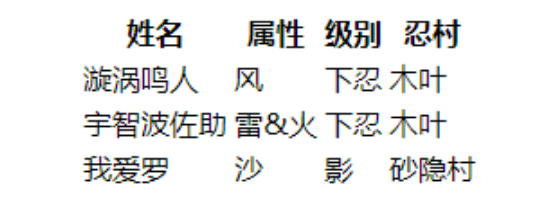
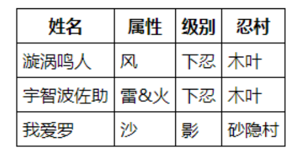
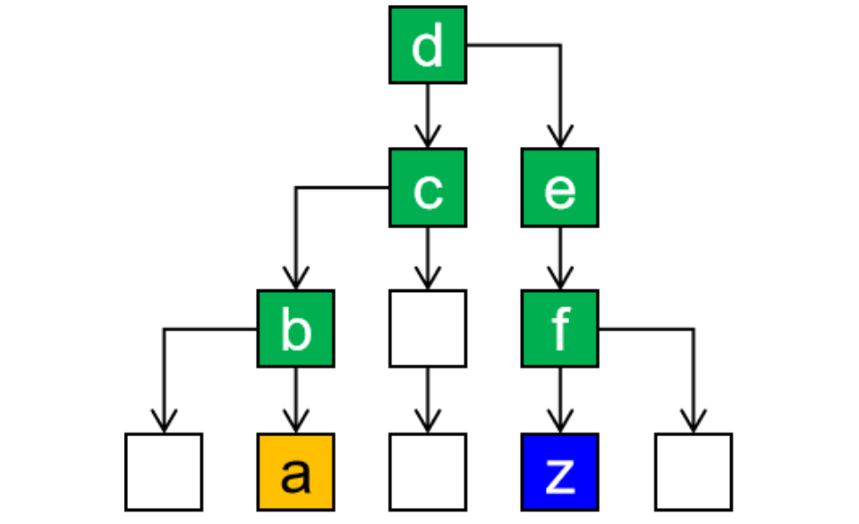
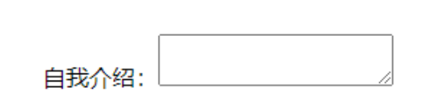
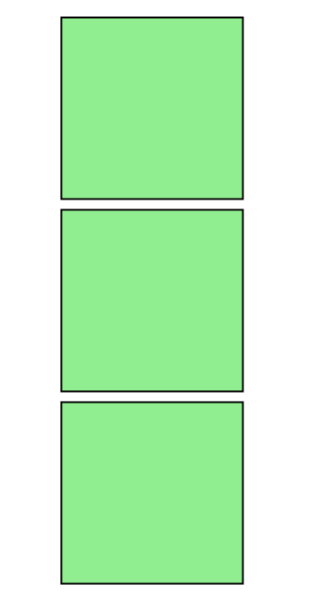

# 序章 JavaWeb前置常识

## 0-1 服务器和客户端的概念


### 0-1-1 客户端的作用

* 与用户进行交互，用于接收用户的输入(操作)、展示服务器端的数据以及向服务器传递数据。

### 0-1-2 常见的客户端

* PC端网页

* 移动端网页/app

* Iot设备


### 0-1-3 服务器的作用

* 与客户端进行交互，接收客户端的数据、处理具体的业务逻辑、传递给客户端其需要的数据。

### 0-1-4 服务器的概念

* “服务器”是一个非常宽泛的概念，
  * **从硬件而言:** 服务器是计算机的一种，它比普通计算机运行更快、负载更高、价格更贵。服务器在网络中为其它客户机（如PC机、智能手机、ATM等终端甚至是火车系统等大型设备）提供计算或者应用服务。
  * **从软件而言:** 服务器其实就是安装在计算机上的一个软件，根据其作用的不同又可以分为各种不同的服务器，例如应用服务器、数据库服务器、Redis服务器、DNS服务器、ftp服务器等等

* **综上所述 :** 用我们自己的话来总结的话，服务器其实就是一台(或者一个集群)安装了服务器软件的高性能计算机

#### 1-常见的服务器硬件设备

* 刀片服务器


* 塔式服务器


* 机房


#### 2-常见的服务器操作系统

服务器是一台计算机，它必须安装操作系统之后才能够安装使用服务器软件

* **Linux系统**: 使用最多的服务器系统，安全稳定、性能强劲、开源免费（或少许费用）。


* Unix系统: 和硬件服务器捆绑销售，版权不公开，用法和Linux一样。

* Windows Server系统: 源代码不开放，费用高昂，漏洞较多，性能较差，运维成本高。

#### 3-常见的服务器软件

硬件服务器装好系统，就可以安装应用软件了，像我们熟知的 ==Tomcat、MySQL、Redis==、FastDFS、ElasticSearch 等等都是服务器应用软件。它们分别提供自己特定的服务器功能。如果一台服务器上安装了Tomcat，我们会就会把这台服务器叫做Tomcat服务器；如果装了MySQL，就叫做MySQL服务器。很显然，开发过程中需要很多这样的服务器。

#### 4-虚拟机服务器

* VMWare虚拟机

通常来说VMWare用于开发人员在本地电脑上搭建一个模拟的服务器环境，或自己装一些东西测试，不是团队共同使用的正式环境。


* 弹性云服务器

使用弹性云服务器最大的好处就是弹性伸缩。什么是弹性伸缩呢？我现在的服务器是20G内存，因为访问量暴涨我需要把内存扩容到80G，要是物理的硬件服务器就需要买来新的内存条插入主板上的内存插槽。而弹性云服务器只需要改一下内存容量的参数就行了，非常方便。等访问量下降了，再把内存容量调回来就可以，不仅方便，而且可以精准的在访问高峰期提高服务器配置而不是一直维持高配，节约成本。


#### 5-服务器端应用程序

* 服务器端应用程序就是运行在应用服务器软件上，用于处理具体业务功能的一个应用程序，而我们学习JavaEE开发的目的就是编写服务器端应用程序。

* 例如: 淘宝、滴滴、京东等等项目都是服务器端应用程序


### 0-1-5 业务的概念

* **业务** 就是服务器应用程序中的各个功能
* 例如商城里面的: 注册、登录、添加购物车、提交订单、结算订单等等都称之为业务

## 0-2 请求和响应

### 0-2-1 请求

* 请求是从客户端发送给服务器
* 主要用于将客户端的数据传递给服务器

### 0-2-2 响应

* 响应是从服务器发送给客户端
* 主要用于将服务器的数据传递给客户端


## 0-3 javaweb阶段技术体系

### 0-3-1 客户端技术

HTML、CSS、JavaScript、Vue、Ajax、Axios

### 0-3-2 服务器端技术

Tomcat、Servlet、Request、Response、Cookie、Session、Filter、Listener、Thymeleaf

### 0-3-3 持久层技术

MySql、JDBC、连接池、DBUtils

### 0-3-4 图解


# 第一章 前端基本三件套

## 1-1 概述

* HTML：网页结构
* CSS：美化网页
* JavaScript：网页特效

## 1-2 HTML

### 1-2-1 HTML概念

HTML是<span style="color:blue;font-weight:bold;">H</span>yper <span style="color:blue;font-weight:bold;">T</span>ext <span style="color:blue;font-weight:bold;">M</span>arkup <span style="color:blue;font-weight:bold;">L</span>anguage的缩写。意思是<span style="color:blue;font-weight:bold;">『超文本标记语言』</span>。它的作用是搭建网页结构，在网页上展示内容。

* 超文本
  * HTML文件本质上是文本文件，而普通的文本文件只能显示字符。但是HTML技术则通过HTML标签把其他网页、图片、音频、视频等各种多媒体资源引入到当前网页中，让网页有了非常丰富的呈现方式，这就是超文本的含义——本身是文本，但是呈现出来的==最终效果超越了文本==。

* 标记语言
  * 说HTML是一种『标记语言』是因为它不是向Java这样的『编程语言』，因为它是由一系列『标签』组成的，没有常量、变量、流程控制、异常处理、IO等等这些功能。HTML很简单，每个标签都有它固定的含义和确定的页面显示效果。

### 1-2-2 HTML的结构


* **文档声明 <!DOCTYPE html>** 

  HTML文件中第一行的内容，用来告诉浏览器当前HTML文档的基本信息，其中最重要的就是当前HTML文档遵循的语法标准。这里我们只需要知道HTML有4和5这两个大的版本，HTML4版本的文档类型声明是：

```html
<!DOCTYPE HTML PUBLIC "-//W3C//DTD HTML 4.01 Transitional//EN"
"http://www.w3.org/TR/html4/loose.dtd">
```

HTML5版本的文档类型声明是：

```html
<!DOCTYPE html>
```

现在主流的技术选型都是使用HTML5，之前的版本基本不用了。

* **根标签<html></html>**

  html标签是整个文档的根标签，所有其他标签都必须放在html标签里面。

* **头部<head></head>**

  head标签用于定义文档的头部，其他头部元素都放在head标签里。头部元素包括title标签、script标签、style标签、link标签、meta标签等等。

* **主体<body></body>**

  body标签定义网页的主体内容，在浏览器窗口内显示的内容都定义到body标签内。

* **注释**

  HTML注释的写法是：

```html
<!-- 注释内容 -->
```

注释的内容不会显示到浏览器窗口内，是开发人员用来对代码内容进行解释说明。

### 1-2-3 HTML语法规则

- 根标签有且只能有一个
- 无论是双标签还是单标签都必须正确关闭
- 标签可以嵌套但不能交叉嵌套
- 注释不能嵌套
- 属性必须有值，值必须加引号，单引号或双引号均可
- 标签名不区分大小写但建议使用小写

### 1-2-4 HTML的一些常用标签

#### 1-标题标签

**代码**

```html
<!DOCTYPE html>
<html lang="en">
<head>
    <meta charset="UTF-8">
    <title>Title</title>
</head>
<body>

    <h1>这是一级标题</h1>
    <h2>这是二级标题</h2>
    <h3>这是三级标题</h3>
    <h4>这是四级标题</h4>
    <h5>这是五级标题</h5>
    <h6>这是六级标题</h6>

</body>
</html>
```

**页面效果**


#### 2-段落标签

**代码**

```html
<p>There is clearly a need for CSS to be taken seriously by graphic artists. The Zen Garden aims to excite, inspire, and encourage participation. To begin, view some of the existing designs in the list. Clicking on any one will load the style sheet into this very page. The code remains the same, the only thing that has changed is the external .css file. Yes, really.</p>
```

**页面效果**


#### 3-换行标签

**代码**

```html
We would like to see as much CSS1 as possible. CSS2 should be limited to widely-supported elements only. The css Zen Garden is about functional, practical CSS and not the latest bleeding-edge tricks viewable by 2% of the browsing public. <br/>The only real requirement we have is that your CSS validates.
```


#### 4-无序/有序列表标签

**代码**

```html
<ul type = "circle">
    <li>Apple</li>
    <li>Banana</li>
    <li>Grape</li>
</ul>

<ol type="i" start="1"><!--type 可以显示的类型：A a I i 1(default)-->
    <li>Apple</li>
    <li>Banana</li>
    <li>Grape</li>
</ol> 
```

**页面效果**


#### 5-超链接标签(重要)

* **代码**

```html
<body>
    <!--
        超链接标签a的作用: 进行资源跳转
            href: 你要跳转到的资源的路径
            target: 新页面的打开方式
    -->
    <!--
        1. 跳转到本项目的资源: 使用相对路径
            相对路径: 以当前路径作为基准，如果资源跟我说同一个目录下的则直接写资源名就行了
                    如果在不同目录下，要找上一级目录，则使用../

                    . 当前目录
                    .. 上一级目录
        2. 跳转到其它服务器的资源: 此时就要使用完整的url访问路径
    -->
    <a href="../01_html的入门/start.html">跳转到start.html页面</a><br/>

    <!--
        target属性表示新页面的打开方式，我们目前只需要掌握两种取值:
            _self 表示新页面在当前页面打开
            _blank 表示新页面会新打开一个标签页
    -->
    <a href="https://www.baidu.com" target="_blank">跳转到百度</a>
</body>
```

* 点击后跳转到 href 属性指定的页面

#### 6-图片标签(重点)

* **准备图片文件**


* **代码**

```html
<!--
img标签是用于显示图片的，它有如下属性
1. src: 用于指定要显示的图片的路径，建议使用相对路径
项目中的图片一般存放在一个img的文件夹中
2. width: 图片的宽度
3. height: 图片的高度
-->

```

* **页面效果**


#### 7-块标签(重点)

* <span style="color:blue;font-weight:bold;">『块』</span>并不是为了显示文章内容的，而是为了方便结合CSS对页面进行布局。
  * 块有两种，div是前后**有换行的块**，
  * span是前后**没有换行的块**。

把下面代码粘贴到HTML文件中查看他们的区别：

```html
<div style="border: 1px solid black;width: 100px;height: 100px;">This is a div block</div>
<div style="border: 1px solid black;width: 100px;height: 100px;">This is a div block</div>

<span style="border: 1px solid black;width: 100px;height: 100px;">This is a span block</span>
<span style="border: 1px solid black;width: 100px;height: 100px;">This is a span block</span>
```


#### 8-HTML实体(了解)

在HTML文件中，&lt;、&gt;等等这样的符号已经被赋予了特定含义，不会作为符号本身显示到页面上，此时如果我们想使用符号本身怎么办呢？那就是使用HTML实体来转义。


#### 9-表格标签

* **目标页面效果**


* **第一版代码**

```html
<!-- 使用table标签定义表格 -->
<table>
    <!-- 使用tr标签定义表格的行 -->
    <tr>
        <!-- 使用th标签定义表头，表头有字体加粗效果 -->
        <th>姓名</th>
        <th>属性</th>
        <th>级别</th>
        <th>忍村</th>
    </tr>
    <tr>
        <!-- 使用td标签定义单元格 -->
        <td>漩涡鸣人</td>
        <td>风</td>
        <td>下忍</td>
        <td>木叶</td>
    </tr>
    <tr>
        <td>宇智波佐助</td>
        <td>雷&火</td>
        <td>下忍</td>
        <td>木叶</td>
    </tr>
    <tr>
        <td>我爱罗</td>
        <td>沙</td>
        <td>影</td>
        <td>砂隐村</td>
    </tr>
</table>
```

* 
  * 如果只有上面的代码，页面显示效果是：



* 没有表格边框。想要显示好看的表格边框可以把下面的style标签代码复制粘贴到**head标签**里,CSS还没讲，不必在意语法细节，整体照搬即可。

```html
<style type="text/css">
    table,th,td {
        border-collapse: collapse;
        border: 1px solid black;
        padding: 5px;
    }
</style>
```



我们发现，相较于目标效果而言，还未实现横纵向合并单元格

* 合并单元格
  * 横向合并单元格(列合并)

使用colspan属性将两个横向相邻的单元格跨列合并：

```html
<tr>
    <td>宇智波佐助</td>
    <td>雷&火</td>
    <td colspan="2">下忍</td>
</tr>
```


注意: <span style="color:blue;font-weight:bold;">『被合并』</span>的单元格要删掉。

* 合并单元格
  * 纵向合并单元格(行合并)

使用rowspan属性将两个纵向相邻的单元格跨行合并：

```html
<tr>
    <td>宇智波佐助</td>
    <td rowspan="2">雷&火</td>
    <td colspan="2">下忍</td>
</tr>
<tr>
    <td>我爱罗</td>
    <td>影</td>
    <td>砂隐村</td>
</tr>
```


注意: <span style="color:blue;font-weight:bold;">『被合并』</span>的单元格要删掉。

### 1-2-5 前端两种路径介绍

* 在我们整个Web开发技术体系中，『路径』是一个贯穿始终的重要概念。凡是需要获取另外一个资源的时候都需要用到路径。要想理解路径这个概念，我们首先要认识一个概念：『文件系统』。

#### 1-文件系统

* 我们写代码的时候通常都是在Windows系统来操作，而一个项目开发完成后想要让所有人都能够访问到就必须『部署』到服务器上，也叫『发布』。==而服务器通常是Linux系统。==

* Windows系统和Linux系统的文件系统有很大差别，为了让我们编写的代码不会因为从Windows系统部署到了Linux系统而出现故障，==实际开发时不允许使用<span style="color:blue;font-weight:bold;">物理路径</span>==。

```
物理路径举例：
D:\aaa\pro01-HTML\page01-article-tag.html
D:\aaa\pro01-HTML\page02-anchor-target.html
```

幸运的是不管是Windows系统还是Linux系统环境下，目录结构都是<span style="color:blue;font-weight:bold;">树形结构</span>，编写路径的规则是一样的。


所以我们<span style="color:blue;font-weight:bold;">以项目的树形目录结构为依据</span>来编写路径就不用担心操作系统平台发生变化之后路径错误的问题了。有了这个大前提，我们具体编写路径时有两种具体写法：

- 相对路径
- 绝对路径

#### 2-相对路径

<span style="color:blue;font-weight:bold;">相对路径都是以<span style="color:red;font-weight:bold;">『当前位置』</span>为基准</span>来编写的。假设我们现在正在浏览a页面，想在a页面内通过超链接跳转到z页面。


那么按照相对路径的规则，我们现在所在的位置是a.html所在的b目录：


z.html并不在b目录下，所以我们要从b目录出发，向上走，进入b的父目录——c目录：


c目录还是不行，继续向上走，进入c的父目录——d目录：


在从d目录向下经过两级子目录——e目录、f目录才能找到z.html：



所以整个路径的写法是：

```html
<a href="../../../e/f/z.html">To z.html</a>
```

### 1-2-6 重要的标签-表单标签

#### 1-案例引入

* 代码

```html
<form action="regsuccess.html" method="post">
    昵称：<input type="text" name="nickName"/><br/>
    密码：<input type="password" name="pwd"/><br/>
    性别：
    <input type="radio" name="gender" value="male"/>男
    <input type="radio" name="gender" value="female"/>女<br/>

    爱好：
    <input type="checkbox" name="hobby" value="basketball"/>篮球
    <input type="checkbox" name="hobby" value="football"/>足球
    <input type="checkbox" name="hobby" value="earth"/>地球 <br/>

    星座：
    <select name="star">
        <option>白羊座</option>
        <option>金牛座</option>
        <option>双子座</option>
        <option>天蝎座</option>
        <option>天秤座</option>
    </select><br/>
    备注：
    <textarea name="remark" rows="3" cols="50"></textarea><br/>
    <input type="submit" value="注册"/>
    <input type="reset" value="重置"/>
    <input type="button" value="普通"/>
</form>
```

* 效果

  

#### 2-表单标签的作用

* 在项目开发过程中，==凡是需要用户填写的信息都需要用到表单==。它的作用是接收用户的输入信息，并且将用户输入的信息提交给服务器

#### 3-form标签的两个属性

* **action属性**

  * 用户在表单里填写的信息需要发送到服务器端，对于Java项目来说就是交给Java代码来处理。那么在页面上我们就必须正确填写服务器端的能够接收表单数据的地址。

  * 这个地址要写在form标签的action属性中。但是现在暂时我们还没有服务器端环境，所以先借用一个HTML页面来当作服务器端地址使用。

* **method属性**

有get和post两种，只需要记住用post就好，==没有极特殊情况的话使用post即可==。

#### 4-以下为表单项标签详解

* **name和value**：联想集合中的Map<K,V>即可 name和value就是键值对

#### 5-单行文本框

**代码**

```html
个性签名：<input type="text" name="signal"/><br/>
```

**显示效果**


#### 6-密码框

**代码**

```html
密码：<input type="password" name="secret"/><br/>
```

**显示效果**


#### 7-单选框

**代码**

```html
你最喜欢的季节是：
<input type="radio" name="season" value="spring" />春天
<input type="radio" name="season" value="summer" checked="checked" />夏天
<input type="radio" name="season" value="autumn" />秋天
<input type="radio" name="season" value="winter" />冬天

<br/><br/>

你最喜欢的动物是：
<input type="radio" name="animal" value="tiger" />路虎
<input type="radio" name="animal" value="horse" checked="checked" />宝马
<input type="radio" name="animal" value="cheetah" />捷豹
```

**显示效果**


**说明:**

- name属性相同的radio为一组，组内互斥
- 当用户选择了一个radio并提交表单，这个radio的name属性和value属性组成一个键值对发送给服务器
- 设置checked="checked"属性设置默认被选中的radio

#### 8-多选框

**代码**

```html
你最喜欢的球队是：
<input type="checkbox" name="team" value="Brazil"/>巴西
<input type="checkbox" name="team" value="German" checked="checked"/>德国
<input type="checkbox" name="team" value="France"/>法国
<input type="checkbox" name="team" value="China" checked="checked"/>中国
<input type="checkbox" name="team" value="Italian"/>意大利
```

**显示效果**


**说明:**

- 设置checked="checked"属性设置默认被选中的checkbox

#### 9-下拉框

**代码**

```html
你喜欢的运动是：
<select name="interesting">
    <option value="swimming">游泳</option>
    <option value="running">跑步</option>
    <option value="shooting" selected="selected">射击</option>
    <option value="skating">溜冰</option>
</select>
```

**显示效果**


**说明:**

- 下拉列表用到了两种标签，其中select标签用来定义下拉列表，而option标签设置列表项。
- name属性在select标签中设置。
- value属性在option标签中设置。
- option标签的标签体是显示出来给用户看的，提交到服务器的是value属性的值。
- 通过在option标签中设置selected="selected"属性实现默认选中的效果。

#### 10-按钮

**代码**

```html
<button type="button">普通按钮</button>或<input type="button" value="普通按钮"/>
<button type="reset">重置按钮</button>或<input type="reset" value="重置按钮"/>
<button type="submit">提交按钮</button>或<input type="submit" value="提交按钮"/>
```

**显示效果**


**说明:**

* 普通按钮: 点击后无效果，需要通过JavaScript绑定单击响应函数
* 重置按钮: 点击后将表单内的所有表单项都恢复为默认值  提交按钮  
* 提交按钮: 点击后提交表单

#### 11-隐藏域

**代码**

```html
<input type="hidden" name="userId" value="2233"/>
```

**说明:**

通过表单隐藏域设置的表单项不会显示到页面上，用户看不到。但是提交表单时会一起被提交。用来设置一些需要和表单一起提交但是不希望用户看到的数据，例如：用户id等等。

#### 12-多行文本框

**代码**

```html
自我介绍：<textarea name="desc"></textarea>
```

**显示效果**



**说明:**

textarea没有value属性，如果要设置默认值需要写在开始和结束标签之间。

#### 13-文件表单

**代码**

```html
头像:<input type="file" name="file"/>
```

**显示效果**


**说明:**

不同浏览器显示的样式有微小差异

## 1-3 CSS

### 1-3-1 CSS的作用

* CSS是用于设置HTML页面标签的样式，用于==美化HTML页面==

### 1-3-2 CSS的引入方式

```
如果有冲突，则按 行内样式 > 内部样式 > 外部样式
```

#### 1-行内样式

* 也就是在要设置样式的标签中添加style属性，编写css样式
* 行内样式==仅对当前标签生效==

```html
<!--给div设置边框-->
<div style="border: 1px solid black;width: 100px; height: 100px;">&nbsp;</div>
```


#### 2-内部样式

* 一般是在当前页面的 head 标签中添加 style 标签，在style标签中编写css样式代码
* 内部样式==仅对当前页面生效==

```html
<head>
    <meta charset="UTF-8">
    <title>Title</title>
    <style type="text/css">
        .one {
            border: 1px solid black;
            width: 100px;
            height: 100px;
            background-color: lightgreen;
            margin-top: 5px;
        }
    </style>
</head>
<body>
    <div class="one">&nbsp;</div>
    <div class="one">&nbsp;</div>
    <div class="one">&nbsp;</div>
</body>
```



#### 3-外部样式(一般都是这种)

* （1）创建CSS文件


* （2）编辑CSS文件

```css
p{
    color:blue;
    font-weight:bold;
}

.one{
    border: 1px solid black;
    width: 100px;
    height: 100px;
    background-color: lightgreen;
    margin-top: 5px;
}

#special{
    color:palevioletred;
    font-weight:bold;
}
```

* （3）引入外部CSS文件
  * 在需要使用这个CSS文件的HTML页面的head标签内加入：

```html
<link rel="stylesheet" type="text/css" href="test.css" />
```

### 1-3-3 CSS代码语法

- （1）CSS样式由**选择器**和**声明**组成（声明又由属性和值组成）。
- （2）属性和值之间用冒号隔开。
- （3）多条声明之间用分号隔开。
- （4）注释：使用/**/


### 1-3-4 CSS选择器

#### 1-标签选择器

* HTML代码

```html
<p>Hello, this is a p tag.</p>
<p>Hello, this is a p tag.</p>
<p>Hello, this is a p tag.</p>
<p>Hello, this is a p tag.</p>
<p>Hello, this is a p tag.</p>
```

* CSS代码

```css
p {
    color: blue;
    font-weight: bold;
}
```

* 页面效果


#### 2-id选择器

* id属性要尽量唯一

* HTML代码：

```html
    <p>Hello, this is a p tag.</p>
    <p>Hello, this is a p tag.</p>
    <p id="special">Hello, this is a p tag.</p>
    <p>Hello, this is a p tag.</p>
    <p>Hello, this is a p tag.</p>
```

* CSS代码：

```css
#special{
    color:palevioletred;
    font-weight:bold;
}
```

* 显示效果


#### 3-类选择器

* HTML代码：

```html
    <div class="one">&nbsp;</div>
    <div class="one">&nbsp;</div>
    <div class="one">&nbsp;</div>
```

* CSS代码：

```css
        .one {
            border: 1px solid black;
            width: 100px;
            height: 100px;
            background-color: lightgreen;
            margin-top: 5px;
        }
```

* 显示效果


#### 4-上述三种的组合情况


## 1-4 JavaScript

### 1-4-1 JavaScript概述

* 客户端的一个脚本语言
* 和java一点关系都没有，但是就是和java很像很像

* js是一门弱类型的语言（不同于java），变量的数据类型由后面赋的值的类型决定

```
js不正经，非常灵活
```

```
因为java基础已经打好了，重新学一遍js的语法就是浪费时间
所以采用案例学习的方法熟悉js
与java不同的知识点或新的知识点见1-4-*
```

### 1-4-2 添加鼠标悬浮与离开事件

html代码如下

```html
<!DOCTYPE html>
<html lang="en">
<head>
    <meta charset="UTF-8">
    <title>Fruit</title>
    <link rel="stylesheet" href="css/fruit.css">
    <script type="text/javascript" src="js/fruit.js"></script>
</head>
<body>
<div id="div_container">
    <div id="div_fruit_list">
        <table id="tbl_fruit">
            <tr>
                <th class="w20">名称</th>
                <th class="w20">单价</th>
                <th class="w20">数量</th>
                <th class="w20">小计</th>
                <th>操作</th>
            </tr>
            <tr onmouseover="showBGColor()" onmouseout="clearBGColor()">
                <td>苹果</td>
                <td onmouseover="showHand()">5</td>
                <td>20</td>
                <td>100</td>
                <td></td>
            </tr>
            <tr onmouseover="showBGColor()" onmouseout="clearBGColor()">
                <td>西瓜</td>
                <td onmouseover="showHand()">3</td>
                <td>20</td>
                <td>60</td>
                <td></td>
            </tr>
            <tr onmouseover="showBGColor()" onmouseout="clearBGColor()">
                <td>菠萝</td>
                <td onmouseover="showHand()">4</td>
                <td>25</td>
                <td>100</td>
                <td></td>
            </tr>
            <tr onmouseover="showBGColor()" onmouseout="clearBGColor()">
                <td>榴莲</td>
                <td onmouseover="showHand()">3</td>
                <td>30</td>
                <td>90</td>
                <td></td>
            </tr>
            <tr>
                <td>总计</td>
                <td colspan="4">999</td>
            </tr>
        </table>
    </div>
</div>
</body>
</html>
```

#### 1- 悬浮在表格行变背景颜色

```html
<tr onmouseover="showBGColor()"></tr>
```

js文件：

```js
//悬浮在表格行变背景颜色
function showBGColor() {
    //event:当前发生的事件
    //event.srcElement:事件源
    //alert(event.srcElement.tagName) -> TD
    if (event && event.srcElement && event.srcElement.tagName == "TD") {
        var td = event.srcElement;
        //td.parentElement 表示获取td的父元素  TR
        var tr = td.parentElement;
        //如果想要通过js代码设置某节点的样式，则需要加上 .style
        tr.style.backgroundColor = "navy";
        //tr.cells表示获取这个tr中的所有的单元格
        var tds = tr.cells;
        for (var i = 0; i < tds.length; i++) {
            tds[i].style.color = "white";
        }
    }
}
```

#### 2-当鼠标离开时恢复原始样式

```html
<tr onmouseout="clearBGColor()"></tr>
```

js文件：

```js
//当鼠标离开时，恢复原始样式
function clearBGColor() {
    if (event && event.srcElement && event.srcElement.tagName == "TD") {
        var td = event.srcElement;
        var tr = td.parentElement;
        tr.style.backgroundColor = "transparent";
        var tds = tr.cells;
        for (var i = 0; i < tds.length; i++) {
            tds[i].style.color = "black";
        }
    }
}
```

#### 3-鼠标移到特定单元格变成手型

```html
<td onmouseover="showHand()">3</td>
```

js文件

```js
//当鼠标悬浮在单价单元格时，显示手势
function showHand() {
    if (event && event.srcElement && event.srcElement.tagName == "TD") {
        var td = event.srcElement;
        td.style.cursor = "pointer";
    }
}
```

### 1-4-3 html与js的解耦（DOM）

* **问题：**在 1-4-2 的案例中，我们发现HTML的代码中，标签中有较多绑定事件的冗余代码，既有耦合现象，又影响HTML代码的可读性。
* **解决：**我们引入DOM的概念，即文档对象模型，最终可以实现在js文件中对html中的标签添加事件。

**优化后的HTML代码**

```html
<!DOCTYPE html>
<html lang="en">
<head>
    <meta charset="UTF-8">
    <title>Fruit</title>
    <link rel="stylesheet" href="css/fruit.css">
    <script type="text/javascript" src="js/fruit_opt_01.js"></script>
</head>
<body>
<div id="div_container">
    <div id="div_fruit_list">
        <table id="tbl_fruit">
            <tr>
                <th class="w20">名称</th>
                <th class="w20">单价</th>
                <th class="w20">数量</th>
                <th class="w20">小计</th>
                <th>操作</th>
            </tr>
            <tr>
                <td>苹果</td>
                <td>5</td>
                <td>20</td>
                <td>100</td>
                <td></td>
            </tr>
            <tr>
                <td>西瓜</td>
                <td>3</td>
                <td>20</td>
                <td>60</td>
                <td></td>
            </tr>
            <tr>
                <td>菠萝</td>
                <td>4</td>
                <td>25</td>
                <td>100</td>
                <td></td>
            </tr>
            <tr>
                <td>榴莲</td>
                <td>3</td>
                <td>30</td>
                <td>90</td>
                <td></td>
            </tr>
            <tr>
                <td>总计</td>
                <td colspan="4">999</td>
            </tr>
        </table>
    </div>
</div>
</body>
</html>
```

**js文件添加如下代码**

```js
//js代码要尽量与html代码完成解耦,故作如下优化
window.onload = function () {
    //当页面加载完成，我们需要绑定各种事件
    //根据id获取到表格
    var fruitTbl = document.getElementById("tbl_fruit");
    //获取表格中的所有的行
    var rows = fruitTbl.rows;
    for (var i = 1; i < rows.length-1; i++) {
        var tr = rows[i];
        //(1)绑定鼠标悬浮设置背景颜色事件
        tr.onmouseover = showBGColor;//不带小括号：绑定上这个事件，而不是执行这个事件
        tr.onmouseout = clearBGColor;
        //获取tr这一行所有的单元格
        var cells = tr.cells;
        var priceID = cells[1];
        //(2)绑定鼠标悬浮在单价单元格变手势的事件
        priceID.onmouseover = showHand;
    }
}
```

### 1-4-4 一个小习惯  $(id)

* 因为会经常用到`document.getElementById(id)` 故在js文件中添加下列方法。
* 作如下约定：

```js
function $(id) {//简化document.getElementById
    return document.getElementById(id);
}
```

### 1-4-5 总计和当前行小计的方法实现

```js
//(5) 更新指定行的小计
function updateXJ(tr) {
    if (tr && tr.tagName === "TR") {
        var tds = tr.cells;
        var price = tds[1].innerText;
        var count = tds[2].innerText;

        //innerText获取到的值的类型是字符串类型，因此需要类型转换，才能进行数学运算
        var xj = parseInt(price) * parseInt(count);
        tds[3].innerText = xj.toString();

        //(6) 更新总计
        updateZJ();
    }
}
```

```js
//(6) 更新总计
function updateZJ() {
    var fruitTbl = document.getElementById("tbl_fruit");
    var rows = fruitTbl.rows;
    var sum = 0;
    for (var i = 1; i < rows.length - 1; i++) {
        var tr = rows[i];
        var xj = parseInt(tr.cells[3].innerText);
        sum += xj;
    }
    rows[rows.length - 1].cells[1].innerText = sum;
}
```

### 1-4-6 实现点单价列单元格可以修改单价

```js
//(3)当鼠标点击单价单元格时进行价格编辑
function editPrice() {
    if (event && event.srcElement && event.srcElement.tagName === "TD") {
        var priceTD = event.srcElement;
        if (priceTD.firstChild && priceTD.firstChild.nodeType === 3) {//price单元格下有子节点且是文本才做下面的事
            //innerText 表示设置或者获取当前节点的内部文本
            //记下原来的价格
            var oldPrice = priceTD.innerText;
            //innerHTML 表示设置当前节点的内部HTML
            //变成输入框
            priceTD.innerHTML = "<input type='text' size='4'/>";
            var input = priceTD.firstChild;
            if (input.tagName === "INPUT") {
                input.value = oldPrice;
                //点击即自动选中输入框内部的文本
                input.select()
                //(4) 绑定输入框失去焦点事件
                input.onblur = updatePrice;
                //(8) 绑定在输入框上键盘按下的事件，此处我需要保证用户输入的是数字
                input.onkeydown = ckInput;
            }
        }
    }
}
```

#### 1-输入框失去焦点，更新单价

```js
function updatePrice() {
    if (event && event.srcElement && event.srcElement.tagName == "INPUT") {
        var input = event.srcElement;
        var newPrice = input.value;
        //input节点的父节点td
        var priceTD = input.parentElement;
        priceTD.innerText = newPrice;

        //(5) 更新当前行的小计这一个格子的值
        //priceTD.parentElement td的父元素是tr
        updateXJ(priceTD.parentElement);
    }
}
```

#### 2-保证用户输入的是数字

```js
function ckInput() {
    var kc = event.keyCode;
    //console.log(kc); //0-9:48-57 Backspace:8 Enter:13
    if (!((kc >= 48 && kc <= 57) || kc == 8 || kc == 13)) {
        event.returnValue = false;
    }

    if (kc == 13) {
        //按回车也会失去焦点
        event.srcElement.blur();
    }
}
```

### 1-4-7 删除一条记录

```js
//(7)删除小图标的点击事件
function delFruit() {
    if (event && event.srcElement && event.srcElement.tagName === "IMG") {
        //alert表示弹出一个对话框，只有确定按钮
        //confirm表示弹出一个对话框，有确定和取消按钮。当点击确定，返回true，否则返回false
        if (window.confirm("是否确认删除当前库存记录？")) {
            //获取行index
            var img = event.srcElement;
            var tr = img.parentElement.parentElement;
            var rowIndex = tr.rowIndex;
            //获取表，删索引为rowIndex的行
            var fruitTbl = $("tbl_fruit");
            fruitTbl.deleteRow(rowIndex);
            updateZJ();
        }
    }
}
```

### 1-4-8 增加一条记录

* 注意点：
  * （1）注意 table 的 insertRow() 和 insertCell() 两个方法，我自己做的时候就因为没用到insertCell()这个方法导致怎么都添加不上去。
  * （2）添加后会重复的（和onload中重复了）进行事件的绑定，所以，设计一个方法，将 tr 传入trBindEvent(tr) 完成单行的数据绑定。

```js
//(9) 添加一条水果数据的按钮点击事件
function addFruit() {
    if (event && event.srcElement && event.srcElement.tagName === "INPUT") {
        var fname = $("fname").value;
        var fprice = $("fprice").value;
        var fcount = $("fcount").value;
        var xj = fprice * fcount;

        //插入一行新行
        var fruitTbl = $("tbl_fruit");
        var tr = fruitTbl.insertRow(fruitTbl.rows.length - 1);

        //在新行中插入单元格
        var fnameTD = tr.insertCell();
        fnameTD.innerText = fname;

        //重复上述操作
        var fpriceTD = tr.insertCell();
        fpriceTD.innerText = fprice;

        var fcountTD = tr.insertCell();
        fcountTD.innerText = fcount;

        var xjTD = tr.insertCell();
        xjTD.innerText = xj;

        var imgTD = tr.insertCell();
        imgTD.innerHTML = "";
        
        updateZJ();
        trBindEvent(tr);
    }
}
```

做完的页面：


## 1-5 JS和正则表达式

### 1-5-1 正则表达式的概念

正则表达式是对字符串操作的一种逻辑公式，就是用事先定义好的一些特定字符、及这些特定字符的组合，组成一个“规则字符串”，这个“规则字符串”用来表达对字符串的一种过滤逻辑。用我们自己的话来说: **正则表达式用来校验字符串是否满足一定的规则的公式**

### 1-5-2 正则表达式的用途

所以正则表达式有三个主要用途：

- 模式验证: 检测某个字符串是否符合规则，例如检测手机号、身份证号等等是否符合规范
- 匹配读取:  将目标字符串中满足规则的部分**读取**出来，例如将整段文本中的邮箱地址读取出来
- 匹配替换:  将目标字符串中满足标准的部分**替换**为其他字符串,例如将整段文本中的"hello"替换成"haha"

### 1-5-3 正则表达式的语法

##### 1 创建正则表达式对象

* 对象形式：`var reg = new RegExp("正则表达式")`当正则表达式中有"/"那么就使用这种
* 直接量形式：`var reg = /正则表达式/`一般使用这种声明方式 

##### 2 正则表达式入门案例

###### 2.1 模式验证: 校验字符串中是否包含'o'字母

**注意**：这里是使用**正则表达式对象**来**调用**方法。

```javascript
// 创建一个最简单的正则表达式对象
var reg = /o/;

// 创建一个字符串对象作为目标字符串
var str = 'Hello World!';

// 调用正则表达式对象的test()方法验证目标字符串是否满足我们指定的这个模式，返回结果true
console.log("字符串中是否包含'o'="+reg.test(str));
```

###### 2.2 匹配读取: 读取字符串中的所有'o'

```javascript
//匹配读取: 读取一个字符串中的所有'l'字母
// g表示全文查找,如果不使用g那么就只能查找到第一个匹配的内容
//1. 编写一个正则表达式
var reg2 = /l/g
//2. 使用正则表达式去读取字符串
var arr = str.match(reg2);
console.log(arr)
```

###### 2.3 匹配替换: 将字符串中的第一个'o'替换成'@'

```javascript
var newStr = str.replace(reg,'@');
// 只有第一个o被替换了，说明我们这个正则表达式只能匹配第一个满足的字符串
console.log("str.replace(reg)="+newStr);//Hell@ World!
// 原字符串并没有变化，只是返回了一个新字符串
console.log("str="+str);//str=Hello World!
```

##### 3 正则表达式的匹配模式

###### 3.1 全文查找

如果不使用g对正则表达式对象进行修饰，则使用正则表达式进行查找时，仅返回第一个匹配；使用g后，返回所有匹配。

```javascript
// 目标字符串
var targetStr = 'Hello World!';

// 没有使用全局匹配的正则表达式
var reg = /[A-Z]/;
// 获取全部匹配
var resultArr = targetStr.match(reg);
// 数组长度为1
console.log("resultArr.length="+resultArr.length);

// 遍历数组，发现只能得到'H'
for(var i = 0; i < resultArr.length; i++){
    console.log("resultArr["+i+"]="+resultArr[i]);
}
```

对比代码：

```javascript
// 目标字符串
var targetStr = 'Hello World!';

// 使用了全局匹配的正则表达式
var reg = /[A-Z]/g;
// 获取全部匹配
var resultArr = targetStr.match(reg);
// 数组长度为2
console.log("resultArr.length="+resultArr.length);

// 遍历数组，发现可以获取到“H”和“W”
for(var i = 0; i < resultArr.length; i++){
    console.log("resultArr["+i+"]="+resultArr[i]);
}
```

###### 3.2 忽略大小写

```javascript
//目标字符串
var targetStr = 'Hello WORLD!';

//没有使用忽略大小写的正则表达式
var reg = /o/g;
//获取全部匹配
var resultArr = targetStr.match(reg);
//数组长度为1
console.log("resultArr.length="+resultArr.length);
//遍历数组，仅得到'o'
for(var i = 0; i < resultArr.length; i++){
    console.log("resultArr["+i+"]="+resultArr[i]);
}
```

对比代码：

```javascript
//目标字符串
var targetStr = 'Hello WORLD!';

//使用了忽略大小写的正则表达式
var reg = /o/gi;
//获取全部匹配
var resultArr = targetStr.match(reg);
//数组长度为2
console.log("resultArr.length="+resultArr.length);
//遍历数组，得到'o'和'O'
for(var i = 0; i < resultArr.length; i++){
    console.log("resultArr["+i+"]="+resultArr[i]);
}
```

###### 3.3 多行查找

不使用多行查找模式，目标字符串中不管有没有换行符都会被当作一行。

```javascript
//目标字符串1
var targetStr01 = 'Hello\nWorld!';
//目标字符串2
var targetStr02 = 'Hello';

//匹配以'Hello'结尾的正则表达式，没有使用多行匹配
var reg = /Hello$/;
console.log(reg.test(targetStr01));//false

console.log(reg.test(targetStr02));//true
```

对比代码：

```javascript
//目标字符串1
var targetStr01 = 'Hello\nWorld!';
//目标字符串2
var targetStr02 = 'Hello';

//匹配以'Hello'结尾的正则表达式，使用了多行匹配
var reg = /Hello$/m;
console.log(reg.test(targetStr01));//true

console.log(reg.test(targetStr02));//true
```

##### 4 元字符

 在正则表达式中被赋予特殊含义的字符，不能被直接当做普通字符使用。如果要匹配元字符本身，需要对元字符进行转义，转义的方式是在元字符前面加上“\”，例如：\^ 

###### 4.1 常用的元字符

| 代码 | 说明                                                         |
| ---- | ------------------------------------------------------------ |
| .    | 匹配除换行字符以外的任意字符。                               |
| \w   | 匹配字母或数字或下划线等价于[a-zA-Z0-9_]                     |
| \W   | 匹配任何非单词字符。等价于[^A-Za-z0-9_]                      |
| \s   | 匹配任意的空白符，包括空格、制表符、换页符等等。等价于[\f\n\r\t\v]。 |
| \S   | 匹配任何非空白字符。等价于[^\f\n\r\t\v]。                    |
| \d   | 匹配数字。等价于[0-9]。                                      |
| \D   | 匹配一个非数字字符。等价于[^0-9]                             |
| \b   | 匹配单词的开始或结束                                         |
| ^    | 匹配字符串的开始，但在[]中使用表示取反                       |
| $    | 匹配字符串的结束                                             |

###### 4.2 例子一

```javascript
var str = 'one two three four';
// 匹配全部空格
var reg = /\s/g;
// 将空格替换为@
var newStr = str.replace(reg,'@'); //one@two@three@four
console.log("newStr="+newStr);
```

###### 4.3 例子二

```javascript
var str = '今年是2014年';
// 匹配至少一个数字
var reg = /\d+/g;
str = str.replace(reg,'abcd');
console.log('str='+str); // 今年是abcd年
```

###### 4.4 例子三

```javascript
var str01 = 'I love Java';
var str02 = 'Java love me';
// 匹配以Java开头
var reg = /^Java/g;
console.log('reg.test(str01)='+reg.test(str01)); // flase
console.log("<br />");
console.log('reg.test(str02)='+reg.test(str02)); // true
```

###### 4.5 例子四

```javascript
var str01 = 'I love Java';
var str02 = 'Java love me';
// 匹配以Java结尾
var reg = /Java$/g;
console.log('reg.test(str01)='+reg.test(str01)); // true
console.log("<br />");
console.log('reg.test(str02)='+reg.test(str02)); // flase
```

##### 5 字符集合

| 语法格式    | 示例                                                         | 说明                                               |
| ----------- | ------------------------------------------------------------ | -------------------------------------------------- |
| [字符列表]  | 正则表达式：[abc] 含义：目标字符串包含abc中的任何一个字符 目标字符串：plain 是否匹配：是 原因：plain中的“a”在列表“abc”中 | 目标字符串中任何一个字符出现在字符列表中就算匹配。 |
| [^字符列表] | [^abc] 含义：目标字符串包含abc以外的任何一个字符 目标字符串：plain 是否匹配：是 原因：plain中包含“p”、“l”、“i”、“n” | 匹配字符列表中未包含的任意字符。                   |
| [字符范围]  | 正则表达式：[a-z] 含义：所有小写英文字符组成的字符列表 正则表达式：[A-Z] 含义：所有大写英文字符组成的字符列表 | 匹配指定范围内的任意字符。                         |

```javascript
var str01 = 'Hello World';
var str02 = 'I am Tom';
//匹配abc中的任何一个
var reg = /[abc]/g;
console.log('reg.test(str01)='+reg.test(str01));//flase
console.log('reg.test(str02)='+reg.test(str02));//true
```

##### 6 出现次数

| 代码  | 说明           |
| ----- | -------------- |
| *     | 出现零次或多次 |
| +     | 出现一次或多次 |
| ?     | 出现零次或一次 |
| {n}   | 出现n次        |
| {n,}  | 出现n次或多次  |
| {n,m} | 出现n到m次     |

```javascript
console.log("/[a]{3}/.test('aa')="+/[a]{3}/g.test('aa')); // flase
console.log("/[a]{3}/.test('aaa')="+/[a]{3}/g.test('aaa')); // true
console.log("/[a]{3}/.test('aaaa')="+/[a]{3}/g.test('aaaa')); // true
```

##### 7 在正则表达式中表达『或者』

使用符号：|

```javascript
// 目标字符串
var str01 = 'Hello World!';
var str02 = 'I love Java';
// 匹配'World'或'Java'
var reg = /World|Java/g;
console.log("str01.match(reg)[0]="+str01.match(reg)[0]);//World
console.log("str02.match(reg)[0]="+str02.match(reg)[0]);//Java
```

### 1-5-4 常用正则表达式

| 需求     | 正则表达式                                            |
| -------- | ----------------------------------------------------- |
| 用户名   | /^\[a-zA-Z\_][a-zA-Z_\-0-9]{5,9}$/                    |
| 密码     | /^[a-zA-Z0-9_\-\@\#\&\*]{6,12}$/                      |
| 前后空格 | /^\s+\|\s+$/g                                         |
| 电子邮箱 | /^[a-zA-Z0-9_\.-]+@([a-zA-Z0-9-]+[\.]{1})+[a-zA-Z]+$/ |

```
碰到要用的直接查百度就行
```


# 第二章 Tomcat

* **tomcat：**web容器（WebContainer）, 在容器中，我们可以==部署==一个一个的项目。（deploy：部署）

## 2-1 Tomcat的安装和配置

* **1）解压**
  * 解压到devtools


webapps 项目部署的目录

logs 日志文件目录

work 工作目录

temp 临时目录

* **2）配置环境变量**
  * 我们需要告诉tomcat：当前电脑的JAVA_HOME在哪儿
  * 之前学javase早就配好了，所以这步跳过
* **3）启动tomcat**
  * 双击 \bin\startup.bat
  * 
  * 出现  Server startup in 781 ms  就算成功！
* **4）访问tomcat主页**
  * 浏览器地址输入 localhost:8080
  * 

## 2-2 部署web项目到Tomcat

### 2-2-1 最简单的版本

* 1）一个任意命名的文件夹，有一个子文件夹名为 `WEB-INF` ,存放到 \webapps 中，网页可以放在和`WEB-INF`同级的目录下
* 2）实操如下：
* 
* 3）然后我们就可以在浏览器以 HTTP 的形式（之前是文件的形式）访问之前做好的水果页面了！在浏览器输入 http://localhost:8080/test/fruit_opt_02.html


### 2-2-2 IDEA一键部署

* 1）新建web模块/项目。调出New Module面板，进行如下选择：


题外话，我是2020.3.2 x64版本的IDEA，一开始是没有上图的选项的，经过查找资料参考：https://blog.csdn.net/Code_KY/article/details/126403562  得到解决。

即按快捷键 ctrl + alt + shift + / 调出 Maintenance-registry 窗口，找到下图


选项勾选即可。

* 2）新建后将文件夹下的jsp文件删除，我们可以观察传统Web项目的目录结构:


* 3）进入Edit Configurations界面


* 4）找到Templates -> Tomcat Server -> Local，配置tomcat的文件路径


* 5）点击左上角＋号 将TomcatServer-Local 添加


* 6）将刚刚创建的  web项目  添加到  Deployment选项卡  中


* 7）对Server选项卡中的红框下的选项作如下修改：即可完成项目的热部署。


* 8）浏览器访问 http://localhost:8080/begin/hello.html，成功访问

# 第三章 Servlet

## 3-1 概念引入

### 3-1-1 Servlet的理解

* Servlet可以分成两个单词: 
  * Serv : 就是服务器
  * let：指一个小应用
* 所以综合起来就是服务器上的一个小程序


* Servlet要完成的就是图中 AddServlet 以及前面的一些操作

## 3-2 案例引入

* 现在我们有这样一个简单的网页，上面有一个表单（用于提交一份水果的信息）

```html
<!DOCTYPE html>
<html lang="en">
<head>
    <meta charset="UTF-8">
    <title>Hello</title>
</head>
<body>
<h1>Hello!</h1>
<form action="add" method="post" >
    名称：<input type="text" name="fname"/><br>
    价格：<input type="text" name="price"/><br>
    库存：<input type="text" name="fcount"/><br>
    备注：<input type="text" name="remark"/><br>
    <input type="submit" value="添加"/>
</form>
</body>
</html>
```

* 网页效果：


### 3-2-1 重写doPost()方法快速地在内存中接收网页传来的表单信息

* 在html文件中我们给form表单了如下属性：

```html
<form action="add" method="post" >
```

* action是一个请求的命名，method是请求的方式。

* （1） 在 WEB-INF/web.xml 中 添加如下代码

* ```xml
      <servlet>
          <servlet-name>AddServlet</servlet-name>
          <servlet-class>com.tan.servlets.AddServlet</servlet-class>
      </servlet>
      <servlet-mapping>
          <servlet-name>AddServlet</servlet-name>
          <url-pattern>/add</url-pattern>
      </servlet-mapping>
  ```

  * 上述代码中 网页是怎么找到 com.tan.servlets.AddServlet 的：
    * 1.用户发请求，action=add
      2.先在web.xml中找到 url-pattern = /add
      3.servlet-mapping中找到servlet-name = AddServlet
      4.找和servlet-mapping中servlet-name一致的servlet
      5.找servlet中的servlet-class -> com.tan.servlets.AddServlet
      6.用户发的是post请求(method=post),因此 tomcat会执行Addservlet中的doPost方法

  

  ```
  在Servlet3.0后，我们只需要给Servlet加@WebServlet("/add")注解注册即可
  ```
  
* （2）AddServlet 继承 HttpServlet (在servletAPI中，需要在maven中添加dependency) 重写doPost()方法

* ```java
  public class AddServlet extends HttpServlet {
      @Override
      protected void doPost(HttpServletRequest req, HttpServletResponse resp) throws ServletException, IOException {
          String fname = req.getParameter("fname");
          String priceStr = req.getParameter("price");
          int price = Integer.parseInt(priceStr);
          String fcountStr = req.getParameter("fcount");
          int fcount = Integer.parseInt(fcountStr);
          String remark = req.getParameter("remark");
          System.out.println("fname=" + fname);
          System.out.println("price=" + price);
          System.out.println("fcount=" + fcount);
          System.out.println("remark=" + remark);
      }
  }
  ```

  `interface HttpServletRequest`

  | 成员方法签名                     | 返回值 | 说明                                                         | 理解                                                   |
  | -------------------------------- | ------ | ------------------------------------------------------------ | ------------------------------------------------------ |
  | String getParameter(String name) | String | 以字符串形式返回请求参数的值，如果参数不存在则返回 null。请求参数是随请求一起发送的额外信息。对于 HTTP servlet，参数包含在查询字符串或发布的表单数据中。 | 获取html代码中form表单中name属性值和name相等的表单信息 |

* （3）debug方式运行，在网页上填写表单并点击提交，观察F12和控制台


* 至此，我完成了在内存中接收网页传来的表单信息。

### 3-2-2 结合学过的JDBC的知识，将网页上的表单信息直接添加到数据库表中

#### 错误记录

**1- IDEA使用问题之getResourceAsStream读取配置文件失败**

druid.properties 放 resource中就行了

**2- 本地测试JDBC没问题，但是放到tomcat上就除了入下图的问题**


解决：maven里搞到的jar包也要搞到 tomcat安装目录下\lib文件夹中，然后重启一下tomcat

**3-但是还是有问题。**我选择了换连接池，从druid换到c3p0，问题依旧，故将问题继续降维，放弃连接池，采用最基本的读取config.properties 注册驱动的方式，找到了比较根源的报错：ClassNotFoundException:com.mysql.jdbc.Driver

```
巧用IDEA的DUBUG打断点功能，可以在一些地方查看一些变量的当前值
巧用测试类
从而排除/确定问题出现的地方
```

通过查百度得到解决方法：

* （1）确认了项目的pom.xml里引用了tomcat-jdbc-7.0.52.jar(注：版本要与tomcat版本一致) 与 mysql-connector-java-5.1.30.jar。

  ```xml
      <dependency>
          <groupId>org.apache.tomcat</groupId>
          <artifactId>tomcat-jdbc</artifactId>
      </dependency>
      <dependency>
          <groupId>mysql</groupId>
          <artifactId>mysql-connector-java</artifactId>
      </dependency>
  ```

* （2）把mysql-connector-java-5.1.30.jar包放入tomcat主目录下lib文件夹下

* （3）重启tomcat

**4-这时我们换回druid连接池试试。**成功了！就是**3-**关键步骤解决的


### 3-2-3 中文乱码问题的发现与解决

* 在网页表单中输入中文的水果信息时，会发现存入数据库的是乱码文字

```java
        //post方式下，设置编码，防止中文乱码
        //get方式下，目前不需要设置编码（基于tomcat8）
        //如是get请求发送的中文数据，转码稍微有点麻烦（tomcat8之前）
        
        req.setCharacterEncoding("UTF-8");
```

#### servlet设置编码

* **1）get请求方式**∶

get方式目前不需要设置编码（基于tomcat8 )

tomcat8之前，设置编码∶

```java
//如果是get请求发送的中文数据，转码稍微有点麻烦(tomcat8之前)
String fname = request.getParameter ( "fname" ) ;
//1.将字符串打散成字节数组
byte[] bytes = fname.getBytes ("ISO-8859-1") ;
//2.将字节数组按照设定的编码重新组装成字符串
fname = new string (bytes , "UTF-8");
```

* **2）post请求方式**∶

```java
request.setcharacterEncoding ("UTF-8");
```

tomcat8开始，设置编码，只需要针对post方式

需要注意的是，设置编码(post)这一句代码必须在所有的获取参数动作之前

## 3-3 Servlet的继承关系和服务方法

### 3-3-1 继承关系

javax.servlet.Servlet  接口
		javax.servlet.GenericServlet  抽象类
				javax.servlet.http.HttpServlet  抽象子类

### 3-3-2 HttpServlet中的服务方法

`interface Servlet`

| 方法签名                                              | 返回值 | 说明   |
| ----------------------------------------------------- | ------ | ------ |
| void service(ServletRequest req, ServletResponse res) | void   | 抽象的 |

`abstract class GenericServlet `

| 方法签名                                                     | 返回值 | 说明       |
| ------------------------------------------------------------ | ------ | ---------- |
| abstract void service(ServletRequest req, ServletResponse res) | void   | 还是抽象的 |

`abstract class HttpServlet`

| 方法签名                                                     | 返回值 | 说明                                                         | 理解                        |
| ------------------------------------------------------------ | ------ | ------------------------------------------------------------ | --------------------------- |
| void service(HttpServletRequest req, HttpServletResponse resp) | void   | 当有请求过来时，service方法会自动响应(其实是tomcat容器调用的) | <a href="#3-3-2-1">详解</a> |

* <div id="3-3-2-1">HttpServlet.service(req,resp)详解</div>

* 1）获取请求的方式

  ```java
  String method = req.getMethod(); 
  ```

* 2）各种 if 判断，根据请求方式不同，决定去调用不同的do方法

  

* 3）在Httpservlet这个抽象类中，do方法都差不多


* 在HttpServlet中这些do方法默认都是405的实现风格,==也就意味着要我们子类去实现对应的方法，否则默认会报405错误==
* 因此，我们在新建Servlet时，我们会去考虑请求方法（get,post,...），从而决定重写哪个do方法

## 3-4 Servlet的生命周期

### 3-4-1 生命周期

*  1） 生命周期：从出生到死亡的过程就是生命周期。
  * 总共四步，其中三步对应Servlet中的三个方法：
    * 实例化
    * init()  初始化
    * service()  服务
    * destroy()  销毁
  * 默认情况下
    * 第一次接收请求时，这个Servlet会进行实例化(调用构造方法)、初始化(调用init())，然后服务(调用service())
    * 从第二次请求开始，每一次都是服务(调用service())
    * 当容器关闭时，其中的所有的servlet实例会被销毁，调用销毁方法
* 2）通过案例我们发现：
     - Servlet实例tomcat只会创建一个，所有的请求都是这个实例去响应。第一次请求时，tomcat才会去实例化，初始化，然后再服务。
          - 好处：提高系统的启动速度 。 
          - ==缺点：第一次请求时，耗时较长。==
     - 结论： 如果需要提高系统的启动速度，当前默认情况就是这样。如果需要提高响应速度，我们应该==设置Servlet的初始化时机==。

### 3-4-2 Servlet的初始化时机

 - 默认是第一次接收请求时，实例化，初始化。
 - 我们可以通过在web.xml文件中的<servlet>标签内添加<load-on-startup>属性来设置servlet启动的先后顺序,数字越小，启动越靠前，最小值0
 - 

* ==这里我设置成**1**后，该servlet的 实例化初始化 过程被提前到了tomcat容器启动的时候==，这样用户就不用等了

### 3-4-3 Servlet的初始化方法

* Servlet生命周期中的初始化方法： init() ， init(config)

* 其中，有参的是下面那个。

 ```java
  public void init(ServletConfig config) throws ServletException {
      this.config = config ;
      init();
  } 
 ```

* 因此，如果我们需要在初始化时执行一些自定义的操作，那么我们可以重写无参的init方法。
* 我们可以通过如下步骤去获取初始化设置的数据：
  *    获取config对象： ServletConfig config = getServletConfig();
  *    获取初始化参数值： config.getInitParameter(key);

```java
@WebServlet(urlPatterns = {"/demo01"},
        initParams = {
            @WebInitParam(name="hello",value = "world"),
            @WebInitParam(name="uname",value = "jim")
        })
public class Demo01Servlet extends HttpServlet {
    @Override
    public void init() throws ServletException {
        ServletConfig config = getServletConfig();
        String initVal = config.getInitParameter("hello");
        System.out.println("initVal = " + initVal);//initVal = world
```

* 上面是通过注解配置Servlet的，也可以通过web.xml配置

```xml
<servlet>
    <servlet-name>Demo01Servlet</servlet-name>
    <servlet-class>com.atguigu.servlet.Demo01Servlet</servlet-class>
    <init-param>
        <param-name>hello</param-name>
        <param-value>world</param-value>
    </init-param>
</servlet>
<servlet-mapping>
    <servlet-name>Demo01Servlet</servlet-name>
    <url-pattern>/demo01</url-pattern>
</servlet-mapping>
```


### 3-4-4 Servlet在容器中是单例的、线程不安全的

- **单例：**所有的请求都是同一个实例去响应

- **线程不安全：**

  - 

  * **可以理解成：**线程一（路人A）在Servlet（厕所）里 拉屎（有纸），但是线程二（路人B）在线程一拉屎的时候，把厕所里的纸全部拿走了，线程一就崩了！
  * **给我们的启发是：** ①尽量的不要在servlet中定义成员变量。如果不得不定义成员变量，那么不要去：②不要去修改成员变量的值 ③不要去根据成员变量的值做一些逻辑判断。

## 3-5 HTTP协议与Session

### 3-5-1 概述与特点

* Http：超文本传输协议
* Http是无状态的

### 3-5-2 HTTP请求响应

* Http请求响应包含两个部分：**请求**和**响应**

#### 1-请求

* 请求包含三个部分： ==请求行；请求消息头；请求主体==

  * 1）**请求行**包含三个信息：
    * 请求的方式  Request Method
    * 请求的URL Request URL
    * 请求的协议（一般都是HTTP1.1） Referrer Policy

  

  * 2）**请求消息头**中都是键值对：包含了很多客户端需要告诉服务器的信息，比如：我的浏览器型号、版本、我能接收的内容的类型、我给你发的内容的类型、内容的长度等等。

    * | 名称   | 功能                               |
      | ------ | ---------------------------------- |
      | Accept | 声明当前请求能够接受的媒体类型     |
      | Cookie | 浏览器访问服务器时携带的Cookie数据 |
      | Host   | 服务器的主机地址                   |

  * 3）**请求体**，三种情况

    * get方式，没有请求体，但是有一个queryString
    * post方式，有请求体，form data
    * json格式，有请求体，request payload

#### 2-响应

* 响应也包含三个部分： ==响应行 ；响应头 ；响应体==
  * 1）响应行包含三个信息：1、协议   2、响应状态码(200、404)   3、响应状态(ok)
  * 2）响应头：包含了服务器的信息；服务器发送给浏览器的信息（内容的媒体类型、编码、内容长度等）
  * 3）响应体：响应的实际内容（比如请求add.html页面时，响应的内容就是<html><head><body><form....）


```
3-5-2 其实非常的重要
会看浏览器的请求响应报文可以大大地增加调试的能力
```

### 3-5-3 HTTP的会话

#### 1-对HTTP是无状态的理解

   - **HTTP 无状态** ：**服务器无法判断**这两次请求是同一个客户端发过来的，还是不同的客户端发过来的。
        - ==无状态带来的现实问题==：第一次请求是添加商品到购物车，第二次请求是结账；如果这两次请求服务器无法区分是同一个用户的，那么就会导致混乱
                - 无状        - 通过==**会话跟踪技术**==来解决无状态的问题。

#### 2-会话跟踪技术


- 客户端第一次发请求给服务器，服务器获取session，获取不到，则创建新的，然后响应给客户端
- 下次客户端给服务器发请求时，会把sessionID带给服务器，那么服务器就能获取到了，那么服务器就判断这一次请求和上次某次请求是同一个客户端，从而能够区分开客户端

```java
public class Test03Servlet extends HttpServlet {
    @Override
    protected void service(HttpServletRequest req, HttpServletResponse resp) throws ServletException, IOException {
        //(1)获取session,如果获取不到，就创建一个新的
        HttpSession session = req.getSession();
        System.out.println("sessionid:" + session.getId());
    }
}
```


#### 3-会话跟踪技术相关API

`interface HttpServletRequest`

| 方法签名                               | 返回值      | 说明                                                         |
| -------------------------------------- | ----------- | ------------------------------------------------------------ |
| HttpSession getSession()               | HttpSession | 获取当前的会话，没有则创建一个新的会话                       |
| HttpSession getSession(boolean create) | HttpSession | 传入true：效果和没有参数相同<br />传入false：获取当前会话，没有则返回null，不会创建新的 |

`interface HttpSession`

| 方法签名                     | 返回值  | 说明                                |
| ---------------------------- | ------- | ----------------------------------- |
| String getId()               | String  | 获取SessionID                       |
| boolean isNew()              | boolean | 判断当前session是否是新的           |
| int getMaxInactiveInterval() | int     | session的非激活间隔时长，默认1800秒 |
| void invalidate()            | void    | 强制性让会话失效                    |

#### 4-session保存作用域


```
sessionID一大长串的多抽象啊，我们可以给这个session（会话）起一个名 uname:lina ->sessionID
```

- session保存作用域是和具体的某一个session对应的

- 常用的API：

- `interface HttpSession`

- | 方法签名                                    | 返回值 | 说明                                |
  | ------------------------------------------- | ------ | ----------------------------------- |
  | void setAttribute(String key, Object value) | void   | 为当前Session设置保存作用域（Attr） |
  | Object getAttribute(String key)             | Object | 获取传入key值对应的Attr的value      |
  | void removeAttribute(String key)            | void   | 移除传入key值对应的Attr             |

### 3-5-4 Cookie

#### 1-本质

- 在浏览器端临时存储数据
- 键值对
- 键和值都是字符串类型
- 数据量很小

#### 2-Cookie在浏览器和服务器之间的传递

**没有Cookie的状态**

在服务器端没有创建Cookie并返回的情况下，浏览器端不会保存Cookie信息。双方在请求和响应的过程中也不会携带Cookie的数据。

**创建Cookie对象并返回**

```java
// 1.创建Cookie对象
Cookie cookie = new Cookie("cookie-message", "hello-cookie");

// 2.将Cookie对象添加到响应中
response.addCookie(cookie);

// 3.返回响应
processTemplate("page-target", request, response);
```

**服务器端返回Cookie的响应消息头**

![./images](data:image/png;base64,iVBORw0KGgoAAAANSUhEUgAAAWoAAACuCAIAAACQtNCiAAAc4klEQVR42u2dXYhex3nHxxc1uSoklkFrS4vckqI66GIlHNvd0kApiWTJWl0EjCAJNonkDWyEly5rI1MkEyyCcG1ls5CVleLimApDLvaVtZJjHEMMW9sxq/dC2JVt6oqVmlcg+YNcmfoiPefMnDnPM+eZ8zHv19nV/3ch9J6P+Toz//M8M2fnueXPf/6zAgCA+txy+fLlYZcBALAmuQXWBwAgDMgHACAQyAcAIBDIBwAgEMgHACAQyAcAIBDIBwAgEMgHACAQyAcAIBDIBwAgkJ7LR+fckaOta2ps8uTkWOGF184dPdLqeC9sLzy60N44cfSpB0bMlXnIvcnl2e+SxIfJ2bNnP/300x/84Af5Ux999NEzzzxTmsKxY8duu+02ms6TTz5548YN3/WPPPLIfffdN+x6g3VIF/JBR/XGiclv/mHhjDTG1cjEU0cf2Jg7nAz4+PTeo0d3j8intXxUKEvnWmek00oSTCSjMfLx3HPPXbp0qfSyDRs2PP300/njkS48/PDDX//61/OnPvnkk2effTa6cXp6OrrswQcf1BoRHT98+PDJkyeHWm9wU9CtfKi9sW60lJYP5ShFZ+no0fRg8v9OebI7JifVwsKK/e1RHw/t5x9dWBmbfGq01Qz5cIjUJDIcohEeGQt5vdAjvzQRbX3YBCNxeeuttyL5iNJ85ZVXnIuj43v27Bl2vcH6pNfykfziJgmTj6oDWtsm1ayPWDL+l1/ZGOvDoh2TmZmZDz74IHI6du/eHSlF9FO0LFQqJVQp8metiaGtj0g+HLfoxRdf/NrXvgb5AH1CkI9f//rX77//vnh11BHHx8fND798bJw8Orp41DFJcvKhZ0nsAS0YxtZIjAiVyMdYO5lMkdkxefKgarc3dhaTa+KfJLFmyIcWjq1bt0ZehuJzH9q10SJS0fTQHDx48Msvv3zhhRf0vVY+YH2AQSLIxxdffPHzn//8888/d47fddddUa/NfgfKR+yaXEvmO7RGmCHO7IV0XmRjHZtCn9UKUsd46R9aESLhqDL9QS2RSGIi0dFyU4AWpsgG0VMk2q6B9QEGhuy8fPzxx6dOnaJHvvKVrzz++OPRv9mhMPnYMdZeSe0CPciTAW9mRuj/NfGRjYmdMpJ6RlqC2kWmRTPkw/Loo4/63JD8qeL1F9GasPIB6wMMEu/cx+uvv/673/3O/vz+979/9913sytqykdqaySnrlH9iP+rkrPJKoyKxeLOsbGVyCmZmLiztXrnxLUzrU6kBT9WJxPrY2LvtVaqNcbNqYJ1bQZOpBEFZ6l8WO0Q5UZPlFo5sD8dDYLRAQZD0dTp3NxcpxNbAePj40JfDJGPZGqjY00DM69hzAky8fHOPcmRxHy4Zn2cEeu8THS0PSIuyhgfp96STV+paH28/fbbL7zwQnFS1JqI7o1cnkgp7DRqJCiR87K0tBQdjByZ+++/3zc1C0D3FMnHZ599FinIV7/61YMHDzK3RSN891Gw8tI5lw34bGJz4o+xnzKyY0yttDupr9FpRxaJapnvPkZaqYVCv+bYmDg40jcj6bxJguejkkFTxfrQdscjjzwSDXjfmgu1PuziSyQ6kc/y9NNPR//58MMPI/nQ1kekHfgABPSVkoXblZWVO+64Y2REGoFF1oeZlci++1DJyLcCER/fOPHUxAMbR9LLOty5SD8b26dOLrbUNxMVoFOnJneuDlY6dkwevbOVTqAM3wypNfdRvARjrY9ILN56663p6WmtKZFYPPvss/pbEuu82GuGWXmwfunZR+v0CzGLdVhGziQzFPLsg/idu/TV6TWmQYzM5mDJ2FnYhpghVSj44oNaH/r/GzZsiPyd6OJIMiK7Q99C5z60OyMqFwBd0h/5oH5NKhnt54929j6qfun/iINdz+WDJOgIQRWBaGfzsgNVkFqfctiF24rWh574OHv2LJ1MtbMnPmMHgB6Cv7gFAAQC+QAABAL5AAAEAvkAAAQC+QAABAL5AAAEAvkAAAQC+QAABAL5AAAEAvkAAAQC+QAABAL5AAAEAvkAAAQC+QAABAL5AAAEAvkAAAQC+QAABAL5AAAEMhj5WJnbNHE8+7lr/t1T+xq88ejKiU0TUpymXfPtU/tuH3bpAGgKfZeP64sHxqbO82PdyceFuU17j6uZ1tXHdoQXqzCRm1g+ri9Oji3t1NWMRV+duXpoe/fJZu+PLtsw7k6v7m4vrIXH0Fk8cM/S7qyr27Zd5W9TzWzr6qEd7otWzZa3f5zs1Nnq1/eSPsuHHqURe+btI7++OLd876Fg+TBjuzv5qJaIeTDDVo3eDWO3Q4sXrE7G/bgk36BhTLUpkGHLR51n4ZWP2z0X1Ew/n2Y83C4O0rTvr3yYUUq0wzlPtTYTzrhZI4slMlImV+/RF2iDhQktuYUeT02b2onkceUjtaT0iyIrf5TC+JtGj9pbFoy1RWttCqPYcaOtNjVvKw5MPuLnpaykQj6EFmqYfPDrS18Pvaav8mFGl/z2piMqxVwpnUpG3fiyMPJdOTAyoWolIpY/Z32kBTO36PGfyMGq6O9o6yZfHa0g5fKxIli5mcVEKm4lSedlr0l+qqj89y57W5tltzCadT7dNVtqLxXfAm80uX1+29RU3CatnUsT0WXMvvPJR1LN/DuGtZtpJS0fJnHF7UdRoxNNXNjSPqYO62LTWlMvlbWGtZqz7lH8LCQGIR/mcWQDYWt3Tn1N+ikfzmDjOIZJ+iCTXpLeqJ+o8853/Q4+CPXZXWTAVErE92hyzgu9Mctr3+2s/NxOUSwv3Qtrzf6IXYr1lTj3S0xBtsXXxzdenC/urzRF58XOisqykK2AVAWOqMNawv5hedNeRcSxjnxktcgV0qoSu+b64onl8cd0CqzirKeRFvAaMtQFcIshPQvhbWdfYH2XD1qAwXvZw7I+zMiUHBZrOOTdkLQfk5EvvQyTsw9dqZwIfbHMOt3dnfvI1Gp82RldVI9MdtFl+6+4xlGSTbCBqmxz2UmKXEeMC6lmZ44fV1wfi+QjruzqQZoLzzdJ0zaOTz7i60fSXBQvZB3nhbtRtJQ0X2+C9HYufFmlkp6j8jqurRX2wqjm0LmEWh/11iiTDjlrmn3qvHeioC/0VT5S61qoUjZr0KV8eKdXOtUTqSMfVvhmZo8/c9wthmATaZXp5s0gdVliXaewrpaUJ+cWFchHlODzo7IcDEE+vFcWyIf7IqGPRslmJrnFtlXeF6ZW6vCsD5aLfdbcwPSYbP2jv1On2eNhvuiBKw+d2vyy5LxkFmZt68Mq0cqJOfWY9YAqJeItvrjyIjjGynFeSHXsVAuZcD2hDtVwUCtYH/lm1xMEzgj3y4fzyhXybbj1wRcdXOtDlcwIUAtFaorCZ+FDsj6Yfde981LFt+on/f7uQ9Jy/9SmGY2FI5++ZGZTD5+/iOkESsVEigovTTHqHLPXu/ipCJthpWjZqrryIk6J+efJsoGUvyY3G6KRxahIPqQ1wmD50O3J28Ha5Pm5D0k+kge6zaTAP+qpIh8s2aLlz1rTk+xiVsKs2XuwcMuzUOtn4dbgjB9nmcAcJbZ34cinkiQt3DrLN9UT8TwbQT7Se4nxYs2ZlprQOrLLnbPM1bSqfPDbxZUXxVZz3KUiamSRZ8EWpC9P5oZEoXwwxbQrLx758Akob8/ZIgeNrbxIzgtbh4otr7RGPvngii+IV3bujGMy5J+FD59fbJPqfuqUZjHo77nxNy/1cZUopicfsw0JZ712CJDVx2E3BqgD5KMO9KXElWLtysewP8RSxnBQA10yAD0B8lEHKx85mVi78jFkyKd30I41B+QDABAI5AMAEAjkAwAQCOQDABAI5AMAEAjkAwAQCOQDABAI5AMAEAjkAwAQCOQDABAI5AMAEAjkAwAQCOQDABDIoDYrzGh6hEoAQEUGLx8JFf6wXf8JfC+2kFnxxwQcFN6YmGSPrCobryq2Y/jxPvydO9mDaza3s555lr6N1DzbslV+YZQnVaWh7A1x3+PpeMKSlSWS/c7vL5dvqALyW73ZQDxZmDi9Wdzq8DttBQYiH3t4p9ctUfLwcluxd8/AY3CZmsSb5c3PX5py98h0uk5pW9Kh2OnPrvxR931zvDi+gRtdZfKwOiKFRNGtHUeNqhg20ZdF3YZS6SaGOm/PXbm9Fz0Jids4FjRUYVJkI1ITqlWx5yhI3pA6bUUGLB8qUxC2XbDBE2Vulm2BqzHvgTphaIfyJC7MHVjdH2/7mdtit3BH7zzxloJqRl3cckzvDHxa7b445d1svQf4Iyr5BgzZVTR6Lqc3L+hdTivJR0EWNRsqTur06CkhSpandiWlEuWjblK+EApxfAw1qy6OHtFbW59WOy9O0RwhH85eUjQmg8p5N1nAG3Ks5d1ud7Qr+eCvIL6nrhQCspuWEDY9r7XDaHT98vi7owsvbz4V1/r05iOjC3Yf8/rxGcvJmovvkJ5FwHKVS9iUuKp8FGRR3FD6MYlWfZF8FEXJIwd7JR9FEe3eHG9vWYj1Lur2L28+tmVhDPKRtVqhfLDwB1LoJmcvdW6e1HQFa8iHPwRkcEs48qFjI5xRE0YTSycIEvmIY9YlwhGJSBxGT8tH7fiMVSC1zgKUmGgDkYrlkxJfsHXkQ85CFTdUTfnIdDZ/i0c+sheZ3N+qdA/vNdoJih5lIhyRiOxfPQD5MJTLRz5Clywf4vRnzUWc6vJRHAIyrCUE+chCKAhBQITCx0UaXTxw+FW17WDyspIiRVWJz1gOC7Oix3Z79Pm0CkJcGM92x/XkQ8qibkORlihzXuoFZJMD93ni0Qj3mgdhe3Lce8ff0WIRmZOHl9S2yYX4+UI+DIJ8sHC+6fQyDVIvykdhtO2qVJePshCQIS0hWh9ZXywb22w42f+QuYma8RmLcILF5OOwuPOOfhOgjnzIWdRtqIxC+QhoHLn/HK/iEkrhx2OPLJWPHdZLcq+EfEgrLzTQnO52Tuwlj/VBQkzNvTN+qJY/EWx99KQlSuY+yqZChCKlt3S6is8oZeQuczh92pkRkF/LWQuHTJ2SLGo2FGufEvmoNSPr1qXWepDbDq58sCtpsGHIR/64Y1Mw+JKKvryVGO1OUonqq66mTvMv8Blh7iOHFFSxtCWklRc7tsuDrfjlI+6CXcRnFKqW/7CCDhVu9pcERqwsHwVZFDZU4NSpL8im/1Map2U8DVXQskxkIR8VEOTDMzUVjf/Jy2MsVEp+lkuIWtjtwm328c9Mq80mvaUQkPyuypnyJsiSqrO4I3ynYN/DteMz+hAi9QqPg7gYvuDyI0JS5Y6nmEVJQ0nyURJU2BSnytQprQUtUlFDVW3euKHiQPH5tSrIxzqn2oQZAOsbyEcABQYzADcRkI+aIKgiACmQDwBAIJAPAEAgkA8AQCCQDwBAIJAPAEAgkA8AQCCQDwBAIJAPAEAgkA8AQCCQDwBAIJAPAEAgkA8AQCCQDwBAIP2XD2fvFvytKgDrhSHvNtY8asZVrJ94Fs2ke/JBDxtEbk9jb6TOoubq27MAPaCv8sEDysXQiCSNpLN44Cm1e+vUUq1NdKvSU/ngO56ZoIe9HmaBe7Urd9M9b6ROH7VjXIIhMGD5oNDNRHno1ujnmd1Le+PoHvH+o0mEhhYPp2aGjRC2MtvePd71c+o8CVtX/h6L7j2sjp0aPc32m+wZPZSPkm3Ee0WofPCa+iN1+m+vF+MSDIX+Oi++nWbdjYhjaOiGlEgR4lhqeb0oCFu5w/GY6shHGutshO1Pq4MGpEKmxLA17nHFpW1PFq5taWdr96sTuu6zedteaCuJogjPki7n5IZtWS6psLAbMNleuCS+vBzp4npl+aDVhHw0l35PnToykfZmqgJ04/J7l81onMnFmk2OkECWo76wlTakQ+2tjLNOz16ePIYDHYfe6JCefs+CIbGAafT6CgHQ/MHW+BAlyfIQB2RighXVHeGi9UGD14kl8dgskI/1xmAWbsuDtsRktgYzE0isqc2nY29In/WGrUzinpwPmKOl0Y/oYCsOkmRxQuRKTko+ELSxcZyQRaUug1c+3H39SY70FDFe3LyKwoab0uXiNjlh33yRnCAf640BfveRWsjRu3f8TTlKdjb34QZzIhMiPDhu3sQQA+tWwHXX7SgS5IMqixAd0hdI0ScfeVcuN5WjsZXyOS+5407QOS1SRK1ySscFSJAPKbgXfQr+qPSQj/VGn6dOJ6/st2PYyAcxEEi3Wzkxpx5L4yHLUdTVrj27zp89n65QesNWBsqHf1Q48sFD4YrRIbu1PiqWVnBwCqwPZVdDIiNuedxnX9S2PhzS+aPt8inIx3piICsvlD1OnHHLbOuqTz7oGzg7dV0OW3m7Py530dRpPkykHTnsFBm3ucmL49xkUOLchygfAeMkmQairaEXbtkQzfk4SQHULrXzWCZVLGtphlWc2rjkUWcnSJrTxqJ8dGio41xqkI8GM7iVlxi2gsssdj4Dmhvn1jQoWN1I+1+YfAjv//Q9zGdqaCLe6JBKdjr88uHWpdK8L82CfDZGpdkdk6KuedLJPyZx5cU9LphRRZE6ZfkIiXEJBg7+5qWc8vjVa4f+1kVerwXrFshHOetHPvocbzn8E1WwNoF8lLMe5IMse8EFAL0C8gEACATyAQAIBPIBAAgE8gEACATyAQAIBPIBAAgE8gEACOSWN954o09JX/mLvx527YbJ5i//G+0AGo7tpWHc8tlnn/WpZP957dYhtEdj+LuN/4d2AA3H9tIwIB/9AvIBmg/ko6FAPkDzgXw0FMgHaD6Qj4YC+QDNB/LRUCAfoPk0Xj7+65cHf/JcdvRb//rMvzz4l92n3sNkr7+ysP+fL6hv/+j0/DfZ3+S3z/3TQ4tK7fvFhw/8be1UIR+g+TRaPv70xtTMsdfY0dJxrnXh4Zef/96Y54rrf/jp+K9+r+olW8Dako+4fdQTr//4r/x1UYeXJ/9xDW9O0hPivrf8nTq9wjzuiO28AT9+6W9+9u/J/3r18uueHnWDJsvHe+Z5ZFpw/Q8vvb31e0UPwDwqv3zYZ0mecXmyRXjloysgH8Olvnxo4pfThXGhAUMT7A83pXywKhIjQg9d16yQXvvmFbHd1zRGC2iy7r1u4kw+7DXTT7x+3yXH+qAeU1opn94NRz5Ayk0tH5Vpsnzcmll9rhbkHZBo9B5RC2XyYQawx1JwJkRoIkxWDEaDiHxsvai9renkwXDnJZ94IhnV5YO2BpE/KmrTpEPk5dXWMe03zNHz2t4sqXLzO0rn3zYc/savjj0XXfzE+G9/FjWIrR1pRp4Le6D0wXlqLWux9BBt3WvVwox2U34nC28tVE358DyjQhrVDRotHzmZSOtvuohpJt2gurbFzks6mTIt6W6al7k3/Zm01A2dbNpq6SNM0rHy8YvvXPhJ3KvS3k/lw6TGFWe6QP4d+Yhz/J98p4+zWE0fc1K7byRpJtndlTZC3FzvkaZL+g09yBuB936WlKcYbpEWo4aaVP8R1TFqzB1vmxyTWo+SxrElj5NVwiPzv7Hb515SDxBJGiUqT/7/2+1UO4RaMItSox+f6Sq6M/iy4LXwNKCvLv5n5Kdp3WBns+WDFN2ISDzkNuSnVJX4Ms9JcpH1oS92FFqL1HdvJAWQHRbFDZNMuah8CN20+IXD5IONBIJrgsa5qCi7Dc71pDckt/zo8Hu/Oqak3HP9Js766rdtFr6S8GZkZVAmhfip/fGHViPocEqemiCmyUhQZYOK1+43m9LRFR+/8V075mvVwhntWRZ/8tdCbkA5wXwZvDeSijauGzy2bQ3Ih22j2CiNRuPWFWYLUErkIzU7hbmP/AxoJh+5WQxBPr69/VuvXfi9IqYNkY8NJt/qqzBMPjyeqrfvjvzGuT57vVvb3j+jxPqN4NDZJhIng7zyoYjVbSBP0Lc8QVbfpt0akdSoWTeaeYvvcXM1X4tC60OSj48La1FDPnLPlJpgLJeHqfnQrG7QZPl479xPr/49a25jOKRTDNlo/PilX6rvZY6Mf+UlM2SY3xhndN8l0XmhRo3jvOifmZT88MZ+OtcrWR+2q11/5dzF+x7wv2r6an0Ye+qufCuVvXbKqWp9eOD2NoHa7cQ+52XmU1Rc7mvVoqr1IZZ/rVgf3XeDJs99vCcY/N/yuazm1UQ/FZFf9dIkqEm24E0r3cVnVZMrb2QmkpUM5ksTiidr+NxHMqhUidNLBhgbhGywZV0tKZ6bb4nTWwGvfPC5Dy9V5kFyUvKabkz/2K5bC698qJJaBM59cEH00bhu0GT5uNU1FFkl2awq+4gjPV7gKcimr3KMNO6N+9Z0mddjc8+MEXnhls/7Vlh58dSXlopZ0Z6pePqmojO4noWhfNZlyxZ++XDb0NbCmz5/TNPOC3YxLecT6qHX7tBJue8VsWNUqIVfPny18Dag91XnXy4poFndYE1Mnd6M4KP1AFzLpdpyBgim0dbHENqjMUA+6uMa2NU8AhAO5KOhQD6CcDyFih4BCATy0VAgH6D5QD4aCuQDNB/IR0OBfIDmA/loKJAP0Hy6lY/+hYkCGoSJAo2l2zBRCFIJAAgD8gEACATyAQAIBPIBAAgE8gEACATyAQAIBPIBAAgE8gEACKSf8nFhbtPe48LxPfPthX3928Dh+uKBsanzXWe0Mrdpgpd+1/y7p/aN9K3cUZYnNk08o9RM6+pjO0wt+txWAHTDupMPminkowviAry6uye5x/VScaUCCzI5trSzfQoq2jwG4bwMciT0Li8jH7Nnrh7a3u8WSrMk8jGgLP1APkApQ5EPOzJbau/E8eT4qh45Bvuet1e2R58fmzobn8vGM7NuZltX91+ZNNekqSR9rrN44B7tzGT2iC1Sa+fSxNR5SSM88mFSi0o4uXqPNk+YVbJCKmIKQP0p5dpE1NWa3zo1JVofJZlmhtLs/PzFKX3lqX3K3hViNEE+QCnDlA9DfHx8mY/8RA4O7RA8iPSU6xl55OPe5Uw7suzikTVGDhfIh3Pj7VSMnFNJR8/r1wpTRlo7j3/nlQ8xU7GJasoHS9+UTcuHlldbKmXKrEz5mTREJVkYlQSOyoduDfEdwJ4Cr7IVYtAohiofsotBX/vplbrvmq4W98vxd2QnxcmLuwM6NXJ7kW9SIh+6Q6e2A1O0NM2VxcXRfal+mYPsdmXkhhWvSD78mZqxmp6qY3EkiW/LtYNJSpeNXlMkH6Z5o6zj45fIU0iuoQdj4qQumqLSLFiRYH00l+E6L1mXvc7NAcXlww7I7KdyPBfTm3lerjlgU96/yoskODilzkvW6c8XKJoe3uQgUTTlZEFHrMd5Kc2UjeEq+DwL7ryQMVwoH4qZFeay5Jr5+UtTU4o1TnR8YUumCzapOOvLk2mRIB/NpRnykb63k7frat76EOSD/Ezgr18uAXnT1y1SL+Rj88vCxGd+KjeTj4euOM6Fd+WleqaduvMd3sHZY/lI3DfemJK4z6RGSqZokI/m0gj5yNvJ5yvJh4Yd9Fgf1jxZmTuhDlVaFq0tH/s6NZwXwTUrd1781kcXzsugrA8jl9RLcqwPT5EgH82lSfLBKZYP431kiNaHNDdZ9asKYUoyLsaIXz5GKk+dOlMzDnXkY99I11OnSRPNinMfonzEuS/tpq09U00+0tkrbnVeFIqX3WuaFFOnzaQR8kHs2Gxtso58ZCNE0AU2h+9RGYEA+VCOQW4ryGSCezfZqZlWS03UdV7IzzjD1rujC/ZU9ZWXC8JEklc+eJnbWxbSeYoK8uFYmm7WQotFwjF5eUw0UsDQwd+8rCdS8cKn7mAgQD7WOh4raVBfyoKbGcjHWseRj2wNG4B+A/kAAAQC+QAABAL5AAAEAvkAAAQC+QAABAL5AAAEAvkAAAQC+QAABPL/HC0Qi2lURHAAAAAASUVORK5CYII=)

**浏览器拿到Cookie之后**

浏览器拿到Cookie之后，以后的每一个请求都会携带Cookie信息。

![./images](data:image/png;base64,iVBORw0KGgoAAAANSUhEUgAAAUcAAADCCAIAAABVIZfjAAAd20lEQVR42u2dW4hdVZrHlw8z+DSgpiGlsdAZHDI2eSiDtylQGAbbMrFOvYnQimHG5AjVwTBFKZHBkiFBinSM1QVdSXqwURkR5qFOTBltVOiGmnihch5Ca6mMHSrprkBFY/eTjA/O2nvty/ety76cyz7nrPr/HkKds/de9//6vrX2yfqu+eGHHwQAwCOugaoB8AyoGgDfgKoB8A2oGgDfgKoB8A2oGgDfgKoB8A2oGgDfaEvVzRP7GjfNzOwaIt+tv/38TOOyGKkfr4/0unIAbEraUPXlt2eeb6yLodoLM0On9i2sOG8cGteUHyBnBPmIurS+NDNzaiufB5oL+xaaW2szLzw0FGVkQqaO8Pb0c/RIP84tp0+f/uabbx5//HHz0pdffnnkyJHcFA4fPnzDDTfQdJ577rkrV6647t+zZ88999zT63qD6mjLVodqXBdKe/F3BW01UfXlQJHBd8EE8dDW6Hqq6iIlubw+tN4Ikwlz7htVv/TSS6urq7m3bdmy5dChQ+b3Uq5PPPHEbbfdZl76+uuvjx49Kh88cOCAvO3hhx9W0pXfHzx48Pjx4z2tN+glba6rpYaPi4l9I6Ixo4RpIZDWVqX/Akid1/44Qyw/lXo+4WQxUn9huNEfqtaQIpdmVgpPmlZTxkqQuYkoW50kKDV/9uxZqWqZ5ltvvaXdLL/fvXt3r+sNKqXju2Ut2GqbMQ5NtShmq4Ok/sjv7BtbnaC866mpqc8//1x6zrt27ZIClh+tdljECqcCNq8mBlnZaqlqzbd/9dVXr7/+eqh6s2FR9Wuvvfbpp59a75bjY3R0NPwzUq9kZLx2+VQjyxArcQZCvZwYXqVqsbN+fG+ku8Cf//guJc7oavDgSDPOyELwuGg2t64vhvckqalJoT9UrfS8fft26SoLvq5W/rnSdkFDrdi7d+/333//yiuvqGcTVcNWA2FV9Xfffffyyy9/++232ve33nqrHEz0G7WuLiidZvPt9cVGYsYj3cbCi5foI/Wn6iNbI1HqtjrbAqurSthlTH33UEKVei6ytKZ2WypfzgVqFshAzRfSYqvlt/ICYKuB3QP/6quvTp48Sb+59tprn3nmGfkv/ZKoOtahCbHGIjLCbNtcOuH7xHG667ZOF+HB41tDv2CoVr/r44VQ1XWxQHe8TfpD1Qn79u1z+dLmpeydcKvtTVQNWw1Exrr6vffee//995OPjz322O23367dY6iaC019x1WtnnvbdKpTBYZXbxoZWZGeda12U2PtptDDlzc8JY6Htro2frkhZR+mHNv8AlhKUhFSuhlXqaoTSVtnAbU3lqg0+ahNDTDRm5ys3bK5ubn19cBmyrW0dYi0aqvTi0Pjta2nGtp0IO/56M7QHIdSvxw+EtwxlHjgtXVlva3b4+RFevHN865S0FZ/+OGHcqmcnRS1vfJZ6bdLASc7Z1Ln0gNfWlqSX0pv/N5773XtxgGPyVL11atXpbCvu+46uZzWfG+FUvXQ1qGtE7VAhJm2mut5ZGRns6n2wHc2tdXyelOmJBrR++qhRuIFkHW1elVm20Jn84tzj71aithqZaX37Nkjdeja/aa2OtkGl3OBdLwPHTok//jiiy+kqpWtlpLGi+vNSc6brZWVlRtvvHFoyC6MeAEsrWJt7fksW00kHamXv9ky96zjX6FMiOOLDXFXeBvdLQv/FppoE0XvrM/c1IgX57032qXW1dmb4Ymtlho+e/bsgQMHlNSlho8eParegSceeHJPLysPKqed99X01XTuulp+aAyn6rK81o7miPR+47dlStXWPbDUQrMyJBtvfWK0i5DxppraavX3li1bpNMub5ZKllZaPULX1cont04owFfa+xVKc2HmTzVibKmfrDDsJHWQs7avuKpJmpo+i+g25xcvXaPUK+jkzVZBW60W1adPn6b7Z8nK3OUagM0A/icmAL4BVQPgG1A1AL4BVQPgG1A1AL4BVQPgG1A1AL4BVQPgG1A1AL4BVQPgG1A1AL4BVQPgG1A1AL4BVQPgG1A1AL4BVQPgG1A1AL4BVQPgG9WoemVuW202+GNs/pOTE4NxfBgAg0olqj43t218Vv05Nt88OfGjyqq3cmxb7YiYPnVp/x2V5VmWjcX6yNKDqlmC6U90prTJTFp1m+dlHdR3Usw3F7pXpo5nQfuonXuKosZtwO5WalGFqlURx3aPnTl9prVStpyzGl7lVd05da0vPnnn0q4MDyW4Ya1+af/OvHw3Fp8ceWdXydbr5FAriSvrTkkuo606rWrWR2Xrm6SQOQzsKbbQ4wEVqFpJS/re9bU71R+sbum0RKb2oD6TZ6JvpxqXng7bk9j85Mvo8alG85aF6BE1cQTtmCQhmW5c2i/im6MEM8tcjaqD8oukPJtB1Z2ig35NXk6sj1qqr2+qVlIMlDa6LGfQ09QrC+fU0+m96hLVeYASIZU0+V6/Obn0yMWWVJ16j3oBtAInToeaPpJ7wo/STpy8e5kXIK0gz25hOO1sNVIbYpxtQ7A5LkkpuBQ+Pr9jcjJo4caDSzV5G6tdOWnRxowdnCCFtb3N4RNRxdnMe6GuT6ZpYpassxxLNgsHnbWTjh/WEVl95M6CDrbUtOi1sIwN3kdhedJ+DD+GbaXq29j1Tk3lEjWgbl2SNhRBwz44f35SXp1unBK1SCZpmV2qNr5XVUsabaPrqo7c77AVotGZFD3usHgArSwuDk/EYogbbmNxcW1iYniRzghRSxGhxuMgFoD62FkPPGy77WT0rDJh7wjuDx48T6WbOUkb3ZP4NcH9LAt7H4f3y/Z8XhxUM8t9y9vGRSqJUqo+Nzcn9qsqh824I0wnEkPUhkGXnWdzDVEaq7g7a0tF0gY0OuKY2E+mS3JPKb+G9Z2zFrZiWEqbPC7o/ayhSAO6hkEixdHltBPZPYVVzSooh023Vc11FamRmyBtTo2kTmZrkg4nSOfmN7n5JYLvsKq1xZXWT0GxxfTU7KzmqmWpWplBmgvPN0wzaQeXqoP7h+JchLYCbNUNToutpZCWWSuPMnpF3ASzIi25uGVUrfdCmhS/0yyz2UdJ+jumxex53jLps1qODlWH96/FFdEct1Kqjhtkanr2SLc9cNNtDmGeNvd57FKP3RhTn3oibFLoqKotdWF7BGFJtMkoU9UywRPDdpX2RtXa1KlqZ1G1TQ9281hM1VmF1FZYZAlTRtW8JQWZR3JUbemjtMx8Q677qraqiconXg50V9X2RW9AOPpLeOAiGnBkNTv30ej+dBEeySn6GN3WTVutd3LQAcHK1uJb2lUti7pwi7nM7pWquY/qtNVpCbXyGPa2A7aa+7E9sNW2PkoL3BA1Uuxe22qVxaldS+NLXVV1JCq2RcSUXGK3zNwxst8cMs2XOuq7MnvgfIhnfZlU6nxi2fg95oIz6QNzjshSNV0N6veXVbXyfZhDRMup2s1iq6nM2NiyrEjLrKvTPSfeHGRnQQ0Afat1u70rs9fVzlpYlGmZx8njeqM5VZ2179ARVafpy6tdVHWswzFzIAayjqTFhJ30q/V1F/dAuHGeCifOI/x+QXcgS6mab11a98BF7BFom6Lalriw/wjHWIWmjeNUNWuWZA/coWrHKwM6pNI9MKOc08E+vBphtiqz/qXl0dPhWZubI4697vR78kjYxcxyWvooIwt6adrhARlTmNFHqtbTrI9mkz1tt6rNYSDcqs5sKNcma9o13d8D7zYrxYXaR+izcvWEo1MU+AFvGZPrFb3vo5aBqntAH+hBm90zC7spVT3QtYOqNx38PXOB2zelqgeagVc1AEADqgbAN6BqAHwDqgbAN6BqAHwDqgbAN6BqAHwDqgbAN6BqAHwDqgbAN6BqAHwDqgbAN6BqAHxjk0fkMf97etdLSP+Tmf2QNgDaY5NH5IGqs6kgek6aUSunJpITf9WhKH0Tfam6IAQmmzwiT8vHFbbbGgPyH8L7UNUZx5WVE1Kx44pbxnNV91FEnp32shmqTs8tV2UWmg23Fo99aQZhiMs2v31y0mqrczJNzw8bm1fROtiJjpWHyOssxVWdoRaoOmJzReRxqTrFPiOQS+ZxyM5ixDm6j3G2qdqaqd5QUQZlVG0c0hoWz8jUciDkbv3Ua2uAnlbgudsHhu7clVQ1zcLVg7Sz2FXrmCmIFlwpbdjokMMgykp4pQte2yaPyJOjalZsLgNWvLsvsiAE7B4RDVDtEEy3qjMyJWFxaLsVgJ46bBxdqnAeqWkJ6WQJ0FOadT2cTWyrHZGP8qIs2FS9sXhsefRpVXj97F6rrTbOKt7RqrBZcCX9rGI+RDtu0jdTRB7LtJ3rgYeDhn5ctxUv9UfIkfdRqYSWBT02zOGB52ZqO/c3E65Y2+mZjiAVeXE27AFryheJJJsd+agND1yTsU3V1mCGrUlOezZNOTN0QWfYTBF5OqHq0Y8sxTPLnJYqWgikVsW5B14i0/KbfHq8uB3GpGk/JbeIqlsblFxUJJ0cm1xO1fq6YypT1bZFUKs7qaaq7TFPusEmj8hT3laLEh74dBwlk0Q1yPXAM2x1mx54IhXLhuXyfSWCSxYMi5M/NqyqzgkBX0bVfIFQ3la3Ay8M8TgGXdV9F5Enf7dMPTvkFthQ4d2yrL2Zkqoeane3zBUvSjijiJCrblWbZj/vBwKEdHmvVSEr1E4pVbPiqYFHbLV12axFFzabsWjteGH05frgqroPI/J0RNWu4jH18mVFeikpZzlV06Kmr75K7IG79rpNnzMntI0zQE+EscWQQdIssvD1CyNk3snIpYCbLfgEEe+lB7ENjVi85qTPZ+GcDRQ3vArabDK4qq6GgfpRR0erXOK9i776bWN3N3chHU4H3nbHYNQOqh4ILB54mRfFtpc6q639YixH1XpwOb8YlNpB1QOBpuryP1bXPO3Wf7eboWr2htY7Bql2A69qAIAGVA2Ab0DVAPgGVA2Ab0DVAPgGVA2Ab0DVAPgGVA2Ab0DVAPgGVA2Ab0DVAPgGVA2Ab0DVAPgGIvJUfco/AN0GEXmg6rQpyp9AZjlORG9zx+mlxVLv+rEhUQnj8Vn89CIWEqjPQEQeqDptipKq1uL1rMwdE/vVEW6rY2Pb6yeTU1/7WdX0ZOJCx5vTIyi6cu5v+yAiT8YZo0LLKz1mbO/aiCqJcaRWFKhhfv78pHYsaZGzDYuE4DFKqB172KL1KK1q1zFJ4dmd8/OrS+L5WCp9rGrzqFP3QYghWowER8iE3oKIPDZVG3nxeBrCvJQRhyBT1ebRRbZD/5JrriMEQ2GvFVG1MwSPFkEmdwfEaaaUTuQke1Acjs73zlO13om72XGcwSmCqsha1cJuMtZ0eeclGgNA0MVC7mGDWnX0IATup0wnXyVltxBR2WaNwmQdlhiDiDw5Hjgts2Cnpm6wUDtRXXhYkgK22l6YoawQPNwmt37yjhHQI02nwMFm+llorMdFGLSkfvFRFUmnhK1mJ3LTOCc8gk+IRdXM2BJT7zhM9o40u6jKgcYybS8vRtgXeY1PHXv6OJtEzPa0qJr1C3ETtGkREXmsqrbH3xK8wBbB6+E18lVt2v+gMCIjBE+mGS+OLjbTamU7lrmq3hkFDxDFVa3H9+EeeIFFLI8QUMCBV6oO1oZRXYrMQdTwBkutHFutHcae+vy8kQvE6ORBCNx9hIg8pqoT2QSJDLulS4uqe7+WcB9ZQTnCBllLCvPoWkYIHlvshNKYQSoyVM3mOBpBIcMDj0bt70aD4I/FVG3GGyitaj7Qi9lq5umUXsnnT3+2WXiqJVVr3n6vbPVgRuQxfNEjhW211QMfYjqkl6IAWsTDPMNstdUDZ5NOpLpw87lUvxgheMraaqeXTkanLOobN+8VtSKqltV/QRxe0JbInVJ1Zi14mB5XkJMij7vusafZOVVrICKPOYWnMYdT8lT9o4zdMns8HaJqS+Ez3ezsjcO8PXBHCJ7Sqo6moTQ78mZLpCvbNy7smF3Vtpcmz1h2hiwBrnJUbQTZ0YPUTRZ4kxom4grcyxb2BmGDW5eKZsQP2wuzHFWbSZkxBivfLRvgiDyxqUxfmOWrmuf1yfCCxes2LyXV1+Ls0LKZl7StbO5WlNwDp7tu5VStNyDpEdFgm3BGXHstTK8xNROXJ0PVbA8lJhkk6gVkETchHVf6vpdN1WTE2pqabg/bsiDjPEfVtnjG+kCyhxkc+N+B9+Up/3HHd+gnN+VD8PQ1oVREJ347rNrZ2SwV/TRNgxr/DjSUO1RIz3bLuk/fqNq1H9Naam2G4Oln7K9hWyE0XGI+MzxQ1arOmWhKJyXcDQVVV1AQruo2+7XtEDx9SfYytRR2R9fMrkpVl4kH2oGkPFY1AEADqgbAN6BqAHwDqgbAN6BqAHwDqgbAN6BqAHwDqgbAN6BqAHwDqgbAN6BqAHwDqgbAN6BqAHwDqgbANyqOs6Xoz/9XiDgewBO6rmrbyfh9omr1f5iTwlSl6oLnwlfdFkk32f5neOfO9wAVUNXJweT/f28szi3fvb/3Y9p52n4F+fadqiNc/xEfqh4oKjk52Hmkg/Wgaaq36BQ+YTlM27hEc9QSNAN33bfMjukMSnjzG9vyT/wT9BBCI5ZK4fMAB03VYKCo/OTgBPOwS6EF3OHYY+KRS7bjx1kIm4QiqrbFJ5imR9LaSl5a1foxuuRgIzMUS1SFaXbe9YW6HjYwp1Po2UmGn2KqmjQ4mSWNKHPscFxnLUA1dFPV7oAbwjDj7BjN+EF+LH7BS/ycfRJGj4cN2Gl44HRdzWNo8TNDs6JtFW2WUNVCCxzFpELP0Kd/00iU/BgwZ4gcCl3+WI7pd9pqI2Km89RbZy1AZfTKVhtnHRcMYVMgug0j9ZONTaAsVRsh6cih6sPZp4LnolQdxq41jnomxzunJl07AZ8fZE9O23Mc3+/G1HBxVbNvSAmdtejaKAMGXVV1xrHYxoZz26qO42Do6nWqLkPVQ8ZGWodVHfq09rCBFFplxrRL1fFHtkygGWWH9S6hajKJ0IhzrlpA1RXS3d2ydGyRgbVy7MmLj8SxLDUPnC2eW7TVJLR96G2KxY554DQ2UJu2WkXzXNX0Zg3FYI9WI4yTcYsFVSReelu2Oi2woFG7nLUA1dHt99XOEFMZJki0pmpLOCseqiaBRX4OKbRbZg/QmxUZ00rqlGrHuBtbUDGu1SlTtRne2Z51co8rIlRhVUdR+BpifHmUx4Ky1gJURiW/LdMUYglMJZif1qKqg0eZgKdYrMOswF3WN1u2sF5CdFDVwogpzycm5uDQiWma7ZaZDeiGPDI2f2rX0riyq84J0RW0kPassW/irAWoBvwOfIDpTRwp0PdA1QMMVA2sQNUDDFQNrEDVAPgGVA2Ab0DVAPgGVA2Ab0DVAPgGVA2Ab1zzwQcfdCnpi3/1d72uXVFu/v5/B7HYACjoAJZcc/Xq1S7l9D+X/7rXlS3KP279v0EsNgAKOoAFVK2AqsFAA1VbgKrBQANVW4CqwUADVVuAqsFAA1VbgKrBQNMTVTff/udHFtMrD/zrG/N3tfj/jKKkJn7xxUP/wC589frfv/hrIZ5488RPR9ppFKgaDBxVq/ovH0xOHf4Nv7JpVL3x1sKj797hrOzGx/8x+ivx8yP//vDfdCzLweSzX+79mXj2vaf+tvATUXdL7mcNSMbbgVIJdpHuD4NqVR301kvBB9L0f/ngl6s7nuq4qtsBqu4x5VWtCDS8/BNLA7aaYFfwTNXRhHq/q8TMM9eEmk7GglpgquqwOX4rlPHf8i631UFT/ts59XhSgGiW0WfxHqkaxGxqVXeAKlX9e6XAOw4u1//JqBBVXUx8ZyJXQqRMomqhJBr588wDNxNXjxdXdeJlCDor0YKxdQRdaKT1pd2pihQn5XIgBZvOcn3IoDxXRn++dlhW9sCzvxAvyjJbS8tzoTMm6x17rR1TZIC2Y5KmVqYWsQhV+fUsnLUQJVVt76P8gvXdMFC5UCtYoarPv6uGgtVb1sx4XIewAp8xuSYtG6aTqPpN8TM2ZVBV8zW2eiRrMa+rOsjx98b9YV/eGvsC5J6wlX8cN32Q3ZoqVdKdIujLYaMdzEEZlPwPUZvwZK2o4SUb7Z5VWUfZmHXxX9EAYqXVk7UqwWlSNj5+/cPtP1X3k9qxBgn+PjdK+sJWC+Z/KVQfqS4mE7ctC5asqwEjDFU7+yiDfh0GPVV1lq2OZru0ZJE1CLS3/Xw44aVed3RzmM4lZhzIDEeUvM1i6jOX4lzVf6YDlBRZG/TJOBba/WknqUcO/vhXh1+y5m50pxwK/7klzSIYGSJrByEpw6X4zjiFYABdeiAZCqTw4ZgQljku7AKRN9aDdhbJdJmWNkj2T/9ifl+gFroI0yw2nLVwNKA9QW3SyXrQ0rb9PwwqVfWfI3VZ1tXGphdRtb5Ctqn6jvsfOPfb31D/h6haZHn+eY2iJiNLIxrTfzz4hH5/cmfiuDp2FvTutK1KkiaybTS4VX2FuI4RaVs5N4pJAej4019kkNxjq6WZJnstMm21TdWfZdVClFB109lHWu3Snmr25zCwUuluWdpezKhOXvlJLF3NA2erX80DVx+T6WB5y3+zKcNmqw+k7tDr4iH3G6/u2mo1T/3B0qN5k3QuhW21A9OnjaDOJ3dEia3m2x9sR7NULQrbaoNBstVdHAZVv6+27XspfYqMCcn2FFskh3duiVJQNpmtpc05nn2fs1vm8FHZgoqudtjKZ4OsndIRYH97kb2gKoBb1Xxd7aLIGpvVTjXgEzmSK1kLt6pFTi1aXFdv2Ne3lsT7chgoY0ld0V78tkzTWGK3maeh7WYxYZMKMNc98ejkx+0r7jdbutnP3wPP8MriVf0B3Q37dfQ3X1Yk8zrdtNO3jmlq3E09kLtb5lC13obC3HfV0ufdRFw+tgv97Oi7L0brZ8OjNrc5CtUiQ9WuWrga0LQHxhpNr10WfToM2OZiAH4HbgG/GG0F29o1f2MZdIBwOoCqs4GqW0B/41LMrQUdILTVvXqzNTDygKpbQ/PAO/szXmDDeCUcAlVbgKrBQANVW4CqwUADVVuAqsFAA1VbgKrBQKOrunun/A8oOOUfDBz6Kf+IyAOAZ0DVAPgGVA2Ab0DVAPgGVA2Ab0DVAPgGVA2Ab0DVAPhGd1W9sfjkyOQZsXu+uTCR/KfblWPbakeEmGpcenpnr6sPgIcMnqrV49OnLu2/o/Az64tP3inLEVDuweK4sjg3t21cNC7t79EEtjK3rTYb/T02/8nJiaH4guqFsLy0eFGXKWgfkQqOzTdPTuBohP5l4FQdDdOWxBk8K7qkalcWnVV1IK2lXUScxQsT9sUOVZLg73d2qU4JumM16iD6vXr8fCRgklQo7x3dbUbQFn2hamI3uNoDScSWRpqUT4YX7kzsSPjNpUcv1kcmTxe0HptM1drNaUl4IYlKg44QSftvLNZHlh4MGparnU0EoA+pRNVWIvUGQ0fKkqFmASZp0S1V01w094FeIhMTnYMMl8Gh6lOippJiExx1j5kbTLOIqkYc4ARW67C0WjuE6SjHmxhePtGovFguYTsQ257KO3ggKsl075YVIIdeqzpSTrzki4Uk1fLomsXOd9gDD7I7H682w/lleyxsdolwbm5O7Dd92swsZuNa6D5t/LfTPdbJsNU2VacFoC0mvzkxTMtTvzCimehgnk1bPvhmbW/weFTOYHotvhAAVdNjDzy6YUofUsHoHH6Dud+ReDqpau5wUh+VWycXFo3leOBpjrpnnj4YtomYt2qm3LqaJLUeajuZSaWq966NxNOWLNXCLelcMxvcNhx2hJptlaqbwyfiWS8oxlodtrpf6bGqjTU2UXUyyKLnUk+yQ6o2pJtqJmMFTosktI3l4qo2DDIrDPFxuKNbel1NtrUS72Odug8sa75gTpwXpXBu7Xu5sQ9y6PVumd0Dt0glVnJvbTX30rtjq1mJtX2pUqrWFhHOOUt+XBiObXJaO/ccFHy8UMfPDfqWXqvaultGnfOU1BuM7297t4yNe3Oha7rB9J4N4qNmZ2FTNc/OtatsmHT2FMOyrjayOBJZfv1v+mYr2SkITb0gu2j0b7zZ6md6rmqhCXts3vRCBbPe6W5wUVWbm3bWXLRE2FNJFcjG+PSphhhXVs6dhVPV7Hcdrj12YW41kwLk7oHznXPHNru1d8z0K/glD+gQ+B04AL4BVQPgG1A1AL4BVQPgG1A1AL4BVQPgG/8PsrdlEnzFJNoAAAAASUVORK5CYII=)

**服务器端读取Cookie的信息**

```java
// 1.通过request对象获取Cookie的数组
Cookie[] cookies = request.getCookies();

// 2.遍历数组
for (Cookie cookie : cookies) {
    System.out.println("cookie.getName() = " + cookie.getName());
    System.out.println("cookie.getValue() = " + cookie.getValue());
    System.out.println();
}
```

#### 3-Cookie时效性

##### [1]理论

- 会话级Cookie
  - 服务器端并没有明确指定Cookie的存在时间
  - 在浏览器端，Cookie数据存在于内存中
  - 只要浏览器还开着，Cookie数据就一直都在
  - 浏览器关闭，内存中的Cookie数据就会被释放
- 持久化Cookie
  - 服务器端明确设置了Cookie的存在时间
  - 在浏览器端，Cookie数据会被保存到硬盘上
  - Cookie在硬盘上存在的时间根据服务器端限定的时间来管控，不受浏览器关闭的影响
  - 持久化Cookie到达了预设的时间会被释放

服务器端返回Cookie时附带过期时间的响应消息头如下：

![./images](data:image/png;base64,iVBORw0KGgoAAAANSUhEUgAAAp8AAACpCAIAAADiNsHGAAAlP0lEQVR42u2dbWwd1ZnHDx+6H/uhTdQYHCvdCpqWRivHCoR1JaolJASH2FpVilIqBGoTbiXXCsUyKG2VIEpULFMicyUuThFVVTZCqio7iXlpKaLVZiFEjoVSutGiFnTj4FROi7Sfqu0HduacMzPPc17m5fpe3+vx//cB7Lkz55w5M5nfeZ5z5vq6Tz75RAAAAACgRFwHuwMAAAAlA3YHAAAAygbsDgAAAJQN2B0AAAAoG7A7AAAAUDZaYPf52oO1ebFh8Ohjd3el7zj1YG1OdO09enTAsePi7NGjpxZ7K89VevWeNuTYxZePHJ0RSaXphbeXBx988NixY5/97Gftj55++ulLly6lH97f33/ffffRct5+++0XXnjBt/+6deueeOKJdp80AACAlWNZdqfS7a1URC2wuou+ynMHe62t0sdX5aGhwa2Pid1zsLh4Vcw/GxaojN4hdn///fcnJiby7PnAAw9s377d2Bho+6233nrooYfs/f/6178GhQdSHx0dDX4+ffp0rPCf//znn/nMZ/bs2dPGEwcAANBGlm93rXX9P1PkMpDXG1VQn0nX4HdveeeZmcV4g3tw4OHqy0ePzIi9RwevHO0EuxsEPg5sffbs2c2bN9922222zgMxB5+mFxLH7iIaPQQjA2X3IJq393/uuefafd4AAABWlObbPfyfEdBTu+fI2Et0ZJ8rdpdG38D37JDYnfL0008H/w0CcZVRn52dDWJuZ1yuCEwf/DcWuf1pHKAHIX5sd5rzD8o/fPgw7A4AAGsNt92npqY++OADe3tXV9fIyEj8q9fuVwaPDtWPmgG9ZXe5IRawSsXrSF0Ke1Fl7UVKzN81+NjR3sXg03NHw33CX+/eIOLBQYfYXc2mj46O3njjjYLMl6vIO4jjlePzBO6K4JDA+j/5yU/WrVsXHEvtbu8MuwMAwFrDbfePP/54cnLy73//u7E9UHsg+PjXxuxeueWd2ikZaSuFR76n0bY2vTUnnx6Ry0+V4IuE/q1ECTuQceZaudjxisDT8WgghWDcEOwTOF5NzyN2BwAAIFIy84GTzpw5Q7fccccdO3bsoFsasntvr5if11G1kA5WPlaz8vRnhdyyKDdEaf+uveEIga6Qt+gUuyuCnvzb3/7mzLE7P0pfOW/bOl58h9gdAACASJ93p/l5IyevKGb3OFKXH6lX5oSM0UPT983LVLzUcSj3q719Yn5usXfv4NV3xC03zMzMhZ/del7F7oMbTs3ooYDQOfwcxHn7lSZQ+OnTp32f0lVyIlK7sVGhMvmxreNfjSECQnYAAFjjpNmd5ueNnLyiEbuHP29IAmuhX46X6Xoy6f6sGJRbwn26kgT+1Tgzf/2Miuady+n1q3qFFtu3kvyx+/e///1r166llxZrOzg2EHwQsscr7NSa/IGBgcDux44dC7anrNoDAABQVjLWzKv8fKCNIJS0P3W8756yZn6+FvtYT6uHwu6Slu7t7Zufn4sT6fPz870bPtLvuw9+FMX37C32q7I4R+o9nrPXTeiA3HzO2D2I2gO1P/HEE77V8kbsHks9GBPcc88927dvD3743ve+F3ykYne8+A4AAGuT7DfiXn/9dWO6PSYtdtcz4sn77krMsb/D5Htf5cGDvcluPHMefZvN0VvPP1eb0++70VV14c9XeivfqfQmyfb4G3KCogbrR6LJ+3YH8UXn3dMXz8d2D1x+//33Bz8o5QdH3XTTTYHjaWZe7ZO5Og8AAECZaOI30dIvromIs/F7F+XsuGfm2/Xltc7vquNDBErsdWNFfbxAryOC+Jzkid3jnwN/f/GLX7ztttveeustdQi1u8rV+16aBwAAUEpaZXeStI+MHpj+VNfRbeeyvrBO72/YnRRoGj/b3/rt+TYIvtAr7PEceZ7YXU2679mzh+bqRTRz71yUBwAAYI2AvxEHAAAAlA3YHQAAACgbsDsAAABQNmB3AAAAoGzA7gAAAEDZgN0BAACAsgG7AwAAAGUDdgcAAADKBuwOAAAAlA3YHQAAACgbsDsAAABQNmB3AAAAoGzA7gAAAEDZgN0BAACAsgG7AwAAAGUDdgcAAADKBuwOAAAAlA3YHQAAACgbK2T3pekDvcOvJL+Pziwc6mv3uftZnD6wjTY3ZmxmYaSD2w0AAACErIDd5ya7B8eNbcuy+9J0pXf4zO7q+RNDXQ23KrWQtWz3C5Pde4U6zXBM9urAfG1o/bJLJcO7ZfZheDuJUwsjW9vdUXnaejxoK7nVo77tMQa7kt3V+RND681x8J5qdv+HxY4X2B8AsAZotd2VRMOfxpIn8tzkcTHSsN21epdn95yF6Odmm6XeRMuavnHtUNsUaiar3oYsS4YODZ9Be+1e6Fr47N7n26GBa83KlP/cNnd2YgwAsCK02O5REDzmeRyzSIWEHeFTbyIM8ec31fQOKtynYQo9hG6PEgOFC7Ex7a7zECrMStoflHBEHNbDhUp9m85V0LPWjWHb9dAnLs3Hytk9vF6zA9GIB3a36TS7G/tnjt4AAGuE1to9krc79qXCi9B7uj6SUhQuMRu2FtrixQpxnoAVu+sy9SFaz2GZXc5kvs4N2C2Rgs+2+5IjhUvyDeTE45GErCvZR/4atl/4e5tV92EldoMyx8xds4N0bOSfapGHD1QvDcs+mRF7g914dsRjd3Wa9hCQ9lvUS8ruqnDeG+4hlBqy1CsL/Wd1s8lZsykY2htJzim+PTKuhYuViN3V5Uj+IVxc3owVAKAktNbu3IUcI6yPflUP8egxrR64PGI2k+rckfpT6rM8hXiwM/P0QJHU1cfbz6L8W8/SurQkiqw8cD/x6aNc1r6FCv5S2OcirGtLuk7o5TLCYtZUXoUzho4l3f97NcI4Jh7rnb2LjF2K2D0+i/VWI8fpsOlSkr+ZFCOqhCV64vxOIz3gSwOw/LbRDOe1cIwj4/Fly+1OG7AG1oUAAPLRvthdidOVjU/CbivHHmuGiNkVSspPN76UtxAalrFI2jHvngwmjonDhvzocEFVF5bWc9JMLYhiq598RoknyIXpibCRs5vHxMTFAT58SbN7cLJTPbQWXq8sM1G1x+5y/3pUi9HIApl5PkdAz5vV6yuQHs7HJeSk5J1jD7N0rE/HczlnK0watHuxt0vkDSmqutsnvLNgAIA1RYvn3aPUsf3ESWasl2l3/9R+/kKK2D0el4yNifHxM0YzHBkFPQhYRlzlMgpJHcdQE8j2CCvn77d7WGD9oNvWbbC7d88UuxvjPHppnAMFdkhy3e2JHjJoa2PszmqJrvUST894Eh4AgDVHq9fMJ09PNg/60sYT+y47M/NJ+rRo7B4PFBanJ8/1j8Tp/VyFeHCvmXdMyhozC+x0oml+shZv8uytI/knR/PE7na3q8lpYae7nXY3AlZHvR0eu/Pl4mbs7rM7rS6K711dkX4tfDjszrMjy8/M55k4AACsQVr/vrsjEvKveotkmSZmGqLtiWeX2XInNnmfr5Ccq+oUcayfBHzOV+T54jvWwFA2edfMC+dqKe8SKuI5a58layZe4RwrpNrd8fJVw3ZX/cn7IUk42/PuLruH2y/qEviXGeSxOys29b2yQivX2M60hUm3N+ONOFbFeId/VRQAYEVYme+qM/XGF3hHW8lTKVXMZMTgfCPOWHifvxAb3/vuejsJ/eNkwKmB2b1K82NmDtY809x2Z4e718wLtg7fWORPUxT0WtA3/Wo9lrFS7c4HNPGaebfdhWd8w/vTvBDstuFr5l2ZefYGwYzYG52Rz+58QOYYW8QN5g1zXwsP3kmfuKhlr6pjU/VQOwBAgu+ZbwRzoCCa9B07bcJ4Ea4dkNe62t0bAABQAmD3QtCQjot8Fdu9A77bVYbdWOwNAADNAnYvRGx3y+Kr2O7thXwjENQOAABNAnYHAAAAygbsDgAAAJQN2B0AAAAoG7A7AAAAUDZgdwAAAKBswO4AAABA2YDdAQAAgLIBuwMAAABlA3YHAAAAygbsDgAAAJQN2B0AAAAoG7A7AAAAUDZgdwAAAKBstNru8u92G9von0UHAAAAQLNph91DcvylVPU3VfdU52tD65fXiKXpA73Dr1gtmD+x3IKLNCH8O6eus5Z/2jxXn/A/gq5Oqvl/OFX/KVtHF80d7x6cUD+OzSyM9GVtT84u93guu6g8HcXKMUaT8d/wlXXk6D1y8xj10ns751/+pbXrE5RNjU9W7RD+2tP+mxYAsIpZIbsbTgp/ytK23rMZdk9aEzxJxYpnDkJfzg5UtwwPXzQcwJ/sWXBTKoE12+6BXQ6LI7KRUvNb6IV7dUBdi7DqS9F1CVr1+/6kSZeS6yV7u1q9NDy8OVefe6so2lGM8A4U+ixCd87eFQky7M+LGVYOOuExcUw2Q96QW6I20GKNj9JaMp4MNeYmj4uRQ338Oqp/L9bgaeVvWgDAKmel7S4Swatwh8VSPKBJSolCFrpzFC3pkC7Xo78dD8qgzSc31kb6bJeE+qxXchsr7LcPt4xNiP7wkLnJyuWezcOzm1oYzJHuYjIzxJ+gxjHRdTlQ339iSISXLJfd/VUU7Cir/2Oj21VErc3XH8nhxrHhxRXpd6AxXqHNq28eGxdyhBR2Ws+W4dke0irYHQDQAG2we5z7lRut1L0M1usOuws+DhBa8IvLsTsP5hyPbN20JoTIlt2lrSv5n9rB/ofFscqHhy/vC886cGflw95aZHc6HhpjAgu82H9Wd3Kx8DfpLm4vVZcjS+zw5VJeu/uryOgoeZm8KWveJDKd4WhY1mQHGxzIFqohZrj9YkbOnA8s6FUNkyWV+mOX94e3/YHL+yr1bTXYHQCwTNpud7Kv3q6DcjMzz2N0r2DSW5Pf7lTGvlC1EJbdg8bUNs0MvDqohyxZk9PK7id6Tkqvh47f+FK3tvuFyUkx4sgS864u5gl61kHjp3rkhdAmCwYWdlGu8LSI3T1VZHSU2+5JmsdzmzlunnS7O9Lv0fgve/DnvYX0VMjGl6TXQ8dvPNkNuwMAlkv77W4k4YXH7s6VcUWX3+e3uzRK8vRvwhPWZfco+NMdlR7/RU2qT1ZqF8XAMZnhqG1KDaD9c+dZSDsKMrQK1Huw3hudwpxdNV/0x8rJb3dXFUU7ynEicQPiRnYVXLMpe1KQeuUNKZLsUfqtSC5EcieHh4hJ5fLFyQNTF8Vdx8LrC7sDAJZNG+we6ZwtDE4euB6766OWt8gut92XrFmAZb/I547duS1S1Uttl2iPzIuTCY7dJOtQaGo56Ra1crsvafw46XzebyIlPV4oM++uomhHuUpWOX8+MsifklHjUXoDGMdmL9AzM/PRdENk9zC9H//A9oTdAQAN0L4186M66Zok2HWeMyN2H0smPifFoWIrrRqO3ZtA1rx75jS83aTokB5mUDN2L2x31wJ1QzlzLL604lpCbrv7qyjaUY6eVzl/U+e+uXBHw8Yd0wHkamb3s9kPlt3ZnvWDsDsAYFm06X13IyJnGIvh1SaZkTaLkgZa3pp5K/yltXujMTXUKDbr714zHysh2zR+uwsSkvIX64vbPUk4d5m1x8rn8+su+dHy8trdX0V6R6WvqmPxOmuMfaaueXc+Q+EuNt8Le3wMBLsDAFpKG+zOn57xDmMz53tqJDMviPtdb8QZEX+jb8QlX94S1MuXK5PhhXAvHchdKR/BjLGMbs5l+VYynEaxrJwZsTc6i6J2J19lE+G4HHR+xDE+U6a3i8oxq+KsIqOjHHZnd53nfhP2V9DYdnes9thDxxzxZ/leRjD6JOiofZedbxnA7gCAZYLvmW8MX0gHAAAAtB/YvSEyssEAAABAO4Hdi6JnB5r/Be8AAABAk4DdAQAAgLIBuwMAAABlA3YHAAAAygbsDgAAAJQN2B0AAAAoG7A7AAAAUDZgdwAAAKBswO4AAABA2YDdAQAAgLIBuwMAAABlA3YHAAAAygbsDgAAAJQN2B0AAAAoGytgd/1H1WLw19UAAACAltJqu89Ndg+O802dbnf5t9vF6MzCob7WFC5mFkaaVDQdOY01r9hmNe5A76sD87Wh9ay1u6vnTwx15e+ull0LAAAoL621e/h8H35FCPJAvzA5KUY62e5zx7vPbqpeHK5XWiHLZtpdylJUI33OTR4XI0234OL0gW2zA/l9zJtXPxiN5FQ51S3Dwxdz2j24EIOiWr00PLwZdgcAgGKsuN0pKjJTRPFZ+EyfCH+dEYODE8GBlfq2MPrfXZ0/IS2md9ijrEaD17gWnTAYOzUj9g6Oyz3rUbFZngiOPdu/sP8yNVMTaZ7dZd9uaXm83rDd2ZkGl+nkxtpIX7gxn90vTB6o7z8xJMLrC7sDAEBBWpyZD90Q6j1kT5UkabnaFVK9Wt6aUNgbX3LoXMpeGDP6keD5dEAhuwetmurR+4t456DAWk80zhB8coE2mE86sAUH+iPlvFNiUJ076xOyv9FXDsKdZ+/SIx7HWVjDJms0EPaS0A12DZLotUv6N6qRfJpsJATdUttkbc9vd9onsDsAABSk9avqDItr2VBJr49UEc4cCy1LlsyXJcgtQu0pf15U2/V8s7KsLLCu7Z7tSJPESSz0VMMF3SSmSTLRwPXp0ZI6F92wsNiLWo1s//BcLqU3nh5rd3hsUFos1TmdFOdNNQTsjN3l9dqii3K1xBfxw+4AALAirNQbccTxTMAMEqmzIDvOtC/sr8tUv/w0Svtzwo9EvH/B1LqK0ZP0viACE0lpdDcCVZovA8+3z8UZgvBYMtOfnQ/32n2OZR1YjeQjEvqbdfGsgKslYc9/WImrsFbPmTvw04fdAQCg5azk++5R+jeIXI+IwzKvawt4zpVC55Px+ig+Ac/KaNDu5lRxLDnb7kz8ZJhC4nsuPFcVRLf2PIW1jEAxRnLprsy8tZ3qOR5D0MGENRBh4wOX3fnsiYRdBc/oR8DuAACwQrR8Vd3JnhORFCO7k/A6scLi9OS5/pGh9U67Rwnt3bvPvPJKlIqPY/fY4nPHJ8Wh4KMG7e6XFrd7IjzunibG7jlb68rep8Tu8Tr2/fUDh8UxT3ReOHY3idYurHd+BLsDAEDrWZk18wwlXfsjNQfvtjuNX0fpYjcjva/E77D7XPaqOiNAp2JjHxGtWhPnZ3jAPeqcd3fZvQGNqcUKtDfUG3HMoFYCP1Tvxd1ntpCRBKvaufjONa0ez7tb1zzldQOP3cmaCUcqAnYHAICirOCa+RD+ahxLR7PFcbaG48A6ZV16pIeG7O6InuMolq8SGDUiY/2JfAGPZqRdGXWv3c1zybckkFaRfJsNHTlZynQOO9zl2OfoXDNvbXckIey8iH11WFPtFfvF10gCAMCaBd8znwcrrF/FtPZc3C/CAQAAWFlg9zyUx+7mrHxzafyL7QAAADQT2D0PJbA7eWEB+W0AACg7sDsAAABQNmB3AAAAoGzA7gAAAEDZgN0BAACAsgG7AwAAAGUDdgcAAADKBuwOAAAAlI3r3njjjXa3AQCwarj8qS+0uwkAgISN//iTc/t1H3/8cbvbBgBYNfzX1X9qdxMAAAn/uuH/nNthdwBAAWB3ADoK2B0A0ARgdwA6CtgdANAEYHcAOgrYHQDQBGB3ADoK2B0A0ARgdwA6ijba/drsw1975LXk95EX/3DwXzqr2HdrX7m3KsTwi3+osCKuvXzoa2Ovi11PvvnUwLoWdxMAqwLYHYCOol12f3fqK/dO8k1ZGlba3vHkb48PfC5/qWvH7mH//OaON4/f7W6RPJcmjaBWN+FdIop0hL7cIbwD/zJ76I5HXB+0kbbdBoHd//eN4dFjvybbHnr09e/8c+NFLr3zeP9PxVMTP7zn063utpj/fvbgd582N97/0tQ3e1esCaobtx4+W/m39bw/Ttf2P3xB/jj0zP/c/SV/EXJPEZcgT8pR4HKZf3nHvmlnF5FupE0ld8jOb5+s3rLeLi33PeOpolhHsSYJcTu72dhHBe4B+0Tknfw74W6thz//4qYf/0ywvpKnHB+umhf+Ktw37R9Gb3aW3Fq7R49Loup3p6bEwbRHjn6S+u2ePGrJwyuz2FR8du9IYPecFLZ71nGNFtgS2m33s7uaJ+N22D2i2edS4JQv9D/Vc+zhOpexfJQLy4i+YqTeIld5hwvLI9DPpT5lmtBnSYPD2l/bmgjpPd3sYHtNfCNp0s2J/8LdxLcPv/dTujHjBF1VFO0oR+frs+A3AD/BrG758Qc7t/7u5p36RFixRmtTWkLu/KV3fvH25m/e82k1oInGGUr/5uCJ3LTtid0ddqfQEFyZ1QjKXUFzVKb3yaVVTYs1jzULp3aP99kx/uYPxI947E6nA6KTyhyONLtT0x/rIGJN2711tMDu7aQt5xJU+p9d1bu/ZLsk2PL8uvzGCjTwSzEk3ltXCQ4JVPFL0f/eTz/6VusyELS7QuuIONKVovq8HfiG5yieiQYHjy989Yf3CEP5fvxVFOwof7F2FYmhUwiHHQs7T3b/OvivPhF6pnxcktKZrn4It39089DPxObwo7DT1n3+4QvXJ63qCLvTlKapaju7Hsj1tnNZdo/86o6zzcl4WgizvkYPEYjdhWpWoPbguckz83bh0ugit91pb5DRCR1zqHodXZScL32ss1kMb2KZF5UZ0IXl1O988v1HgpMdefFFcW9wZHJ2pBt5SbS19MJ5zto9VHJexPjci5xFJGPVfqMK/1mIgnZ3X6NVeBvIj1i9Hvx2V2nJOFFJ4pJQQt0TX18Y1XnFJJmZpCXtZGlgqb63dSqS5kt9qVqSp80/WWCfC9/CH/ekimaEyJbdVUflH2oE+89tn7j++XCssO507bXub1z//Ghsdzr7kHSg8uIRUVM55J2Fwl/SOVxmqq7b7QQM3y0uJJfd/VVkdJTMmd/uywbZGn74guwfR8Pckx3RXbHl7Vpid5JC/5JvrCMchVh3UVDOf4gjOz967Nqu6i3Xnq0tfn3nR/2/7ji7C8vi+vGkn+D6aaKfd/KBkxEKv0vt6/tQHxtVHZa7QT9S9UMtesKqcmK7hyqoJnJidtelsQFBnqehRtb4ZUsasop4c1jHH1WZ8seoE2R33Zh0nXysC7LR6ARhefePNNPw5VQ1qrMOzvPWt4JzDDrzB2JciyQ86/dp50QlhcX+5k7HJfOq8trLU+f6DiYjhvfJIIz+LKjaHWfB8jEKffnUBdM3g68K3v/pTbY+8F6jVXgbFLU7nXe//SnqQvVQk3nLaDt79DsefG7FhlUoSZPHsZEB3v9wzzNJ0ljYM51M+QrmswJ2t6rLmcL1YxaixjSPin3OEY8DafepXQvK64Hjv7o4HNl9/uVfiLtVJ1stn45GJwVTF7TBSfSsr3U4ehOGs50iL2J3dxXrMjrKbfd4KOm0dTjWsTvcafd4bKEieHoi0f2WY/DnvYWU3Stdv5ReDx2/7rWbOtLuCuJ4+QS54lgX5wqFrYBGpMTuemce3+gxxA2/Civ0ZON5WJ8MLKjdhW0RUWCqnomKNNnIr4Y1/vbOoLorxv7Jw1od8uSXxx6ZdNZuO6j2lRd6kio8LeHdyNsQlRBctRduSBROapK2EA43yAuf2Uv87K7cF7U+2P7zG2IlFzoLsyOS3971noVng++Dd73XqAy3gY+szLy07P0PTf9MGLOt7FceeHnsfvOj1oxm8ICmjzmSVpUP9OLL4vLbXacTovKbkdJ32V0Hf8Kf6+aND5vU/c7jj10QN+/8odaedQgNE3mlxqVJRdoxTooo9X7r2v6oNDueNhb9uS9uev+4qxAFO8pxIvHQM7lzuqXjM5MZZBxp2D1eDbeOrYfIvvpxlkUeck3f5AsvP/58Xez6RrKlM+0eEmVcA1mOiR/RSJryl3S7R3G261BrcVxid2sG3WX3XTt2vPb66yQxQO1+Re/T2Pp53yypTy3/vmDsnwTHceI6ZTWD8CTAI6Iuci5E8Nq97xxJKWuSy+BdWJ6M7FhoyBLUgiVF3idTITeyZI99Fumxu8PuZr1Wg/Pa3bqmNIHBatlBg+8OvA0KkT3vzlf8Rlv8ss9WbAxbk6xhOWe9tHvrYUcuPaLB2J2sbY7IjK0zcMfufA4i6ih2IvoU4v3ZD3RenDR4axJzu5IcnipiZGl0o+rtnWyZG+1JkvE26imUmXdWIVI6Kg9kUpybPv+IKk6KsHl3vuQwzpe4G2Fm5qOxS+zyP5MfyOKAzrB78OT91Q3H6dMwCrv19HYiy7/MTs3dejDJ0vunsRNZsDnLsCLhzMzTlICZmVe/xqZ/s+cFugzQGbvHtb5bmxKVvEusmh20qWzEHx29lBW05blq+WJ336lOuRvGssEk+czbzPIofDRW6Cxyx+4Zx6V80AGxewtvAx8ZdlfPzWd2XfguWVLEH755XO6rwojd3WQ/WBMajt2bQda8e9Y0vKNJLLp1JD/S7J7eS9YCdUM5/NKkpVJy291fRcGOMkmsbOrcqNE+0jG+FHKIuWuB33XZ/cwHFg67+y50p9jdzmaPeKZLo8COJPE9gbJrfZwqNi1AcRxlLLgL97whSTDERmfzuFadOdfMy6NH0idcqf+YI6kLExPIY4VZb/qEa86r5rY7m3f3kmcO3jL9ZDTQ8qq34Fn47S4yzqLBeXc+Xll1t4G6CDmi+VS7J7piT3Bmd8d0Y36753vRqIDAHBWR1qrwV0e96YOGpTzJWG93uVqevX47xe7XiDn4m3LF7W4nY+zt7LpkvOKY3+7+KtI7Kn1VHTM6a4w9lZD+FQIsdreLzXxhj4+BVpfdrewrVyDTJXt5XW9PSYN78rpGBtJYJeR7WY6l9OPa41De/UacsSQwx5p5z/nSVrE15e5F1CzOI4v7hHtJ/+fsqjMWnKfY3ezDuCRf+fwy0ctBzm7Hky/e+Zt7rzwgD7KGfa4bI8dZpNjdcxbXfB3oH4n6F7qvutuArmxNbb7/22yMRypZQs+/OmaIxzfTrHg9rZuWHnCWxjPw+Re0uypK4rOgHLZcOa0WfVSu7zCxv0snfsQXWZbvCDSTKJZ9Bc2jYl90FkXtbl8jco7JifD8Obs9BFtQyQLfHCv2XVVkdZRtd1a1sT+dwnAsoMtrd6Ovcr6MwLs3bPP2S9aoriPtDkAhzLg/30J00ATU4CaX3QuXXXRadHWyjO9XAaBxYHewGjCzx/nS3WD5eN96MIHdPaRngwFoFbA7WB0YafAC3ygAGqXQlzfA7jY6F72yX1MPgAJ2BwA0AfyNOAA6CtgdANAEYHcAOgrYHQDQBGB3ADoK2B0A0ARgdwA6Cq/d33jjjXa3DQCwarj8qS+0uwkAgISN//iTc/t1n3zySbvbBgAAAIBmArsDAAAAZQN2BwAAAMoG7A4AAACUDdgdAAAAKBuwOwAAAFA2YHcAAACgbMDuAAAAQNloqd2Xpiu9w2ccH4ydWhjZ2rqTmpvsHhxfdkVL0wd6h19hm0ZnFg71ta7dYnH6wLagyt3V8yeGuvRZtLivAAAAlJDy2Z1VCrsvg7ABoim1h+c1OxCeVEOHX5js3itmFkZa2fUAAFAqViYzv5Kialpd2u57qvO1ofWt76MQZveVqTIF2B0AAFYr7bF7LM6Zu2YHh18Jt3cpsUVEUXKi2IP13r0y3Z7oloXpu6vzJ3pOdqt9NGNKCXPHuwcnok26DXGTZsTewXGXwn1216WNzsxvqungnsb0i/RExiInJZMFwhx5kHmEavXisDt2T680STPsqVY3Dw9P6E/joxpKOcDuAACwWmmr3SPC7WKSi1naemi9Iz2uPxJG2t9nd0HUnlS3lelWpNjdPJCNFYyPpIes4cUiH7iQs/NMXvjt7qrU2UVF7U7Lj9qm7C5HP0mrhGrz7F1qH2busCUfVhzjD2p31RvOIRq/CvyUx2B3AADIT5vt7syf06BZ6D2VWiIThNoQngw8r4vnunXJ5PCUxHuW3ZVvdHVswBGVuTQ9XR8a0sOLaCM7XI8GePPS7O6vVKs0GrUUidfDwi/Z/aCK0m0j+6TaXXdvn+r5LclVkPsIslH1cdD4zbqptBmsSYjdAQCgIG3OzBOj8GBaCGb3xJfxr/1njbS8LonXZQbTcckbT/Im2dn7zMx84qSJlAGHHpEkG8mAo/+cUQUVqjszn1kpU2wevGlznplPFJtq91cHaFCud1P7VLcMD4+zzgm31yuxtpOigqprPXGTYHcAAChIh9g9Ts+GsWmPHbs77E5+VfDglWet7byu2aQm2H3fZdeaOGuVH7H7xpd45ty/Zj5/pYXn2r3ubK7d5XUyOtMx9pInIviAA3YHAICCdIjdrSTwRGbsnkiCb3TH7nFwvzQ9efbWkTzvmxWP3XsKZOYd8w45MvP+2L3xzPyKxe5qNEOnAIzY3dck2B0AAArSUXbnZNhdp9YTXLG7a9la3rfJHavVZDPqXtH25V9Vx5cFGBSye9+yV9XJLhLueXeX3WXtgvY2GZ2k2l2vnBA8Z7PZbh45VncpVtUBAEABOsTuJEkbv/RVyO6JwBzaZquv3YMAB43YXfBsc3yCzOI8dZ98tLt6amB2b8HMPP1VpigqH/YOFn4jznq3MFkz77A7a/P5Sn2bniPPYXdhDAjM4Zejx8ZmzvfUnCE+AAAAD/ie+XIRjS3w/bUAALCWgd1XPb4cwwp9vx4AAIDOA3Zf9Rh2Jy8HAgAAWKPA7gAAAEDZgN0BAACAsgG7AwAAAGUDdgcAAADKBuwOAAAAlA3YHQAAACgbsDsAAABQNmB3AAAAoGzA7gAAAEDZ+H/adxFbog6n4QAAAABJRU5ErkJggg==)

服务器通知浏览器删除Cookie时的响应消息头如下：

![./images](data:image/png;base64,iVBORw0KGgoAAAANSUhEUgAAArkAAAC1CAIAAADUYXCxAAAl6UlEQVR42u2da2he15nv13yY86nMh9ZmokYW6QxJfZqagyJyOz5whsZN4siRxCEQcjqUlKltFVRhN0Yt7pQ4dGImQq2NKqhip6SU5hhDGSzHyqXNDD0DPrlVFsFtxxwzTZCVKMVOC/1UzlA4e++1L89ae62193716n1f2b/fh0Tal3Xd3s9/Pc+ztv7sF7/4xdDQ0Orqan9/vwIAAAAw+TO0AgAAAARAKwAAAEAItAIAAACEQCsAAABAiEIr/OlPf+p2YwAAAKDnwK8AAAAAIdAKAAAAEAKtAAAAACHQCgAAABACrQAAAAAh0AoAAAAQAq0AAAAAIdAKAAAAEAKtAAAAACHQCgAAABBiI7XC8vz++WV10+iRpx7qC194Yv/8kuobOXJk2HHh2uKRI2fXBsefHR9Mrywj7l176ckjC6qoNFx4d9m/f//Ro0c/8YlPlE8dO3bs0qVL4dt37tz5xS9+UZbzxhtvPP/8877rt2zZ8vTTT3e70wAAsMloj1aQJnxwfFzNRxrBxdD4s/sGS0cT6/5hcmusB0qnhVaowdrah2r5+3GBWh/0iFa4fPnyzMxMnSu/9KUv3XPPPdbBSAS8/vrrBw8eLF//0UcfRYVHEuHQoUPRzy+++GIuCH70ox99/OMf37NnTxc7DgAAm502aoVUJKT/s2VB4mRID2qHQyV9o1+9663vLazlB9xSw8OHLx15ckGNHBl9/0gvaAWLyLpHtv/8+fPbt2+/9957y+IgMvPR2XAhuV9BZVok0hlaK+zfv798/bPPPtvtfgMAwOZjA7VC/D/L2SC1Qo3YRELqdajlV0j0wU3mlT3iV5AcO3Ys+u/Bgwd17GBxcfGjjz5y+gw0kW6I/pvLgvLZ3Hnwxhtv5FpBRjei8g8fPoxWAACAFqjQCidOnHj33XfLx/v6+iYnJ/NfvVrh/dEjYytHbGdDSSskB3JzroMOqRchMf9rOj6hAv6IvtGnjgyuRWffPBJfE//60E0qlxo9ohV0FsKhQ4duvfVWJfIMtFdg+/btWjHUcSpoolsiDfHd7353y5Yt0b1SK5QvRisAAEALVGiF3//+97Ozs3/84x+t45FQiORC/mtrWmH8rrfmzyZeAC0IMvUgPQGpbijlMoS9BclZLReauCU2Em3+I9NembGYKwZNZPVzbREgUiHRNZFi0GkN+BUAAKBdVMcgIgt37tw5eeS+++7btWuXPNKSVhgcVMvL6YpfJRZdW3edzSB/1iRH1pIDWYCjbyTWG3LXQ4le0QqaaCR/97vfOaMJzlPh3RBl25+nQOJXAACAdlErX0FGIqzog6aZVsi9CMkpvalSJf6DWDcMLSdBh8S4x1Lhw8Ehtby0Njgy+uFb6q6bFxaW4nN3v639CqM3nV1IhYVKoxU1yCMUnSYSBC+++KLvrMxVVJlQsA5qdMwit/35r5bgwJ0AAADrp5ZWkJEIK/qgaUUrxD/fVCz6VfoxhiQwIZIVvq9GkyPxNX1FqOLDPAbxyQXtaXBukUg3czbaQLGR1PcrfPOb37x27Vq4tFwERPdGcuHgwYN5nqPeZzE8PBxphaNHj0bHA7mTAAAAAerug9CRiMgIRcvc8lnH9xUC+yCW53PrnqYjxOa/L7H5g4NDy8tLechgeXl58KYP0u8rjH6Q+R6MryZ8mBTnCDLkuQ5pE3ogClHTr3Ds2LFIKDz99NO+HRCWXyGXCJHCePjhh++5557oh6997WvRKe1X4EMLAADQMg32TL722mtWmkJOyK+QZhIU31fQZj5XA3GYYWh8/77B4jIzRpB9i+nI3W8/O7+U7oiUuY3xz+8Pjn9lfLAIK+Tfd4qKGl15Mkt66LaDoWm+QnhDRK4VImXw+OOPRz9oARHdddttt0WKQcYg9DWVOZIAAAAWG/GNZ/nZpYw87jCylmQVeDIGXJ+Fdn630RQcklwlWLsk8jTJnnAw1KSOXyH/OVIDn/70p++9997XX39d3yK1go5K+D7SAAAA4GPDtYIIT2T6ININZ/uO3Plm1ccb0+strSAKtPVDtRpIv9bQBbnQ6JMJeW5BHb+CTlbYs2ePjEqoLOPBmRoJAABQH/7OJAAAAIRAKwAAAEAItAIAAACEQCsAAABACLQCAAAAhEArAAAAQAi0AgAAAIRAKwAAAEAItAIAAACEQCsAAABACLQCAAAAhEArAAAAQAi0AgAAAIRAKwAAAEAItAIAAACEQCsAAABACLQCAAAAhEArAAAAQIhOa4WrZ/YOTrxc/H5oYfXAULcHwc/amb13yubmTC2sTvZwuwEAANpGJ7XC0mz/6LR1bF1a4eqZ8cGJc7vn3j451tdyq4KF3Mha4cJs/4jS3YwV3ivDy/NjW9ddqhCL6xzD+HFSZ1cn7+j2QNVp6/GoreJRz8Z2wJLOCbvnlk+ObbVV9Z656vGPi51ucD0AQD06phW0SY5/mire70uzx9Vky1ohNeTr0wo1C0nfwl2WCG202bb1cl0wf0tstKrqbclmCyHScg+6qxUazYVPKwz5Lmhhro0yk39u23vbaQcAm4dOaYVsgT7lebkbqyixJIrfoTOx+2H5lvn0Au2KkEsoeYs8njktGhdSxtYKqY9ELwGL9kclPKkOp+JjfOXO1I8ie502xjieCqm8NB+d0wrxfC0OZ/oJrVCm17SCdX2lFgQAqE+HtEImBdzrcmk+M9IrXacSE6tcZt6y/SrVBM0KcXag5FdIy0xvSY19XGafM2yR+i3KLUnkQrVWuOpwVgtfiOh4rkuSuoprkl/j9iv/aBvVvTeeWxpthxYeXByVSssfVEpuH567NJGMyYIaiS4zPTceraC7WRaUctyyUdJaQRdujoZbkGkBtDK+uvN82mzRayPYJEej8Iflj0fFXLjohF9BT0fxD+Hi+mJzAAAFHdIKpmU1sVwO2a/aJGQvff36NlfzdvjAtLjpWWkd6xTioRyDkDeqoq4hs/2GB+Lu87Ku1OQ0ydhw2w9pGJLad0i5cCkecxXXtSNsnOR0WUt2o6lmFc71fW7yd/6r1itH1VODiw8KJdREK+S92Fpq5LQUYZcK39KsmtQlXJUdN580MQI+F4Xhybea4ZwLhyrN1eqGawXZgBsgnwYAOkgP+BW0GXbFHQqXQCmakBstYeZdy9zk7LbTdQuRS0Zjle/IVyikyVF12DKlUnzo6uLSBk7Zbg/VLAfNZ5/yxAJlW524kYvbp9TMxWFTDIW0QtTZEwOyFrPepMzC8Hu0QnL9SlaL1cgGMQgzGiL7bdTrK1Debqoc0ankySmLttQPIdVhzbiMTYtaodmOoeSBVHPpsM94430AAE3pVL5C5iQvv7+KSP86tYI/JaJ+IU20Qq5ypqbU9PQ5qxkOb0cqKdax5nPZJ+Ekz5F2JWmPKkU3/FohLnBln9v2d0EreK8MaAVLNcqpccoO45Zi3sshLSEBu+hXMGrJ5vqq6TryOGMAAFqhY/sginexET8+ve3ko1ecMYjCUdzUr5DLjrUzs2/unMwDGbUK8eDeB+EIZlsxFKM7WXqEyIicPX/3ZP2gch2/QnnYdVBflR37Tq1gLaYd9fa4X8HcAmD7FXxaQVaX+R5cQxGeCx8OrWB6btYfg6gTIgEAaI0Ofl/BsUrz5x5mpjdk5uXycU8elTeSzoykh3qF1Mxt1OR+iGIx6vwkg5kCaTQwNl1190EoZ86aN5FNWM3SNVdLGQwap/IIagXH9ryWtYIeT3McCtd6OV/BpRXi4xfTEsyPZ9TRCkaxwZ2HjfIHjYtlC4thb8eeSaOK6R7/0BkAbB46/N1G21iaSfvZUfGOC5p5oT+ceyatzRT1Cynj+75Cely4JXJHxdnhxREtGqZsb7Pd09pawbjdvQ9CGXsrrI0b0n0i50LuBZ0fKNm/oFYw5VG+D8KtFZRHLZnjaU+E8diY+yBcMQhjV8iCGsl65NMKprxzKJW8wWbD3HPhwRveyotad26jkeKAUACA9sHfg1gXtuxQbfpCVJewtkp2A7Hxr9ujAQAAGrRCa8jlpikLNrFW6IGvJicuARL4AQB6CrRCa+RaoaQJNrFW6C7ie1YIBQCAXgKtAAAAACHQCgAAABACrQAAAAAh0AoAAAAQAq0AAAAAIdAKAAAAEAKtAAAAACHQCgAAABACrQAAAAAh0AoAAAAQAq0AAAAAIdAKAAAAEAKtAAAAACE6phXiv3c8bR07tLB6YKjbIwAAAAAhuqoVYmr87Wb9V573zC3Pj21dXyOuntk7OPFyqQXLJ9dbcJMmxH952dXrC7P9I9O1xiS5Mv/bzbpT7f9Tzukf13YM0dLx/tEZ/ePUwurkUNXxone11WF1UXUGSpSXPH52UUUt1U+X8QCXRttdvp/8b5oXHUwak5egL4h/Hej+QwsANzqd1gqWhYt/qnpNp1e2QysUrYney6rjXo3Y+i4Oz+2YmLhoGTnTTlRh2l1t8NqtFSJbdVg9mTQyEQ075MS9MqznIq76UjYvUav+dWfRpEvFfCWjPTd3aWJie60x91bRdKDk8F7avfvcjvHixuSBbM2zFY+/KtqQ/Do3d3FiYke9hllVL80eV5MHhsx5dIiP7jy0AABd1AqqkAt6dShXWspcbBWlZMspeXG2uEyXm7UMSTdeu1GbT22bnxyK22lqhdgYr4zXtn/xuL23Y2pG7YxvWZodvzKwfWLxlg1caIrhiudR5ZNoyogCrYqyedm78tjJMRVPWS2t4K+i4UAZw/v2wLy4NxnD8RYfANm7ZPwfm4+6Fz3MtbSCpX4y4kd6ZfvUtEr0VjxoAzsmFgfEc4JWAIBu0U2tkHu5k4OlIEXiSFhxaAVlqgqVyoW19WiF+E29+GBmbg1jIJ3e7Vi+l7RCU7sVXX9YHR1/7/CVR+NeR5Z4/L3B+UwrSHU1ZVjcyFLuPJ8OcrOleTFc5pJa1+Xwh1sDmI1wLa3gr6JioJJpKjUmm9m7zwudkRjmfd6pDId1pNvDvKWOVjCVkNHOw+rJ8ZWnYuWxcnzvlUfHV+6cRysAQC/QO1pBXJseTx0GdgzC9B94zVW4NfW1gjTtvmV0I0paIWrM/C0Lw6+MpgKoyjGutcLJgVOJSogVw7bT/alWuDA7qyZFlCezXuZQN7M6stdR408MJBMRT+jFueVIppSLci2dm2gFTxUVA+XUCnlphk8iKnl+4Ozw4kiaCGA9gW6tUCRwOJRWXa3gfYTSoM+204lKiBXDtlP9aAUA6Al6SCtY4Qbl0QrO/MSmWyrqa4XEPhXmpw3va5dWGJ3J0/RSAxmQPlmTVmbH5y+q4aOJ92X+luDi3p9zUEVi45UQapHp3bcymHVhqVy1mXpplFNfK7iqaDpQxiLe1gqj04b6vFg7TdJt71vQCsWTHD+9alYrg7XZvScuqgePxvOLVgCA3qCbWiETB0ayd3xBX8ivkN61vlTH2lrhainese6tnm6/QmHzKg25tJ2FERX5BCKUs1t4RKygQB2KbHyRxzctBt8cN+ULBKiGMQh3FU0HyohZlP0KxWiUelFF2Wy3HIPIGplphb4l8YNxJVoBALpFD+yDOJS6l4tQQhplqPAr5EUtHZ9VB5onxrfkV2gDVfkKlekL5SZltwwY9tj2KzTWCq5NB5YBM41usmhW7rV+ba3gr6LhQLl0ntLP24CZr1CRvlB3CmppBXscSlrBuFK2Cq0AAN2i299XsLwFBtYGB30o8b3bRSX2bH37IEpLc1m710GthUuzbAn3PgiRV+/OfTMa79EKSrjlzQ85NNcKSddUueNSQJh5CeFdiPW1gr+K8EB5XRr5IJv7IHKfhLUHsvKTFa5HorZWsBUVWgEAep9uagXzXZxfMLUQb28rYhBKKAnXnknLG9Hqnskicy2q10xBF2JFuVMualdq6qGiqAZbLRwO82KFbZSzoEayXjTVCuJDTBmO6ZCRIIfa07qhXFSN+JH3K0mBgWqiFcwG29Pn0ArGMyCvv+relVPn82JyoB694tw5glYAgF6AvwexTszUPwAAgOsOtML6CK9lAQAANj9ohZZJnc/t/0MMAAAAvQRaAQAAAEKgFQAAACAEWgEAAABCoBUAAAAgBFoBAAAAQqAVAAAAIARaAQAAAEKgFQAAACAEWgEAAABCoBUAAAAgBFoBAAAAQqAVAAAAIARaAQAAAEJ0Uiukf5gxh7/QCAAA0Pt0TCsszfaPTpuHel0rXJjtH5lWhxZWDwxtTOFqYXWyTUVLHTbVvmLb1bi9g68ML8+PbTVau3vu7ZNjffWHa8PmAgAAgnRIK8TWYuJlpYR5uDA7qyZ7WSssHe8/f8vcxYmV8Y0wve3UConpVXOZMV6aPa4m225T187svXNxuL51N5u3si/ThbqcuR0TExdraoVoIkbV3NyliYntaAUAgC7QPa0g0atGTbZ2jC3ETPzrghodnYluHF+5M/ZM7J5bPpnYxPSCPdpGyoV1XkvqzJg6u6BGRqeTK1eyYqusTnTv+Z2rj12Rdq6NtE8rJGO7Y8N9CS1rBaOn0TSd2jY/ORQfrKcVLszuXXns5JiK5xetAADQDToVg4gtTSwWYvbMCXe0KRQ0iSFPpUBKbP63nXaIg0Q6KCsTIpMLZuCjkVaIWnViIL1e5RdHBc4PZKpFmWEU2WAzvGIkaqSntAU9q0Z1340xEddbY+UgvnjxwVQ/OXpREmElbRGPkkob7JJccu6K8c1qFGeLg4JoWOZvKR2vrxXkmKAVAAC6QQdzGy1NkJouafK3ZoYnjrir1PQaYYukhOSI0lcmP6/p42mcXtvspMCVVCtUW1ybwsIZy2ItPtImGUZXhFRMY+wxcrovacPiYi+mhta4Pu7LpXDj5b3lAc/tsSxWigOZTGA21TLnTr9CMl870qJcLfF5I9AKAACbh47vmRSKwTDnBsKLYDgA8pjC6mMrSVAjOZsFOEziUyq/vmEQQfsPikCGEuZQFaXJywTSQPpiDebxpdx7Ed8rMiSqPf9erbBkeESMGsUp4Zaw6zI9Fq6WxCP/3nheRSmH0b7A7D5aAQBgc9CV7ytkju5oVf2kOpx4sMvmfMkVLDCTGNK7zMQFo4wWtYIdYs9NZlkrGDJCiB7hezDNp6sKYbzLEZlS+oVmSkQNXDGI0nFp7HNFIqVJSdYYasOlFcw4UYIxCx4tpdAKAACbic7lNp4aOJmZ2EwriKV/YWPWzsy+uXNybKtTK2Su+927z738chZ0yP0KuSZYOj6rDkSnWtQKfhNoaoXCfJqWrI1+hZqtdcUpAn6FfG/CYyt7D6ujHs9BY7+CTZbzsdV5Cq0AALBJ6PA+CANtwsundO6CWyvItfUhmXJoBTK0jHBohaXq3EbLeSDNpHFKGOlSwsE50xlwyJmv4NIKLRhFneQhR0PvmTTscSlUERvyi7vP7RC6xKjamQLpSkfI8xVKcx7YQuLRCiLXxOEmQSsAAHSFbuyDiDE3TxqOdyNFsWzU80V/YK9BZmxa0gqOlX2+wjazKw5Zq/b0TLJFU/reXbEDr1aw+1IvMVNWUXyLSeqwkgF2ihh3OeU+OvdBlI47HCRln015doymlndhNM9UBQCA9cDfg2hEyeWwidnYvri3SgIAwCYErdCI60cr2NkM7aX1jzwCAEDPgVZoxHWgFcQmFDz5AABQA7QCAAAAhEArAAAAQAi0AgAAAIRAKwAAAEAItAIAAACEQCsAAABACLQCAAAAhCi0wuXLl7vdGADYNFz587/udhMAoGDbf/z7xhVeaIWPfexj3e4pAGwa/s+H/6nbTQCAgv960//buMLRCgDQCmgFgJ4CrQAAPQdaAaCnQCsAQM+BVgDoKdAKANBzoBUAegq0AgD0HGgFgJ7iutEK1xaf+Juvv1r8PvnCL/f9l94q9p35z35hTqmJF345bhRx7aUDfzP1mnrgmZ9/Z3jLBg8TwKYArQDQU1wfWuGdE5/9wqx5qMqoaxGw65l/Pj78l/VLvXG0Qjw+P7vv58cfcrco6Uub9NjmJn5KVJOBSKc7xhzA3y4euO/rrhNdpGuPQaQV/vAvE4eO/lQcO/iN177yV60XefWtb+98Tn1n5lsP/8VGD1vOv31/31eP2QcfP33ibwfj3p1/YMMbIxow9r3/+9B/Lp1KGlNZjDUXdlFtI5mj/33/l0/N3bXVWXtx6jc/vu0ff2je/d/zydXlWAdbGqirL84/9sSF5Mc7Dp8f/9zWypJEw8wnNjAXXpZf2vXomdKT762iVquyMUzak7dED3L8q3I/tL88dHudFrdGh7RC9vIVhv+dEyfUvtALLH0v+7VC8eIWr8LKYoP4tEJPglaoSWOtUHVfqwVuCN3WCu20pt3QChnlvnRCK8R27tU7CsPwK8PQqu98+d0nnvtULa0giK2X2gitoFt7+Pbnjv5KaoXEht2eWsS4F8ppHZMepX0RPyeTXtlH70CJziaiYaCq43Ja42a8mz1v/rnwknT2y4d/9Vze/XAV/u6ZT/7Vt378xva/ffgvTLGoxYQUMdYjej34FRxaQSLdA9pOWw4D14I+K9P7HkwNvyzWvtcuXGqF/Jpd0z//e/UPpl9BBj6yTlWKm3YPathIQMYNrRU2jg3QCt2kK1pBmk/Dav7b9+fXHhn/nKplR202SCtEzfvJlm995a9sOxo3+8LOfEFv/ZrfLSyx/FnVMsy+gbLmqIZhNgdHyAvvXASK+vbqf/vWw0pKpWAVPv5glyCOf3D72A/V9vhUXN2WTz1x4ZPF2F6HWkE6b23DX44jRKb63jertEJmrd0+ADuJQRZiaIiUVHAIraB0syKhEL2FzRhEufBEH6jaWkGOhtA6UsHoeh1DVPRXGgkjXuN1oZtFVS4243JWPv/M5a9HnZ184QX1hejOondiGM2SZGvlxHl67RZezknM+96kF5lp1+23qvD3QjXUCu452oSPQXLKqNeDXyto93LuehVrpsgq/KR/5pHVQ6kHtXDPFg5Y0yOdvC7/7sTQG6nTVTrkazil63uAfVrhGztf/UftXc+rNpfOpo1phGlUdHeM7tdbc4eLNQfK6IWci5qBAFU27XEjrz1SVOccEGnFzaFOgxFBn79voO65JHVJOu8HLbN9RnatPHc/1JGL1Yq5SI44Yxy2pfdW4ZNCHnWVlPy/1JP3f/DUtQfm7roWy8f7P9j50+tcK6iSJkhfdqk9SN9N6dszeX1VLNPfkbbcdzK9N6s6Lvem9AWdviKz97UuJ9cKsWGZK0ydoRXS0gx5UefdmpLU+JmSCUqqyA/Hdfxal5n8mA1CMly3FkOXGAklDlqDoEpW/NfSC/KZoKHVvY76effrUR+jwfx7NZ2apbjXl+XgZCXFxf7s844p8xreay+deHNoX6E/LgtJJ39WUig4emH4ijTp9OkJSx8GXxXm+IebXDrhnaNN+Bg01QoyX8GKRidGzljqGa9ghyF0G+y4Cm0AhM2QFstYunlW1YaA0NxvO9KdVWvjKqtop1b4wZakDekoxZZbOvDbohWWX/qxekiXYPcin4v4lpV6wf6yG6DkyX/igp1jYTQp1X/FqJ7f8hO3sawaqEeuZTIlNdin+n8qPRZOrRApJNHlyPom06cq5qKRVnBXMejvnXvwtVYY7/tJohJixbDl1dtuAK2gEYoheR+978hOdC3TS4stFfArpBeba69Ukdz8T3GFnriD6XIoZIrUCqpsk1SDFAfD7IkmW57kuMZ//nxU3fvW9cWrX9/yzGemvj7rrL1s0eY/+/xAUYWnJeYwmm3ISohm7fmbC0Egakpsj3JYmmTiK0fJ7N37X8xaHx3/0c25gW/UC3sgit/e8fbCc8B34h3vHF0Pj4GPqhhEYh4eP3jmh8q35BJv1RSPwb5duii0UYle6PKlKQx2Yh7q5QNKqmIQYvHXZq3wd9cey0yFPSBt8isUtKMXjpCBkaj45U898ZwKSUCtFWY++YNsZm3PRO2Biv0K1x6JpUY6SrH4WL0/4EkqvClpF7IHabVqLoJPTlkrOKoIKCFRqXDzXMvb9u0frKgH/mdx5EbQCjGZbzkyvVPqH+QqX/LbsFbIfACuW0spioVWKGUeuLTCA7t2vfraa8JpIbXC++k1re2J8EWXfYbqf6xa1xcL99xFH8gCUR5Xf0Y2RM4EDq9WGHpTOM9TimnwbhYodKKxbDVc8cpw2FwWQZ9bDUdUuRdhv4JDK9j1lhpcVyuU5lQ6V4xadknHQA8+Bo2ozlcws7izI37p0CBpQBinnEIf6NT0mGIh2JpfYcO1QtTOohmlNri0gtGR+11hflsrWPsR7jhc1YtwFRXpBWWPut0ew2HjuqD2QMVawYhf+DMrReOPWQ6wpLWrVXPhxRWDcFZROwaRyZRcGfxG/CAftutQK0Tv8X+6+bh8t2YugTQtoDC9v108sXT3viIe4Q//F6bHiPXGFSlnDEK6K+wYhP411w0/H3heJmM6/Qp5re/Mn1DjdRPd2r2g1J6SXztGqWpBWWfW6vkVfF094W6Y4fcWbnazzYaPx9R2jXpR269QcV/gRA/4FTbwMfBRoRV0/tr3HrjwVSuLrXiV11EGviqq1mp5G6oT4+tVvRFawb631Kk2+BV8jpm2+hWsMZdRAFfinnVNpTPAP1BOj0VFQqIVoJGhh9BcePlDOLdRVBHq3buOQMm1UhusDl6fWqHst5/0hJmzRacIV3gW8a4sRV1saPHkuMtKe4yvvLlwfuT6wIh/l+qsuQ8iuXsyHKiW1tSwuNKyFnYluVfZ9YYD1TVnza0VjHwFL3VyF0q6YTaTbV5D3rAXfq2gKnrRYr6CqX423WOgJ6GGpyGoFQq3qn9DnSNM22AzQq1dbQ12BDTQCsLUlZbI2aK8yTcDxsoZGFlZ9bXCb/7lxS2fy5NCTBEgkwqP/rTar1DdZs/IJ31Xh225U1pVyy2C9froGyhZo0MalvIVUi9Lmv9YTqbxzkX9fIVAFV7MwNmNrBVKfmbToBrG1/hYQno84PD3eLAtX6uVq+XbTmkEL/LaczeDe8+klZhZYx+Ep7+yVcY+AXdivLEGFSmWyr1N4y/LVVdsIghoBXsM85J85ZvTJKdD9G7XMy98/mdfeP9LyU0lEel6MGr0IqAVPL245htAv671b17YdI+BzC8ONt//LSbrBS22RZgfPhoz1l5p1MAsKugKdpZmxhpqfpxHNdIK0qv/+Ok47m6sZesk9jt7Ibz95YhJpfgobrGiBmJsHz/9DfVoan6aa4Xyt5XGZJqko2rvbkAjilQzucRXixir0pg7tILyb7oJdMSlFcqBMNd3qOpuMDH/CZR3eeTjeZ1rBYBG2D6JepsLoA1oqVRLKzQuuzKcfF2QGEhV/SUfgLaCVoAbD9tPXs+xD+vHu5PFBq3gwb2WBdho0ApwI2I5/Bt8wQJapdHHQtAKZRzpCwCdAq0AAD0Hf2cSoKdAKwBAz4FWAOgp0AoA0HOgFQB6CrQCAPQcaAWAnqJDWuHy5cvd7ikAbBqu/Plfd7sJAFCw7T/+feMKL7RCf39/t3sKAAAAPQdaAQAAAEKgFQAAACAEWgEAAABCoBUAAAAgBFoBAAAAQqAVAAAAIARaAQAAAEJ0RitcPTM+OHHOcWLq7OrkHRvXu6XZ/tHpdVd09czewYmXjUOHFlYPDG1cu9Xamb13RlXunnv75Fhf2osNHisAAAA317FWMCpFK6yDuAGqLbXH/VocjjvV0u0XZvtH1MLq5EYOPQAA2HQ4BtFJs9e2ulKtsGdueX5s68aPUYyhFTpTZQC0AgDADU2XtUJuhhceXBydeDk+3qfNZEa2gi8M9r6VwZEksFAYb8OFsHtu+eTAqX59TcqUNjBLx/tHZ7JDaRvyJi2okdFplyDwaYW0tEMLy7fMp44H6W9Ykx2ZyixcERZRto4REZO5uYsTbr9CuNLCBbJnbm77xMRMeja/qyV3CFoBAOCGpje0QkZ8XM2aZj6x/WNbHYGA9JSyAhw+raCEUCiqu8Mw3iqgFewbDeVhnUqsWkmsrJkySPTOE6bxawVXpc4haqoVZPlZ27RWSLRU0Sql27z4oL7G0AFxS94bd6gZqRX0aDgFnzkLZpen0AoAAB2mV7SCM1IgF/QqvVIbqsyuxEZIeWINZl2mVz8tWdweCDFUaQVtvdLqDPmSlXn1zJmVsbFUrGQHjdtTbWE2L6QV/JWmhjnTQE18CXHhl8rjoItK2yauCWqFdHiH9MjvKGYhuUaJg3qMo8ZvT5sqm2E0Cb8CAEA36A2tYNhpc6GvlKEVCuub/7rzvBWASEsy67IX+nnJ206ZTSrHKSpjEIWFmwnIl1TfFAeFfNn5plWFNM/uGERlpYbBroM3QGDGIAqDHdQKrwxLh0F6mb5mbsfExLQxOPHxlfFcBBRFRVXPD+RNQisAAHSDXtMKuSM6XjcPlP0KDq0gftWYC2vTP1/2YNtNaoNWePSKKzOxlGsptMK202aMwL8Pon6ljXMUvJa4vVohmSdrMB1KLumIMuULWgEAoBv0mlYoubtnKv0KhckxD7r9Crnj4eqZ2fN3T9bZkdjcrzDQIAbhiLDUiEH4/QqtxyA65lfQ2kgGOyy/gq9JaAUAgG7Qm1rBpEIrpEGEApdfwZU8WPfrBY6cwaQZK16zPVQ/t9FMp7BopBWG1p3bmAyRcucruLRCUruSoy20TlArpBknyvQnbS83T9ybDim5jQAAnabXtIJwR+fbAhtphcIcOkSAkVHvlhQOWtEKyvSr5x00NIEZpChO7Z47O7w40jAGIX9N3Cfj7w2ONt4zWdp9WuyDcGgFo81vj6/cmeYW1NAKypIXtphzjNjUwtsD8073AwAAbCT8PYjrlEyp8GVoAABYJ2iF6wef/6ND35oEAIDrFLTC9YOlFcT2UQAAgNZBKwAAAEAItAIAAACEQCsAAABACLQCAAAAhEArAAAAQAi0AgAAAIRAKwAAAEAItAIAAACEQCsAAABACLQCAAAAhEArAAAAQIj/D9R+jwTYnwjiAAAAAElFTkSuQmCC)

##### [2]代码

```java
// ※给Cookie设置过期时间
// 正数：Cookie的过期时间，以秒为单位
// 负数：表示这个Cookie是会话级的Cookie，浏览器关闭时释放
// 0：通知浏览器立即删除这个Cookie
cookie.setMaxAge(20);
```

##### [3]会话和持久化Cookie对比


#### 4-Cookie的domain和path

上网时间长了，本地会保存很多Cookie。对浏览器来说，访问互联网资源时不能每次都把所有Cookie带上。浏览器会使用Cookie的domain和path属性值来和当前访问的地址进行比较，从而决定是否携带这个Cookie。

## 3-6 服务器内部转发以及客户端重定向

### 3-6-1 服务器内部转发


- 一次请求响应的过程，对于客户端而言，内部经过了多少次转发，客户端是不知道的
- 地址栏没有变化

**代码演示**

```java
public class Test06Servlet extends HttpServlet {
    @Override
    protected void service(HttpServletRequest req, HttpServletResponse resp) throws ServletException, IOException {
        System.out.println("test06...");
        //（1）服务器内部转发
        req.getRequestDispatcher("test07").forward(req,resp);
        //(2) 客户端重定向
        //resp.sendRedirect("test07");
    }
}
```

```java
public class Test07Servlet extends HttpServlet {
    @Override
    protected void service(HttpServletRequest req, HttpServletResponse resp) throws ServletException, IOException {
        System.out.println("test07...");
    }
}
```

### 3-6-2 客户端重定向


- 两次请求响应的过程。客户端肯定知道请求URL有变化
- 地址栏有变化

**代码演示**

```java
public class Test06Servlet extends HttpServlet {
    @Override
    protected void service(HttpServletRequest req, HttpServletResponse resp) throws ServletException, IOException {
        System.out.println("test06...");
        //（1）服务器内部转发
        //req.getRequestDispatcher("test07").forward(req,resp);
        //(2) 客户端重定向
        resp.sendRedirect("test07");
    }
}
```

```java
public class Test07Servlet extends HttpServlet {
    @Override
    protected void service(HttpServletRequest req, HttpServletResponse resp) throws ServletException, IOException {
        System.out.println("test07...");
    }
}
```

## 3-7 Thymeleaf入门与水果项目

```
3-7的最终目的： 将数据库中的水果表展示在网页上
```

### 3-7-1 Thymeleaf图解引入


### 3-7-2 先完成持久层的部分

没有问题

### 3-7-3 在服务器端引入Thymeleaf环境

* 1）添加thymeleaf的jar包

* 2）新建一个Servlet类ViewBaseServlet（直接照抄即可）

* 3） 在web.xml文件中添加配置  

  * ```xml
        <!--    配置上下文参数-->
        <context-param>
            <param-name>view-prefix</param-name>
            <param-value>/</param-value>
        </context-param>
        <context-param>
            <param-name>view-suffix</param-name>
            <param-value>.html</param-value>
        </context-param>
    ```

  * 配置前缀 view-prefix

  * 配置后缀 view-suffix

  * ```
    这一步是为了 ViewBaseServlet中有个方法叫init()中有如下代码
            // ②设置前缀
            String viewPrefix = servletContext.getInitParameter("view-prefix");
            templateResolver.setPrefix(viewPrefix);
    
            // ③设置后缀
            String viewSuffix = servletContext.getInitParameter("view-suffix");
            templateResolver.setSuffix(viewSuffix);
    ```

* 4） 使得我们的Servlet继承ViewBaseServlet

* 5）将逻辑视图名称 转化为 物理视图名称 

  ```java
  //此处的视图名称是index
  //那么thymeleaf会将这个 逻辑视图名称 对应到 物理视图名称 上去
  //逻辑视图名称：index
  //物理视图名称：view-prefix + 逻辑视图名称 + view-suffix
  //所以真实的视图名称是：/index.html
  super.processTemplate("index",req,resp);
  ```

* 6）在html文件中使用thymeleaf的标签
  * th:if
  * th:unless
  * th:each
  * th:text

关键代码：

```html
     		<html xmlns:th="http://www.thymeleaf.org">       
			<tr th:if = "${#lists.isEmpty(session.fruitList)}">
                <td colspan="4">对不起库存为空</td>
            </tr>
            <tr th:unless="${#lists.isEmpty(session.fruitList)}" th:each="fruit :${session.fruitList}">
                <td th:text="${fruit.fname}">苹果</td>
                <td th:text="${fruit.price}">5</td>
                <td th:text="${fruit.fcount}">20</td>
                <td></td>
            </tr>
```

* 7）运行tomcat容器，在浏览器地址栏输入localhost:8080/fruit

## 3-8 Servlet保存作用域

* 原始情况下，保存作用域我们可以认为有四个：
  * page（页面级别，现在几乎不用）
  * request（一次请求响应范围内有效）
  * session（一次会话范围内有效）
  * application（整个应用程序范围内有效）

### 3-8-1 request级别保存作用域

* 一次请求响应范围有效
* 代码：`req.setAttribute("uname","lili");`

#### 1-客户端重定向（不行）


```java
@WebServlet("/test08")
public class Test08Servlet extends HttpServlet {
    @Override
    protected void service(HttpServletRequest req, HttpServletResponse resp) throws ServletException, IOException {
        req.setAttribute("uname","lili");
        //(1) 客户端重定向的方式：test09 读不到 保存作用域Attr
        resp.sendRedirect("test09");
    }
}
```

```java
@WebServlet("/test09")
public class Test09Servlet extends HttpServlet {
    @Override
    protected void service(HttpServletRequest req, HttpServletResponse resp) throws ServletException, IOException {
        //(1) 尝试获取request保存作用域Attr保存的数据（key为“uname”）
        Object unameObj = req.getAttribute("uname");
        System.out.println("unameObj = " + unameObj);
    }
}
```


#### 2-服务器内部转发（行）


```java
@WebServlet("/test08")
public class Test08Servlet extends HttpServlet {
    @Override
    protected void service(HttpServletRequest req, HttpServletResponse resp) throws ServletException, IOException {
        req.setAttribute("uname","lili");
        //(1) 客户端重定向的方式：test09 读不到 保存作用域Attr
        //resp.sendRedirect("test09");
        //(2) 服务器内部转发：test09 读的到 保存作用域Attr
        req.getRequestDispatcher("test09").forward(req,resp);
    }
}
```

```java
@WebServlet("/test09")
public class Test09Servlet extends HttpServlet {
    @Override
    protected void service(HttpServletRequest req, HttpServletResponse resp) throws ServletException, IOException {
        //(1) 尝试获取request保存作用域Attr保存的数据（key为“uname”）
        Object unameObj = req.getAttribute("uname");
        System.out.println("unameObj = " + unameObj);
    }
}
```


### 3-8-2 session级别保存作用域

* 一次会话范围内有效
* 代码：`req.getSession().setAttribute("uname","lili");`

* 客户端重定向和服务器内部转发都有效了，因为是一次会话，但是==换了个客户端就获取不到==了，见3-5-3-4

### 3-8-3 application级别保存作用域

* 整个应用程序范围内有效
* 代码：`application.setAttribute("uname","application-lili");`

* 客户端重定向、服务器内部转发、换客户端 都获取得到


```java
@WebServlet("/test10")
public class Test10Servlet extends HttpServlet {
    @Override
    protected void service(HttpServletRequest req, HttpServletResponse resp) throws ServletException, IOException {
        //ServletContext: Servlet上下文application
        ServletContext application = req.getServletContext();
        application.setAttribute("uname","application-lili");
    }
}
```

```java
@WebServlet("/test11")
public class Test11Servlet extends HttpServlet {
    @Override
    protected void service(HttpServletRequest req, HttpServletResponse resp) throws ServletException, IOException {
        ServletContext application = req.getServletContext();
        Object unameObj = application.getAttribute("uname");
        System.out.println("unameObj = " + unameObj);
    }
}
```


## 3-9 ServletContext和<context-param\>

* 理解：就是application-整个应用程序
* 在web.xml中作如下配置

```xml
<context-param>
    <param-name>contextConfigLocation</param-name>
    <param-value>classpath:applicationContext.xml</param-value>
</context-param>
```

* 获取ServletContext，有许多方法

  *     在初始化方法中： ServletContxt servletContext = getServletContext();
  *     在服务方法中也可以通过request对象获取，也可以通过session获取：
  *     request.getServletContext(); session.getServletContext()；

  

* 获取<context-param>初始化值：

  * servletContext.getInitParameter();


```java
ServletContext servletContext = getServletContext();
String contextConfigLocation = servletContext.getInitParameter("contextConfigLocation");
System.out.println("contextConfigLocation = " + contextConfigLocation);//contextConfigLocation = classpath:applicationContext.xml
```

```xml
ServletContext（applicationContext.xml）在后面用作IOC/DI控制反转、依赖注入，如下
<beans>
    <bean id="fruitDAO" class="com.tan.fruit.dao.impl.FruitDAOImpl"/>
    <bean id="fruitService" class="com.tan.fruit.service.impl.FruitServiceImpl">
<!--        property标签用来表示属性；name：属性名，ref表示应用其它 bean的id值-->
        <property name="fruitDAO" ref="fruitDAO"/>
    </bean>
<!--    这个bean标签的作用是 将来servletpath中涉及的名字对应的是fruit-->
    <bean id="fruit" class="com.tan.fruit.controllers.FruitController">
        <property name="fruitService" ref="fruitService"/>
    </bean>
</beans>
```


# PA章 水果项目实战

```
当前学的过程中，WEB-INF下只有web.xml WEB-INF文件夹下是不希望被人访问到的内容，网页都放在WEB-INF同级目录下
但是后面实际开发网页都是放在WEB-INF下的，不是不希望被人访问，是不希望被人随便的访问。
```

## PA-1 问题记录

### PA-1-1 突然查不到库存了

**排查1**：DAO是否正常？通过测试类测试，没有问题，问题不是出在这一环。

**排查2**：在Servlet类打断点，发现打上去断电无作用，查百度得：可能是8080端口被占用。考虑重启电脑/清除浏览器缓存。

**解决**：最终通过清除浏览器缓存解决

```
遇到显示效果和预想不一致，先清除一下浏览器缓存，是个好习惯！
```

```
常常查看/out/artifacts文件夹，也是排查问题的好习惯，也可以删了out文件夹中的内容，重新build
```

### PA-1-2 PA-4中add.html页面点击提交按钮无反应，也是断点失效的情况

**排查1**：清浏览器缓存、删out重build、重新部署、均不起作用。

```
讲课老师也是遇到同样的问题
```

**解决**：将thymeleaf的语法改成了普通的语法，问题解决

```html
<!--        <form th:action="@{/add.do}" method="post">-->
<form action="add.do" method="post">
```

**根本原因**：add.html不是thymeleaf引擎渲染出来的，所以thymeleaf的标签不起作用

### PA-1-3 通过反射获取方法参数名时遇到的小坑

**问题1：**最近在写一个项目时需要通过反射获取方法的参数名，在method.getParameters拿到的是一些arg0 arg1 arg2 ...之类的无意义参数。


**排查1：**查原因发现是在Java8之前，代码编译为class文件后，方法参数的类型是固定的，但参数名称却丢失了，这和动态语言严重依赖参数名称形成了鲜明对比。（java是静态语言，所以入参名称叫什么其实无所谓的）。

但有些时候我们需要获取到准确的参数名来做一些操作，如果项目依赖Spring，那么Spring中有相关工具：

```java
String[] parameterNames = new LocalVariableTableParameterNameDiscoverer().getParameterNames(method);
```

**排查2：**Java在1.8开始也支持此操作了，只是在编译时需要有编译选项：javac -parameters 默认是关闭的。

**解决1：**在Idea中我们可以通过设置来添加编译选项，路径为：

Setting > Build, Excution, Deployment > Compiler > Java Compiler > Additional command line parameters:

在里面输入： -parameters 就可以了。


**解决2：**这种方式毕竟只是临时解决，其他人拿到你的代码如果没有设置这个还是会出现拿不到参数名的情况。还有一种解决方式，在pom文件中添加编译参数：

<compilerArgument>-parameters</compilerArgument>

```xml
        <plugins>
            <plugin>
                <groupId>org.apache.maven.plugins</groupId>
                <artifactId>maven-compiler-plugin</artifactId>
                <configuration>
                    <compilerArgument>-parameters</compilerArgument>
                    <source>1.8</source>
                    <target>1.8</target>
                </configuration>
            </plugin>
        </plugins>
```

再次通过method.getParameters获取参数：

[](https://img.guitu18.com/markdown/c46fd9df40d0741d0849f89c5b0b012a.png)


这样就一劳永逸了。都是些小细节，做个笔记，防止以后忘记了。

## PA-2 水果详情编辑页实现

```
分析需求：其实就是两个
1.根据fid把一条水果信息从数据库查出来
2.根据fid修改一条水果信息
```

### PA-2-1 图解PA-2逻辑


```
PA-2整个业务逻辑包括两次服务器内部转发，一次客户端重定向
客户端重定向的目的是刷新页面上的数据信息
```

### PA-2-2 跳转编辑页面，编辑页面显示fid对应的水果信息（对应图解2号请求）

#### 1-修改html文件加超链接

* 1）增加`<a href="edit.do">苹果</a>`

```html
<tr th:unless="${#lists.isEmpty(session.fruitList)}" th:each="fruit :${session.fruitList}">
    <td th:text="${fruit.fname}"><a href="edit.do">苹果</a></td>
    <td th:text="${fruit.price}">5</td>
    <td th:text="${fruit.fcount}">20</td>
    <td></td>
</tr>
```

刷新页面，但是超链接没更新上去。

**原因**：th:text="${fruit.fname}"会覆盖<td>标签的InnerText

知道原因后这样改就行了：

```html
<td><a th:text="${fruit.fname}" href="edit.do">苹果</a></td>
```


继续优化：因为在javaweb的前端结构中，最好能够使用绝对路径，但是习惯使用相对路径的我们，可以用thymeleaf的 `th:href` 标签来达到：使用相对路径的习惯应用绝对路径，代码如下：

```html
<td><a th:text="${fruit.fname}" th:href="@{/edit.do}">苹果</a></td>
```

继续优化：我们得把fid的值也传过去，因为需要根据fid去查询

```html
<td><a th:text="${fruit.fname}" th:href="@{'/edit.do?fid='+${fruit.fid}}">苹果</a></td>
```

上述 th:href 可以继续优化为：（这是最终版本了）

```html
<td><a th:text="${fruit.fname}" th:href="@{/edit.do(fid=${fruit.fid})}">苹果</a></td>
```

#### 2-完成EditServlet代码

代码：

```java
@WebServlet("/edit.do")
public class EditServlet extends ViewBaseServlet {

    private FruitDAO fruitDAO = new FruitDAOImpl();

    @Override
    protected void doGet(HttpServletRequest req, HttpServletResponse resp) throws ServletException, IOException {
        //获取发过来的fid
        String fidStr = req.getParameter("fid");
        if(StringUtil.isNotEmpty(fidStr)){
            Fruit fruit = fruitDAO.getFruitById(Integer.parseInt(fidStr));
            //请求req级别保存作用域
            req.setAttribute("fruit",fruit);
            //资源跳转（服务器内部转发）
            //等价：req.getRequestDispatcher("/edit.html").forward(req,resp);
            super.processTemplate("edit",req,resp);
        }
    }
}
```

#### 3-完成edit.html代码

```html
<div id="div_container">
    <div id="div_fruit_list">
        <p class="center f30">水果库存管理系统：编辑库存信息2</p>
        <form th:action="@{/update.do}" method="post" th:object="${fruit}">
            <table id="tbl_fruit">
                <!--隐藏域：功能类似于文本框，表单发送随着表单发送给服务器-->
                <input type="hidden" name="fid" th:value="*{fid}"/>
                <tr>
                    <th class="w20">名称：</th>
                    <!--                <td><input type="text" name="fname" th:value="${fruit.fname}"/></td>-->
                    <td><input type="text" name="fname" th:value="*{fname}"/></td>
                </tr>
                <tr>
                    <th class="w20">单价：</th>
                    <td><input type="text" name="price" th:value="*{price}"/></td>
                </tr>
                <tr>
                    <th class="w20">库存：</th>
                    <td><input type="text" name="fcount" th:value="*{fcount}"/></td>
                </tr>
                <tr>
                    <th class="w20">备注：</th>
                    <td><input type="text" name="remark" th:value="*{remark}"/></td>
                </tr>
                <tr>
                    <th colspan="2">
                        <input type="submit" value="修改"/>
                    </th>
                </tr>
            </table>
        </form>
    </div>
</div>
```

```
注意以下几个知识点：
1、隐藏域
2、th:action="@{/update.do}" 
3、th:object="${fruit}" 观察thymeleaf在req请求级别的保存作用域下是怎么取对象的，对比session级别：${session.fruitList}
4、name="fid" th:value="*{fid}"
```

实现效果：


### PA-2-3 修改水果库存信息并提交（对应图解3号请求）

#### 1-完成UpdateServlet代码

```java
@WebServlet("/update.do")
public class UpdateServlet extends ViewBaseServlet {
    private FruitDAO fruitDAO = new FruitDAOImpl();

    @Override
    protected void doPost(HttpServletRequest req, HttpServletResponse resp) throws ServletException, IOException {
        //(1) 设置编码
        req.setCharacterEncoding("UTF-8");

        //(2) 接收客户端传来的表单信息
        String fidStr = req.getParameter("fid");
        Integer fid = Integer.parseInt(fidStr);

        String fname = req.getParameter("fname");

        String priceStr = req.getParameter("price");
        Integer price = Integer.parseInt(priceStr);

        String fcountStr = req.getParameter("fcount");
        Integer fcount = Integer.parseInt(fcountStr);

        String remark = req.getParameter("remark");

        //(3) 执行更新
        int result = fruitDAO.updateFruit(new Fruit(fid, fname, price, fcount, remark));

        if(result!=0){
            System.out.println("修改成功！影响了" + result + "行");
        }else{
            throw new RuntimeException("修改失败");
        }

        //(4) 资源跳转
        //super.processTemplate("index",req,resp);
        //等价：req.getRequestDispatcher("/index.html").forward(req,resp);
        //此处其实应该客户端重定向，目的是重新给IndexServlet发请求，重新获取fruitList，然后覆盖到session中，
        //这样index.html页面上显示的数据才是最新的
        resp.sendRedirect("index");
    }
}
```

```
注意点：
1、提交表单 action="post"对应 service方法中的doPost()
2、资源跳转index.html需要用客户端重定向的方式
```

实现结果：点击提交后，内容成功更新

## PA-3 删除一条水果信息

### PA-3-1 图解PA-3逻辑


### PA-3-2 删除水果功能实现（对应图解2号请求）

#### 1-给删除图标添加点击onclick响应

```html
<!--                <td></td>-->
<td></td>
```

```
注意知识点：
1、thymeleaf中使用||包裹的内容自动识别变量和常量的字符串拼接，可变量用${}包裹
```

```js
function delFruit(fid) {
    if (confirm('是否确认删除？')) {
        window.location.href = 'del.do?fid=' + fid;
    }
}
```

#### 2-完成DelServlet代码

```java
@WebServlet("/del.do")
public class DelServlet extends ViewBaseServlet {
    private FruitDAO fruitDAO = new FruitDAOImpl();
    @Override
    protected void doGet(HttpServletRequest req, HttpServletResponse resp) throws ServletException, IOException {
        String fidStr = req.getParameter("fid");
        if(StringUtil.isNotEmpty(fidStr)){
            int fid = Integer.parseInt(fidStr);
            int result = fruitDAO.delFruitById(fid);
            //需要刷新页面，用客户端重定向
            //super.processTemplate("index",req,resp);
            resp.sendRedirect("index");
        }
    }
}
```

## PA-4 添加一条水果信息

### PA-4-1 图解PA-4逻辑


### PA-4-2 完成add.html代码

```html
<div id="div_container">
    <div id="div_fruit_list">
        <p class="center f30">水果库存管理系统：添加库存信息</p>
<!--        <form th:action="@{/add.do}" method="post">-->
        <form action="add.do" method="post">
            <table id="tbl_fruit">
                <!--隐藏域：功能类似于文本框，表单发送随着表单发送给服务器-->
                <input type="hidden" name="fid"/>
                <tr>
                    <th class="w20">名称：</th>
                    <!--                <td><input type="text" name="fname" th:value="${fruit.fname}"/></td>-->
                    <td><input type="text" name="fname"/></td>
                </tr>
                <tr>
                    <th class="w20">单价：</th>
                    <td><input type="text" name="price"/></td>
                </tr>
                <tr>
                    <th class="w20">库存：</th>
                    <td><input type="text" name="fcount"/></td>
                </tr>
                <tr>
                    <th class="w20">备注：</th>
                    <td><input type="text" name="remark"/></td>
                </tr>
                <tr>
                    <th colspan="2">
                        <input type="submit" value="添加"/>
                    </th>
                </tr>
            </table>
        </form>
    </div>
</div>
```

这里出现了一个问题，详见PA-1-2

### PA-4-3 添加水果功能实现（对应图解一号请求）

#### 1-编写/add.do对应的AddServlet

```java
@WebServlet("/add.do")
public class AddServlet extends ViewBaseServlet {
    FruitDAO fruitDAO = new FruitDAOImpl();
    @Override
    protected void doPost(HttpServletRequest req, HttpServletResponse resp) throws ServletException, IOException {
        //(1) 设置编码
        req.setCharacterEncoding("UTF-8");

        //(2) 获取表单传过来的数据
        String fname = req.getParameter("fname");

        int price = Integer.parseInt(req.getParameter("price"));

        int fcount = Integer.parseInt(req.getParameter("fcount"));

        String remark = req.getParameter("remark");

        int result = fruitDAO.addFruit(new Fruit(fname, price, fcount, remark));

        //(3) 资源跳转 要更新页面：用客户端重定向
        resp.sendRedirect("index");

    }
}
```


## PA-5 分页功能


## PA-6 关键字查询功能

# 第四章 MVC/IOC优化项目

## 4-1 引入问题


* 这是第三章和PA章共同做完的项目的项目逻辑
* 思考：这还只是简单的一个单表查询项目，项目规模一大，整个服务端会有很多很多的Servlet
* 那么，试着作如下图的优化：


* 把请求都对应一个Servlet，即IndexServlet/AddServlet/EditServlet/DelServlet/UpdateServlet -> 合并成FruitServlet
* 通过一个operate的值来决定调用FruitServlet中的哪一个方法，使用的是switch-case

* 只有一个 Servlet了，Servlet的数量大大地缩减


## 4-2 通过反射技术优化掉switch-case

* 虽然只有一个Servlet了，但一个Servlet如果合入了很多Servlet，也就是很多对应的方法，那么，这个Servlet的代码量是巨大的，首先可以体现在switch-case的长度上：

* Servlet中充斥着大量的switch-case，试想一下，随着我们的项目的业务规模扩大，那么会有很多的Servlet，也就意味着会有很多的switch-case，这是一种代码冗余

  

```java
//获取当前类所有的方法
Method[] methods = this.getClass().getDeclaredMethods();
for (Method method:methods) {
    //获取方法名称
    String methodName = method.getName();
    //找到和operate同名的方法，那么通过反射技术调用它
    //反射技术的好处，就算下面的方法有一亿个，这段代码也不用改了
    if(operate.equals(methodName)){
        try {
            method.invoke(this,req,resp);
            return;
        } catch (IllegalAccessException e) {
            e.printStackTrace();
        } catch (InvocationTargetException e) {
            e.printStackTrace();
        }
    }
}
throw new RuntimeException("operate值非法！");
```

## 4-3 引入DispatcherServlet

* 在上一个版本中我们使用了反射技术，但是其实还是存在一定的问题：每一个servlet中都有类似的反射技术的代码。因此继续抽取，设计了中央控制器类：DispatcherServlet

* 正式跨入MVC的领域，此时FruitServlet将渐渐变为FruitController


### 4-3-1 /fruit.do--fruit--FruitController

#### 1-先完成/fruit.do到fruit的转变

```
后面代码越来越长，采用截断式代码记录
截断式可以理解为，笔记中的代码有可能/一定会缺掉几行，但是笔记中的代码都是核心逻辑，把啰嗦的/与逻辑无关的代码（比如try...catch结构）都被我筛选掉了，只有我自己能看懂
可以通过看缩进来辨别代码层级逻辑
```

```java
@WebServlet("*.do")
public class DispatcherServlet extends HttpServlet
    
	protected void service(HttpServletRequest req, HttpServletResponse resp)
    
        //希望的：/fruit.do -> fruit -> FruitController
        String servletPath = req.getServletPath();
        //System.out.println(servletPath);// /fruit.do
        int lastDotIndex = servletPath.lastIndexOf(".do");
        //System.out.println(servletPath.substring(1, lastDotIndex));// fruit
        servletPath = servletPath.substring(1, lastDotIndex);
```

#### 2-完成fruit与FruitController的对应

* 通过写配置文件的方法：applicationContext.xml

```xml
<?xml version="1.0" encoding="UTF-8" ?>

<beans>
<!--    这个bean标签的作用是 将来servletpath中涉及的名字对应的是fruit-->
    <bean id="fruit" class="com.tan.fruit.controllers.FruitController"/>
</beans>
```

* 读取并解析配置文件

```java
@WebServlet("*.do")
public class DispatcherServlet extends HttpServlet 
    private Map<String,Object> beanMap = new HashMap<>();
    public void init()
        InputStream is = getClass().getClassLoader().getResourceAsStream("applicationContext.xml");
		//(1) 创建 DocumentBuilderFactory对象
        DocumentBuilderFactory documentBuilderFactory = DocumentBuilderFactory.newInstance();
        //(2) 创建 DocumentBuilder 对象
        DocumentBuilder documentBuilder = documentBuilderFactory.newDocumentBuilder();
        //(3) 创建Document对象
        Document document = documentBuilder.parse(is);
        //(4) 获取所有的xml-bean节点
        NodeList beanNodeList = document.getElementsByTagName("bean");
        for (int i = 0; i < beanNodeList.getLength(); i++) {
            Node beanNode = beanNodeList.item(i);
            if(beanNode.getNodeType()==Node.ELEMENT_NODE){
                Element beanElement = (Element) beanNode;
                String beanId = beanElement.getAttribute("id");
                String className = beanElement.getAttribute("class");
                Class controllerBeanClass = Class.forName(className);
                Object beanObj = controllerBeanClass.newInstance();
                //(5) 遍历存入beanMap
                beanMap.put(beanId,beanObj);//beanId=fruit beanObj= FruitController对象
            }
        }
```

* 调用FruitController中operate指向的方法

```java
@WebServlet("*.do")
public class DispatcherServlet extends HttpServlet 
    private Map<String,Object> beanMap = new HashMap<>();
	protected void service(HttpServletRequest req, HttpServletResponse resp)
		//在配置文件中将fruit -> FruitController对应起来
        Object controllerBeanObj = beanMap.get(servletPath);//FruitController

        String operate = req.getParameter("operate");

        if(StringUtil.isEmpty(operate)){
            operate = "index";
        }

        //获取相应controller类中对应operate的方法
        Method method = controllerBeanObj.getClass().getDeclaredMethod(operate, HttpServletRequest.class, HttpServletResponse.class);
        if(method!=null){
            method.setAccessible(true);//第一次debug:private index()访问不到
            method.invoke(controllerBeanObj,req,resp);
        }else{
            throw new RuntimeException("operate值非法！");
        }
```

### 4-3-2 抽取重定向/转发的相似行为代码（视图资源处理）

* 我们观察到FruitController中每个方法中都有相似的行为：客户端重定向、服务器内部转发

* 我们在这一步希望FruitController开始不再担心资源的跳转，交给中央控制器DispatcherServlet即可，==也就是将重定向/转发的相似行为代码抽取到中央控制器DispatcherServlet中==

#### 1-在FruitController中修改的地方

```java
private String update(HttpServletRequest req) throws ServletException//改为返回String，去掉多余的参数resp与抛出的多余异常
    return "redirect:fruit.do";//将resp.SendRedirect("fruit.do")改成这句
```

#### 2-在DispatcherServlet中修改的地方

```java
    method = controllerBeanObj.getClass().getDeclaredMethod(operate, HttpServletRequest.class);
    if(method!=null){
        method.setAccessible(true);//第一次debug:private index()访问不到
        //3.核心：controller组件中的方法调用
        Object returnObj = method.invoke(controllerBeanObj,req);
        //4.视图处理
        String methodReturnStr = returnObj == null ? "" : (String) returnObj;
        if (methodReturnStr.startsWith("redirect:")){//比如：redirect:fruit.do
            String redirectStr = methodReturnStr.substring("redirect:".length());
            resp.sendRedirect(redirectStr);
        }else{
        	super.processTemplate(methodReturnStr,req,resp); //比如 edit
        }
    }else{
    	throw new RuntimeException("operate值非法！");
    }
```

### 4-3-3 抽取从保存作用域获取参数的行为代码

* 和4-3-2同样的，FruitController中每个方法中都有获取参数的重复行为，我们可以将获取参数的相似行为抽取到中央控制器DispatcherServlet中去。
* 我们在这一步希望FruitController开始不再担心获取参数，交给中央控制器DispatcherServlet即可，==也就是将获取参数的相似行为抽取到中央控制器DispatcherServlet中==
* 修改后的FruitController，将获取到的参数传入到业务方法中即可，==直到4-3-3，FruitController已经基本完成了业务与Servlet的解耦==


* 我们只需要看DispatcherServlet是如何将参数获取并传入FruitController中不同的方法去的

#### 1-直接跳出4-3-3 看全局：就是为了调用FruitController组件中的方法

* **（1）获取参数（4-3-3）**
  * a\获取即将要调用的方法的参数签名信息: Parameter[] parameters = method.getParameters()；
  * b\通过parameter.getName()获取参数的名称；
  * c\准备了Object[] parameterValues 这个数组用来存放对应参数的参数值
  * d\另外，我们需要考虑参数的类型问题，需要做类型转化的工作。通过parameter.getType()获取参数的类型

```
在 b\步骤 中我们要注意，默认的parameter.getName()得到的是arg1,arg2,..这种，而不是我们自己起的名字。需要改下图的设置，并重新Build项目，重新Build Artifacts
```


* **（2）执行方法**
  * Object returnObj = method.invoke(controllerBean , parameterValues);
* **（3）视图处理（4-3-2）**
  * String returnStr = (String)returnObj;
           if(returnStr.startWith("redirect:")){
            ....
           }else if.....

```
javaweb2022新版45-mvc-review最后十分钟，讲的很好可以回顾
```

## 4-4 MVC

### 4-4-1 Model1和Model2	

**（1）Model1：**


**（2）Model2：**可以理解成MVC了

### 4-4-2 MVC与图解*******

* MVC：

  * View（视图）：用于数据展示、用户交互的一个通道

  * Controller（控制器）：能够接收客户端的请求，具体业务功能还是需要借助模型组件来完成

  * Model（模型）：模型分为很多种：有比较简单的Domain/Pojo 实体类，有业务模型组件、有数据访问层组件

    * （1）pojo/domain：值对象，实体类对象

    * （2）DAO：数据访问对象；持久层对象

    * （3）BO/service：业务层对象

    * **区分DAO和BO/service**：

      * DAO中的方法都是单精度方法或者称之为细粒度方法。什么叫单精度？一个方法只考虑一个操作，比如添加，那就是insert操作、查询那就是select操作....

      * BO/service中的方法属于业务方法，实际的业务是比较复杂的，因此业务方法的粒度是比较粗的
  
      * 注册这个功能属于业务功能，也就是说注册这个方法属于业务方法。那么这个业务方法中包含了多个DAO方法。也就是说注册这个业务功能需要==通过多个DAO方法的组合调用，从而完成注册功能的开发==。
  
      * ```
        注册：
        1. 检查用户名是否已经被注册 - DAO中的select操作
        2. 向用户表新增一条新用户记录 - DAO中的insert操作
        3. 向用户积分表新增一条记录（新用户默认初始化积分100分） - DAO中的insert操作
        4. 向系统消息表新增一条记录（某某某新用户注册了，需要根据通讯录信息向他的联系人推送消息） - DAO中的insert操作
        5. 向系统日志表新增一条记录（某用户在某IP在某年某月某日某时某分某秒某毫秒注册） - DAO中的insert操作
        6. ....
        ```
  
        
  


```
上图可以说是非常重要的一张图了
```

至此，水果项目已经可以优化到1.7版本了，根据上图做了很多的结构优化


## 4-5 IOC/DI：控制反转/依赖注入

### 4-5-1 耦合/依赖

* 依赖指的是某某某离不开某某某
* 在软件系统中，层与层之间是存在依赖的。我们也称之为耦合。
* 我们系统架构或者是设计的一个原则是： ==高内聚低耦合。==
* 层内部的组成应该是高度聚合的，而层与层之间的关系应该是低耦合的，最理想的情况0耦合（就是没有耦合）

```
简单来说，就是想，删除Service不会影响到Controller不会影响到DAO
```

### 4-5-2 IOC控制反转

#### 1-普遍操作

* 之前在Servlet中，我们在控制层（FruitController）创建service对象 `FruitService fruitService = new FruitServiceImpl();`

```
就是一种耦合的情况
```

* 这句话如果出现在servlet中的某个方法内部，那么这个fruitService的作用域（生命周期）应该就是这个方法级别；
* 如果这句话出现在servlet的类中，也就是说fruitService是一个成员变量，那么这个fruitService的作用域（生命周期）应该就是这个servlet实例级别。

#### 2-高端操作IOC

* 之后我们==在**applicationContext.xml**中定义了这个fruitService。==然后通过==解析XML，产生fruitService实例，存放在beanMap中，这个beanMap在一个BeanFactory中==
* 因此，我们转移（改变）了之前的service业务层实例、dao持久层实例等等他们的生命周期。==控制权从程序员转移到**BeanFactory**==。这个现象我们称之为==控制反转==！

```xml
<beans>
    <bean id="fruitDAO" class="com.tan.fruit.dao.impl.FruitDAOImpl"/>
    <bean id="fruitService" class="com.tan.fruit.service.impl.FruitServiceImpl">
<!--        property标签用来表示属性；name：属性名，ref表示应用其它 bean的id值-->
        <property name="fruitDAO" ref="fruitDAO"/>
    </bean>
<!--    这个bean标签的作用是 将来servletpath中涉及的名字对应的是fruit-->
    <bean id="fruit" class="com.tan.fruit.controllers.FruitController">
        <property name="fruitService" ref="fruitService"/>
    </bean>
</beans>
```

### 4-5-3 DI依赖注入

#### 1-之前

* 之前我们在控制层出现代码：FruitService fruitService = new FruitServiceImpl()；那么，==控制层和service层存在耦合。==

#### 2-依赖注入

* 之后，我们将代码修改成	``
* 然后，在配置文件中配置:

```xml
<bean id="fruit" class="FruitController">
    <property name="fruitService" ref="fruitService"/>
</bean>
```

```
理解：就是将配置文件中的 ref="fruitService" 注入到 控制层的 FruitService fruitService = null ;
```

## 4-6 阶段基本结束自己总结一下


* 一开始是从后面（一个个零散的Servlet，代码全写在里面）往前推，==不停的向上抽取相似的代码，反射的思想是最大的功臣==。
* 总结的话我就从更高次元俯瞰梳理逻辑了。
* 首先是BeanFactory，有一个applicationContext.xml记录了beanid和classpath的对应关系，BeanFactory解析了这个xml，完成了控制反转（将new XXXimpl它的生命周期全权交给BeanFactory）与依赖注入（比如FruitController要用FruitService，null TO 对象）的任务。

* 然后是DispatcherServlet，
  * 它拦截到网页上所有的操作，将/XXX.do对应到XXXController
  * 并且根据req获取的operate参数的值调用XXXController中的同名方法，利用反射将Servlet获取到的网页上的参数传入同名方法，并获取XXXController中方法设计好的返回值完成视图处理资源跳转
* 然后就是FruitController，只用专心完成页面逻辑即可，比如向下调用业务方法，向上存放Attr各类保存作用域，各种参数的逻辑处理

* 然后是FruitService，专心完成业务逻辑，包括但不限于各种调用单个DAO和多种DAO的组合逻辑（粗粒度）。
* 最后是FruitDAO，专心完成和数据库的通信，一个方法只考虑一个操作，细粒度。

# 第五章 Filter


* 控制台打印顺序:
  * helloA 👉 demo01service... 👉helloA2
  * A👉B👉C👉demo03service...👉C2👉B2👉A2

## 5-1 过滤器的三要素

* **（1）拦截**
  
  

  * 过滤器之所以能够对请求进行预处理，关键是对请求进行拦截，把请求拦截下来才能够做后续的操作。而且对于一个具体的过滤器，它必须明确它要拦截的请求，而不是所有请求都拦截。
  
* **（2）过滤**
  
  

  * 根据业务功能实际的需求，看看在把请求拦截到之后，需要做什么检查或什么操作，写对应的代码即可。
  
* **（3）放行**
  
  
  
  * 过滤器完成自己的任务或者是检测到当前请求符合过滤规则，那么可以将请求放行。所谓放行，就是让请求继续去访问它原本要访问的资源。

## 5-2 Filter的生命周期

### 5-2-1 Servlet的生命周期对比

| 名称   | 时机                                                         | 次数 |
| ------ | ------------------------------------------------------------ | ---- |
| 实例化 | 默认情况：接收到第一次请求 <br />**修改启动顺序后**：Web应用启动过程中 | 一次 |
| 初始化 | 创建对象之后                                                 | 一次 |
| 服务   | 接收到请求                                                   | 多次 |
| 销毁   | Web应用卸载之前                                              | 一次 |

### 5-2-2 Filter的生命周期

和Servlet生命周期类比，Filter生命周期的关键区别是：**在Web应用启动时创建对象**

| 生命周期阶段 | 执行时机         | 执行次数 |
| ------------ | ---------------- | -------- |
| 实例化       | Web应用启动时    | 一次     |
| 初始化       | 创建对象后       | 一次     |
| 拦截请求     | 接收到匹配的请求 | 多次     |
| 销毁         | Web应用卸载前    | 一次     |

## 5-3 Filter

* Filter也属于Servlet规范

### 5-3-1 Filter使用步骤

* （1）新建类实现Filter接口，然后实现其中的三个方法：init、doFilter、destroy
* （2）配置Filter，可以用注解@WebFilter，也可以使用xml文件 <filter\> <filter-mapping\>

```
Filter在配置时，和servlet一样，也可以配置通配符，例如 @WebFilter("*.do")表示拦截所有以.do结尾的请求
```

### 5-3-2 Filter特性：过滤器链


**控制台打印顺序：**A👉B👉C👉demo03service...👉C2👉B2👉A2

**拦截顺序**：

* 如果采取的是注解的方式进行配置，那么过滤器链的拦截顺序是按照**全类名的先后顺序**排序的
* 如果采取的是xml的方式进行配置，那么按照**配置的先后顺序**进行排序

### 错误记录


错误使用了/*.do,导致tomcat部署失败


## 5-4 Filter在水果项目中应用


* 加入CharacterEncodingFilter，将设置编码的操作向上提取到Filter中，让DispatcherServlet不用再考虑设置编码的事情。

`class CharacterEncodingFilter`

```java
@WebFilter(urlPatterns = {"*.do"},initParams = {@WebInitParam(name = "encoding",value="UTF-8")})
public class CharacterEncodingFilter implements Filter {

    private String encoding = "UTF-8";//不配置默认UTF-8

    @Override
    public void init(FilterConfig filterConfig) throws ServletException {
        String encodingStr = filterConfig.getInitParameter("encoding");
        if(StringUtil.isNotEmpty(encodingStr)){
            encoding = encodingStr;
        }
    }

    @Override
    public void doFilter(ServletRequest servletRequest, ServletResponse servletResponse, FilterChain filterChain) throws IOException, ServletException {

        ((HttpServletRequest) servletRequest).setCharacterEncoding(encoding);

        filterChain.doFilter(servletRequest,servletResponse);

    }

    @Override
    public void destroy() {

    }
}
```

```
上面代码是一种消除硬编码的思想
从((HttpServletRequest) servletRequest).setCharacterEncoding("UTF-8");

到private String encoding = "UTF-8";
((HttpServletRequest) servletRequest).setCharacterEncoding(encoding);

再到上方代码最终的样子

思考： （1）变量的提取，变量作用域的改变 （2）常量变量的指定抽取到配置
改变了什么？：消除了硬编码，修改配置就能修改程序，可扩展性提高
```

## 5-5 Filter典型应用：JavaWeb中的事务管理

### 5-5-1 在DAO层中进行事务处理存在的问题


### 5-5-2 引入OpenSessionInViewFilter


```
为了使OpenSessionInViewFilter最终能够catch到异常，下面每一层都可以自定义抛出异常，抛给上层进行处理，不能catch到就不抛了
```

**面向对象的方式**：Connection需要加入方法签名中去，才能解决难点，非常的丑。

**优化：** 旋转小火锅


#### 1-修改JDBC的工具类 加入ThreadLocal的环形逻辑

我们修改JDBC的工具类，向 **获取连接 关闭连接** 等方法 加入ThreadLocal的环形逻辑

关键代码：

```java
/**
 * (4) 提供一个获取数据库连接的方法 加入了事务管理
 * @return Connection
 */
public static Connection getConnection() {
    Connection con = threadLocal.get();
    if(con==null){
        try {
            con = dataSource.getConnection();
            threadLocal.set(con);
        } catch (SQLException e) {
            e.printStackTrace();
        }
    }
    return threadLocal.get();
}

/**
 * (6) 提供一个 关闭数据库连接的方法，加入了事务管理 有所修改
 * @throws SQLException
 */
public static void close() throws SQLException {
    Connection con = threadLocal.get();
    if(con==null){
        return;
    }
    if(!con.isClosed()){
        con.close();
        threadLocal.set(null);
    }
}
```

#### 2-编写OpenSessionInViewFilter和TransactionManager

实现在Filter阶段完成事务的管理


```java
@WebFilter("*.do")
public class OpenSessionInViewFilter implements Filter {
    @Override
    public void init(FilterConfig filterConfig) throws ServletException {

    }

    @Override
    public void doFilter(ServletRequest servletRequest, ServletResponse servletResponse, FilterChain filterChain) throws IOException, ServletException {

        try {
            TransactionManager.beginTrans();
            System.out.println("begin transaction...");

            //放行()
            filterChain.doFilter(servletRequest,servletResponse);

            TransactionManager.commit();
            System.out.println("commit transaction...");
        } catch (Exception e) {
            e.printStackTrace();
            try {
                TransactionManager.rollback();
                System.out.println("rollback transaction...");
            } catch (SQLException ex) {
                ex.printStackTrace();
            }
        }
    }

    @Override
    public void destroy() {

    }
}
```

```java
public class TransactionManager {
    /**
     * 开启事务
     */
    public static void beginTrans() throws SQLException {
        DataSourceUtilsWithTransaction.getConnection().setAutoCommit(false);
    }

    /**
     * 提交事务
     */
    public static void commit() throws SQLException {
        Connection con = DataSourceUtilsWithTransaction.getConnection();
        con.commit();
        DataSourceUtilsWithTransaction.close();

    }

    /**
     * 回滚事务
     */
    public static void rollback() throws SQLException {
        Connection con = DataSourceUtilsWithTransaction.getConnection();
        con.rollback();
        DataSourceUtilsWithTransaction.close();
    }
}
```

# 第六章 Listener

## 6-1 观察者模式


- 观察者：监控『被观察者』的行为，一旦发现『被观察者』触发了事件，就会调用事先准备好的方法执行操作。
- 被观察者：『被观察者』一旦触发了被监控的事件，就会被『观察者』发现。

```
js的按钮监听 也是一种观察者模式
```

## 6-2 监听器Listener简介

### 6-2-1 概念

* **监听器：**专门用于对其他对象身上发生的事件或状态改变进行监听和相应处理的对象，当被监视的对象发生情况时，立即采取相应的行动。

* **Servlet监听器**：Servlet规范中定义的一种特殊类，它用于监听

  * Web应用程序中的==ServletContext==，==HttpSession== 和==HttpServletRequest==等域对象的创建与销毁事件

  * ```
    这些域对象有没有很熟悉？没错，就是保存作用域！从左到右依次是：application级别、session级别、request级别
    ```

  * 以及监听这些域对象中的属性发生修改的事件。

### 6-2-2 分类

* 域对象监听器
* 域对象的属性域监听器
* Session域中数据的监听器


### 6-2-3 监听器列表

#### ServletContextListener

作用：监听ServletContext对象的创建与销毁

| 方法名                                      | 作用                     |
| ------------------------------------------- | ------------------------ |
| contextInitialized(ServletContextEvent sce) | ServletContext创建时调用 |
| contextDestroyed(ServletContextEvent sce)   | ServletContext销毁时调用 |

ServletContextEvent对象代表从ServletContext对象身上捕获到的事件，通过这个事件对象我们可以获取到ServletContext对象。

#### HttpSessionListener

作用：监听HttpSession对象的创建与销毁

| 方法名                                 | 作用                      |
| -------------------------------------- | ------------------------- |
| sessionCreated(HttpSessionEvent hse)   | HttpSession对象创建时调用 |
| sessionDestroyed(HttpSessionEvent hse) | HttpSession对象销毁时调用 |

HttpSessionEvent对象代表从HttpSession对象身上捕获到的事件，通过这个事件对象我们可以获取到触发事件的HttpSession对象。

#### ServletRequestListener

作用：监听ServletRequest对象的创建与销毁

| 方法名                                      | 作用                         |
| ------------------------------------------- | ---------------------------- |
| requestInitialized(ServletRequestEvent sre) | ServletRequest对象创建时调用 |
| requestDestroyed(ServletRequestEvent sre)   | ServletRequest对象销毁时调用 |

ServletRequestEvent对象代表从HttpServletRequest对象身上捕获到的事件，通过这个事件对象我们可以获取到触发事件的HttpServletRequest对象。另外还有一个方法可以获取到当前Web应用的ServletContext对象。

#### ServletContextAttributeListener

作用：监听ServletContext中属性的创建、修改和销毁

| 方法名                                               | 作用                                 |
| ---------------------------------------------------- | ------------------------------------ |
| attributeAdded(ServletContextAttributeEvent scab)    | 向ServletContext中添加属性时调用     |
| attributeRemoved(ServletContextAttributeEvent scab)  | 从ServletContext中移除属性时调用     |
| attributeReplaced(ServletContextAttributeEvent scab) | 当ServletContext中的属性被修改时调用 |

ServletContextAttributeEvent对象代表属性变化事件，它包含的方法如下：

| 方法名              | 作用                     |
| ------------------- | ------------------------ |
| getName()           | 获取修改或添加的属性名   |
| getValue()          | 获取被修改或添加的属性值 |
| getServletContext() | 获取ServletContext对象   |

#### HttpSessionAttributeListener

作用：监听HttpSession中属性的创建、修改和销毁

| 方法名                                        | 作用                              |
| --------------------------------------------- | --------------------------------- |
| attributeAdded(HttpSessionBindingEvent se)    | 向HttpSession中添加属性时调用     |
| attributeRemoved(HttpSessionBindingEvent se)  | 从HttpSession中移除属性时调用     |
| attributeReplaced(HttpSessionBindingEvent se) | 当HttpSession中的属性被修改时调用 |

HttpSessionBindingEvent对象代表属性变化事件，它包含的方法如下：

| 方法名       | 作用                          |
| ------------ | ----------------------------- |
| getName()    | 获取修改或添加的属性名        |
| getValue()   | 获取被修改或添加的属性值      |
| getSession() | 获取触发事件的HttpSession对象 |

#### ServletRequestAttributeListener

作用：监听ServletRequest中属性的创建、修改和销毁

| 方法名                                               | 作用                                 |
| ---------------------------------------------------- | ------------------------------------ |
| attributeAdded(ServletRequestAttributeEvent srae)    | 向ServletRequest中添加属性时调用     |
| attributeRemoved(ServletRequestAttributeEvent srae)  | 从ServletRequest中移除属性时调用     |
| attributeReplaced(ServletRequestAttributeEvent srae) | 当ServletRequest中的属性被修改时调用 |

ServletRequestAttributeEvent对象代表属性变化事件，它包含的方法如下：

| 方法名               | 作用                             |
| -------------------- | -------------------------------- |
| getName()            | 获取修改或添加的属性名           |
| getValue()           | 获取被修改或添加的属性值         |
| getServletRequest () | 获取触发事件的ServletRequest对象 |

#### HttpSessionBindingListener

作用：监听某个对象在Session域中的创建与移除

| 方法名                                      | 作用                              |
| ------------------------------------------- | --------------------------------- |
| valueBound(HttpSessionBindingEvent event)   | 该类的实例被放到Session域中时调用 |
| valueUnbound(HttpSessionBindingEvent event) | 该类的实例从Session中移除时调用   |

HttpSessionBindingEvent对象代表属性变化事件，它包含的方法如下：

| 方法名       | 作用                          |
| ------------ | ----------------------------- |
| getName()    | 获取当前事件涉及的属性名      |
| getValue()   | 获取当前事件涉及的属性值      |
| getSession() | 获取触发事件的HttpSession对象 |

#### HttpSessionActivationListener

作用：监听某个对象在Session中的序列化与反序列化。

| 方法名                                    | 作用                                  |
| ----------------------------------------- | ------------------------------------- |
| sessionWillPassivate(HttpSessionEvent se) | 该类实例和Session一起钝化到硬盘时调用 |
| sessionDidActivate(HttpSessionEvent se)   | 该类实例和Session一起活化到内存时调用 |

HttpSessionEvent对象代表事件对象，通过getSession()方法获取事件涉及的HttpSession对象。

## 6-3 ContextLoaderListener优化水果项目

ContextLoaderListener 实现 ServletContextListener。是应用域的监听者。

### 6-3-1 水果项目存在问题

IOC/DI容器的初始化时机被放在了Servlet被初始化的时候，我们希望的是IOC容器在application也就是Servlet上下文初始化的时候就初始化。所以，我们可以用

 实现ServletContextListener接口（上下文监听器）来实现这一目的。

### 6-3-2 编写ContextLoaderListener

```java
@WebListener
public class ContextLoaderListener implements ServletContextListener {
    @Override
    public void contextInitialized(ServletContextEvent servletContextEvent) {
        //(1) 获取上下文对象
        ServletContext application = servletContextEvent.getServletContext();
        //(2) 获取上下文的初始化参数
        String path = application.getInitParameter("contextConfigLocation");
        //(3) 创建IOC容器
        BeanFactory beanFactory = new ClassPathXmlApplicationContext(path);
        //(4) 保存到application作用域
        application.setAttribute("beanFactory", beanFactory);
    }

    @Override
    public void contextDestroyed(ServletContextEvent servletContextEvent) {

    }
}
```

这里`application.getInitParameter("contextConfigLocation")`完成对应的地方在web.xml文件中

```xml
    <context-param>
        <param-name>contextConfigLocation</param-name>
        <param-value>applicationContext.xml</param-value>
    </context-param>
```

### 6-3-3 修改DispatcherServlet

```java
@WebServlet("*.do")
public class DispatcherServlet extends ViewBaseServlet {

    private BeanFactory beanFactory;

    @Override
    public void init() throws ServletException {
        super.init();
        //之前是在此处主动创建IOC容器的
        //现在优化为从application作用域去获取
        //beanFactory = new ClassPathXmlApplicationContext();
        ServletContext application = getServletContext();
        Object beanFactoryObj = application.getAttribute("beanFactory");
        if(beanFactoryObj!=null){
            beanFactory = (BeanFactory)beanFactoryObj;
        }else {
            throw new RuntimeException("IOC容器初始化失败！");
        }
    }
```

# PB章 QQZone项目实战

## PB-1 问题记录

### PB-1-1 解决有些页面不经过thymeleaf引擎渲染的问题


和PA-1-2是一个问题，当时的解决方法是逃避，索性不用th的语法了。

```java
/**
 * @Author: Administrator
 * @Date: 2023-03-03 1:23
 * @FileName: PageController
 * @Description: TODO 解决页面不经过thymeleaf渲染的问题
 */
public class PageController {
    public String page(String page){
        return page;
    }
}
```

### PB-1-2 老师多写了个style的错误

* 类似：org.thymeleaf.exceptions.TemplateInputException: An error happened during template parsing /frames/detail.html” - line 68, col 34
  ————————————————
  版权声明：本文为CSDN博主「括米线儿」的原创文章，遵循CC 4.0 BY-SA版权协议，转载请附上原文出处链接及本声明。
  原文链接：https://blog.csdn.net/weixin_49078360/article/details/120448711

* 顺着line 68, col 34去找html里的错误即可

### PB-1-3 显示日期多了个.0

* thymeleaf中使用#dates这个公共的内置对象

```html
${#dates.format(topic.topicDate ,'yyyy-MM-dd HH:mm:ss')}
```

## PB-2 数据库设计

### PB-2-1 业务需求

    1) 用户登录
    2) 登录成功，显示主界面。左侧显示好友列表；上端显示欢迎词。如果不是自己的空间，显示超链接：返回自己的空间；下端显示日志列表
    3) 查看日志详情：
       - 日志本身的信息（作者头像、昵称、日志标题、日志内容、日志的日期）
       - 回复列表（回复者的头像、昵称、回复内容、回复日期）
       - 主人回复信息
    4) 删除日志
    5) 删除特定回复
    6) 删除特定主人回复
    7) 添加日志、添加回复、添加主人回复
    8) 点击左侧好友链接，进入好友的空间

### PB-2-2 数据库设计


```
（1）主键不要与业务有关联
（2）一个多对多关系会额外产生一张表
```

最终得到数据库模型如下：


## PB-3 POJO/DAO/Service

说几个重点的需要注意的地方

### PB-3-1 多表项目POJO设计注意点

### PB-3-2 UserBasicDAO中获取指定用户的好友列表

```
画图分析！
逻辑差就画图！
```


根据图写出sql语句：

```sql
SELECT t3.id id,t3.loginId loginId,t3.nickName nickName,t3.pwd pwd,t3.headImg headImg FROM 
t_user_basic t1 
LEFT JOIN t_friend t2 
ON t1.id = t2.uid 
INNER JOIN t_user_basic t3 
ON t2.fid = t3.id
WHERE t1.id = 1;
```

## PB-4 功能逐步实现

### PB-4-1 顶部页面显示登陆者昵称，判断是否是自己的空间

* 显示登陆者昵称：

```html
<span th:text="|欢迎进入${session.userBasic.nickName}的空间|">欢迎进入XXX的空间！</span>
```

* 判断是否是自己的空间：

```html
<span th:unless="${session.userBasic.id==session.friend.id}">返回自己的空间</span>
```

这里要在Controller往session中存两个key

* 一个是userBasic 登陆者
* 一个是friend 当前访问的空间

### PB-4-2 点击左侧的好友链接，进入好友的空间

* 在左侧的html添加超链接，把friend的id传给服务端

```html
<li th:unless="${#lists.isEmpty(session.userBasic.friendList)}" th:each="friend : ${session.userBasic.friendList}">
    <a th:href="@{|user.do?operate=friend&id=${friend.id}|}" th:text="${friend.nickName}" target="_top"></a>
</li>
```

* operate=friend&id=${friend.id} 👉 UserController中添加friend(id)
  * 根据id获取指定好友的用户信息
  * 获取好友的日志列表
  * 组装对象，并且放到session保存作用域中，覆盖名为"friend"的key
  * 跳转index

```java
public class UserController {
    private UserBasicService userBasicService;
    private TopicService topicService;
	/**
     * 进入好友的空间
     * @param id
     * @param session
     * @return
     */
    public String friend(Integer id,HttpSession session){

        //根据id获取指定的用户信息
        UserBasic curFriend = userBasicService.getUserBasicById(id);

        List<Topic> friendTopicList = topicService.getTopicList(curFriend);

        curFriend.setTopicList(friendTopicList);

        session.setAttribute("friend",curFriend);

        return "index";
    }
```

* 小细节：

  * 跳转后：发现显示整个index页面：添加target="_top"

    ```html
    <a th:href="@{|user.do?operate=friend&id=${friend.id}|}" th:text="${friend.nickName}" target="_top"></a>
    ```

### PB-4-3 点击日志显示日志详情

```
其实就是要把一个topic的所有的全部的信息查出来
```

* 已知topic的id，需要根据topic的id获取特定topic

  

* 获取这个topic关联的所有的回复

  

* 如果某个回复有主人回复，需要查询出来

  

* 在TopicController中获取指定的topic

- 具体这个topic中关联多少个Reply，由ReplyService内部实现
- 获取到的topic中的author只有id，那么需要在topicService的getTopic方法中封装，在查询topic本身信息时，同时调用userBasicService中的获取userBasic方法，给author属性赋值
- 同理，在reply类中也有author，而且这个author也是只有id，那么我们也需要根据id查询得到author，最后设置关联


4. 添加回复

5. 删除回复
   1) 如果回复有关联的主人回复，需要先删除主人回复
   2) 删除回复
   Cannot delete or update a parent row: a foreign key constraint fails
   (`qqzonedb`.`t_host_reply`, CONSTRAINT `FK_host_reply` FOREIGN KEY (`reply`) REFERENCES `t_reply` (`id`))
    我们在删除回复表记录时，发现删除失败，原因是：在主人回复表中仍然有记录引用待删除的回复这条记录
    如果需要删除主表数据，需要首先删除子表数据

6. 删除日志
   1) 删除日志，首先需要考虑是否有关联的回复
   2) 删除回复，首先需要考虑是否有关联的主人回复
   3) 另外，如果不是自己的空间，则不能删除日志


# X章 自定义myssm-JavaWeb项目的开发流程阶段总结（重要）

## X-1 导myssm包

* 还是直接复制黏贴吧...有些需要临时改
* 具体myssm写的思路可以在 **JDBC笔记最后一章** 和 本笔记**第三章**和**PA章 水果项目实战** **第四五六章**

## X-2 IOC容器 beanFactory配置文件编写

*  新建配置文件applicationContext.xml或者可以不叫这个名字
* 后面要实时更新这个文件
* IOC容器配置文件 怎么写？

```xml
<?xml version="1.0" encoding="UTF-8" ?>

<!DOCTYPE beans [
        <!ELEMENT  beans (bean*)>
        <!ELEMENT  bean (property*)>
        <!ELEMENT  property (#PCDATA)>

        <!ATTLIST  bean id ID #REQUIRED>
        <!ATTLIST  bean class CDATA #IMPLIED>
        <!ATTLIST  property name CDATA #IMPLIED>
        <!ATTLIST  property ref IDREF #IMPLIED>
]>

<beans>
    <bean id="page" class="com.tan.myssm.myspringmvc.PageController">
    </bean>
    <bean id="template" class="com.tan.myssm.daotemplates.JDBCTemplateWithTransaction">
    </bean>

    <bean id="userBasicDAO" class="com.tan.qqzone.dao.impl.UserBasicDAOImpl">
        <property name="template" ref="template"/>
    </bean>
    <bean id="topicDAO" class="com.tan.qqzone.dao.impl.TopicDAOImpl">
        <property name="template" ref="template"/>
    </bean>
    <bean id="replyDAO" class="com.tan.qqzone.dao.impl.ReplyDAOImpl">
        <property name="template" ref="template"/>
    </bean>
    <bean id="hostReplyDAO" class="com.tan.qqzone.dao.impl.HostReplyDAOImpl">
        <property name="template" ref="template"/>
    </bean>


    <bean id="hostReplyService" class="com.tan.qqzone.service.impl.HostReplyServiceImpl">
        <property name="hostReplyDAO" ref="hostReplyDAO"/>
    </bean>
    <bean id="userBasicService" class="com.tan.qqzone.service.impl.UserBasicServiceImpl">
        <property name="userBasicDAO" ref="userBasicDAO"/>
    </bean>
    <bean id="topicService" class="com.tan.qqzone.service.impl.TopicServiceImpl">
        <property name="topicDAO" ref="topicDAO"/>
        <property name="replyService" ref="replyService"/>
        <property name="userBasicService" ref="userBasicService"/>
    </bean>
    <bean id="replyService" class="com.tan.qqzone.service.impl.ReplyServiceImpl">
        <property name="replyDAO" ref="replyDAO"/>
        <property name="hostReplyService" ref="hostReplyService"/>
        <property name="userBasicService" ref="userBasicService"/>
    </bean>

    <bean id="user" class = "com.tan.qqzone.controller.UserController">
        <property name="userBasicService" ref="userBasicService"/>
        <property name="topicService" ref="topicService"/>
    </bean>
    <bean id="topic" class="com.tan.qqzone.controller.TopicController">
        <property name="topicService" ref="topicService"/>
    </bean>
    <bean id="reply" class="com.tan.qqzone.controller.ReplyController">
        <property name="replyService" ref="replyService"/>
    </bean>

</beans>
```

## X-3 web.xml 配置文件编写

1-配置前缀和后缀，这样thymeleaf引擎就可以根据我们返回的字符串进行拼接，再跳转

```xml
<context-param>
    <param-name>view-prefix</param-name>
    <param-value>/</param-value>
</context-param>
<context-param>
    <param-name>view-suffix</param-name>
    <param-value>.html</param-value>
</context-param>
```

2-IOC容器位置定位

```xml
<context-param>
    <param-name>contextConfigLocation</param-name>
    <param-value>applicationContext.xml</param-value>
</context-param>
```

## X-4 开发具体的业务模块

 一个具体的业务模块纵向上由几个部分组成：

* html页面
* Controller 控制器组件
* Service接口和实现类
* DAO接口和实现类
* POJO类

### X-4-1 POJO类编写规则

```
自我总结：
POJO层中
（1）由于多对多关系产生的中间表t_friend，我们不为他创建专门的pojo类
（2）表内的外键不用Integer直接用外键指向的表的POJO类声明/用Integer后面要注意包装
（3）自己的id被别的表的外键指向了，要根据实际业务添加额外的成员变量
```

### X-4-2 Controller组件的编写规则

```
自我总结：
Controller中
（1）都是返回一个字符串 返回redirect:XXX就是重定向 返回XXX就是服务器内部转发（经过thymeleaf引擎渲染）
（2）调用service层
（3）session的存值取值
```

 ① 在applicationContext.xml中配置Controller

```xml
<bean id="user" class="com.tan.qqzone.controller.UserController>
```

​          那么，用户在前端发请求时，对应的servletpath就是   /user.do   , 其中的“user”就是对应此处的bean的id值

② 在Controller中设计的方法名需要和operate的值一致

```java
public String login(String loginId , String pwd , HttpSession session){
    return "index";
}
```

​          因此，我们的登录验证的表单如下：

```html
<form th:action="@{/user.do}" method="post">
    <input type="hidden" name="operate" value="login"/>
    <input type="text" name="loginId" />
</form>
```

③ 在表单中，组件的name属性和Controller中方法的参数名一致

④ 另外，需要注意的是： Controller中的方法中的参数不一定都是通过请求参数获取的          

```java
if("request".equals...) else if("response".equals....) else if("session".equals....){
    直接赋值
}else{
    此处才是从request的请求参数中获取
    request.getParameter("loginId") .....
}
```

### X-4-3 Service层的编写规则

```
自我总结：
Service层中主要是为了完成业务
（1）调用DAO层的方法
（2）同层互助：调用其它同级Service层的方法
（3）XXXService中的方法要么返回XXX要么返回List<XXX>
```

 Service是业务控制类，这一层我们只需要记住一点：
   - 业务逻辑我们都封装在service这一层，==不要分散在Controller层。也不要出现在DAO层（我们需要保证DAO方法的单精度特性）==
   - 业务功能需要使用其他模块的业务功能时，尽量的调用别人的service，而不是深入到其他模块的DAO细节

### X-4-4 DAO层的编写规则

```
自我总结：
DAO层一个方法专心完成一条sql语句的查询
（1）调用JDBC框架
（2）XXXDAO一定是操作对应的xxx表的
```

和自我总结的差不多

# PC章 书城项目实战

## PC-1 问题记录

```
小坑：<script>使用单标签报错 一定要用双标签
```

```html
大坑：发现js文件中的代码根本就不起作用一点作用都没有
<script language="JavaScript" th:href="@{/static/script/regist.js}"></script>

这里完全是前端三件套的基础不行！怎么能用href呢？ 应该是src！！！然后图片标签也应该用src
正确的：
<script language="JavaScript" th:src="@{/static/script/regist.js}"></script>
```

```
小坑：其实是桃子老师故意的...在判断用户名是否被注册是修改DispatherServlet中视图处理增加返回json格式数据时，PrintStream用了println导致给浏览器的json数据后面多了\r\n

经验：JS代码用谷歌浏览器的F12也可以设断点调试！！！而且debug功能和idea同样强大，和IDEA的调试思路也是一样的
```


## PC-2 数据库设计

### PC-2-1 需求分析

### PC-2-2 实体分析

| 实体     | 数据库表名 | POJO类名  |
| -------- | ---------- | --------- |
| 图书     |            | Book      |
| 用户     |            | User      |
| 订单     |            | OrderBean |
| 订单详情 |            | OrderItem |
| 购物车项 |            | CartItem  |

### P-2-3 实体属性分析

* 图书：书名、作者、价格、销量、库存、封面、状态
* 用户：用户名、密码、邮箱
* 订单：订单编号、订单日期、订单金额、订单数量、订单状态、用户
* 订单详情：图书、数量、所属订单
* 购物车项：图书、数量、所属用户

### P-2-4  E-R图


## PC-3 功能逐步实现


## PC-4 Kaptcha验证码


# 第七章 Vue.js

## 7-1 准备Vue环境

对于Java程序来说，框架=jar包+配置文件。对于Vue来说，导入**Vue的外部js文件**就能够使用Vue框架了。

*  Vue框架的js文件获取

官网提供的下载地址：https://cdn.jsdelivr.net/npm/vue/dist/vue.js

## 7-2 声明式渲染

### ①声明式

**『声明式』**是相对于**『编程式』**而言的。

- 声明式：告诉框架做什么，具体操作由框架完成
- 编程式：自己编写代码完成具体操作

### ②渲染


上图含义解释：

- 蓝色方框：HTML标签
- 红色圆形：动态、尚未确定的数据
- 蓝色圆形：经过程序运算以后，计算得到的具体的，可以直接在页面上显示的数据、
- 渲染：程序计算动态数据得到具体数据的过程

## 7-3 Vue.js基础语法

### 7-3-1 基础中的基础：绑定元素属性{{}}/v-bind

有下面一段Vue代码：

```js
var vue = new Vue({
    "el":"#div0",
    data:{
        msg:"hello!"
    }
});
```

我们怎么将msg渲染到页面上呢，有下面两种方式

```html
<div id="div0">
    <span>{{msg}}</span><br>
    <!--v-bind:value绑定元素属性 v-bind可以省略-->
    <input type="text" v-bind:value="msg"/>
</div>
```

* {{要渲染的元素}}
* v-bind:value="要渲染的元素"

### 7-3-2 双向数据绑定v-model

8-3-1中的绑定：元素在页面上被修改时，vue中的元素不会被修改

而使用了双向绑定后，就可以实现：页面上数据被修改后，Vue对象中的数据属性也跟着被修改。

**Vue代码：**

```js
var vue = new Vue({
    "el": "#div0",
    data: {
        msg: "hello!"
    }
});
```

**html：**

```html
<div id="div0">
    <span>{{msg}}</span><br>
    <!-- v-model:属性名 效果不仅是从Vue对象渲染到页面，而且能够在页面上数据修改后反向修改Vue对象中的数据属性 -->
    <input type="text" v-model:value="msg"/><br>

    <!--trim忽略空格-->
    <!--:value可省略-->
    <input type="text" v-model.trim="msg"/>
</div>
```

**实现效果：**同步更改


### 7-3-3 条件渲染 v-if/v-else/v-show

**Vue代码：**

```js
var vue = new Vue({
    "el": "#div0",
    data: {
        num: 2
    }
});
```

**html：**

```html
<div id="div0">
    <input type="text" v-model="num"/>
    <!--v-if v-else之间不可以有其它的节点-->
    <div v-if="num%2==0" style="width:200px;height: 200px;background-color: antiquewhite">&nbsp;</div>
    <!--<br>-->
    <div v-else="num%2==0" style="width:200px;height: 200px;background-color: darkcyan">&nbsp;</div>
    <!--v-show false节点还在,只是样式表中的display为false-->
    <div v-show="num%2==0" style="width:200px;height: 200px;background-color: salmon">&nbsp;</div>
</div>
```


### 7-3-4 列表渲染 v-for

**Vue代码：**

```js
var vue = new Vue({
    "el": "#div0",
    data: {
        fruitList: [
            {fname: "苹果", price: 5, fcount: 30, remark: "很好吃"},
            {fname: "菠萝", price: 5, fcount: 23, remark: "很好吃"},
            {fname: "香蕉", price: 5, fcount: 12, remark: "很好吃"},
            {fname: "西瓜", price: 5, fcount: 234, remark: "很好吃"}
        ]
    }
});
```

**html:**

```html
<div id="div0">
    <table>
        <tr>
            <th>名称</th>
            <th>单价</th>
            <th>库存</th>
            <th>备注</th>
        </tr>
        <!-- v-for 表示迭代-->
        <tr v-for="fruit in fruitList">
            <td>{{fruit.fname}}</td>
            <td>{{fruit.price}}</td>
            <td>{{fruit.fcount}}</td>
            <td>{{fruit.remark}}</td>
        </tr>
    </table>
</div>
```

**效果：**


### 7-3-5 事件驱动 v-on

**Vue代码：**

```js
var vue = new Vue({
    "el": "#div0",
    data: {
        msg:"hello"
    },
    methods:{
        myReverse:function (){
            this.msg=this.msg.split("").reverse().join("");
        }
    }
});
```

**html：**

```html
<div id="div0">
    <span>{{msg}}</span><br>
    <!-- v-on:click 表示绑定点击事件 -->
    <!-- v-on可以省略，变成 @click -->
    <input type="button" value="反转" v-on:click="myReverse"/><br>
    <input type="button" value="反转" @click="myReverse"/>
</div>
```

**效果：**


### 7-3-6 侦听 watch

**Vue代码：**

```js
var vue = new Vue({
    "el": "#div0",
    data: {
        num1:1,
        num2:2,
        num3:3
    },
    watch:{
        //侦听属性num1和num2
        //当num1的值有改动时，那么需要调用后面定义的方法 , newValue指的是num1的新值
        num1:function (newVal){
            this.num3 = parseInt(newVal) + parseInt(this.num2);
        },
        num2:function (newVal){
            this.num3 = parseInt(newVal) + parseInt(this.num1);
        }
    }
});
```

**html：**

```html
<div id="div0">
    <input type="text" v-model="num1" size="2"/>
    +
    <input type="text" v-model="num2" size="2"/>
    =
    <span>{{num3}}</span>
</div>
```

**效果：**


## 7-4 Vue生命周期

### 7-4-1 Vue的生命周期图解


### 7-4-2 Vue生命周期的钩子函数

**html代码：**

```html
<div id="div0">
    <span id="span">{{msg}}</span>
    <input type="button" value="改变msg的值" @click="changeMsg"/>
</div>
```

**Vue代码：**

```js
var vue = new Vue({
    "el": "#div0",
    data: {
        msg:1
    },
    methods:{
        changeMsg:function (){
            this.msg = this.msg + 1;
        }
    },

    /*vue对象创建之前*/
    beforeCreate:function(){
        console.log("beforeCreate:vue对象创建之前---------------");
        console.log("msg:"+this.msg);//msg:undefined
    },
    /*vue对象创建之后*/
    created:function(){
        console.log("created:vue对象创建之后---------------");
        console.log("msg:"+this.msg);//msg:1
    },
    /*数据装载之前*/
    beforeMount:function(){
        console.log("beforeMount:数据装载之前---------------");
        console.log("span:"+document.getElementById("span").innerText);//span:{{msg}}
    },
    /*数据装载之后*/
    mounted:function(){
        console.log("mounted:数据装载之后---------------");
        console.log("span:"+document.getElementById("span").innerText);//span:1
    },
    /*数据更新之前*/
    beforeUpdate:function(){
        console.log("beforeUpdate:数据更新之前---------------");
        console.log("msg:"+this.msg);//msg:2
        console.log("span:"+document.getElementById("span").innerText);//span:1
    },
    /*数据更新之后*/
    updated:function(){
        console.log("Updated:数据更新之后---------------");
        console.log("msg:"+this.msg);//msg:2
        console.log("span:"+document.getElementById("span").innerText);//span:2
    }
});
```

# 第八章 Ajax和Axios

## 8-1 原生Ajax案例

书城案例中，我们要实现一个功能，注册页面上，输完用户名文本框失去焦点后，判断用户名是否被注册。

### 8-1-1 js对象：XMLHttpRequest

* 如果想要发送==异步请求==，我们需要一个关键的对象 XMLHttpRequest

```js
//如果想要发送异步请求，我们需要一个关键的对象 XMLHttpRequest
var xmlHttpRequest ;

function createXMLHttpRequest(){
    if(window.XMLHttpRequest){
        //符合DOM2标准的浏览器 ，xmlHttpRequest的创建方式
        xmlHttpRequest = new XMLHttpRequest() ;
    }else if(window.ActiveXObject){//IE浏览器
        try{
            xmlHttpRequest = new ActiveXObject("Microsoft.XMLHTTP");
        }catch (e) {
            xmlHttpRequest = new ActiveXObject("Msxml2.XMLHTTP")
        }
    }
}
```

### 8-1-2 失去文本框焦点发送请求

html：

```html
<input id="unameTxt" type="text" placeholder="请输入用户名" name="uname" value="hello2022" onblur="ckUname(this.value)"/>
```

js：发送请求

```js
function ckUname(uname){//失去焦点调用ckUname
    createXMLHttpRequest();
    var url = 'user.do?operate=ckUname&uname=' + uname;
    xmlHttpRequest.open('GET',url,true);
    //设置回调函数
    xmlHttpRequest.onreadystatechange = ckUnameCB;
    //发送请求
    xmlHttpRequest.send();
}
```

### 8-1-3 服务端处理请求返回json数据

```java
public class UserController
    public String ckUname(String uname){
    boolean unameExists = userService.ckUname(uname);
    if(unameExists){
        //用户名已经被占用不能注册
        return "json:{'uname':'1'}";
    }else {
        return "json:{'uname':'0'}";

    }
}
```

修改DispatcherServlet

```java
else if(methodReturnStr.startsWith("json:")){//比如：json:{'uname':'1'}
    String jsonStr = methodReturnStr.substring("json:".length());
    PrintWriter out = resp.getWriter();
    out.print(jsonStr);
    out.flush();
}
```

### 8-1-4 客户端接收json数据并处理

```js
function ckUnameCB(){//回调函数
    if(xmlHttpRequest.readyState==4&&xmlHttpRequest.status==200){
        //xmlHttpRequest.responseText 表示 服务器端响应给我的文本内容
        var responseText = xmlHttpRequest.responseText;
        //alert(responseText);
        //{'uname':'1'}
        if(responseText==="{'uname':'1'}"){
            alert("用户名已经被注册！")
        }
    }
}
```

## 8-2 Ajax概述

### 8-2-1 服务器端渲染


### 8-2-2 Ajax渲染（局部更新）


### 8-2-3 前后端分离

彻底舍弃服务器端渲染，数据==全部通过Ajax方式以JSON格式==来传递。

### 8-2-4 同步与异步

Ajax本身就是Asynchronous JavaScript And XML的缩写，直译为：==异步的JavaScript和XML==。在实际应用中Ajax指的是：**不刷新浏览器窗口**，**不做页面跳转**，**局部更新页面内容**的技术。

**『同步』**和**『异步』**是一对相对的概念，那么什么是同步，什么是异步呢？

#### ①同步

多个操作**按顺序执行**，前面的操作没有完成，后面的操作就必须**等待**。所以同步操作通常是**串行**的。


#### ②异步

多个操作相继开始**并发执行**，即使开始的先后顺序不同，但是由于它们各自是**在自己独立的进程或线程中**完成，所以**互不干扰**，**谁也不用等谁**。


## 8-3 Axios

### 8-3-1 Axios简介

使用==原生的JavaScript程序执行Ajax极其繁琐==，所以一定要使用框架来完成。而==Axios就是目前最流行的前端Ajax框架==。

[Axios官网(opens new window)](http://www.axios-js.com/)


使用Axios和使用Vue一样，导入对应的*.js文件即可。官方提供的script标签引入方式为：

```html
<script src="https://unpkg.com/axios/dist/axios.min.js"></script>
```

https://unpkg.com/axios/dist/axios.min.js

我们可以把这个axios.min.js文件下载下来保存到本地来使用。

