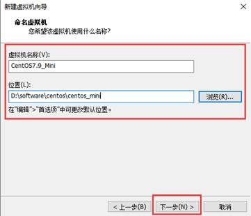
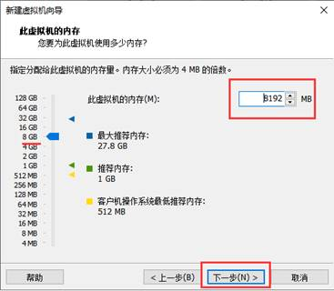
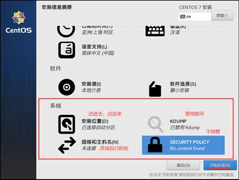
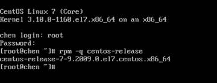

# 1 操作系统概述

## 1.1 常见操作系统

①概念：操作系统就是在管理计算机资源，所谓资源，就是硬件资源和软件资源。而操作系统是一个中间平台，负责连接软硬件，且操作系统本身也是软件。从硬件角度讲，操作系统就是整合了各种硬件驱动的平台 ☆

②定义：操作系统是管理计算机硬件和软件的计算机程序，是计算机系统的内核和基石 ☆

③说明：所有的软件都是安装在操作系统上 ☆

④常见系统：

1）Windows：民用（占比80%）

2）MacOS：民用（占比20%）

3）Linux：商用（服务器）

4）Andriod：移动端安卓手机（鸿蒙）

5）ios：移动端苹果手机

## 1.2 操作系统分类


说明：嵌入式就是各种智能终端，手表、录像机、微波炉、空调、冰箱、洗衣机...

特点：每一个领域都有Linux，所以Linux在互联网领域地位很重要

说明：新浪、百度、淘宝等大厂，95%的服务器都是Linux操作系统

## 1.3 Linux操作系统简介

说明：Linux是一套开源的操作系统（开源：免费使用、开放源码、无版权、可商用）

特点：一切都是文件，没有Windows系统盘的概念（File://）且根目录（用/表示）下每个目录都有确定的用途 ☆

说明：Linux整个生态很完整，支持多种插件，工具链完整

注意：Linux发行版，国内的主流是CentOS和Ubuntu

说明：CentOS前身是红帽RedHat，开源免费，纯命令行模式，而Ubuntu是图形化操作界面（了解）

说明：我们搭建的是CentOS，课余时间可以部署一下Ubuntu ☆

## 1.4 Linux与Windows区别

说明：两者的区别很多，比较明显的区别就是用途和图形化的区别 ☆

①Windows：民用居多，有图形化，操作系统方便，不开放源码，服务器领域是WindowsServer是收费的

②Linux：商用居多，国内主流服务器操作系统，开源免费，命令行模式，性能很高

说明：Windows系统是通过文件后缀来区分文件属性，Linux系统没有文件后缀的概念 ☆

# 2 运行环境部署

## 2.1 虚拟机概述

说明：部署Linux操作系统，我们通常采用的方式就是部署在虚拟机软件中 ☆

说明：常用的虚拟机软件是VMware Workstation（主流）和VirtualBox

结构图：


虚拟机作用：虚拟出一台计算机，可以当做成一台真实的机器来使用 ☆

虚拟机特点：

①不需要分区或重开机，就在同一台电脑上进行不同操作

②与真实机完全隔离，并且可以保护不同操作系统的环境配置，以及所有软件和资料

③不同的操作系统之间还能互动操作，可以进行网络通信和传输文件

④有复制和复原功能（真实机是没有的）

⑤能够随时修改操作系统的操作环境（内存、CPU核数、硬盘大小）

## 2.2 安装VMware虚拟机

## 2.3 安装CentOS7.9操作系统

看到主页面，点击创建虚拟机


 




 





 


 

 




 

 


 


查看当前CentOS版本的命令：rpm -q centos-release



 

 

 

## 2.4 安装XShell远程连接工具

说明：当对服务器进行操作时，不可能直接坐在服务器的旁边，而是使用工具进行远程操作服务器（XShell）


说明：市场上主流的远程连接工具，就是SecureCRT + XShell

说明：我们使用的是XShell6，课余时间可以安装部署SecureCRT

说明：默认状态下，XShell无法连接CentOS操作系统，需要统一配置IP地址才可以连接（类似Navicat）

## 2.5 配置IP

说明：只有配置号IP地址，虚拟机才能和真实机通信，并且能够访问外网 ☆

步骤：有三大步骤 ☆

①打开VMware，点击“编辑”，进入到“虚拟网络编辑器”


②配置Windows系统：


说明：找到VMware8，鼠标右键，选择属性 ☆

 

 

   

③配置CentOS系统：

先打开CentOS操作系统：

需要用户名和密码：

用户名：root（超级管理员）

密码：123

配置：需要配置CentOS的IP

命令：vi /etc/sysconfig/network-scripts/ifcfg-ens33


说明：先按字母“i”，进入到编辑模式


说明：修改完之后，按ESC退出编辑模式

说明：退出之后，按“:wq”意为退出并保存 ☆

说明：退出到家目录后，写命令“reboot”意为重启 ☆

验证：重启后，利用ip addr（DVD版本：ipconfig好使）命令，验证系统ip是否配置成功 ☆


验证：利用ping命令，验证是否能够连接外网 ☆

注意：ping这个命令，在Windows中也好用 ☆（主要作用测试网络是否通畅）

Windows：


Linux：


结论：如果ip正确，且网络通畅，说明三大步骤配置成功！☆

说明：配置成功后，我们就可以使用XShell工具，连接CentOS7.9进行命令操作 ☆

 

 

 

 

验证：使用CentOS系统ping本地Windows系统

说明：查看Windows的IP地址命令：cmd->ipconfig，查看CentOS的IP地址是ifconfig（DVD版本可用）


说明：如果能够跟本地Windows进行交互，那么就可以使用XShell6工具进行远程连接 ☆

说明：XShell工具提供了很多功能，例如支持复制粘贴


说明：远程连接一台服务器主机，需要使用IP+账号+密码

# 3 Linux基础

## 3.1 常见命令用法

* clear	清屏
* cd	进入目录 	cd .. 回到上一层

* ll	查看目录：显示文件或目录的详细信息

* mkdir  创建空目录

* touch  创建文件

* rm  删除目录和文件

* vim  编辑文件：不存在就创建（按i进入编辑模式，按Esc退出编辑模式，按:wq保存并退出）

* cat  查看文件内容

* pwd查看当前路径：

注意：


## 3.2 CentOS根目录结构解析


bin：可执行程序（安装的软件或linux自带的命令，都在bin目录里），是一些shell脚本

boot：系统启动

dev：设备（跟硬件相关的）device，光驱，硬盘，网络设备，cpu...

etc：所有的配置目录，无论是系统配置，还是自己装的软件的配置，都在etc目录里 ☆

lib：所有跟类库相关的，都放在这里面

lib64：所有跟类库相关的，都放在这里面

srv：所有跟服务相关的，都方法放在srv里面

home：家目录，除root用户外，所有用户的目录都会在home中创建同名文件夹

root：超级管理员的家目录

media：媒体（光驱）

net：网络相关

mnt：自己挂载的外部设备

opt：额外扩展的应用软件，会安装在opt中

sbin：只有超级管理员自己才能执行

sys：2.6版本的扩展目录

tmp：临时文件

usr：额外扩展的可执行程序

var：每天产生变化的文件放这里

## 3.3 关于虚拟机时间同步

命令：date，会输出当前日期

步骤：


 

 

 

 

 

 

 

 

## 3.4 VMware克隆和快照

①克隆：就是将原先的系统，复制粘贴一份

克隆特点：

1）占用空间大

2）原来系统不存在，克隆出的系统，也还可以正常使用

克隆注意事项：开启状态和挂起状态都无法克隆，必须关闭虚拟机 ☆

操作步骤：右键虚拟机名称--管理--克隆，选择“创建完整克隆”

说明：克隆的时间长短取决于本机电脑系统配置

说明：克隆完成后，会自动显示在VMware菜单里

问题：如果克隆成功了，但是虚拟机并没有把目录加载出来

解决：点击虚拟机窗口的“文件”，选择“打开”，选择对应的克隆目录中的.vmx文件即可

 

②快照：相当于把原系统拍了一张照片，没有把完整的系统拷贝下来

快照特点：占用空间小，原来系统不存在，快照也会被删除

说明：快照可以在虚拟机开启的状态下操作 ☆

操作：


说明：给照片起名字，最好加时间，描述信息写清楚此时系统的状态

还原：右键虚拟机，选择快照，选择快照管理

说明：快照的功能，就是当要去做一些很复杂，很容易出问题的操作时，我们要先拍个快照，存储一下当前状态 ☆

说明：克隆和快照，都相当于对系统的备份 ☆

## 3.5 常见快捷键

Ctrl+Q 强行退出

Ctrl+C 强行终止正在进行的程序

Ctrl+L 清屏（或者clear也可以）

Ctrl+Alt 鼠标释放

上下键：与DOS系统相同

Tab键：自动补全（代码助手，与DOS系统相同，按第1下：如果唯一，就自动补全，如果不唯一，再按第2下，会把所有符合的，全部列出来，你照着打）

# 4 Linux常用命令

## 4.1 账号管理

注意：关于账号的管理命令必须使用root超级管理员进行设定 ☆

①创建用户：useradd

②用户口令：passwd

说明：密码必须不小于8位，且英文+数字形式

说明：密码不能是回文：正反读是一样的，就是回文，不允许回文（aaa12321aaa）


③修改用户：usermod

命令：usermod -l ccc aaa，含义就是将aaa用户名改为ccc

注意：usermod -l修改的是所属者（修改文件名需要使用mv）


④删除用户：userdel

说明：userdel中的-r表示删除所有，-f表示强制删除，二者连用-rf（rm -rf demo）


 

 

 

 

 

 

 

 

 

 

## 4.2 用户组

说明：用户组，就是给用户分组

特点：当给某个组添加一个权限的时候，那么整个组成员都被赋予这个权限

注意：用户组的操作，也需要使用root权限 ☆

举例：分成三个组，分别为测试组、开发组、运维组 ☆

①创建用户组：groupadd

②修改用户组：groupmod


③查询用户所属组：groups（当前用户是谁，就查询谁的组）


注意：我们可以使用Ctrl+D登出当前用户（exit）


④删除用户组：groupdel

⑤向用户组中添加成员：gpasswd用于将一个用户添加到组中或从组中删除（-a是添加，-d是删除）


⑥查看用户组：cat /etc/group，该文件下是所有的组 ☆


扩展：还可以使用搜索的命令“grep 'ceshi' /etc/group”


## 4.3 目录操作

说明：文件夹就是目录

①创建目录：mkdir aaa（只能创建单级的空目录），mkdir -p a/b/c连续创建目录


②删除目录：rmdir aaa（删除空目录，只能删空的）

注意：rmdir -p aaa/bbb，前提bbb为空，如果aaa中的bbb被删了，aaa也变为空目录，那么连aaa一起删掉

注意：rmdir只能删除目录，无法删除文件

③删除文件和目录：☆

rm -r aaa，删除文件或目录

rm -rf aaa，无需确认，直接删除（常用）（rm -rf ./* 删除当前目录里的所有文件）


## 4.4 文件操作

①文件复制：cp

需求：aaa文件夹中有文件a.txt，将a.txt文件拷贝到bbb文件夹中

命令：cp aaa/a.txt bbb，含义是将a.txt文件拷贝到bbb文件夹下


注意：只用cp，只能拷贝文件，不能拷贝目录，拷贝目录需要加-r

命令：cp -r aaa/* bbb，含义是将aaa文件夹中的所有文件，都拷贝到bbb文件夹下 ☆


②文件移动：mv

参数：-i，若指定目录已有同名文件，先询问是否覆盖

参数：-f，若指定目录已有同名文件，直接覆盖

需求：把aaa目录里所有的东西，都剪切到bbb中


需求：在aaa目录中创建demo.txt，并写入内容，然后将aaa中的demo.txt剪切到bbb中，构建询问 ☆

注意：y表示同意，n表示不同意


注意：剪切整体目录，剪切目录里所有的内容，剪切目录里单独的文件或目录，都可以 ☆

注意：重命名问题，也可以使用mv进行 ☆


注意：剪切文件与目录的区别如下：

1）mv 文件名 文件名：重命名

2）mv 文件名 目录名：将文件移动到目录

3）mv 目录名1 目录名2：目录2存在是移动，目录2不存在是改名 ☆

4）mv 目录名 文件名：报错 ☆


③文件属性：☆

命令：ls -al，会显示出文件或目录，包括隐藏

命令：ll，会显示出文件或目录，不包括隐藏

第1列：表示权限，d表示目录，-表示文件，l表示链接文档（软连接）

第2列：目录个数（包括隐藏文件）

第3列：所有者

第4列：所属组

第5列：大小

第6列：时间

第7列：名称（以.开头的，是隐藏文件）

 

 

 

 

 

 

 

 

④文件权限：☆

比如：drwxr-xr-x

说明：共10位组成，第1位是类型

含义：read为可读，write为可写，execute为可执行，-为没有当前权限 ☆

说明：2-4位是所有者的权限，5-7位是所属组的权限，8-10位是其他人的权限 ☆（所有者、所属组、其他人）

举例：如果权限为-rwxr-xr-x，那么：

rwx 所有者：可读可写可执行

r-x：所属组：可读不可写可执行

r-x：其他人：可读不可写可执行

说明：当一个其他用户来访问文件时，如果没有权限读写执行，那么就需要修改权限 ☆

 

⑤权限修改：☆

注意：修改权限必须是root用户 ☆

1）chgrp：（change group）只能更改用户组

命令：chgrp test demo，含义把目录demo所在的用户组权限修改为test ☆

命令：chgrp -v test demo，含义把目录demo所在的用户组权限修改为test ☆（-v就是多了一句提示语句）


2）chown：不仅能够修改用户组，也能修改所有者 ☆

命令：chown test demo，含义把demo所有者改为test

命令：chown test:test demo，含义把demo的所有者和用户组都改为test ☆

说明：改目录，改文件都可以

注意：如果加-R，则当前目录下，所有的内容都会跟着改变 ☆（注意大小写）


3）chmod：修改所有者、所属组、其他人的权限 ☆

需求：将-rwxr-x---改为-rwxrwxrwx

方式：两种更改方式，可以使用数字权限和符号权限


说明：设置的时候，写数字7就表示rwx（4+2+1），如果设置成数字5，表示什么意思？（可读可执行：r-x）

写法：chmod -vR 770 aaa，含义是将aaa目录下的所有内容，设置成所有者和所属组可读可写可执行，其他无权限


 

 

 

 

 

 

 

 


说明：也可以使用+号-号=号作为权限的设置

写法：chmod -R u=rwx,g=rx,o=r bbb，含义将bbb目录权限改为drwxr-xr--

写法：chmod -R a=rwx bbb，含义将bbb目录改为drwxrwxrwx（a表示所有用户全包括 ☆ 简化写法）

写法：chmod -R o-rwx bbb，含义去掉bbb目录其他用户的所有权限


## 4.5 查找操作

命令：find，含义在指定的目录下查找文件名或者目录名

说明：grep搜索的是文件内容，find是搜索文件名和目录名

写法：grep “hel” a.txt

写法：find demo -name “a*.txt”

参数：-name，表示按名称查找

参数：-ctime，表示按时间查找（-n是几天内，+n是几天前）


说明：查找当前目录，就把a/b/c换成.；查找全盘，就把.换成/ ☆（建议指定目录）

## 4.6 系统进程

说明：关于系统进程命令常用的有三个：top、ps、kill

①top命令：可以实时监控linux所有进程状态（动态获取）

用法：直接写top（动态监控，不断变化，结束监控按字母q或Ctrl+c）

命令：top -c，显示完整命令

命令：top -p PID号，查看指定进程信息

说明：可以从root切换到test用户，这样会实时有显示信息 ☆

说明：有点像windows中的任务管理器


常用列：

PID：进程号

USER：进程所属用户

PR和NI：优先级（负号表示高优先级）

VIRT：内存使用情况

S：运行状态（R就是运行中，S就是休眠）

COMMAND：命令的名字

 

②命令ps：

说明：ps命令也是查看进程状态，但是只能获取当前时刻的进程状态（静态获取）

用法：直接写ps即可，获取当前正在运行的进程

命令：ps -A：显示系统中所有的进程信息

命令：ps -ef：显示系统中所有的进程的完整信息

命令：ps -u 用户名：获取指定用户的所有进程

 

 

 

 

③命令kill：

说明：kill就是杀死进程（强制停止进程运行），具体怎么杀，要看参数

命令：kill 2040，就是杀死进程号是2040的进程

命令：kill -9 2040，强制杀死（9就是编号，kill -l查看所有编号）

说明：kill还可以杀死某个用户下所有的进程：

命令：kill -9 $(ps -ef | grep tom)，含义就是强制杀死所有tom用户下的进程


## 4.7 备份压缩

说明：压缩格式常见的是rar和zip，二者区别是rar只在windows下识别，zip在linux和windows都可识别

①gzip命令：

说明：被压缩的文件后缀，是.gz

说明：gzip压缩命令，会把之前的文件删掉

注意：如果把当前目录下所有的文件都压缩，那么可以使用gzip *，但注意压缩文件不能再次压缩 ☆


解压命令：gzip -dv *


解压命令：gunzip


②tar命令：也是一种压缩命令

说明：tar本身不具有压缩功能，是调用其他压缩命令来实现

参数：

-c 建立新的压缩文件

-v 显示指令执行过程

-f 指定压缩文件

-z 通过gzip命令处理压缩文件

-t 列出压缩文件中的内容

-x 表示解压

压缩命令：tar -zcvf


解压命令：tar -zxvf（用的多）


③zip命令：

说明：CentOS7.9Minimal版本默认不支持zip命令，需要使用root用户安装（yum -y install zip）

说明：zip压缩应用广泛，压缩后，会产生一个.zip为扩展名的文件 ☆

参数：-q不显示执行过程

参数：-r递归处理，指定目录下所有的文件和子目录一并处理


解压：unzip命令，只能解压.zip的压缩包（默认没有，需要root用户yum安装，yum -y install zip）

参数：-l显示压缩包里的内容（不压缩）

参数：-d指定存储目录

注意：无参数，直接写unzip命令，就是解压


④bzip2命令：

特点：使用新的压缩算法，压缩后的文件比原来要小，但花费时间变长

说明：直接使用bzip2命令压缩，会产生.bz2的压缩文件（安装包有的就是.bz2），并删除原始文件

解压：bunzip2命令，-v显示详细信息


 

 

 

 

 

 

 

 

## 4.8 网络操作

①ifconfig：DVD版本有，Mini版本没有


②ping命令：

说明：跟windows中的ping相同（外网内网都可以ping）

作用：测试网络是否通常（原理发送一个小的数据包，来查看网络传输情况）

用法：ping -c 4 www.baidu.com

注意：ping域名，必须配置DNS解析器


## 4.9 软件安装

说明：linux中，如果想要下载安装或卸载软件，需要使用yum命令操作

原理：yum命令会自动去互联网的软件包服务器中下载（软件包服务器称为yum源）

说明：yum命令不仅可以自动下载，也可以自动解决依赖问题和安装部署问题 ☆

应用：安装Tree插件（目录会成树形展示）

命令：yum -y install tree（-y表示如果有选择提示，就全部选yes）


 

补充自学：查看日志 https://www.cnblogs.com/ArcherWuAIot/p/16190149.html

总结：Linux的常用命令成百上千，我们只需要掌握此文档中的所有命令写法，遇见陌生的，现用现查 ☆

技巧：命令名称一般都是写在最前面，参数一般都是有-，很多参数可以写一起，且没有顺序 ☆

 


# 5 Linux具体操作实战

```
就是问chatgpt
```

## 5.1 在Linux系统上，我想编辑一个文本文件，并且只想编辑不以#开头的行

您可以使用grep命令来选择不以#开头的行，并将其输出到一个新的文件中，然后使用您喜欢的编辑器编辑该文件。

以下是一个示例命令：

```bash
grep -v "^#" filename.txt > newfile.txt
```

这将选择filename.txt文件中不以#开头的行，并将结果写入newfile.txt文件中。您可以使用vim、nano或emacs等文本编辑器编辑newfile.txt文件。

请注意，这个命令会将filename.txt文件中不以#开头的所有行输出到newfile.txt文件中。如果您只想选择特定的行，可以使用grep命令的其他选项来匹配您想要的文本模式。例如，如果您只想选择以单词"example"开头的行，您可以使用以下命令：

```bash
grep "^example" filename.txt > newfile.txt
```

这将选择filename.txt文件中以"example"开头的行，并将结果写入newfile.txt文件中。


## 5.2 linux中的 vi 文本编辑 怎么使用

Vi是Linux系统中的一个文本编辑器，是Unix操作系统中最古老的文本编辑器之一，也是最常用的编辑器之一。在Linux系统中，Vi通常是默认的命令行文本编辑器。

下面是一些Vi编辑器的基本命令：

打开文件：

```
vi filename
```

这个命令将打开一个名为filename的文件，并将光标置于第一行的开头。

移动光标：

您可以使用以下命令来移动光标：

```
h - 向左移动一个字符
l - 向右移动一个字符
j - 向下移动一行
k - 向上移动一行
w - 向右移动一个单词
b - 向左移动一个单词
0 - 将光标置于当前行的开头
$ - 将光标置于当前行的结尾
gg - 将光标置于文件的开头
G - 将光标置于文件的结尾
```

插入和编辑文本：

要开始插入文本，请按下`i`键。这将使光标移动到当前位置，并允许您在文本中输入新的字符。

要从当前光标位置插入新行，请按下`o`键。

要编辑已有的文本，请按下`x`键。这将删除光标所在的当前字符。

保存和退出：

要保存文件并退出Vi编辑器，请输入以下命令：

```
:wq
```

这将保存文件并退出编辑器。

要强制保存文件而不退出编辑器，请输入以下命令：

```
:w
```

要退出编辑器而不保存任何更改，请输入以下命令：

```
:q!
```

这将退出编辑器并放弃任何更改。

这是Vi编辑器的一些基本命令。对于更高级的用法和命令，请参考Vi编辑器的文档或其他教程。