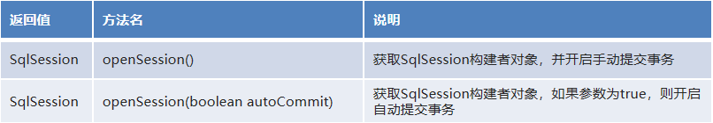
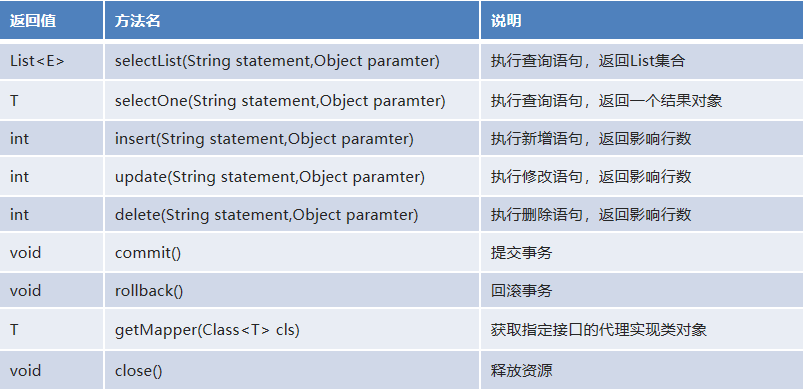

# 序  前置知识

## 0-1 ORM

* ORM(Object Relational Mapping)： **对象关系映射**

* 指的是持久化数据和实体对象的映射模式，为了解决面向对象与关系型数据库存在的互不匹配的现象的技术。

* 如图:

  

* 具体映射关系如下图:


## 0-2 什么是MyBatis

* mybatis 是一个优秀的基于java的==持久层框架==，它内部==封装了jdbc==，使开发者只需要关注sql语句本身，而不需要花费精力去处理加载驱动、创建连接、创建statement等繁杂的过程。

* mybatis通过==xml或注解的方式==将要执行的各种 statement配置起来，并通过java对象和statement中sql的动态参数进行映射生成最终执行的sql语句。

* 最后mybatis框架执行sql并将结果映射为java对象并返回。==采用ORM思想解决了实体和数据库映射的问题==，对jdbc 进行了封装，屏蔽了jdbc api 底层访问细节，使我们不用与jdbc api 打交道，就可以完成对数据库的持久化操作。

* MyBatis官网地址：<http://www.mybatis.org/mybatis-3/> 

```
和之前跟着JDBC老师写的自定义框架差不多，
Mybatis更加完善，而且增加了将sql语句抽取到配置文件的步骤，避免了硬编码。
```

# P章 问题记录

## P-1 如图


原因：

这个报错是因为你配置的标签顺序不对

按照报错信息的标签顺序去书写你的配置信息

从先到后必须是：

properties => settings => typeAliases => typeHandlers =>objectFactory =>objectWrapperFactory => reflectorFactory =>plugins => environments =>databaseIdProvider => mappers

## P-2 Maven环境下找不到非resources文件夹下的映射配置文件

在父工程pom.xml下添加如下代码

```xml
<build>
    <resources>
        <resource>
            <directory>src/main/java</directory>
            <includes>
                <include>**/*.properties</include>
                <include>**/*.xml</include>
            </includes>
            <filtering>true</filtering>
        </resource>
    </resources>
</build>
```

## P-3 报错：1 字节的 UTF-8 序列的字节 1 无效

**原因** XML出现了中文注解

**方案一** 将有中文注释的xml文件（不需要所有的xml都要改）的顶部的UTF-8

```xml
<?xml version="1.0" encoding="UTF-8"?>
```

改成UTF8

```xml
<?xml version="1.0" encoding="UTF8"?>
```

**方案二**  在父工程pom.xml文件中插入下面一行代码进行全局配置

```xml
<properties>
	<project.build.sourceEncoding>UTF8</project.build.sourceEncoding>
</properties>
注意是UTF8不是UTF-8，效果是等同把所有xml文件的第一行的encoding改成UTF8
```

# X章 实战主题

## X-1 MyBatis集成Log4j

[Spring + Mybatis整合log4j日志打印sql语句]: https://blog.csdn.net/weixin_41878186/article/details/86666836?spm=1035.2023.3001.6557&amp;utm_medium=distribute.pc_relevant_bbs_down_v2.none-task-blog-2~default~OPENSEARCH~Rate-2.pc_relevant_bbs_down_cate&amp;depth_1-utm_source=distribute.pc_relevant_bbs_down_v2.none-task-blog-2~default~OPENSEARCH~Rate-2.pc_relevant_bbs_down_cate


## X-2 Mybatis分页插件PageHelper

* 在企业级开发中，分页也是一种常见的技术。
* 而目前使用的 ==MyBatis 是不带分页功能的==，如果想实现分页的功能，需要我们手动编写 LIMIT 语句。但是不同的数据库实现分页的 SQL 语句也是不同的，所以==手写分页成本较高==。这个时候就可以借助分页插件来帮助我们实现分页功能。 

* PageHelper：第三方分页助手。将复杂的分页操作进行封装，从而让分页功能变得非常简单。    

### X-2-1 准备工作

#### 1-添加jar包依赖

父工程pom.xml中

```xml
<!-- https://mvnrepository.com/artifact/com.github.pagehelper/pagehelper -->
<dependency>
    <groupId>com.github.pagehelper</groupId>
    <artifactId>pagehelper</artifactId>
    <version>5.1.10</version>
</dependency>
```

#### 2-在Mybatis核心配置文件中添加配置

MyBatisConfig.xml

```xml
<!--集成分页助手插件-->
<plugins>
    <plugin interceptor="com.github.pagehelper.PageInterceptor"></plugin>
</plugins>
```

### X-2-2 实战使用

#### 1-分析

有了分页插件，就不用在DAO层接口专门为了分页功能去添加额外的接口方法了

在DAO层只需要 查询全部 queryAll 一个接口

#### 2-PageHelper在Service层的使用

* 分页查询

```java
            StudentMapper mapper = sqlSession.getMapper(StudentMapper.class);
            //studentList = mapper.getStudentList((pageNum - 1) * 5);
            PageHelper.startPage(pageNum,5);//pageNum是传进来的参数
            studentList = mapper.queryAll();
```

* 获取总页数

```java
            StudentMapper mapper = sqlSession.getMapper(StudentMapper.class);
            PageHelper.startPage(1,5);
            List<Student> studentList = mapper.queryAll();
            PageInfo<Student> info = new PageInfo<>(studentList);
            pageCount = info.getPages();
```

### X-3-3 总结

* 关注两个：
  * （1）PageHelper.startPage( pageNum , pageSize )
  * （2）PageInfo<T\>

# 1 Mybatis快速入门

## 1-1 总体步骤

* （1）添加MyBatis的jar包
* （2）编写核心配置文件MyBatisConfig.xml

* （3）编写映射配置文件StudentMapper.xml
* （4）编写测试类

## 1-2 环境搭建

### 1-2-1 引入jar包

在pom.xml中添加如下dependency

导入mysql和mybatis的jar包

```xml
<!-- https://mvnrepository.com/artifact/mysql/mysql-connector-java -->
<dependency>
    <groupId>mysql</groupId>
    <artifactId>mysql-connector-java</artifactId>
    <version>5.1.37</version>
</dependency>

<!-- https://mvnrepository.com/artifact/org.mybatis/mybatis -->
<dependency>
    <groupId>org.mybatis</groupId>
    <artifactId>mybatis</artifactId>
    <version>3.4.6</version>
</dependency>
```

### 1-2-2 编写核心配置文件MyBatisConfig.xml

```xml
<?xml version="1.0" encoding="UTF-8" ?>
<!--MyBatis的DTD约束-->
<!DOCTYPE configuration PUBLIC "-//mybatis.org//DTD Config 3.0//EN" "http://mybatis.org/dtd/mybatis-3-config.dtd">

<!--configuration 核心根标签-->
<configuration>
    <!--environments配置数据库环境，环境可以有多个。default属性指定使用的是哪个-->
    <environments default="mysql">
        <!--environment配置数据库环境  id属性唯一标识-->
        <environment id="mysql">
            <!-- transactionManager事务管理。  type属性，采用JDBC默认的事务-->
            <transactionManager type="JDBC"></transactionManager>
            <!-- dataSource数据源信息   type属性 连接池-->
            <dataSource type="POOLED">
                <!-- property获取数据库连接的配置信息 -->
                <property name="driver" value="com.mysql.jdbc.Driver"/>
                <property name="url" value="jdbc:mysql://localhost:3306/mybatis_db1"/>
                <property name="username" value="root"/>
                <property name="password" value="root"/>
            </dataSource>
        </environment>
    </environments>

    <mappers>
        <!-- mapper 引入指定的映射配置文件   resource属性指定映射配置文件的名称 -->
        <mapper resource="StudentMapper.xml"/>
    </mappers>
</configuration>
```

### 1-2-3 编写映射配置文件StudentMapper.xml

```xml
<?xml version="1.0" encoding="UTF-8" ?>
<!--MyBatis的DTD约束-->
<!DOCTYPE mapper
        PUBLIC "-//mybatis.org//DTD Mapper 3.0//EN"
        "http://mybatis.org/dtd/mybatis-3-mapper.dtd">

<!--
    mapper：核心根标签
    namespace属性：名称空间
-->

<mapper namespace="StudentMapper">
    <!--
        select：查询功能的标签
        id属性：唯一标识
        resultType属性：指定结果映射对象类型
    -->
    <select id="selectAll" resultType="com.tan.mybatis.started.pojo.Student">
        SELECT * FROM t_student;
    </select>
</mapper>
```

## 1-3 编写测试代码

```java
    @Test
    public void selectAll() throws IOException {
        //(1) 加载核心配置文件
        InputStream is = Resources.getResourceAsStream("MyBatisConfig.xml");
        //(2) 获取SqlSession工厂对象
        SqlSessionFactory sqlSessionFactory = new SqlSessionFactoryBuilder().build(is);
        //(3) 通过SqlSession工厂对象获取SqlSession对象
        SqlSession sqlSession = sqlSessionFactory.openSession();
        //(4) 执行映射配置文件中的sql语句，并接收结果
        List<Student> studentList = sqlSession.selectList("StudentMapper.selectAll");
        //(5) 处理结果
        for (Student stu:studentList) {
            System.out.println(stu.toString());
        }
        //(6) 释放资源
        sqlSession.close();
        is.close();
    }
```

# 2 Mybatis相关API

## 2.1 Resources

* org.apache.ibatis.io.Resources：加载资源的工具类。

* 核心方法

  

## 2.2 构建器SqlSessionFactoryBuilder

* org.apache.ibatis.session.SqlSessionFactoryBuilder：获取 SqlSessionFactory 工厂对象的功能类

* 核心方法

  

* 通过加载mybatis的核心文件的输入流的形式构建一个SqlSessionFactory对象

```java
String resource = "org/mybatis/builder/mybatis-config.xml"; 
InputStream inputStream = Resources.getResourceAsStream(resource); 
SqlSessionFactoryBuilder builder = new SqlSessionFactoryBuilder(); 
SqlSessionFactory factory = builder.build(inputStream);
```

其中， Resources 工具类，这个类在 org.apache.ibatis.io 包中。Resources 类帮助你从类路径下、文件系统或一个 web URL 中加载资源文件。

## 2.3 工厂对象SqlSessionFactory

* org.apache.ibatis.session.SqlSessionFactory：获取 SqlSession 构建者对象的工厂接口。

* 核心api

  


## 2.4 ==SqlSession==会话对象

* org.apache.ibatis.session.SqlSession：构建者对象接口。用于执行 SQL、管理事务、接口代理。

* 核心api

  

SqlSession 实例在 MyBatis 中是非常强大的一个类。在这里你会看到所有执行语句、提交或回滚事务和获取映射器实例的方法。

# 3 映射&核心配置文件

## 3-1 映射配置文件

* 映射配置文件包含了数据和对象之间的映射关系
* 要执行的 SQL 语句

`StudentMapper.xml`

```xml
<?xml version="1.0" encoding="UTF-8" ?>
<!--MyBatis的DTD约束-->
<!DOCTYPE mapper
        PUBLIC "-//mybatis.org//DTD Mapper 3.0//EN"
        "http://mybatis.org/dtd/mybatis-3-mapper.dtd">

<!--
    mapper：核心根标签
    namespace属性：名称空间
-->

<mapper namespace="com.tan.student.mapper.StudentMapper">
    <!--
        select：查询功能的标签
        insert：新增功能的标签
        update：修改功能的标签
        delete：删除功能的标签
        id属性：唯一标识
        resultType属性：指定结果映射类型
        parameterType属性：指定参数映射类型
    -->
    <select id="getStudentList" parameterType="int" resultType="student">
        select * from t_student limit #{pageNum},5
    </select>
</mapper>
```

```
上面的 parameterType和 resultType都是起别名后的结果，起别名会在3-2中提到
```

在mybatis的映射配置文件中写sql语句：

预编译执行者中的 '?' 

-->就是mybatis中的 #{}

## 3-2 核心配置文件

* 核心配置文件包含了MyBatis最核心的设置和属性信息。如数据库的连接、事务、连接池信息等

```xml
<?xml version="1.0" encoding="UTF-8" ?>
<!--MyBatis的DTD约束-->
<!DOCTYPE configuration PUBLIC "-//mybatis.org//DTD Config 3.0//EN" "http://mybatis.org/dtd/mybatis-3-config.dtd">

<!--configuration 核心根标签-->
<configuration>

<!--    properties标签 引入数据库信息配置信息-->
    <properties resource="jdbc.properties"/>

<!--    typeAliases标签 起别名 -->
    <typeAliases>
<!--        <typeAlias type="com.tan.mybatis.started.pojo.Student" alias="student"/>-->
        <package name="com.tan.student.pojo"/>
    </typeAliases>

    <!--environments配置数据库环境，环境可以有多个。default属性指定使用的是哪个-->
    <environments default="mysql">
        <!--environment配置数据库环境  id属性唯一标识-->
        <environment id="mysql">
            <!-- transactionManager事务管理。  type属性，采用JDBC默认的事务-->
            <transactionManager type="JDBC"></transactionManager>
            <!-- dataSource数据源信息   type属性 连接池-->
            <dataSource type="POOLED">
                <!-- property获取数据库连接的配置信息 -->
                <property name="driver" value="${driver}"/>
                <property name="url" value="${url}"/>
                <property name="username" value="${username}"/>
                <property name="password" value="${password}"/>
            </dataSource>
        </environment>
    </environments>

    <mappers>
        <!-- mapper 引入指定的映射配置文件   resource属性指定映射配置文件的名称 -->
        <mapper resource="StudentMapper.xml"/>
    </mappers>
</configuration>
```

### 3-2-1 数据库连接配置文件引入

* properties标签引入外部文件

  ~~~xml
      <!--引入数据库连接的配置文件-->
      <properties resource="jdbc.properties"/>
  ~~~

* `jdbc.properties`

  ```properties
  driver=com.mysql.jdbc.Driver
  url=jdbc:mysql://localhost:3306/mybatis_db1
  username=root
  password=root
  ```
  
* 具体使用，如下配置

  ~~~xml
  <!-- property获取数据库连接的配置信息 -->
  <property name="driver" value="${driver}" />
  <property name="url" value="${url}" />
  <property name="username" value="${username}" />
  <property name="password" value="${password}" />
  ~~~

### 3-2-2 起别名

* <typeAliases>：为全类名起别名的父标签。

* <typeAlias>：为全类名起别名的子标签。

* 属性      

   type：指定全类名      

   alias：指定别名

* <package>：为指定包下所有类起别名的子标签。(==别名就是类名:但是首字母小写==)

* MyBatis给一个java自带的类型自动起了别名，如下表：

| 数据类型          | 别名    |
| ----------------- | ------- |
| java.lang.String  | string  |
| java.lang.Long    | long    |
| java.lang.Integer | int     |
| java.lang.Double  | double  |
| java.lang.Boolean | boolean |


* 具体如下配置

  ~~~xml
  <!--    typeAliases标签 起别名 -->
      <typeAliases>
  <!--        <typeAlias type="com.tan.mybatis.started.pojo.Student" alias="student"/>-->
          <package name="com.tan.student.pojo"/>
      </typeAliases>
  ~~~

# 4 接口代理实现Mapper(DAO)层

## 4-1 代理开发方式介绍

* 采用 Mybatis 的代理开发方式实现 DAO层的开发，这种方式是我们后面进入企业的主流。

* Mapper 接口开发方法==只需要程序员编写Mapper 接口（相当于DAO接口）==，由Mybatis框架根据接口定义创建接口的动态代理对象，代理对象的方法体同上边DAO接口实现类方法。

## 4-2 Mapper接口开发规范

* Mapper.xml文件中的namespace与mapper接口的全限定名相同
  * 如图：
  * 

* Mapper接口方法名和Mapper.xml中定义的每个statement的id相同
  * 
* Mapper接口方法的参数类型和mapper.xml中定义的每个sql的parameterType的类型相同
* Mapper接口方法的返回值类型和mapper.xml中定义的每个sql的resultType的类型相同

**总结:** 

接口开发的方式: 程序员只需定义接口,就可以对数据库进行操作,那么具体的对象怎么创建?

1.程序员负责定义接口

2.在操作数据库,mybatis框架根据接口,通过动态代理的方式生成代理对象,负责数据库的crud操作

```
具体怎么创建？
关键就是一个方法：
sqlSession.getMapper(接口名.class)
```

# 5 动态SQL

```
动态sql的两个主要标签
<if>
<foreach>
```

## 5-1 问题引入

==Mybatis的映射文件==中，前面我们的 SQL 都是比较简单的，有些时候业务逻辑复杂时，我们的SQL是动态变化的，此时在前面的学习中我们的 SQL 就不能满足要求了。

## 5-2 动态 SQL 之<**if>**

我们根据实体类的不同取值，使用不同的 SQL语句来进行查询。

比如在 id如果不为空时 可以根据id查询，如果username 不为空时还要加入用户名作为条件。

这种情况在我们的多条件组合查询中经常会碰到。

### 5-2-1 代码演示

* StudentMapper.xml中

```xml
    <select id="selectCondition" resultType="student" parameterType="student">
        select * from t_student
        <where>
            <if test="id!=null">
                id = #{id}
            </if>
            <if test="name!=null">
                and name = #{name}
            </if>
            <if test="age!=null">
                and age=#{age}
            </if>
        </where>
    </select>
```

**1-当用于查询的Student对象中只有id时**

```java
		StudentMapper mapper = sqlSession.getMapper(StudentMapper.class);

        Student stu = new Student();
        stu.setId(1);
        //stu.setName("张一");
        //stu.setAge(33);
        Student student = mapper.selectCondition(stu);
        System.out.println(student.toString());
```

控制台打印：


**2-当用于查询的Student对象有id和姓名时**

```java
        StudentMapper mapper = sqlSession.getMapper(StudentMapper.class);

        Student stu = new Student();
        stu.setId(1);
        stu.setName("张一");
        //stu.setAge(33);
        Student student = mapper.selectCondition(stu);
        System.out.println(student.toString());
```

控制台打印：


## 5-3 动态SQL之<**foreach>**

循环执行sql的拼接操作，例如：

```sql
SELECT * FROM t_student WHERE id IN (1,2,3)
```

### 5-3-1 代码演示

**StudentMapper.xml**

```xml
<select id="selectByIds" resultType="student" parameterType="list">
    select * from t_student
    <where>
        <foreach collection="list" open="id in (" close=")" item="id" separator=",">
            #{id}
        </foreach>
    </where>
</select>
```

**属性解释：**

collection : 参数的容器类型👉list--集合/array--数组

open ： 开始的sql语句

close：结束的sql语句

item：参数容器中元素起名

separater : 分隔符

**测试代码：**

```java
StudentMapper mapper = sqlSession.getMapper(Studet_ntMapper.class);

List<Integer> list = new ArrayList<>();
list.add(1);
list.add(2);
list.add(3);

List<Student> studentList = mapper.selectByIds(list);
for (Student student : studentList) {
    System.out.println(student.toString());
}
```

**控制台结果：**


## 5-4 动态SQL之<**sql>**

* 可将重复的 sql 提取出来，使用时用 <*include>* 引用即可
  * id属性：片段唯一标识

```xml
<!--抽取sql片段简化编写-->
<sql id="selectStudent">select * from student</sql>
```

*  <*include>* 引用
  * refid属性

```xml
<select id="findById" parameterType="int" resultType="student">
    <include refid="selectStudent"></include> where id=#{id}
</select>
```

# 6 多表操作

我们之前学习的都是基于单表操作的，而实际开发中，随着业务难度的加深，肯定需要多表操作的。 

## 6-1 对一

### 6-1-1 数据准备

**person表**


**card表**


**Person实体类**

```java
@Data
@AllArgsConstructor
@NoArgsConstructor
public class Person {
    private Integer id;
    private String name;
    private Integer age;

    private Card card;
}
```

**Card实体类**

```java
@Data
@AllArgsConstructor
@NoArgsConstructor
public class Card {
    private Integer id;
    private String number;
    private Person person;
}
```

### 6-1-2 代码实现

#### 6-1-2-1 创建CardMapper接口

```java
public interface CardMapper {
    /**
     * 查询所有身份证
     * @return 身份证 list集合
     */
    List<Card> queryAllCard();
}
```

#### 6-1-2-2 在数据库测试查询

```mysql
SELECT c.id cid,number,pid,name,age FROM card c INNER JOIN person p ON c.pid=p.id
```

**查询结果：**


#### 6-1-2-3 创建CardMapper.xml配置文件

```xml
<mapper namespace="com.tan.mybatis.onetoone.mapper.CardMapper">

    <!-- 创建resultMap实现“对一”关联关系映射 -->
    <!-- id属性：通常设置为这个resultMap所服务的那条SQL语句的id加上“ResultMap” -->
    <!-- type属性：要设置为这个resultMap所服务的那条SQL语句最终要返回的类型 -->
    <resultMap id="queryAllCardResultMap" type="card">
        <!-- 先设置Card自身属性和字段的对应关系 -->
        <id column="cid" property="id"/>
        <result column="number" property="number"/>
        <!-- 使用association标签配置“对一”关联关系 -->
        <!-- property属性：在Card类中对一的一端进行引用时使用的属性名 -->
        <!-- javaType属性：一的一端类的全类名 -->
        <association property="person" javaType="person">
            <!-- 配置Person类的属性和字段名之间的对应关系 -->
            <id column="pid" property="id"/>
            <result column="name" property="name"/>
            <result column="age" property="age"/>
        </association>
    </resultMap>
    
    <select id="queryAllCard" resultMap="queryAllCardResultMap">
        SELECT c.id cid,number,pid,name,age 
        FROM card c INNER JOIN person p 
        ON c.pid=p.id
    </select>
</mapper>
```

#### 6-1-2-4 在Mybatis核心配置文件中注册映射配置文件

```xml
<!--mappers 引入映射配置文件-->
<mappers>
    <!-- mapper 引入指定的映射配置文件   resource属性指定映射配置文件的名称 -->
    <mapper resource="com/tan/mybatis/onetoone/mapper/CardMapper.xml"/>
</mappers>
```

#### 6-1-2-5 单元测试

```java
    @Test
    public void queryAllCard(){
        CardMapper cardMapper = session.getMapper(CardMapper.class);
        List<Card> cardList = cardMapper.queryAllCard();
        for (Card card : cardList) {
            System.out.println(card);
        }
    }
```

控制台：


### 6-1-3 关键知识点

* <resultMap>标签
* <association>标签
  * javaType属性

* 直接看 6-1-2-3 即可，重点全在那里

## 6-2 对多

### 6-2-1 数据准备

**classes表**


**student表**


**Classes实体类**

```java
@Data
@AllArgsConstructor
@NoArgsConstructor
public class Classes {
    //表内数据
    private Integer id;
    private String name;

    //表外关联
    private List<Student> studentList;
}
```

**Student实体类**

```java
@Data
@AllArgsConstructor
@NoArgsConstructor
public class Student {
    //表内数据
    private Integer id;
    private String name;
    private Integer age;
    private Classes classes;//外键
}
```

### 6-2-2 代码实现

#### 6-2-2-1 创建ClassesMapper接口

```java
public interface ClassesMapper {
    /**
     * 查询班级和班级中的所有学生
     * @return 班级list集合
     */
    List<Classes> queryAll();
}
```

#### 6-2-2-2 在数据库测试查询

```mysql
SELECT c.id cid,c.name cname,s.id sid,s.name sname,s.age sage 
FROM student s INNER JOIN classes c 
ON s.cid = c.id
```

**查询结果**


#### 6-2-2-3 ClassesMapper配置文件

```xml
<mapper namespace="com.tan.mybatis.onetomany.mapper.ClassesMapper">
    
    <!-- 配置resultMap实现从Classes到studentList的“对多”关联关系 -->
    <resultMap id="queryAllResultMap" type="classes">
        <!-- 映射Classes本身的属性 -->
        <id column="cid" property="id"/>
        <result column="cname" property="name"/>

        <!-- collection标签：映射“对多”的关联关系 -->
        <!-- property属性：在Classes类中，关联“多”的一端的属性名 -->
        <!-- ofType属性：集合属性中元素的类型 -->
        <collection property="studentList" ofType="student">
            <id column="sid" property="id"/>
            <result column="sname" property="name"/>
            <result column="sage" property="age"/>
        </collection>
    </resultMap>

    <!--List<Classes> queryAll();-->
    <select id="queryAll" resultMap="queryAllResultMap">
        SELECT c.id cid,c.name cname,s.id sid,s.name sname,s.age sage
        FROM student s INNER JOIN classes c
        ON s.cid = c.id
    </select>
</mapper>
```

记得在mybatis核心配置文件中引入此映射配置

#### 6-2-2-4 单元测试

```java
    @Test
    public void queryAll(){
        ClassesMapper mapper = session.getMapper(ClassesMapper.class);
        List<Classes> classesList = mapper.queryAll();
        for (Classes classes : classesList) {
            System.out.println(classes.toString());
        }
    }
```

**控制台：**


## 6-3 延迟加载与分步查询

### 6-3-1 延迟加载概念

* 以Customer和Order的一对多关系为例

* 查询到Customer的时候，不一定会使用Order的List集合数据。如果Order的集合数据始终没有使用，那么这部分数据占用的内存就浪费了。对此，我们希望不一定会被用到的数据，==能够在需要使用的时候再去查询==。  

**例如**：对Customer进行1000次查询中，其中只有15次会用到Order的集合数据，那么就在需要使用时才去查询能够大幅度节约内存空间。  

**延迟加载的概念：**对于实体类关联的属性到需要使用时才查询。也叫懒加载。

### 6-3-2 延迟加载的配置

#### 6-3-2-1 较低版本的mybatis

核心配置文件中：

```xml
<!-- 使用settings对Mybatis全局进行设置 -->
<settings>

  <!-- 开启延迟加载功能：需要配置两个配置项 -->
  <!-- 1、将lazyLoadingEnabled设置为true，开启懒加载功能 -->
  <setting name="lazyLoadingEnabled" value="true"/>

  <!-- 2、将aggressiveLazyLoading设置为false，关闭“积极的懒加载” -->
  <setting name="aggressiveLazyLoading" value="false"/>

</settings>
```

#### 6-3-2-2 较高版本的mybatis

核心配置文件中：

```xml
<!-- Mybatis全局配置 -->
<settings>

  <!-- 开启延迟加载功能 -->
  <setting name="lazyLoadingEnabled" value="true"/>

</settings>
```

### 6-3-3 分步查询

* 为了实现延迟加载，对Customer和Order的查询必须分开，分成两步来做，才能够实现。
* 为此，我们需要单独查询Order，也就是需要在Mapper配置文件中，单独编写查询Order集合数据的SQL语句。

#### 6-3-3-1 编写查询Customer的SQL语句

```xml
<!-- 专门指定一条SQL语句，用来查询Customer，而且是仅仅查询Customer本身，不携带Order -->
<select id="selectCustomerWithOrderList" resultMap="selectCustomerWithOrderListResultMap">

  select customer_id,customer_name from t_customer
  where customer_id=#{customerId}

</select>
```

#### 6-3-3-2 编写查询Order的SQL语句

```xml
<select id="selectOrderList" resultType="com.atguigu.mybatis.entity.Order">

  select order_id,order_name from t_order where customer_id=#{customer_id}

</select>
```

#### 6-3-3-3 配置关联关系和分布查询

```xml
<!-- 配置resultMap实现从Customer到OrderList的“对多”关联关系 -->
<resultMap id="selectCustomerWithOrderListResultMap"
           type="com.atguigu.mybatis.entity.Customer">

    <!-- 映射Customer本身的属性 -->
    <id column="customer_id" property="customerId"/>

    <result column="customer_name" property="customerName"/>

    <collection property="orderList" select="com.atguigu.mybatis.mapper.CustomerMapper.selectOrderList"
                column="customer_id"/>

</resultMap>

<!-- Customer selectCustomerWithOrderList(Integer customerId); -->
<select id="selectCustomerWithOrderList" resultMap="selectCustomerWithOrderListResultMap">

    SELECT c.customer_id,c.customer_name,o.order_id,o.order_name
    FROM t_customer c
    LEFT JOIN t_order o
    ON c.customer_id=o.customer_id
    WHERE c.customer_id=#{customerId}

</select>
```

### 6-3-4 单元测试

```java
@Test

public void testSelectCustomerWithOrderList() throws InterruptedException {

  CustomerMapper mapper = session.getMapper(CustomerMapper.class);

  Customer customer = mapper.selectCustomerWithOrderList(1);

  // 这里必须只打印“customerId或customerName”这样已经加载的属性才能看到延迟加载的效果
  // 这里如果打印Customer对象整体则看不到效果
  log.info("customer = " + customer.getCustomerName());

  // 先指定具体的时间单位，然后再让线程睡一会儿
  TimeUnit.SECONDS.sleep(5);

  List<Order> orderList = customer.getOrderList();

  for (Order order : orderList) {

    log.info("order = " + order);

  }

}
```

效果：刚开始先查询Customer本身，需要用到OrderList的时候才发送SQL语句去查询


# 7 mybatis注解开发

这几年来注解开发越来越流行，Mybatis也可以使用注解开发方式，这样我们就可以减少编写Mapper映射文件了。

```
注解就是为了杀掉xml配置文件，底层其实是一样的 
但是xml在动态sql方面更有优势，不能完全抛弃xml
```

## 7-1 常用注解

核心就是增删改查四个注解加上SQL语句内容即可

| 注解     | 功能                                   |
| -------- | -------------------------------------- |
| @Insert  | 实现新增                               |
| @Update  | 实现更新                               |
| @Delete  | 实现删除                               |
| @Select  | 实现查询                               |
| @Result  | 实现结果集封装                         |
| @Results | 可以与@Result 一起使用，封装多个结果集 |
| @One     | 实现对一关联结果集封装                 |
| @Many    | 实现对多关联结果集封装                 |

==使用注解要注意在核心配置文件中添加配置映射关系== 添加如下代码即可

```xml
<mappers> 
    <package name="接口所在包"/> 
</mappers>    
```

## 7-2 单表注解开发

将 第四章 中的  StudentMap.xml 全部改为注解的形式，观察两种开发模式的区别

**StudentMapper接口**

```java
public interface StudentMapper {

    /**
     * 查询全部学生（用分页插件的方式）
     * @return 全部学生数据
     */
    @Select("select * from t_student")
    List<Student> queryAll();

    /**
     * 删除指定id的学生信息
     * @param id 学生id
     */
    @Delete("delete from t_student where id = #{id}")
    void delStudent(Integer id);

    /**
     * 添加学生信息
     * @param stu 学生对象
     */
    @Insert("insert into t_student values (null,#{name},#{age})")
    void addStudent(Student stu);

    /**
     * 修改学生信息
     * @param stu 学生对象
     */
    @Update("update t_student set name=#{name},age=#{age} where id=#{id}")
    void updateStudent(Student stu);

    /**
     * 根据id查询学生信息
     * @param id 学生id
     * @return 学生信息
     */
    @Select("select * from t_student where id = #{id}")
    Student getStudent(Integer id);


}
```


```
resultType和parameterType都消失了
```

## 7-3 多表注解开发

### 7-3-1 理论

实现复杂关系映射之前我们可以在映射文件中通过配置<resultMap>来实现，使用注解开发后，我们可以使用@Results注解，@Result注解，@One注解，@Many注解组合完成复杂关系的配置


### 7-3-2 对一

直接复制一份6-1的模块在它的基础上修改

```
这里其实是分步查询的查法
```

**PersonMapper接口**

```java
public interface PersonMapper {

    /**
     * 根据id找到Person对象
     * @param id Person id
     * @return Person对象
     */
    @Select("select * from person where id = #{id}")
    Person queryPersonById(Integer id);

}
```

**CardMapper接口**

```java
public interface CardMapper {

    /**
     * 查询所有身份证
     * @return 身份证 list集合
     */
    @Select("select * from card")
    @Results({
            @Result(column = "id",property = "id"),
            @Result(column = "number",property = "number"),
            @Result(
                    property = "person",
                    column = "pid",
                    one = @One(select = "com.tan.mybatis.onetoone.mapper.PersonMapper.queryPersonById"))
    })
    List<Card> queryAllCard();

}
```

### 7-3-3 对多

直接复制一份6-2的模块在它的基础上修改

**StudentMapper接口**

```java
public interface StudentMapper {

    /**
     * 根据班级id查询学生list集合
     * @param cid 班级id
     * @return 学生list集合
     */
    @Select("select * from student where cid = #{cid}")
    List<Student> queryByCid(Integer cid);

}
```

**ClassesMapper接口**

```java
public interface ClassesMapper {

    /**
     * 查询班级和班级中的所有学生
     * @return 班级list集合
     */
    @Select("select * from classes")
    @Results({
            @Result(column = "id",property = "id"),
            @Result(column = "name",property = "name"),
            @Result(
                    property = "studentList",
                    column = "id",
                    many = @Many(select = "com.tan.mybatis.onetomany.mapper.StudentMapper.queryByCid")
            )
    })
    List<Classes> queryAll();
}
```

