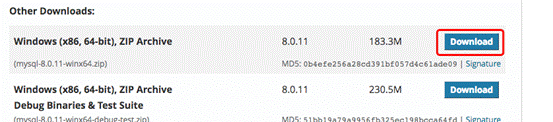
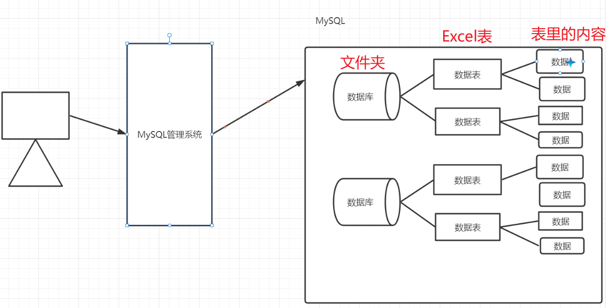
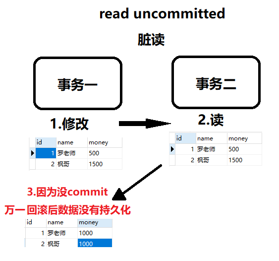

# 1 数据库的基本概念

## 1-1 为什么要学数据库？

之前我们如果想将一些数据实现永久化存储，可以怎么做呢？没错。使用IO流的技术将数据保存到本地文件中。

```
1. 张三 21 男
2. 李四 22 男
3. 王五 23 女
4. 赵六 24 女
5. 周七 25 男
```

但是接下来我有这样一个需求：将上面的 user.txt 文件中的王五年龄修改为35。

**用IO流的知识我们可以这样实现：**

* 1、可以采用字符缓冲流，将每一行数据读取出来，封装为User 对象。

* 2、将多个User 对象保存到集合中 

* 3、遍历集合，将王五对象的年龄修改为 35

* 4、再重新将集合中的对象信息写回到文件中

这一套操作太麻烦了，而现在我们有一种更加方便的方式来完成这个需求了，这种方式就是数据库！

## 1-2 数据库概述

### 1-2-1 定义

用于存储和管理数据的仓库

文单词为：DataBase，简称 DB

### 1-2-2 数据库的好处

* 可以持久化存储数据 

* 方便存储和管理数据 

* 使用了统一的方式操作数据库 -- SQL

### 1-2-3 常见的数据库有哪些？


# 2 MySQL数据库的介绍与安装

## 2-1 MySQL数据库介绍

* 小型的数据库 

* 开源免费(6 版本之前免费) 

* 所属于 Oracle 公司

## 2-2 MySQL数据库的安装与配置

### 2-2-1 下载解压

最新版本可以在[MySQL](https://dev.mysql.com/downloads/mysql/)下载中下载查看




点击 Download 按钮进入下载页面，点击下图中的 No thanks, just start my download. 就可立即下载：


下载完后，我们将 zip 包解压到相应的目录，这里我的根目录是 E:\devtools\mysql\mysql-5.7.40-winx64。

### 2-2-2 写配置文件my.ini

接下来我们需要配置下 MySQL 的配置文件

打开根目录 E:\devtools\mysql\mysql-5.7.40-winx64 ，在该文件夹下创建 my.ini 配置文件，编辑 my.ini 配置以下基本信息：

```ini
[client]  
# 设置mysql客户端默认字符集  
default-character-set = utf8  
   
[mysqld]  
# 设置3306端口  
port = 3306 

# 设置mysql的安装目录  
basedir = E:\\devtools\\mysql\\mysql-5.7.40-winx64  

# 设置 mysql数据库的数据的存放目录，MySQL 8+ 不需要以下配置，系统自己生成即可，否则有可能报错  
# datadir=C:\\web\\sqldata  

# 允许最大连接数  
max_connections=800
 
# 服务端使用的字符集默认为8比特编码的latin1字符集  
character-set-server=utf8 
 
# 创建新表时将使用的默认存储引擎  
default-storage-engine = INNODB  
```

### 2-2-3 初始化mysql

E:\devtools\mysql\mysql-5.7.40-winx64\bin

根目录\bin下启动cmd命令行

键入初始化命令

```
mysqld --initialize --console
```

执行完成后，会输出 root 用户的初始默认密码，如：


红框内的就是root用户名及初始密码

接下来立刻输入以下安装命令

```
mysqld install
```

启动输入以下命令即可

```
net start mysql
```

### 2-2-4 修改密码

* (1) 输入命令：

```
mysql -u root -p
```

指定root用户登录MySQL，输入后回车会提示输入密码，输入我们原来的密码然后回车。

 A temporary password is generated for root@localhost: rrd>l/l;t2hR 

* (2) 输入命令：

```
mysql> set password for 用户名@localhost = password(‘新密码’);
```


# 3 SQL语句 

## 3-1 数据库、数据表、数据的关系介绍



**数据库** 

* 用于存储和管理数据的仓库 

* ==一个库中可以包含多个数据表==

**数据表** 

*  数据库最重要的组成部分之一

* 它由纵向的列和横向的行组成(类似 excel 表格) 

* 可以指定列名、数据类型、约束等 

* ==一个表中可以存储多条数据==

## 3-2 SQL介绍

### 3-2-1 什么是 SQL 

Structured Query Language：结构化查询语言 

其实就是定义了操作所有关系型数据库的规则。每一种数据库操作的方式可能会存在一些不一样的地方，我们称为“方言”。 

### 3-2-2 SQL 通用语法 

* SQL 语句可以单行或多行书写，**以分号结尾**。 

* 可使用空格和缩进来增强语句的可读性。 

* MySQL 数据库的 **SQL 语句不区分大小写**，关键字建议使用大写。

* 数据库的注释： 单行注释：-- 注释内容 #注释内容(mysql 特有) 

​									多行注释：/* 注释内容 */ 

### 3-2-3 SQL 分类 

* **DDL(Data Definition Language)数据定义语言**

​		用来定义数据库对象：数据库，表，列等。

​		关键字：create, drop,alter 等 

* **DML(Data Manipulation Language)数据操作语言** 

​		用来对数据库中表的数据进行==增删改==。

​		关键字：insert, delete, update 等

* **DQL(Data Query Language)数据查询语言** 

  用来==查询==数据库中表的记录(数据)。

​		关键字：select, where 等

* **DCL(Data Control Language)数据控制语言(了解)** 

​		用来定义数据库的访问权限和安全级别，及创建用户。

​		关键字：GRANT， REVOKE 等


## 3-3 DDL数据定义语言

### 3-3-1 DDL操作数据库

#### 1-**R(Retrieve)：查询**

(1) 查询所有数据库

```mysql
/*
1.查询所有数据库
SHOW DATABASES;
*/
SHOW DATABASES;
```

(2) 查询某个数据库的创建语句

```mysql
/* 
2.查询某个数据库的创建语句
SHOW CREATE DATABASE 数据库名称;
*/
SHOW CREATE DATABASE mysql;
```

#### 2-**C(Create)：创建**

(1) 创建数据库

```mysql
/*
创建数据库的语句
1.CREATE DATABASE 数据库名称;
*/
CREATE DATABASE db1;
CREATE DATABASE db1;
-- 创建一个已存在的数据库会报错
-- 错误代码：1007 Can't create database 'db1'; database exists
```

（2）创建数据库(判断，如果不存在则创建)

```mysql
/*
2.创建数据库的时候，我们要去判断下该数据库是否存在，如果不存在我们去创建
CREATE DATABASE IF NOT EXISTS 数据库名称;
*/
CREATE DATABASE IF NOT EXISTS db2;
```

（3）创建数据库、并指定字符集

```mysql
/*
3.创建数据库，并指定字符集
CREATE DATABASE 数据库名称 CHARACTER SET 字符集名称;
*/
CREATE DATABASE db3 CHARACTER SET utf8;
```

练习：创建 db4 数据库、如果不存在则创建，指定字符集为gbk

```mysql
/*
练习：创建 db4 数据库、如果不存在则创建，
指定字符集为gbk
*/
CREATE DATABASE IF NOT EXISTS db4 CHARACTER SET gbk;
```

#### 3-D(Delete)：删除

（1）删除数据库

```mysql
/*
1.删除数据库的标准语法
DROP DATABASE 数据库名称;
*/
DROP DATABASE db1;
SHOW DATABASES;
/*
2.删除一个不存在的数据库会怎么样？
*/
DROP DATABASE db1;
-- 错误代码：1008 Can't drop database 'db1'; database doesn't exist
```

（2）删除数据库(判断，如果存在则删除)

```mysql
/*
3.删除数据库时，要去判断该数据库是否存在，存在即删除
DROP DATABASE IF EXISTS 数据库名称;
*/
DROP DATABASE IF EXISTS db2;
SHOW DATABASES;
```

#### 4-U(Update)：修改

（1）修改数据库的字符集

```mysql
/*
4.修改数据库的字符集
ALTER DATABASE 数据库名称 CHARACTER SET 字符集名称;
*/
ALTER DATABASE db4 CHARACTER SET gbk;
```

#### 5-使用数据库

```mysql
/*
数据库的使用
USE 数据库名称;
*/
SHOW DATABASES;
USE db4;
```

### 3-3-2 DDL操作数据表

#### 1-R(Retrieve)：查询

（1）查询数据库中所有的数据表

```mysql
/*
1.使用mysql数据库
2.查询数据库中所有的数据表
SHOW TABLES;
*/
USE mysql;
SHOW TABLES;
```

（2）查询表结构

```java
/*
3.查看表的结构
DESC 表名;
*/
DESC db;
```

（3）查询表字符集

```mysql
/*
4.查询表的字符集
SHOW TABLE STATUS FROM 库名 LIKE '表名';
*/
SHOW TABLE STATUS FROM mysql LIKE 'db';
```

#### 2-C(Create)：创建

（1） 创建数据表

```mysql
/*
需求：在db3数据库中创建数据表。
1.使用数据库db3
*/
USE db3;

/*
创建数据表的语法
CREATE TABLE 表名(
	列名1 数据类型1，
	列名2 数据类型2，
	列名3 数据类型3，
	...
	列名n 数据类型n
);

数据类型
	1.int 整数类型
	2.double 小数类型
	3.date 日期类型 yyyy-MM-dd
	4.datetime 日期时间类型 yyyy-MM-dd HH:mm:ss
	5.timestamp 时间戳类型 yyyy-MM-dd HH:mm:ss
			如果将来不给这个字段赋值，或赋值为 null，
			则默认使用当前的系统时间，来自动赋值
	6.varchar 字符串类型
*/

-- 创建一个user表
CREATE TABLE user(
id INT,-- 用户id
name VARCHAR(20),-- 用户姓名
age INT,-- 用户年龄
gender INT,-- 用户性别
tel VARCHAR(20),-- 用户手机号
create_time DATE -- 创建用户的时间
);

DESC user; -- 查询表结构
```

（2）复制数据表

```mysql
/*
复制表
CREATE TABLE 表名 LIKE 被复制的表名;
*/
CREATE TABLE use_copy LIKE user;
```

#### 3-U(Update)：修改

（1）数据表表名的修改

```java
/*
1.数据表表名的修改
ALTER TABLE 表名 RENAME TO 新的表名;
*/
ALTER TABLE use_copy RENAME TO user_copy;
SHOW TABLES;
```

（2）修改表的字符集

```mysql
/*
2.修改表的字符集
ALTER TABLE 表名 CHARACTER SET 字符集名称;
*/
SHOW TABLE STATUS FROM db3 LIKE 'user_copy';
ALTER TABLE user_copy CHARACTER SET gbk;
```

（3）在user表中添加一列

```mysql
/*
3.在user表中添加一列
ALTER TABLE 表名 ADD 列名 数据类型;
*/
ALTER TABLE user ADD shengao DOUBLE;
DESC user;-- 查询表结构
```

（4）修改某一列的数据类型

```mysql
/*
4.修改某一列数据类型
ALTER TABLE 表名 MODIFY 列名 新数据类型;
*/
ALTER TABLE user MODIFY shengao VARCHAR(20);
DESC user;
```

（5）修改列名和数据类型

```mysql
/*
5.修改列名和数据类型
ALTER TABLE 表名 CHANGE 列名 新列名 新数据类型;
*/
ALTER TABLE user CHANGE shengao height DOUBLE;
DESC user;
```

#### 4-D(Delete)：删除

（1）删除列

```mysql
/*
6.删除列
ALTER TABLE 表名 DROP 列名;
*/
ALTER TABLE user DROP height;
DESC user;
```

（2）删除数据表

```mysql
/*
7.删除数据表
DROP TABLE 表名;
DROP TABLE IF EXISTS 表名;
*/
DROP TABLE user_copy;
SHOW TABLES;
```

## 3-4 DML数据操作语言

### 3-4-1 增C DML-INSERT语句

#### 1 - 新增方式一：给指定列添加数据

```mysql
/*
新增表数据语法
新增格式1：给指定列添加数据
INSERT INTO 表名 (列名1,列名2,...)
VALUES(值1,值2,...);
*/
USE db3; -- 使用数据库
SHOW TABLES; -- 查询所有表
DESC user; -- 查询表结构

INSERT INTO user(id,name,age,gender,tel,create_time)
VALUES(1,'tsh',23,1,'17625588115','2023-02-13');

INSERT INTO user(id,name,age,tel) 
VALUES(2,'zhangsan',22,'13888888888');

SELECT * FROM user;
```

#### 2 - 新增方式二：默认给全部列添加数据

```mysql
/*
新增方式二：默认给全部列添加数据
INSERT INTO 表名 
VALUES(值1,值2,值3...);
*/
INSERT INTO user 
VALUES(3,'lisi',21,2,'19888888888','2023-02-14');
SELECT * FROM user;
```

#### 3 - 新增方式三：批量添加数据

```mysql
/*
新增方式三：批量添加数据
INSERT INTO 表名(列名1,列名2,...)
VALUES(值1,值2...),
(值1,值2...),
(值1,值2...);
若要默认添加全部，同新增方式二
*/
INSERT INTO user 
VALUES(4,'wangwu',24,1,'19888888888','2023-02-14'),
(5,'zhaoliu',22,2,'19888888888','2023-02-14'),
(6,'sunqi',21,1,'19888888888','2023-02-14');
SELECT * FROM user;
```

### 3-4-2 改U DML-UPDATE语句

```mysql
/*
1.修改表数据
UPDATE 表名 SET 
列名1=值1,
列名2=值2,
列名3=值3...
WHERE 条件;
*/
UPDATE user SET age=35,gender=0 WHERE name='zhangsan';
SELECT * FROM user;

UPDATE user SET create_time='2023-02-15' WHERE id=2;
```

* **注意：**修改语句中必须加条件！如果不加条件，则将所有数据都修改

### 3-4-3 删D DML-DELETE语句

```mysql
/*
2.删除表数据
DELETE FROM 表名 WHERE 条件;
*/
DELETE FROM user WHERE name='sunqi';
SELECT * FROM user;
```

* **注意：**删除语句中必须加条件！如果不加条件，则将所有数据删除

## 3-5 DQL数据查询语言（查R）（单表）

### 3-5-1 DQL - 查询语法

```mysql
/*
查询语法
SELECT 字段名称
FROM 表名
WHERE 条件
GROUP BY 分组字段
HAVING 分组之后的条件
ORDER BY 排序字段
LIMIT 分页的限定
*/
```

```
师傅我改行OL
SFWGHOL
```

### 3-5-2 DQL - 单表查询基础

#### 1 - 查询全部

```mysql
/*
1.查询全部
SELECT * FROM 表名
-- 查询product表所有的商品数据
*/
SELECT * FROM product;

```

#### 2 - 查询部分字段（列）

```mysql
/*
2.查询部分
SELECT 列名1,列名2... FROM 表名;
-- 查询product表中的商品名，价格，品牌
*/
SELECT name,price,brand FROM product;
```
#### 3 - 去重

```mysql
/*
3.去重查询
SELECT DISTINCT 要去重的列名1,要去重的列名2... FROM 表名;
去重必须完全相同才能去除
*/
SELECT DISTINCT brand FROM product;
SELECT DISTINCT name,brand FROM product;
```
#### 4 - 计算列的值、起别名

```mysql
/*
计算列的值（四则运算）
SELECT 列名1 运算符 列名2/变量 FROM 表名;
*/
SELECT * FROM product;
SELECT name,stock + 10 FROM product; 

/*
IFNULL(expr1,expr2) 如果expr1列中有null，替换为expr2
expr1：想替换的列
expr2：想替换的值
给一个列起别名
SELECT 列名1 AS 别名,列名2 AS 别名 FROM 表名;
AS可以省略
*/
SELECT * FROM product;
SELECT name,IFNULL(stock,0)+10 AS stockplus10 FROM product;
SELECT name,IFNULL(stock,0)+10 stockplus10 FROM product;
```
#### 5 - WHERE条件筛选 

```mysql
/*
SELECT 列名 FROM 表名 WHERE 条件;
*/

-- 查询库存大于20的商品信息
SELECT * FROM product WHERE stock>20;

-- 查询品牌为华为的商品信息
SELECT * FROM product WHERE brand='华为';

-- 查询金额在4000-6000的商品信息
SELECT * FROM product WHERE price >= 4000 AND price<=6000;
SELECT * FROM product WHERE price BETWEEN 4000 AND 6000;

-- 查询库存为14、30、23 的商品信息
SELECT * FROM product WHERE stock=14 OR stock=30 OR stock=23;
SELECT * FROM product WHERE stock IN (14,30,23);

-- 查询名称以小米开头 的商品信息
SELECT * FROM product WHERE name LIKE '小米%';

-- 查询名称第二个字是 为 的商品信息
SELECT * FROM product WHERE name LIKE '_为%';

-- 查询名称为四个字符的 商品信息
SELECT * FROM product WHERE name LIKE '____';

-- 查询名称中包含 电脑 的商品信息
SELECT * FROM product WHERE name LIKE '%电脑%';

-- 查询库存为null的商品信息
SELECT * FROM product WHERE stock IS NULL;

-- 查询库存不为null的商品信息
SELECT * FROM product WHERE stock IS NOT NULL;
```
### 3-5-3 DQL - 聚合函数查询

```mysql
/*
聚合函数的语法
SELECT 函数名称(列名) FROM 表名 [WHERE 条件];
*/

-- 计算product表中总记录条数
SELECT COUNT(*) FROM product;

-- 获取最高价格
SELECT MAX(price) FROM product;

-- 获取最高价格的商品名称
SELECT name,price FROM product WHERE price=(
	SELECT MAX(price) FROM product
);

-- 获取最低的库存
SELECT MIN(stock) FROM product;
-- 获取最低库存商品的名称
SELECT name,stock FROM product WHERE stock=(
	SELECT MIN(stock) FROM product
);

-- 获取总库存的数量
SELECT SUM(stock) FROM product;

-- 获取品牌为苹果的总库存数量
SELECT SUM(stock) FROM product WHERE brand = '苹果';

-- 获取品牌为小米的平均商品价格
SELECT AVG(price) FROM product WHERE brand = '小米';
```
### 3-5-4 DQL - 排序查询

```mysql
/*
SELECT 列名 FROM 表名 [WHERE 条件] 
ORDER BY 列名1 排序方式1,列名2 排序方式2;
*/

-- 按照库存升序排序
SELECT * FROM product ORDER BY stock ASC;
SELECT * FROM product ORDER BY stock;

-- 查询名称中包含手机的商品信息，按照金额的降序排序。
SELECT * FROM product WHERE name LIKE '%手机%' ORDER BY price DESC;

-- 按照金额的升序排序，如果金额相同，就按库存的降序排序
SELECT * FROM product ORDER BY price ASC,stock DESC;
```
### 3-5-5 DQL - 分组查询

```mysql
/*
分组查询
SELECT 列名 FROM 表名 [WHERE 条件] 
GROUP BY 分组列名[HAVING 分组后过滤条件]
[ORDER BY 排序列名 排序方式]
*/

-- 按照品牌分组，获取每组商品的总金额
SELECT brand,SUM(price) FROM product GROUP BY brand;

-- 对于金额大于4000的商品，按照品牌分组，获取每组商品的总金额
SELECT brand,SUM(price) FROM product WHERE price > 4000 GROUP BY brand;

-- 对于金额大于4000的商品，按照品牌分组，
-- 获取每组商品的总金额，只显示总金额大于7000的商品
SELECT brand,SUM(price) sumprice FROM product WHERE price > 4000 
GROUP BY brand HAVING sumprice>7000;

-- 对于金额大于4000的商品，按照品牌分组，
-- 获取每组商品的总金额，只显示大于7000，并按照总金额降序排序
SELECT brand,SUM(price) sumprice FROM product WHERE price > 4000
GROUP BY brand HAVING sumprice > 7000 
ORDER BY sumprice DESC;
```
### 3-5-6 DQL - 分页

```mysql
/*
分组查询
SELECT 列名 FROM 表名 [WHERE 条件] 
GROUP BY 分组列表 [HAVING 分组后条件]
[ORDER BY 排序列名 排序方式]
LIMIT 开始索引,查询条数（每页）
公式：开始索引=(当前页码-1)*每页显示的条数
*/

-- 第一页 (1-1)*3，3
SELECT * FROM product LIMIT 0,3;
-- 第二页 (2-1)*3，3
SELECT * FROM product LIMIT 3,3;
-- 第三页 (3-1)*3，3
SELECT * FROM product LIMIT 6,3;
```

# 4 约束

## 4-1 约束的概念与分类

### 4-1-1 约束的概念 

对表中的数据进行限定，保证数据的正确性、有效性、完整性！

### 4-1-2 约束的分类

|             约束              |      说明      |
| :---------------------------: | :------------: |
|          PRIMARY KEY          |    主键约束    |
|  PRIMARY KEY AUTO_INCREMENT   | 主键、自动增长 |
|            UNIQUE             |    唯一约束    |
|           NOT NULL            |    非空约束    |
|          FOREIGN KEY          |    外键约束    |
| FOREIGN KEY ON UPDATE CASCADE |  外键级联更新  |
| FOREIGN KEY ON DELETE CASCADE |  外键级联删除  |

## 4-2 主键约束

### 4-2-1 主键约束的特点

* （1）主键约束包含：**非空**和**唯一**两个功能 

* （2）一张表**只能有一个列作为主键** 

* （3）==主键一般用于表中数据的唯一标识==

### 4-2-2 建表时添加主键约束

```mysql
/*
CREATE TABLE 表名(
列名1 数据类型 PRIMARY KEY,
);
*/

CREATE TABLE student(
id INT PRIMARY KEY,
name VARCHAR(20),
age INT
);

DESC student;

-- 添加数据 id为空
INSERT INTO student VALUES(NULL,'枫哥',18);-- 报错
INSERT INTO student VALUES(1,'枫哥',18);
SELECT * FROM student;

-- 添加数据 id重复
INSERT INTO student VALUES(1,'韩老师',19);-- 报错
INSERT INTO student VALUES(2,'韩老师',19);
```

### 4-2-3 删除主键

```mysql
/*
删除主键的语法
ALTER TABLE 表名 DROP PRIMARY KEY;
*/

-- 删除主键约束
ALTER TABLE student DROP PRIMARY KEY;
```

### 4-2-4 建表后单独添加主键

```mysql
/*
建表之后去添加主键
ALTER TABLE 表名 MODIFY 列名 数据类型 PRIMARY KEY;
*/
-- 添加主键
ALTER TABLE student MODIFY id INT PRIMARY KEY;
DESC student;
```

## 4-3 主键自增约束

```
最主要特点：加了自增约束，添加新数据主键可以是NULL，它会自己帮你分配
```

### 4-3-1 建表时添加主键自增约束

```mysql
/*
1.如何在建表时添加主键自增约束
CREATE TABLE 表名 (
列名 数据类型 PRIMARY KEY AUTO_INCREMENT,
...
);
*/
CREATE TABLE student1(
id INT PRIMARY KEY AUTO_INCREMENT,
name VARCHAR(20),
age INT
);
DESC student1;

INSERT INTO student1 VALUES
(NULL,'枫哥',18),
(NULL,'韩老师',19);

SELECT * FROM student1;
```

### 4-3-2 删除自动增长

```mysql
/*
删除自动增长
ALTER TABLE 表名 MODIFY 列名 数据类型;
*/
ALTER TABLE student1 MODIFY id INT;
DESC student1;

INSERT INTO student1 VALUES
(NULL,'罗老师'，20);-- 报错
```

### 4-3-3 建表后单独添加自动增长

```mysql
/*
建表后单独添加自动增长
ALTER TABLE 表名 MODIFY 列名 数据类型 AUTO_INCREMENT;
*/
ALTER TABLE student1 MODIFY id INT AUTO_INCREMENT;
DESC student1;
INSERT INTO student1 VALUES
(NULL,'罗老师',20);-- 不报错了

DELETE FROM student1 WHERE id =3;

INSERT INTO student1 VALUES
(NULL,'姚老师',20);-- 这里id是4 不会因为删掉后就是3了
```

## 4-4 唯一约束UNIQUE

### 4-4-1 建表时添加唯一约束

```mysql
/*
建表时添加唯一约束
CREATE TABLE 表名(
列名 数据类型 UNIQUE,
...
);
*/
CREATE TABLE student3(
id INT PRIMARY KEY AUTO_INCREMENT,
name VARCHAR(20),
tel VARCHAR(20) UNIQUE
);

DESC student3;

INSERT INTO student3 VALUES
(NULL,'枫哥','18888888888');

-- 添加tel重复的数据
INSERT INTO student3 VALUES
(NULL,'韩老师','18888888888');-- 报错

-- 添加tel不重复的数据
INSERT INTO student3 VALUES
(NULL,'韩老师','19888888888');
```

### 4-4-2 删除唯一约束

```mysql
/*
删除唯一约束
ALTER TABLE 表名 DROP INDEX 列名;
*/
ALTER TABLE student3 DROP INDEX tel; 

DESC student3;
```

### 4-4-3 建表后单独添加唯一约束

```mysql
/*
建表后添加唯一约束
ALTER TABLE 表名 MODIFY 列名 数据类型 UNIQUE;
*/
ALTER TABLE student3 MODIFY tel VARCHAR(20) UNIQUE;

DESC student3;
```

## 4-5 非空约束NOT NULL

### 4-5-1 建表时添加非空约束

```mysql
/*
建表时添加非空约束
CREATE TABLE 表名(
列名 数据类型 NOT NULL,
...
);
*/

CREATE TABLE student4(
id INT PRIMARY KEY AUTO_INCREMENT,
name VARCHAR(20) NOT NULL,
age INT
);
DESC student4;

-- name添加null值
INSERT INTO student4 VALUES
(NULL,NULL,18); -- 报错
INSERT INTO student4 VALUES
(NULL,'枫哥',18);
```


### 4-5-2 删除非空约束

```mysql
/*
删除非空约束
ALTER TABLE 表名 MODIFY 列名 数据类型;
*/
ALTER TABLE student4 MODIFY name VARCHAR(20);

DESC student4;
```

### 4-5-3 建表后单独添加非空约束

```mysql
/*
建表后单独添加非空约束
ALTER TABLE 表名 MODIFY 列名 数据类型 NOT NULL;
*/

ALTER TABLE student4 MODIFY name VARCHAR(20) NOT NULL;

DESC student4;
```

## 4-6 外键约束

### 4-6-1 为什么要有外键约束？

让表和表之间产生关系，从而保证数据的准确性！

```mysql
-- 创建user用户表（id，姓名）
CREATE TABLE user(
id INT PRIMARY KEY AUTO_INCREMENT,
name VARCHAR(20) NOT NULL
);

-- 添加用户数据
INSERT INTO user VALUES
(NULL,'张三'),
(NULL,'李四'),
(NULL,'王五');

-- 创建orderlist订单表（id，订单编号，订单所属用户）
CREATE TABLE orderlist(
id INT PRIMARY KEY AUTO_INCREMENT,
number VARCHAR(20) NOT NULL,
uid INT
);

-- 添加订单数据
INSERT INTO orderlist VALUES
(NULL,'itfdz001',1),
(NULL,'itfdz002',1),
(NULL,'itfdz003',2),
(NULL,'itfdz004',2),
(NULL,'itfdz005',3);

-- 添加一个订单，但是没有所属用户。这合理吗？
INSERT INTO orderlist VALUES 
(NULL,'itfdz007',8);

-- 删除王五这个用户，但是订单表中王五还有很多个订单呢。这合理吗？
DELETE FROM user WHERE NAME='王五';

-- 所以我们需要添加外键约束，让两张表产生关系
```

### 4-6-2 建表时添加外键约束

```mysql
/*
外键约束格式
CONSTRAINT 外键名 FOREIGN KEY (本表外键列名) REFERENCES 主表名(主表主键列名)
*/
CREATE TABLE orderlist(
id INT PRIMARY KEY AUTO_INCREMENT,
number VARCHAR(20) NOT NULL,
uid INT,
CONSTRAINT ou_fk1 FOREIGN KEY (uid) REFERENCES user(id)
);

-- 添加订单数据
INSERT INTO orderlist VALUES
(NULL,'itfdz001',1),
(NULL,'itfdz002',1),
(NULL,'itfdz003',2),
(NULL,'itfdz004',2),
(NULL,'itfdz005',3);

-- 添加一个，但是没有所属用户。无法添加
INSERT INTO orderlist VALUES
(NULL,'itfdz006',8);

-- 删除王五这个用户，但是订单表中王五还有很多个订单呢。无法删除
DELETE FROM user WHERE name='王五';
```

### 4-6-3 删除外键约束

```mysql
/*
删除外键
ALTER TABLE 表名 DROP FOREIGN KEY 外键名;
*/
ALTER TABLE orderlist DROP FOREIGN KEY ou_fk1;
-- 可以添加没有所属用户的条目了
INSERT INTO orderlist VALUES
(NULL,'itfdz006',8);
```

### 4-6-4 建表后单独添加外键约束

```mysql
/*
建表后单独添加外键约束
ALTER TABLE 表名 ADD CONSTRAINT 外键名 FOREIGN KEY (本表外键列名) REFERENCES 主表名(主键列名);
*/
ALTER TABLE orderlist ADD CONSTRAINT ou_fk1 FOREIGN KEY (uid) REFERENCES user(id);
```

### 4-6-5 级联更新和级联删除（了解）

```mysql
/*
级联更新和级联删除
添加外键时 同时添加 级联更新
ALTER TABLE 表名 ADD CONSTRAINT 外键名 FOREIGN KEY (uid) REFERENCES user(id) 
ON UPDATE CASCADE ON DELETE CASCADE;
*/

ALTER TABLE orderlist ADD CONSTRAINT ou_fk1 FOREIGN KEY (uid) REFERENCES user(id) 
ON UPDATE CASCADE ON DELETE CASCADE;
-- 级联删除
DELETE FROM user WHERE name = '张三';
-- 级联更新
UPDATE user SET id=4 WHERE id=2;
```

# 5 多表操作

## 5-1 多表设计

### 5-1-1 一对一（了解）

* **分析** 

  ==人和身份证==。一个人只有一个身份证，一个身份证只能对应一个人！ 

* **实现原则** 

  在任意一个表建立外键(UNIQUE)，去关联另外一个表的主键

  

```mysql
CREATE DATABASE db1;
USE db1;

-- 创建person表
CREATE TABLE person(
id INT PRIMARY KEY AUTO_INCREMENT,
name VARCHAR(20)
);

-- 插入数据
INSERT INTO person VALUES
(NULL,'张三'),
(NULL,'李四');

SELECT * FROM person;

-- 创建card表
CREATE TABLE card(
id INT PRIMARY KEY AUTO_INCREMENT,
number VARCHAR(20),
pid INT UNIQUE,
CONSTRAINT cp_fk1 FOREIGN KEY (pid) REFERENCES person(id)
);

INSERT INTO card VALUES
(NULL,'12345',1),
(NULL,'56789',2);
```


### 5-1-2 一对多

* **分析** 

  ==用户和订单==。一个用户可以有多个订单！商品分类和商品。一个分类下可以有多个商品！

* **实现原则** 

  在多的一方，建立外键约束，来关联一的一方主键

  

```mysql
-- 创建user表
CREATE TABLE user (
	id INT PRIMARY KEY AUTO_INCREMENT,
	NAME VARCHAR (20)
);

-- 插入数据
INSERT INTO USER
VALUES
	(NULL, '张三'),
	(NULL, '李四');

SELECT * FROM user;

-- 创建订单表orderlist
CREATE TABLE orderlist(
id INT PRIMARY KEY AUTO_INCREMENT,
number VARCHAR(20),
uid INT,
CONSTRAINT ou_fk01 FOREIGN KEY (uid) REFERENCES user(id)
);
-- 插入数据
INSERT INTO orderlist VALUES
(NULL,'itfdz001',1),
(NULL,'itfdz002',1),
(NULL,'itfdz003',2),
(NULL,'itfdz004',2);
```


### 5-1-3 多对多

* **分析** 

  ==学生和课程。==一个学生可以选择多个课程，一个课程也可以被多个学生选择！ 

* **实现原则** 

  ==需要借助第三张表中间表==，中间表至少包含两个列，这两个列作为中间表的外键，分别关联两张表的主键


```mysql
-- 创建学生表student
CREATE TABLE student(
id INT PRIMARY KEY AUTO_INCREMENT,
name VARCHAR(20)
);

-- 插入数据
INSERT INTO student VALUES
(NULL,'张三'),
(NULL,'李四');

-- 创建课程表course
CREATE TABLE course(
id INT PRIMARY KEY AUTO_INCREMENT,
name VARCHAR(20)
);

-- 插入数据
INSERT INTO course VALUES
(NULL,'语文'),
(NULL,'数学');

-- 创建中间表 stu_course
CREATE TABLE stu_course(
id INT PRIMARY KEY AUTO_INCREMENT,
sid INT,
cid INT,
CONSTRAINT ss_fk FOREIGN KEY (sid) REFERENCES student(id),
CONSTRAINT cc_fk FOREIGN KEY (cid) REFERENCES course(id)
);

-- 插入数据
INSERT INTO stu_course VALUES
(NULL,1,1),
(NULL,1,2),
(NULL,2,1),
(NULL,2,2);
```


## 5-2 多表查询

### 5-2-1 数据准备


### 5-2-2 笛卡尔积查询（了解）

* 有两张表，获取这两个表的所有组合情况

```mysql
/*
笛卡尔积查询
SELECT 列名1,列名2,... FROM 表名1,表名2,...;
*/

SELECT * FROM user;
SELECT * FROM orderlist;
-- 笛卡尔积查询
SELECT * FROM user,orderlist;
```


* 但是笛卡尔积查询有非常多的冗余数据，要完成多表查询，需要消除这些没有用的数据

### 5-2-3 内连接查询

* **查询原理** 

  内连接查询的是两张表有交集的部分数据(有主外键关联的数据)

#### 1 - 显式内连接

```mysql
/*
1 - 显式内连接
SELECT 
	列名 
FROM 
	表名1 
	[INNER] JOIN 
	表名2 
	ON 
	关联条件;
*/

-- 查询用户信息和对应的订单信息,并起别名
SELECT 
	*	 
FROM 
	user u 
	INNER JOIN 
	orderlist o 
	ON 
	o.uid=u.id
-- 查询用户姓名，年龄，订单编号
SELECT
	u.name, -- 用户姓名
	u.age, -- 用户年龄
	o.number -- 订单编号
FROM
	user u -- 用户表
	INNER JOIN 
	orderlist o -- 订单表
	ON
	u.id = o.uid
```

```
这里开始引入 SQL的层级式写法 增加可读性+可以注释
其它可以不用 查询太复杂了 最好要用
```

#### 2 - 隐式内连接

```mysql
/*
2 - 隐式内连接
SELECT 
	列名 
FROM 
	表名1,表名2 
WHERE 
	关联条件;
*/
-- 查询用户姓名、年龄、订单编号
SELECT 
	u.name 用户姓名,
	u.age 用户年龄,
	o.number 订单编号
FROM 
	user u,orderlist o
WHERE 
	u.id = o.uid;
```

### 5-2-4 外连接查询

#### 1 - 左外连接

```mysql
/*
左外连接查询
SELECT
	列名
FROM
	表名1
	LEFT [OUTER] JOIN
	表名2 
	ON
	关联条件
*/

--  查询所有用户信息，以及用户手上的订单号
SELECT
	u.*,
	o.number
FROM
	user u
	LEFT JOIN
	orderlist o
	ON
	u.id = o.uid;
```

####  2 - 右外连接 

```mysql
/*
右外连接查询
SELECT
	列名
FROM
	表名1
	RIGHT [OUTER] JOIN
	表名2 
	ON
	关联条件
*/

-- 查询所有订单信息，以及订单所属的用户姓名
SELECT
	o.*,u.name
FROM
	user u
	RIGHT JOIN
	orderlist o
	ON
	u.id = o.uid;
```

### 5-2-5 子查询

#### 1 - 子查询是单行单列的情况

* 子查询结果是单行单列的（通常是聚合函数）

* 可以作为条件，使用运算符进行判断！
* 用 “=”

```mysql
-- 单行单列
-- SELECT 列名 FROM 表名 WHERE 列名=(子查询);
-- 查询年龄最高的用户姓名
SELECT 
name
FROM 
user
WHERE
age = (SELECT MAX(age) FROM user);
```

#### 2 - 子查询是多行单列的情况

* 用 IN

```mysql
-- 多行单列
-- SELECT 列名 FROM 表名 WHERE 列名 [NOT] IN (子查询);
-- 查询张三和李四 的订单信息
SELECT 
* 
FROM 
orderlist 
WHERE 
uid IN(SELECT id FROM user WHERE name IN('张三','李四'));
```

#### 3 - 子查询是多行多列的情况

* 把他当作一个虚拟表来看待，结合内连接，外连接进行查询

```mysql
-- 多行多列
-- SELECT 列名 FROM 表名,(子查询) [WHERE 条件];
-- 查询订单表中 id 大于 4 的订单信息和所属用户信息
SELECT
u.name,u.age,o.number
FROM 
(SELECT * FROM orderlist WHERE id>4) o,
user u
WHERE 
o.uid = u.id;

```

### 5-2-6 自关联查询

* 同一张表中有数据关联。可以多次查询这同一个表！

* 数据库中有表employee数据如下图：


id-员工编号 name-员工姓名 mgr-上级员工编号 salary-薪资

```mysql
-- 查询所有员工的姓名及其直接上级的姓名，没有上级的员工也需要查询
/*
分析：
员工姓名 employee e1表  直接上级姓名 employee e2表
条件：e1.mgr = e2.id
查询左表的全部数据，和左右两张表交集部分数据，使用左外连接
*/ 

SELECT
e1.name 员工姓名,
e2.name 直接上级
FROM
employee e1
LEFT JOIN
employee e2
ON
e1.mgr = e2.id;
```

## 5-3 练习

### 5-3-1 查询用户的编号、姓名、年龄、订单编号


```mysql
-- 1、查询用户的编号、姓名、年龄。订单编号
/*
分析
用户编号、姓名、年龄 user u 订单编号 orderlist o
关联条件 u.id = o.uid
*/
SELECT
	u.id,
	u.name,
	u.age,
	o.number
FROM
	user u,
	orderlist o
WHERE
	u.id = o.uid;
```

### 5-3-2 查询所有的用户。用户的编号、姓名、年龄、订单编号

```mysql
/*
用户编号、姓名、年龄 user u 订单编号 orderlist o
关联条件 u.id = o.uid
查询所有用户：左外连接，（用户都要）
*/
SELECT
	u.id,
	u.name,
	u.age,
	o.number
FROM
	user u
LEFT JOIN
	orderlist o
ON
	u.id = o.uid;
```

### 5-3-3 查询所有的订单。用户的编号、姓名、年龄、订单编号

```mysql
/*
用户编号、姓名、年龄 user u 订单编号 orderlist o
关联条件：u.id = o.uid
查询所有的订单: 右外连接，右边都要
*/
SELECT
	u.id,
	u.name,
	u.age,
	o.number
FROM
	user u
RIGHT JOIN
	orderlist o
ON
	u.id = o.uid;
```

### 5-3-4 查询用户年龄大于 23 岁的信息。显示用户的编号、姓名、年龄、订单编号

```mysql
/*
    用户的编号、姓名、年龄 user u 订单编号orderlist o
    关联条件 u.id = o.uid    u.age>23
*/
SELECT
	u.id,
	u.name,
	u.age,
	o.number
FROM
	user u,
	orderlist o
WHERE
	u.age>23 AND u.id = o.uid;
```

### 5-3-5 查询张三和李四用户的信息。显示用户的编号、姓名、年龄、订单编号

```mysql
/*
	用户的编号、姓名、年龄 user u 订单编号 orderlist o
	关联条件： u.id = o.uid AND u.name IN ('张三','李四')
*/
SELECT
	u.id,
	u.name,
	u.age,
	o.number
FROM
	user u,
	orderlist o
WHERE
	u.id = o.uid AND u.name IN ('张三','李四');
```

### 5-3-6 查询商品分类的编号、分类名称、分类下的商品名称

```mysql
/*
	商品分类的编号、分类名称 category c分类下的商品名称 product p
	关联条件：p.cid = c.id
*/
SELECT
	c.id,
	c.name,
	p.name
FROM
	category c,
	product p
WHERE
	c.id = p.cid;
```

### 5-3-7 查询所有的商品分类。商品分类的编号、分类名称、分类下的商品名称

```mysql
/*
	商品分类的编号、分类名称。category c; 分类下的商品名称 product p
	关联条件: c.id = p.cid
	所有的商品分类: 左外连接
*/
SELECT
	c.id,
	c.name,
	p.name
FROM
	category c
LEFT JOIN
	product p
ON
	c.id = p.cid;
```

### 5-3-8 查询所有的商品信息。商品分类的编号、分类名称、分类下的商品名称

```mysql
/*
	商品分类的编号、分类名称。category c; 分类下的商品名称 product p
	关联条件: c.id = p.cid
	所有的商品信息: 右外连接
*/
SELECT
	c.id,
	c.name,
	p.name
FROM
	category c
RIGHT JOIN
	product p
ON
	c.id = p.cid;
```

### 5-3-9 查询所有的用户和所有的商品。显示用户的编号、姓名、年龄、商品名称

```mysql
/*
	用户的编号、姓名、年龄 user u; 
	商品名称 product p
	中间表：us_pro up
	关联条件: up.uid = u.id   up.pid = p.id 
*/
SELECT
	u.id,
	u.name,
	u.age,
	p.name
FROM
	user u,
	us_pro up,
	product p
WHERE
	up.uid = u.id AND up.pid = p.id
```

### 5-3-10 查询张三和李四这两个用户可以看到的商品。显示用户的编号、姓名、年龄、商品名称

```mysql
/*
	用户的编号、姓名、年龄。user u
	商品名称 product p
	中间表 us_pro up
	关联条件： up.pid=p.id & up.uid=u.id & u.name in ('张三','李四')
*/
SELECT 
	u.id,
	u.name,
	u.age,
	p.name
FROM
	user u,
	us_pro up,
	product p
WHERE
	u.id = up.uid
AND
	up.pid = p.id
AND
	u.name IN ('张三','李四');
```

# 6 视图

## 6-1 视图的概念

* 视图是一种虚拟存在的数据表 

* 这个虚拟的表并不在数据库中实际存在 

* 作用是将一些比较复杂的查询语句的结果，封装到一个虚拟表中。后期再有相同复杂查询时，直接查询这张虚拟表即可 

* 说白了，==视图就是将一条 SELECT 查询语句的结果封装到了一个虚拟表中==，所以我们在创建视图的时候，工作重心就要放在这条SELECT 查询语句上

## 6-2 视图的好处

* **简单** 

  对于使用视图的用户不需要关心表的结构、关联条件和筛选条件。因为这张虚拟表中保存的就是已经过滤好条件的结果集

* **安全** 

  视图可以设置权限 , 致使访问视图的用户只能访问他们被允许查询的结果集

* **数据独立** 

  一旦视图的结构确定了，可以屏蔽表结构变化对用户的影响，源表增加列对视图没有影响；源表修改列名，则可以通过修改视图来解决，不会造成对访问者的影响

## 6-3 视图的创建查询

### 6-3-1  数据准备

```mysql
-- 创建 country 表
CREATE TABLE country(
id INT PRIMARY KEY AUTO_INCREMENT, 
country_name VARCHAR(30)
);
-- 添加数据
INSERT INTO country VALUES 
(NULL,'中国'),
(NULL,'美国'),
(NULL,'俄罗斯');
-- 创建 city 表
CREATE TABLE city(
id INT PRIMARY KEY AUTO_INCREMENT, 
city_name VARCHAR(30), 
cid INT, -- 外键列。关联 country 表的主键列 id
CONSTRAINT cc_fk1 FOREIGN KEY (cid) REFERENCES country(id)
);
-- 添加数据
INSERT INTO city VALUES 
(NULL,'北京',1),
(NULL,'上海',1),
(NULL,'纽约',2),
(NULL,'莫斯科',3);
```

准备后的两表以及表关系如下图：


### 6-3-2 视图的创建

```mysql
-- 创建视图语法
-- CREATE VIEW 视图名称 [(列名列表)] AS 查询语句;
CREATE VIEW city_country (city_id,city_name,country_name)AS
SELECT
ci.cid,
ci.city_name,
co.country_name
FROM
country co,
city ci
WHERE
co.id = ci.cid
```

### 6-3-3 视图的查询

```mysql
-- 查询视图语法(就当表来操作)
-- SELECT * FROM 视图名;
SELECT * FROM city_country;
```

## 6-4 视图的修改删除

```mysql
-- 视图的修改
-- 修改视图表中的数据（源数据也会同步更改）
-- UPDATE 视图名称 SET 列名=值 WHERE 条件;
-- 修改视图数据，将北京修改为深圳
UPDATE city_country 
SET city_name='深圳'
WHERE city_name = '北京';


-- 修改视图表结构
-- ALTER VIEW 视图名称 [(列名列表)] AS 查询语句;
-- 将视图中的country_name改为countryname
ALTER VIEW city_country (city_id,city_name,countryname) AS
SELECT
c1.id,
c1.city_name,
c2.country_name
FROM
city c1,
country c2
WHERE
c1.cid=c2.id;

-- 视图的删除
-- DROP VIEW [IF EXISTS] 视图名称;
DROP VIEW IF EXISTS city_country;
```

# 7 存储过程

## 7-1 存储过程与函数概述

### 7-1-1 存储过程和函数的概念

**存储过程和函数**是事先经过编译并存储在数据库中的一段SQL语句的集合。

```
类似java中的方法
```

### 7-1-2  存储过程和函数的好处

* 存储过程和函数可以重复使用，减轻开发人员的工作量。类似于java中方法可以多次调用 

* 减少网络流量，存储过程和函数位于服务器上，调用的时候只需要传递名称和参数即可 

* 减少数据在数据库和应用服务器之间的传输，可以提高数据处理的效率

* 将一些业务逻辑在数据库层面来实现，可以减少代码层面的业务处理

### 7-1-3 存储过程和函数的异同

* 存储函数和存储过程是非常相似的。==存储函数可以做的事情，存储过程也可以做到！==

  ```
  所以 存储函数不学了！
  ```

* 函数必须有返回值 

* 存储过程没有返回值（但是有OUT 也相当于返回值了）

## 7-2 存储过程的基础操作

### 7-2-1 存储过程的创建

```mysql
/*
	创建存储过程
	DELIMITER $ 
	CREATE PROCEDURE 存储过程名称(参数)
	BEGIN
		SQL语句列表;
	END$
	DELIMITER ;
*/

-- 创建stu_group()存储过程 封装需求：按照性别进行分组，查询每组学生的总成绩。按照总成绩的升序排序

DELIMITER $ -- 约定结束符

CREATE PROCEDURE stu_group()
BEGIN
	SELECT
	gender,
	SUM(score) sum
	FROM
	student
	GROUP BY
	gender
	ORDER BY sum ASC;
END$

DELIMITER ; -- 约定结束符
```

创建后在navicat的左侧列表中：


### 7-2-2 调用存储过程

```mysql
/*
    调用存储过程
    CALL 存储过程名称();
*/
CALL stu_group();
```

### 7-2-3 查询某个数据库中的存储过程

```mysql
/*
	查询存储过程
	SELECT * FROM mysql.proc WHERE db='数据库名称';
*/
SELECT * FROM mysql.proc WHERE db='db6';
```
### 7-2-4 删除存储过程

```mysql
/*
	删除存储过程
	DROP PROCEDURE [IF EXISTS] 存储过程名称
*/
DROP PROCEDURE IF EXISTS stu_group;
```

## 7-3 存储过程复杂语法

* 存储过程是可以进行编程的。意味着可以使用变量、表达式、条件控制语句、循环语句等，来完成比较复杂的功能！

```
实际开发能不用就不用
对数据库资源的消耗很严重
```

### 7-3-1 定义变量，变量赋值

```mysql
/*
	定义变量
	DECLARE 变量名 数据类型 [DEFAULT 默认值];
*/

DELIMITER $

CREATE PROCEDURE pro_test01()
BEGIN
	DECLARE a INT DEFAULT 10;
	SELECT a;
END $

DELIMITER ;

CALL pro_test01();-- a 10
```

```mysql
/*
	变量的赋值 方式一
	SET 变量名=变量值;
*/
DELIMITER $
	CREATE PROCEDURE pro_test02()
	BEGIN
		DECLARE a VARCHAR(20);
		SET a = 'IT枫斗者'; -- 赋值变量
		SELECT a;
	END $
DELIMITER ;

CALL pro_test02();

/*
	变量的赋值 方式二
	SELECT 聚合函数 INTO 变量名 FROM 表名 [WHERE 筛选条件];
*/
-- 分别定义两个变量，将男女同学的总成绩赋值给这两个变量
DELIMITER $
CREATE PROCEDURE pro_test03()
BEGIN
	DECLARE men,women INT;
	SELECT SUM(score) INTO men FROM student WHERE gender='男';
	SELECT SUM(score) INTO women FROM student WHERE gender='女';
	SELECT men, women;
END$
DELIMITER ;

CALL pro_test03();
```

### 7-3-2 IF条件判断

```mysql
/*
IF 条件1 THEN 执行的SQL语句1;
[ELSEIF 条件2 THEN 执行的SQL语句2;]
...
[ELSE 执行的SQL语句n;]
END IF;
*/

/*
	定义2个变量 total-总成绩 des-判断
	查询班级总成绩
	根据总成绩
	380以上 成绩优秀
  	320~380 成绩一般
	320以下 成绩不错
*/

DELIMITER$
CREATE PROCEDURE pro_test04()
BEGIN
	DECLARE total INT;
	DECLARE des VARCHAR(20);
	SELECT SUM(score) INTO total
	FROM student;
	IF total>=400 THEN SET des = '优秀';
	ELSEIF total>=320 THEN SET des = '一般';
	ELSE SET des = '不错';
	END IF;
	SELECT total,des;
END $
DELIMITER;

CALL pro_test04();
```

### 7-3-3 参数传递

```mysql
/*
	参数传递
	CREATE PROCEDURE 存储过程名称(IN/OUT/INOUT);
	IN:传入参数
	OUT：返回值
	INOUT：既可以是传入参数，也可以是返回值
*/

-- 输入成绩，根据成绩，去给成绩进行描述

DELIMITER$
CREATE PROCEDURE pro_test05(IN total INT,OUT des VARCHAR(20))
BEGIN
	IF total>=380 THEN SET des = '优秀';
	ELSEIF total>=320 THEN SET des = '一般';
	ELSE SET des = '不错';
	END IF;
END $
DELIMITER$;

CALL pro_test05(384,@des);-- 调用函数
SELECT @des;-- 取出返回值
```

### 7-3-4 WHILE循环

```mysql
/*
	初始化数据
	WHILE 判断语句 DO
		循环体;
		条件控制语句;
	END WHILE;
*/
-- 求1~100的偶数和

DELIMITER $
CREATE PROCEDURE pro_test06()
BEGIN
	DECLARE result INT DEFAULT 0;
	DECLARE num INT DEFAULT 1;
	WHILE num<=100 DO
		IF num%2=0 THEN
			SET result=result+num;
		END IF;
		SET num = num + 1;
	END WHILE;
	SELECT result;
END $
DELIMITER ;

CALL pro_test06();
```

## 7-4 存储过程的总结

* 存储过程是事先经过编译并存储在数据库中的一段SQL语句的集合。可以在数据库层面做一些业务处理 。

* 说白了存储过程其实就是将 SQL 语句封装为方法，然后可以调用方法执行SQL语句而已 

* 存储过程的好处 1、安全 2、高效 3、复用性强
```
实际开发能不用就不用
对数据库资源的消耗很严重
```

# 8 触发器

## 8-1 触发器概述

* 触发器是与表有关的数据库对象，可以在 insert/update/delete 之前或之后，触发并执行触发器中定义的 SQL 语句。触发器的这种特性可以协助应用在数据库端确保数据的完整性 、==日志记录== 、数据校验等操作。


* 使用别名 NEW 和 OLD 来引用触发器中发生变化的记录内容，这与其他的数据库是相似的。现在触发器还只支持行级触发，不支持语句级触发。

| 触发器类型      | OLD 的含义                     | NEW 的含义                     |
| --------------- | ------------------------------ | ------------------------------ |
| INSERT 型触发器 | 无 (因为插入前状态无数据)      | NEW 表示将要或者已经新增的数据 |
| UPDATE 型触发器 | OLD 表示修改之前的数据         | NEW 表示将要或已经修改后的数据 |
| DELETE 型触发器 | OLD 表示将要或者已经删除的数据 | 无 (因为删除后状态无数据)      |

## 8-2 创建触发器

### 8-2-1 数据准备

```mysql
-- 创建用户表
CREATE TABLE account(
	id INT PRIMARY KEY AUTO_INCREMENT,
	name VARCHAR(20),
	money DOUBLE -- 余额
);

-- 添加数据
INSERT INTO account VALUES
(NULL,'枫哥',1000),
(NULL,'罗老师',2000);

-- 创建日志表 account_log
CREATE TABLE account_log (
	id INT PRIMARY KEY AUTO_INCREMENT, -- 日志id
	operation VARCHAR(20), -- 操作类型（增/删/改）
	operation_time DATETIME, -- 操作时间
	operation_id INT, -- 操作表的id
	operation_params VARCHAR(200) -- 操作参数
);
```

准备后两表如下图：


### 8-2-2 创建INSERT触发器

```mysql
/*
创建INSERT触发器
    CREATE TRIGGER 触发器名称
    AFTER INSERT
    ON 表名
    FOR EACH ROW

    BEGIN
        触发器执行的功能
    END $
*/
-- 需求：每次给account表插入数据，acount_log表记录此次操作的信息
DELIMITER $
	CREATE TRIGGER account_insert
	AFTER INSERT
	ON account
	FOR EACH ROW
	BEGIN
		INSERT INTO account_log VALUES
		(NULL,'INSERT',NOW(),new.id,CONCAT('插入后{id=',new.id,',name=',new.name,',money=',new.money,'}'));
	END $
DELIMITER ;
```

INSERT 触发器创建完成后：向account表添加数据。

```mysql
INSERT INTO account VALUES
(NULL,'韩老师',3000);
```

两表变化如下：


### 8-2-3 创建UPDATE触发器

```mysql
/*
创建UPDATE触发器
    CREATE TRIGGER 触发器名称
    AFTER UPDATE
    ON 表名
    FOR EACH ROW

    BEGIN
        触发器执行的功能
    END $
*/
DELIMITER $
	CREATE TRIGGER account_update
	AFTER UPDATE
	ON account
	FOR EACH ROW
	BEGIN
		INSERT INTO account_log VALUES
		(NULL,'UPDATE',NOW(),new.id,CONCAT('修改前{id=',old.id,',name=',old.name,',money=',old.money,'},修改后{id=',new.id,',name=',new.name,',money=',new.money,'}'));
	END $
DELIMITER ;

UPDATE account SET money = 1500 WHERE id = 2;
```

### 8-2-4 创建DELETE触发器

```mysql
/*
创建DELETE触发器
    CREATE TRIGGER 触发器名称
    AFTER DELETE
    ON 表名
    FOR EACH ROW
    BEGIN
        触发器执行的功能
    END $
*/
DELIMITER $
	CREATE TRIGGER account_delete
	AFTER DELETE
	ON account
	FOR EACH ROW
	BEGIN
		INSERT INTO account_log VALUES
		(NULL,'DELETE',NOW(),old.id,CONCAT('删除前{id=',old.id,',name=',old.name,',money=',old.money,'}'));
	END $
DELIMITER ;

DELETE FROM account WHERE id = 3;
```

## 8-3 查询和删除触发器

```mysql
-- 查询本数据库中的触发器
SHOW TRIGGERS;
-- 删除触发器 DROP TRIGGER 触发器名称;
DROP TRIGGER account_delete;
```

# 9 事务

## 9-1 事务概述

### 9-1-1 概述

* 一条或多条 SQL 语句组成一个执行单元，其特点是这个单元要么同时成功要么同时失败，单元中的每条 SQL 语句都相互依赖，形成一个整体。
* 如果某条 SQL 语句执行失败或者出现错误，那么整个单元就会回滚，撤回到事务最初的状态，如果单元中所有的 SQL 语句都执行成功，则事务就顺利执行。

### 9-1-2 为什么需要事务？

```mysql
-- 创建账户表
CREATE TABLE account(
	id INT PRIMARY KEY AUTO_INCREMENT,-- 账户id
	name VARCHAR(20),-- 账户名称 
	money DOUBLE -- 账户余额
);

-- 添加数据
INSERT INTO account VALUES
(NULL,'罗老师',1000),
(NULL,'枫哥',1000);

-- 转账的操作
-- 罗老师给枫哥转账500元
-- 罗老师账户-500
UPDATE account SET money = money - 500 WHERE name = '罗老师';
-错误语句
-- 枫哥账户+500
UPDATE account SET money = money + 500 WHERE name = '枫哥';
```

中间有错误语句，一起执行时，发现罗老师少了500元，而枫哥却没收到钱，这是致命的错误。

## 9-2 事务的操作

### 9-2-1 基本语法

```mysql
-- 开始事务
-- START TRANSACTION;
-- 回滚事务
-- ROLLBACK;
-- 提交事务
-- COMMIT;
```

### 9-2-2 事务内无错误的情况COMMIT

```mysql
-- 开启一个事务
START TRANSACTION;

-- 罗老师账户-500
UPDATE account SET money = money - 500 WHERE name = '罗老师';
-- 枫哥账户+500
UPDATE account SET money = money + 500 WHERE name = '枫哥';

-- 提交事务
COMMIT;
```

### 9-2-3 事务内有错误的情况ROLLBACK

```mysql
-- 开启一个事务
START TRANSACTION;
-- 罗老师账户-500
UPDATE account SET money = money - 500 WHERE name = '罗老师';
-错误语句
-- 枫哥账户+500
UPDATE account SET money = money + 500 WHERE name = '枫哥';

-- 回滚事务
ROLLBACK;
```

运行ROLLBACK后，数据回到了正确的状态

## 9-3 事务的提交方式

* **提交方式** 
  * 自动提交  (MySQL 默认为自动提交，==也不要去改！==) 
  * 手动提交

```mysql
SELECT @@AUTOCOMMIT; -- 1 代表自动提交 0 代表手动提交
-- 标准语法
SET @@AUTOCOMMIT=数字; -- 1 代表自动提交 0 代表手动提交
-- 修改为手动提交
SET @@AUTOCOMMIT=0;
-- 查看提交方式
SELECT @@AUTOCOMMIT;
```

## 9-4 事务的四大特征

* **原子性(atomicity)** 
  * 原子性是指事务包含的所有操作要么全部成功，要么全部失败回滚，因此事务的操作如果成功就必须要完全应用到数据库，如果操作失败则不能对数据库有任何影响 
* **一致性(consistency)**
  * 一致性是指事务必须使数据库从一个一致性状态变换到另一个一致性状态，也就是说一个事务执行之前和执行之后都必须处于一致性状态拿转账来说，假设罗老师和枫哥两者的钱加起来一共是2000，那么不管 A 和 B 之间如何转账，转几次账，事务结束后两个用户的钱相加起来应该还得是 2000，这就是事务的一致性
* **隔离性(isolcation)** 
  * 隔离性是当多个用户并发访问数据库时，比如操作同一张表时，数据库为每一个用户开启的事务，不能被其他事务的操作所干扰，多个并发事务之间要相互隔离 
* **持久性(durability)** 
  * 持久性是指一个事务一旦被提交了，那么对数据库中的数据的改变就是永久性的，即便是在数据库系统遇到故障的情况下也不会丢失提交事务的操作

## 9-5 事务的隔离级别

### 9-5-1 隔离级别的概念 

* 多个客户端操作时 ,各个客户端的事务之间应该是隔离的，相互独立的 , 不受影响的。 

* 而如果多个事务操作同一批数据时，则需要设置不同的隔离级别, 否则就会产生问题 。

| 隔离级别         | 中文名   | 脏读 | 不可重复读 | 幻读 | 常见数据库默认隔离级别 |
| ---------------- | -------- | ---- | ---------- | ---- | ---------------------- |
| read uncommitted | 读未提交 | 是   | 是         | 是   |                        |
| read commited    | 读已提交 | 否   | 是         | 是   | Oracle / SQL Server    |
| repeatable read  | 可重复读 | 否   | 否         | 是   | MySQL                  |
| serializable     | 串行化   | 否   | 否         | 否   |                        |

* 可能引发的问题

| 问题       | 现象                                                         | 解决方法                    |
| ---------- | ------------------------------------------------------------ | --------------------------- |
| 脏读       | 一个事务处理过程中读到了另一个未提交的事务中的数据, <br />导致两次查询结果不一致 | 隔离级别改为read commited   |
| 不可重复读 | 一个事务处理过程中读到了另一个事务中修改并已提交的数据, <br />导致两次查询结果不一致 | 隔离级别改为repeatable read |
| 幻读       | select 某记录是否存在，不存在，准备插入此记录，但执行insert时发现此记录已存在，无法插入。<br />或不存在执行delete 删除，却发现删除成功。 | 隔离级别改为serializable    |




```mysql
-- 查询数据库隔离级别
-- SELECT @@TX_ISOLATION;
-- 修改数据库隔离级别
-- SET GLOBAL TRANSACTION ISOLATION LEVEL 级别字符串;


-- 修改数据库隔离级别为 read uncommitted
SET GLOBAL TRANSACTION ISOLATION LEVEL read uncommitted;
-- 查看隔离级别
SELECT @@TX_ISOLATION; -- 修改后需要断开连接重新开
```

# 10 数据库设计

## 10-1 数据库的范式

* **第一范式**：列不可再分
* **第二范式**：一张表只表达一层含义（只描述一件事情）
* **第三范式**：表中的每一列和主键都是直接依赖关系（而非间接依赖）

范式越高，数据库越规范，但是数据库性能越差，要做到平衡，必须具体情况具体分析

 - 查询频次不高的情况下，我们更倾向于提高数据库的设计范式，从而提高存储效率
  - 查询频次较高的情形，我们更倾向于牺牲数据库的规范度，降低数据库设计的范式，允许特定的冗余，从而提高查询的性能

## 10-2 E-R图

Entity-Relationship图

实体-关系图


* 用矩形表示实体
* 用椭圆表示属性
* 用菱形表示关系
  * 关系有一对一，一对多，多对多

## 10-3 数据库设计步骤

* 1）分析业务
* 2）抽取实体
* 3）分析其中的属性
* 4）分析实体之间的关系

以QQZone项目为例：

**1）熟悉QQZone业务需求**

    1) 用户登录
    2) 登录成功，显示主界面。左侧显示好友列表；上端显示欢迎词。如果不是自己的空间，显示超链接：返回自己的空间；下端显示日志列表
    3) 查看日志详情：
        - 日志本身的信息（作者头像、昵称、日志标题、日志内容、日志的日期）
        - 回复列表（回复者的头像、昵称、回复内容、回复日期）
        - 主人回复信息
    4) 删除日志
    5) 删除特定回复
    6) 删除特定主人回复
    7) 添加日志、添加回复、添加主人回复
    8) 点击左侧好友链接，进入好友的空间

**2）抽取实体 ** 

用户登录信息、用户详情信息 、 日志 、 回贴  、 主人回复

**3）分析其中的属性**

* 用户登录信息：账号、密码、头像、昵称
* 用户详情信息：真实姓名、星座、血型、邮箱、手机号.....
* 日志：标题、内容、日期、作者
* 回复：内容、日期、作者、日志
* 主人回复：内容、日期、作者、回复

**4）分析实体之间的关系**
   -  用户登录信息 ： 用户详情信息      1：1
   -  用户 ： 日志                   1：N
   -  日志 ： 回复                   1：N
   -  回复 ： 主人回复            1：1 
   -  用户 ： 好友                   M ： N
