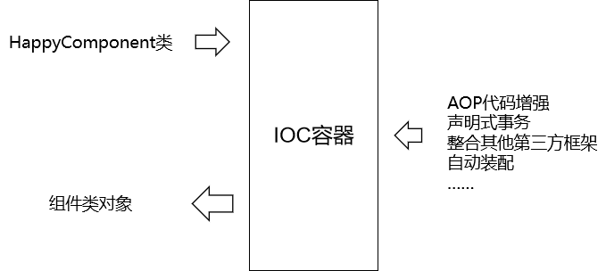
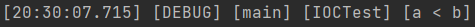

# 0 简介

## 0-1 Spring优良特性

- **非侵入式**：使用 Spring Framework 开发应用程序时，Spring 对应用程序本身的结构影响非常小。对领域模型可以做到零污染；对功能性组件也只需要使用几个简单的注解进行标记，完全不会破坏原有结构，反而能将组件结构进一步简化。这就使得基于 Spring Framework 开发应用程序时结构清晰、简洁优雅。
- **控制反转**：IOC——Inversion of Control，翻转资源获取方向。把自己创建资源、向环境索取资源变成环境将资源准备好，我们享受资源注入。
- **面向切面编程**：AOP——Aspect Oriented Programming，在不修改源代码的基础上增强代码功能。
    - 抽取重复代码：将方法内部重复的代码抽取出来
    - 代码增强：我使用抽取出来的代码套用到某个独立功能上，就对这个独立功能进行了增强
- **容器**：Spring IOC 是一个容器，因为它包含并且管理组件对象的生命周期。组件享受到了容器化的管理，替程序员屏蔽了组件创建过程中的大量细节，极大的降低了使用门槛，大幅度提高了开发效率。
- **组件化**：Spring 实现了使用简单的组件配置组合成一个复杂的应用。在 Spring 中可以使用 XML 和 Java 注解组合这些对象。这使得我们可以基于一个个功能明确、边界清晰的组件有条不紊的搭建超大型复杂应用系统。
- **声明式**：很多以前需要编写代码才能实现的功能，现在只需要声明需求即可由框架代为实现。
- **一站式**：在IOC和 AOP 的基础上可以整合各种企业级应用的开源框架和优秀的第三方类库。而且 Spring 旗下的项目已经覆盖了广泛领域，很多方面的功能性需求可以在 Spring Framework 的基础上全部使用 Spring 来实现。

## 0-2 Spring的体系结构


```
Spring做的是一个集成的工作
1+1>2
```

## 0-3 Spring五大功能模块

| 功能模块                | 功能介绍                                                    |
| ----------------------- | ----------------------------------------------------------- |
| Core Container          | 核心容器，在 Spring 环境下使用任何功能都必须基于 IOC 容器。 |
| AOP&Aspects             | 面向切面编程                                                |
| Testing                 | 提供了对 junit 或 TestNG 测试框架的整合。                   |
| Data Access/Integration | 提供了对数据访问/集成的功能。                               |
| Spring MVC              | 提供了面向Web应用程序的集成功能。                           |


# 1 IOC

```
在javaweb中已经手写过IOC，这里的IOC概念其实大差不差
```

## 1-1 组件的概念

### 1-1-1 原生Web应用中的组件

#### 1-1-1-1 请求处理流程


> 表述层：
> ●视图层：Thymeleaf负责服务器端页面渲染
> ●控制层：XxxServlet负责处理请求、跳转页面


#### 1-1-1-2 组件

基本上我们可以说，整个项目就是由各种组件搭建而成的：


#### 1-1-1-3 我们的期待

- 有人替我们创建组件的对象
- 有人帮助我们自动组装
- 有人替我们管理事务
- 有人协助我们整合Mybatis
- ……

不止于期待，Spring给我们的更多！

### 1-1-2 SSM整合之后的组件

#### 1-1-2-1 图示


#### 1-1-2-2 代码示例

##### ①BookHandler


> 不用框架我也不是很费事呀？
> 不用框架：private BookService bookService = new BookServiceImpl();

当前这个位置，框架不仅仅是创建对象，还会增强这个对象的功能，==其中最重要的就是给Service方法附加事务操作。==

另一个方面，使用框架之后，==实现了解耦==。

所谓解耦就是指：我们代码中仅仅只是声明我们需要的组件是BookService接口类型的；将来即使换成这个接口的其它实现类，BookHandler也不需要修改，实现了组件之间的解耦。

●BookService实现类：旧的实现类BookServiceFooImpl
●BookService实现类：新的实现类BookServiceBarImpl
不管是新还是旧，BookHandler类中不需要写死任何一个具体实现类，即使发生了改变，框架也会替我们自动进行匹配。

**结论：**
●不用框架：事必躬亲，所有事都需要我们自己写代码。
●使用框架：指挥框架，让框架替我们去做重复性的工作。指挥通过XML配置或注解来实现。


##### ②BookService

[1]接口


[2]实现类


**小结：**
使用框架之后，开发业务功能的代码会变得非常简化，使开发效率有极大提高。而相应的我们需要付出的代价有两点：
●学习成本：仅仅只是在学习阶段一次性的付出就行了。
●搭建环境：仅仅只是在项目刚开始开发时做一次，环境搭建好就享受框架带来的好处即可。

```
用spring帮我们创建对象：
1- 解耦
2- 增强对象的功能（比如事务）
```

## 1-2 容器的概念

### 1-2-1 普通容器

普通容器就是装东西的

比如 List集合 Set集合 数组

### 1-2-2 复杂容器

复杂容器除了装东西外还能管理内容的生命周期。

比如：

Servlet 容器能够管理 Servlet、Filter、Listener 这样的组件的一生，所以它是一个复杂容器。我们即将要学习的 IOC 容器也是一个复杂容器。它们不仅要负责创建组件的对象、存储组件的对象，还要负责调用组件的方法让它们工作，最终在特定情况下销毁组件。

**[1]Servlet生命周期**

| 名称       | 时机                                                         | 次数 |
| ---------- | ------------------------------------------------------------ | ---- |
| 创建对象   | 默认情况：接收到第一次请求  <br>修改启动顺序后：Web应用启动过程中 | 一次 |
| 初始化操作 | 创建对象之后                                                 | 一次 |
| 处理请求   | 接收到请求                                                   | 多次 |
| 销毁操作   | Web应用卸载之前                                              | 一次 |

**[2]Filter生命周期**

| 生命周期阶段 | 执行时机         | 执行次数 |
| ------------ | ---------------- | -------- |
| 创建对象     | Web应用启动时    | 一次     |
| 初始化       | 创建对象后       | 一次     |
| 拦截请求     | 接收到匹配的请求 | 多次     |
| 销毁         | Web应用卸载前    | 一次     |

## 1-3 IOC/DI 控制反转与依赖注入

### 1-3-1 获取资源的传统方式

自己做饭：买菜、洗菜、择菜、改刀、炒菜，全过程参与，费时费力，必须清楚了解资源创建整个过程中的全部细节且熟练掌握。

在应用程序中的组件需要获取资源时，传统的方式是组件主动的从容器中获取所需要的资源，在这样的模式下开发人员往往需要知道在具体容器中特定资源的获取方式，增加了学习成本，同时降低了开发效率。

比如我们在Servlet中自己创建Service对象：

```Java
private BookService bookService = new BookServiceImpl();
```

虽然创建BookServiceImpl对象不难，但是此时得到的仅仅是一个BookServiceImpl对象而已；如果我们需要附加事务功能，那就必须自己编写代码，执行事务操作：

```Java
@WebFilter("*.do")
public class OpenSessionInViewFilter implements Filter {
    // 获取数据库连接
    Connection conn = ...

    try{
        // 关闭事务自动提交
        conn.setAutoCommit(false);    
        // 执行核心操作
        chain.doFilter(req,resp);   
        // 提交事务
        conn.commit();    
    }catch(Exception e){
        // 回滚事务
        conn.rollBack();
    }finally{
        // 释放数据库连接
        conn.close();
    }
```

### 1-3-2 反转控制方式获取资源

点外卖：下单、等、吃，省时省力，不必关心资源创建过程的所有细节。

反转控制的思想完全颠覆了应用程序组件获取资源的传统方式：反转了资源的获取方向——改由容器主动的将资源推送给需要的组件，开发人员不需要知道容器是如何创建资源对象的，只需要提供接收资源的方式即可，极大的降低了学习成本，提高了开发的效率。这种行为也称为查找的被动形式。


使用IOC容器后，同样是给BookService属性赋值：

```Java
@Autowired
private BookService bookService;
```


我们只需要声明要什么类型，Spring会自动将我们所需类型的对象注入到这个属性中，而且==是已经附加事务操作的、被增强了的BookService对象==。对象的创建和事务的增强都与业务功能的开发过程无关，确实能够大大简化业务代码的编写。所以使用框架就是为了让程序员能够尽可能专注于业务的开发，而不必为重复性的操作分散精力。


再举个例子：

```Java
@Autowired
private BookMapper bookMapper;
```

我们只需要声明一下，让Spring知道我们需要bookMapper，那么这个对象就自动注入进来；省略了如下操作：

- 创建SqlSessionFactoryBean
- 获取SqlSession对象
- 调用SqlSession对象的getMapper()方法获取BookMapper对象


当然，我们也必须承认：要实现上面的效果，我们需要搭建环境。所谓搭建环境主要就是在配置文件中做必要的配置。
就算是我们家里买一个全自动洗衣机，也需要对接220V电压插头、自来水管、下水管。这其实就是一个给框架搭建环境的过程。


### 1-3-3 DI

DI：Dependency Injection，翻译过来是依赖注入。

DI 是 IOC 的另一种表述方式：即组件以一些预先定义好的方式（例如：setter 方法）接受来自于容器的资源注入。相对于IOC而言，这种表述更直接。

所以结论是：IOC 就是一种反转控制的思想， 而 ==DI 是对 IOC 的一种具体实现。==

起初是把DI看做是IOC的实现来对待，IOC作为一种思想或标准；后来发现基本上IOC只有DI这一种实现方式，所以后来也不做严格区分了，现在我们可以认为IOC和DI是等同的。

## 1-4 IOC容器在Spring中的实现

Spring 的 IOC 容器就是 IOC 思想的一个落地的产品实现。IOC 容器中管理的组件也叫做 **bean**。在创建 bean 之前，首先需要创建 IOC 容器。Spring 提供了 IOC 容器的两种实现方式：

### 1-4-1 BeanFactory接口

这是 IOC 容器的基本实现，是 Spring 内部使用的接口。面向 Spring 本身，不提供给开发人员使用。

> bean：本意是“豆”，在这里指的是我们IOC容器中管理的各个组件。
> factory：本意是“工厂”，在这里符合了23种设计模式中的工厂模式。如果某一个类是专门用来创建特定的对象，那么这样的类我们可以定义为工厂类。


### 1-4-2 ApplicationContext接口

BeanFactory 的子接口，提供了更多高级特性。面向 Spring 的使用者，几乎所有场合都使用ApplicationContext 而不是底层的 BeanFactory。

> 以后在 Spring 环境下看到一个类或接口的名称中包含 ApplicationContext，那基本就可以断定，这个类或接口与 IOC 容器有关。
> 对我们开发人员来说，ApplicationContext就是代表整个IOC容器技术体系的顶级接口。


### 1-4-3 ApplicationContext的主要实现类

| 类型名                          | 简介                                                         |
| ------------------------------- | ------------------------------------------------------------ |
| ClassPathXmlApplicationContext  | 通过读取类路径下的 XML 格式的配置文件创建 IOC 容器对象       |
| FileSystemXmlApplicationContext | 通过文件系统路径读取 XML 格式的配置文件创建 IOC 容器对象     |
| ConfigurableApplicationContext  | ApplicationContext 的子接口，包含一些扩展方法 refresh() 和 close() ，让 ApplicationContext 具有启动、关闭和刷新上下文的能力。 |
| WebApplicationContext           | 专门为 Web 应用准备，基于 Web 环境创建 IOC 容器对象，并将对象引入存入 ServletContext 域中。 |


## 1-5 基于xml管理bean

### 1-5-1 创建bean

#### 1-5-1-1 实验目标和思路

①目标

由 Spring 的 IOC 容器创建类的对象。

②思路


#### 1-5-1-2 创建Maven Module并引入依赖

```XML
<dependencies>
    <!-- 基于Maven依赖传递性，导入spring-context依赖即可导入当前所需所有jar包 -->
    <dependency>
        <groupId>org.springframework</groupId>
        <artifactId>spring-context</artifactId>
        <version>5.3.1</version>
    </dependency>
    
    <!-- junit测试 -->
    <dependency>
        <groupId>junit</groupId>
        <artifactId>junit</artifactId>
        <version>4.12</version>
        <scope>test</scope>
    </dependency>
    
    <!-- 日志 -->
    <dependency>
        <groupId>ch.qos.logback</groupId>
        <artifactId>logback-classic</artifactId>
        <version>1.2.3</version>
    </dependency>
    
    <!-- Lombok -->
    <dependency>
        <groupId>org.projectlombok</groupId>
        <artifactId>lombok</artifactId>
        <version>1.18.12</version>
        <scope>provided</scope>
    </dependency>
</dependencies>
```


#### 1-5-1-3 创建组件类

Component是组件的意思，这里我们创建的这个类，就是我们希望由IOC容器创建对象的类：

```Java
@Slf4j
public class HappyComponent {

    public void doWork(){
        log.debug("component do work...");
    }
}
```

#### 1-5-1-4 创建 Spring 配置文件


#### 1-5-1-5 配置组件

```XML
<bean id="userService" class="com.tan.spring.started.service.impl.UserServiceImpl"></bean>

<bean id="happyComponent" class="com.tan.ioc.component.HappyComponent"/>
```

- **id属性**：bean的唯一标识，后面还会作为属性指向
- **class属性**：对应组件实现类的全类名（要new的对象）

#### 1-5-1-6 创建测试类

```Java
public class IOCTest {
    // 创建 IOC 容器对象，为便于其他实验方法使用声明为成员变量
    private ApplicationContext iocContainer = new ClassPathXmlApplicationContext("applicationContext.xml");

    @Test
    public void experiment01(){
        HappyComponent happyComponent = (HappyComponent) iocContainer.getBean("happyComponent");

        happyComponent.doWork();
    }
}
```


#### 1-5-1-7 无参构造器

Spring 底层默认通过反射技术调用组件类的无参构造器来创建组件对象，这一点需要注意。如果在需要无参构造器时，没有无参构造器，则会抛出下面的异常：

> org.springframework.beans.factory.BeanCreationException: Error creating bean with name 'happyComponent1' defined in class path resource [applicationContext.xml]: Instantiation of bean failed;

> nested exception is org.springframework.beans.BeanInstantiationException: Failed to instantiate [com.atguigu.ioc.component.HappyComponent]: **No default constructor found**;

> nested exception is java.lang.NoSuchMethodException: com.atguigu.ioc.component.HappyComponent.()

所以对一个JavaBean来说，无参构造器和属性的getXxx()、setXxx()方法是必须存在的，特别是在框架中。


#### 1-5-1-8 用IOC容器创建对象和自己建区别



在Spring环境下能够享受到的所有福利，都必须通过 IOC 容器附加到组件类上，所以随着我们在 Spring 中学习的功能越来越多，IOC 容器创建的组件类的对象就会比自己 new 的对象强大的越来越多。

### 1-5-2 获取bean

#### 1-5-2-1 方式一：根据id获取

由于 id 属性指定了 bean 的唯一标识，所以根据 bean 标签的 id 属性可以精确获取到一个组件对象。==上个实验中我们使用的就是这种方式。==

#### 1-5-2-2 方式二：根据类型获取

**①指定类型的 bean 唯一**

能够正常获取到

```Java
@Test
public void experiment02(){
    HappyComponent happyComponent = iocContainer.getBean(HappyComponent.class);

    happyComponent.doWork();
}
```


**②指定类型的 bean 不唯一**

相同类型的 bean 在IOC容器中一共配置了两个：

```XML
<!-- 实验二 [重要]获取bean -->
    <bean id="happyComponent" class="com.tan.ioc.component.HappyComponent"/>
    <bean id="happyComponent2" class="com.tan.ioc.component.HappyComponent"/>
```

根据类型获取时会抛出异常：

> org.springframework.beans.factory.**NoUniqueBeanDefinitionException**: No qualifying bean of type 'com.atguigu.ioc.component.HappyComponent' available: expected single matching bean but found 2: happyComponent,happyComponent2


③思考

如果组件类实现了接口，根据接口类型可以获取 bean 吗？

> 可以，前提是bean唯一

如果一个接口有多个实现类，这些实现类都配置了 bean，根据接口类型可以获取 bean 吗？

> 不行，因为bean不唯一

④结论

根据类型来获取bean时，在满足bean唯一性的前提下，其实只是看：『**对象 instanceof 指定的类型**』的返回结果，只要返回的是true就可以认定为和类型匹配，能够获取到。

### 1-5-3 给bean的属性赋值：setter注入

#### 1-5-3-1 给组件类添加一个属性

```Java
@Data
@Slf4j
public class HappyComponent {

    private String componentName;

    public void doWork(){
        log.debug("component do work...");
    }
}
```

#### 1-5-3-2 在配置时给属性指定值

通过property标签配置的属性值会通过setXxx()方法注入，大家可以通过debug方式验证一下

```xml
<bean id="happyComponent" class="com.tan.ioc.component.HappyComponent">
    <property name="componentName" value="setter方式注入"/>
</bean>
```

#### 1-5-3-3 测试

```java
@Test
public void experiment03(){
    HappyComponent happyComponent = (HappyComponent) iocContainer.getBean("happyComponent");

    String componentName = happyComponent.getComponentName();
    log.debug("componentName:" + componentName);

}
```


### 1-5-4 给bean的属性复制：引用外部已声明的bean

```
就是new对象
就是service层调用dao/mapper层
controller层调用service层
```


#### 1-5-4-1 声明新的组件类

```java
public interface UserDAO {
    void insertUser();
}
```

```java
@Slf4j
public class UserDAOImpl implements UserDAO {
    @Override
    public void insertUser() {
        log.debug("调用了dao层的方法...");
    }
}
```

#### 1-5-4-2 原组件引用新组件

```java
public interface UserService {
    void save();
}
```

```java
@Data
@Slf4j
public class UserServiceImpl implements UserService {

    private UserDAO userDAO;
    
    @Override
    public void save() {
        log.debug("UserService实现...");
        userDAO.insertUser();
    }
}
```

#### 1-5-4-3 配置新组件的 bean

```xml
<!--DAO层-->
<bean id="userDAO" class="com.tan.spring.started.dao.impl.UserDAOImpl"/>
```

#### 1-5-4-4 在原组件的 bean 中引用新组件的 bean

```xml
<!--Service层-->
<bean id="userService" class="com.tan.spring.started.service.impl.UserServiceImpl">
    <!-- ref 属性：通过 bean 的 id 引用另一个 bean -->
	<property name="userDAO" ref="userDAO"/>
</bean>
```

这个操作在 IDEA 中有提示：


#### 1-5-4-5 测试

```java
@Test
public void experiment04(){
    UserService userService = (UserService) iocContainer.getBean("userService");
    userService.save();
}
```


### 1-5-5 给bean的属性赋值：内部bean

#### 1-5-5-1 重新配置原组件

在bean里面配置的bean就是内部bean，内部bean只能在当前bean内部使用，在其他地方不能使用。

```xml
<!-- 实验五 [重要]给bean的属性赋值：内部bean -->
<bean id="userService2" class="com.tan.spring.started.service.impl.UserServiceImpl">
    <property name="userDAO">
        <!-- 在一个 bean 中再声明一个 bean 就是内部 bean -->
        <!-- 内部 bean 可以直接用于给属性赋值，可以省略 id 属性 -->
        <bean class="com.tan.spring.started.dao.impl.UserDAOImpl"/>
    </property>
</bean>
```

#### 1-5-5-2 测试

```java
@Test
public void experiment05(){
    UserService userService = (UserService) iocContainer.getBean("userService2");
    userService.save();
}
```


### 1-5-6 给bean的属性赋值：引入外部属性文件

```
这里我们以阿里巴巴druid连接池为例
```

#### 1-5-6-1 加入依赖

```xml
<!-- MySQL驱动 -->
<dependency>
    <groupId>mysql</groupId>
    <artifactId>mysql-connector-java</artifactId>
    <version>5.1.3</version>
</dependency>
<!-- 数据源 -->
<dependency>
    <groupId>com.alibaba</groupId>
    <artifactId>druid</artifactId>
    <version>1.0.31</version>
</dependency>
```

#### 1-5-6-2 创建外部属性文件jdbc.properties

```properties
jdbc.driver=com.mysql.jdbc.Driver
jdbc.url=jdbc:mysql://localhost:3306/mybatis_db3
jdbc.user=root
jdbc.password=root
```

#### 1-5-6-3 在Spring配置文件中引入与配置

```xml
<!-- 引入外部属性文件 -->
<context:property-placeholder location="classpath:jdbc.properties"/>
```

在 IDEA 中引入 Spring 配置文件中名称空间的两种操作方式：
●在打字标签名的过程中根据提示选择一个正确的名称空间
●对于直接复制过来的完整标签，可以在名称空间上点击，然后根据提示引入：


```xml
<!-- 实验六 [重要]给bean的属性赋值：引入外部属性文件 -->
<bean id="druidDataSource" class="com.alibaba.druid.pool.DruidDataSource">
    <property name="driverClassName" value="${jdbc.driver}"/>
    <property name="url" value="${jdbc.url}"/>
    <property name="username" value="${jdbc.user}"/>
    <property name="password" value="${jdbc.password}"/>
</bean>
```

#### 1-5-6-4 测试

```java
    @Test
    public void experiment06() throws SQLException {
        DataSource dataSource = iocContainer.getBean(DataSource.class);

        Connection connection = dataSource.getConnection();

        log.debug("connection = " + connection);

        connection.close();
    }
```


### 1-5-7 给bean的属性赋值：级联属性赋值

有pojo关系如下：

```java
@Data
@Slf4j
public class HappyComponent {
    
    private HappyMachine happyMachine;
    
    private String componentName;
    
    public void doWork(){
        log.debug("component do work...");
    }
}

@Data
public class HappyMachine {
    private String machineName;
}
```

#### 1-5-7-1 配置关联对象的 bean

```xml
<!-- 实验七 给bean的属性赋值：级联属性赋值 -->
<bean id="happyMachine" class="com.tan.ioc.component.HappyMachine"/>
```

#### 1-5-7-2 装配关联对象并赋值级联属性

```xml
    <bean id="happyComponent7" class="com.tan.ioc.component.HappyComponent">
        <!-- 装配关联对象 -->
        <property name="happyMachine" ref="happyMachine"/>
        <!-- 对HappyComponent来说，happyMachine的machineName属性就是级联属性 -->
        <property name="happyMachine.machineName" value="set cascade value..."/>
    </bean>
```

#### 1-5-7-3 测试

```java
    @Test
    public void experiment07(){
        HappyComponent happyComponent = (HappyComponent) iocContainer.getBean("happyComponent7");
        String machineName = happyComponent.getHappyMachine().getMachineName();

        log.debug("machineName = " +  machineName);

    }
```


### 1-5-8 给bean的属性赋值：构造器注入

#### 1-5-8-1 声明组件类

```Java
@Data
@NoArgsConstructor
@AllArgsConstructor
public class HappyTeam {
    private String teamName;
    private Integer memberCount;
    private Double memberSalary;
}
```


#### 1-5-8-2 配置

```XML
<!-- 实验八 给bean的属性赋值：构造器注入 -->
<bean id="happyTeam" class="com.tan.ioc.component.HappyTeam">
    <constructor-arg value="happyCorps"/>
    <constructor-arg value="10"/>
    <constructor-arg value="1000.55"/>
</bean>
```


#### 1-5-8-3 测试

```Java
@Test
public void experiment08() {
    
        HappyTeam happyTeam = (HappyTeam) iocContainer.getBean("happyTeam");
        log.debug(happyTeam.toString());
    
}
```


#### 1-5-8-4 补充

constructor-arg标签还有两个属性可以进一步描述构造器参数：

- index属性：指定参数所在位置的索引（从0开始）
- name属性：指定参数名

### 1-5-9 给bean的属性赋值：特殊值处理

#### 1-5-9-1 声明一个类用于测试

```java
@Data
@AllArgsConstructor
@NoArgsConstructor
public class PropValue {
    private String commonValue;
    private String expression;
}
```

#### 1-5-9-2 字面量与变量的辨析

①用Java代码举例说明

字面量是相对于变量来说的。看下面的代码：

```Java
int a = 10;
```

声明一个变量a，初始化为10，此时a就不代表字母a了，而是作为一个变量的名字。当我们引用a的时候，我们实际上拿到的值是10。

而如果a是带引号的：'a'，那么它现在不是一个变量，它就是代表a这个字母本身，这就是字面量。所以字面量没有引申含义，就是我们看到的这个数据本身。


②Spring配置文件中举例

[1]字面量举例

```XML
<!-- 使用value属性给bean的属性赋值时，Spring会把value属性的值看做字面量 -->
<property name="commonValue" value="hello"/>
```

[2]变量举例

```XML
<!-- 使用ref属性给bean的属性赋值时，Spring会把ref属性的值作为一个bean的id来处理 -->
<!-- 此时ref属性的值就不是一个普通的字符串了，它应该是一个bean的id -->
<property name="happyMachine" ref="happyMachine"/>
```

#### 1-5-9-3 null

```xml
    <!--实验九 特殊值处理-->
    <bean id="propValue" class="com.tan.ioc.component.PropValue">
        <property name="commonValue">
            <!-- null标签：将一个属性值明确设置为null -->
            <null/>
        </property>
    </bean>
```

**测试代码与结果**

```java
    @Test
    public void experiment09(){
        PropValue propValue = (PropValue) iocContainer.getBean("propValue");
        log.debug(propValue.getCommonValue());
    }
```


#### 1-5-9-4 XML实体

```xml
    <!--实验九 特殊值处理-->
    <bean id="propValue" class="com.tan.ioc.component.PropValue">
        <!-- 小于号在XML文档中用来定义标签的开始，不能随便使用 -->
        <!-- 解决方案一：使用XML实体来代替 -->
        <property name="expression" value="a &lt; b"/>
    </bean>
```

**测试代码与结果**

```java
    @Test
    public void experiment09(){
        PropValue propValue = (PropValue) iocContainer.getBean("propValue");
        log.debug(propValue.getExpression());
    }
```


#### 1-5-9-5 CDATA节

```xml
    <!--实验九 特殊值处理-->
    <bean id="propValue" class="com.tan.ioc.component.PropValue">
        <property name="expression">
            <!-- 解决方案二：使用CDATA节 -->
            <!-- CDATA中的C代表Character，是文本、字符的含义，CDATA就表示纯文本数据 -->
            <!-- XML解析器看到CDATA节就知道这里是纯文本，就不会当作XML标签或属性来解析 -->
            <!-- 所以CDATA节中写什么符号都随意 -->
            <value><![CDATA[a < b]]></value>
        </property>
    </bean>
```

**测试代码与结果**

```java
    @Test
    public void experiment09(){
        PropValue propValue = (PropValue) iocContainer.getBean("propValue");
        log.debug(propValue.getExpression());
    }
```



### 1-5-10 使用p名称空间

#### 1-5-10-1 配置

使用 p 名称空间的方式可以省略子标签 property，将组件属性的设置作为 bean 标签的属性来完成。

```xml
    <!-- 实验十 给bean的属性赋值：使用p名称空间 -->
    <bean id="happyMachine3"
          class="com.tan.ioc.component.HappyMachine"
          p:machineName="goodMachine"/>
```

使用 p 名称空间需要导入相关的 XML 名称空间约束，在 IDEA 的协助下导入即可

#### 1-5-10-2 测试

```java
@Test
public void experiment10() {
    HappyMachine happyMachine = (HappyMachine) iocContainer.getBean("happyMachine3");
    log.debug(happyMachine.getMachineName());
}
```


### 1-5-11 给bean的属性赋值：集合属性

#### 1-5-11-1 给组件类添加属性


#### 1-5-11-2 配置

```xml
<!-- 实验十一 给bean的属性赋值：集合类型的属性 -->
<bean id="happyTeam2" class="com.tan.ioc.component.HappyTeam">
    <property name="memberList">
        <list>
            <value>member01</value>
            <value>member02</value>
            <value>member03</value>
        </list>
    </property>
</bean>
```

#### 1-5-11-3 测试

```java
@Test
public void experiment11() {
    HappyTeam happyTeam = (HappyTeam) iocContainer.getBean("happyTeam2");
    List<String> memberList = happyTeam.getMemberList();
    for (String s : memberList) {
        log.debug(s);
    }
}
```

控制台结果：


#### 1-5-11-4 其他变化形式

```xml
<!-- 实验十一 给bean的属性赋值：集合属性 -->
<bean id="happyTeam2" class="com.atguigu.ioc.component.HappyTeam">
    <property name="memberNameList">
        
        <!-- list标签：准备一组集合类型的数据，给集合属性赋值 -->
        <!--<list>
            <value>member01</value>
            <value>member02</value>
            <value>member03</value>
        </list>-->
        
        <!-- 使用set标签也能实现相同效果，只是附带了去重功能 -->
        <!--<set>
            <value>member01</value>
            <value>member02</value>
            <value>member02</value>
        </set>-->
        
        <!-- array也同样兼容 -->
        <array>
            <value>member01</value>
            <value>member02</value>
            <value>member02</value>
        </array>
    </property>
    
    <property name="managerList">
        <!-- 给Map类型的属性赋值 -->
        <!--<map>
            <entry key="财务部" value="张三"/>
            <entry key="行政部" value="李四"/>
            <entry key="销售部" value="王五"/>
        </map>-->
        <!-- 也可以使用props标签 -->
        <props>
            <prop key="财务部">张三2</prop>
            <prop key="行政部">李四2</prop>
            <prop key="销售部">王五2</prop>
        </props>
    </property>
</bean>
```

### 1-5-12 给bean的属性赋值：自动装配

#### 1-5-12-1 声明组件类和关系

其中UserService 需要用到 UserDAO。所谓自动装配就是一个组件需要其他组件时，由 IOC 容器负责找到那个需要的组件，并装配进去。

```
优化掉了<property>标签
```

```java
public class UserServiceImpl implements UserService {

    private UserDAO userDAO;

    @Override
    public void save() {
        log.debug("调用了service层的方法...");
        userDAO.insertUser();
    }
}
```

```java
@Slf4j
public class UserDAOImpl implements UserDAO {

    @Override
    public void insertUser() {
        log.debug("调用了dao层的方法...");
    }
}
```

#### 1-5-12-2 配置

```xml
<!--Service层-->
<!-- 使用bean标签的autowire属性设置自动装配效果 -->
<!-- byType表示根据类型进行装配，此时如果类型匹配的bean不止一个，那么会抛NoUniqueBeanDefinitionException -->
<!-- byName表示根据bean的id进行匹配。而bean的id是根据需要装配组件的属性的属性名来确定的 -->
<bean id="userService"
      class="com.tan.spring.started.service.impl.UserServiceImpl"
      autowire="byName">
</bean>

<!--DAO层-->
<bean id="userDAO" class="com.tan.spring.started.dao.impl.UserDAOImpl"/>
```

#### 1-5-12-3 测试

```java
@Test
public void experiment04() {
    UserService userService = (UserService) iocContainer.getBean("userService");
    userService.save();
}
```

控制台结果：


### 1-5-13 集合类型的bean

#### 1-5-13-1 配置

```xml
    <!-- 实验十三 集合类型的bean-->
    <util:list id="machineList">
        <bean class="com.tan.ioc.component.HappyMachine">
            <property name="machineName" value="machine1"/>
        </bean>
        <bean class="com.tan.ioc.component.HappyMachine">
            <property name="machineName" value="machine2"/>
        </bean>
        <bean class="com.tan.ioc.component.HappyMachine">
            <property name="machineName" value="machine3"/>
        </bean>
    </util:list>
```

#### 1-5-13-2 测试

```java
    @Test
    public void experiment13(){
        List<HappyMachine> machineList = (List<HappyMachine>) iocContainer.getBean("machineList");
        for (HappyMachine happyMachine : machineList) {
            System.out.println(happyMachine.getMachineName());
        }
    }
```


### 1-5-14  FactoryBean机制

> 结论： 配置一个bean，
>
> 如果没有实现FactoryBean接口：配置什么类型，就能够得到什么类型； 
>
> 配置一个bean，如果实现了FactoryBean接口：配置FactoryBean实现类类型，得到getObject()方法返回的对象

#### 1-5-14-1 简介

FactoryBean是Spring提供的一种整合第三方框架的常用机制。和普通的 bean 不同，配置一个 FactoryBean 类型的 bean，在获取 bean 的时候得到的并不是 class 属性中配置的这个类的对象，而是 getObject() 方法的返回值。通过这种机制，Spring 可以帮我们把复杂组件创建的详细过程和繁琐细节都屏蔽起来，只把最简洁的使用界面展示给我们。

将来我们整合 Mybatis 时，Spring 就是通过 FactoryBean 机制来帮我们创建 SqlSessionFactory 对象的。


#### 1-5-14-2 实现FactoryBean接口

```java
@Data
public class HappyFactoryBean implements FactoryBean<HappyMachine> {
    // 实现FactoryBean接口时需要指定泛型
    // 泛型类型就是当前工厂要生产的对象的类型
    private String machineName;

    @Override
    public HappyMachine getObject() throws Exception {
        // 方法内部模拟创建、设置一个对象的复杂过程
        HappyMachine happyMachine = new HappyMachine();
        happyMachine.setMachineName(this.machineName);
        return happyMachine;
    }

    @Override
    public Class<?> getObjectType() {
        return HappyMachine.class;
    }
}
```

#### 1-5-14-3 配置bean

```xml
    <!--实验十四 FactoryBean机制-->
    <!-- 这个bean标签中class属性指定的是HappyFactoryBean，但是将来从这里获取的bean是HappyMachine对象 -->
    <bean id="happyMachine4" class="com.tan.ioc.component.HappyFactoryBean">
        <!-- property标签仍然可以用来通过setXxx()方法给属性赋值 -->
        <property name="machineName" value="factoryBean方式赋值"/>
    </bean>
```

#### 1-5-14-4 测试获取bean

- 配置的bean：HappyFactoryBean
- 获取bean后得到的bean：HappyMachine

```java
    @Test
    public void experiment14(){
        HappyMachine happyMachine = (HappyMachine) iocContainer.getBean("happyMachine4");
        log.debug(happyMachine.getMachineName());
    }
```

### 1-5-15 bean的作用域

#### 1-5-15-1 概念

在 Spring 中可以通过配置 bean 标签的 scope 属性来指定 bean 的作用域范围，各取值含义参加下表：

| 取值      | 含义                                        | 创建对象的时机   | 默认值 |
| --------- | ------------------------------------------- | ---------------- | ------ |
| singleton | 在 IOC 容器中，这个 bean 的对象始终为单实例 | IOC 容器初始化时 | 是     |
| prototype | 这个 bean 在 IOC 容器中有多个实例           | 获取 bean 时     | 否     |


> 说明：这里单实例、多实例指的是一个bean标签配置之后，对应一个对象还是多个对象。


如果是在WebApplicationContext环境下还会有另外两个作用域（但不常用）：

| 取值    | 含义                 |
| ------- | -------------------- |
| request | 在一个请求范围内有效 |
| session | 在一个会话范围内有效 |


#### 1-5-15-2 配置

```xml
    <!-- 实验十五 bean的作用域 -->
    <!-- scope属性：取值singleton（默认值），bean在IOC容器中只有一个实例，IOC容器初始化时创建对象 -->
    <!-- scope属性：取值prototype，bean在IOC容器中可以有多个实例，getBean()时创建对象 -->
    <bean id="happyMachine5" scope="prototype" class="com.tan.ioc.component.HappyMachine">
        <property name="machineName" value="prototype的machine"/>
    </bean>
```


#### 1-5-15-3 测试与结果

```java
    @Test
    public void experiment15() {
        HappyMachine happyMachine01 = (HappyMachine) iocContainer.getBean("happyMachine5");
        HappyMachine happyMachine02 = (HappyMachine) iocContainer.getBean("happyMachine5");

        log.debug(String.valueOf(happyMachine01 == happyMachine02));//prototype时为false;singleton时为true
    }
```


### 1-5-16 bean的生命周期

#### 1-5-16-1 bean的生命周期清单

- bean 对象创建（调用无参构造器）
- 给 bean 对象设置属性（调用属性对应的 setter 方法）
- bean 对象初始化之前操作（由 bean 的后置处理器负责）
- bean 对象初始化（需在配置 bean 时指定初始化方法）
- bean 对象初始化之后操作（由 bean 的后置处理器负责）
- bean 对象就绪可以使用
- bean 对象销毁（需在配置 bean 时指定销毁方法）
- IOC 容器关闭

#### 1-5-16-2 创建两个方法作为初始化和销毁方法

```java
@Data
@Slf4j
public class HappyComponent {
    public void init() {
        log.debug("ioc init...");
    }

    public void destroy() {
        log.debug("ioc destroy...");
    }
```

#### 1-5-16-3 配置 bean 时指定初始化和销毁方法

```xml
    <!--实验十六 bean的生命周期-->
    <bean id="happyComponent3"
          class="com.tan.ioc.component.HappyComponent"
          init-method="init" destroy-method="destroy">

        <property name="componentName" value="123"/>
    </bean>
```

#### 1-5-16-4 创建后置处理器类并配置

```java
// 声明一个自定义的bean后置处理器
// 注意：bean后置处理器不是单独针对某一个bean生效，而是针对IOC容器中所有bean都会执行
public class MyHappyBeanProcessor implements BeanPostProcessor {
    
    @Override
    public Object postProcessBeforeInitialization(Object bean, String beanName) throws BeansException {    
        System.out.println("☆☆☆" + beanName + " = " + bean);   
        return bean;
    }
    
    @Override
    public Object postProcessAfterInitialization(Object bean, String beanName) throws BeansException {    
        System.out.println("★★★" + beanName + " = " + bean); 
        return bean;
    }
}
```

```xml
 <!-- bean的后置处理器要放入IOC容器才能生效 -->
 <bean id="myHappyBeanProcessor" class="com.tan.ioc.component.MyHappyBeanProcessor"/>
```

#### 1-5-16-5 测试


## 1-6 基于注解管理bean

### 1-6-1 标记注解与扫描

#### 1-6-1-1 注解的作用

**①注解**

和 XML 配置文件一样，注解本身并不能执行，注解本身仅仅只是做一个标记，具体的功能是框架检测到注解标记的位置，然后针对这个位置按照注解标记的功能来执行具体操作。

**本质上**：所有一切的操作都是 Java 代码来完成的，XML 和注解只是告诉框架中的 Java 代码如何执行。


```
举例：元旦联欢会要布置教室，蓝色的地方贴上元旦快乐四个字，红色的地方贴上拉花，黄色的地方贴上气球。班长做了所有标记，同学们来完成具体工作。墙上的标记相当于我们在代码中使用的注解，后面同学们做的工作，相当于框架的具体操作。
```


**②扫描**

Spring 为了知道程序员在哪些地方标记了什么注解，就需要通过扫描的方式，来进行检测。然后根据注解进行后续操作。


#### 1-6-1-2 新建Module并导依赖

```XML
<dependencies>
    <!-- 基于Maven依赖传递性，导入spring-context依赖即可导入当前所需所有jar包 -->
    <dependency>
        <groupId>org.springframework</groupId>
        <artifactId>spring-context</artifactId>
        <version>5.3.1</version>
    </dependency>

    <!-- junit测试 -->
    <dependency>
        <groupId>junit</groupId>
        <artifactId>junit</artifactId>
        <version>4.12</version>
        <scope>test</scope>
    </dependency>

    <!-- 日志 -->
    <dependency>
        <groupId>ch.qos.logback</groupId>
        <artifactId>logback-classic</artifactId>
        <version>1.2.3</version>
    </dependency>

    <!-- Lombok -->
    <dependency>
        <groupId>org.projectlombok</groupId>
        <artifactId>lombok</artifactId>
        <version>1.18.12</version>
        <scope>provided</scope>
    </dependency>
</dependencies>
```


#### 1-6-1-3 创建Spring配置文件


#### 1-6-1-4 创建一组组件类

**①使用@Component注解标记的普通组件**

```Java
@Component
public class CommonComponent {
}
```


**②使用@Controller注解标记的控制器组件**

这个组件就是我们在三层架构中表述层里面，使用的控制器。以前是Servlet，以后我们将会使用Controller来代替Servlet。

```Java
@Controller
public class SoldierController {
}
```


**③使用@Service注解标记的业务逻辑组件**

这个组件就是我们在三层架构中使用的业务逻辑组件。

```Java
@Service
public class SoldierService {
}
```


**④使用@Repository注解标记的持久化层组件**

这个组件就是我们以前用的DAO类，但是以后我们整合了Mybatis，这里就变成了Mapper接口，而Mapper接口是由Mybatis和Spring的整合包负责扫描的。

由于Mybatis整合包想要把Mapper接口背后的代理类加入Spring的IOC容器需要结合Mybatis对Mapper配置文件的解析，所以这个事情是Mybatis和Spring的整合包来完成，将来由Mybatis负责扫描，也不使用@Repository注解。

```Java
@Repository
public class SoldierDao {
}
```


#### 1-6-1-5 四个典型注解没有本质区别


通过查看源码我们得知，@Controller、@Service、@Repository这三个注解只是在@Component注解的基础上起了三个新的名字。

对于Spring使用IOC容器管理这些组件来说没有区别，也就是语法层面没有区别。所以@Controller、@Service、@Repository这三个注解只是给开发人员看的，让我们能够便于分辨组件的作用。

```
注意：虽然它们本质上一样，但是为了代码的可读性，为了程序结构严谨我们肯定不能随便胡乱标记。
```


#### 1-6-1-6 扫描

**①情况一：最基本的扫描方式[常用]**

```XML
<!-- 配置自动扫描的包 -->
<!-- 最基本的扫描方式 -->
<context:component-scan base-package="com.tan.ioc.component"/>
```

从IOC容器中获取bean：

```Java
@Test
public void testAnnotationcScanBean() {
    CommonComponent commonComponent = (CommonComponent) iocContainer.getBean("commonComponent");
    SoldierController soldierController = iocContainer.getBean(SoldierController.class);   
    SoldierService soldierService = iocContainer.getBean(SoldierService.class);   
    SoldierDao soldierDao = iocContainer.getBean(SoldierDao.class);
    
    log.debug("commonComponent = " + commonComponent);
    log.debug("soldierController = " + soldierController);
    log.debug("soldierService = " + soldierService);
    log.debug("soldierDao = " + soldierDao);
}
```


**②情况二：指定匹配模式**

```XML
    <!-- 情况二：在指定扫描包的基础上指定匹配模式 -->
    <context:component-scan
            base-package="com.tan.ioc.component"
            resource-pattern="Soldier*.class"/>
```


**③情况三：指定要排除的组件**

```XML
<!-- 情况三：指定不扫描的组件 -->
<context:component-scan base-package="com.tan.ioc.component">
    
    <!-- context:exclude-filter标签：指定排除规则 -->
    <!-- type属性：指定根据什么来进行排除，annotation取值表示根据注解来排除 -->
    <!-- expression属性：指定排除规则的表达式，对于注解来说指定全类名即可 -->
    <context:exclude-filter type="annotation" expression="org.springframework.stereotype.Controller"/>
</context:component-scan>
```


**④情况四：仅扫描指定组件**

```XML
<!-- 情况四：仅扫描指定的组件 -->
<!-- 仅扫描 = 关闭默认规则 + 追加规则 -->
<!-- use-default-filters属性：取值false表示关闭默认扫描规则 -->
<context:component-scan base-package="com.tan.ioc.component" use-default-filters="false">
    
    <!-- context:include-filter标签：指定在原有扫描规则的基础上追加的规则 -->
    <context:include-filter type="annotation" expression="org.springframework.stereotype.Controller"/>
</context:component-scan>
```


#### 1-6-1-7 注解下组件的beanName

在我们使用 XML 方式管理 bean 的时候，每个 bean 都有一个唯一标识，就是 id 属性的值，便于在其他地方引用。

现在使用注解后，每个组件仍然应该有一个唯一标识。


**①默认情况**

简单类名首字母小写就是 bean 的 id。例如：SoldierController 类对应的 bean 的 id 就是 soldierController。

> 简单类名：不带包名的类名本身 EmpController
> 全类名：带包名的完整的类名 com.atguigu.ioc.component.EmpController


**②使用value属性指定**

```Java
@Controller(value = "soilderController01")
public class SoldierController {
}
```


当注解中只设置一个属性时，value属性的属性名可以省略：

```Java
@Service("soilderController01")
public class SoldierService {
}
```

### 1-6-2 自动装配 @Autowired

#### 1-6-2-1 设定情景

- SoldierController 需要 SoldierService
- SoldierService 需要 SoldierDAO

同时在各个组件中声明要调用的方法。


**①在SoldierController中声明方法**

```Java
@Controller
public class SoldierController {
    
    private SoldierService soldierService;

    public void getMsg() {
        soldierService.getMsg();
    }

}
```


**②在SoldierService中声明方法**

```Java
@Service
public class SoldierService {

    private SoldierDAO soldierDAO;

    public void getMsg() {
        soldierDAO.getMsg();
    }
}
```


**③在SoldierDao中声明方法**

```Java
@Slf4j
@Repository
public class SoldierDao {
    public void getMsg() {
        log.debug("I am a soldier");
    }
}
```


#### 1-6-2-2 自动装配的实现（Field注入）

**①前提**

参与自动装配的组件（需要装配别人、被别人装配）全部都必须在IOC容器中。


**②@Autowired注解**

在成员变量上直接标记@Autowired注解即可，不需要提供setXxx()方法。以后我们在项目中的**正式用法就是这样**。


*[1]给Controller装配Service*

```Java
@Controller
public class SoldierController {
    
    @Autowired
    private SoldierService soldierService;
    
    public void getMsg() {
        soldierService.getMsg();
    }
    
}
```


*[2]给Service装配DAO*

```Java
@Service
public class SoldierService {
    
    @Autowired
    private SoldierDAO soldierDAO;
    
    public void getMsg() {
        soldierDao.getMsg();
    }
}
```


#### 1-6-2-3 @Autowired注解其他细节（其他注入方式）

*[1]构造器  (也称为 构造器注入)*

```Java
@Controller
public class SoldierController {
    
    private SoldierService soldierService;
    
    @Autowired
    public SoldierController(SoldierService soldierService) {
        this.soldierService = soldierService;
    }
```


*[2]setXxx()方法 （也称为 Setter注入）*

```Java
@Controller
public class SoldierController {

    private SoldierService soldierService;

    @Autowired
    public void setSoldierService(SoldierService soldierService) {
        this.soldierService = soldierService;
    }
```


#### 1-6-2-4 @Autowired 工作流程


- 首先根据所需要的组件类型到 IOC 容器中查找
    - 能够找到唯一的 bean：直接执行装配
    - 如果完全找不到匹配这个类型的 bean：装配失败
    - 和所需类型匹配的 bean 不止一个
        - 没有 @Qualifier 注解：根据 @Autowired 标记位置成员变量的变量名作为 bean 的 id 进行匹配
            - 能够找到：执行装配
            - 找不到：装配失败
        - 使用 @Qualifier 注解：根据 @Qualifier 注解中指定的名称作为 bean 的id进行匹配
            - 能够找到：执行装配
            - 找不到：装配失败

### 1-6-3 完全注解开发（体验）

体验完全注解开发，是为了给将来学习 SpringBoot 打基础。因为在 SpringBoot 中，就是完全舍弃 XML 配置文件，全面使用注解来完成主要的配置。


#### 1-6-3-1 使用配置类取代配置文件

**①创建配置类**

使用 @Configuration 注解将一个普通的类标记为 Spring 的配置类。

```Java
@Configuration
public class MySpringConfig {
}
```


**②根据配置类创建IOC容器对象**

```Java
// ClassPathXmlApplicationContext 根据XML配置文件创建 IOC 容器对象
private ApplicationContext iocContainer = new ClassPathXmlApplicationContext("applicationContext.xml");

// AnnotationConfigApplicationContext 根据配置类创建 IOC 容器对象
private ApplicationContext iocContainerAnnotation = new AnnotationConfigApplicationContext(MySpringConfig.class);
```


#### 1-6-3-2 在配置类中配置bean

使用@Bean注解

```Java
@Configuration
public class MySpringConfig {
    
    // @Bean 注解相当于 XML 配置文件中的 bean 标签
    // @Bean 注解标记的方法的返回值会被放入 IOC 容器
    // 默认以方法名作为 bean 的 id
    @Bean
    public CommonComponent commonComponent() {
    
        CommonComponent commonComponent = new CommonComponent();
    
        commonComponent.setComponentName("created by annotation config");
    
        return commonComponent;
    }
    
}
```


#### 1-6-3-3 在配置类中配置自动扫描的包

```Java
@Configuration
@ComponentScan("com.tan.ioc.component")
public class MyConfiguration {...}
```


#### 1-6-3-4 测试

```java
@Test
public void allAnnotationDev() {
    ApplicationContext iocContainerAnnotation = new AnnotationConfigApplicationContext(MySpringConfig.class);
    CommonComponent commonComponent = (CommonComponent) iocContainerAnnotation.getBean("commonComponent");
    System.out.println(commonComponent.getComponentName());
}
```


# 2 AOP

## 2-1 情景设定

### 2-1-1 声明接口

```Java
public interface Calculator {   
    
    int add(int i, int j); 
    
}
```


### 2-1-2 给接口声明一个纯净版实现


没有额外功能

```Java
public class CalculatorPureImpl implements Calculator {
    
    @Override
    public int add(int i, int j) {
    
        int result = i + j;
    
        System.out.println("方法内部 result = " + result);
    
        return result;
    }
}
```


### 2-1-3 再声明一个带日志功能的实现


```Java
public class CalculatorLogImpl implements Calculator {
    
    @Override
    public int add(int i, int j) {
    
        System.out.println("[日志] add 方法开始了，参数是：" + i + "," + j);
    
        int result = i + j;
    
        System.out.println("方法内部 result = " + result);
    
        System.out.println("[日志] add 方法结束了，结果是：" + result);
    
        return result;
    }
}
```


### 2-1-4 提出问题

#### 2-1-4-1 现有代码缺陷

针对带日志功能的实现类，我们发现有如下缺陷：

- 对核心业务功能有干扰，导致程序员在开发核心业务功能时分散了精力
- 附加功能分散在各个业务功能方法中，不利于统一维护


#### 2-1-4-2 解决思路

解决这两个问题，核心就是：==解耦==。我们需要把附加功能从业务功能代码中抽取出来。


#### 2-1-4-3 困难

解决问题的困难：要抽取的代码在方法内部，靠以前把子类中的重复代码抽取到父类的方式没法解决。所以需要引入新的技术。


## 2-2 代理模式

### 2-2-1 概念

#### 2-2-1-1 介绍

二十三种设计模式中的一种，属于结构型模式。它的作用就是通过提供一个代理类，让我们在调用目标方法的时候，不再是直接对目标方法进行调用，而是通过代理类间接调用。让不属于目标方法核心逻辑的代码从目标方法中剥离出来——解耦。调用目标方法时先调用代理对象的方法，减少对目标方法的调用和打扰，同时让附加功能能够集中在一起也有利于统一维护。


使用代理后：


#### 2-2-1-2 生活中的代理

- 广告商找大明星拍广告需要经过**经纪人**
- 合作伙伴找大老板谈合作要约见面时间需要经过**秘书**
- **房产中介**是买卖双方的代理
- **太监**是大臣和皇上之间的代理


#### 2-2-1-3 相关术语

- ==代理（Proxy）==：将非核心逻辑剥离出来以后，封装这些非核心逻辑的类、对象、方法。
    - 动词：指做代理这个动作，或这项工作
    - 名词：扮演代理这个角色的类、对象、方法
- ==目标（Target）==：**被代理的** “套用”了非核心逻辑代码的类、对象、方法。

> 理解代理模式、AOP的核心关键词就一个字：**套**


### 2-2-2 静态代理

*创建静态代理类：*

```java
@Slf4j
public class CalculatorStaticProxy implements Calculator {

    // 将被代理的对象声明为成员变量
    private Calculator target;

    public CalculatorStaticProxy(Calculator target) {
        this.target = target;
    }

    @Override
    public int add(int i, int j) {

        // 附加功能由代理类中的代理方法来实现
        log.debug("[日志] add 方法开始了，参数是：" + i + "," + j);

        //通过目标对象来实现核心业务逻辑
        int addResult = target.add(i,j);

        log.debug("[日志] add 方法结束了，结果是：" + addResult);

        return addResult;
    }
}
```

*测试：*

```java
Calculator calculator = new CalculatorStaticProxy(new CalculatorPureImpl());

@Test
public void testStaticProxy(){

    int result = calculator.add(1, 114514);
    log.debug(String.valueOf(result));

}
```

*控制台输出：*


静态代理确实实现了解耦，但是由于代码都写死了，完全不具备任何的灵活性。就拿日志功能来说，将来其他地方也需要附加日志，那还得再声明更多个静态代理类，那就产生了大量重复的代码，日志功能还是分散的，没有统一管理。

提出进一步的需求：将日志功能集中到一个代理类中，将来有任何日志需求，都通过这一个代理类来实现。这就需要使用**动态代理技术**了。


### 2-2-3 动态代理


JDK本身就支持动态代理，这是反射技术的一部分。下面我们还是创建一个代理类（生产代理对象的工厂类）：

#### 2-2-3-1 日志动态代理工厂类

`public class LogDynamicProxyFactory<T>` 

```java
@Slf4j
// 泛型T要求是目标对象实现的接口类型，本代理类根据这个接口来进行代理
public class LogDynamicProxyFactory<T> {

    private T target;

    public LogDynamicProxyFactory(T target) {
        this.target = target;
    }

    public T getProxy() {

        // 创建代理对象所需参数一：加载目标对象的类的类加载器
        ClassLoader classLoader = target.getClass().getClassLoader();

        // 创建代理对象所需参数二：目标对象的类所实现的所有接口组成的数组
        Class<?>[] interfaces = target.getClass().getInterfaces();

        // 创建代理对象所需参数三：InvocationHandler对象
        InvocationHandler handler = (
                // 代理对象，当前方法用不上这个对象
                Object proxy,

                // method就是代表目标方法的Method对象
                Method method,

                // 外部调用目标方法时传入的实际参数
                Object[] args)->{

            // 我们对InvocationHandler接口中invoke()方法的实现就是在调用目标方法
            // 围绕目标方法的调用，就可以添加我们的附加功能

            // 声明一个局部变量，用来存储目标方法的返回值
            Object targetMethodReturnValue = null;

            // 通过method对象获取方法名
            String methodName = method.getName();

            // 为了便于在打印时看到数组中的数据，把参数数组转换为List
            List<Object> argumentList = Arrays.asList(args);

            try {

                // 在目标方法执行前：打印方法开始的日志
                log.debug("[动态代理][日志] " + methodName + " 方法开始了，参数是：" + argumentList);

                // 调用目标方法：需要传入两个参数
                // 参数1：调用目标方法的目标对象
                // 参数2：外部调用目标方法时传入的实际参数
                // 调用后会返回目标方法的返回值
                targetMethodReturnValue = method.invoke(target, args);

                // 在目标方法成功后：打印方法成功结束的日志【寿终正寝】
                log.debug("[动态代理][日志] " + methodName + " 方法成功结束了，返回值是：" + targetMethodReturnValue);

            }catch (Exception e){

                // 通过e对象获取异常类型的全类名
                String exceptionName = e.getClass().getName();

                // 通过e对象获取异常消息
                String message = e.getMessage();

                // 在目标方法失败后：打印方法抛出异常的日志【死于非命】
                log.debug("[动态代理][日志] " + methodName + " 方法抛异常了，异常信息是：" + exceptionName + "," + message);

            }finally {

                // 在目标方法最终结束后：打印方法最终结束的日志【盖棺定论】
                log.debug("[动态代理][日志] " + methodName + " 方法最终结束了");

            }

            // 这里必须将目标方法的返回值返回给外界，如果没有返回，外界将无法拿到目标方法的返回值
            return targetMethodReturnValue;
        };

        // 创建代理对象
        T proxy = (T) Proxy.newProxyInstance(classLoader, interfaces, handler);

        // 返回代理对象
        return proxy;
    }
}
```

#### 2-2-3-2 用Calculator测试

```java
    @Test
    public void testDynamicProxyWithCalculator(){

        // 创建被代理的 目标
        Calculator target = new CalculatorPureImpl();

        // 创建能够生产日志代理对象的
        LogDynamicProxyFactory<Calculator> factory = new LogDynamicProxyFactory<>(target);

        // 通过工厂对象生产目标对象的代理对象
        Calculator proxy = factory.getProxy();

        // 4.通过代理对象间接调用目标对象
        int addResult = proxy.add(10, 2);
        log.debug("方法外部 addResult = " + addResult);

    }
```

*控制台输出*

> [20:42:38] [DEBUG] [main] [com.tan.aop.proxy.LogDynamicProxyFactory] [[动态代理][日志] add 方法开始了，参数是：[10, 2]]
> [20:42:38] [DEBUG] [main] [com.tan.aop.proxy.impl.CalculatorPureImpl] [方法内部result = 12]
> [20:42:38] [DEBUG] [main] [com.tan.aop.proxy.LogDynamicProxyFactory] [[动态代理][日志] add 方法成功结束了，返回值是：12]
> [20:42:38] [DEBUG] [main] [com.tan.aop.proxy.LogDynamicProxyFactory] [[动态代理][日志] add 方法最终结束了]
> [20:42:38] [DEBUG] [main] [AOPTest] [方法外部 addResult = 12]


#### 2-2-3-3 用SoldierService测试

*创建SoldierService接口*

```java
public interface SoldierService {
    String getSoldierNameById(Integer soldierId);
}
```

*SoldierServiceImpl实现接口*

```java
@Slf4j
public class SoldierServiceImpl implements SoldierService {

    @Override
    public String getSoldierNameById(Integer soldierId) {

        log.debug("核心业务逻辑：查询数据库……");

        return "good";
    }
}
```

*测试：*

```java
    @Test
    public void testDynamicProxyWithSoldier(){
        // 创建被代理的 目标
        SoldierService soldierService = new SoldierServiceImpl();

        // 创建生产代理对象的工厂对象
        LogDynamicProxyFactory<SoldierService> factory = new LogDynamicProxyFactory<>(soldierService);

        // 生产代理对象
        SoldierService proxy = factory.getProxy();

        // 通过代理对象调用目标方法
        String soldierName = proxy.getSoldierNameById(1);
        log.debug(soldierName);

    }
```

> [21:01:14] [DEBUG] [main] [com.tan.aop.proxy.LogDynamicProxyFactory] [[动态代理][日志] getSoldierNameById 方法开始了，参数是：[1]]
> [21:01:14] [DEBUG] [main] [com.tan.aop.proxy.impl.SoldierServiceImpl] [核心业务逻辑：查询数据库……]
> [21:01:14] [DEBUG] [main] [com.tan.aop.proxy.LogDynamicProxyFactory] [[动态代理][日志] getSoldierNameById 方法成功结束了，返回值是：good]
> [21:01:14] [DEBUG] [main] [com.tan.aop.proxy.LogDynamicProxyFactory] [[动态代理][日志] getSoldierNameById 方法最终结束了]
> [21:01:14] [DEBUG] [main] [AOPTest] [good]


## 2-3 AOP的核心套路***


## 2-4 AOP有关术语

### 2-4-1 AOP概念介绍

#### 2-4-1-1 名词解释

**AOP**：Aspect Oriented Programming 面向切面编程


#### 2-4-1-2 AOP的作用

下面两点是同一件事的两面，一枚硬币的两面：

- *代码简化*：把方法中**固定位置的重复代码**抽取出来，让被抽取的方法更专注于自己的核心功能，提高内聚性。
- *代码增强*：把特定的功能封装到切面类中，看哪里有需要，就往上套，被套用了切面逻辑的方法就被切面给增强了。


### 2-4-2 横切关注点

从每个方法中抽取出来的==同一类非核心业务==。

在同一个项目中，我们可以使用多个横切关注点对相关方法进行多个不同方面的增强。

这个概念不是语法层面天然存在的，而是根据附加功能的逻辑上的需要：有十个附加功能，就有十个横切关注点。


横切关注点是一个『逻辑层面』的概念，而不是『语法层面』的概念。


### 2-4-3 通知/通知方法[记住]

==每一个横切关注点上要做的事情都需要写一个方法来实现，这样的方法就叫通知方法。==

- **前置通知**@Before：在被代理的目标方法前执行
- **返回通知**@AfterReturning：在被代理的目标方法成功结束后执行
- **异常通知**@AfterThrowing：在被代理的目标方法异常结束后执行
- **后置通知**@After：在被代理的目标方法最终结束后执行
- **环绕通知**@Around：使用try...catch...finally结构围绕整个被代理的目标方法，包括上面四种通知对应的所有位置


### 2-4-4 切面/切面类[记住]

==封装通知方法的类==。根据不同的**非核心业务逻辑**，我们可以创建不同的切面类：

- 日志功能：日志切面
- 缓存功能：缓存切面
- 事务功能：事务切面


### 2-4-5 目标

**被代理**的目标对象。


### 2-4-6 代理

向目标对象应用通知之后创建的**代理对象**。


就动态代理技术而言，JDK会在运行过程中根据我们提供的接口动态生成接口的实现类。那么我们这里谈到的代理对象就是这个动态生成的类的对象。


### 2-4-7 连接点

> 和横切关注点一样，这又是一个纯逻辑概念，不是语法定义的。
>

把方法排成一排，每一个横切位置看成x轴方向，把方法从上到下执行的顺序看成y轴，x轴和y轴的交叉点就是连接点。


### 2-4-8 切入点[记住]

==定位连接点的方式。==

我们通过切入点，可以将通知方法精准的植入到被代理目标方法的指定位置。

每个类的方法中都包含多个连接点，**所以连接点是类中客观存在的事物（从逻辑上来说）。**

如果把连接点看作数据库中的记录，那么切入点就是查询记录的 SQL 语句。

Spring 的 AOP 技术可以通过切入点定位到特定的连接点。

切点通过 org.springframework.aop.Pointcut 接口进行描述，它使用类和方法作为连接点的查询条件。


封装了代理逻辑的通知方法就像一颗制导导弹，在切入点这个引导系统的指引下精确命中连接点这个打击目标：


## 2-5 基于注解的AOP

### 2-5-1 初步实现

#### 2-5-1-1 加入依赖

在IOC所需依赖基础上再加入下面依赖即可：

```xml
<!-- spring-aspects AOP所需 -->
<dependency>
    <groupId>org.springframework</groupId>
    <artifactId>spring-aspects</artifactId>
    <version>5.3.1</version>
</dependency>
```

特别地：

springboot项目中：

```xml
<dependency>
    <groupId>org.springframework.boot</groupId>
    <artifactId>spring-boot-starter-aop</artifactId>
</dependency>
```


#### 2-5-1-2 准备被代理的目标资源

***① 接口***

```java
public interface Calculator {

    int add(int i, int j);

}
```

***② 纯净的实现类***

在 Spring 下工作，所有的一切都必须放在 IOC 容器中。现在接口的实现类是 AOP 要代理的目标类，所以它也必须放入 IOC 容器。

```java
@Slf4j
@Component
public class CalculatorPureImpl implements Calculator {
    @Override
    public int add(int i, int j) {
        int result = i + j;
        log.debug("方法内部result = " + result);
        return result;
    }
}
```

#### 2-5-1-3 创建日志切面类

```java
@Aspect// @Aspect表示这个类是一个切面类
@Component// @Component注解保证这个切面类能够放入IOC容器
@Slf4j
public class LogAspect {

    // @Before注解：声明当前方法是前置通知方法
    // value属性：指定切入点表达式，由切入点表达式控制当前通知方法要作用在哪一个目标方法上
    @Before(value = "execution(public int com.tan.aop.Calculator.add(int,int))")
    public void printLogBeforeCore(){
        log.debug("(AOP前置通知)方法即将开始...");
    }

    // @AfterReturning注解：声明当前方法是返回通知方法
    @AfterReturning(value = "execution(public int com.tan.aop.Calculator.add(int,int))")
    public void  printLogAfterReturning(){
        log.debug("(AOP返回通知)方法成功返回了...");
    }

    @AfterThrowing(value = "execution(public int com.tan.aop.Calculator.add(int,int))")
    public void printLogAfterThrowingException(){
        log.debug("(AOP异常通知)方法抛异常了...");
    }

    @After(value = "execution(public int com.tan.aop.Calculator.add(int,int))")
    public void printLogFinally(){
        log.debug("(AOP后置通知)方法最终结束了");
    }
}
```


#### 2-5-1-4 spring配置文件配置

*applicationContext.xml*

```xml
<?xml version="1.0" encoding="UTF-8"?>
<beans xmlns="http://www.springframework.org/schema/beans"
       xmlns:xsi="http://www.w3.org/2001/XMLSchema-instance"
       xmlns:context="http://www.springframework.org/schema/context"
       xmlns:aop="http://www.springframework.org/schema/aop"
       xsi:schemaLocation="http://www.springframework.org/schema/beans http://www.springframework.org/schema/beans/spring-beans.xsd http://www.springframework.org/schema/context https://www.springframework.org/schema/context/spring-context.xsd http://www.springframework.org/schema/aop https://www.springframework.org/schema/aop/spring-aop.xsd">

    <!-- 开启基于注解的AOP功能 -->
    <aop:aspectj-autoproxy/>

    <!-- 配置自动扫描的包 -->
    <context:component-scan base-package="com.tan.aop"/>

</beans>
```


#### 2-5-1-5 测试

```java
@Slf4j
@RunWith(SpringJUnit4ClassRunner.class)
@ContextConfiguration(value = {"classpath:applicationContext.xml"})
public class AOPTest {

    @Autowired
    private Calculator calculator;

    @Test
    public void testAnnotationAOP01() {
        int add = calculator.add(1, 2);
        log.debug("方法外部 add= " + add);
    }

}
```

> [23:43:56] [DEBUG] [main] [com.tan.aop.aspect.LogAspect] [(AOP前置通知)方法即将开始...]
> [23:43:56] [DEBUG] [main] [com.tan.aop.impl.CalculatorPureImpl] [方法内部result = 3]
> [23:43:56] [DEBUG] [main] [com.tan.aop.aspect.LogAspect] [(AOP返回通知)方法成功返回了...]
> [23:43:56] [DEBUG] [main] [com.tan.aop.aspect.LogAspect] [(AOP后置通知)方法最终结束了]
> [23:43:56] [DEBUG] [main] [AOPTest] [方法外部 add= 3]


#### 2-5-1-6 通知执行顺序

- Spring版本5.3.x以前：
    - 前置通知
    - 目标操作
    - 后置通知
    - 返回通知或异常通知
- Spring版本5.3.x以后：
    - 前置通知
    - 目标操作
    - 返回通知或异常通知
    - 后置通知


### 2-5-2 各个通知获取细节信息

#### 2-5-2-1 JoinPoint 接口：方法签名、实参列表

org.aspectj.lang.JoinPoint

- 要点1：JoinPoint 接口通过 getSignature() 方法获取目标方法的签名（方法声明时的完整信息）
- 要点2：通过目标方法签名对象获取方法名
- 要点3：通过 JoinPoint 对象获取外界调用目标方法时传入的实参列表组成的数组

在前置通知方法形参位置声明一个JoinPoint类型的参数，Spring就会将这个对象传入

```java
// @Before注解：声明当前方法是前置通知方法
    // value属性：指定切入点表达式，由切入点表达式控制当前通知方法要作用在哪一个目标方法上
    // 在前置通知方法形参位置声明一个JoinPoint类型的参数，Spring就会将这个对象传入
    // 根据JoinPoint对象就可以获取目标方法名称、实际参数列表
    @Before(value = "declarePointCut()")
    public void printLogBeforeCore(JoinPoint joinPoint){

        // 通过JoinPoint对象获取目标方法签名对象 --方法的签名：一个方法的全部声明信息
        Signature signature = joinPoint.getSignature();

        // 通过方法的签名对象获取目标方法的详细信息：方法名 修饰符 全类名 参数列表
        String methodName = signature.getName();

        int modifiers = signature.getModifiers();
        log.debug("modifiers = " + modifiers);//1025

        String declaringTypeName = signature.getDeclaringTypeName();
        log.debug("declaringTypeName = " + declaringTypeName);//com.tan.aop.Calculator

        // 通过JoinPoint对象getArgs()方法 获取外界调用目标方法时传入的实参列表
        Object[] args = joinPoint.getArgs();
        List<Object> argList = Arrays.asList(args);

        log.debug("(AOP前置通知)" + methodName + "方法即将开始,参数列表：" + argList);
    }
```

> [01:19:50] [DEBUG] [main] [com.tan.aop.aspect.LogAspect] [modifiers = 1025]
> [01:19:50] [DEBUG] [main] [com.tan.aop.aspect.LogAspect] [declaringTypeName = com.tan.aop.Calculator]
> [01:19:50] [DEBUG] [main] [com.tan.aop.aspect.LogAspect] [(AOP前置通知)add方法即将开始,参数列表：[1, 2]]

需要获取方法签名、传入的实参等信息时，可以在通知方法声明JoinPoint类型的形参。


#### 2-5-2-2 方法返回值


```java
// @AfterReturning注解：声明当前方法是返回通知方法
// 在返回通知中获取目标方法返回值分两步：
// 第一步：在@AfterReturning注解中通过returning属性设置一个名称
// 第二步：使用returning属性设置的名称在通知方法中声明一个对应的形参
@AfterReturning(
        value = "declarePointCut()",
        returning = "targetMethodReturnValue"
)
public void  printLogAfterReturning(JoinPoint joinPoint, Object targetMethodReturnValue){

    String methodName = joinPoint.getSignature().getName();

    log.debug("(AOP返回通知)"+methodName+"方法成功返回，返回值为：" + targetMethodReturnValue);
}
```

在返回通知中，通过@AfterReturning注解的returning属性获取目标方法的返回值

> [01:19:50] [DEBUG] [main] [com.tan.aop.impl.CalculatorPureImpl] [方法内部result = 3]
> [01:19:50] [DEBUG] [main] [com.tan.aop.aspect.LogAspect] [(AOP返回通知)add方法成功返回，返回值为：3]


#### 2-5-2-3 目标方法抛出的异常


```java
    // @AfterThrowing注解标记异常通知方法
    // 在异常通知中获取目标方法抛出的异常分两步：
    // 第一步：在@AfterThrowing注解中声明一个throwing属性设定形参名称
    // 第二步：使用throwing属性指定的名称在通知方法声明形参，Spring会将目标方法抛出的异常对象从这里传给我们
    @AfterThrowing(
            value = "declarePointCut()",
            throwing = "targetMethodException"
    )
    public void printLogAfterThrowingException(JoinPoint joinPoint,Throwable targetMethodException){

        String methodName = joinPoint.getSignature().getName();

        log.debug("(AOP异常通知)"+methodName+"方法抛异常了,异常类型是：" + targetMethodException);
    }
```

>  [AOP异常通知] div方法抛异常了，异常类型是：java.lang.ArithmeticException


### 2-5-3 切入点表达式语法

前面我们用的切入点表达式是这样的：

```java
execution(public int com.tan.aop.Calculator.add(int,int))
```

只能代表特定接口的特定方法，毫无通用性，遇到新方法就要重新写一个

#### 2-5-3-1 成分解释


#### 2-5-3-2 语法细节

***① 权限修饰符与返回值***

* 用*号代替“权限修饰符”和“返回值”这两个部分的整体，表示“权限修饰符”和“返回值”不限
* 在方法返回值部分，如果想要明确指定一个返回值类型，那么必须同时写明权限修饰符

```Java
execution(public int *..*Service.*(.., int))//正确的
//execution(* int *..*Service.*(.., int))//错误的
//但是public *表示权限修饰符明确，返回值任意是可以的。
```

***② 包名***

- 在包名的部分，一个  “*” 号只能代表包的层次结构中的一层，表示这一层是任意的。
    - 例如：*.Hello匹配com.Hello，不匹配com.atguigu.Hello
- 在包名的部分，使用  “*.”  表示包名任意、包的层次深度任意

***③  类名***

- 在类名的部分，类名部分整体用*号代替，表示类名任意
- 在类名的部分，可以使用*号代替类名的一部分

```Java
*Service //表示匹配所有名称以Service结尾的类或接口
```

***④ 方法名***

- 在方法名部分，可以使用*号表示方法名任意
- 在方法名部分，可以使用*号代替方法名的一部分

```Java
*Operation //表示匹配所有方法名以Operation结尾的方法
```

***⑤ 方法参数列表***

- 在方法参数列表部分，使用(..)表示参数列表任意
- 在方法参数列表部分，使用(int,..)表示参数列表以一个int类型的参数开头
- 在方法参数列表部分，基本数据类型和对应的包装类型是不一样的
    - 切入点表达式中使用 int 和实际方法中 Integer 是不匹配的

***⑥ 其他***

- 对于execution()表达式整体可以使用三个逻辑运算符号
    - execution() || execution()表示满足两个execution()中的任何一个即可
    - execution() && execution()表示两个execution()表达式必须都满足
    - !execution()表示不满足表达式的其他方法


> 虽然我们上面介绍过的切入点表达式语法细节很多，有很多变化，但是实际上具体在项目中应用时有比较固定的写法。
> 典型场景：在基于 XML 的声明式事务配置中需要指定切入点表达式。这个切入点表达式通常都会套用到所有 Service 类（接口）的所有方法。那么切入点表达式将如下所示：

```Java
execution(* *..*Service.*(..))
```


### 2-5-4 复用切入点表达式

#### 2-5-4-1 声明

在一处声明切入点表达式之后，其他有需要的地方引用这个切入点表达式。易于维护，一处修改，处处生效。声明方式如下：

```Java
    // 切入点表达式重用
    @Pointcut("execution(public int com.atguigu.aop.api.Calculator.add(int,int)))")
    public void declarPointCut() {}
```

#### 2-5-4-2 同一个类内部引用

```Java
    @Before(value = "declarPointCut()")
    public void printLogBeforeCoreOperation(JoinPoint joinPoint) {
```

#### 2-5-4-3 在不同类中引用

```Java
    @Around(value = "com.atguigu.spring.aop.aspect.LogAspect.declarPointCut()")
    public Object roundAdvice(ProceedingJoinPoint joinPoint) {
```

#### 2-5-4-4 集中管理

```java
@Component
public class MyPointCut {

    @Pointcut(value = "execution(* *..*Service.*(..))")
    public void transactionPointCut(){}

    @Pointcut(value = "execution(* *..*.*(..))")
    public void logPointCut(){}

}
```

就可以用 *在不同类中引用的方式* 引用集中管理的切入点了

### 2-5-5 环绕通知

==环绕通知对应整个 try...catch...finally 结构，包括前面四种通知的所有功能。==

```java
// 使用@Around注解标明环绕通知方法，引入上一节集中管理的切入点
@Around(value = "com.atguigu.aop.aspect.AtguiguPointCut.transactionPointCut()")
// 通过在通知方法形参位置声明ProceedingJoinPoint类型的形参，Spring会将这个类型的对象传给我们
public Object manageTransaction(ProceedingJoinPoint joinPoint) {
    
    // 通过ProceedingJoinPoint对象获取外界调用目标方法时传入的实参数组
    Object[] args = joinPoint.getArgs();
    
    // 通过ProceedingJoinPoint对象获取目标方法的签名对象
    Signature signature = joinPoint.getSignature();
    
    // 通过签名对象获取目标方法的方法名
    String methodName = signature.getName();
    
    // 声明变量用来存储目标方法的返回值
    Object targetMethodReturnValue = null;
    
    try {
    
        // 在目标方法执行前：开启事务（模拟）
        log.debug("[AOP 环绕通知] 开启事务，方法名：" + methodName + "，参数列表：" + Arrays.asList(args));
    
        // 过ProceedingJoinPoint对象调用目标方法
        // 目标方法的返回值一定要返回给外界调用者
        targetMethodReturnValue = joinPoint.proceed(args);
    
        // 在目标方法成功返回后：提交事务（模拟）
        log.debug("[AOP 环绕通知] 提交事务，方法名：" + methodName + "，方法返回值：" + targetMethodReturnValue);
    
    }catch (Throwable e){
    
        // 在目标方法抛异常后：回滚事务（模拟）
        log.debug("[AOP 环绕通知] 回滚事务，方法名：" + methodName + "，异常：" + e.getClass().getName());
    
    }finally {
    
        // 在目标方法最终结束后：释放数据库连接
        log.debug("[AOP 环绕通知] 释放数据库连接，方法名：" + methodName);
    
    }
    
    return targetMethodReturnValue;
}
```


### 2-5-6 切面的优先级

#### 2-5-6-1 概念

相同目标方法上同时存在多个切面时，切面的优先级控制切面的内外嵌套顺序。

- 优先级高的切面：外面
- 优先级低的切面：里面


使用 @Order 注解可以控制切面的优先级：

- @Order(较小的数)：优先级高
- @Order(较大的数)：优先级低


#### 2-5-6-2 实际意义

实际开发时，如果有多个切面嵌套的情况，要慎重考虑。例如：如果事务切面优先级高，那么在缓存中命中数据的情况下，事务切面的操作都浪费了。


此时应该将缓存切面的优先级提高，在事务操作之前先检查缓存中是否存在目标数据。


## 2-6 基于XML的AOP（非重点）

### 2-6-1 Spring配置文件

```xml
<!-- 配置目标类的bean -->
<bean id="calculatorPure" class="com.atguigu.aop.imp.CalculatorPureImpl"/>
    
<!-- 配置切面类的bean -->
<bean id="logAspect" class="com.atguigu.aop.aspect.LogAspect"/>
    
<!-- 配置AOP -->
<aop:config>
    
    <!-- 配置切入点表达式 -->
    <aop:pointcut id="logPointCut" expression="execution(* *..*.*(..))"/>
    
    <!-- aop:aspect标签：配置切面 -->
    <!-- ref属性：关联切面类的bean -->
    <aop:aspect ref="logAspect">
        <!-- aop:before标签：配置前置通知 -->
        <!-- method属性：指定前置通知的方法名 -->
        <!-- pointcut-ref属性：引用切入点表达式 -->
        <aop:before method="printLogBeforeCore" pointcut-ref="logPointCut"/>
    
        <!-- aop:after-returning标签：配置返回通知 -->
        <!-- returning属性：指定通知方法中用来接收目标方法返回值的参数名 -->
        <aop:after-returning
                method="printLogAfterCoreSuccess"
                pointcut-ref="logPointCut"
                returning="targetMethodReturnValue"/>
    
        <!-- aop:after-throwing标签：配置异常通知 -->
        <!-- throwing属性：指定通知方法中用来接收目标方法抛出异常的异常对象的参数名 -->
        <aop:after-throwing
                method="printLogAfterCoreException"
                pointcut-ref="logPointCut"
                throwing="targetMethodException"/>
    
        <!-- aop:after标签：配置后置通知 -->
        <aop:after method="printLogCoreFinallyEnd" pointcut-ref="logPointCut"/>
    
        <!-- aop:around标签：配置环绕通知 -->
        <!--<aop:around method="……" pointcut-ref="logPointCut"/>-->
    </aop:aspect>
    
</aop:config>

```

## 2-7 AOP对获取bean的影响

### 2-7-1 总结

#### 2-7-1-1 对实现了接口的类应用切面


#### 2-7-1-2 对没实现接口的类应用切面


# 3 Spring与其他框架整合

## 3-1 Spring整合junit4测试框架


### 3-1-0 整合的好处

* 好处1：不需要自己创建IOC容器对象了

* 好处2：任何需要的bean都可以在测试类中直接享受自动装配

### 3-1-1 导依赖

```xml
<!-- 基于Maven依赖传递性，导入spring-context依赖即可导入当前所需所有jar包 -->
<dependency>
    <groupId>org.springframework</groupId>
    <artifactId>spring-context</artifactId>
    <version>5.3.1</version>
</dependency>

<!-- junit测试 -->
<dependency>
    <groupId>junit</groupId>
    <artifactId>junit</artifactId>
    <version>4.12</version>
    <scope>test</scope>
</dependency>

<!-- 日志 -->
<dependency>
    <groupId>ch.qos.logback</groupId>
    <artifactId>logback-classic</artifactId>
    <version>1.2.3</version>
</dependency>

<!-- Lombok -->
<dependency>
    <groupId>org.projectlombok</groupId>
    <artifactId>lombok</artifactId>
    <version>1.18.12</version>
    <scope>provided</scope>
</dependency>
```

```xml
<!-- Spring的测试包 -->
<dependency>
    <groupId>org.springframework</groupId>
    <artifactId>spring-test</artifactId>
    <version>5.3.1</version>
    <scope>test</scope>
</dependency>
```

### 3-1-2 创建测试类使用

```java
//logback impl slf4j
@Slf4j
// junit的@RunWith注解:指定Spring为Junit提供的运行器
@RunWith(SpringJUnit4ClassRunner.class)
// Spring的@ContextConfiguration:指定Spring配置文件的位置
@ContextConfiguration(value = {"classpath:applicationContext.xml"})
public class JunitIntegrationSpring {

    @Autowired
    private SoldierController soldierController;

    @Test
    public void testIntegration(){
        soldierController.getMsg();
    }
}
```

## 3-2 Spring整合Mybatis

**本质**：Spring接管一切，代码更加简洁。

- Spring管理数据源，连接数据库
- Spring管理SqlSessionFactory，开启SqlSession的细节被屏蔽了
- Spring的IOC容器负责注入Mapper接口
- Spring管理声明式事务

### 3-2-1 连接数据库

#### 3-2-1-1 导依赖

pom.xml

```xml
<!-- SpringMVC -->
<dependency>
    <groupId>org.springframework</groupId>
    <artifactId>spring-webmvc</artifactId>
    <version>5.3.1</version>
</dependency>
 
<!-- Spring 持久化层所需依赖 -->
<dependency>
    <groupId>org.springframework</groupId>
    <artifactId>spring-orm</artifactId>
    <version>5.3.1</version>
</dependency>
 
<!-- 日志 -->
<dependency>
    <groupId>ch.qos.logback</groupId>
    <artifactId>logback-classic</artifactId>
    <version>1.2.3</version>
</dependency>
 
<!-- ServletAPI -->
<dependency>
    <groupId>javax.servlet</groupId>
    <artifactId>javax.servlet-api</artifactId>
    <version>3.1.0</version>
    <scope>provided</scope>
</dependency>
 
<!-- Spring5和Thymeleaf整合包 -->
<dependency>
    <groupId>org.thymeleaf</groupId>
    <artifactId>thymeleaf-spring5</artifactId>
    <version>3.0.12.RELEASE</version>
</dependency>
 
<!-- Mybatis 和 Spring 的整合包 -->
<dependency>
    <groupId>org.mybatis</groupId>
    <artifactId>mybatis-spring</artifactId>
    <version>2.0.6</version>
</dependency>
 
<!-- Mybatis核心 -->
<dependency>
    <groupId>org.mybatis</groupId>
    <artifactId>mybatis</artifactId>
    <version>3.5.7</version>
</dependency>
 
<!-- MySQL驱动 -->
<dependency>
    <groupId>mysql</groupId>
    <artifactId>mysql-connector-java</artifactId>
    <version>5.1.3</version>
</dependency>
 
<!-- 数据源 -->
<dependency>
    <groupId>com.alibaba</groupId>
    <artifactId>druid</artifactId>
    <version>1.0.31</version>
</dependency>
 
<!-- Spring 的测试功能 -->
<dependency>
    <groupId>org.springframework</groupId>
    <artifactId>spring-test</artifactId>
    <version>5.3.1</version>
</dependency>
 
<!-- junit4 -->
<dependency>
    <groupId>junit</groupId>
    <artifactId>junit</artifactId>
    <version>4.12</version>
    <scope>test</scope>
</dependency>

<!-- Lombok -->
<dependency>
    <groupId>org.projectlombok</groupId>
    <artifactId>lombok</artifactId>
    <version>1.18.12</version>
    <scope>provided</scope>
</dependency>
```

#### 3-2-1-2 配置数据源

***①创建jdbc.properties***

```properties
jdbc.driver=com.mysql.jdbc.Driver
jdbc.url=jdbc:mysql://localhost:3306/mybatis_db3
jdbc.user=root
jdbc.password=root
```

***②加入日志配置文件***

logback.xml


***③spring配置文件装配数据库连接池***


```xml
<!-- 加载外部属性文件 -->
<context:property-placeholder location="classpath:jdbc.properties"/>

<!-- 配置数据源 -->
<bean id="druidDataSource" class="com.alibaba.druid.pool.DruidDataSource">
    <property name="driverClassName" value="${jdbc.driver}"/>
    <property name="url" value="${jdbc.url}"/>
    <property name="username" value="${jdbc.user}"/>
    <property name="password" value="${jdbc.password}"/>
</bean>
```


#### 3-2-1-3 测试

```java
@RunWith(SpringJUnit4ClassRunner.class)
@ContextConfiguration(value = "classpath:spring-persist.xml")
@Slf4j
public class SSMTest {

    @Autowired
    private DataSource dataSource;


    @Test
    public void testConn() throws SQLException {
        Connection conn = dataSource.getConnection();
        log.info("conn = " + conn);
    }

}
```


### 3-2-2 spring整合mybatis

#### 3-2-2-1 整体思路


相关技术之间版本匹配说明：


#### 3-2-2-2 创建mybatis全局配置文件


```xml
<?xml version="1.0" encoding="UTF-8" ?>
<!--MyBatis的DTD约束-->
<!DOCTYPE configuration PUBLIC "-//mybatis.org//DTD Config 3.0//EN" "http://mybatis.org/dtd/mybatis-3-config.dtd">

<!--configuration 核心根标签-->
<configuration>

    <settings>
        <!--配置log4j-->
<!--        <setting name="logImpl" value="LOG4J"></setting>-->

        <!-- 将数据库表字段（单词_单词）映射到驼峰式命名的Java实体类（驼峰式命名）属性中 -->
        <setting name="mapUnderscoreToCamelCase" value="true"/>

        <!-- 开启延迟加载功能 -->
        <setting name="lazyLoadingEnabled" value="true"/>
    </settings>

    <!--typeAliases标签 起别名 -->
    <typeAliases>
<!--        <package name="com.tan"/>-->
    </typeAliases>


<!--    <plugins>-->
        <!--集成分页助手插件-->
<!--        <plugin interceptor="com.github.pagehelper.PageInterceptor"></plugin>-->
<!--    </plugins>-->

    
</configuration>
```


#### 3-2-2-3 数据准备与pojo模型


```java
package com.tan.ssmlearn.pojo;
@Data
@NoArgsConstructor
@AllArgsConstructor
public class Emp {
    private Integer empId;
    private String empName;
    private Double empSalary;
}
```

#### 3-2-2-4 Mapper接口与Mapper配置文件

Mapper接口：EmpMapper

```java
package com.tan.ssmlearn.mapper;
public interface EmpMapper {
    /**
     * 查询全部员工
     * @return 员工list集合
     */
    List<Emp> queryAll();
}
```

Mapper配置文件：EmpMapper.xml


```xml
<?xml version="1.0" encoding="UTF-8" ?>
<!DOCTYPE mapper
        PUBLIC "-//mybatis.org//DTD Mapper 3.0//EN"
        "http://mybatis.org/dtd/mybatis-3-mapper.dtd">

<mapper namespace="com.tan.ssmlearn.mapper.EmpMapper">

    <!--List<Emp> queryAll();-->
    <select id="queryAll" resultType="com.tan.ssmlearn.pojo.Emp">
        select emp_id,emp_name,emp_salary from t_emp
    </select>

</mapper>
```

#### 3-2-2-5 spring中配置SqlSessionFactoryBean

***风格一：保留mybatis全局配置文件***

我用的这种

```xml
    <!--配置SqlSessionFactoryBean-->
    <bean id="sqlSessionFactory" class="org.mybatis.spring.SqlSessionFactoryBean">

        <!-- 指定mybatis全局配置文件位置 -->
        <property name="configLocation"  value="classpath:mybatis-config.xml"/>

        <!-- 指定 mapper 映射配置文件位置 -->
        <property name="mapperLocations" value="classpath:mappers/*Mapper.xml"/>

        <!-- 装配数据源 -->
        <property name="dataSource" ref="druidDataSource"/>

    </bean>
```

***风格二：彻底舍弃mybatis全局配置文件***

```xml
<!-- 配置 SqlSessionFactoryBean -->
<bean id="sqlSessionFactory" class="org.mybatis.spring.SqlSessionFactoryBean">
 
    <!-- 舍弃 Mybatis 全局配置文件，使用 configuration 类 -->
    <property name="configuration">
        <bean class="org.apache.ibatis.session.Configuration">
            <property name="mapUnderscoreToCamelCase" value="true"/>
        </bean>
    </property>
 
    <!-- 舍弃 Mybatis 全局配置文件，使用 typeAliasesPackage 属性配置实体类所在包 -->
    <property name="typeAliasesPackage" value="com.atguigu.ssm.entity"/>
 
    <!-- 指定 Mapper 配置文件位置 -->
    <property name="mapperLocations" value="classpath:mappers/*Mapper.xml"/>
 
    <!-- 装配数据源 -->
    <property name="dataSource" ref="druidDataSource"/>
 
</bean>
```

#### 3-2-2-6 spring中配置Mapper接口扫描器

***风格一：直接使用扫描器***

```xml
<!-- 配置 Mapper 接口类型的bean的扫描器 -->
<bean id="mapperScannerConfigurer" class="org.mybatis.spring.mapper.MapperScannerConfigurer">
    <property name="basePackage" value="com.atguigu.ssm.mapper"/>
</bean>
```

***风格二：使用mybatis-spring名称空间配置扫描器***

我用的这种

```xml
<!-- 配置Mapper接口类型的bean的扫描器 -->
<mybatis-spring:scan base-package="com.tan.ssmlearn.mapper"/>
```

#### 3-2-2-7 测试

```java
    @Autowired
    private EmpMapper empMapper;

    @Test
    public void testMybatis(){

        List<Emp> empList = empMapper.queryAll();
        for (Emp emp : empList) {
            log.debug(emp.toString());
        }
    }
```


### 3-2-3 加入声明式事务

#### 3-2-3-1 spring中配置事务管理器

```xml
<!-- 配置事务管理器 -->
<bean id="transactionManager" class="org.springframework.jdbc.datasource.DataSourceTransactionManager">
    <!-- 装配数据源 -->
    <property name="dataSource" ref="druidDataSource"/>
</bean>

<!-- 开启基于注解的声明式事务 -->
<tx:annotation-driven transaction-manager="transactionManager"/>
```

注意：引入tx名称空间时千万注意名称空间的值


#### 3-2-3-2 创建Service组件


```java
package com.tan.ssmlearn.service;

public interface EmpService {
    List<Emp> getAll();
}
```

```java
package com.tan.ssmlearn.service.impl;

@Service
public class EmpServiceImpl implements EmpService {

    @Autowired
    private EmpMapper empMapper;

    @Override
    @Transactional(readOnly = true)
    public List<Emp> getAll() {
        return empMapper.queryAll();
    }
}
```

#### 3-2-3-3 spring配置自动扫描的包

```xml
<!-- 配置自动扫描的包 -->
<context:component-scan base-package="com.tan.ssmlearn.service"/>
```


#### 3-2-3-4 测试

```java
@Test
public void testTransaction(){
    List<Emp> empList = empService.getAll();
    for (Emp emp : empList) {
        log.debug(emp.toString());
    }
}
```

在框架打印的日志中能够看到事务打开、提交、回滚等操作即可确认声明式事务已生效。

> [15:50:35.223] [DEBUG] [main] [org.springframework.jdbc.datasource.DataSourceTransactionManager] [Initiating transaction commit]
> [15:50:35.223] [DEBUG] [main] [org.springframework.jdbc.datasource.DataSourceTransactionManager] [Committing JDBC transaction on Connection [com.mysql.jdbc.JDBC4Connection@d62fe5b]]
> [15:50:35.224] [DEBUG] [main] [org.springframework.jdbc.datasource.DataSourceUtils] [Resetting read-only flag of JDBC Connection [com.mysql.jdbc.JDBC4Connection@d62fe5b]]
> [15:50:35.224] [DEBUG] [main] [org.springframework.jdbc.datasource.DataSourceTransactionManager] [Releasing JDBC Connection [com.mysql.jdbc.JDBC4Connection@d62fe5b] after transaction]
> [15:50:35.224] [DEBUG] [main] [SSMTest] [Emp(empId=1, empName=张三, empSalary=1000.0)]
> [15:50:35.224] [DEBUG] [main] [SSMTest] [Emp(empId=2, empName=李四, empSalary=1000.0)]
> [15:50:35.224] [DEBUG] [main] [SSMTest] [Emp(empId=3, empName=王五, empSalary=1000.0)]
> [15:50:35.224] [DEBUG] [main] [SSMTest] [Emp(empId=4, empName=赵六, empSalary=1000.0)]
> [15:50:35.224] [DEBUG] [main] [SSMTest] [Emp(empId=5, empName=周七, empSalary=1000.0)]
> [15:50:35.225] [DEBUG] [main] [SSMTest] [Emp(empId=6, empName=孙八, empSalary=1000.0)]
> [15:50:35.225] [DEBUG] [main] [SSMTest] [Emp(empId=7, empName=孙笑川, empSalary=1000.0)]
> [15:50:35.225] [DEBUG] [main] [SSMTest] [Emp(empId=8, empName=李老八, empSalary=1000.0)]
> [15:50:35.225] [DEBUG] [main] [SSMTest] [Emp(empId=9, empName=雷电将军, empSalary=1000.0)]

