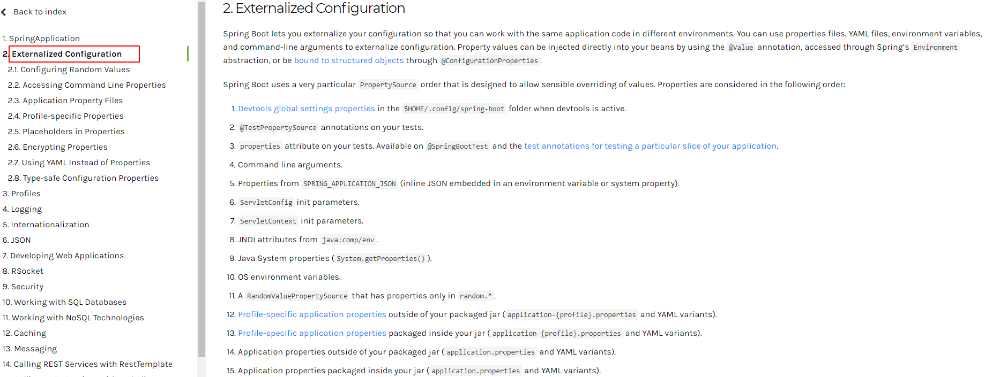

# 1 SpringBoot快速入门

## 1-1 SpringBoot概述

SpringBoot提供了一种快速使用Spring的方式，基于约定优于配置的思想，可以让开发人员不必在配置与逻辑业务之间进行思维的切换，全身心的投入到逻辑业务的代码编写中，从而大大提高了开发的效率

**SpringBoot功能**

 **1**） **自动配置**

Spring Boot的自动配置是一个**运行时**（更准确地说，是应用程序启动时）的过程，考虑了众多因素，运行时才决定Spring配置应该用哪个，不该用哪个。该过程是SpringBoot自动完成的。

**2**） **起步依赖**

起步依赖本质上是一个Maven项目对象模型（Project Object Model，POM）pom，定义了对其他库的传递依赖，这些东西加在一起即支持某项功能。

简单的说，起步依赖就是将具备某种功能的坐标打包到一起，并提供一些默认的功能。

**3**） **辅助功能**

提供了一些大型项目中常见的非功能性特性，如嵌入式服务器、安全、指标，健康检测、外部配置等。

**注意：Spring Boot 并不是对 Spring 功能上的增强，而是==提供了一种快速使用 Spring 的方式（脚手架）。==**


## 1-2 ==SpringBoot快速入门==

### 1-2-1 需求

搭建SpringBoot工程，定义HelloController.hello()方法，返回”Hello SpringBoot!”。

### 1-2-2 实现步骤

#### ① 创建Maven项目

#### ② 导入SpringBoot起步依赖

```xml
<!--springboot工程需要继承的父工程-->
<parent>
    <groupId>org.springframework.boot</groupId>
    <artifactId>spring-boot-starter-parent</artifactId>
    <version>2.1.8.RELEASE</version>
</parent>

<dependencies>
    <!--web开发的起步依赖-->
    <dependency>
        <groupId>org.springframework.boot</groupId>
        <artifactId>spring-boot-starter-web</artifactId>
    </dependency>
</dependencies>
```

#### ③ 定义Controller

```java
@RestController
public class HelloController {

    @RequestMapping("/hello")
    public String hello(){
        return " hello Spring Boot !";
    }
}

```

#### ④ 编写引导类

```java
/**
 * 引导类。 SpringBoot项目的入口
 */
@SpringBootApplication
public class HelloApplication {

    public static void main(String[] args) {
        SpringApplication.run(HelloApplication.class,args);
    }
    
}
```

#### ⑤ 启动测试

## 1-3 IDEA快速构建SpringBoot工程（不要依赖于这个）


## 1-4 SpringBoot起步依赖原理分析

- 在spring-boot-starter-parent中定义了各种技术的版本信息，组合了==一套最优搭配的技术版本==。

- 在各种starter中，定义了完成该功能需要的坐标合集，其中大部分==版本信息来自于父工程==。

- 我们的工程继承parent，引入starter后，通过依赖传递，就可以简单方便获得需要的jar包，并且==不会存在版本冲突==等问题。


# 2  SpringBoot配置文件

## 2-1 SpringBoot配置文件分类

* SpringBoot是基于约定的，所以很多配置都有默认值，但如果想使用自己的配置替换默认配置的话，就可以使用application.properties / application.yml / application.yaml 进行配置。

* 默认配置文件名称：application

* 在同一级目录下优先级为：properties > yml > yaml

***例如***：配置内置Tomcat的端口

properties：

```properties
server.port=8080
```

yml:

```yaml
server: 
  port: 8080
```

## 2-2 yaml基本语法

YAML：YAML Ain't Markup Language

- 大小写敏感
- 数据值前边必须有空格，作为分隔符
- 使用缩进(非tab缩进)表示层级关系
- ==缩进时不允许使用Tab键==，只允许使用空格（各个系统 Tab对应的空格数目可能不同，导致层次混乱）。
- 缩进的空格数目不重要，只要相同层级的元素左侧对齐即可
- ''#" 表示注释，从这个字符一直到行尾，都会被解析器忽略。

```yaml
server: 
  port: 8080  
  address: 127.0.0.1
    
name: abc
```

## 2-3 yaml数据格式

**对象(map)**：键值对的集合。

```yaml
person:  
  name: zhangsan
   
# 行内写法(用的不多 了解即可)
person: {name: zhangsan}
```

**数组**：一组按次序排列的值

```yaml
address:
  - beijing
  - shanghai
  
# 行内写法(用的不多 了解即可)
address: [beijing,shanghai]
```

**纯量**：单个的、不可再分的值

```yaml
msg1: 'hello \n world'  # 单引忽略转义字符
msg2: "hello \n world"  # 双引识别转义字符
```

**参数引用**

```yaml
name: lisa

person:
  name: ${name} # 引用上边定义的name值
```

## 2-4 获取配置文件中的数据

### 2-4-1 @Value注解方式

```java
//获取普通配置
@Value("${name}")
private String name;

//获取对象属性
@Value("${person.name}")
private String name2;

//获取数组
@Value("${address[0]}")
private String address1;

//获取纯量
@Value("${msg1}")
private String msg1;
```

### 2-4-2 通过Evironment对象

```java
@Autowired
private Environment env;

System.out.println(env.getProperty("person.name"));//lisa
System.out.println(env.getProperty("address[0]"));//beijing
```


### 2-4-3 @ConfigurationProperties

**注意**：prefix一定要写

```java
@Data
@Component
@ConfigurationProperties(prefix = "person")
public class Person {

    private String name;
    private int age;
    private String[] address;
    
}
```


## 2-5 profile实现多环境的配置切换

* profile是用来完成不同环境下，配置动态切换功能的。

### 2-5-1 profile配置方式

#### ① 多profile文件方式：

提供多个配置文件，每个代表一种环境。

* application-dev.properties/yml 开发环境
* application-test.properties/yml 测试环境
* application-prod.properties/yml 生产环境

#### ② yml多文档方式：（一个文件）

在yml中使用  --- 分隔不同配置

并加上下面代码 区分不同环境

```yml
spring:
  profiles: dev
```


### 2-5-2 profile激活方式

#### ① 配置文件

在配置文件中配置：spring.profiles.active=dev


#### ② 虚拟机参数

Run/Debug Configurations -> VM options

在VM options 指定：-Dspring.profiles.active=dev


#### ③ 命令行参数

方式一 ：--spring.profiles.active=dev

Run/Debug Configurations -> Program aruguments


方式二 ： java -jar 架包名.jar --spring.profiles.active=dev (常用)


## 2-6 项目内部配置文件加载顺序

 加载顺序为下文的排列顺序，高优先级配置的属性会生效

- file:./config/：当前项目下的/config目录下
- file:./           ：当前项目的根目录
- classpath:/config/：classpath的/config目录
- classpath:/  ：classpath的根目录

## 2-7 项目外部配置文件

1.命令行

```
java -jar jar包名.jar --server.port=9000
```

2.指定配置文件位置

```cmd
java -jar myproject.jar --spring.config.location=e://application.properties
```

3.外部不带profile的properties文件

```
classpath:/config/application.properties
classpath:/application.properties
```


 https://docs.spring.io/spring-boot/docs/current/reference/html/spring-boot-features.html#boot-features-external-config





# 3 SpringBoot整合其他框架

## 3-1 SpringBoot整合Junit

* 搭建SpringBoot工程

* 引入starter-test起步依赖


```xml
<dependencies>
    <dependency>
        <groupId>org.springframework.boot</groupId>
        <artifactId>spring-boot-starter-test</artifactId>
        <scope>test</scope>
    </dependency>
</dependencies>
```

* 编写测试类

```java
@RunWith(SpringRunner.class)//早期版本
@SpringBootTest(classes = ${你的启动类}.class)
@Slf4j
public class UserServiceTest {
    @Test
    public void testJunit() {
        log.info("111");
    }
}
```

***测试***

> 2023-03-20 22:33:35 [main] INFO  com.tan.springboot.UserServiceTest - Starting UserServiceTest on tansihao with PID 24264 (started by Administrator in G:\tsh\workspace\workspace04\springboot_quick_start) 
> 2023-03-20 22:33:35 [main] INFO  com.tan.springboot.UserServiceTest - No active profile set, falling back to default profiles: default 
> 2023-03-20 22:33:36 [main] INFO  com.tan.springboot.UserServiceTest - Started UserServiceTest in 0.69 seconds (JVM running for 1.177) 
> 2023-03-20 22:33:36 [main] INFO  com.tan.springboot.UserServiceTest - 111 

## 3-2 SpringBoot整合logback

[SpringBoot+logback优雅的配置日志！](https://blog.csdn.net/Mrs_chens/article/details/102455216?spm=1001.2101.3001.6650.2&utm_medium=distribute.pc_relevant.none-task-blog-2~default~CTRLIST~Rate-2.pc_relevant_antiscan&depth_1-utm_source=distribute.pc_relevant.none-task-blog-2~default~CTRLIST~Rate-2.pc_relevant_antiscan&utm_relevant_index=5)

[看完这个不会配置 logback ，请你吃瓜！](https://juejin.cn/post/6844903641535479821)

路人皆知，Springboot默认使用的日志框架是Logback。顺势而为，在项目中，我们使用Logback，其实只需增加一个配置文件（自定义你的配置）即可

application.yml文件：

```yml
logging:
  path: ./log
```

在src/main/resourses下创建：logback-spring.xml

```xml
<?xml version="1.0" encoding="UTF-8" ?>
<configuration>
    <!-- 属性文件:在properties文件中找到对应的配置项 -->
    <springProperty scope="context" name="logging.path" source="logging.path"/>
    <contextName>tony</contextName>

    <appender name="consoleLog" class="ch.qos.logback.core.ConsoleAppender">
        <encoder class="ch.qos.logback.classic.encoder.PatternLayoutEncoder">
            <!--格式化输出（配色）：%d表示日期，%thread表示线程名，%-5level：级别从左显示5个字符宽度%msg：日志消息，%n是换行符-->
            <pattern>%yellow(%d{yyyy-MM-dd HH:mm:ss}) %red([%thread]) %highlight(%-5level) %cyan(%logger{50}) - %magenta(%msg) %n
            </pattern>
            <charset>UTF-8</charset>
        </encoder>
    </appender>

    <!--根据日志级别分离日志，分别输出到不同的文件-->
    <appender name="fileInfoLog" class="ch.qos.logback.core.rolling.RollingFileAppender">
        <filter class="ch.qos.logback.classic.filter.LevelFilter">
            <level>ERROR</level>
            <onMatch>DENY</onMatch>
            <onMismatch>ACCEPT</onMismatch>
        </filter>
        <encoder class="ch.qos.logback.classic.encoder.PatternLayoutEncoder">
            <pattern>
                %d{yyyy-MM-dd HH:mm:ss} [%thread] %-5level %logger{50} - %msg%n
            </pattern>
            <charset>UTF-8</charset>
        </encoder>
        <!--滚动策略-->
        <rollingPolicy class="ch.qos.logback.core.rolling.TimeBasedRollingPolicy">
            <!--按时间保存日志 修改格式可以按小时、按天、月来保存-->
            <fileNamePattern>${logging.path}/tony.info.%d{yyyy-MM-dd}.log</fileNamePattern>
            <!--保存时长-->
            <MaxHistory>90</MaxHistory>
            <!--文件大小-->
            <totalSizeCap>1GB</totalSizeCap>
        </rollingPolicy>
    </appender>

    <appender name="fileErrorLog" class="ch.qos.logback.core.rolling.RollingFileAppender">
        <filter class="ch.qos.logback.classic.filter.ThresholdFilter">
            <level>ERROR</level>
        </filter>
        <encoder>
            <pattern>
                %d{yyyy-MM-dd HH:mm:ss} [%thread] %-5level %logger{50} - %msg%n
            </pattern>
        </encoder>
        <!--滚动策略-->
        <rollingPolicy class="ch.qos.logback.core.rolling.TimeBasedRollingPolicy">
            <!--路径-->
            <fileNamePattern>${logging.path}/tony.error.%d{yyyy-MM-dd}.log</fileNamePattern>
            <MaxHistory>90</MaxHistory>
        </rollingPolicy>
    </appender>

    <root level="info">
        <appender-ref ref="consoleLog"/>
        <appender-ref ref="fileInfoLog"/>
        <appender-ref ref="fileErrorLog"/>
    </root>


</configuration>
```

## 3-3 SpringBoot整合mybatis

①搭建SpringBoot工程

②引入mybatis起步依赖，添加mysql驱动

```xml
<dependencies>
    <dependency>
        <groupId>org.mybatis.spring.boot</groupId>
        <artifactId>mybatis-spring-boot-starter</artifactId>
    </dependency>
    <dependency>
        <groupId>mysql</groupId>
        <artifactId>mysql-connector-java</artifactId>
    </dependency>
    <dependency>
        <groupId>com.alibaba</groupId>
        <artifactId>druid</artifactId>
        <version>1.2.1</version>
    </dependency>
</dependencies>
```

**③编写DataSource和MyBatis相关配置**

application.yml

```yaml
# datasource
spring:
  datasource:
    username: root
    password: 123456
    url: jdbc:mysql://localhost:3306/数据库名?serverTimezone=Asia/Shanghai
    driver-class-name: com.mysql.cj.jdbc.Driver
    type: com.alibaba.druid.pool.DruidDataSource


# mybatis
mybatis:
  mapper-locations: classpath:mapper/*Mapper.xml # mapper映射文件路径
  #config-location: classpath:mybatis-config.xml 指定mybatis的核心配置文件 可以没有这个 改为用配置类 
  configuration:
    map-underscore-to-camel-case: true
```


**④定义表和实体类**

```java
public class User {
    private int id;
    private String username;
    private String password;
}
```

**⑤编写mapper文件/纯注解开发**

编写mapper

```java
@Mapper
@Repository
public interface StudentMapper {
    List<Student> queryAll();

    Student getById(Integer stuId);
}
```

mapper.xml

```xml
<?xml version="1.0" encoding="UTF-8" ?>
<!DOCTYPE mapper PUBLIC "-//mybatis.org//DTD Mapper 3.0//EN" "http://mybatis.org/dtd/mybatis-3-mapper.dtd">
<mapper namespace="com.tan.myblog.mapper.StudentMapper">
    
    <!--List<Student> queryAll();-->
    <select id="queryAll" resultType="com.tan.myblog.model.Student">
        select stu_id stuId,stu_name stuName from t_student
    </select>
    
</mapper>
```

⑥测试

## 3-4 SpringBoot整合redis

①搭建SpringBoot工程

②引入redis起步依赖

```xml
<dependencies>
    <dependency>
        <groupId>org.springframework.boot</groupId>
        <artifactId>spring-boot-starter-data-redis</artifactId>
    </dependency>

    <dependency>
        <groupId>org.springframework.boot</groupId>
        <artifactId>spring-boot-starter-test</artifactId>
        <scope>test</scope>
    </dependency>
</dependencies>
```

③配置redis相关属性

```yaml
spring:
  redis:
    host: 127.0.0.1 # redis的主机ip
    port: 6379

```

④注入RedisTemplate模板

⑤编写测试方法，测试

```java
@RunWith(SpringRunner.class)
@SpringBootTest
public class SpringbootRedisApplicationTests {

    @Autowired
    private RedisTemplate redisTemplate;

    @Test
    public void testSet() {
        //存入数据
        redisTemplate.boundValueOps("name").set("zhangsan");
    }

    @Test
    public void testGet() {
        //获取数据
        Object name = redisTemplate.boundValueOps("name").get();
        System.out.println(name);
    }

}

```


# 4 SpringBoot自动配置

## 4-1 @Conditional条件注解


Condition是Spring4.0后引入的条件化配置接口，通过实现Condition接口可以完成有条件的加载相应的Bean

@Conditional要配合Condition的实现类（ClassCondition）进行使用

### 4-1-1 需求一

在Spring的IOC容器中有一个User的Bean，现要求：

导入Jedis坐标后才加载该Bean，没导入就不加载

#### ① pojo类与config类

```java
@Data
public class User {
    private Integer uid;
    private String uname;
}
```

```java
@Configuration
public class UserConfig {

    @Bean
    @Conditional(ClazzCondition.class)
    public User user(){
        User user = new User();
        user.setUid(1);
        user.setUname("tan");
        return user;
    }
}
```

#### ② 自定义类实现Condition接口

```java
@Slf4j
public class ClazzCondition implements Condition {
    @Override
    public boolean matches(ConditionContext conditionContext, AnnotatedTypeMetadata annotatedTypeMetadata) {
        //导入Jedis坐标后创建bean

        boolean flag = true;

        try {
            Class<?> clazz = Class.forName("redis.clients.jedis.Jedis");
        } catch (ClassNotFoundException e) {
            log.error("Jedis坐标并没有导入");
            flag = false;
        }

        return flag;
    }
}
```


***测试***

```java
@Slf4j
@SpringBootApplication
public class SpringbootConditionApplication {

    public static void main(String[] args) {
        //启动springboot的应用，并获得IOC容器
        ConfigurableApplicationContext applicationContext = SpringApplication.run(SpringbootConditionApplication.class, args);

        //手动获取bean，redisTemplate
        //Object redisTemplate = applicationContext.getBean("redisTemplate");
        //System.out.println("redisTemplate = " + redisTemplate);

        Object user = applicationContext.getBean("user");
        log.info(user.toString());

    }

}
```


### 4-1-2 需求二

将类的判断定义为动态的。判断哪个字节码文件存在可以动态指定。

#### ① 自定义条件注解类

```java
@Target({ElementType.TYPE, ElementType.METHOD})
@Retention(RetentionPolicy.RUNTIME)
@Documented
@Conditional(ClassCondition.class)
public @interface ConditionOnClass {
    String[] value();
}
```

**注意：**此处@ConditionOnClass为自定义注解

#### ② 修改实现Condition的自定义类

```java
//***获取注解中传入的包名
Map<String, Object> map = annotatedTypeMetadata.getAnnotationAttributes(ConditionOnClazz.class.getName());
log.info(map.toString());
String[] value = (String[]) map.get("value");
boolean flag = true;
try {
    for (String str : value) {
        Class<?> clazz = Class.forName(str);
    }
} catch (ClassNotFoundException e) {
    log.error("没有导入坐标!");
    flag = false;
}
return flag;
```

***测试***

```java
@Configuration
public class UserConfig {

    @Bean
    @ConditionOnClazz("redis.clients.jedis.Jedis")
    public User user(){
        User user = new User();
        user.setUid(1);
        user.setUname("tan");
        return user;
    }
}
```


```java
Object user = applicationContext.getBean("user");
log.info(user.toString());
```

> 2023-03-21 10:25:36 [main] INFO  c.tan.springbootcondition.condition.ClazzCondition - {value=[redis.clients.jedis.Jedis]} 
> 。。。
> 2023-03-21 10:25:36 [main] INFO  c.t.s.SpringbootConditionApplication - User(uid=1, uname=tan) 


### 4-1-3 SpringBoot 提供的常用条件注解

查看条件注解源码


**ConditionalOnProperty：**判断配置文件中是否有对应属性和值才初始化Bean

**ConditionalOnClass**：判断环境中是否有对应字节码文件才初始化Bean

**ConditionalOnMissingBean**：判断环境中没有对应Bean才初始化Bean


## 4-2 切换内置web服务器

① 查看继承关系图


② 排除Tomcat


 

③ pom文件中的排除依赖效果

```xml
 <dependency>
     <groupId>org.springframework.boot</groupId>
     <artifactId>spring-boot-starter-web</artifactId>
     <!--排除tomcat依赖-->
     <exclusions>
         <exclusion>
             <artifactId>spring-boot-starter-tomcat</artifactId>
             <groupId>org.springframework.boot</groupId>
         </exclusion>
     </exclusions>
</dependency>

<!--引入jetty的依赖-->
<dependency>
    <artifactId>spring-boot-starter-jetty</artifactId>
    <groupId>org.springframework.boot</groupId>
</dependency>
```

## 4-3 @Enable注解原理

* 已知：SpringBoot不能直接获取在其他工程中定义的Bean
* 需求：获取springboot-enable-other中的User这个bean对象

 *springboot-enable-other工程*

  ```java
@Configuration
public class UserConfig {
    @Bean
    public User user() {
        return new User();
    }
}
  ```

***演示代码：***

pom中引入*springboot-enable-other*

```xml
<dependency>
    <groupId>com.itheima</groupId>
    <artifactId>springboot-enable-other</artifactId>
    <version>0.0.1-SNAPSHOT</version>
</dependency>
```

*springboot-enable工程*

  **三种解决方案：**

  1.使用@ComponentScan扫描com.itheima.config包 （user所在包）

  2.可以使用@Import注解，加载类。这些类都会被Spring创建，并放入IOC容器

  3.可以对Import注解进行封装。

```java
/**
 * @ComponentScan 扫描范围：当前引导类所在包及其子包
 * com.itheima.springbootenable
 * com.itheima.config
 * 方式1.使用@ComponentScan扫描com.itheima.config包
 * 方式2.可以使用@Import注解，加载类。这些类都会被Spring创建，并放入IOC容器
 * 方式3.可以对Import注解进行封装（这里封装为@EnableUser）。
 */

//@ComponentScan("com.itheima.config")
//@Import(UserConfig.class)
@EnableUser
@SpringBootApplication
public class SpringbootEnableApplication {

    public static void main(String[] args) {
        ConfigurableApplicationContext context = SpringApplication.run(SpringbootEnableApplication.class, args);

     	//获取Bean
        Object user = context.getBean("user");
        System.out.println(user);

	}

}
```


**EnableUser注解类**

  ```java
@Target(ElementType.TYPE)
@Retention(RetentionPolicy.RUNTIME)
@Documented
@Import(UserConfig.class)
public @interface EnableUser {}
  ```


  **重点：Enable注解底层原理是使用@Import注解实现Bean的动态加载**


## 4-4 @Import详解

@Enable 底层依赖于@Import 注解导入一些类，使用 @Import 导入的类会被Spring加载到IOC容器中。

而@Import提供四种用法：

① 导入Bean
- 导入Bean  `@Import(User.class)`

```java
User user = context.getBean(User.class);
System.out.println(user);
Map<String, User> map = context.getBeansOfType(User.class);
System.out.println(map);
```

② 导入配置类
- 导入配置类  `@Import(UserConfig.class)`

```java
User user = context.getBean(User.class);
System.out.println(user);
Role role = context.getBean(Role.class);
System.out.println(role);
```

③ 导入 ImportSelector 实现类。一般用于加载配置文件中的类

- 导入 ImportSelector 实现类   `@Import(MyImportSelector.class)` 

  `MyImportSelector`

```java
  public class MyImportSelector implements ImportSelector {
      @Override
      public String[] selectImports(AnnotationMetadata importingClassMetadata) {
          return new String[]{"com.itheima.domain.User", "com.itheima.domain.Role"};
      }
  }
```

```java
User user = context.getBean(User.class);
System.out.println(user);
Role role = context.getBean(Role.class);
System.out.println(role);
```

④ 导入 ImportBeanDefinitionRegistrar 实现类。

- 导入 ImportBeanDefinitionRegistrar 实现类。`@Import({MyImportBeanDefinitionRegistrar.class})`

 ```java
 public class MyImportBeanDefinitionRegistrar implements ImportBeanDefinitionRegistrar {
     @Override
     public void registerBeanDefinitions(AnnotationMetadata importingClassMetadata, BeanDefinitionRegistry registry) {
         AbstractBeanDefinition beanDefinition = BeanDefinitionBuilder.rootBeanDefinition(User.class).getBeanDefinition();
         registry.registerBeanDefinition("user", beanDefinition);
     }
 }
 ```

```java
User user = context.getBean(User.class);
System.out.println(user);
```

***总结：***@Import 的 四种用法：

*  导入Bean ---@Import(User.class)
*  导入配置类 ----@Import(UserConfig.class)
*  导入ImportSelector的实现类。---@Import(MyImportSelector.class)
*  导入ImportBeanDefinitionRegistrar实现类 ---@Import({MyImportBeanDefinitionRegistrar.class})


**注意：**下面要讲的@EnableAutoConfiguration注解中使用的是第三种方式：@Import(AutoConfigurationImportSelector.class)


## 4-5 @EnableAutoConfiguration详解

- @EnableAutoConfiguration 注解内部使用 @Import(AutoConfigurationImportSelector.**class**)来加载配置类。 

- 配置文件位置：META-INF/spring.factories，该配置文件中定义了大量的配置类，当 SpringBoot 应用启动时，会自动加载这些配置类，初始化Bean

- 并不是所有的Bean都会被初始化，在配置类中使用Condition来加载满足条件的Bean


## 4-6 自定义starter（起步依赖）实现

### 4-6-1 自定义starter案例步骤分析

**需求：**==自定义redis-starter。==要求当导入redis坐标时，SpringBoot自动创建Jedis的Bean。

**步骤：**

① 创建 my-redis-spring-boot-autoconfigure 模块

② 创建 redis-spring-boot-starter 模块，依赖 redis-spring-boot-autoconfigure的模块

③ 在 redis-spring-boot-autoconfigure 模块中初始化  Jedis 的 Bean。并定义 ==META-INF/spring.factories== 文件

④ 在测试模块中引入自定义的 redis-starter 依赖，测试获取 Jedis 的Bean，操作 redis。

### 4-6-2 实现步骤

#### ① 创建my-redis-spring-boot-autoconfigure配置工程  

* 创建MyRedisProperties配置文件参数绑定类 

```java
@Data
@ConfigurationProperties(prefix = "myredis")
public class MyRedisProperties {
    private String host = "localhost";
    private Integer port = 6379;
}
```

* 创建MyRedisAutoConfiguration自动配置类

```java
@Configuration
@EnableConfigurationProperties(MyRedisProperties.class)
public class MyRedisAutoConfiguration {

    /**
     * 注册自定义Jedis的Bean 注入IOC容器
     * @return
     */
    @Bean
    public Jedis jedis(MyRedisProperties properties){
        return new Jedis(properties.getHost(),properties.getPort());
    }

}
```

* 在resource目录下创建META-INF文件夹并创建spring.factories

注意：”\ “是换行使用的

```properties
org.springframework.boot.autoconfigure.EnableAutoConfiguration=\
  com.tan.myredis.config.MyRedisAutoConfiguration
```

* 使用注解完成有条件地加载配置类

```java
@Configuration
@EnableConfigurationProperties(MyRedisProperties.class)
@ConditionalOnClass(Jedis.class)
public class MyRedisAutoConfiguration {

    /**
     * 注册自定义Jedis的Bean 注入IOC容器
     * @return
     */
    @Bean
    @ConditionalOnMissingBean
    public Jedis jedis(MyRedisProperties properties){
        System.out.println("使用了我自定义的redis-starter配置redis...");
        return new Jedis(properties.getHost(),properties.getPort());
    }

}
```

#### ② 创建my-redis-spring-boot-starter起步依赖工程

pom文件中引入my-redis-spring-boot-autoconfigure

```xml
<!--引入自定义autoconfigure-->
<dependency>
    <groupId>com.tan</groupId>
    <artifactId>my-redis-spring-boot-autoconfigure</artifactId>
    <version>1.0-SNAPSHOT</version>
</dependency>
```


#### ③ 在springboot_quick_start工程中引入自定义的redis的starter

```xml
<!--自定义的redis的starter-->
<dependency>
    <groupId>com.tan</groupId>
    <artifactId>my-redis-spring-boot-starter</artifactId>
    <version>1.0-SNAPSHOT</version>
</dependency>
```

* 在启动类中测试

```java
    public static void main(String[] args) {
        ConfigurableApplicationContext context = SpringApplication.run(SpringbootQuickStartApplication.class, args);
        Jedis jedis = context.getBean(Jedis.class);
        log.info(jedis + "");
        jedis.set("name","tansihao");
        String name = jedis.get("name");
        log.info(name);
    }
```

* 测试工程中的application.properties中的配置参数是否生效

```yml
myredis:
  host: 192.168.10.250
```


# 5 SpringBoot事件监听


## 5-1  Java中的事件监听机制

* SpringBoot的监听机制，其实是对Java提供的事件监听机制的封装

* Java中的事件监听机制定义了以下几个角色：

​		① 事件：Event，继承 java.util.EventObject 类的对象

​		② 事件源：Source ，任意对象Object

​		③ 监听器：Listener，实现 java.util.EventListener 接口 的对象


## 5-2 SpringBoot的监听机制

SpringBoot 在项目启动时，会对几个监听器进行回调，我们可以实现这些监听器接口，在项目启动时完成一些操作。

- ApplicationContextInitializer

- SpringApplicationRunListener

- CommandLineRunner

- ApplicationRunner

  


### 5-2-1 自定义监听器的启动时机

**ApplicationRunner**和**CommandLineRunner**都是当项目启动后执行，使用@Component==放入容器即可使用==。

**作用：**例如Redis加载mysql缓存预热

MyApplicationRunner

```java
@Slf4j
@Component
public class MyApplicationRunner implements ApplicationRunner {
    @Override
    public void run(ApplicationArguments args) throws Exception {
        log.info("ApplicationRunner.run()...");
    }
}
```

 MyCommandLineRunner

```java
@Slf4j
@Component
public class MyCommandLineRunner implements CommandLineRunner {
    @Override
    public void run(String... args) throws Exception {
        log.info("CommandLineRunner.run()...");
        log.info(Arrays.asList(args)+"");
    }
}
```


MyApplicationContextInitializer的使用要在resource文件夹下添加META-INF/spring.factories

```properties
org.springframework.context.ApplicationContextInitializer=com.itheima.springbootlistener.listener.MyApplicationContextInitializer
```

```
@Component
public class MyApplicationContextInitializer implements ApplicationContextInitializer {
    @Override
    public void initialize(ConfigurableApplicationContext applicationContext) {
        System.out.println("ApplicationContextInitializer....initialize");
    }
}
```

MySpringApplicationRunListener的使用要添加**构造器**

```java
public class MySpringApplicationRunListener implements SpringApplicationRunListener {

    public MySpringApplicationRunListener(SpringApplication application, String[] args) {
    }

    @Override
    public void starting() {
        System.out.println("starting...项目启动中");
    }

    @Override
    public void environmentPrepared(ConfigurableEnvironment environment) {
        System.out.println("environmentPrepared...环境对象开始准备");
    }

    @Override
    public void contextPrepared(ConfigurableApplicationContext context) {
        System.out.println("contextPrepared...上下文对象开始准备");
    }

    @Override
    public void contextLoaded(ConfigurableApplicationContext context) {
        System.out.println("contextLoaded...上下文对象开始加载");
    }

    @Override
    public void started(ConfigurableApplicationContext context) {
        System.out.println("started...上下文对象加载完成");
    }

    @Override
    public void running(ConfigurableApplicationContext context) {
        System.out.println("running...项目启动完成，开始运行");
    }

    @Override
    public void failed(ConfigurableApplicationContext context, Throwable exception) {
        System.out.println("failed...项目启动失败");
    }
}
```


