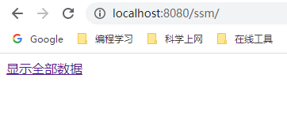
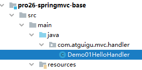

# P章 问题记录

## P-1 maven lib has broken path

打开ProjectSettings时，发现Problems栏里报了这个错：Maven：XXXXX lib has broken path

**排查：**删了再导，不行；两个Settings查看maven路径，没问题；重新build，不行

**原因**：系统变量里只有MAVEN_HOME,应该还要有一个M2_HOME,添加后，问题解决。


## P-2 表单中的中文传过来变成了乱码


**解决：**在web.xml中配置Spring编码过滤器

```xml
    <!--配置Spring编码过滤器-->
    <filter>
        <filter-name>CharacterEncodingFilter</filter-name>
        <filter-class>org.springframework.web.filter.CharacterEncodingFilter</filter-class>
        <!--设置请求编码-->
        <init-param>
            <param-name>encoding</param-name>
            <param-value>UTF-8</param-value>
        </init-param>
        <!--设置响应编码-->
        <init-param>
            <param-name>forceEncoding</param-name>
            <param-value>true</param-value>
        </init-param>
    </filter>
    <filter-mapping>
        <filter-name>CharacterEncodingFilter</filter-name>
        <url-pattern>/*</url-pattern>
    </filter-mapping>
```

## P-3 Maven打war包时报找不到web.xml的错误

***具体报错：***


> Error assembling WAR: webxml attribute is required (or pre-existing WEB-INF/web.xml if executing in update mode) -> [Help 1]

***思路：***

先翻译一下：组装 WAR 时出错：需要 webxml 属性（如果以更新模式执行，则需要预先存在的 WEB-INF/web.xml）-> [帮助 1]

***百度得到原因：***

maven的web项目默认的webroot是在src\main\webapp。如果在此目录下找不到web.xml就抛出以上的异常。

***解决方案：***在pom.xml文件中加上下面配置，关键是：<webXml>WebContent\WEB-INF\web.xml</webXml>

```xml
<plugin>
    <groupId>org.apache.maven.plugins</groupId>
    <artifactId>maven-war-plugin</artifactId>
    <version>2.2</version>
    <configuration>
        <!--指定web.xml的路径  -->
        <webXml>web\WEB-INF\web.xml</webXml>
        <!--指定jsp、js、css的路径  -->
        <warSourceDirectory>web</warSourceDirectory>
    </configuration>
</plugin>
```

***另外的：***

在打包时你发现你的jsp 、js、css 没有在war包中，也就是这些或其中的一些文件丢失了，这是为什么？

常规Web项目的jsp、js、css等文件都是放到WebContent/WebRoot里的。

而Maven中，这些文件是放到webapp下的。所以，如果你直接用Maven进行install也就是打包的时候，你的页面相关的文件不会被打包进去，你会发现打好的war包里只有src下的.class文件和一些配置文件。那么如何将页面等文件也包含进去呢？

很简单，你只要告诉Maven你的jsp、js、css放在了什么位置，具体配置如下：

```xml
<warSourceDirectory>web</warSourceDirectory>
```


# X章 SSM整合(以一个员工单表为例)*\*\*\***

## X-1 SSM整合搭建环境持久化层操作

### X-1-1 准备工作

#### ① 物理建模：创建数据库表


#### ② 逻辑建模：创建实体类

```java
@Data
@AllArgsConstructor
@NoArgsConstructor
public class Employee {
    private Integer empId;
    private String empName;
    private Double empSalary;
}
```

#### ③ 创建Project或module


#### ④ 引入依赖，把整个SSM整合需要的依赖全部拿进来即可

```xml
<!-- SpringMVC -->
<dependency>
    <groupId>org.springframework</groupId>
    <artifactId>spring-webmvc</artifactId>
    <version>5.3.1</version>
</dependency>
 
<!-- Spring 持久化层所需依赖 -->
<dependency>
    <groupId>org.springframework</groupId>
    <artifactId>spring-orm</artifactId>
    <version>5.3.1</version>
</dependency>
 
<!-- 日志 -->
<dependency>
    <groupId>ch.qos.logback</groupId>
    <artifactId>logback-classic</artifactId>
    <version>1.2.3</version>
</dependency>
 
<!-- ServletAPI -->
<dependency>
    <groupId>javax.servlet</groupId>
    <artifactId>javax.servlet-api</artifactId>
    <version>3.1.0</version>
    <scope>provided</scope>
</dependency>
 
<!-- Spring5和Thymeleaf整合包 -->
<dependency>
    <groupId>org.thymeleaf</groupId>
    <artifactId>thymeleaf-spring5</artifactId>
    <version>3.0.12.RELEASE</version>
</dependency>
 
<!-- Mybatis 和 Spring 的整合包 -->
<dependency>
    <groupId>org.mybatis</groupId>
    <artifactId>mybatis-spring</artifactId>
    <version>2.0.6</version>
</dependency>
 
<!-- Mybatis核心 -->
<dependency>
    <groupId>org.mybatis</groupId>
    <artifactId>mybatis</artifactId>
    <version>3.5.7</version>
</dependency>
 
<!-- MySQL驱动 -->
<dependency>
    <groupId>mysql</groupId>
    <artifactId>mysql-connector-java</artifactId>
    <version>5.1.3</version>
</dependency>
 
<!-- 数据源 -->
<dependency>
    <groupId>com.alibaba</groupId>
    <artifactId>druid</artifactId>
    <version>1.0.31</version>
</dependency>
 
<!-- Spring 的测试功能 -->
<dependency>
    <groupId>org.springframework</groupId>
    <artifactId>spring-test</artifactId>
    <version>5.3.1</version>
</dependency>
 
<!-- junit4 -->
<dependency>
    <groupId>junit</groupId>
    <artifactId>junit</artifactId>
    <version>4.12</version>
    <scope>test</scope>
</dependency>

<!-- Lombok -->
<dependency>
    <groupId>org.projectlombok</groupId>
    <artifactId>lombok</artifactId>
    <version>1.18.12</version>
    <scope>provided</scope>
</dependency>
```

#### ⑤ 加入日志配置文件，全局日志级别设置为debug


```xml
<?xml version="1.0" encoding="UTF-8"?>
<configuration debug="true">
    <!-- 指定日志输出的位置，ConsoleAppender表示输出到控制台 -->
    <appender name="STDOUT"
              class="ch.qos.logback.core.ConsoleAppender">
        <encoder>
            <!-- 日志输出的格式 -->
            <!-- 按照顺序分别是：时间、日志级别、线程名称、打印日志的类、日志主体内容、换行 -->
            <pattern>[%d{HH:mm:ss}] [%-5level] [%thread] [%logger] [%msg]%n</pattern>
            <charset>GBK</charset>
        </encoder>
    </appender>

    <!-- 设置全局日志级别。日志级别按顺序分别是：TRACE、DEBUG、INFO、WARN、ERROR -->
    <!-- 指定任何一个日志级别都只打印当前级别和后面级别的日志。 -->
    <root level="DEBUG">
        <!-- 指定打印日志的appender，这里通过“STDOUT”引用了前面配置的appender -->
        <appender-ref ref="STDOUT" />
    </root>

    <!-- 根据特殊需求指定局部日志级别，可也是包名或全类名。 -->
    <logger name="com.tan" level="DEBUG" />

</configuration>
```


### X-1-2 连接数据库

#### ① 创建jdbc.properties


```properties
jdbc.driver=com.mysql.jdbc.Driver
jdbc.url=jdbc:mysql://localhost:3306/mybatis_spring_db1
jdbc.username=root
jdbc.password=root
```

#### ② 创建Spring配置文件


#### ③ 在Spring配置文件中引入jdbc.properties

```xml
    <!-- 加载外部属性文件 -->
    <context:property-placeholder location="classpath:jdbc.properties"/>
```

#### ④ 在Spring配置文件中配置数据源

```xml
<!-- 配置数据源 -->
<bean id="druidDataSource" class="com.alibaba.druid.pool.DruidDataSource">
    <property name="driverClassName" value="${jdbc.driver}"/>
    <property name="url" value="${jdbc.url}"/>
    <property name="username" value="${jdbc.username}"/>
    <property name="password" value="${jdbc.password}"/>
</bean>
```

#### ⑤ 创建junit测试类测试

### X-1-3 Spring整合Mybatis

#### ① 框架环境层面

##### [1] 创建Mybatis的全局配置文件

##### [2] 在Spring配置文件中配置SqlSessionFactoryBean

* 指定Mybatis全局配置文件的位置
* Mapper配置文件的位置
* 装配数据源

```xml
    <!-- 配置 SqlSessionFactoryBean -->
    <bean id="sqlSessionFactory" class="org.mybatis.spring.SqlSessionFactoryBean">
        <!-- 指定 Mybatis 全局配置文件位置 -->
        <property name="configLocation" value="classpath:mybatis-config.xml"/>
        <!-- 指定 Mapper 配置文件位置 -->
        <property name="mapperLocations" value="classpath:mappers/*Mapper.xml"/>
        <!-- 装配数据源 -->
        <property name="dataSource" ref="druidDataSource"/>
    </bean>
```

##### [3] 把Mapper接口所在的包扫描到IOC容器

```xml
    <!-- 配置 Mapper 接口的bean的扫描器 -->
    <mybatis-spring:scan base-package="com.tan.ssm.mapper"/>
```

#### ② 具体功能层面

##### [1] 创建Mapper接口


```java
public interface EmployeeMapper {
    List<Employee> queryAll();
}
```


##### [2] 创建Mapper配置文件


```xml
<?xml version="1.0" encoding="UTF-8" ?>
<!DOCTYPE mapper
        PUBLIC "-//mybatis.org//DTD Mapper 3.0//EN"
        "http://mybatis.org/dtd/mybatis-3-mapper.dtd">

<!-- mapper是根标签。namespace属性是找到当前配置的依据 -->
<!-- 由于最理想的Mybatis使用方式是：通过Mapper接口调用接口方法，访问数据库 -->
<!-- 这样的理想方式要求：能够通过接口全类名找到Mapper配置 -->
<!-- 所以：我们就用Mapper接口的全类名来给namespace属性赋值 -->

<mapper namespace="com.tan.ssm.mapper.EmployeeMapper">

    <!--List<Employee> queryAll();-->
    <select id="queryAll" resultType="com.tan.ssm.pojo.Employee">
        select emp_id,emp_name,emp_salary from t_emp;
    </select>

</mapper>
```


##### [3] 在 junit测试类中装配Mapper接口并测试

```java
@RunWith(SpringJUnit4ClassRunner.class)
@ContextConfiguration(value = "classpath:spring-persist.xml")
@Slf4j
public class SSMTest {
    
    @Autowired
    private EmployeeMapper employeeMapper;


    @Test
    public void testQueryAll(){
        List<Employee> employeeList = employeeMapper.queryAll();
        for (Employee employee : employeeList) {
            log.debug(employee.toString());
        }
    }

}
```

> [15:15:33] [DEBUG] [main] [com.tan.ssm.mapper.EmployeeMapper.queryAll] [\==>  Preparing: select emp_id,emp_name,emp_salary from t_emp;]
> [15:15:33] [DEBUG] [main] [com.tan.ssm.mapper.EmployeeMapper.queryAll] [\==> Parameters: ]
> [15:15:34] [DEBUG] [main] [com.tan.ssm.mapper.EmployeeMapper.queryAll] [<==      Total: 9]
> [15:15:34] [DEBUG] [main] [org.mybatis.spring.SqlSessionUtils] [Closing non transactional SqlSession [org.apache.ibatis.session.defaults.DefaultSqlSession@3fc79729]]
> [15:15:34] [DEBUG] [main] [SSMTest] [Employee(empId=1, empName=张三, empSalary=1000.0)]
> [15:15:34] [DEBUG] [main] [SSMTest] [Employee(empId=2, empName=李四, empSalary=1000.0)]
> [15:15:34] [DEBUG] [main] [SSMTest] [Employee(empId=3, empName=王五, empSalary=1000.0)]
> [15:15:34] [DEBUG] [main] [SSMTest] [Employee(empId=4, empName=赵六, empSalary=1000.0)]
> [15:15:34] [DEBUG] [main] [SSMTest] [Employee(empId=5, empName=周七, empSalary=1000.0)]
> [15:15:34] [DEBUG] [main] [SSMTest] [Employee(empId=6, empName=孙八, empSalary=1000.0)]
> [15:15:34] [DEBUG] [main] [SSMTest] [Employee(empId=7, empName=孙笑川, empSalary=1000.0)]
> [15:15:34] [DEBUG] [main] [SSMTest] [Employee(empId=8, empName=李老八, empSalary=1000.0)]
> [15:15:34] [DEBUG] [main] [SSMTest] [Employee(empId=9, empName=雷电将军, empSalary=1000.0)]


### X-1-4 配置Spring的声明式事务

#### ① 框架环境层面

#####   [1] 在Spring的配置文件(spring-persist.xml)中配置事务管理器

* 装配数据源

```xml
<!-- 配置事务管理器 -->
<bean id="transactionManager" class="org.springframework.jdbc.datasource.DataSourceTransactionManager">
    <!-- 装配数据源 -->
    <property name="dataSource" ref="druidDataSource"/>
</bean>
```

#####   [2] 在Spring的配置文件中开启基于注解的声明式事务

* 装配事务管理器

```xml
<!-- 开启基于注解的声明式事务 -->
<tx:annotation-driven transaction-manager="transactionManager"/>
```

#####   [3] (spring-persist)配置针对Service类的自动扫描的包

```xml
<context:component-scan base-package="com.tan.ssm.service"/>
```

#### ② 具体功能层面

##### [1] 创建Service接口


```java
public interface EmployeeService {

    List<Employee> getAll();

}
```

##### [2] 创建ServiceImpl类


```java
@Service
public class EmployeeServiceImpl implements EmployeeService {

    @Autowired
    private EmployeeMapper employeeMapper;

    @Override
    @Transactional(readOnly = true)
    public List<Employee> getAll() {
        return employeeMapper.queryAll();
    }
}

```


##### [3] 在需要使用事务的方法上加@Transactional注解

```java
    @Override
    @Transactional(readOnly = true)
    public List<Employee> getAll() {
        return employeeMapper.queryAll();
    }
```


##### [4] 在junit测试类中装配Service接口并测试

```java
@RunWith(SpringJUnit4ClassRunner.class)
@ContextConfiguration(value = "classpath:spring-persist.xml")
@Slf4j
public class SSMTest {

    @Autowired
    private EmployeeService employeeService;

    @Test
    public void testTxService(){
        List<Employee> employeeList = employeeService.getAll();

        for (Employee employee : employeeList) {
            log.debug(employee.toString());
        }
    }
```

> [15:28:23] [DEBUG] [main] [com.tan.ssm.mapper.EmployeeMapper.queryAll] [Preparing: select emp_id,emp_name,emp_salary from t_emp;]
> [15:28:23] [DEBUG] [main] [com.tan.ssm.mapper.EmployeeMapper.queryAll] [ Parameters: ]
> [15:28:23] [DEBUG] [main] [com.tan.ssm.mapper.EmployeeMapper.queryAll] [<==      Total: 9]
> [15:28:23] [DEBUG] [main] [org.mybatis.spring.SqlSessionUtils] [Releasing transactional SqlSession [org.apache.ibatis.session.defaults.DefaultSqlSession@5a18cd76]]
> [15:28:23] [DEBUG] [main] [org.mybatis.spring.SqlSessionUtils] [Transaction synchronization committing SqlSession [org.apache.ibatis.session.defaults.DefaultSqlSession@5a18cd76]]
> [15:28:23] [DEBUG] [main] [org.mybatis.spring.SqlSessionUtils] [Transaction synchronization deregistering SqlSession [org.apache.ibatis.session.defaults.DefaultSqlSession@5a18cd76]]
> [15:28:23] [DEBUG] [main] [org.mybatis.spring.SqlSessionUtils] [Transaction synchronization closing SqlSession [org.apache.ibatis.session.defaults.DefaultSqlSession@5a18cd76]]
> [15:28:23] [DEBUG] [main] [org.springframework.jdbc.datasource.DataSourceTransactionManager] ==[Initiating transaction commit]==
> [15:28:23] [DEBUG] [main] [org.springframework.jdbc.datasource.DataSourceTransactionManager] ==[Committing JDBC transaction on Connection [com.mysql.jdbc.JDBC4Connection@41709512]]==
> [15:28:23] [DEBUG] [main] [org.springframework.jdbc.datasource.DataSourceUtils] [Resetting read-only flag of JDBC Connection [com.mysql.jdbc.JDBC4Connection@41709512]]
> [15:28:23] [DEBUG] [main] [org.springframework.jdbc.datasource.DataSourceTransactionManager] [Releasing JDBC Connection [com.mysql.jdbc.JDBC4Connection@41709512] after transaction]
> [15:28:23] [DEBUG] [main] [SSMTest] [Employee(empId=1, empName=张三, empSalary=1000.0)]
> [15:28:23] [DEBUG] [main] [SSMTest] [Employee(empId=2, empName=李四, empSalary=1000.0)]
> [15:28:23] [DEBUG] [main] [SSMTest] [Employee(empId=3, empName=王五, empSalary=1000.0)]
> [15:28:23] [DEBUG] [main] [SSMTest] [Employee(empId=4, empName=赵六, empSalary=1000.0)]
> [15:28:23] [DEBUG] [main] [SSMTest] [Employee(empId=5, empName=周七, empSalary=1000.0)]
> [15:28:23] [DEBUG] [main] [SSMTest] [Employee(empId=6, empName=孙八, empSalary=1000.0)]
> [15:28:23] [DEBUG] [main] [SSMTest] [Employee(empId=7, empName=孙笑川, empSalary=1000.0)]
> [15:28:23] [DEBUG] [main] [SSMTest] [Employee(empId=8, empName=李老八, empSalary=1000.0)]
> [15:28:23] [DEBUG] [main] [SSMTest] [Employee(empId=9, empName=雷电将军, empSalary=1000.0)]


## X-2 SSM整合搭建环境表述层操作

### X-2-1 生成web.xml

想办法得到小蓝点即可


将当前module的打包方式修改为war

### X-2-2 配置web.xml

```xml
<!-- ContextLoaderListener -->
<!-- 通过 context-param 指定 Spring 框架的配置文件位置 -->
<context-param>
    <param-name>contextConfigLocation</param-name>
    <param-value>classpath:spring-persist.xml</param-value>
</context-param>

<!-- 配置 ContextLoaderListener -->
<listener>
    <listener-class>org.springframework.web.context.ContextLoaderListener</listener-class>
</listener>

<!-- DispatcherServlet -->
<servlet>
    <servlet-name>dispatcherServlet</servlet-name>
    <servlet-class>org.springframework.web.servlet.DispatcherServlet</servlet-class>
    <init-param>
        <param-name>contextConfigLocation</param-name>
        <param-value>classpath:spring-mvc.xml</param-value>
    </init-param>
    <load-on-startup>1</load-on-startup>
</servlet>
<servlet-mapping>
    <servlet-name>dispatcherServlet</servlet-name>
    <url-pattern>/</url-pattern>
</servlet-mapping>

<!-- 需要注意两个 Filter 的顺序：字符集过滤器在前，转换请求方式过滤器在后 -->
<!-- CharacterEncodingFilter -->
<filter>
    <filter-name>characterEncodingFilter</filter-name>
    <filter-class>org.springframework.web.filter.CharacterEncodingFilter</filter-class>
    <init-param>
        <param-name>encoding</param-name>
        <param-value>UTF-8</param-value>
    </init-param>
    <init-param>
        <param-name>forceRequestEncoding</param-name>
        <param-value>true</param-value>
    </init-param>
    <init-param>
        <param-name>forceResponseEncoding</param-name>
        <param-value>true</param-value>
    </init-param>
</filter>
<filter-mapping>
    <filter-name>characterEncodingFilter</filter-name>
    <url-pattern>/*</url-pattern>
</filter-mapping>

<!-- HiddenHttpMethodFilter -->
<filter>
    <filter-name>hiddenHttpMethodFilter</filter-name>
    <filter-class>org.springframework.web.filter.HiddenHttpMethodFilter</filter-class>
</filter>
<filter-mapping>
    <filter-name>hiddenHttpMethodFilter</filter-name>
    <url-pattern>/*</url-pattern>
</filter-mapping>
```

* ContextLoaderListener：用来读取Spring（持久层）的配置文件

* DispatcherServlet：用来读取SpringMVC（表述层）的配置文件，处理请求

* CharacterEncodingFilter：设置字符集

* HiddenHttpMethodFilter：把POST请求转换为PUT或DELETE

### X-2-3 配置SpringMVC

```xml
	<!-- SpringMVC 只扫描 handler 类所在的包 -->
    <!-- Spring 和 SpringMVC 扫描各自负责的组件，扫描范围没有重合的部分，直接避免了重复创建对象 -->
    <context:component-scan base-package="com.tan.ssm.handler"/>

    <!-- SpringMVC 注解驱动（标配） -->
    <mvc:annotation-driven/>
    <!-- 对于没有映射的请求直接转发放行，主要是*静态资源* -->
    <mvc:default-servlet-handler/>

    <!-- 匹配请求路径直接前往视图，不经过 handler 方法 -->
    <mvc:view-controller path="/" view-name="portal"/>
    <mvc:view-controller path="/index.html" view-name="portal"/>


    <!-- 配置 Thymeleaf 的视图解析器 （可选）-->
    <bean id="thymeleafViewResolver" class="org.thymeleaf.spring5.view.ThymeleafViewResolver">
        <property name="order" value="1"/>
        <property name="characterEncoding" value="UTF-8"/>
        <property name="templateEngine">
            <bean class="org.thymeleaf.spring5.SpringTemplateEngine">
                <property name="templateResolver">
                    <bean class="org.thymeleaf.spring5.templateresolver.SpringResourceTemplateResolver">
                        <property name="prefix" value="/WEB-INF/templates/"/>
                        <property name="suffix" value=".html"/>
                        <property name="characterEncoding" value="UTF-8"/>
                        <property name="templateMode" value="HTML5"/>
                    </bean>
                </property>
            </bean>
        </property>
    </bean>
```

* 配置 Controller 类所在包的自动扫描

* 开启注解驱动

* 配置默认访问处理器（静态资源）

* 配置 Thymeleaf 视图解析器

### X-2-4 测试显示首页

#### ① 参考 Thymeleaf 视图解析器的配置，创建视图模板文件所在目录


#### ② 创建首页对应的视图模板文件


```html
<!DOCTYPE html>
<html lang="en" xmlns:th="http://www.thymeleaf.org/">
<head>
    <meta charset="UTF-8">
    <title>首页</title>
</head>
<body>
<a th:href="@{/get/all}">显示全部数据</a>
</body>
</html>
```

#### ③ 配置访问首页的view-controller

```xml
<!-- 匹配请求路径直接前往视图，不经过 handler 方法 -->
<mvc:view-controller path="/" view-name="portal"/>
<mvc:view-controller path="/index.html" view-name="portal"/>
```

***效果***





## X-3 开发具体功能

### X-3-1 显示数据列表

#### ① 创建 EmployeeController 类

 [1] 在类上标记 @Controller 注解

 [2] 在类中装配 EmployeeService

```java
@Slf4j
@Controller
public class EmployeeHandler {
    @Autowired
    private EmployeeService employeeService;
}
```

#### ② 在 EmployeeController 类中声明处理请求的方法

[1] 调用 EmployeeService 的方法获取所需数据

[2] 将 EmployeeService 的方法返回的数据存入模型

[3] 返回逻辑视图

```java
@Slf4j
@Controller
public class EmployeeHandler {

    @Autowired
    private EmployeeService employeeService;

    @RequestMapping("/get/all")
    public String getAll(Model model){

        List<Employee> employeeList = employeeService.getAll();

        model.addAttribute("employeeList",employeeList);

        return "emp-list";
    }

}
```

#### ③ 创建逻辑视图对应的视图模板页面


[1] 从请求域读取要显示的数据

[2] 遍历数据集合显示出来

```html
<table>
    <tr>
        <th>ID</th>
        <th>NAME</th>
        <th>SALARY</th>
    </tr>
    <tbody th:if="${#lists.isEmpty(employeeList)}">
    <tr>
        <td colspan="3">抱歉！没有查询到数据！</td>
    </tr>
    </tbody>
    <tbody th:else="${#lists.isEmpty(employeeList)}">
    <tr th:each="emp : ${employeeList}">
        <td th:text="${emp.empId}">这里显示员工ID</td>
        <td th:text="${emp.empName}">这里显示员工NAME</td>
        <td th:text="${emp.empSalary}">这里显示员工SALARY</td>
    </tr>
    </tbody>
</table>
```

***效果***


### X-3-2 分页显示数据列表

#### ① 环境准备

[1] 导入依赖

```xml

```

[2] 在SqlSessionFactoryBean中配置 PageHelper 插件

#### ② 开发功能

  ○在首页添加一个超链接，需要考虑页码值传入

  ○在 EmployeeController 声明 handler 方法

​    ★接收页码值

​    ★调用 Service 方法获取分页数据

​    ★分页数据存入模型

​    ★返回逻辑视图

  ○在Service方法实现分页

​    ★开启分页功能

​    ★执行数据查询

  ○完成页面显示

​    ★显示主体数据

​    ★显示简单导航

​    ★显示导航数字

### X-3-3 删除操作

●在页面上给每一条记录编写超链接

●转换请求方式：把点击超链接的 GET 请求转换为最终的 DELETE 请求

  ○提供一个空表单

​    ★表单本身是 POST 方式发送请求

​    ★表单携带一个隐藏请求参数

​      ☆参数名：_method

​      ☆参数值：DELETE

  ○给每一个删除超链接绑定单击响应函数

​    ★把超链接的目标地址赋值给表单的 action 属性

​    ★提交表单

​    ★取消超链接的默认行为

●编写超链接对应的 handler 方法

  ○映射 DELETE 请求方式

  ○获取路径变量参数：empId 和 pageNum

  ○执行删除

  ○重定向回到分页地址

●编写 handler 方法要调用的 Service 方法

  ○执行删除

●声明 Service 方法要调用的 Mapper 接口方法

●编写执行删除操作的 SQL 语句

### X-3-4 新增操作

●跳转到表单页面

  ○编写超链接

  ○配置view-controller

  ○创建表单所在的视图模板文件

●提交表单

  ○handler 方法

  ○Service 方法

  ○Mapper 接口方法

  ○Mapper 配置文件 SQL 语句

### X-3-5 更新操作

●跳转到表单页面，回显数据

  ○编写超链接，传参数：empId 和 pageNum

  ○handler 方法：

​    负责把要回显的数据查出来

​    数据存入模型

​    前往表单页面

  ○Service 方法

  ○Mapper 接口方法

  ○Mapper 配置文件 SQL 语句

●提交表单

  ○handler 方法

  ○Service 方法

  ○Mapper 接口方法

  ○Mapper 配置文件 SQL 语句


# 第一章 SpringMVC基础操作

## 1-1 SpringMVC概述

### 1-1-1 SpringMVC优势

SpringMVC是Spring为表述层开发提供的一整套完备的解决方案。

在表述层框架历经Strust、WebWork、Strust2等诸多产品的历代更迭之后，目前业界普遍选择了SpringMVC作为Java EE项目表述层开发的**首选方案**。之所以能做到这一点，是因为SpringMVC具备如下显著优势：

- **Spring 家族原生产品**，与IOC容器等基础设施无缝对接
- 表述层各细分领域需要解决的问题**全方位覆盖**，提供**全面解决方案**
- **代码清新简洁**，大幅度提升开发效率
- 内部组件化程度高，可插拔式组件**即插即用**，想要什么功能配置相应组件即可
- **性能卓著**，尤其适合现代大型、超大型互联网项目要求

### 1-1-2 表述层框架要解决的基本问题

- 请求映射
- 数据输入
- 视图界面
- 请求分发
- 表单回显
- 会话控制
- 过滤拦截
- 异步交互
- 文件上传/下载
- 数据校验
- 类型转换

### 1-1-3 SpringMVC 代码对比

#### 1-1-3-1 基于原生 Servlet API 开发代码片段

```Java
protected void doGet(HttpServletRequest request, HttpServletResponse response) 
                                                        throws ServletException, IOException {   
    
    String userName = request.getParameter("userName");
    
    System.out.println("userName="+userName);
    
}
```

#### 1-1-3-2 基于 SpringMVC 开发代码片段

```Java
@RequestMapping("/user/login")
public String login(@RequestParam("userName") String userName){
    
    log.debug("userName="+userName);
    
    return "result";
}
```


## 1-2 HelloWorld(搭环境)

### 1-2-1 功能需求

#### 1-2-1-1 访问首页


#### 1-2-1-2 在首页点超链接


### 1-2-2 搭建springmvc环境

#### 1-2-2-1 建maven module导依赖

```xml
<dependencies>
    <!-- SpringMVC -->
    <dependency>
        <groupId>org.springframework</groupId>
        <artifactId>spring-webmvc</artifactId>
    </dependency>
    
    <!-- slf4j(logback)日志 -->
    <dependency>
        <groupId>ch.qos.logback</groupId>
        <artifactId>logback-classic</artifactId>
    </dependency>
    
    <!-- ServletAPI -->
    <dependency>
        <groupId>javax.servlet</groupId>
        <artifactId>javax.servlet-api</artifactId>
    </dependency>
    
    <!-- Spring5和Thymeleaf整合包 -->
    <dependency>
        <groupId>org.thymeleaf</groupId>
        <artifactId>thymeleaf-spring5</artifactId>
    </dependency>

    <!-- Lombok -->
    <dependency>
        <groupId>org.projectlombok</groupId>
        <artifactId>lombok</artifactId>
    </dependency>
</dependencies>
```

由于 Maven 的传递性，我们不必将所有需要的包全部配置依赖，而是配置最顶端的依赖，其他靠传递性导入。


#### 1-2-2-2 maven2web工程

得到小蓝点和web.xml为止


#### 1-2-2-3 web.xml

```xml
<!-- 配置SpringMVC中负责处理请求的核心Servlet，也被称为SpringMVC的前端控制器 -->
<servlet>
    <servlet-name>DispatcherServlet</servlet-name>

    <!-- DispatcherServlet的全类名 -->
    <servlet-class>org.springframework.web.servlet.DispatcherServlet</servlet-class>

    <!-- 通过初始化参数指定SpringMVC配置文件位置 -->
    <init-param>

        <!-- 如果不记得contextConfigLocation配置项的名称，可以到DispatcherServlet的父类FrameworkServlet中查找 -->
        <param-name>contextConfigLocation</param-name>

        <!-- 使用classpath:说明这个路径从类路径的根目录开始才查找 -->
        <param-value>classpath:spring-mvc.xml</param-value>
    </init-param>

    <!-- 作为框架的核心组件，在启动过程中有大量的初始化操作要做，这些操作放在第一次请求时才执行非常不恰当 -->
    <!-- 我们应该将DispatcherServlet设置为随Web应用一起启动 -->
    <load-on-startup>1</load-on-startup>

</servlet>

<servlet-mapping>
    <servlet-name>DispatcherServlet</servlet-name>

    <!-- 对DispatcherServlet来说，url-pattern有两种方式配置 -->
    <!-- 方式一：配置“/”，表示匹配整个Web应用范围内所有请求。这里有一个硬性规定：不能写成“/*”。只有这一个地方有这个特殊要求，以后我们再配置Filter还是可以正常写“/*”。 -->
    <!-- 方式二：配置“*.扩展名”，表示匹配整个Web应用范围内部分请求 -->
    <url-pattern>/</url-pattern>
</servlet-mapping>

<!--配置Spring编码过滤器-->
<filter>
    <filter-name>CharacterEncodingFilter</filter-name>
    <filter-class>org.springframework.web.filter.CharacterEncodingFilter</filter-class>
    <!--设置请求编码-->
    <init-param>
        <param-name>encoding</param-name>
        <param-value>UTF-8</param-value>
    </init-param>
    <!--设置响应编码-->
    <init-param>
        <param-name>forceEncoding</param-name>
        <param-value>true</param-value>
    </init-param>
</filter>

<filter-mapping>
    <filter-name>CharacterEncodingFilter</filter-name>
    <url-pattern>/*</url-pattern>
</filter-mapping>
```


#### 1-2-2-4 spring-mvc.xml

```xml
<!-- 自动扫描包 -->
<context:component-scan base-package="com.tan.mvc.handler"/>

<!--访问静态资源所需配置-->
<mvc:annotation-driven/>
<mvc:default-servlet-handler/>

<!-- Thymeleaf视图解析器 需要就用-->
<bean id="viewResolver" class="org.thymeleaf.spring5.view.ThymeleafViewResolver">
    <property name="order" value="1"/>
    <property name="characterEncoding" value="UTF-8"/>
    <property name="templateEngine">
        <bean class="org.thymeleaf.spring5.SpringTemplateEngine">
            <property name="templateResolver">
                <bean class="org.thymeleaf.spring5.templateresolver.SpringResourceTemplateResolver">

                    <!-- 视图前缀 -->
                    <property name="prefix" value="/WEB-INF/templates/"/>

                    <!-- 视图后缀 -->
                    <property name="suffix" value=".html"/>
                    <property name="templateMode" value="HTML5"/>
                    <property name="characterEncoding" value="UTF-8" />
                </bean>
            </property>
        </bean>
    </property>
</bean>
```


#### 1-2-2-5 logback.xml


```xml
<?xml version="1.0" encoding="UTF-8"?>
<configuration debug="true">
    <!-- 指定日志输出的位置，ConsoleAppender表示输出到控制台 -->
    <appender name="STDOUT"
              class="ch.qos.logback.core.ConsoleAppender">
        <encoder>
            <!-- 日志输出的格式 -->
            <!-- 按照顺序分别是：时间、日志级别、线程名称、打印日志的类、日志主体内容、换行 -->
            <pattern>[%d{HH:mm:ss}] [%-5level] [%thread] [%logger] [%msg]%n</pattern>
<!--            <charset>UTF-8</charset>-->
        </encoder>
    </appender>

    <!-- 设置全局日志级别。日志级别按顺序分别是：TRACE、DEBUG、INFO、WARN、ERROR -->
    <!-- 指定任何一个日志级别都只打印当前级别和后面级别的日志。 -->
    <root level="INFO">
        <!-- 指定打印日志的appender，这里通过“STDOUT”引用了前面配置的appender -->
        <appender-ref ref="STDOUT" />
    </root>

    <!-- 根据特殊需求指定局部日志级别，可也是包名或全类名。 -->
    <logger name="com.tan" level="DEBUG" />

</configuration>
```


### 1-2-3 代码实现

#### ① 创建请求处理器类

##### [1]名称

SpringMVC 对处理请求的类并没有特殊要求，只要是 POJO 即可。我们自己习惯上有两种命名方式：

- ==XxxHandler：==意思是 Xxx 处理器的意思
- ==XxxController：==意思是 Xxx 控制器的意思

这只是一个命名的习惯，不是语法要求。所以往往把处理请求的类叫做『Handler类』，处理请求的方法叫做『Handler方法』。


##### [2]创建




```Java
@Slf4j
@Controller
public class Demo01HelloHandler{  
}
```


#### ② 实现访问首页

##### [1]创建 handler 方法showPortal()

```Java
@Slf4j
@Controller
public class Demo01HelloHandler {

    // @RequestMapping注解在请求地址和Java方法之间建立映射关系
    @RequestMapping("/")
    public String showPortal() {
        return "portal";
    }

}
```


##### [2]在首页编写超链接


```HTML
<h1>首页</h1>

<!-- 以后我们会越来越倾向于用一句话来作为请求的URL地址，在这样的一句话中使用“/”分隔各个单词 -->
<!-- say hello to spring mvc TO  /say/hello/to/spring/mvc-->
<a th:href="@{/say/hello/to/spring/mvc}">HelloWorld</a><br/>
```


##### [2]声明handler方法

```Java
// 以后我们会越来越倾向于用一句话来作为请求的URL地址
// 在这样的一句话中使用“/”分隔各个单词
@RequestMapping("/say/hello/to/spring/mvc")
public String sayHello() {
    
    // 方法内部打印日志，证明 SpringMVC 确实调用了这个方法来处理请求
    log.debug("我是 SpringMVC 的 Hello world。");
    
    return "target";
}
```


##### [3]创建目标页面


```HTML
<h1>目标页面</h1>

<a th:href="@{/}">回首页</a>
```


#### ③ 整体流程解析


## 1-3 @RequestMapping注解

从注解名称上我们可以看到，@RequestMapping注解的作用就是将==请求的 URL 地址==和==处理请求的方式（handler方法）==关联起来，建立映射关系。

SpringMVC 接收到指定的请求，就会来找到在映射关系中对应的方法来处理这个请求。

### 1-3-1 匹配方式说明

#### ① 精确匹配

在@RequestMapping注解指定 URL 地址时，**不使用任何通配符**，按照请求地址进行精确匹配。

```HTML
<a th:href="@{/say/hello/to/spring/mvc}">HelloWorld</a><br/>
```

```Java
@RequestMapping("/say/hello/to/spring/mvc")
```


#### ② 模糊匹配

在@RequestMapping注解指定 URL 地址时，通过使用通配符，匹配多个类似的地址。

```HTML
<h3>测试@RequestMapping注解匹配方式</h3>
<a th:href="@{/fruit/apple}">@RequestMapping模糊匹配[apple]</a><br/>
<a th:href="@{/fruit/orange}">@RequestMapping模糊匹配[orange]</a><br/>
<a th:href="@{/fruit/banana}">@RequestMapping模糊匹配[banana]</a><br/>
```

```Java
@RequestMapping("/fruit/*")
public String testBlurMatch(){

    log.debug("模糊匹配到了额");

    return "portal";
}
```


> [22:14:32] [DEBUG] [http-apr-8080-exec-1] [com.tan.mvc.handler.Demo01HelloHandler] [模糊匹配到了额]
> [22:14:43] [DEBUG] [http-apr-8080-exec-3] [com.tan.mvc.handler.Demo01HelloHandler] [模糊匹配到了额]
> [22:14:45] [DEBUG] [http-apr-8080-exec-2] [com.tan.mvc.handler.Demo01HelloHandler] [模糊匹配到了额]
> [22:14:46] [DEBUG] [http-apr-8080-exec-5] [com.tan.mvc.handler.Demo01HelloHandler] [模糊匹配到了额]


> 单层匹配和多层匹配：
> /\*：只能匹配URL地址中的一层，如果想准确匹配两层，那么就写“/\*/\*”以此类推。
> /**：可以匹配URL地址中的多层。
> 其中所谓的一层或多层是指一个URL地址字符串被“/”划分出来的各个层次
> 这个知识点虽然对于@RequestMapping注解来说实用性不大，但是将来配置拦截器的时候也遵循这个规则。


### 1-3-2 在类级别标记

#### ① 超链接的HTML标签

```HTML
<h3>测试@RequestMapping注解标记在类上</h3>
<a th:href="@{/user/login}">用户登录</a><br/>
<a th:href="@{/user/register}">用户注册</a><br/>
<a th:href="@{/user/logout}">用户退出</a><br/>
```


#### ② 仅标记在方法上的@RequestMapping

```Java
@RequestMapping("/user/login")
@RequestMapping("/user/register")
@RequestMapping("/user/logout")
```


#### ③ 分别标记在类和方法上的@RequestMapping

在类级别：抽取各个方法上@RequestMapping注解地址中前面重复的部分

```Java
@RequestMapping("/user")
```

在方法级别：省略被类级别抽取的部分

```Java
@RequestMapping("/login")
@RequestMapping("/register")
@RequestMapping("/logout")
```

### 1-3-3 附加请求方式要求

#### ① 请求方式

HTTP 协议定义了八种请求方式，在 SpringMVC 中封装到了下面这个枚举类：

```Java
public enum RequestMethod {

  GET, HEAD, POST, PUT, PATCH, DELETE, OPTIONS, TRACE

}
```

#### ②@RequestMapping附加请求方式

前面代码中，只要求请求地址匹配即可，现在附加了请求方式后，还要求请求方式也必须匹配才可以。

##### [1]HTML代码

```HTML
<h3>测试@RequestMapping注解限定请求方式</h3>
<a th:href="@{/emp}">同地址GET请求</a><br/>
<form th:action="@{/emp}" method="post">
    <button type="submit">同地址POST请求</button>
</form>
<br/>
```


##### [2]handler方法

***处理 GET 请求：***

```Java
@RequestMapping(value = "/emp", method = RequestMethod.GET)
public String empGet() {
    
    log.debug("GET 请求");
    
    return "target";
}
```

点这个：


> [22:31:47] [DEBUG] [http-apr-8080-exec-9] [com.tan.mvc.handler.Demo01HelloHandler] [GET请求]

***处理 POST 请求：***

```Java
@RequestMapping(value = "/emp", method = RequestMethod.POST)
public String empPost() {
    
    log.debug("POST 请求");
    
    return "target";
}
```

点这个：


> [22:32:01] [DEBUG] [http-apr-8080-exec-2] [com.tan.mvc.handler.Demo01HelloHandler] [POST请求]


#### ③进阶版

| 原版                                                         | 进阶版               |
| ------------------------------------------------------------ | -------------------- |
| @RequestMapping(value = "/emp", <br />method = RequestMethod.GET) | @GetMapping("/emp")  |
| @RequestMapping(value = "/emp", <br />method = RequestMethod.POST) | @PostMapping("/emp") |


除了 @GetMapping、@PostMapping 还有下面几个类似的注解：

- @PutMapping
- @DeleteMapping
- @PatchMapping

另外需要注意：进阶版的这几个注解是从 4.3 版本才开始有，低于 4.3 版本无法使用。


### 1-3-4 Ambiguous mapping异常

出现原因：多个 handler 方法映射了同一个地址，导致 SpringMVC 在接收到这个地址的请求时该找哪个 handler 方法处理。

> There is already 'demo03MappingMethodHandler' bean method com.atguigu.mvc.handler.Demo03MappingMethodHandler#empGet() **mapped**.


## 1-4 获取请求参数***

### 1-4-1 一名一值

#### ① html准备

```html
<h3>获取请求参数</h3>
<a th:href="@{/param/one/name/one/value(userName='tom')}">一个名字一个值（一键一值）的情况</a><br/>
```


#### ② @RequestParam注解

##### [1] 最基本的用法

```java
    @RequestMapping("/param/one/name/one/value")
    public String oneNameOneValue(@RequestParam("userName") String userName){

        log.debug("★获取到请求参数 userName = " + userName);

        return "target";
    }
```


> [23:13:03] [DEBUG] [http-apr-8080-exec-10] [com.tan.mvc.handler.Demo01HelloHandler] [★获取到请求参数 userName = tom]


##### [2] @RequestParam注解省略的情况

==建议不要省略==

```Java
@RequestMapping("/param/one/name/one/value")
public String oneNameOneValue(
        // 当请求参数名和形参名一致，可以省略@RequestParam("userName")注解
        // 但是，省略后代码可读性下降而且将来在SpringCloud中不能省略，所以建议还是不要省略
        String userName
) {
    
    logger.debug("★获取到请求参数：" + userName);
    
    return "target";
}
```


##### [3] 必须的参数没有提供


页面信息说明：

- 响应状态码：400（在 SpringMVC 环境下，400通常和数据注入相关）
- 说明信息：必需的 String 请求参数 'userName' 不存在

原因可以参考 @RequestParam 注解的 required 属性：默认值为true，表示请求参数默认必须提供

```Java
/**
 * Whether the parameter is required.
 * <p>Defaults to {@code true}, leading to an exception being thrown
 * if the parameter is missing in the request. Switch this to
 * {@code false} if you prefer a {@code null} value if the parameter is
 * not present in the request.
 * <p>Alternatively, provide a {@link #defaultValue}, which implicitly
 * sets this flag to {@code false}.
 */
boolean required() default true;
```


##### [4] 关闭请求参数必需

required 属性设置为 false 表示这个请求参数可有可无：

```Java
@RequestParam(value = "userName", required = false)
```


##### [5] 给请求参数设置默认值

使用 defaultValue 属性给请求参数设置默认值：

```Java
@RequestParam(value = "userName", required = false, defaultValue = "missing")
```


此时 required 属性可以继续保持默认值：

```Java
@RequestParam(value = "userName", defaultValue = "missing")
```


### 1-4-2 一名多值

#### ① html准备

```html
<form th:action="@{/param/one/name/multi/value}" method="post">
    请选择你最喜欢的球队：
    <input type="checkbox" name="team" value="Brazil"/>巴西
    <input type="checkbox" name="team" value="German"/>德国
    <input type="checkbox" name="team" value="French"/>法国
    <input type="checkbox" name="team" value="Holland"/>荷兰
    <input type="checkbox" name="team" value="Italian"/>意大利
    <input type="checkbox" name="team" value="China"/>中国
    <input type="submit" value="保存"/>
</form>
```

#### ② handler方法

```java
    @RequestMapping("/param/one/name/one/value")
    public String oneNameOneValue(@RequestParam("userName") String userName) {

        log.debug("★获取到请求参数 userName = " + userName);

        return "target";
    }
```

***效果***


> [01:52:38] [DEBUG] [http-apr-8080-exec-4] [com.tan.mvc.handler.Demo01HelloHandler] [team = German]
> [01:52:38] [DEBUG] [http-apr-8080-exec-4] [com.tan.mvc.handler.Demo01HelloHandler] [team = French]
> [01:52:38] [DEBUG] [http-apr-8080-exec-4] [com.tan.mvc.handler.Demo01HelloHandler] [team = Holland]

### 1-4-3 表单对应模型

```
这里的模型就是指 实体类/pojo类
```

#### ① html准备

```html
<form th:action="@{/param/form/to/entity}" method="post">
    姓名：<input type="text" name="empName"/><br/>
    年龄：<input type="text" name="empAge"/><br/>
    工资：<input type="text" name="empSalary"/><br/>
    <input type="submit" value="保存"/>
</form>
```


#### ② 实体类

```java
@Data
@AllArgsConstructor
@NoArgsConstructor
public class Employee {
    private Integer empId;
    private String empName;
    private Integer empAge;
    private Double empSalary;
}
```


#### ③ handler方法

```java
    @RequestMapping("/param/form/to/entity")
    public String form2Entity(Employee employee) {

        log.debug(employee.toString());

        return "target";
    }
```


***效果***


> [01:53:12] [DEBUG] [http-apr-8080-exec-9] [com.tan.mvc.handler.Demo01HelloHandler] [Employee(empId=null, empName=tony, empAge=12, empSalary=12000.0)]


### 1-4-4 表单对应实体类包含级联属性

#### ① 实体类准备

```java
@Data
@NoArgsConstructor
@AllArgsConstructor
public class Student {
    private String stuName;
    private School school;
    private List<Subject> subjectList;
}
public class School {
    private String schoolName;
}
public class Subject {
    private String subjectName;
}
```


#### ② html准备

表单项中的 name 属性值必须严格按照级联对象的属性来设定：

```html
<!-- 提交数据的表单 -->
<form th:action="@{/param/form/to/nested/entity}" method="post">
    stuName：<input type="text" name="stuName" value="tom"/><br/>
    school.schoolName:<input type="text" name="school.schoolName" value="atguigu"/><br/>
    subjectList[0].subjectName:<input type="text" name="subjectList[0].subjectName" value="java"/><br/>
    subjectList[1].subjectName:<input type="text" name="subjectList[1].subjectName" value="php"/><br/>
    subjectList[2].subjectName:<input type="text" name="subjectList[2].subjectName" value="javascript"/><br/>
    subjectList[3].subjectName:<input type="text" name="subjectList[3].subjectName" value="css"/><br/>
    subjectList[4].subjectName:<input type="text" name="subjectList[4].subjectName" value="vue"/><br/>
    <input type="submit" value="保存"/>
</form>
```


#### ③ handler方法

```java
    @RequestMapping("/param/form/to/nested/entity")
    public String form2NestedEntity(Student student) {

        log.debug(student.toString());

        return "target";
    }
```


***效果***


> [01:55:26] [DEBUG] [http-apr-8080-exec-4] [com.tan.mvc.handler.Demo01HelloHandler] [Student(stuName=tom, school=School(schoolName=atguigu), subjectList=[Subject(subjectName=java), Subject(subjectName=php), Subject(subjectName=javascript), Subject(subjectName=css), Subject(subjectName=vue)])]


## 1-5 @CookieValue注解

### 1-5-1 作用

获取当前请求中的Cookie数据


### 1-5-2 使用

#### ① html准备

```html
<h3>@CookieValue注解测试</h3>
<a th:href="@{/request/cookie}">获取Cookie</a><br/>
```


#### ② handler方法

```java
    @RequestMapping("/request/cookie")
    public String getCookie(

            // 使用 @CookieValue 注解获取指定名称的 Cookie 数据
            // name 或 value 属性：指定Cookie 名称
            // defaultValue 属性：设置默认值
            @CookieValue(value = "JSESSIONID", defaultValue = "missing") String cookieValue,

            // 形参位置声明 HttpSession 类型的参数即可获取 HttpSession 对象
            HttpSession session
    ) {

        log.debug("cookieValue = " + cookieValue);

        return "target";
    }
```


## 1-6 页面跳转的控制**

### 1-6-1 准备工作

- 准备一个地址在前后缀范围之外的页面（本实验前缀：/WEB-INF/templates 后缀：.html）
- 让这个页面能够成功访问

#### ① 创建范围之外的页面

##### [1]创建文件


```HTML
<h1>范围之外页面</h1>
```


##### [2]特别提示

很多时候我们创建静态资源文件时，IDEA并不会自动帮我们放在构建目录下，进而就会导致部署到服务器上运行的时候没有这个文件。如下图所示：


此时需要我们自己手动构建：


#### ② 在 SpringMVC 配置文件加入配置

下面配置是访问静态资源所需配置，后面会专门说，现在先直接拿来用：


```XML
<!--访问静态资源所需配置-->
<mvc:annotation-driven/>
<mvc:default-servlet-handler/>
```


#### ③ html准备

```html
<h3>页面跳转测试</h3>
<a th:href="@{/test/forward/command}">测试转发指令</a><br/>
<a th:href="@{/test/redirect/command}">测试重定向指令</a><br/>
```


### 1-6-2 使用指令

#### ① 转发指令

==服务器内部转发== forward: xxx

**需求：**要转发前往的目标地址不在视图前缀指定的范围内，通过返回逻辑视图、拼接前缀后缀得到的物理视图无法达到目标地址

就是说用 return "xxxx" 找不到 	/WEB-INF/template/xxxx.html

**特点：**地址栏无变化

```java
    @RequestMapping("/test/forward/command")
    public String forwardCommand() {

        // 需求：要转发前往的目标地址不在视图前缀指定的范围内，通过返回逻辑视图、拼接前缀后缀得到的物理视图无法达到目标地址
        // 转发到指定的地址：
        return "forward:/outter.html";
    }
```

#### ② 重定向指令

**特点：**地址栏有变化

```
服务器内部转发 和 客户端重定向 可以会看javaweb笔记中的概念
```

```java
    @RequestMapping("/test/redirect/command")
    public String redirectCommand() {

        // 重定向到指定的地址：
        // 这个地址由 SpringMVC 框架负责在前面附加 contextPath，所以我们不能加，我们加了就加多了
        return "redirect:/outter.html";
    }
```


### 1-6-3 页面跳转控制在源码中的位置

所在类：org.thymeleaf.spring5.view.ThymeleafViewResolver

所在方法：View createView(String viewName, Locale locale)


## 1-7 获取原生ServletAPI对象**

### 1-7-1 原生ServletAPI对象

就是指下面几个：

HttpServletRequest request 请求

HttpServletResponse response 响应

HttpSession session 会话域

ServletContext servletContext 上下文

### 1-7-2 实验：可以直接获得的三个

#### ① 准备html

```html
<h3>获取原生servlet-api对象</h3>
<a th:href="@{/original/api/direct}">可以直接得到的三个原生servlet-api对象</a><br/>
```

#### ② handler方法

```java
    @RequestMapping("/original/api/direct")
    //直接在参数中加入即可获得
    public String getOriginalAPIDirect(HttpServletRequest request,
                                       HttpServletResponse response,
                                       HttpSession session) {

        log.debug(request.toString());
        log.debug(response.toString());
        log.debug(session.toString());

        return "target";
    }
```

***效果***

> [01:46:31] [DEBUG] [http-apr-8080-exec-10] [com.tan.mvc.handler.Demo01HelloHandler] [org.apache.catalina.connector.RequestFacade@790f7c9c]
> [01:46:31] [DEBUG] [http-apr-8080-exec-10] [com.tan.mvc.handler.Demo01HelloHandler] [org.apache.catalina.connector.ResponseFacade@713a5447]
> [01:46:31] [DEBUG] [http-apr-8080-exec-10] [com.tan.mvc.handler.Demo01HelloHandler] [org.apache.catalina.session.StandardSessionFacade@4ae912e8]

### 1-7-3 实验：获取ServletContext的两种方式

#### ① 准备html

```html
<h3>获取原生servlet-api对象</h3>
<a th:href="@{/original/api/direct}">可以直接得到的三个原生servlet-api对象</a><br/>
<a th:href="@{/original/servlet/context/first/way}">获取servlet-context的第一种方法</a><br/>
<a th:href="@{/original/servlet/context/second/way}">获取servlet-context的第二种方法</a><br/>
```


#### ② handler方法

```java
    @RequestMapping("/original/servlet/context/first/way")
    public String originalServletContextFirstWay(HttpSession session) {

        // 获取ServletContext对象的方法一：通过HttpSession对象获取
        ServletContext servletContext = session.getServletContext();
        log.debug(servletContext.toString());

        return "target";
    }

    // 获取ServletContext对象的方法二：从 IOC 容器中直接注入
    @Autowired
    private ServletContext servletContext;

    @RequestMapping("/original/servlet/context/second/way")
    public String originalServletContextSecondWay() {

        log.debug(this.servletContext.toString());

        return "target";
    }
```

***效果***

> [01:47:09] [DEBUG] [http-apr-8080-exec-4] [com.tan.mvc.handler.Demo01HelloHandler] [org.apache.catalina.core.ApplicationContextFacade@4b1e4a38]
> [01:47:15] [DEBUG] [http-apr-8080-exec-6] [com.tan.mvc.handler.Demo01HelloHandler] [org.apache.catalina.core.ApplicationContextFacade@4b1e4a38]

## 1-8 属性域传数据（请求域、会话域、应用域）***

### 1-8-1 在整个应用中属性域的重要作用


### 1-8-2 操作请求域

请求域是实际开发中使用最多的属性域，所以SpringMVC也提供了多种不同方式来操作：


准备html：

```html
portal.html:
<h3>属性域（保存作用域）</h3>
<h4>请求域</h4>
<a th:href="@{/attr/request/model}">使用Model类型的形参</a>
<a th:href="@{/attr/request/model/map}">使用ModelMap类型的形参</a>
<a th:href="@{/attr/request/map}">使用Map类型的形参</a>
<a th:href="@{/attr/request/original}">使用原生request对象</a>

target.html:
<span th:text="${requestScopeMessage}">请求域中的内容</span>
```


#### ① 使用 Model 类型的形参

```Java
@RequestMapping("/attr/request/model")
public String testAttrRequestModel(
    
        // 在形参位置声明Model类型变量，用于存储模型数据
        Model model) {
    
    // 我们将数据存入模型，SpringMVC 会帮我们把模型数据存入请求域
    // 存入请求域这个动作也被称为暴露到请求域
    String requestScopeMessage = "i am very happy[model方式]";
    model.addAttribute("requestScopeMessage", requestScopeMessage);
    
    return "target";
}
```

***效果***


#### ② 使用 ModelMap 类型的形参

```Java
@RequestMapping("/attr/request/model/map")
public String testAttrRequestModelMap(
    
        // 在形参位置声明ModelMap类型变量，用于存储模型数据
        ModelMap modelMap) {
    
    // 我们将数据存入模型，SpringMVC 会帮我们把模型数据存入请求域
    // 存入请求域这个动作也被称为暴露到请求域
    String requestScopeMessage = "i am very happy[modelMap方式]";
    modelMap.addAttribute("requestScopeMessage", requestScopeMessage);
    
    return "target";
}
```


#### ③ 使用 Map 类型的形参

```Java
@RequestMapping("/attr/request/map")
public String testAttrRequestMap(
    
        // 在形参位置声明Map类型变量，用于存储模型数据
        Map<String, Object> map) {
    
    // 我们将数据存入模型，SpringMVC 会帮我们把模型数据存入请求域
    // 存入请求域这个动作也被称为暴露到请求域
    String requestScopeMessage = "i am very happy[Map方式]";
    map.put("requestScopeMessage",requestScopeMessage);
    
    return "target";
}
```


#### ④ 使用原生 request 对象

```Java
@RequestMapping("/attr/request/original")
public String testAttrOriginalRequest(
    
        // 拿到原生对象，就可以调用原生方法执行各种操作
        HttpServletRequest request) {
    
    String requestScopeMessage = "i am very happy[原生request方式]";
    request.setAttribute("requestScopeMessage",requestScopeMessage);
    
    return "target";
}
```


#### ⑤ 使用 ModelAndView 对象***

比较通用的一种方式，比如用jquery + jsp也能用这个

```Java
@RequestMapping("/attr/request/mav")
public ModelAndView testAttrMAV(){

    // 1.创建ModelAndView对象
    ModelAndView modelAndView = new ModelAndView();

    // 2.存入模型数据
    String requestScopeMessage = "i am very happy[原生request方式]";
    modelAndView.addObject("requestScopeMessage",requestScopeMessage);

    // 3.设置视图名称
    modelAndView.setViewName("target");

    return modelAndView;
}
```


### 1-8-3 操作会话域和应用域

```
上面有说怎么获得他们的原生对象（session和servletContext）直接用他们原生对象的方法即可
```


## 1-9 AJAX+vue+axios JSON格式数据互传***\*

```
1-4\1-8 是基于服务器端渲染的  网页（客户端）和程序（服务器）数据通信的 一次渲染整个网页
现在都是前后端分离了，所以 本节相对来说更加重要
```

重新建了一个module：


### 1-9-1 实验一：普通请求参数

请求：发送普通请求参数

handler 方法：使用 @RequestParam 注解接收请求参数

响应：服务器端返回普通文本

#### ① web小蓝点文件夹下准备html页面/index.html

```
我们这里不在WEB-INF下玩了 为什么？
暂时还不知道：不敢放那个下面
只知道用thymeleaf的可以放那个下面搞，因为有配置
```


==在创建index.html之前：引入两个前端框架vue和axios==

```html
<!DOCTYPE html>
<html lang="en">
<head>
    <meta charset="UTF-8">
    <title>AJAX</title>
    <script type="text/javascript" src="static/vue.js"></script>
    <script type="text/javascript" src="static/axios.min.js"></script>

</head>
<body>

<div id="app">
    <button @click="experimentOne">AJAX实验一：发送普通请求参数</button><br>
    <button @click="experimentTwo">AJAX实验二：整个请求体就是一个 JSON 数据</button><br>
    <button @click="experimentThree">AJAX实验三：发送普通的请求参数，请求参数整体正好对应实体类</button><br>
    <button @click="experimentFour">AJAX实验四：不发送参数，返回实体类生成的json数据</button><br>
</div>

<!--这里script一定要放最下面，记住就行，前端的知识-->
<script type="text/javascript" src="static/index.js"></script>

</body>
</html>
```


#### ② 前端代码

```js
new Vue({
    "el":"#app",
    "data":{},
    "methods":{
        "experimentOne":function () {

            // 请求：发送普通请求参数
            // 响应：普通文本
            axios({
                "method":"post",
                "url":"ajax/experiment/one",
                "params":{
                    "userName":"tom",
                    "password":"123456"
                }
            }).then(function (response) {

                // response接收服务器端返回的响应数据
                console.log(response);
            }).catch(function (response) {
                console.log(response);
            });

        },
```


#### ③ handler方法

```java
// 使用@ResponseBody注解告诉 SpringMVC：请你拿当前方法的返回值作为响应体，不要再找视图了
// 方法返回值类型有两种情况：
// 情况一：简单类型。SpringMVC 会直接作为响应体数据。
// 情况二：复杂类型。SpringMVC 会把它转换为 JSON 然后再作为响应体。此时需要 Jackson 的支持。
@ResponseBody
@RequestMapping("/ajax/experiment/one")
public String experimentOne(

        // Ajax请求发过来的请求参数，对服务器端来说没有区别，还是像以前一样正常接收
        @RequestParam("userName") String userName,
        @RequestParam("password") String password
) {

    log.debug("userName = " + userName);
    log.debug("password = " + password);

    // 服务器端给Ajax程序的响应数据通过handler方法的返回值提供
    return "message from handler as response[来自服务器的问候1]";
}
```


***效果：***


点击后IDEA控制台：

> [00:18:14] [DEBUG] [http-apr-8080-exec-2] [com.tan.mvc.handler.Demo01Handler] [userName = tom]
> [00:18:14] [DEBUG] [http-apr-8080-exec-2] [com.tan.mvc.handler.Demo01Handler] [password = 123456]

谷歌浏览器控制台：


### 1-9-2 实验二：整个请求体是一个JSON数据

请求：让整个请求体就是一个 JSON 数据

handler 方法：使用 ==@RequestBody== 标记的实体类接收请求体数据

响应：返回普通文本

#### ① 前端代码

```js
"experimentTwo":function () {

    axios({
        "method":"post",
        "url":"ajax/experiment/two",

        // data属性中指定一个 JSON 数据作为请求体
        "data":{
            "stuId": 55,
            "stuName": "tom",
            "subjectList": [
                {
                    "subjectName": "java",
                    "subjectScore": 50.55
                },
                {
                    "subjectName": "php",
                    "subjectScore": 30.26
                }
            ],
            "teacherMap": {
                "one": {
                    "teacherName":"tom",
                    "teacherAge":23
                },
                "two": {
                    "teacherName":"jerry",
                    "teacherAge":31
                },
            },
            "school": {
                "schoolId": 23,
                "schoolName": "atguigu"
            }
        }
    }).then(function (response) {
        console.log(response);
    }).catch(function (error) {
        console.log(error);
    });

},
```


#### ② 创建对应的实体模型

（关联的就省略了）

```java
@Data
@AllArgsConstructor
@NoArgsConstructor
public class Student {
    private Integer stuId;

    private String stuName;

    private List<Subject> subjectList;

    private Map<String,Teacher> teacherMap;
}
```


#### ③ handler方法

```xml
注意要导入jackson依赖来处理JSON
<!-- json数据格式处理jackson三剑客 -->
<!-- https://mvnrepository.com/artifact/com.fasterxml.jackson.core/jackson-databind -->
<dependency>
    <groupId>com.fasterxml.jackson.core</groupId>
    <artifactId>jackson-databind</artifactId>
</dependency>
```

```JAVA
@ResponseBody
@RequestMapping("/ajax/experiment/two")
public String experimentTwo(

        // 使用 @RequestBody 注解将请求体 JSON 数据解析出来，注入到对应的实体类中
        @RequestBody Student student
) {

    log.debug(student.toString());

    return "message from handler as response[来自服务器的问候2]";
}
```

还有如下几个坑：

还有一点，如果运行环境是 Tomcat7，那么在 Web 应用启动时会抛出下面异常：

> org.apache.tomcat.util.bcel.classfile.ClassFormatException: Invalid byte tag in constant pool: 19

解决办法是使用 Tomcat8 或更高版本。

- 记得加 annotation-driven 配置
- 记得加 Jackson 依赖
- 保证 Jackson 依赖的版本和 SpringMVC 兼容


***效果：***


> [01:19:26] [DEBUG] [http-apr-8080-exec-1] [com.tan.mvc.handler.Demo01Handler] [Student(stuId=55, stuName=tom, subjectList...


### 1-9-3 实验三：普通的请求参数，但是正好对应实体类

#### ① 前端代码

```js
"experimentThree":function () {

    axios({
        "method":"post",
        "url":"ajax/experiment/three",

        // 普通的请求参数正好对应服务器端的一个实体类
        "params":{
            "stuId":"12",
            "stuName":"tony"
        }
    }).then(function (response) {
        console.log(response);
    }).catch(function (error) {
        console.log(error);
    });

},
```

Student实体类上面已经创建了


#### ② handler方法

```java
@ResponseBody
@RequestMapping("/ajax/experiment/three")
public String experimentThree(

    // 请求参数名正好对这个实体类的属性名，可以通过 setXxx() 方法直接注入
    Student student) {

    log.debug(student.toString());

    return "message from handler as response[来自服务器的问候3]";
}
```

***效果：***

> [01:24:31] [DEBUG] [http-apr-8080-exec-6] [com.tan.mvc.handler.Demo01Handler] [Student(stuId=12, stuName=tony, subjectList=null, teacherMap=null)]


### 1-9-4 实验四：不发送参数，返回实体类生成的json数据

#### ① 前端代码

```js
"experimentFour":function () {

    axios({
        "method":"post",
        "url":"ajax/experiment/four"
    }).then(function (response) {
        console.log(response);

        // 服务器返回的响应体数据被封装到了 data 属性中
        console.log(response.data);
        console.log("学生ID = " + response.data.stuId);
        console.log("学生姓名 = " + response.data.stuName);
    }).catch(function (error) {
        console.log(error);
    });

}
```


#### ② handler方法

```java
// 使用 @ResponseBody 注解标记的方法返回实体类数据时，
// SpringMVC 需要借助 Jackson 来将实体类转换为 JSON 数据
@ResponseBody
@RequestMapping("/ajax/experiment/four")
public Student experimentFour() {
    return new Student(111, "Tan");
}
```


***效果***


#### ③ 常见错误

##### [1]406 错误


问题出现的原因：

- 请求地址扩展名：html
- 服务器端打算返回的数据格式：JSON

上面二者不一致。SpringMVC 要坚守一个商人的良心，不能干『挂羊头，卖狗肉』的事儿。解决办法有三种思路：

- 第一种方法：不使用请求扩展名
- 第二种方法：使用和实际返回的数据格式一致的扩展名

```XML
<servlet-mapping>
    <servlet-name>dispatcherServlet</servlet-name>
    <url-pattern>*.html</url-pattern>
    <url-pattern>*.json</url-pattern>
</servlet-mapping>
```
- 第三种方法：使用一个 HTTP 协议中没有被定义的扩展名，例如：*.atguigu


### 1-9-5 @RestController

#### ① 提取@ResponseBody

如果类中每个方法上都标记了 @ResponseBody 注解，那么这些注解就可以提取到类上。

#### ② 合并

类上的 @ResponseBody 注解可以和 @Controller 注解合并为 @RestController 注解。所以使用了 @RestController 注解就相当于给类中的每个方法都加了 @ResponseBody 注解。


### 1-9-6 SpringMVC 4 版本响应体字符集设置

```Java
// 当返回响应体数据包含乱码时，在@RequestMapping注解中设置
// produces属性给响应体设置内容类型
@ResponseBody
@RequestMapping(value = "/ajax/get/message", produces = "text/html;charset=UTF-8")
public String getMessage() {
    return "message from server:你好";
}
 
// 如果返回 JSON 数据时遇到乱码问题，那么内容类型应设置为：application/json;charset=UTF-8
// 这里需要注意：JSON 属于 application 这个大类，不属于 text
@ResponseBody
@RequestMapping(value = "/ajax/get/entity", produces = "application/json;charset=UTF-8")
public Emp getEntity() {
 
    Emp emp = new Emp();
 
    emp.setEmpName("舔狗");
 
    return emp;
}
```


### 1-9-7 两个关键注解的总结


# 第二章 拦截器Interceptor

```
拦截器、过滤器、AOP 解决类似的问题，非常的像
都是包裹、环绕通知、都是切面、都是增强
都可以用try...catch...finally理解
```


# 第三章 异常映射


