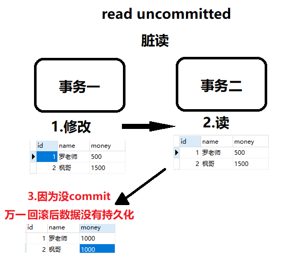

# 0 前言

背Java面试题确实需要一定的时间和精力，但是可以通过一些记忆技巧来提高效率，以下是一些可能有用的技巧：

1. **理解原理**。Java面试题通常涉及到Java语言的底层实现原理以及常用的设计模式等，理解原理可以帮助你记忆和理解相关的概念和知识点。

2. 将知识点分类整理总结、总结成自己的东西。将Java面试题中的知识点按照功能、特性、应用场景等分类整理，可以帮助你更好地理解和记忆相关的知识点。

3. 创造关联。将Java面试题中的知识点==与实际应用场景、项目经验等进行关联==，可以帮助你更好地记忆和理解相关的知识点。

4. 建立连接。将Java面试题中的知识点与其他学科或者技术进行关联，可以帮助你更好地理解和记忆相关的知识点，同时也可以帮助你拓展相关的知识面。

5. 多做练习。通过多做Java面试题的练习，可以帮助你更好地理解和记忆相关的知识点，并且可以提高解题能力和应变能力。

总之，背Java面试题需要一定的时间和耐心，建议采用多种方法和技巧相结合，逐步提高记忆和理解能力。同时也需要不断学习和实践，不断提高自己的技术水平和解决问题的能力。


# 1 java基础

## 1.1 面向对象

### 1.1.1 面向对象与面向过程 

| 两种     | 具体区别                                     |
| -------- | -------------------------------------------- |
| 面向过程 | 更加注重于每一个步骤以及顺序                 |
| 面向对象 | 更加注重事情有哪些参与者，以及各自需要做什么 |

### 1.1.2 面向对象的三大特性

* **封装**：封装注重一个安全性，内部细节只有自己知道，外部调用无需关心内部实现
* **继承**：继承使代码复用更加便利。子类共性的方法直接使用父类的，而不需要自己再定义，只需扩展自己个性化的
* **多态**：同一个父类引用，根据具体子类/实现类的不同，外部对一个方法的调用，实际执行的逻辑不同。多态的三个前提：继承关系、有方法重写、父类引用指向子类对象。


## 1.2 JDK JRE JVM

* JDK=JRE+java开发工具
* JRE=JVM+java核心类库


## 1.3 ==/equals/hashCode

### 1.3.1 == 和 equals

* == 对比的栈中的值，栈中基本数据类型是变量值，引用类型是堆中内存对象的地址

* equals比较的是两个具体值的内容


### 1.3.2 equals和hashCode

* 两个对象如果equals相等的情况下，hashCode也一定是相等的；hashCode相等时，这两个对象不一定是equals相等的（反之则不一定）


## 1.4 final

* 修饰类：不可被继承
* 修饰方法：不可被重写
* 修饰变量：不可被后续修改


## 1.5 String、StringBuffer、StringBuilder

* String是用final修饰的，对String的每次操作都会产生新的对象
* StringBuffer和StringBuilder都是在原对象上进行操作的
* StringBuffer是线程安全的，它的方法都是用synchronized修饰的；StringBuilder是线程不安全的
* 性能上 ：StringBuilder>StringBuffer>String


## 1.6 重载和重写的区别

* 重载：重载发生在同一个类中，方法名必须相同，参数的个数、类型、顺序都可以不同，方法的返回值和访问修饰符也都可以不同。
* 重写：发生在父子类中，方法名必须相同，参数列表必须相同。返回值的范围小于等于父类，抛出的异常的范围小于等于父类，访问修饰符的范围大于等于父类。


## 1.7 接口和抽象类的区别

* 成员方法上： 接口中只能有抽象方法，而抽象类可以有普通成员方法。
* 成员变量上： 接口中只能有public static final修饰的成员变量，而抽象类中可以是各种类型的
* 设计目的上：
  * 接口的设计目的是对类的行为进行约束
  * 抽象类的设计目的是代码复用
* 本质上：
  * 接口的本质是对行为的抽象，表达的是like a的关系
  * 抽象类的本质是是对类本质的抽象，表达的是is a的关系


## 1.8 什么是字节码？采用字节码的好处是什么？

* 在java中，字节码就是供虚拟机理解的代码。就是扩展名为.class的文件

```
java源代码-》编译器-》字节码-》jvm-》解释器-》二进制机器码-》运行
```

* 好处：
  * 解决传统解释型语言执行效率低的问题
  * 可移植性强，不挑系统，无需编译即可在不同类型的系统上运行


## 1.9 java四种引用类型

* 强引用：Java中最常见的引用。将对象赋给一个引用变量，这个引用变量就是一个强引用。最主要的特点就是不会被jvm的垃圾回收机制回收。因此强引用也是造成内存泄露的元凶之一。
* 软引用：软引用用SoftReference类来实现。jvm内存足够时它不会被回收，jvm内存不足时它会被回收。通常存在于对内存敏感的程序中。
* 弱引用：弱引用用WeakReference类来实现。只要垃圾回收机制运行，不管jvm的内存是否足够，它都会被回收。
* 虚引用：虚引用用PhantomReference类来实现。虚引用的主要作用是跟踪对象被垃圾回收的状态。


## 1.10 使用泛型的好处

* 避免了类型转换的麻烦，存储的是什么类型，取出的就是什么类型
* 将运行时异常提前到了编译时


## 1.11 浅拷贝和深拷贝的区别

* 浅拷贝：浅拷贝只是将原对象的引用赋给了新对象。原对象的改变会对新对象产生影响
* 深拷贝：创建一个新的对象，将原对象的各项属性全部拷贝给新对象。这时，原对象的改变不会影响新对象。


## 1.12 try...catch...finally,try里有return，finally还执行吗？

* 不管有没有异常，finally块中的代码都会执行。
* try/catch中有return时，finally中的代码仍会执行。方法的返回值是在finally执行前确认的

### 1.12.1 finally代码块和finalize()方法有什么区别？


## 1.13 Exception和Error包结构

* Throwable
  * Exception
    * RunTimeException
    * ...
  * Error

## 1.14 Java IO和NIO的区别

* NIO即 New IO。JDK1.4后引入。NIO与IO有着相同的作用和目的，但实现方式不同，NIO主要用到的是块，所以NIO的效率要比IO高很多。


## 1.15 Object有哪些常用方法？大致说一下每个方法的含义

* toString：转换成字符串，一般会重写
* hashCode：获取对象的哈希值，一般会重写
* equals：比较两个对象引用的虚地址，一般会重写
* getClass：获取类的大Class对象
* ...


## 1.16 throw 和 throws 的区别

* 位置不同
  * throws 用在方法签名上，后面跟的是异常类，可以跟多个；而 throw 用在方法内，后面跟的是异常对象。 

* 功能不同 
  * throws 表示出现异常的一种可能性，并不一定会发生这些异常；执行 throw 则一定抛出了某个异常对象。 
  * 两者都是消极处理异常的方式，只是抛出或者可能抛出异常，但是不会去处理异常，真正的处理异常由上层处理。

## 1.17 访问修饰符public,private,protected 以及不写的区别？

|                    | 同一个类中 | 同一个包中 | 不同包的子类 | 不同包的无关类 |
| ------------------ | ---------- | ---------- | ------------ | -------------- |
| **public**         | ✔          | ✔          | ✔            | ✔              |
| **protected**      | ✔          | ✔          | ✔            |                |
| **无（空着不写）** | ✔          | ✔          |              |                |
| **private**        | ✔          |            |              |                |

## 1.18 一个".java"源文件中是否可以包含多个类（不是内部类），有什么限制？

* 可以有多个类，但只能有一个public的类，并且public的类名必须与文件的主文件名相同。


## 1.19 Cookie和Session？


# 2 反射专题

## 2.1 java反射的作用原理

* 在运行时，对于任意一个类，都能够知道这个类所有的属性和方法；对于任意个对象，都能调用它的任意个方法。
* java中，只要给定类的名字，就可以通过反射机制来获得类的所有信息。 

```
反射是框架技术的一大功臣
```


## 2.2 获取一个类的大Class对象的方式有哪些

* Class.forName("类的全路径")
* 类名.class
* 对象名.getClass()


## 2.3 反射机制的优缺点

* 优点
  * 动态性：能够运行时动态获取类的实例，灵活
  * 扩展性：在运行时动态地扩展功能，获取类信息。不需要在编译时就获取。是框架技术的一大功臣。
* 缺点
  * 性能较低，需要解析字节码，解析内存中的对象。
  * 相对不安全，破坏了封装性。


## 2.4 如何提高反射效率？

Java中的反射机制可以在运行时动态地获取类的信息并操作类的属性和方法。虽然反射机制非常灵活强大，但是由于需要在运行时进行类型检查和方法调用等操作，因此反射的效率通常较低。以下是一些提高Java反射效率的方法：

1. **缓存反射信息**：使用反射时，可以将反射信息缓存起来，以避免重复获取信息的开销。例如，可以使用一个 `HashMap` 对象来缓存已经反射过的类的信息。

2. **使用 `Class.newInstance()` 代替 `Constructor.newInstance()`**：在创建对象时，可以使用 `Class.newInstance()` 方法代替 `Constructor.newInstance()` 方法，因为前者的效率更高。例如，可以使用以下代码来创建一个对象：

   ````
   MyClass obj = MyClass.class.newInstance();
   ```

3. **使用 `Method.invoke()` 代替 `Method.invoke(Object, Object[])`**：在调用方法时，如果不需要传递参数，可以使用 `Method.invoke()` 方法代替 `Method.invoke(Object, Object[])` 方法，因为前者的效率更高。例如，可以使用以下代码来调用一个无参方法：

   ````
   Method method = obj.getClass().getMethod("myMethod");
   method.invoke(obj);
   ```

4. **使用 `Field.setAccessible(true)`**：在访问私有属性时，可以使用 `Field.setAccessible(true)` 方法来设置属性的访问权限为可访问，以提高访问效率。例如，可以使用以下代码来访问一个私有属性：

   ````
   Field field = obj.getClass().getDeclaredField("myField");
   field.setAccessible(true);
   Object value = field.get(obj);
   ```

需要注意的是，虽然上述方法可以提高反射效率，但是在使用反射时仍然需要谨慎，因为反射可能会破坏类的封装性和安全性。在设计程序时，应该尽量避免使用反射，除非没有其他更好的替代方法。

### 2.4.1 具体说说缓存反射信息

缓存反射信息是提高Java反射效率的一种方法，可以避免重复获取反射信息的开销。具体来说，可以使用一个 `HashMap` 对象来缓存已经反射过的类的信息。以下是一个示例代码：

```java
import java.lang.reflect.Field;
import java.util.HashMap;
import java.util.Map;

public class ReflectionCache {
    // 使用一个 HashMap 对象来缓存反射信息
    private static Map<Class<?>, Map<String, Field>> fieldCache = new HashMap<>();

    public static Field getField(Class<?> clazz, String fieldName) throws NoSuchFieldException {
        // 先从缓存中获取反射信息
        Map<String, Field> fieldMap = fieldCache.get(clazz);
        if (fieldMap == null) {
            // 如果缓存中不存在该类的反射信息，则创建一个新的 HashMap 对象并加入缓存
            fieldMap = new HashMap<>();
            fieldCache.put(clazz, fieldMap);
        }
        // 再从缓存中获取指定属性的反射信息
        Field field = fieldMap.get(fieldName);
        if (field == null) {
            // 如果缓存中不存在该属性的反射信息，则通过反射获取，并加入缓存
            field = clazz.getDeclaredField(fieldName);
            field.setAccessible(true);
            fieldMap.put(fieldName, field);
        }
        return field;
    }
}
```

上述代码中，`ReflectionCache` 类定义了一个 `fieldCache` 静态变量，它是一个 `HashMap` 对象，用于缓存已经反射过的类的信息。`getField()` 方法接受一个 `Class` 对象和一个属性名，返回指定类的指定属性的反射信息。

在 `getField()` 方法中，首先从 `fieldCache` 中获取指定类的反射信息，如果缓存中不存在，则创建一个新的 `HashMap` 对象并加入缓存。然后再从缓存中获取指定属性的反射信息，如果缓存中不存在，则通过反射获取，并加入缓存。

使用上述代码可以提高反射效率，因为反射信息只需要获取一次，并且被缓存起来，避免了重复获取的开销。

# 3 多线程并发专题


## 3.1 线程的生命周期？线程有几种状态

* 在线程的生命周期中，它要经过新生态、就绪态、运行态、阻塞态、死亡态五种状态。
* CPU会在多条线程之间切换，于是线程状态也会在运行、就绪之间切换。


## 3.2 sleep/wait/join/yield辨析

### 3.2.1 sleep和wait

* sleep是Thread类的静态方法，wait是Object类的方法
* sleep不会释放锁，而wait会释放
* sleep不依赖synchronized，但是wait需要。
* sleep不需要被唤醒，休眠结束后就会退出阻塞；但是wait需要被notify
* sleep一般用于当前线程休眠；wait则用于多线程间的通信
* //sleep让出CPU执行时间；wait不一定。


### 3.2.2 yield

* yield执行后线程直接进入就绪状态，马上释放cpu的执行权。


### 3.2.3 join

* 联合线程阻塞，join执行后线程进入阻塞状态。例如线程A调用线程B的join，那么线程A会进入阻塞状态，直到线程B死亡


## 3.2 对线程安全的理解

* 线程安全实质上是内存安全，堆是共享内存，可以被所有线程访问。
* 当多个线程访问一个对象时，调用这个对象的行为都能得到正确的结果，我们就说这个对象是线程安全的。


## 3.3 继承Thread实现Runnable的区别

* 二者本身就没有本质区别，就是接口和类的区别。

* Thread和Runnable本质上是实现关系。
* 用法上，如果有复杂的线程操作需求，那就选择继承Thread；如果只是简单的执行一个任务，那就实现Runnable


## 3.4 对守护线程的理解

* 守护线程： 为所有非守护线程提供服务的线程；当jvm中没有一个正在运行的非守护线程时，jvm会退出，换句话说，守护线程可以自动结束自己的生命周期。
* 守护线程经常被用来执行一些后台任务，所以也叫后台线程。


## 3.5 ThreadLocal原理和使用场景

* 每个Thread都有一个ThreadLocalMap类型的成员变量threadLocals。ThreadLocalMap和Map一样由一个个Entry键值对组成，Entry的键是ThreadLocal对象，值是Object。并且当没指向它的强引用时，就会被垃圾回收器回收。
* 当实行set方法时，ThreadLocal首先会获取当前Thread对象，然后获取当前线程的ThreadLocalMap对象。再以ThreadLocal为key，将值存进ThreadLocalMap中。get方法同理。
* 好处：
  * 避免直接传递参数带来的代码耦合问题。
  * 由于每一条线程均含有各自私有的ThreadLocalMap容器，这些容器相互独立互不影响，因此不存在线程安全性问题。
* 使用场景：
  * 在进行对象跨层传递时，使用ThreadLocal避免多次传递，解除层级间的耦合
  * 线程间的数据隔离
  * 进行事务操作，存储线程事务信息
  * 数据库连接，Session会话管理

## 3.6 并发/并行/串行

* 串行在时间上不可能重叠，前一个任务没搞定，下一个任务就只能等着
* 并行在时间上是重叠的，两个任务在**同一时刻互不干扰**同时执行

* 并发允许两个任务彼此干扰，同一时间点只有一个任务运行，交替执行

## 3.7 并发的三大特性

* 原子性：要么全部执行，要么全部不执行
* 可见性：多个线程访问一个变量时，只要一个线程修改了这个变量的值，其他线程能够立即看到修改的值
* 有序性：虚拟机不一定会按照我们写的代码的顺序来执行，有可能将他们重排序优化。实际上，有些代码重排序后虽然对变量的值不会造成影响，但有可能会出现线程安全问题。


## 3.8 volatile

* volatile修饰的共享变量对所有线程总是可见的。（保证可见性）
* volatile禁止指令重排序优化。（保证有序性）


## 3.9 线程池

### 3.9.1 为什么用线程池？

* 降低资源消耗：提高线程利用率，降低创建与销毁线程的消耗
* 提高响应速度：任务来了直接有线程可用可执行，而不是创建线程在执行
* 提高线程的可管理性：线程是稀缺资源，使用线程池可以统一分配调优监控


### 3.9.2 解释下线程池参数？线程池参数怎么设计？

* corePoolSize：核心线程数
* maxinumPoolSize：最大线程数
* keepAliveTime/unit：空闲线程最大存活时间/该时间的单位
* workQueue：任务队列（又叫阻塞队列）
* ThreadFactory：创建线程工厂
* Handler：任务的拒绝策略

* 核心线程数：如果任务是 CPU 密集型，即计算任务比较多，可以设置线程数为核心数+1，这样可以让 CPU 资源得到充分利用。如果任务是 IO 密集型，即网络请求比较多，可以根据实际情况设置线程数，一般可以设置为 2 * 核心数。

  最大线程数：最大线程数一般设置为 2 * 核心线程数，可以根据实际情况调整。

  阻塞队列大小：如果任务是 CPU 密集型，即计算任务比较多，可以将队列大小设置为 0 或者 1，这样可以让线程池及时处理任务，避免任务堆积。如果任务是 IO 密集型，即网络请求比较多，可以设置队列大小为 2 * 核心线程数，这样可以缓存一些请求，避免线程池因为等待 IO 密集型任务而阻塞。


### 3.9.3 简述线程池的处理流程/线程池中阻塞队列/任务队列的作用？为什么是先添加队列而不是先创建最大线程？

* 核心线程是否已接满任务？
  * 没满？核心线程接任务执行
  * 满了？判断任务队列是否已满？
    * 没满？把任务放到任务队列中
    * 满了？判断最大线程数是否达到？
      * 没有达到。创建临时线程执行
      * 达到了。根据拒绝策略拒绝。

* 就好比一个企业里面有10个正式工（核心线程core）的名额，最多招10个正式工，要是任务大于正式工人数的情况（task>core）下，工厂领导（线程池）不是首先扩招外包工，任务可以积压一下，先放到队列中去（代价低）。十个正式工慢慢干，迟早会干完的，要是任务还是在继续增加，超过正式工的加班忍耐极限了（队列满了），就得招外包帮忙了（外包是临时的，也就是最大-核心的部分），要是正式工加上外包还是不能完成任务，新来的任务就会被领导拒绝了（线程池的拒绝策略）

### 3.9.4 线程穿透

* 线程穿透（Thread Penetration）是指在高并发场景下，大量的请求同时涌入，导致线程池中的线程数瞬间达到上限，而后续的请求因为无法获得线程而被直接拒绝，从而导致请求失败的现象。线程穿透会对系统的稳定性造成影响，因为请求失败会导致用户体验变差，甚至会导致系统的崩溃。

### 3.9.5 线程池中线程复用原理

* 线程池将线程和任务解耦。摆脱了Thread创建线程时的一个线程必须对应一个任务的限制。
* 在线程池中，同一个线程可以从阻塞队列中不断获取新任务来执行，其核心原理在于线程池对Thread进行了封装，并不是每次执行任务都会调用Thread.start()来创建新线程，而是让每个线程去执行一个“循环任务”，“循环任务”会不停的去检查是否有任务需要被执行，如果有就直接执行任务中的run方法，把run方法当成普通的任务去执行，这样只使用固定的线程就将所有任务的run方法串联起来。


## 3.10 线程、程序、进程的基本概念以及他们间的关系

* 程序=代码+数据。
* 进程是程序的一次执行过程，是系统运行程序的基本单位，因此进程是动态的。
* 一个进程可以包含多个线程。


## 3.11 Java中实现多线程的几种方法

* 继承Thread类
* 实现Runnable接口
* 使用线程池


## 3.12 如何停止一个正在运行的线程

- 自定义中断标识符，停止线程。
- 使用 interrupt 停止线程。
- 使用 stop 停止线程。

## 3.13 Thread类中的start()和run()法有什么区别？

* start()方法被用来启动新创建的线程，start()内部调用了run()方法。
* 直接调用run()方法就是在当前线程中调用了一次run()方法。


## 3.14 锁

### 3.14.1 线程同步

* 比如多个线程都在操作同一数据，都打算修改商品库存，这样就会导致数据不一致的问题。

  线程同步的真实意思，其实是==“排队”==：几个线程之间要排队，一个一个对共享资源进行操作，而不是同时进行操作。

  所以我们用同步机制来解决这些问题，加入同步锁以避免在该线程没有完成操作之前，被其他线程的调用，从而保证了该变量的唯一性和准确性。

### 3.14.2 线程同步的几种方式


### 3.14.3 synchronized 

* 它可以把任意一个非 NULL 的对象当作锁。他属于独占式的悲观锁，同时属于可重入锁。
* 这种方式比较灵活，可以修饰一个方法，也可以修饰一个代码块。


### 3.14.4 ReentrantLock

*  ReentrantLock类是可重入、互斥、实现了Lock接口的悲观锁，它与使用synchronized方法具有相同的基本行为和语义，并且扩展了其能力。

### 3.14.5 synchronized 与 ReentrantLock的对比

* [ReentrantLock](https://mikechen.cc/759.html)是显式锁，手动开启和关闭锁，别忘记关闭锁；

* [synchronized](https://mikechen.cc/618.html) 是隐式锁，出了作用域自动释放;

* [ReentrantLock](https://mikechen.cc/759.html)只有代码块锁,[synchronized](https://mikechen.cc/618.html) 有代码块锁和方法锁;

* 使用 [ReentrantLock](https://mikechen.cc/759.html)锁，JVM 将花费较少的时间来调度线程，线程更好,并且具有更好的扩展性（提供更多的子类）;

**优先使用顺序：**

[ReentrantLock](https://mikechen.cc/759.html)> [synchronized](https://mikechen.cc/618.html) 同步代码块> [synchronized](https://mikechen.cc/618.html) 同步方法


### 3.14.6 悲观锁/乐观锁

* 悲观锁：假设会发生并发冲突，每次去访问数据的时候都认为别人会修改，每次访问数据的时候就把事务锁起来，直到提交事务。实现：悲观锁的实现方式包括数据库中的排它锁（X锁）和共享锁（S锁），以及Java中的synchronized关键字和ReentrantLock等锁机制。
* 乐观锁：假设不会发生并发冲突，每次去访问数据的时候都认为别人不会修改，所以不会上锁，只在提交时检查数据是否发生过更改。实现：版本号（或时间戳）机制配合CAS（Compare And Swap / 自旋锁）算法实现

```
虽然悲观锁能有效保证数据执行的顺序性和一致性，但在高并发场景下并不适用，试想，如果一个事务用悲观锁对数据加锁之后，其他事务将不能对加锁的数据进行除了查询以外的所有操作，如果该事务执行时间很长，那么其他事务将一直等待，这无疑会降低系统的吞吐量。

这种情况下，我们可以有更好的选择，那就是乐观锁。
```


### 3.14.7 CAS机制（自旋锁）


* CAS的全称是Compare-and-Swap，也就是比较并交换，它包含了三个参数：V，A，B，V表示要读写的内存位置，A表示旧的预期值，B表示新值

* 具体的机制是，当执行CAS指令的时候，只有当V的值等于预期值A时，才会把V的值改为B，如果V和A不同，有可能是其他的线程修改了，这个时候，执行CAS的线程就会不断的循环重试，直到能成功更新为止。

* 缺点：

  * 如果C的结果一直跟预期的结果不一样的话，线程A就会一直不断的循环重试，重试次数太多的话对CPU也是一笔不小的开销。
  * 而且，CAS的操作范围也比较局限，只能保证一个共享变量的原子操作，如果需要一段代码块的原子性的话，就只能通过Synchronized等工具来实现了
  * **ABA问题**：就是如果V的值一开始为A，在准备修改为新值前的期间曾经被改成了B，后来又被改回为A，经过两次的线程修改对象的值还是旧值，那么CAS操作就会误任务该变量从来没被修改过，这就是CAS中的“ABA”问题。怎么解决？：**版本号机制**

  


# 4 集合

## 4.1 List（有序，可重复）

### 4.1.1 ArrayList

* 最常用的List实现
* 本质是数组
* 适合随机查找和遍历，不适合插入和删除。

### 4.1.2 LinkedList

* 本质是链表

* 适合数据的动态插入和删除，随机访问和遍历速度比较慢。


## 4.2 Set（无序，不可重复）


## 4.3 Map

### 4.3.1 HashMap（数组+链表+红黑树）

* 最常用的Map实现
* 

* 大方向上，HashMap 里面是一个数组，然后数组中每个元素是一个单向链表。上图中，每个绿色 的实体是嵌套类 Entry 的实例，Entry 包含四个属性：key, value, hash 值和用于单向链表的 next。
* 在 Java8 中，当链表中的元素超过了 8 个以 后， 会将链表转换为红黑树，在这些位置进行查找的时候可以降低时间复杂度为 O(logN)。


### 4.3.2 细说HashMap的put方法的底层？


### 4.3.3 HashMap是怎么解决Hash冲突的？

* Hash冲突的原因：数据是通过Hash算法哈希到指定范围的桶中，不同的数据可能会有相同的Hash值，就会放到HashMap的同一个桶中，导致哈希冲突。
* HashMap是通过链式寻址法（拉链法）的方式来解决哈希冲突的。


### 4.3.4 HashMap的扩容机制？


# 5 MySQL

## 5.1 数据库的三大范式

* 第一范式：列不可再分
* 第二范式：一张表只表达一层含义
* 第三范式：表中的每一列和主键都是直接依赖

范式越高，数据库越规范，但是数据库性能越差，要做到平衡，必须具体情况具体分析


### 5.1.2 范式化设计优缺点

* 优点: 可以尽量得减少数据冗余， 使得更新快， 体积小 

* 缺点: 对于查询需要多个表进行关联，效率差， 更难进行索引优化

### 5.1.3 反范式化优缺点

* 优点: 可以减少表的关联， 可以更好得进行索引优化 
* 缺点: 数据冗余以及数据异常， 数据的修改需要更多的成本


## 5.2 一个查询语句是怎么执行的？


## 5.3 SQL的几种连接查询方式

* 内连接（inner join） 典型的联接运算；包括相等联接和自然联接。 查出的是两张表的交集，两张表都有的才查出来 
* 左外连接（left join） 以左表为主表（查询全部）， 右表为辅表（没有的显示null） 
* 右外连接（right join） 以右表为主表（查询全部）， 左表为辅表（没有的显示null） 


## 5.4 MySQL的三种log

### 5.4.1 redo log和bin log的区别？

* redo log 是 InnoDB 引擎特有的；bin log 是 MySQL 的 Server 层实现的，所有引擎都可以使用。 
* redo log 是物理日志，记录的是“在某个数据页上做了什么修改”；bin log 是逻辑日志，记录的是这个语句的原始逻辑，比如“给 ID=2 这一行的 c 字段加 1 ” 
* redo log 是循环写的，空间固定会用完；bin log 是可以追加写的。“追加写”是指 binlog 文件写到一定大小后会切换到下一个，并不会覆盖以前的日志。 
* redo log是用来保障已提交事务的ACID特性；bin log大多用于主从复制和数据恢复。


### 5.4.2 undo log的概念和作用

* undo log是mysql中比较重要的事务日志之一，顾名思义，undo log是一种用于回退rollback的日志， 在事务没提交之前，MySQL会先记录更新前的数据到 undo log日志文件里面，当事务回滚时或者数据库崩溃时，可以利用 undo log来进行回退。

* undo log的作用 

  * 提供回滚操作【undo log实现事务的原子性】 

    我们在进行数据更新操作的时候，不仅会记录redo log，还会记录undo log，如果因为某些原因导致事务回滚，那么这个时候MySQL就要执行回滚（rollback）操作，利用undo log将数据恢复到 事务开始之前的状态。

  * 提供多版本控制(MVCC)【undo log实现多版本并发控制（MVCC）】 MVCC，即多版本控制。

    在MySQL数据库InnoDB存储引擎中，用undo Log来实现多版本并发控制 (MVCC)。当读取的某一行被其他事务锁定时，它可以从undo log中分析出该行记录以前的数据版 本是怎样的，从而让用户能够读取到当前事务操作之前的数据【快照读】。


## 5.5 什么是行溢出？

* MySQL 的行溢出是指当一行数据的大小超过了存储引擎规定的最大值时，存储引擎会将该行数据的部分内容存储在另外一个地方，称为行溢出。


## 5.6 存储引擎相关

### 5.6.1 MySQL支持哪些存储引擎？ 

* Innodb 
* MyIsam 
* ...


### 5.6.2 InnoDB 底层存储结构，它的特点？

* B+树

* 非叶节点只有键值（索引），叶节点包含行数据。
* 叶节点之间用双向链表，便于范围查询


### 5.6.3 Innodb和MyIsam的区别？

* Innodb支持事务、外键、mvcc，myisam不支持；
* innodb支持表锁、行锁、间隙锁等；myisam只支持表锁 
* innodb表必须有主键，即使没有的话，innodb也会以rowid做为主键；myisam可以没主键


### 5.6.4 为什么MyIsam读效率高于Innodb？

* innodb支持事务，所以会有一个mvcc的比较过程。
* innodb支持行锁，在检查锁的时候不仅要检查表锁，还要看行锁。

* 查询的时候，如果走了索引的话，innodb是聚簇索引，会有一个回表过程，即：先去非聚簇索引树中查询数据，找到数据对应的key后，再通过key回表到聚簇索引树找到最终的数据。而myisam直接就是非聚簇索引，查询的时候查到的最后结果不是聚簇索引树的key，而是磁盘地址，所以直接回查询磁盘的完整数据，无需回表。


## 5.7 事务相关

### 5.7.1 事务的四大特性

* 原子性 A : 要么全部成功，要么全部失败
* 一致性 C：一致性是指事务必须使数据库从一个一致性状态变换到另一个一致性状态
* 隔离性 I：多个客户端操作时 ,各个客户端的事务之间应该是隔离的，相互独立的 , 不受影响的。
* 持久性 D：一个事务处理结束后，其对数据库的修改就是永久性的，即使宕机了，数据也不会丢 失。


### 5.7.2 事务四种隔离级别/脏读/不可重复读/幻读

| 隔离级别         | 中文名   | 脏读 | 不可重复读 | 幻读 | 常见数据库默认隔离级别 |
| ---------------- | -------- | ---- | ---------- | ---- | ---------------------- |
| read uncommitted | 读未提交 | 是   | 是         | 是   |                        |
| read commited    | 读已提交 | 否   | 是         | 是   | Oracle / SQL Server    |
| repeatable read  | 可重复读 | 否   | 否         | 是   | MySQL                  |
| serializable     | 串行化   | 否   | 否         | 否   |                        |

* 可能引发的问题

| 问题       | 现象                                                         | 解决方法                    |
| ---------- | ------------------------------------------------------------ | --------------------------- |
| 脏读       | 一个事务处理过程中读到了另一个未提交的事务中的数据           | 隔离级别改为read commited   |
| 不可重复读 | 一个事务处理过程中读到了另一个事务中修改并已提交的数据       | 隔离级别改为repeatable read |
| 幻读       | 一个事务在前后两次查询同一个范围的时候，后一次查询看到了前一次查询没有看到的行。 | 隔离级别改为serializable    |




### 5.7.3 什么是mvcc？原理是什么？

* 多版本并发控制。用于实现 读已提交 和 可重复读 这两种隔离级别。==主要原理是undo log==
* DATA_TRX_ID 和 DATA_ROLL_PTR
* 在 RU 读未提交隔离级别下，直接读取版本的最新记录就 OK不需要MVCC，对于 SERIALIZABLE 串行化隔离级别，则是通过加锁互斥来访问数据，因此也不需要 MVCC 的帮助。因此 MVCC 运行在 RC读已提交 和 RR可重复读 这两个隔离级别下，当 InnoDB 隔离级别设置为二者其一时，在 SELECT 数据时就会用到mvcc版本链。
* 在  RC 读已提交 隔离级别下，每个 SELECT 语句开始时，都会重新将当前系统中的所有的活跃事务拷贝到一个列表生成 ReadView。（当前读）
* 在  RR 可重复读 隔离级别下，每个事务首次读时，会将当前系统中的所有的活跃事务拷贝到一个列表生成 ReadView。（快照读）
* 二者的区别就在于生成 ReadView 的时间点不同，RC读已提交是事务中每条 SELECT 语句开始；RR可重复读是事务之后第一个 SELECT 语句开始。


### 5.7.4 mysql的事务在java代码中如何实现？


## 5.8 锁

### 5.8.1 MySQL的锁

* 当数据库有并发事务的时候，可能会产生数据的不一致，这时候需要一些机制来保证访问的次序， 锁机制就是这样的一个机制。


### 5.8.2 乐观锁与悲观锁以及它们的实现方式

* 悲观锁：假设会发生并发冲突，每次去访问数据的时候都认为别人会修改，每次访问数据的时候就把事务锁起来，直到提交事务。实现：悲观锁的实现方式包括数据库中的排它锁（X锁）和共享锁（S锁），以及Java中的synchronized关键字和ReentrantLock等锁机制。
* 乐观锁：假设不会发生并发冲突，每次去访问数据的时候都认为别人不会修改，所以不会上锁，在修改数据的时候才把事务锁起来。实现：版本号（或时间戳）机制或CAS（Compare And Swap / 自旋锁）算法实现


### 5.8.3 共享锁与排他锁

* **共享锁** share lock 又称读锁 read lock，简称S锁，是读取操作创建的锁。
  * 其他用户可以并发读取数据，但任何事务都不能对数据进行修改，直到已释放所有共享锁。 如果事务T对数据A加上共享锁后，则其他事务只能对A再加共享锁，不能加排他锁。获得共享锁的事务只能读数据，不能修改数据
* **排他锁** exclusive lock 又称写锁 writer lock，简称X锁。 
  * 若事务T对数据A加上排他锁，则只允许事务T读取和修改数据A，其他任何事务都不能再对A加任何类型的锁，直到事务T释放X锁。排他锁会阻塞所有的排他锁和共享锁


### 5.8.4 什么是死锁？

* 死锁是指两个或多个事务在同一资源上相互占用，并请求锁定对方的资源，从而导致恶性循环的现象。 


### 5.8.5 怎么解决死锁？

* 等待事务超时，回滚某条事务。 
* 进行死锁检查，主动回滚某条事务，让别的事务能继续走下去。


### 5.8.6 怎么避免死锁？

* 不同事务约定以相同的顺序访问表，可以大大降低死锁概率。 
*  对于非常容易产生死锁的业务部分，可以尝试使用升级锁定颗粒度，通过表级锁定来减少死锁产生的概率。


## 5.9 索引

### 5.9.1 何为索引？有什么作用？

* 索引是一种用于快速查询数据的数据结构。常见的索引结构有: B树， B+树和Hash。起到一个目录的作用。


### 5.9.2 索引有哪些优缺点？

* 优点
  * 可以大大加快数据的查询的速度。
  * 通过使用索引，可以在查询的过程中，使用优化器，提高系统的性能。
* 缺点
  * 时间方面：创建索引和维护索引要耗费时间；会降低增/删/改的执行效率；
  * 空间方面：索引需要占物理空间。

 

### 5.9.3 索引有哪几种类型？

* **主键索引**：InnoDB存储引擎默认给我们创建的一套索引结构，我们表里的数据也是直接放在主键索引里，作为叶子节点的数据页。

* **唯一索引**：数据列不允许重复，允许为NULL值，一个表允许多个列创建唯一索引。 
  * 可以通过 ALTER TABLE table_name ADD UNIQUE (column); 创建唯一索引 
  * 可以通过 ALTER TABLE table_name ADD UNIQUE (column1,column2); 创建唯一组合索引
* **普通索引**：基本的索引类型，没有唯一性的限制，允许为NULL值，一个表允许多个列创建普通索引。
* **覆盖索引**：select的字段正好是索引字段，这时候不需要回表操作

* **组合索引/联合索引**：多个列值组成一个索引，使用的时候要遵循最左匹配原则


### 5.9.4 为什么用B+树而不是B树？

* **B+树非叶子节点只保存键，不保存数据，比B树更节省空间**，一个数据页就能保存更多的键，单表2kw条数据通常只需要三次磁盘IO。
* B+树索引的所有数据均存储在叶子节点，而且数据是按照顺序排列的，双向链表连着的，范围查询更快。
* B+树的查询效率更加稳定。任何关键字的查找都必须走一条从根节点到叶节点的路，所有关键字的查找路径长度相同，导致每一个关键字的查询效率相当。


### 5.9.5 列举一些导致索引失效的场景

==6个点==

* **在索引列上做任何操作（无论复合索引还是普通索引等）**
  计算、函数、隐式类型转换等会导致索引失效而转向全表扫描。

```mysql
EXPLAIN SELECT * from employee WHERE trim(name) = '鲁班'
```

* **没满足复合索引中的最左前缀法则**

给 name、dep_id、age 这三个字段建立一个复合索引

```mysql
-- 创建复合索引
ALTER TABLE employee ADD INDEX `idx_name_dep_age`(`name`, `dep_id`, `age`) USING BTREE;
1、跳过索引中的第一列，直接导致索引失效
EXPLAIN SELECT * from employee WHERE dep_id = 1
2、跳过索引中的前2列，索引直接失效
EXPLAIN SELECT * from employee WHERE age = 10
3、跳过索引中的中间索引列，则只有第1列生效
EXPLAIN SELECT * from employee WHERE name = '鲁班' AND age = 10
4、复合索引中的使用顺序可以乱,mysql执行过程中会走优化器
EXPLAIN SELECT * from employee WHERE name = '鲁班' AND age = 10 AND dep_id = 1
```

* **复合索引中的范围条件右边的索引列失效**

```mysql
EXPLAIN  SELECT * FROM employee WHERE name = '鲁班' AND dep_id > 1 AND age = 10;
```

* **使用不等于(!=或<>)的时候无法使用索引会导致全表扫描（无论复合索引还是普通索引等）**

```mysql
EXPLAIN  SELECT * FROM employee WHERE name <> '鲁班'
```

* **like以通配符开头(%字符)会导致索引失效变成全表扫描**

````mysql
EXPLAIN  SELECT * FROM employee WHERE name LIKE '%鲁'
like %开头的字符会导致索引失效，为什么？ 因为mysql看到 like %开头的语句 不知道到底要查什么，所以当然会选择放弃使用索引，直接走全表扫描了。
````

* **字段类型是字符串 如果不加引号会导致索引失效**

```mysql
EXPLAIN  SELECT * FROM employee WHERE name = 200
```


```
全值匹配我最爱，最左前缀要遵守；

带头大哥不能灭，中间兄弟不能断；

索引列上少计算，范围之后全失效；

LIKE百分写最右，覆盖索引不写星；

不等空值还有or，索引失效要少用；

VAR引号不可丢，SQL高级也不难！
```


### 5.9.7 聚簇索引/非聚簇索引

* **聚簇索引**：叶节点就是包含全部数据的数据节点。所以不需要回表。innodb中主键id就是聚簇索引，一个表有且仅有一个聚簇索引。 
* **非聚簇索引**（二级索引）：叶节点仍然是索引节点，只不过有一个指针指向对应的数据块。要想更多的数据需要回表查，可以有多个非聚簇索引。


### 5.9.8 创建索引有什么原则呢（适合/不适合哪些场景）？ 

* 最左匹配 
* 频繁作为查询条件的字段 
* 优先考虑索引组合，而不是每次都新建索引
* 索引列不能参与计算和使用一些函数 
* 频繁更新的列不适合 （库存）
* 区分度低/重复出现很多的列不适合 （男/女）

```
此条原因： 非聚簇索引存储了对主键的引用，如果select字段不在非聚簇索引内，就需要回表查询，跳到主键索引（上图中从右边的索引树跳到左边的索引树），再获取select字段值
如果非聚簇索引值重复率高，那么查询时就会大量出现回表，导致整个流程很慢
```

* 大数据类型的列不适合（比如text等）
* 数据量少的表不适合 （一些枚举表）


### 5.9.9 什么是最左前缀原则/最左匹配原则？ 

* 就是最左优先，在创建多列索引时，要根据业务需求，where子句中==使用最频繁的一列放在最左边==。比如有组合索引（a,b），那么使用的时候只写where b = xxx会导致索引失效，因为a在前面丢了，但是写成这样where b = x and a = x;这样索引是可以生效的，因为优化器阶段会给优化成 where a = x and b =x，不会让索引失效。 


### 5.9.10 覆盖索引、回表等这些，了解过吗？ 

* 覆盖索引：查询列就是所使用的索引列，这样不需要回表查询。 

* 回表：二级索引无法直接查询所有列的数据，所以通过二级索引查询到聚簇索引后，再查询到想要的数据，这种通过二级索引查询出来的过程，就叫做回表。


### 5.9.11 从innodb的索引结构分析，为什么索引的key长度不能太长？ 

* key 太长会导致一个页当中能够存放的key的数目变少，间接导致索引树的页数目变多，索引层次 增加，从而影响整体查询变更的效率。


## 5.10 MySQL主从复制/读写分离

### 5.10.1 主从复制有什么好处？解决了哪些问题？ 

* 做备份数据库，主库宕机后，从库可以切换为主库继续工作。 
* 读写分离，提高并发能力。

### 5.10.2 MySQL主从复制原理的是啥？ 

* 主库将每个变更写入binlog 
* 然后从库起一个I/O线程连接到master，master机器会为slave开启binlog dump线程。当master 的 binlog发生变化的时候，binlog dump线程会将binlog的内容发送给该I/O线程。该I/O线程接收到binlog内容后，再将内容写入到本地的relay log。 
* 若读取的进度已经跟上了主库，那么就进入睡眠状态并等待主库产生新的事件。 
* 最后从库中有一个SQL线程会从relay log里顺序读取日志内容并在从库中执行一遍，从而与主库的数据保持一致


### 5.10.3 读写分离和主从复制有什么关系

* MySQL读写分离和主从复制是两个不同的概念，但它们有一定的关系。

* MySQL主从复制是指将一个MySQL主服务器上的数据复制到多个从服务器上，从服务器可以用于查询，而主服务器用于更新操作。主服务器负责接收更新请求并将其记录到二进制日志中，从服务器通过读取二进制日志来获取主服务器上的更新信息，并将其应用到自己的数据库中。主从复制可以提高MySQL的可用性和性能，并且可以实现数据备份和灾备等功能。

* MySQL读写分离是指将数据库的读操作和写操作分别分配到不同的服务器上进行处理。一般情况下，将写操作分配到主服务器上，将读操作分配到多个从服务器上，以提高数据库的读性能。读写分离可以将主服务器的负载分散到多个从服务器上，提高数据库的整体性能，并且可以通过增加从服务器的数量来扩展数据库的读性能。

* 从上述定义可以看出，==MySQL主从复制是实现MySQL读写分离的一种方式==。通过将写操作集中在主服务器上，从服务器只需要处理读操作，可以减轻主服务器的负载，提高读性能。因此，实现MySQL主从复制可以为MySQL读写分离提供基础支持。

### 5.10.3 为什么要做读写分离？ 

* 分摊服务器压力，提高机器的系统处理效率。读写分离适用于读远比写多的场景 
* 增加冗余，提高服务可用性，当一台数据库服务器宕机后可以调整另外一台从库以最快速度恢复服务 


### 5.10.4 如何实现MySQL的读写分离？ 

* mycat中间件 、sharding-jdbc这种在代码业务层自己控制


## 5.11 MySQL分库分表

### 5.11.1 为什么要分库分表？

* 单机的存储能力、连接数、QPS是有限的，数据量一旦多起来，分库分表是一种很好的优化手段，将大表拆分到不同库不同表，减轻数据量，提高查询性能。


### 5.11.2 分库分表的拆分方式有？他们分别主要解决什么问题？

* 垂直拆分
  * 把一个有很多字段的表给拆分成多个表，或者是多个库上去，每个库表的结构都不一样，每个库都包含部分字段。一般来说会将较少的访问频率很高的字段放到一个表里去，然后将较多的访问频率很低的字段放到另外一个表里去。因为数据库是有缓存的，你访问频率高的行字段越少，就可以在缓存里缓存更多的行，性能就越好。这个一般在表层面做的较多一些。 

* 水平拆分
  * 表结构相同，拆分到多张表，这多张表可以在同一个库也可以在不同库，然后采取算法（比如哈希）将数据分散到多张表里，减轻单表的压力。


## 5.12 SQL调优

### 5.12.1 SQL优化/SQL调优？

* 避免返回不必要的数据
* 可以走redis缓存的就走redis缓存
* explain进行分析，走索引 
* 分库分表
* 读写分离/主从复制


### 5.12.2 说说对SQL语句优化有哪些方法？

* where 子句中：where 表之间的连接必须写在其他 where 条件之前， 那些可以过滤掉最大数量记录的条件必须写在 Where 子句的末尾。 
* 用 EXISTS 替代 IN、用 NOT EXISTS 替代 NOT IN。 
* 对查询进行优化，应尽量避免全表扫描，首先应考虑在 where 经常涉及的列上建立索引。 
* 应尽量避免在 where子句中对字段进行null值判断/表达式计算， 否则将导致引擎放弃使用索引而进行全表扫描 


# 6 Redis

## 6.1 简单介绍下redis 

* C写的开源高性能非关系型键值对数据库。读写速度非常快，大多用于缓存，也提供了事务、持久化、集群以及多种数据类型的功能。 


## 6.2 你认为Redis有哪些优缺点？ 

* 优点： 
  * 读写速度快 简单易用
  * 支持持久化、事务、主从复制
  * 数据结构丰富
* 缺点： 
  * 数据存储容量受限
  * 不支持复杂查询
  * 持久化效率低
  * 数据安全性问题


## 6.3 说说Redis的几种数据类型

* string：字符串、整数或者浮点数 
* list：列表可重复 
* hash：包含键值对的无序散列表 
* set：无序集合不可重复
* zset：有序集合不可重复


## 6.4 列举几个Redis应用场景

* 计数器（点赞、浏览量）
* 热点更新的数据缓存  
* 分布式锁
* 好友关系（set交并差集）
* 微博热搜（zset） 


## 6.5 缓存数据库双写缓存一致性问题：缓存和数据库谁先更新呢？

* 首先，确定一个默认的前提，来了一个读请求，读缓存的数据都是先查redis，没有再去数据库查，并且更新缓存

* 写请求过来，将写请求缓存到缓存队列中，并且开始执行写请求的具体操作（==删除缓存中的数据，更新数据库，更新缓存==）。如果在更新数据库过程中，又来了个读请求，将读请求再次存入到缓存队列（可以搞n个队列，采用key的hash值进行队列个数取模hash%n，落到对应的队列中，队列需要保证顺序性）中，顺序性保证等待队列前的写请求执行完成，才会执行读请求。
* 之前的写请求删除缓存失败，直接返回，此时数据库中的数据是旧值，并且与缓存中的数据是一致的，不会出现缓存一致性的问题。
* 写请求删除缓存成功，则更新数据库，如果更新数据库失败，则直接返回，写请求结束，此时数据库中的值依旧是旧值，读请求过来后，发现缓存中没有数据，则会直接向数据库中请求，同时将数据写入到缓存中，此时也不会出现数据一致性的问题。 
* 更新数据成功之后，再更新缓存，如果此时更新缓存失败，则缓存中没有数据，数据库中是新值 ，写请求结束，此时读请求还是一样，发现缓存中没有数据，同样会从数据库中读取数据， 并且存入到缓存中，其实这里不管更新缓存成功还是失败，都不会出现数据一致性的问题。


## 6.6 Redis持久化

### 6.6.1 什么是持久化？Redis为什么需要持久化？

* 持久化就是把内存的数据写到磁盘中去，防止服务宕机了内存数据丢失。

### 6.6.2 Redis有哪几种持久化方式？优缺点是什么？

* rdb（默认） 和aof两种。 
* rdb优点： 
  * 节省空间，二进制存储，只有一个dump.rdb文件。
  * 灾难恢复较快。
  * 进程处理性能（读写速度）最大化，采取的是 fork()+copyonwrite技术。
* rdb缺点：
  * 数据丢失率较高，因为rdb是每隔一段时间进行持久化。 
  * 持久化速度相对aof较慢，因为aof直接append追加，rdb是全量。 
* aof优点： 
  * 数据安全，丢失率低，可以配置always，也就是每进行一次命令操作就记录到aof文件中一次。 
  * 持久化速度较快，每次都只是追加一个语句到文件。 
  * 带rewrite机制。 命令合并
* aof缺点： 
  * AOF 文件比 RDB 文件大，所以灾难性恢复速度慢。 
  * 进程运行效率（读写速度）没有rdb高。（会对主进程对外提供请求的效率造成影响，接收请求、处理请求、写aof文件这三步是串行执行的。而非异步多线程执行的。）

### 6.6.3 两种持久化方式如何做选择？ 

* 如果数据非常敏感，尽量做到不丢失，那么选择aof，反之rdb。
* 如果追求灾难恢复速度，那么建议rdb，因为他是二进制的，文件很小，恢复速度快。 
* 如果追求读写速度（进程效率），那么建议rdb，因为他是fork出来子进程配合copyonwrite技术来持久化，不会影响主进程的读写。 
* Redis4.0后支持混合持久化，也就是rdb+aof，建议开启。


### 6.6.4 RDB持久化的原理是怎样的？ 

* fork子进程+copyonwrite技术。


### 6.6.5 什么是fork？Redis中的fork()

* fork()是unix和linux这种操作系统的一个api，而不是Redis的api。fork()用于创建一个子进程，注意是子进程，不是子线程。fork()出来的进程共享其父类的内存数据。仅仅是共享fork()出子进程的那一刻的内存数据，后期主进程修改数据对子进程不可见，同理，子进程修改的数据对主进程也不可见。
* 比如：A 进程fork()了一个子进程B，那么A进程就称之为主进程，这时候主进程A和子进程B 所指向的内存空间是 同一个，所以他们的数据一致。但是A修改了内存上的一条数据，这时候B是 看不到的，A新增一条数据，删除一条数据，B都是看不到的。而且子进程B出问题了，对我主进程A完全没影响，我依然可以对外提供服务，但是主进程挂了，子进程也必须跟随一起挂。这一点有 点像守护线程的概念。Redis正是巧妙的运用了fork()这个牛逼的api来完成RDB的持久化操作。


### 6.6.6 什么是copyonwrite？一句话总结copyonwrite。

* fork()出来的子进程共享主进程的物理空间，当主进程有内存写入操作时，只读内存页发生中断，将触发的异常的内存页复制一份(其余的页还是共享主进程的)。


### 6.6.7 为什么要用copyonwrite？

* 全量复制，那么内存空间直接减半
* 边复制边写会造成数据不统一


### 6.6.8 AOF持久化的原理是怎样的？

* 就是每次都在aof文件后面追加命令。
* 他与主进程收到请求、处理请求是==串行==的，而非异步并行的。

* Redis每次都是先将命令放到缓冲区，然后根据具体策略（每秒/每条指令/缓冲区满）进行刷盘操作。如果配置的always，那么就是典型阻塞，如果是sec，每秒的话，那么会开一个同步线程去每秒进行刷盘操作，对主线程影响稍小。


### 6.6.9 AOF有哪几种刷盘策略？

* 其实Redis每次在写入AOF缓冲区之前，他都会调用flushAppendOnlyFile()，判断是否需要将AOF缓冲区的内容写入和同步到AOF文件中。这个决策是由配置文件的三个策略来控制的
  * always everysec no（系统控制）


### 6.6.10 能同时存在几个fork？为什么？

* 只能同时存在一个，原因如下： bgsave命令执行期间，client发送的save/bgsave命令会被服务器拒绝，这么做是因为如果产生多个子进程同时进行rdb持久化的工作的话会产生竞争条件，造成数据问题已经服务器压力也会某些条件下过大


### 6.6.11 如何手动进行rdb持久化？

* save 同步、阻塞。不用这种
* bgsave 异步、非阻塞。


## 6.7 Redis过期删除/内存淘汰策略

### 6.7.1 Redis的key的过期删除策略有哪些？也是expire原理

* 如果假设你设置一批key只能存活1个小时，那么接下来1小时后，redis是怎么对这批key进行删除的？ 答案是：==定期删除+惰性删除==

* **定期删除**：redis每隔100ms随机抽取一些key来检查是否过期和删除的。

* **惰性删除**：在你获取某个key的时候，redis会检查一下 ，这个key如果设置了过期时间那么是否过期，如果过期了此时就会删除。
* 仍然存在的问题：定期删除 + 惰性删除其实还会漏掉很多key；如果大量过期key堆积在内存里，导致redis内存耗尽了，咋整？答案是：走内存淘汰机制。


### 6.7.2 Redis内存淘汰策略有哪些？

* LRU： LRU（Least Recently Used），也就是表示最久没有使用。也就是说当内存不够的时候，每次添加一条数据，都需要抛弃一条最久时间没有使用的旧数据。

* LFU：LFU（Least Frequently Used），表示最近最少使用，它和key的使用次数有关，其思想是：根据key最近被访问的频率进行淘汰，比较少访问的key优先淘汰，反之则保留。


## 6.8 Redis事务

### 6.8.1 Redis的事务

* `redis`的事务是一个隔离的操作，它会将一系列指令按需排队并顺序执行，期间不会被其他客户端的指令插队。

### 6.8.2 Redis事务的相关命令

* multi：开始事务。 
* exec：执行事务。
* discard：取消事务。
* watch：监听数据变化，在开始事务之前执行。


### 6.8.3 redis事务的错误和回滚的情况了解嘛？

* 分别由==组队时错误==和==执行命令时错误==两种情况

* 我们在组队时输入错误的指令，redis会将之间所有指令都会失效，因为这是一个问题队列。

  ```
  127.0.0.1:6379> MULTI
  OK
  127.0.0.1:6379(TX)> set k1 v1
  QUEUED
  127.0.0.1:6379(TX)> set k2 v2
  QUEUED
  127.0.0.1:6379(TX)> set k33
  (error) ERR wrong number of arguments for 'set' command
  127.0.0.1:6379(TX)> set k4 v4
  QUEUED
  127.0.0.1:6379(TX)> exec
  (error) EXECABORT Transaction discarded because of previous errors.
  127.0.0.1:6379> keys *
  (empty array)
  ```

* 执行时错误比较特殊，他在按序处理所有指令，遇到错误就按正常流程处理继续执行下去。

  ```
  127.0.0.1:6379> MULTI
  OK
  127.0.0.1:6379(TX)> set k1 v1
  QUEUED
  127.0.0.1:6379(TX)> INCR k1
  QUEUED
  127.0.0.1:6379(TX)> set k2 v2
  QUEUED
  127.0.0.1:6379(TX)> EXEC
  1) OK
  2) (error) ERR value is not an integer or out of range
  3) OK
  127.0.0.1:6379> keys *
  1) "k1"
  2) "k2"
  ```

```
1. 组队时出错，错误对于redis来说是已知的，从设计者的角度出发，对于已知的错误我们需要提醒用户进行处理，所以就让事务中的所有指令都失效。
2. 运行时出错:因为错误是未知的，所以redis必须执行时才能知道错误，而redis也无错误回滚机制，所以就出现了将错就错，继续执行后续指令并有效的情况。
```


### 6.8.4 Redis事务保证原子性吗，支持回滚吗？

* 事务不保证原子性，且没有回滚。


### 6.8.5 Redis事务支持隔离性吗？

* Redis是单线程的且它保证在执行事务时不会对事务进行中断，事务可以从运行直到执行完所有事务队列中的命令为止。因此，==Redis 的事务是总是带有隔离性的==。


## 6.9 缓存雪崩/缓存击穿

* 缓存雪崩指的是在某个时间段内，缓存中的大量数据同时过期或失效，而新缓存未到期间，导致大量的查询请求到达后端数据库，从而使数据库负载突然增大，甚至导致数据库崩溃的现象。

* 为了避免Redis缓存雪崩问题，我们可以采取以下措施：

  1. 设置缓存数据的过期时间时，尽量避免将所有数据都设置为相同的过期时间，可以设置一个随机的过期时间，使得不同的缓存数据过期的时间不同。

  2. 在缓存数据的过期时间到达之前，尽量提前进行缓存数据的更新，避免在缓存数据过期时，大量的请求同时涌入数据库。

  3. 对于热点数据可以使用永不过期的方式存储在缓存中。

  4. 在系统架构上，可以采用多级缓存的方式，将缓存数据分散在不同的缓存服务器中，降低单点故障的风险。

  通过以上措施，可以有效避免Redis缓存雪崩问题的发生。

## 6.10 缓存穿透

* 缓存穿透是指恶意用户故意访问不存在于缓存和存储系统中的数据，在数据库没有，自然在缓存中也不会有。这样就导致用户查询的时候，在缓存中找不到，每次都要去数据库再查询一遍，然后返回空（相当于进行了两次无用的查询）。这样请求就绕过缓存直接查数据库，这也是经常提的缓存命中率问题。
* 缓存穿透是一种常见的缓存问题，在高并发场景下容易发生。解决缓存穿透问题的方法主要有两种：

  1. 布隆过滤器（Bloom Filter）：布隆过滤器是一种空间效率高、误判率低的数据结构，可以用于判断一个元素是否在一个集合中。在缓存中使用布隆过滤器时，可以将所有可能存在的数据哈希到一个足够大的 bitmap 中，一个一定不存在的数据会被这个 bitmap 拦截掉，从而避免了对底层存储系统的查询压力。使用布隆过滤器可以快速判断一个请求是否存在于缓存中，从而避免了查询数据库的操作。

  2. 空值缓存：如果一个查询返回的数据为空（不管是数据不存在，还是系统故障），我们仍然将这个空结果进行缓存，但它的过期时间会很短，最长不超过五分钟。通过这个直接设置的默认值存放到缓存，这样第二次到缓冲中获取就有值了，而不会继续访问数据库。这种方法比较简单粗暴，但是可以有效地解决缓存穿透问题。


# 7 MQ

## 7.1 为什么要使用MQ？MQ的用途？

* 因为项目比较大，做了分布式系统，所有远程服务调用请求都是同步执行，经常出问题，所以引入了 mq

* 作用：

* | 作用 |                             描述                             |
  | :--: | :----------------------------------------------------------: |
  | 解耦 |                  耦合度降低，没有强依赖关系                  |
  | 异步 |         不需要同步执行的远程调用可以有效提高响应效率         |
  | 削峰 | 请求达到峰值后，后端service还可以保持固定消费速率消费，不会被压垮 |


## 7.2 RocketMQ由哪些角色组成，每个角色作用和特点是什么？/RocketMQ的==消息模型==？

|    角色    |                           作用                            |
| :--------: | :-------------------------------------------------------: |
| NameServer |                    无状态，动态列表；                     |
|  Producer  |              消息生产者，负责发消息到Broker               |
|  Consumer  | 消息消费者，负责从Broker上拉取消息进行消费，消费完进行ack |
|   Broker   |          就是MQ本身，负责收发消息，持久化消息等           |


## 7.3 RocketMQ Broker中的消息被消费后会立即删除吗？

* 不会。
* 每条消息都会持久化到CommitLog中，每个Consumer连接到Broker后会维持消费进度信息，当有消息消费后只是当前Consumer的消费进度（CommitLog的offset）更新了。

## 7.4 RocketMQ消费模式有几种？

* 集群消费和广播消费
* 消费模型由Consumer决定，消费维度为Topic。
* 集群消费：一条消息只会被同Group中的一个Consumer消费多个Group同时消费一个Topic时，每个Group都会有一个Consumer消费到数据 
* 广播消费：消息将对一 个Consumer Group 下的各个 Consumer 实例都消费一遍。即使这些 Consumer 属于同一个Consumer Group ，消息也会被 Consumer Group 中的每个 Consumer 都消费一 次。


## 7.5 消费消息是push还是pull？

* RocketMQ没有真正意义的push，都是pull

## 7.6 为什么要主动拉取消息而不使用事件监听（主动推送）方式？

* 如果broker主动推送消息的话有可能push速度快，消费速度慢的情况，那么就会造成消息在 consumer 端堆积过多，同时又不能被其他consumer消费的情况。而pull的方式可以根据当前自身情况来pull，不会造成过多的压力而造成瓶颈。所以采取了pull的方式。


## 7.7 消息丢失、消息重复消费、消息堆积

### 7.7.1 消息重复消费原因

* 影响消息正常发送和消费的重要原因是==网络的不确定性==。

* 正常情况下在consumer真正消费完消息后应该发送ack，通知broker该消息已正常消费，从 queue中剔除。当ack因为网络原因无法发送到broker，broker会认为词条消息没有被消费，此后会开启消息重投机制把消息再次投递到consumer

### 7.7.2 消息重复消费解决方案

```
在进行消息补偿的时候，一定会存在重复消息的情况，那么如何实现消费端的幂等性就这道题的考点。
```

最简单的实现方案，就是在数据库中建一张消息日志表， 这个表有两个字段：消息 ID 和消息执行状态。这样，我们消费消息的逻辑可以变为：在消息日志表中增加一条消息记录，然后再根据消息记录，异步操作更新用户京豆余额。

因为我们每次都会在插入之前检查是否消息已存在，所以就不会出现一条消息被执行多次的情况，这样就实现了一个幂等的操作。当然，基于这个思路，不仅可以使用关系型数据库，也可以通过 Redis 来代替数据库实现唯一约束的方案。

* mysql消息日志表
* Redis 分布式锁


### 7.7.3 消息丢失解决方案

* Producer端：采取send()同步发消息，发送结果是同步感知的。发送失败后可以重试，设置重试次数。默认3次。

* Broker端：修改刷盘策略为同步刷盘。默认情况下是异步刷盘的。

* Consumer端：完全消费正常后在进行手动ack确认。
* 方案看似万无一失，每个阶段都能保证消息的不丢失，但在分布式系统中，故障不可避免，作为消息生产端，你并不能保证 MQ 是不是弄丢了你的消息，消费者是否消费了你的消息，所以，本着 `Design for Failure` 的设计原则，你还是需要一种机制，来 Check 消息是否丢失了。
*  总体方案解决思路为：在消息生产端，给每个发出的消息都指定一个全局唯一 ID，或者附加一个连续递增的版本号，然后在消费端做对应的版本校验。


### 7.7.4 消息堆积解决方案

* 如果是线上突发问题，要临时扩容，增加消费端的数量，与此同时，降级一些非核心的业务。通过扩容和降级承担流量，这是为了表明你对应急问题的处理能力。

* 其次，才是排查解决异常问题，如通过监控，日志等手段分析是否消费端的业务逻辑代码出现了问题，优化消费端的业务处理逻辑。

* 最后，如果是消费端的处理能力不足，可以通过水平扩容来提高消费端的并发处理能力


## 7.8 RocketMQ 如何保证数据的高容错性？

* 在不开启容错的情况下，轮询队列进行发送，如果失败了，重试的时候过滤失败的 Broker。如果开启了容错策略，会通过 RocketMQ 的心跳检测机制来预测一个 Broker 是否可用：
  1. 如果上次失败的 Broker 可用那么还是会选择该 Broker 的队列；
  2. 如果上述情况失败，则随机选择一个进行发送；
  3. 在发送消息的时候会记录一下调用的时间与是否报错，根据该时间去预测 Broker 的可用时间。


## 7.9 死信队列知道吗？

死信队列用于处理无法被正常消费的消息，即死信消息。

当一条消息初次消费失败，消息队列 RocketMQ 会自动进行消息重试/消息重投；达到最大重试次数后，若消费依然失败，则表明消费者在正常情况下无法正确地消费该消息，此时，消息队列 RocketMQ 不会立刻将消息丢弃，而是将其发送到该消费者对应的特殊队列中，该特殊队列称为死信队列。

### 7.9.1 死信消息的特点

- 不会再被消费者正常消费。
- 有效期与正常消息相同，均为 3 天，3 天后会被自动删除。因此，需要在死信消息产生后的 3 天内及时处理。

### 7.9.2 死信队列的特点

- 一个死信队列对应一个 Group ID， 而不是对应单个消费者实例。
- 如果一个 Group ID 未产生死信消息，消息队列 RocketMQ 不会为其创建相应的死信队列。
- 一个死信队列包含了对应 Group ID 产生的所有死信消息，不论该消息属于哪个 Topic。RocketMQ 控制台提供对死信消息的查询、导出和重发的功能。


## 7.10 RocketMQ的延迟消息/定时消息

* RocketMQ提供了延迟消息的功能。延迟消息是指在将消息发送到消息队列后，消息不会立即被消费者消费，而是要在一定时间后才能被消费者消费。RocketMQ的延迟消息功能可以满足很多业务场景的需求，例如定时任务、订单超时等。

* 在RocketMQ中，延迟消息是通过消息的发送时间和消费者的消费时间之间的差值来实现的。具体来说，当一个消息被发送到消息队列时，RocketMQ会根据用户指定的延迟时间计算出消息的到期时间，并将这个到期时间保存在消息的属性中。当消费者从消息队列中获取消息时，RocketMQ会判断当前时间是否大于消息的到期时间，如果是，则允许消费者消费这个消息，否则将这个消息暂时放回消息队列，等待下一次消费机会。

* 定时消息是指消息发到Broker后，不能立刻被Consumer消费，要到特定的时间点或者等待特定的 时间后才能被消费。 其实定时消息实现原理比较简单，如果一个topic对应的消息在发送端被设置 为定时消 息，那么会将该消息先存放在topic为SCHEDULE_TOPIC_XXXX的消息队列中，并将原始 消息的信息存放在commitLog文件中，由于topic为SCHEDULE_TOPIC_XXXX，所以该消息不会被立即消费，然后通过定时扫描的方式，将到达延迟时间的消息，转换为正确的消息，发送到相应的 队列进行消费。

### 7.10.1 Netty时间轮的优点/缺点

Netty时间轮是Netty框架提供的一个定时任务调度工具，其基本原理是将要执行的定时任务存储到一个==圆形队列==中，然后通过==指针==的方式来定位当前需要执行的任务，从而实现定时任务调度的功能。Netty时间轮相比于传统的定时器实现方式具有以下优点和缺点。

优点：

1. **高效**：Netty时间轮采用圆形队列的方式来存储定时任务，可以快速定位需要执行的任务，不需要像传统的定时器一样遍历整个任务列表，因此具有较高的执行效率。

2. **精度高**：Netty时间轮通过细分时间轮，可以实现更高精度的定时任务调度，例如可以实现毫秒级别的定时任务调度。

3. **可靠性高**：Netty时间轮采用异步执行的方式来执行定时任务，避免了定时器任务阻塞I/O线程的情况，可以提高系统的可靠性和稳定性。

4. **功能强大**：Netty时间轮提供了多种定时任务调度策略，例如可配置的延迟时间、定时任务取消等功能，可以满足各种复杂的定时任务调度需求。

缺点：

1. **实现复杂**：Netty时间轮的实现比较复杂，需要涉及到圆形队列、指针调度等技术，需要一定的技术储备和实现经验。
2. **内存占用高**：Netty时间轮需要维护一个定时任务队列，如果任务较多的话，会占用一定的内存空间。

总的来说，Netty时间轮具有高效、精度高、可靠性高、功能强大等优点，但是需要注意实现复杂、内存占用高等缺点。在具体使用时需要根据业务需求和技术储备来选择合适的定时任务调度工具。


## 7.11 RocketMQ的底层数据结构

RocketMQ 是一款分布式消息中间件，它的底层数据结构主要包括以下几个方面：

1. **TopicQueue**：RocketMQ 中消息的消费是以 topic 和 queueId 为单位的。TopicQueue 是一个队列，它是一个存储消息的基本单位。每个 Topic 可以有多个 TopicQueue，每个 TopicQueue 对应于一个 Broker 上的一个物理文件。
2. **CommitLog**：CommitLog 是 RocketMQ 存储消息的核心结构，它是一个追加写的文件，存储所有消息的内容。每个 CommitLog 文件的大小可以通过 broker 配置参数来控制。
3. **IndexFile**：IndexFile 是 RocketMQ 存储消息索引的结构，它是一种基于 Hash 算法的数据结构，用于快速查找消息。每个 CommitLog 文件对应一个 IndexFile 文件，IndexFile 文件存储的是消息的 offset 和 phyoffset 之间的映射关系。
4. **ConsumeQueue**：ConsumeQueue 是 RocketMQ 存储消息消费的结构，它是一个有序队列，用于记录消息消费的进度。在消费消息时，消费者会从 ConsumeQueue 中读取消息，然后将读取的位置记录到 CommitLog 文件中。

总之，RocketMQ 的底层数据结构主要是以 CommitLog、IndexFile、ConsumeQueue 等为核心，通过队列和文件的方式组织消息的存储和索引，以便于快速查找和消费消息。


## 7.12 RocketMQ的存储机制了解吗？

* RocketMQ采用**文件系统**存储消息，并采用**顺序写**写入消息，使用**零拷贝**发送消息，极大得保证了 RocketMQ 的性能。

```
文件系统、顺序写、零拷贝
```


# 8 Spring全家桶

## 8.1 Spring是什么？

* Spring是一个轻量级的控制反转（IoC)和面向切面（AOP）的容器框架 
  * 从大小与开销两方面而言Spring都是轻量级的。 
  * 通过控制反转(IoC)的技术达到松耦合的目的 

## 8.2 说一下Springboot的自动装配/启动过程


## 8.3 Springboot常用注解

**1、@SpringBootApplication**
这个注解是Spring Boot最核心的注解，用在 Spring Boot的主类上，标识这是一个 Spring Boot 应用，用来开启 Spring Boot 的各项能力。实际上这个注解是@Configuration,@EnableAutoConfiguration,@ComponentScan三个注解的组合。由于这些注解一般都是一起使用，所以Spring Boot提供了一个统一的注解@SpringBootApplication，目的是开启自动配置

**2、@EnableAutoConfiguration**
允许 Spring Boot 自动配置注解，开启这个注解之后，Spring Boot 就能根据当前类路径下的包或者类来配置 Spring Bean
@EnableAutoConfiguration实现的关键在于引入了AutoConfigurationImportSelector，其核心逻辑为selectImports方法，逻辑大致如下：

> 1.从配置文件META-INF/spring.factories加载所有可能用到的自动配置类；
> 2.去重，并将exclude和excludeName属性携带的类排除；
> 3.过滤，将满足条件（@Conditional）的自动配置类返回；


**3、@Configuration**
用于定义配置类，指出该类是 Bean 配置的信息源，相当于传统的xml配置文件，一般加在主类上。如果有些第三方库需要用到xml文件，建议仍然通过@Configuration类作为项目的配置主类——可以使用@ImportResource注解加载xml配置文件

**4、@ComponentScan**
组件扫描。让spring Boot扫描到Configuration类并把它加入到程序上下文。
@ComponentScan注解默认就会装配标识了@Controller，@Service，@Repository，@Component注解的类到spring容器中。

**5、@Repository**
用于DAO组件。
使用@Repository注解可以确保DAO或者repositories提供异常转译，这个注解修饰的DAO或者repositories类会被ComponetScan发现并配置，同时也不需要为它们提供XML配置项。

**6、@Service**
一般用于修饰service层的组件

**7、@RestController**
用于标注控制层组件(如struts中的action)，表示这是个控制器bean,并且是将函数的返回值直 接填入HTTP响应体中,是REST风格的控制器；它是@Controller和@ResponseBody的合集。

**8、@ResponseBody**
表示该方法的返回结果直接写入HTTP response body中
一般在异步获取数据时使用，在使用@RequestMapping后，返回值通常解析为跳转路径，加上@responsebody后返回结果不会被解析为跳转路径，而是直接写入HTTP response body中。比如异步获取json数据，加上@responsebody后，会直接返回json数据。

**9、@Component**
泛指组件，当组件不好归类的时候，我们可以使用这个注解进行标注。

**10、@Bean**
放在方法的上面，而不是类，意思是产生一个bean,并交给spring管理。

**11、@AutoWired**
byType方式。把配置好的Bean拿来用，完成属性、方法的组装，它可以对类成员变量、方法及构造函数进行标注，完成自动装配的工作。(当加上（required=false）时，就算找不到bean也不报错。)

**12、@Qualifier**
当有多个同一类型的Bean时，可以用@Qualifier(“name”)来指定。与@Autowired配合使用

**13、@Resource(name=“name”,type=“type”)**
没有括号内内容的话，默认byName。与@Autowired干类似的事。

**14、@RequestMapping**
RequestMapping是一个用来处理请求地址映射的注解；提供路由信息，负责URL到Controller中的具体函数的映射，可用于类或方法上。用于类上，表示类中的所有响应请求的方法都是以该地址作为父路径。

... ...


## 8.4 SpringMVC执行流程？

1) 用户向服务器发送请求，请求被 SpringMVC 前端控制器 DispatcherServlet 捕获。

2) DispatcherServlet对请求URL（统一资源定位符）进行解析，得到请求资源标识符（URI），判断请求URI对应的映射Map：

3) 根据该URI，调用HandlerMapping（处理器映射器）获得该Handler配置的所有相关的对象（包括Handler对象以及 Handler对象对应的拦截器），最后以HandlerExecutionChain执行链对象的形式返回给DispatcherServlet 。

4) DispatcherServlet 根据获得的Handler，选择一个合适的HandlerAdapter（处理器适配器）。

5) 如果成功获得HandlerAdapter，此时将开始执行拦截器的preHandler(…)方法【正向】

6) 提取Request中的模型数据（请求报文），填充Handler入参，开始执行Handler（Controller)方法，处理请求。 在填充Handler的入参过程中，根据配置，Spring将帮你做一些额外的工作：

```
HttpMessageConveter（报文信息转换器）： 将请求消息（如Json、xml等数据）转换成一个对象，将对象转换为指定的响应信息
数据转换：对请求消息进行数据转换。如String转换成Integer、Double等
数据格式化：对请求消息进行数据格式化。 如将字符串转换成格式化数字或格式化日期等
数据验证： 验证数据的有效性（长度、格式等），验证结果存储到BindingResult或Error中
```

7) Handler执行完成后，向DispatcherServlet 返回一个ModelAndView对象。

8) 此时将开始执行拦截器的postHandle(...)方法【逆向】。

9) 根据返回的ModelAndView（此时会判断是否存在异常：如果存在异常，则执行 HandlerExceptionResolver进行异常处理）选择一个适合的ViewResolver进行视图解析，根据Model （向域对象共享数据）和View，来渲染视图。

10) 渲染视图完毕执行拦截器的afterCompletion(…)方法【逆向】。

11) 将渲染结果返回给客户端。 


## 8.5 Spring事务的传播机制？

### 8.5.1 事务传播行为与事务传播机制

**事务传播行为**：一般发生在事务嵌套的场景中，比如一个有事务的方法里面调用了另外一个有事务的方法

这个时候就会产生事务边界控制的问题，即两个方法是各自作为独立的事务提交还是内层的事务合并到外层的事务一起提交

Spring规定了七大传播机制来解决边界控制的问题。

### 8.5.2 事务的传播机制

| 传播机制                     | 说明                                                         |
| :--------------------------- | :----------------------------------------------------------- |
| PROPAGATION_REQUIRED（默认） | 需要在事务中执行，外层有事务则加入，没有则自己创建一个事务。 |
| PROPAGATION_SUPPORTS         | 支持当前事务，如果当前没有事务，就以非事务方式执行。         |
| PROPAGATION_MANDATORY        | 使用当前的事务，如果当前没有事务，就抛出异常。               |
| PROPAGATION_REQUIRES_NEW     | 新建事务，如果当前存在事务，把当前事务挂起。                 |
| PROPAGATION_NOT_SUPPORTED    | 以非事务方式执行操作，如果当前存在事务，就把当前事务挂起。   |
| PROPAGATION_NEVER            | 以非事务方式执行，如果当前存在事务，则抛出异常。             |
| PROPAGATION_NESTED           | 如果当前存在事务，则在嵌套事务内执行。如果当前没有事务，则执行与PROPAGATION_REQUIRED类似的操作。 |

### 8.5.3 对比解释与举例

#### REQUIRED和REQUIRES_NEW和NESTED


| 传播机制                           | 通俗解释                                                     |
| :--------------------------------- | :----------------------------------------------------------- |
| PROPAGATION_REQUIRED（默认的机制） | 需要在事务中执行，外层有事务则加入，外层没有则自己创建一个事务 |
| PROPAGATION_REQUIRES_NEW           | 需要在一个新的事务中执行，这个新事务独立于外层事务，互不影响 |
| PROPAGATION_NESTED                 | 如果当前存在事务，则在嵌套事务内执行。如果当前没有事务，则执行与PROPAGATION_REQUIRED类似的操作。 |

**举例：**

在充值处理这个业务中，新增一个日志记录的功能。日志记录要求充值处理操作成功或者失败都需要执行该方法，日志记录的成功与否也不应该对充值处理的事务造成影响，所以可以将它的传播机制设为REQUIRES_NEW，为其开启一个新的事务，与外层的充值处理的事务独立。


#### SUPPORTS 和 NOT_SUPPORTED


| 传播机制                  | 通俗解释                                                     |
| :------------------------ | :----------------------------------------------------------- |
| PROPAGATION_SUPPORTS      | 外层有事务就加入，没有就以非事务方式运行                     |
| PROPAGATION_NOT_SUPPORTED | 以非事务的方式运行，执行的时候先将外层事务挂起，允许外层有事务 |


#### NEVER和MANDATORY


| 传播机制              | 通俗解释                                         |
| :-------------------- | :----------------------------------------------- |
| PROPAGATION_NEVER     | 强制以非事务的方式运行，外层有事务，将会产生异常 |
| PROPAGATION_MANDATORY | 强制加入外层事务，外层没有事务，则会产生异常     |

**举例：**

在充值处理这个业务中，调用了扣款和订单生成两个方法，充值处理业务需要扣款操作和订单生成操作**同成功或者失败**，所以需要把这两个方法放到同一个事务中运行；所以可以指定这两个方法的传播机制为MANDATORY，这样它们就会都加入到外层事务，处于一个事务中，可以保证同成功或失败。


## 8.6 Mybatis拦截器？


## 8.7 过滤器和拦截器有什么区别？

* 过滤器被动
* 拦截器主动

## 8.8 Mybatis是如何进行分页的？


# 9 设计模式

## 9.1 说一说对饿汉式/懒汉式的理解？

* 饿汉式和懒汉式是两种常见的单例模式实现方式。单例模式是一种创建型设计模式，它确保一个类只有一个实例，并提供一个全局访问点。

* 饿汉式是指在类加载时就创建了唯一的实例，并在之后的调用中直接返回该实例。因此，它的实例化是==线程安全==的。饿汉式的实现通常在类中定义一个静态变量来存储唯一的实例，并在静态块中进行初始化。这种方式的缺点是，如果该类的实例化过程比较耗时，那么在程序启动时就会造成一定的性能损失。
* 饿汉式简单示例：

```java
public class Singleton {
    // 定义一个静态变量来存储唯一的实例
    private static Singleton instance = new Singleton();

    // 私有化构造函数，禁止外部实例化该类
    private Singleton() {}

    // 定义一个静态方法来获取唯一的实例
    public static Singleton getInstance() {
        return instance;
    }
}
```


* 懒汉式是指只有在第一次使用类的实例时才进行实例化，之后的调用中返回该唯一的实例。懒汉式的实现通常在类中定义一个静态变量，但是不进行初始化，而是在第一次使用该变量时进行实例化。这种方式的优点是，在程序启动时不需要进行实例化，可以节省一定的性能。但是，==懒汉式实现需要考虑线程安全问题==，因为多个线程可能同时调用该类的实例。
* 懒汉式简单示例：

```java
public class Singleton {
    // 定义一个静态变量来存储唯一的实例
    private static Singleton instance;

    // 私有化构造函数，禁止外部实例化该类
    private Singleton() {}

    // 定义一个静态方法来获取唯一的实例
    public static synchronized Singleton getInstance() {
        if (instance == null) {
            instance = new Singleton();
        }
        return instance;
    }
}
```


## 9.2 springboot用到了哪些设计模式？


## 9.3 java实现代理模式有哪几种形式？

* 静态代理
* 动态代理
* CGLIB动态代理
* 内部类代理

