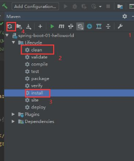
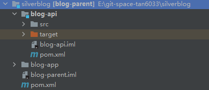

# 1 环境搭建

## 1.x 搭建过程中遇到的一些问题

### 1.x.1

> 17:23:45 [ERROR] ‘dependencies.dependency.version’ for com.baomidou:mybatis-plus-boot-starter:jar is missing. @ line 77, column 21
> 17:23:45 [ERROR] ‘dependencies.dependency.version’ for com.baomidou:mybatis-plus-generator:jar is missing. @ line 81, column 21
> 17:23:45 [ERROR] ‘dependencies.dependency.version’ for cn.hutool:hutool-all:jar must be a valid version but is ‘${hutool.version}’. @ line 109, column 22
> 17:23:45 [ERROR] ‘dependencies.dependency.version’ for io.github.swagger2markup:swagger2markup:jar is missing. @ line 120, column 21
> 17:23:45 [ERROR] ‘dependencies.dependency.version’ for com.squareup.okhttp3:okhttp:jar is missing. @ line 145, column 21

子工程中<dependency>加上版本号，解决

### 1.x.2 

> Could not transfer artifact org.apache.maven.shared:maven-common-artifact-filters:pom:3.2.0 from/to nexus-aliyun

更改idea中的settings设置，解决证书等问题
向File - settings中的maven - importing中添加这句

```
-Dmaven.wagon.http.ssl.insecure=true -Dmaven.wagon.http.ssl.allowall=true
```

### 1.x.3 Maven错误通用五步走



1、刷新pom

2、clean

3、install

4、删.idea /.iml

5、InvalidCaches And Restart


### 1.x.4 前后端分离项目前端启动相关

今天在做码神之路的个人博客练手小项目时，发现前端代码居然不用导进我的springboot项目里，就能够正常和spingboot里的后端代码联系起来。这看的我云里雾里，脑袋里有许多的问号，毕竟我真的没有接触过东西，觉得奇妙又头疼。

研究了一个多小时之后，我才成功的在npm平台上启动前端项目，以下是从无到有用npm启动前端项目的步骤：

1. 下载Nodejs
下载Nodejs，要较新版本的，新版本里集合了npm，不用我们自己去下载，官网点下载，非常方便

2. 进入命令环境
打开电脑自带的命令提示符（搜索cmd就能找到），输入 npm --version，如果能显示出npm的版本号，则说明下载成功

3. 下载运行
 仍然是在cmd里，跳转到前端项目所在的目录，执行以下三步：

 ```bash
npm install      
npm run build
npm run dev
 ```

前端项目就成功跑起来啦！

显示项目启动路径，表名项目启动成功

4. 关闭项目：
在cmd中键入：ctrl+c

5. 关闭端口号
   如果忘记关闭项目就退出cmd命名窗口，运行着前端项目的端口号就会一直被占用，这时候就需要手动关闭端口号，具体步骤如下：

  1、点击开始菜单选择运行（win+r），接着在运行对话框中输入“cmd”，回车打开命令提示符窗口，然后在窗口中输入 netstat  -ano，回车，之后就会显示所有的端口占用情况；

  2、继续输入【netstat -aon|findstr "端口"】，那么我现在需要找8888端口，在窗口中输入 netstat -nao|findstr 8888，回车之后就可以看见列表中的PID。根据PID在电脑的任务管理器中查看对应的占用程序，然后将其关闭即可；

  3、可以看到占有8888这个程序的进程ID：7688，继续输入命令【tasklist|findstr "7688"】，7688就是进程ID，可以看到进程名为 node.exe ；

  4、打开任务管理器（方法一快捷键：Ctrl+Shift+Esc，方法二：在桌面右下方菜单栏鼠标单次右击，然后点击弹出的 启动任务管理器） 在进程中找到对应的进程（node.exe）鼠标右击，结束进程


### 1.x.5 

> 添加<dependencyManagement>标签后maven没有Dependencies目录

1、删掉<dependencyManagement>

2、刷新maven

3、添加回去，解决


## 1.1 新建Maven工程



### 1.1.1 父工程pom

```xml
<?xml version="1.0" encoding="UTF-8"?>
<project xmlns="http://maven.apache.org/POM/4.0.0"
         xmlns:xsi="http://www.w3.org/2001/XMLSchema-instance"
         xsi:schemaLocation="http://maven.apache.org/POM/4.0.0 http://maven.apache.org/xsd/maven-4.0.0.xsd">
    <modelVersion>4.0.0</modelVersion>
    <groupId>com.silverflash</groupId>
    <artifactId>blog-parent</artifactId>
    <version>1.0-SNAPSHOT</version>

    <packaging>pom</packaging><!--父工程标记-->

    <parent>
        <groupId>org.springframework.boot</groupId>
        <artifactId>spring-boot-starter-parent</artifactId>
        <version>2.5.0</version>
        <relativePath/>
    </parent>

    <modules>
        <module>blog-api</module>
    </modules>

    <properties>
        <project.build.sourceEncoding>UTF-8</project.build.sourceEncoding>
        <project.reporting.outputEncoding>UTF-8</project.reporting.outputEncoding>
        <java.version>1.8</java.version>
    </properties>

<!--    添加这个标签后-->
   <dependencyManagement>
        <dependencies>

            <dependency>
                <groupId>org.springframework.boot</groupId>
                <artifactId>spring-boot-starter</artifactId>
            </dependency>


            <dependency>
                <groupId>org.springframework.boot</groupId>
                <artifactId>spring-boot-starter-aop</artifactId>
            </dependency>

            <dependency>
                <groupId>org.springframework.boot</groupId>
                <artifactId>spring-boot-starter-mail</artifactId>
            </dependency>
            <dependency>
                <groupId>org.springframework.boot</groupId>
                <artifactId>spring-boot-starter-web</artifactId>
            </dependency>

            <dependency>
                <groupId>org.springframework.boot</groupId>
                <artifactId>spring-boot-starter-test</artifactId>
                <scope>test</scope>
            </dependency>

            <dependency>
                <groupId>org.springframework.boot</groupId>
                <artifactId>spring-boot-starter-data-redis</artifactId>
            </dependency>

            <dependency>
                <groupId>com.baomidou</groupId>
                <artifactId>mybatis-plus-boot-starter</artifactId>
                <version>3.4.3</version>
            </dependency>

            <dependency>
                <groupId>com.alibaba</groupId>
                <artifactId>fastjson</artifactId>
                <version>1.2.76</version>
            </dependency>

            <dependency>
                <groupId>mysql</groupId>
                <artifactId>mysql-connector-java</artifactId>
            </dependency>

            <dependency>
                <groupId>org.springframework.boot</groupId>
                <artifactId>spring-boot-configuration-processor</artifactId>
                <optional>true</optional>
            </dependency>

            <dependency>
                <groupId>org.apache.commons</groupId>
                <artifactId>commons-lang3</artifactId>
            </dependency>

            <dependency>
                <groupId>commons-collections</groupId>
                <artifactId>commons-collections</artifactId>
                <version>3.2.2</version>
            </dependency>


            <dependency>
                <groupId>org.projectlombok</groupId>
                <artifactId>lombok</artifactId>
            </dependency>

            <!-- https://mvnrepository.com/artifact/joda-time/joda-time -->
            <dependency>
                <groupId>joda-time</groupId>
                <artifactId>joda-time</artifactId>
                <version>2.10.10</version>
            </dependency>
        </dependencies>
   </dependencyManagement>

    <build>
        <plugins>
            <plugin>
                <groupId>org.springframework.boot</groupId>
                <artifactId>spring-boot-maven-plugin</artifactId>
            </plugin>
        </plugins>
    </build>

</project>
```

### 1.1.2 blog-api的pom

```xml
<?xml version="1.0" encoding="UTF-8"?>
<project xmlns="http://maven.apache.org/POM/4.0.0"
         xmlns:xsi="http://www.w3.org/2001/XMLSchema-instance"
         xsi:schemaLocation="http://maven.apache.org/POM/4.0.0 http://maven.apache.org/xsd/maven-4.0.0.xsd">
    <modelVersion>4.0.0</modelVersion>
    <artifactId>blog-api</artifactId>
    <parent>
        <artifactId>blog-parent</artifactId>
        <groupId>com.silverflash</groupId>
        <version>1.0-SNAPSHOT</version>
    </parent>

    <properties>
    </properties>

    <dependencies>
        <dependency>
            <groupId>org.springframework.boot</groupId>
            <artifactId>spring-boot-starter</artifactId>
        </dependency>


        <dependency>
            <groupId>org.springframework.boot</groupId>
            <artifactId>spring-boot-starter-aop</artifactId>
        </dependency>

        <dependency>
            <groupId>org.springframework.boot</groupId>
            <artifactId>spring-boot-starter-mail</artifactId>
        </dependency>
        <dependency>
            <groupId>org.springframework.boot</groupId>
            <artifactId>spring-boot-starter-web</artifactId>
        </dependency>

        <dependency>
            <groupId>org.springframework.boot</groupId>
            <artifactId>spring-boot-starter-test</artifactId>
            <scope>test</scope>
        </dependency>

        <dependency>
            <groupId>org.springframework.boot</groupId>
            <artifactId>spring-boot-starter-data-redis</artifactId>
        </dependency>

<!--        这个要加版本号-->
        <dependency>
            <groupId>com.baomidou</groupId>
            <artifactId>mybatis-plus-boot-starter</artifactId>
            <version>3.4.3</version>
        </dependency>

        <dependency>
            <groupId>com.alibaba</groupId>
            <artifactId>fastjson</artifactId>
            <version>1.2.76</version>
        </dependency>

        <dependency>
            <groupId>mysql</groupId>
            <artifactId>mysql-connector-java</artifactId>
        </dependency>

        <dependency>
            <groupId>org.springframework.boot</groupId>
            <artifactId>spring-boot-configuration-processor</artifactId>
            <optional>true</optional>
        </dependency>

        <dependency>
            <groupId>org.apache.commons</groupId>
            <artifactId>commons-lang3</artifactId>
        </dependency>

        <dependency>
            <groupId>commons-collections</groupId>
            <artifactId>commons-collections</artifactId>
            <version>3.2.2</version>
        </dependency>


        <dependency>
            <groupId>org.projectlombok</groupId>
            <artifactId>lombok</artifactId>
        </dependency>

        <!-- https://mvnrepository.com/artifact/joda-time/joda-time -->
        <dependency>
            <groupId>joda-time</groupId>
            <artifactId>joda-time</artifactId>
            <version>2.10.10</version>
        </dependency>
    </dependencies>

</project>
```

## 1.2 启动类

```java
package com.silverflash.blog;

import org.springframework.boot.SpringApplication;
import org.springframework.boot.autoconfigure.SpringBootApplication;

@SpringBootApplication
public class App {
    public static void main(String[] args) {
        SpringApplication.run(App.class,args);
    }
}
```


## 1.3 application.yml

```yml
server:
  port: 8888

#项目名称
spring:
  application:
    name: silverflash_blog
  #数据库
  datasource:
    url: jdbc:mysql://localhost:3306/blog?useUnicode=true&characterEncoding=UTF-8&serverTimeZone=UTC
    username: root
    password: root
    driver-class-name: com.mysql.cj.jdbc.Driver

#mybatis-plus
mybatis-plus:
  configuration:
    log-impl: org.apache.ibatis.logging.stdout.StdOutImpl
  global-config:
    db-config:
      table-prefix: ms_
```


## 1.3 配置MybatisPlusConfig

```java
package com.silverflash.blog.config;

import com.baomidou.mybatisplus.extension.plugins.MybatisPlusInterceptor;
import com.baomidou.mybatisplus.extension.plugins.inner.PaginationInnerInterceptor;
import org.mybatis.spring.annotation.MapperScan;
import org.springframework.context.annotation.Bean;
import org.springframework.context.annotation.Configuration;

@Configuration
@MapperScan("com.silver.blog.mapper")
public class MybatisPlusConfig {
    //分页插件
    @Bean
    public MybatisPlusInterceptor mybatisPlusInterceptor(){
        MybatisPlusInterceptor interceptor = new MybatisPlusInterceptor();
        interceptor.addInnerInterceptor(new PaginationInnerInterceptor());
        return interceptor;
    }
}

```

## 1.4 配置WebMvcConfig

```java
package com.silverflash.blog.config;

import org.springframework.context.annotation.Configuration;
import org.springframework.web.servlet.config.annotation.CorsRegistry;
import org.springframework.web.servlet.config.annotation.WebMvcConfigurer;

@Configuration
public class WebMvcConfig implements WebMvcConfigurer {

    /**
     * 跨域配置
     * @param registry
     */
    @Override
    public void addCorsMappings(CorsRegistry registry) {
        //8080端口访问我们后端的8888端口，有跨域
        registry.addMapping("/**")
                .allowedOrigins("http://localhost:8080");
    }
}
```


# 2 接口开发

## 2.1 首页-文章列表

### 2.1.1 接口说明

* 接口url：/articles

* 请求方式：POST

* 请求参数：

| 参数名称 | 参数类型 | 说明           |
| -------- | -------- | -------------- |
| page     | int      | 当前页数       |
| pageSize | int      | 每页显示的数量 |

* 测试用例：

localhost:8888/articles

```json
{"page":1,"pageSize":5,"name":"a.createDate","sort":"desc"}
```

* 返回数据：

~~~json
{
    "success": true,
    "code": 200,
    "msg": "success",
    "data": [
        {
            "id": 1,
            "title": "springboot介绍以及入门案例",
            "summary": "通过Spring Boot实现的服务，只需要依靠一个Java类，把它打包成jar，并通过`java -jar`命令就可以运行起来。\r\n\r\n这一切相较于传统Spring应用来说，已经变得非常的轻便、简单。",
            "commentCounts": 2,
            "viewCounts": 54,
            "weight": 1,
            "createDate": "2609-06-26 15:58",
            "author": "12",
            "body": null,
            "tags": [
                {
                    "id": 5,
                    "avatar": null,
                    "tagName": "444"
                },
                {
                    "id": 7,
                    "avatar": null,
                    "tagName": "22"
                },
                {
                    "id": 8,
                    "avatar": null,
                    "tagName": "11"
                }
            ],
            "categorys": null
        },
        {
            "id": 9,
            "title": "Vue.js 是什么",
            "summary": "Vue (读音 /vjuː/，类似于 view) 是一套用于构建用户界面的渐进式框架。",
            "commentCounts": 0,
            "viewCounts": 3,
            "weight": 0,
            "createDate": "2609-06-27 11:25",
            "author": "12",
            "body": null,
            "tags": [
                {
                    "id": 7,
                    "avatar": null,
                    "tagName": "22"
                }
            ],
            "categorys": null
        },
        {
            "id": 10,
            "title": "Element相关",
            "summary": "本节将介绍如何在项目中使用 Element。",
            "commentCounts": 0,
            "viewCounts": 3,
            "weight": 0,
            "createDate": "2609-06-27 11:25",
            "author": "12",
            "body": null,
            "tags": [
                {
                    "id": 5,
                    "avatar": null,
                    "tagName": "444"
                },
                {
                    "id": 6,
                    "avatar": null,
                    "tagName": "33"
                },
                {
                    "id": 7,
                    "avatar": null,
                    "tagName": "22"
                },
                {
                    "id": 8,
                    "avatar": null,
                    "tagName": "11"
                }
            ],
            "categorys": null
        }
    ]
}
~~~

